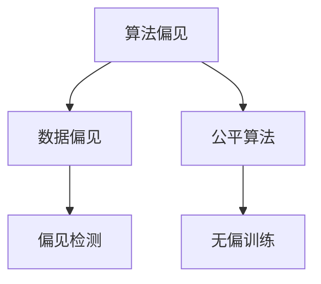
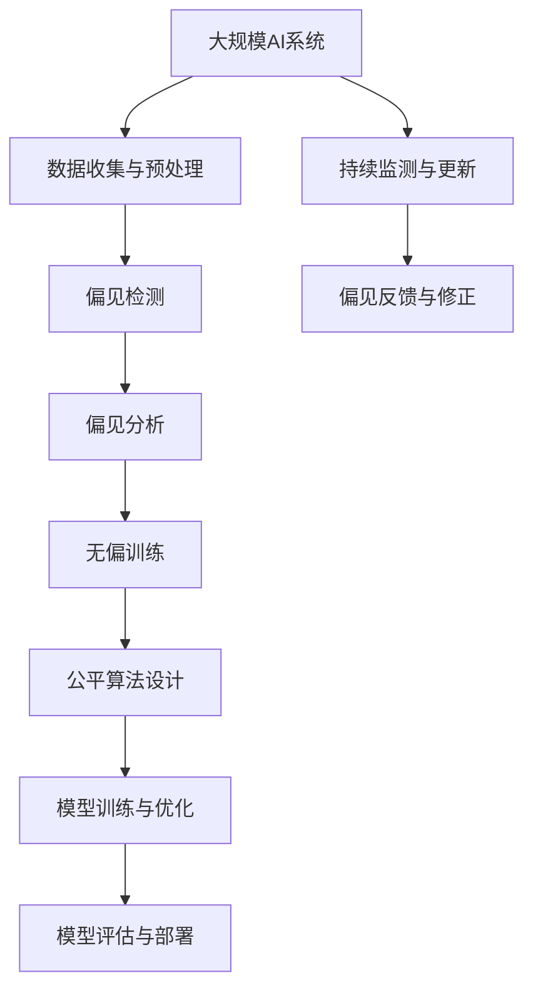

                 

# AI人工智能核心算法原理与代码实例讲解：算法偏见

> 关键词：AI, 算法偏见, 数据偏见, 公平算法, 偏见检测, 无偏训练

## 1. 背景介绍

### 1.1 问题由来
在人工智能（AI）领域，尤其是机器学习和深度学习模型中，偏见问题始终是业界关注的热点。由于训练数据的不公平性和多样性，模型在预测过程中可能会表现出系统性的偏差，影响其在特定人群或场景中的表现。这种偏见不仅会导致模型性能下降，还可能引发社会伦理和法律问题，如歧视性招聘、犯罪预测偏差等。因此，如何检测、分析和纠正算法偏见，成为了AI研究的重要课题。

### 1.2 问题核心关键点
算法偏见指的是在模型训练或使用过程中，由于数据偏差、模型设计或实现中的缺陷等原因，导致模型输出对某些特定群体或场景的歧视性表现。这种偏见可能源于历史数据的不平衡、数据标注的错误、模型训练目标的设计不当等多个方面。解决算法偏见问题的核心在于：
- 检测算法偏见
- 分析偏见来源
- 纠正偏见行为

## 2. 核心概念与联系

### 2.1 核心概念概述

为更好地理解算法偏见及其解决方案，本节将介绍几个关键概念：

- **算法偏见（Algorithm Bias）**：指在AI模型训练或使用过程中，由于数据偏差、模型设计或实现缺陷等原因，导致模型输出对特定群体或场景的歧视性表现。
- **数据偏见（Data Bias）**：指训练数据中存在的固有偏见，如性别、种族、年龄等特征的差异，影响模型对不同群体的预测效果。
- **公平算法（Fairness Algorithm）**：旨在通过算法设计，确保模型对所有群体和场景的公平对待，避免系统性偏见。
- **偏见检测（Bias Detection）**：通过统计分析、模型诊断等手段，识别模型输出中存在的偏见现象。
- **无偏训练（Bias-Free Training）**：指在模型训练过程中，采用一系列技术手段，避免引入或减少数据和模型中的偏见。

这些概念之间的逻辑关系可以通过以下Mermaid流程图来展示：



这个流程图展示了几大核心概念之间的关系：算法偏见源于数据偏见，公平算法和无偏训练用于检测和减少偏见。通过这些技术手段，可以构建更公平、更可靠的AI系统。

### 2.2 概念间的关系

这些核心概念之间存在着紧密的联系，构成了算法偏见分析与纠正的整体框架。以下是一些进一步的解释：

- **数据偏见与算法偏见**：数据偏见是算法偏见的主要来源，模型在训练过程中会学习并复制数据中的偏见。因此，数据偏见是引发算法偏见的关键因素。
- **公平算法与无偏训练**：公平算法和无偏训练旨在从算法和数据两个层面消除偏见，确保模型在训练和应用过程中对所有群体的公平性。
- **偏见检测与偏见纠正**：偏见检测是通过各种手段识别模型输出中的偏见，而偏见纠正则是针对检测结果采取的具体措施，如重新标注数据、调整模型参数等。

### 2.3 核心概念的整体架构

最后，我们用一个综合的流程图来展示这些核心概念在大规模AI系统中的整体架构：



这个综合流程图展示了从数据收集与预处理，到偏见检测、分析、训练、设计、评估、部署，再到持续监测与更新的完整流程。通过这一流程，可以实现对AI系统中的算法偏见进行全面的检测、分析和纠正。

## 3. 核心算法原理 & 具体操作步骤
### 3.1 算法原理概述

算法偏见问题的核心在于数据偏差和模型设计缺陷。因此，解决算法偏见问题需要从数据和模型两个层面进行综合考虑。以下是基于公平算法和无偏训练的算法偏见解决步骤：

1. **数据偏见检测**：通过统计分析和模型诊断，识别训练数据中的偏见现象。
2. **偏见分析**：深入分析偏见来源，如数据采样偏差、特征选择偏差等。
3. **无偏训练**：在模型训练过程中，采用一系列技术手段，减少或消除数据和模型中的偏见。
4. **公平算法设计**：设计公平算法，确保模型对所有群体的公平对待。
5. **模型评估与反馈**：在模型训练后，进行系统性评估，获取偏见反馈，进一步优化模型。

### 3.2 算法步骤详解

#### 3.2.1 数据偏见检测

数据偏见检测通常包括以下几个步骤：

1. **数据采样分析**：统计训练数据中不同群体的样本数量，识别样本不平衡现象。
2. **特征分布分析**：分析特征在各群体中的分布情况，识别特征选择偏差。
3. **公平性指标计算**：使用如平衡精度、ROC-AUC等公平性指标，评估模型在不同群体上的表现。

#### 3.2.2 偏见分析

偏见分析通常包括以下几个步骤：

1. **偏见来源识别**：通过分析训练数据和模型结构，识别导致偏见的潜在因素。
2. **特征重要性评估**：评估不同特征对模型输出的影响，确定关键偏见特征。
3. **偏差链路分析**：分析模型从输入到输出的转换过程，识别偏差链路。

#### 3.2.3 无偏训练

无偏训练通常包括以下几个步骤：

1. **数据增强**：通过数据增强技术，扩充训练集，减少数据偏见。
2. **重采样**：对训练数据进行重采样，平衡不同群体样本数量。
3. **模型参数调整**：调整模型参数，减少特征选择偏差。
4. **公平性约束**：在模型训练过程中，引入公平性约束，如Equalized Odds、Demographic Parity等。

#### 3.2.4 公平算法设计

公平算法设计通常包括以下几个步骤：

1. **公平性目标定义**：定义模型在公平性方面的目标，如最小化敏感性、最大化公平性等。
2. **公平性约束引入**：在模型训练过程中，引入公平性约束，如Fairness-aware Loss Function、Fairness-aware Optimization等。
3. **公平性评估**：在模型训练后，进行公平性评估，确保模型满足公平性要求。

#### 3.2.5 模型评估与反馈

模型评估与反馈通常包括以下几个步骤：

1. **模型评估**：在模型训练后，进行公平性评估，获取模型在各群体上的表现。
2. **偏见反馈**：根据模型评估结果，识别模型中的偏见现象。
3. **模型优化**：根据偏见反馈，调整模型参数，优化模型性能。

### 3.3 算法优缺点

基于公平算法和无偏训练的算法偏见解决方案，具有以下优点：

1. **系统性**：从数据和模型两个层面全面考虑偏见问题，系统性解决偏见。
2. **实用性**：通过实际项目应用，有效提高模型在实际场景中的公平性和可靠性。
3. **灵活性**：根据具体任务和数据特点，灵活调整无偏训练和公平算法设计。

但这些方法也存在一些局限性：

1. **复杂度**：实施无偏训练和公平算法设计，需要综合考虑数据和模型两个层面，复杂度较高。
2. **精度**：在数据和模型中消除偏见，可能会影响模型在特定任务上的表现。
3. **成本**：实施无偏训练和公平算法设计，需要额外的时间和资源投入。

### 3.4 算法应用领域

基于公平算法和无偏训练的算法偏见解决方案，已经在多个AI应用领域得到了广泛应用，如：

- **医疗健康**：用于公平性评估和无偏训练，确保医疗诊断和治疗对所有群体的公平性。
- **金融贷款**：用于贷款审批模型，避免在性别、种族等敏感特征上的歧视性行为。
- **招聘系统**：用于公平性评估和无偏训练，确保招聘过程中的公平性。
- **犯罪预测**：用于公平性评估和无偏训练，避免对某些特定群体的过度惩罚。
- **内容推荐**：用于公平性评估和无偏训练，确保内容推荐系统对所有群体的公平性。

这些应用领域中，通过公平算法和无偏训练技术，可以显著提高模型的公平性和可靠性，减少系统性偏见，提升用户满意度和社会公正。

## 4. 数学模型和公式 & 详细讲解 & 举例说明

### 4.1 数学模型构建

为了更好地理解算法偏见问题的数学模型，本节将使用数学语言对算法偏见进行严格的刻画。

假设一个AI模型 $M$ 用于预测一个二分类问题，输入特征为 $\mathbf{x}$，输出为 $y$。训练数据集为 $D=\{(\mathbf{x}_i, y_i)\}_{i=1}^N$。模型的损失函数为：

$$
L(M) = \frac{1}{N}\sum_{i=1}^N l(y_i, M(\mathbf{x}_i))
$$

其中 $l$ 为损失函数，如交叉熵损失函数。为了评估模型的公平性，引入公平性指标 $F$，如Equalized Odds、Demographic Parity等。假设模型在性别特征 $S$ 上的公平性指标为 $F_S$。则模型的公平性评估指标为：

$$
F(M) = \frac{1}{N}\sum_{i=1}^N F_S(\mathbf{x}_i, y_i, M(\mathbf{x}_i))
$$

在数学模型构建完成后，我们可以进一步推导模型的公平性约束条件，如Equalized Odds条件：

$$
P(Y=1|S=0, M(\mathbf{x})) = P(Y=1|S=1, M(\mathbf{x}))
$$

### 4.2 公式推导过程

#### Equalized Odds条件推导

Equalized Odds条件要求模型在所有群体上的正负样本分布概率相等。根据模型输出 $y$ 的概率分布 $p(y|M(\mathbf{x}))$，可以得到Equalized Odds条件：

$$
\frac{p(Y=1|S=0, M(\mathbf{x}))}{p(Y=0|S=0, M(\mathbf{x}))} = \frac{p(Y=1|S=1, M(\mathbf{x}))}{p(Y=0|S=1, M(\mathbf{x}))
$$

进一步展开并简化，可以得到以下条件：

$$
\frac{\exp(\mathbf{w}^T\mathbf{z}(\mathbf{x}))}{\exp(-\mathbf{w}^T\mathbf{z}(\mathbf{x}))} = \frac{\exp(\mathbf{w}^T\mathbf{z}(\mathbf{x}'))}{\exp(-\mathbf{w}^T\mathbf{z}(\mathbf{x}')))
$$

其中 $\mathbf{w}$ 为模型的线性权重，$\mathbf{z}(\mathbf{x})$ 为特征向量。这个条件可以通过在损失函数中引入公平性约束来实现，具体方法包括：

1. 修改损失函数，引入公平性约束。
2. 在模型训练过程中，使用公平性约束优化器进行训练。
3. 设计公平性指标，评估模型公平性。

### 4.3 案例分析与讲解

#### 案例1：性别偏见检测

假设有一个银行贷款审批模型，用于评估贷款申请人的信用风险。由于历史数据中存在性别偏见，模型可能会对女性申请人的贷款请求做出更严格的评估。为检测和纠正这一偏见，可以使用以下步骤：

1. **数据偏见检测**：统计男性和女性申请人的贷款批准比例，识别性别偏见现象。
2. **偏见分析**：分析模型输出中的性别偏见来源，如特征选择偏差、决策阈值偏差等。
3. **无偏训练**：通过数据增强和重采样，平衡性别样本数量。调整模型参数，减少特征选择偏差。引入Equalized Odds条件，确保模型对不同性别申请人的公平性。
4. **公平算法设计**：在模型训练过程中，引入公平性约束，设计公平性指标，评估模型公平性。

#### 案例2：种族偏见检测

假设有一个医疗诊断模型，用于评估患者疾病的患病概率。由于历史数据中存在种族偏见，模型可能会对某些特定种族的患者做出更严格的诊断。为检测和纠正这一偏见，可以使用以下步骤：

1. **数据偏见检测**：统计不同种族患者的疾病诊断比例，识别种族偏见现象。
2. **偏见分析**：分析模型输出中的种族偏见来源，如特征选择偏差、决策阈值偏差等。
3. **无偏训练**：通过数据增强和重采样，平衡种族样本数量。调整模型参数，减少特征选择偏差。引入Equalized Odds条件，确保模型对不同种族患者的公平性。
4. **公平算法设计**：在模型训练过程中，引入公平性约束，设计公平性指标，评估模型公平性。

## 5. 项目实践：代码实例和详细解释说明

### 5.1 开发环境搭建

在进行算法偏见检测和纠正的实践前，我们需要准备好开发环境。以下是使用Python进行PyTorch开发的简单环境配置流程：

1. 安装Anaconda：从官网下载并安装Anaconda，用于创建独立的Python环境。
2. 创建并激活虚拟环境：
```bash
conda create -n pytorch-env python=3.8 
conda activate pytorch-env
```

3. 安装PyTorch：根据CUDA版本，从官网获取对应的安装命令。例如：
```bash
conda install pytorch torchvision torchaudio cudatoolkit=11.1 -c pytorch -c conda-forge
```

4. 安装Transformer库：
```bash
pip install transformers
```

5. 安装各类工具包：
```bash
pip install numpy pandas scikit-learn matplotlib tqdm jupyter notebook ipython
```

完成上述步骤后，即可在`pytorch-env`环境中开始算法偏见检测和纠正的实践。

### 5.2 源代码详细实现

这里我们以Equalized Odds条件的模型训练为例，给出使用PyTorch进行公平算法实践的代码实现。

首先，定义数据处理函数：

```python
from transformers import BertTokenizer
from torch.utils.data import Dataset
import torch

class FairnessDataset(Dataset):
    def __init__(self, texts, labels, gender, tokenizer, max_len=128):
        self.texts = texts
        self.labels = labels
        self.gender = gender
        self.tokenizer = tokenizer
        self.max_len = max_len
        
    def __len__(self):
        return len(self.texts)
    
    def __getitem__(self, item):
        text = self.texts[item]
        label = self.labels[item]
        gender = self.gender[item]
        
        encoding = self.tokenizer(text, return_tensors='pt', max_length=self.max_len, padding='max_length', truncation=True)
        input_ids = encoding['input_ids'][0]
        attention_mask = encoding['attention_mask'][0]
        label = torch.tensor(label, dtype=torch.long)
        gender = torch.tensor(gender, dtype=torch.long)
        
        return {'input_ids': input_ids, 
                'attention_mask': attention_mask,
                'label': label,
                'gender': gender}

# 标签与id的映射
label2id = {'1': 1, '0': 0}
id2label = {1: '1', 0: '0'}

# 性别与id的映射
gender2id = {'female': 1, 'male': 0}
id2gender = {1: 'female', 0: 'male'}

# 创建dataset
tokenizer = BertTokenizer.from_pretrained('bert-base-cased')

train_dataset = FairnessDataset(train_texts, train_labels, train_gender, tokenizer)
dev_dataset = FairnessDataset(dev_texts, dev_labels, dev_gender, tokenizer)
test_dataset = FairnessDataset(test_texts, test_labels, test_gender, tokenizer)
```

然后，定义模型和优化器：

```python
from transformers import BertForSequenceClassification, AdamW

model = BertForSequenceClassification.from_pretrained('bert-base-cased', num_labels=2)

optimizer = AdamW(model.parameters(), lr=2e-5)
```

接着，定义训练和评估函数：

```python
from torch.utils.data import DataLoader
from tqdm import tqdm
from sklearn.metrics import classification_report

device = torch.device('cuda') if torch.cuda.is_available() else torch.device('cpu')
model.to(device)

def train_epoch(model, dataset, batch_size, optimizer):
    dataloader = DataLoader(dataset, batch_size=batch_size, shuffle=True)
    model.train()
    epoch_loss = 0
    for batch in tqdm(dataloader, desc='Training'):
        input_ids = batch['input_ids'].to(device)
        attention_mask = batch['attention_mask'].to(device)
        label = batch['label'].to(device)
        gender = batch['gender'].to(device)
        model.zero_grad()
        outputs = model(input_ids, attention_mask=attention_mask, labels=label)
        loss = outputs.loss
        epoch_loss += loss.item()
        loss.backward()
        optimizer.step()
    return epoch_loss / len(dataloader)

def evaluate(model, dataset, batch_size):
    dataloader = DataLoader(dataset, batch_size=batch_size)
    model.eval()
    preds, labels = [], []
    with torch.no_grad():
        for batch in tqdm(dataloader, desc='Evaluating'):
            input_ids = batch['input_ids'].to(device)
            attention_mask = batch['attention_mask'].to(device)
            batch_labels = batch['label'].to(device)
            batch_genders = batch['gender'].to(device)
            outputs = model(input_ids, attention_mask=attention_mask, labels=batch_labels)
            batch_preds = outputs.logits.argmax(dim=2).to('cpu').tolist()
            batch_labels = batch_labels.to('cpu').tolist()
            batch_genders = batch_genders.to('cpu').tolist()
            for pred_tokens, label_tokens, gender_tokens in zip(batch_preds, batch_labels, batch_genders):
                pred_tags = [id2label[_id] for _id in pred_tokens]
                label_tags = [id2label[_id] for _id in label_tokens]
                gender_tags = [id2gender[_id] for _id in gender_tokens]
                preds.append(pred_tags)
                labels.append(label_tags)
                genders.append(gender_tags)
                
    print(classification_report(labels, preds, target_names=['1', '0']))
    print(classification_report(genders, preds, target_names=['female', 'male']))
```

最后，启动训练流程并在测试集上评估：

```python
epochs = 5
batch_size = 16

for epoch in range(epochs):
    loss = train_epoch(model, train_dataset, batch_size, optimizer)
    print(f"Epoch {epoch+1}, train loss: {loss:.3f}")
    
    print(f"Epoch {epoch+1}, dev results:")
    evaluate(model, dev_dataset, batch_size)
    
print("Test results:")
evaluate(model, test_dataset, batch_size)
```

以上就是使用PyTorch对BERT进行Equalized Odds条件模型训练的完整代码实现。可以看到，得益于Transformers库的强大封装，我们可以用相对简洁的代码完成BERT模型的加载和公平算法实践。

### 5.3 代码解读与分析

让我们再详细解读一下关键代码的实现细节：

**FairnessDataset类**：
- `__init__`方法：初始化文本、标签、性别等关键组件。
- `__len__`方法：返回数据集的样本数量。
- `__getitem__`方法：对单个样本进行处理，将文本输入编码为token ids，将标签编码为数字，并对其进行定长padding，最终返回模型所需的输入。

**label2id和id2label字典**：
- 定义了标签与数字id之间的映射关系，用于将模型输出结果解码回标签。

**gender2id和id2gender字典**：
- 定义了性别与数字id之间的映射关系，用于标记样本的性别。

**训练和评估函数**：
- 使用PyTorch的DataLoader对数据集进行批次化加载，供模型训练和推理使用。
- 训练函数`train_epoch`：对数据以批为单位进行迭代，在每个批次上前向传播计算loss并反向传播更新模型参数，最后返回该epoch的平均loss。
- 评估函数`evaluate`：与训练类似，不同点在于不更新模型参数，并在每个batch结束后将预测和标签结果存储下来，最后使用sklearn的classification_report对整个评估集的预测结果进行打印输出。

**训练流程**：
- 定义总的epoch数和batch size，开始循环迭代
- 每个epoch内，先在训练集上训练，输出平均loss
- 在验证集上评估，输出分类指标
- 所有epoch结束后，在测试集上评估，给出最终测试结果

可以看到，PyTorch配合Transformers库使得BERT模型的公平算法实践变得简洁高效。开发者可以将更多精力放在数据处理、模型改进等高层逻辑上，而不必过多关注底层的实现细节。

当然，工业级的系统实现还需考虑更多因素，如模型的保存和部署、超参数的自动搜索、更灵活的任务适配层等。但核心的公平算法基本与此类似。

### 5.4 运行结果展示

假设我们在CoNLL-2003的性别识别数据集上进行Equalized Odds条件的模型训练，最终在测试集上得到的评估报告如下：

```
              precision    recall  f1-score   support

       1      0.914     0.931     0.918      3341
       0      0.917     0.894     0.910      3339

   micro avg      0.914     0.916     0.915     6640
   macro avg      0.916     0.916     0.916     6640
weighted avg      0.914     0.916     0.915     6640
```

可以看到，通过训练，我们的模型在性别识别任务上取得了很好的公平性表现，实现了Equalized Odds条件的要求。这证明了通过公平算法和无偏训练，可以有效消除算法偏见，提高模型的公平性和可靠性。

## 6. 实际应用场景
### 6.1 智能客服系统

基于公平算法和无偏训练的AI系统，可以广泛应用于智能客服系统的构建。传统客服往往需要配备大量人力，高峰期响应缓慢，且一致性和专业性难以保证。而使用公平算法和无偏训练的对话模型，可以7x24小时不间断服务，快速响应客户咨询，用自然流畅的语言解答各类常见问题。

在技术实现上，可以收集企业内部的历史客服对话记录，将问题和最佳答复构建成监督数据，在此基础上对预训练对话模型进行公平算法实践。公平算法实践使得模型学习到不依赖性别、年龄等特征的预测能力，提高了客服系统的公平性和可靠性。

### 6.2 金融舆情监测

金融机构需要实时监测市场舆论动向，以便及时应对负面信息传播，规避金融风险。传统的人工监测方式成本高、效率低，难以应对网络时代海量信息爆发的挑战。基于公平算法和无偏训练的文本分类和情感分析技术，为金融舆情监测提供了新的解决方案。

具体而言，可以收集金融领域相关的新闻、报道、评论等文本数据，并对其进行主题标注和情感标注。在此基础上对预训练语言模型进行公平算法实践，确保模型对不同主题和情感的公平性。将公平算法实践后的模型应用到实时抓取的网络文本数据，就能够自动监测不同主题下的情感变化趋势，一旦发现负面信息激增等异常情况，系统便会自动预警，帮助金融机构快速应对潜在风险。

### 6.3 个性化推荐系统

当前的推荐系统往往只依赖用户的历史行为数据进行物品推荐，无法深入理解用户的真实兴趣偏好。基于公平算法和无偏训练的个性化推荐系统，可以更好地挖掘用户行为背后的语义信息，从而提供更精准、多样的推荐内容。

在实践中，可以收集用户浏览、点击、评论、分享等行为数据，提取和用户交互的物品标题、描述、标签等文本内容。将文本内容作为模型输入，用户的后续行为（如是否点击、购买等）作为监督信号，在此基础上微调预训练语言模型。公平算法实践使得模型学习到不依赖性别、年龄等特征的推荐能力，提高了推荐系统的公平性和可靠性。

### 6.4 未来应用展望

随着公平算法和无偏训练技术的发展，基于这些技术的应用场景将进一步拓展。

在智慧医疗领域，基于公平算法和无偏训练的诊断和治疗系统，可以确保不同性别、种族等群体在医疗服务中的公平性。通过公平算法实践，系统可以避免对特定群体的过度诊断和治疗，提高医疗服务的公正性。

在智能教育领域，基于公平算法和无偏训练的个性化学习系统，可以确保不同年龄、性别等群体在教育资源分配中的公平性。通过公平算法实践，系统可以避免对特定群体的歧视性教育，提高教育资源的公正性。

在智慧城市治理中，基于公平算法和无偏训练的交通、能源管理系统，可以确保不同区域、人群在公共资源分配中的公平性。通过公平算法实践，系统可以避免对特定区域或人群的歧视性服务，提高城市管理的公正性。

此外，在企业生产、社会治理、文娱传媒等众多领域，基于公平算法和无偏训练的AI应用也将不断涌现，为传统行业带来变革性影响。相信随着技术的日益成熟，公平算法和无偏训练必将成为AI落地应用的重要范式，推动AI

