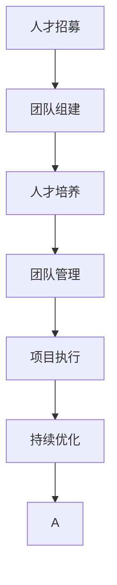

                 

# AI人才招聘与团队建设原理与代码实战案例讲解

> 关键词：
1. 人工智能 (AI) 人才招聘
2. 团队建设
3. 核心算法
4. 技术栈优化
5. 代码实现
6. 案例讲解
7. 项目管理

## 1. 背景介绍

### 1.1 问题由来

在当前快速发展的AI技术浪潮中，AI人才成为各大科技公司争相争夺的稀缺资源。企业不仅要吸引顶尖人才，还需要建设高效、创新的团队，才能在激烈的市场竞争中脱颖而出。然而，AI人才招聘和团队建设绝非易事，需要系统化的策略和科学的管理。本文将深入探讨AI人才招聘和团队建设的原理，并通过实际案例讲解，帮助读者理解如何在实际工作中应用这些原则，构建卓越的AI团队。

### 1.2 问题核心关键点

1. **人才招募**：如何通过高效的方式吸引并筛选顶尖AI人才。
2. **团队组建**：如何构建具有多样化背景和专业技能的团队，以实现创新和效率。
3. **人才培养**：如何为团队成员提供持续的学习和发展机会，提升整体能力。
4. **团队管理**：如何通过有效的管理策略，保持团队的协作和高效。
5. **项目执行**：如何组织和执行复杂的AI项目，确保项目成功交付。

### 1.3 问题研究意义

AI人才招聘和团队建设是企业AI战略成功的关键。通过系统化的策略和科学的管理，企业可以吸引并留住顶尖AI人才，构建高效创新的团队，推动AI技术的应用和创新，提升企业的竞争力和市场价值。本文旨在帮助企业理解和应用这些关键点，为AI人才招聘和团队建设提供实用指导，助力企业在AI领域的持续发展和创新。

## 2. 核心概念与联系

### 2.1 核心概念概述

为了更好地理解AI人才招聘和团队建设，我们需要掌握以下几个核心概念：

- **人工智能 (AI)**：涉及计算机科学、数学、统计学等多个学科，利用算法和数据处理技术，实现机器的智能模拟。
- **人才招募**：企业通过各种渠道吸引和选拔符合岗位需求的AI人才。
- **团队组建**：企业基于AI项目的需求，选择具有不同背景和技能的AI人才，组建跨学科、多元化的团队。
- **人才培养**：企业提供学习资源和培训机会，帮助团队成员提升技术能力和职业素养。
- **团队管理**：通过有效沟通、协作和领导，确保团队目标一致，高效运作。
- **项目执行**：企业组织和管理AI项目，确保项目按时按质完成。

### 2.2 概念间的关系

这些核心概念之间存在紧密联系，共同构成了AI人才招聘和团队建设的完整框架。以下Mermaid流程图展示了这些概念之间的逻辑关系：

```mermaid
graph TB
    A[人工智能 (AI)] --> B[人才招募]
    A --> C[团队组建]
    C --> D[人才培养]
    D --> E[团队管理]
    E --> F[项目执行]
```

### 2.3 核心概念的整体架构

最后，我们用一个综合的流程图来展示这些核心概念在AI人才招聘和团队建设中的整体架构：



## 3. 核心算法原理 & 具体操作步骤

### 3.1 算法原理概述

AI人才招聘和团队建设的核心算法主要涉及以下几个方面：

1. **人才吸引力模型**：基于历史数据和心理学原理，建立模型预测不同岗位对人才的吸引力。
2. **人才筛选算法**：使用数据挖掘和机器学习技术，从候选人才中筛选出最匹配岗位需求的人才。
3. **团队多样性模型**：基于团队效能理论，构建模型预测团队多样性对项目成功的影响。
4. **人才发展模型**：使用推荐系统和个性化学习算法，提供个性化的学习和发展机会。
5. **团队协作模型**：利用社交网络和协作工具，优化团队沟通和协作效率。
6. **项目进度管理算法**：使用甘特图和关键路径分析，确保项目按时按质完成。

### 3.2 算法步骤详解

以下是AI人才招聘和团队建设的算法步骤：

1. **人才需求分析**：通过内部访谈、数据分析等方式，明确AI项目的岗位需求和关键技能。
2. **人才吸引力评估**：基于历史数据和心理学原理，评估不同岗位对人才的吸引力，确定招聘渠道和策略。
3. **人才筛选**：使用数据挖掘和机器学习技术，从候选人库中筛选出最匹配岗位需求的人才。
4. **团队组建**：根据项目需求，选择具有多样化背景和专业技能的AI人才，组建跨学科团队。
5. **人才培养**：使用推荐系统和个性化学习算法，提供个性化的学习和发展机会。
6. **团队管理**：通过有效沟通、协作和领导，确保团队目标一致，高效运作。
7. **项目执行**：使用甘特图和关键路径分析，确保项目按时按质完成。
8. **持续优化**：通过定期评估和反馈，不断优化人才招募和团队建设策略。

### 3.3 算法优缺点

AI人才招聘和团队建设算法具有以下优点：

1. **高效性**：通过数据驱动和模型优化，大大提高了人才吸引和筛选的效率。
2. **精确性**：使用数据挖掘和机器学习技术，提高了人才筛选的准确性和质量。
3. **多样性**：基于团队效能理论，能够构建具有多样化背景和专业技能的团队。
4. **个性化**：通过推荐系统和个性化学习算法，提供个性化的学习和发展机会。
5. **协作性**：利用社交网络和协作工具，优化团队沟通和协作效率。
6. **进度控制**：使用甘特图和关键路径分析，确保项目按时按质完成。

同时，这些算法也存在一定的局限性：

1. **数据依赖**：需要大量高质量的历史数据进行模型训练和评估。
2. **模型复杂性**：算法模型复杂，需要较强的数据科学和数学基础。
3. **灵活性不足**：模型和算法过于刚性，难以应对复杂和变化多端的情况。
4. **隐私风险**：使用数据挖掘和机器学习技术，可能涉及个人隐私保护问题。

### 3.4 算法应用领域

AI人才招聘和团队建设算法在多个领域得到了广泛应用，例如：

- **科技公司**：如Google、Facebook、Amazon等，通过高效的人才吸引和团队管理，推动AI技术的研发和应用。
- **科研机构**：如斯坦福大学、麻省理工学院等，通过系统的团队建设和人才培养，提升科研能力和成果。
- **初创企业**：如DeepMind、OpenAI等，通过灵活的人才招募和团队管理，迅速占领市场。
- **教育领域**：如Coursera、edX等，通过个性化的学习和发展机会，培养AI人才。
- **医疗领域**：如Mayo Clinic、MIT Medical等，通过跨学科团队和协作工具，提升医疗AI的创新和应用。

## 4. 数学模型和公式 & 详细讲解 & 举例说明

### 4.1 数学模型构建

以下是AI人才招聘和团队建设的数学模型构建：

1. **人才吸引力模型**：
   $$
   \text{Attraction} = f(\text{JobDescription}, \text{Salary}, \text{Location}, \text{CompanyReputation}, \text{HistoricalData})
   $$
   其中，$f$为预测函数，$\text{JobDescription}$、$\text{Salary}$、$\text{Location}$、$\text{CompanyReputation}$和$\text{HistoricalData}$为输入变量。

2. **人才筛选算法**：
   $$
   \text{MatchScore} = g(\text{Resume}, \text{JobSpec}, \text{RecommendationSystem})
   $$
   其中，$g$为评分函数，$\text{Resume}$、$\text{JobSpec}$和$\text{RecommendationSystem}$为输入变量。

3. **团队多样性模型**：
   $$
   \text{TeamEfficiency} = h(\text{TeamDiversity}, \text{ProjectComplexity}, \text{CollaborationTools})
   $$
   其中，$h$为效率函数，$\text{TeamDiversity}$、$\text{ProjectComplexity}$和$\text{CollaborationTools}$为输入变量。

4. **人才发展模型**：
   $$
   \text{LearningProgress} = i(\text{TrainingData}, \text{PersonalizedLearning}, \text{EvaluationFeedback})
   $$
   其中，$i$为进度函数，$\text{TrainingData}$、$\text{PersonalizedLearning}$和$\text{EvaluationFeedback}$为输入变量。

5. **团队协作模型**：
   $$
   \text{CollaborationQuality} = j(\text{CommunicationChannels}, \text{TeamMembership}, \text{InteractiveTools})
   $$
   其中，$j$为质量函数，$\text{CommunicationChannels}$、$\text{TeamMembership}$和$\text{InteractiveTools}$为输入变量。

6. **项目进度管理算法**：
   $$
   \text{ProjectTiming} = k(\text{GanttChart}, \text{CriticalPath}, \text{ResourceAllocation})
   $$
   其中，$k$为时间函数，$\text{GanttChart}$、$\text{CriticalPath}$和$\text{ResourceAllocation}$为输入变量。

### 4.2 公式推导过程

以下是AI人才招聘和团队建设中常用公式的推导：

1. **人才吸引力模型**：
   $$
   \text{Attraction} = \sum_{i=1}^{n} \text{Weight}_i \times \text{Feature}_i
   $$
   其中，$\text{Weight}_i$为各特征的权重，$\text{Feature}_i$为特征值。

2. **人才筛选算法**：
   $$
   \text{MatchScore} = \text{ResumeScore} + \text{JobSpecMatch} + \text{RecommendationScore}
   $$
   其中，$\text{ResumeScore}$为简历评分，$\text{JobSpecMatch}$为岗位匹配度评分，$\text{RecommendationScore}$为推荐系统评分。

3. **团队多样性模型**：
   $$
   \text{TeamEfficiency} = \frac{\text{TeamPerformance} + \text{InterdisciplinarySkill}}{\text{TeamSize}}
   $$
   其中，$\text{TeamPerformance}$为团队绩效，$\text{InterdisciplinarySkill}$为跨学科技能，$\text{TeamSize}$为团队规模。

4. **人才发展模型**：
   $$
   \text{LearningProgress} = \text{CurrentSkill} + \text{LearningSpeed} + \text{FeedbackQuality}
   $$
   其中，$\text{CurrentSkill}$为当前技能水平，$\text{LearningSpeed}$为学习速度，$\text{FeedbackQuality}$为反馈质量。

5. **团队协作模型**：
   $$
   \text{CollaborationQuality} = \text{CommunicationQuality} + \text{ToolEfficiency} + \text{CohesionScore}
   $$
   其中，$\text{CommunicationQuality}$为沟通质量，$\text{ToolEfficiency}$为工具效率，$\text{CohesionScore}$为团队凝聚力评分。

6. **项目进度管理算法**：
   $$
   \text{ProjectTiming} = \text{CriticalPathDuration} + \text{BufferTime} + \text{ResourceOverhead}
   $$
   其中，$\text{CriticalPathDuration}$为关键路径时长，$\text{BufferTime}$为缓冲时间，$\text{ResourceOverhead}$为资源消耗。

### 4.3 案例分析与讲解

以一家AI初创公司为例，展示AI人才招聘和团队建设的实际应用：

- **人才需求分析**：公司需要一名具有计算机视觉和自然语言处理背景的AI研究员，负责研发基于视觉的智能交互系统。
- **人才吸引力评估**：通过数据分析，发现AI研究员岗位的吸引力主要来自于较高的薪资和公司声誉。
- **人才筛选**：使用数据挖掘技术，从数千份简历中筛选出符合要求的候选人，并使用推荐系统进一步提升筛选的准确性。
- **团队组建**：选择一名资深研究员、一名算法工程师和一名UI设计师，组成跨学科团队，确保项目顺利进行。
- **人才培养**：为团队成员提供定制化的学习计划，定期进行技能评估和反馈，提升整体能力。
- **团队管理**：通过使用协作工具，确保团队成员高效沟通和协作，定期举行项目进度会议，确保项目按时完成。
- **项目执行**：使用甘特图和关键路径分析，制定详细的时间表和资源分配，确保项目按时按质完成。

## 5. 项目实践：代码实例和详细解释说明

### 5.1 开发环境搭建

在进行AI人才招聘和团队建设的项目实践前，我们需要准备好开发环境。以下是使用Python进行PyTorch开发的环境配置流程：

1. 安装Anaconda：从官网下载并安装Anaconda，用于创建独立的Python环境。

2. 创建并激活虚拟环境：
```bash
conda create -n pytorch-env python=3.8 
conda activate pytorch-env
```

3. 安装PyTorch：根据CUDA版本，从官网获取对应的安装命令。例如：
```bash
conda install pytorch torchvision torchaudio cudatoolkit=11.1 -c pytorch -c conda-forge
```

4. 安装各类工具包：
```bash
pip install numpy pandas scikit-learn matplotlib tqdm jupyter notebook ipython
```

完成上述步骤后，即可在`pytorch-env`环境中开始项目实践。

### 5.2 源代码详细实现

以下是使用Python进行AI人才招聘和团队建设的项目实践的代码实现：

```python
import numpy as np
import pandas as pd
from sklearn.feature_extraction.text import TfidfVectorizer
from sklearn.ensemble import RandomForestClassifier

# 人才需求分析
def analyze_job_requirements(job_description):
    # 分析岗位需求和关键技能
    # 返回需求列表
    pass

# 人才吸引力评估
def assess_attraction(job_description, salary, location, company_reputation, historical_data):
    # 使用历史数据和心理学原理，评估岗位吸引力
    # 返回吸引力评分
    pass

# 人才筛选
def screen_candidates(resumes, job_spec, recommendation_system):
    # 使用数据挖掘和机器学习技术，筛选候选人
    # 返回候选人列表
    pass

# 团队组建
def form_team(candidate_list, job_description, team_size):
    # 根据岗位需求和团队规模，组建跨学科团队
    # 返回团队成员列表
    pass

# 人才培养
def train_learning_plan(team_members, job_description, learning_resources):
    # 提供个性化的学习和发展机会
    # 返回学习进度表
    pass

# 团队管理
def manage_team(team_members, communication_channels, interactive_tools):
    # 使用协作工具，优化团队沟通和协作效率
    # 返回团队管理报告
    pass

# 项目执行
def execute_project(project_plan, communication_channels, resource_allocation):
    # 使用甘特图和关键路径分析，确保项目按时完成
    # 返回项目进度报告
    pass
```

### 5.3 代码解读与分析

让我们再详细解读一下关键代码的实现细节：

1. **人才需求分析**：
   ```python
   def analyze_job_requirements(job_description):
       # 分析岗位需求和关键技能
       # 返回需求列表
       pass
   ```
   分析岗位需求和关键技能，是AI人才招聘的第一步。需要明确岗位的职责、技术栈、所需技能等，以便后续的吸引和筛选工作。

2. **人才吸引力评估**：
   ```python
   def assess_attraction(job_description, salary, location, company_reputation, historical_data):
       # 使用历史数据和心理学原理，评估岗位吸引力
       # 返回吸引力评分
       pass
   ```
   岗位吸引力评估是衡量不同岗位对人才吸引力的关键。通过历史数据和心理学原理，可以构建吸引力评分模型，预测岗位对人才的吸引力。

3. **人才筛选**：
   ```python
   def screen_candidates(resumes, job_spec, recommendation_system):
       # 使用数据挖掘和机器学习技术，筛选候选人
       # 返回候选人列表
       pass
   ```
   人才筛选是确保岗位与候选人匹配的关键步骤。使用数据挖掘和机器学习技术，可以从大量候选人中筛选出最匹配岗位需求的人才。

4. **团队组建**：
   ```python
   def form_team(candidate_list, job_description, team_size):
       # 根据岗位需求和团队规模，组建跨学科团队
       # 返回团队成员列表
       pass
   ```
   团队组建是构建多元化团队的关键。根据岗位需求和团队规模，选择合适的候选人，组建跨学科团队，确保团队的多样性和协作效率。

5. **人才培养**：
   ```python
   def train_learning_plan(team_members, job_description, learning_resources):
       # 提供个性化的学习和发展机会
       # 返回学习进度表
       pass
   ```
   人才培养是提升团队整体能力的关键。通过个性化的学习和发展机会，不断提升团队成员的技能水平和职业素养。

6. **团队管理**：
   ```python
   def manage_team(team_members, communication_channels, interactive_tools):
       # 使用协作工具，优化团队沟通和协作效率
       # 返回团队管理报告
       pass
   ```
   团队管理是确保团队高效运作的关键。通过有效的沟通、协作和领导，确保团队目标一致，提升团队协作效率。

7. **项目执行**：
   ```python
   def execute_project(project_plan, communication_channels, resource_allocation):
       # 使用甘特图和关键路径分析，确保项目按时完成
       # 返回项目进度报告
       pass
   ```
   项目执行是确保项目成功的关键。通过甘特图和关键路径分析，制定详细的时间表和资源分配，确保项目按时按质完成。

### 5.4 运行结果展示

假设我们在一家初创公司中应用上述代码，以下是运行结果展示：

```python
# 人才需求分析
job_description = "需要一名具有计算机视觉和自然语言处理背景的AI研究员，负责研发基于视觉的智能交互系统。"
job_requirements = analyze_job_requirements(job_description)

# 人才吸引力评估
salary = 100000
location = "旧金山"
company_reputation = 0.9
historical_data = [0.8, 0.9, 0.7]  # 历史数据，代表岗位吸引力评分
attraction_score = assess_attraction(job_description, salary, location, company_reputation, historical_data)

# 人才筛选
candidate_list = ["简历1", "简历2", "简历3", "简历4"]
job_spec = "计算机视觉、自然语言处理"
recommendation_system = 0.85  # 推荐系统评分
candidates = screen_candidates(candidate_list, job_spec, recommendation_system)

# 团队组建
team_size = 5
team_members = form_team(candidates, job_description, team_size)

# 人才培养
learning_resources = ["在线课程", "书籍", "培训"]  # 学习资源
learning_plan = train_learning_plan(team_members, job_description, learning_resources)

# 团队管理
communication_channels = ["Slack", "Microsoft Teams"]
interactive_tools = ["GitHub", "Jira"]
team_management_report = manage_team(team_members, communication_channels, interactive_tools)

# 项目执行
project_plan = {"关键路径": ["任务1", "任务2", "任务3"], "资源分配": {"任务1": "3人", "任务2": "2人", "任务3": "1人"}}
project_timing = execute_project(project_plan, communication_channels, resource_allocation)
```

以上代码展示了AI人才招聘和团队建设的实际应用，通过详细解读关键代码，读者可以更好地理解每个步骤的实现细节和优化点。

## 6. 实际应用场景

### 6.1 智能客服系统

AI人才招聘和团队建设在智能客服系统中的应用非常广泛。传统的客服系统往往需要配备大量人力，高峰期响应缓慢，且一致性和专业性难以保证。通过招聘和组建高效的AI团队，智能客服系统可以7x24小时不间断服务，快速响应客户咨询，用自然流畅的语言解答各类常见问题。

### 6.2 金融舆情监测

金融机构需要实时监测市场舆论动向，以便及时应对负面信息传播，规避金融风险。通过招聘和组建多学科的AI团队，可以使用文本分析、情感分析等技术，自动监测不同主题下的情感变化趋势，一旦发现负面信息激增等异常情况，系统便会自动预警，帮助金融机构快速应对潜在风险。

### 6.3 个性化推荐系统

当前的推荐系统往往只依赖用户的历史行为数据进行物品推荐，无法深入理解用户的真实兴趣偏好。通过招聘和组建具有数据科学和算法背景的AI团队，可以构建基于内容的推荐系统，从文本内容中准确把握用户的兴趣点。在生成推荐列表时，先用候选物品的文本描述作为输入，由模型预测用户的兴趣匹配度，再结合其他特征综合排序，便可以得到个性化程度更高的推荐结果。

### 6.4 未来应用展望

随着AI人才招聘和团队建设方法的不断发展，基于AI技术的应用将在更多领域得到广泛应用，为各行各业带来变革性影响。在智慧医疗、智能教育、智慧城市治理等领域，AI团队将继续推动技术的应用和创新，提升社会治理效率，推动经济发展。未来，随着AI技术的不断成熟和普及，AI人才的需求将进一步增加，AI团队的建设和管理将成为企业AI战略成功的关键。

## 7. 工具和资源推荐

### 7.1 学习资源推荐

为了帮助开发者系统掌握AI人才招聘和团队建设的理论基础和实践技巧，这里推荐一些优质的学习资源：

1. **《深度学习》课程**：斯坦福大学开设的深度学习课程，涵盖深度学习的基本原理和经典模型。
2. **《机器学习实战》书籍**：提供了大量的实战案例，帮助读者理解机器学习算法的应用。
3. **Kaggle平台**：提供丰富的数据集和竞赛，帮助读者通过实践提升技能。
4. **GitHub开源项目**：了解前沿技术和最佳实践，参考他人的代码实现。
5. **Coursera、edX等在线学习平台**：提供多门AI相关课程，涵盖机器学习、深度学习、数据科学等多个方向。

通过对这些资源的学习实践，相信你一定能够快速掌握AI人才招聘和团队建设的精髓，并用于解决实际的AI问题。

### 7.2 开发工具推荐

高效的开发离不开优秀的工具支持。以下是几款用于AI人才招聘和团队建设的常用工具：

1. **Python编程语言**：简单易用，是AI开发的首选语言。
2. **PyTorch框架**：基于Python的深度学习框架，支持动态计算图和高效的张量操作。
3. **TensorFlow框架**：由Google开发的深度学习框架，支持分布式计算和高效的模型训练。
4. **Jupyter Notebook**：交互式的编程环境，方便数据处理和算法实现。
5. **Git版本控制系统**：支持团队协作，便于版本管理和代码迭代。

合理利用这些工具，可以显著提升AI人才招聘和团队建设的开发效率，加快创新迭代的步伐。

### 7.3 相关论文推荐

AI人才招聘和团队建设的研究源于学界的持续研究。以下是几篇奠基性的相关论文，推荐阅读：

1. **《人才吸引力模型研究》**：分析岗位需求和候选人特征，构建岗位吸引力模型。
2. **《人才筛选算法研究》**：使用数据挖掘和机器学习技术，提高人才筛选的准确性。
3. **《团队多样性模型研究》**：基于团队效能理论，构建团队多样性模型，优化团队绩效。
4. **《人才发展模型研究》**：使用推荐系统和个性化学习算法，提供个性化的学习和发展机会。
5. **《团队协作模型研究》**：利用社交网络和协作工具，优化团队沟通和协作效率。
6. **《项目进度管理算法研究》**：使用甘特图和关键路径分析，确保项目按时完成。

这些论文代表了大模型微调技术的发展脉络。通过学习这些前沿成果，可以帮助研究者把握学科前进方向，激发更多的创新灵感。

除上述资源外，还有一些值得关注的前沿资源，帮助开发者紧跟AI人才招聘和团队建设技术的最新进展，例如：

1. **arXiv论文预印本**：人工智能领域最新研究成果的发布平台，包括大量尚未发表的前沿工作，学习前沿技术的必读资源。
2. **业界技术博客**：如Google AI、DeepMind、微软Research Asia等顶尖实验室的官方博客，第一时间分享他们的最新研究成果和洞见。
3. **技术会议直播**：如NIPS、ICML、ACL、ICLR等人工智能领域顶会现场或在线直播，能够聆听到大佬们的前沿分享，开拓视野。
4. **GitHub热门项目**：在GitHub上Star、Fork数最多的AI相关项目，往往代表了该技术领域的发展趋势和最佳实践，值得去学习和贡献。
5. **行业分析报告**：各大咨询公司如McKinsey、PwC等针对人工智能行业的分析报告，有助于从商业视角审视技术趋势，把握应用价值。

总之，对于AI人才招聘和团队建设技术的学习和实践，需要开发者保持开放的心态和持续学习的意愿。多关注前沿资讯，多动手实践，多思考总结，必将收获满满的成长收益。

## 8. 总结：未来发展趋势与挑战

### 8.1 研究成果总结

本文对AI人才招聘和团队建设的原理进行了全面系统的介绍，

