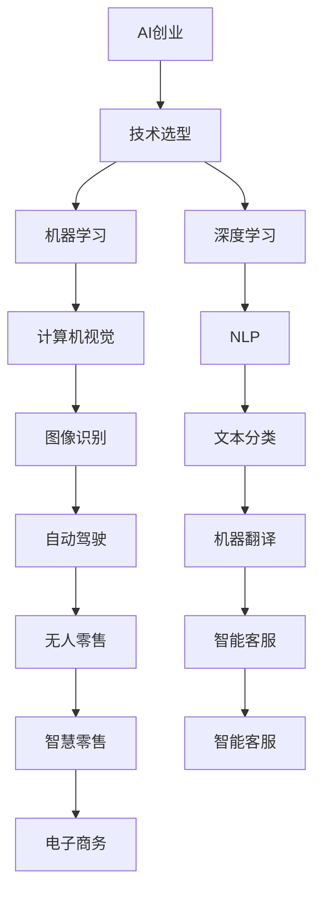

                 

# AI创业：合适工具的选择

> 关键词：AI创业,创业公司,技术选型,机器学习,深度学习,计算机视觉,自然语言处理,NLP

## 1. 背景介绍

在人工智能创业的浪潮中，选择合适的工具和技术至关重要。工具的选择不仅关乎项目的成功率，还直接影响产品的开发效率和用户体验。本文将深入探讨AI创业公司在选择技术工具时的关键因素和策略，为创业者和开发者提供实用的指导。

### 1.1 问题由来
随着AI技术的快速发展，AI创业公司层出不穷，但大多数公司都面临着技术选型的难题。许多初创企业往往在早期就过于依赖最新的技术栈，而忽视了工具的适用性和成熟度。这不仅增加了项目的技术风险，还浪费了大量的资源。因此，本文将聚焦于如何合理选择AI创业公司所需的技术工具，以确保项目顺利进行并取得成功。

### 1.2 问题核心关键点
选择工具的策略应该以项目需求为导向，同时考虑技术的适用性、稳定性和发展前景。以下是几个关键点：

- **项目需求**：选择工具的首要考虑因素是项目的具体需求，如需要解决什么问题，达到什么效果。
- **技术适用性**：工具是否适合解决当前问题，是否能够提高开发效率和系统性能。
- **稳定性与成熟度**：工具是否经过大规模应用验证，是否拥有活跃的社区和完善的文档支持。
- **扩展性**：工具是否具有良好扩展性，是否易于与其他技术栈集成。
- **成本与性价比**：工具的使用成本是否合理，能否带来显著的投资回报。

## 2. 核心概念与联系

### 2.1 核心概念概述

在选择AI创业公司所需的技术工具时，需要了解几个核心概念及其相互关系。

- **AI创业**：指利用人工智能技术创建并运营公司的过程，包括技术研发、市场推广、产品迭代等环节。
- **技术选型**：指在选择用于项目开发的技术栈和工具时，综合考虑项目需求、技术适用性、稳定性、扩展性等因素，进行合理选择的过程。
- **机器学习**：指通过算法训练模型，使计算机能够从数据中自动学习和优化，用于解决分类、回归、聚类等各类问题。
- **深度学习**：是机器学习的一个分支，通过构建多层神经网络，对复杂模式进行建模和预测，广泛应用于计算机视觉、自然语言处理等领域。
- **计算机视觉**：指使计算机能够理解和解释图像和视频中的视觉信息，应用于人脸识别、自动驾驶、医学影像分析等场景。
- **自然语言处理(NLP)**：指使计算机能够理解和生成人类语言，用于情感分析、文本分类、机器翻译等任务。
- **NLP**：是计算机科学和人工智能领域的一个重要分支，专注于使计算机能够理解和处理人类语言。

这些核心概念通过以下Mermaid流程图展示其关系：



### 2.2 概念间的关系

上述核心概念之间存在着紧密的联系，形成了AI创业公司的完整技术生态系统。具体关系如下：

1. **AI创业**是所有相关技术的集成应用，通过各种技术解决实际问题，提升公司价值。
2. **技术选型**是AI创业的起点，决定了公司所使用的技术栈和工具，影响项目的整体进展和质量。
3. **机器学习和深度学习**是AI创业的核心技术，用于处理结构化或非结构化数据，提取有价值的信息。
4. **计算机视觉**和**NLP**是机器学习和深度学习在图像和语言处理上的具体应用，提供了视觉和语言理解的能力。
5. **图像识别、文本分类、自动驾驶、机器翻译、智能客服、智慧零售、电子商务**等具体应用场景，是技术选型的最终目标，通过这些应用实现了AI创业公司的商业价值。

## 3. 核心算法原理 & 具体操作步骤

### 3.1 算法原理概述

AI创业公司在技术选型时，应关注核心算法的原理及其适用性。以下是几个关键算法原理的概述：

- **监督学习**：通过标注数据训练模型，用于分类、回归等任务。适用于数据量充足且标签清晰的问题。
- **无监督学习**：通过未标注数据训练模型，用于聚类、降维等任务。适用于缺乏标注数据或需要发现数据潜在结构的情况。
- **强化学习**：通过与环境的交互，使智能体学习最优策略，用于游戏、机器人控制等场景。
- **迁移学习**：利用已有知识迁移解决新问题，用于跨领域问题的快速适应。
- **对抗学习**：通过对抗样本训练模型，提高模型的鲁棒性和泛化能力。
- **生成对抗网络(GANs)**：通过生成器和判别器的对抗训练，生成高质量的图像或文本。

### 3.2 算法步骤详解

选择合适的算法后，下一步是具体实施。以下是AI创业公司选择和应用算法的一般步骤：

1. **需求分析**：明确项目的具体需求，确定需要解决的问题。
2. **算法选择**：根据需求选择合适的算法，如监督学习、无监督学习、强化学习等。
3. **数据准备**：收集和处理所需的数据，包括数据清洗、特征工程等。
4. **模型训练**：使用选定的算法和数据进行模型训练，调整模型超参数，优化模型性能。
5. **模型评估**：通过验证集和测试集评估模型性能，确保模型能够满足需求。
6. **模型部署**：将训练好的模型部署到实际应用中，进行性能监控和优化。

### 3.3 算法优缺点

不同的算法在应用场景和效果上各有优缺点，具体如下：

- **监督学习**：
  - 优点：模型效果好，对标注数据依赖较低。
  - 缺点：需要大量标注数据，标注成本高。

- **无监督学习**：
  - 优点：不需要标注数据，数据获取成本低。
  - 缺点：模型效果相对较差，依赖数据分布。

- **强化学习**：
  - 优点：适用于动态环境，具备探索能力。
  - 缺点：训练过程复杂，收敛速度慢。

- **迁移学习**：
  - 优点：数据迁移能力强，快速适应新问题。
  - 缺点：源领域与目标领域差异过大时效果不佳。

- **对抗学习**：
  - 优点：提高模型鲁棒性，增强泛化能力。
  - 缺点：计算复杂度高，需要大量对抗样本。

- **GANs**：
  - 优点：生成高质量数据，应用于生成任务。
  - 缺点：训练过程不稳定，生成效果依赖模型设计。

### 3.4 算法应用领域

选择合适的算法后，下一步是具体实施。以下是几个常见算法的应用领域：

- **监督学习**：适用于图像分类、文本分类、推荐系统等任务。
- **无监督学习**：适用于聚类、异常检测、图像降维等任务。
- **强化学习**：适用于游戏AI、机器人控制、自动驾驶等任务。
- **迁移学习**：适用于医学图像分析、金融数据分析等跨领域应用。
- **对抗学习**：适用于图像识别、语音识别、文本生成等任务。
- **GANs**：适用于图像生成、视频生成、数据增强等任务。

## 4. 数学模型和公式 & 详细讲解  
### 4.1 数学模型构建

在AI创业公司的技术选型过程中，需要构建合适的数学模型和公式，以描述问题的数学本质和算法实现。以下是几个常见数学模型的构建：

- **线性回归模型**：用于处理简单的线性关系，公式为 $y = \beta_0 + \beta_1x_1 + \beta_2x_2 + ... + \beta_nx_n$。
- **决策树模型**：用于分类和回归任务，公式为 $H(x) = \sum_{i=1}^m a_i \Pi_{j=1}^n H_j(x; \theta)$。
- **支持向量机(SVM)**：用于分类和回归任务，公式为 $f(x) = \sum_{i=1}^n \alpha_iy_i(x-\mu)^T + \rho$。
- **随机森林模型**：用于分类和回归任务，公式为 $F(x) = \frac{1}{M} \sum_{i=1}^M f_i(x; \theta)$。
- **神经网络模型**：用于处理复杂的非线性关系，公式为 $h(x) = f(Wx + b)$，其中 $f$ 为激活函数， $W$ 为权重矩阵， $b$ 为偏置向量。

### 4.2 公式推导过程

以线性回归模型为例，推导其公式和优化目标函数：

设训练集为 $\{(x_i, y_i)\}_{i=1}^N$，其中 $x_i = [x_{i1}, x_{i2}, ..., x_{in}]$， $y_i$ 为真实标签。线性回归模型为 $y = \beta_0 + \beta_1x_1 + \beta_2x_2 + ... + \beta_nx_n$。

目标函数为均方误差，即 $L(\beta) = \frac{1}{2N}\sum_{i=1}^N (y_i - f(x_i))^2$。

优化目标是使目标函数最小化，即 $\min_{\beta} L(\beta)$。

通过求解该优化问题，可以求得最优的参数 $\beta = (\beta_0, \beta_1, ..., \beta_n)$。

### 4.3 案例分析与讲解

以图像分类任务为例，分析如何选择合适的算法和模型：

- **问题定义**：给定一组图像，对图像进行分类，例如识别猫和狗的图像。
- **算法选择**：由于问题属于图像分类，适合使用卷积神经网络(CNN)进行建模。
- **模型构建**：使用LeNet、AlexNet、VGGNet等经典CNN模型，或使用ResNet、Inception等深度模型。
- **数据准备**：收集猫和狗的高质量图像数据，进行数据增强和预处理。
- **模型训练**：使用图像分类交叉熵作为损失函数，通过梯度下降算法优化模型参数。
- **模型评估**：使用验证集评估模型性能，并进行超参数调整。
- **模型部署**：将训练好的模型部署到实际应用中，进行性能监控和优化。

## 5. 项目实践：代码实例和详细解释说明

### 5.1 开发环境搭建

在开始项目实践前，需要搭建合适的开发环境。以下是使用Python进行TensorFlow开发的环境配置流程：

1. 安装Anaconda：从官网下载并安装Anaconda，用于创建独立的Python环境。

2. 创建并激活虚拟环境：
```bash
conda create -n tf-env python=3.8 
conda activate tf-env
```

3. 安装TensorFlow：
```bash
pip install tensorflow
```

4. 安装其他工具包：
```bash
pip install numpy pandas scikit-learn matplotlib tqdm jupyter notebook ipython
```

完成上述步骤后，即可在`tf-env`环境中开始项目实践。

### 5.2 源代码详细实现

以下是使用TensorFlow实现图像分类任务的基本代码：

```python
import tensorflow as tf
from tensorflow.keras import layers

# 构建模型
model = tf.keras.Sequential([
    layers.Conv2D(32, (3, 3), activation='relu', input_shape=(28, 28, 1)),
    layers.MaxPooling2D((2, 2)),
    layers.Conv2D(64, (3, 3), activation='relu'),
    layers.MaxPooling2D((2, 2)),
    layers.Flatten(),
    layers.Dense(64, activation='relu'),
    layers.Dense(10, activation='softmax')
])

# 编译模型
model.compile(optimizer=tf.keras.optimizers.Adam(),
              loss=tf.keras.losses.SparseCategoricalCrossentropy(from_logits=True),
              metrics=['accuracy'])

# 训练模型
model.fit(train_images, train_labels, epochs=10, validation_data=(test_images, test_labels))

# 评估模型
test_loss, test_acc = model.evaluate(test_images, test_labels)
print('Test accuracy:', test_acc)
```

### 5.3 代码解读与分析

我们逐行分析上述代码的实现细节：

- **模型构建**：使用Sequential模型堆叠卷积层、池化层、全连接层，最终输出10个类别的分类结果。
- **编译模型**：使用Adam优化器，设置交叉熵损失函数，监控准确率。
- **训练模型**：使用fit方法进行模型训练，设置训练轮数为10，验证集为测试集。
- **评估模型**：使用evaluate方法评估模型在测试集上的表现，输出准确率。

## 6. 实际应用场景

### 6.1 智能零售

智能零售是AI创业公司的典型应用场景，通过AI技术提升零售业态的效率和体验。以下是几个具体应用：

- **库存管理**：通过AI分析销售数据，预测产品需求，优化库存管理。
- **顾客行为分析**：通过AI分析顾客行为数据，发现顾客偏好，优化商品陈列和促销策略。
- **商品推荐**：通过AI分析用户行为数据，推荐相关商品，提升顾客购物体验。
- **物流管理**：通过AI优化配送路径，提升物流效率，降低成本。

### 6.2 智慧医疗

智慧医疗是AI创业公司的另一个重要应用场景，通过AI技术提升医疗服务质量。以下是几个具体应用：

- **疾病预测**：通过AI分析患者病历数据，预测疾病风险，提供个性化医疗建议。
- **影像诊断**：通过AI分析医学影像数据，辅助医生进行疾病诊断和治疗方案制定。
- **药物研发**：通过AI分析化合物数据，加速新药研发过程，提高研发效率。
- **健康管理**：通过AI分析个人健康数据，提供健康管理方案，提升生活质量。

### 6.3 金融科技

金融科技是AI创业公司的又一热门应用领域，通过AI技术提升金融服务水平。以下是几个具体应用：

- **信用评分**：通过AI分析用户行为数据，评估信用风险，提供信用评分。
- **风险管理**：通过AI分析市场数据，识别风险点，优化风险管理策略。
- **智能投顾**：通过AI分析市场数据，提供投资建议，提升投资效果。
- **欺诈检测**：通过AI分析交易数据，识别异常交易，防范欺诈风险。

### 6.4 未来应用展望

随着AI技术的不断发展，AI创业公司在未来还将有更多应用场景，带来更加深远的影响：

- **自动驾驶**：通过AI技术实现自动驾驶，提升交通效率，降低交通事故。
- **智能制造**：通过AI技术优化生产流程，提高生产效率，降低生产成本。
- **教育科技**：通过AI技术个性化教育方案，提升教育效果，促进教育公平。
- **安防监控**：通过AI技术提升安防监控效果，保障公共安全。

## 7. 工具和资源推荐

### 7.1 学习资源推荐

为了帮助AI创业者全面掌握AI技术，以下是一些优秀的学习资源：

- **TensorFlow官方文档**：提供TensorFlow的全面介绍和详细教程，是TensorFlow学习的必备资料。
- **PyTorch官方文档**：提供PyTorch的全面介绍和详细教程，适合深度学习初学者和实践者。
- **Keras官方文档**：提供Keras的全面介绍和详细教程，适合快速上手构建深度学习模型。
- **Coursera深度学习课程**：由深度学习领域权威专家授课，涵盖深度学习基础和应用。
- **Udacity深度学习纳米学位**：提供深度学习的系统学习，涵盖深度学习基础和实际项目。

### 7.2 开发工具推荐

为了提高AI创业公司的开发效率，以下是一些推荐的开发工具：

- **Jupyter Notebook**：免费开源的Jupyter Notebook环境，支持Python、R等多种编程语言，非常适合数据科学和机器学习项目。
- **Google Colab**：Google提供的免费Jupyter Notebook环境，支持GPU计算，适合深度学习项目。
- **VSCode**：功能强大的代码编辑器，支持Python、R等多种编程语言，适合开发和调试。
- **PyCharm**：功能强大的IDE，支持Python、Java等多种编程语言，适合开发和调试。
- **RStudio**：功能强大的R语言开发环境，适合数据分析和机器学习项目。

### 7.3 相关论文推荐

为了深入了解AI创业公司的技术选型和实现细节，以下是一些值得关注的论文：

- **Deep Learning for AI-Based Applications**：介绍深度学习在AI创业公司中的应用，涵盖图像分类、语音识别、自然语言处理等领域。
- **Machine Learning in AI-Based Applications**：介绍机器学习在AI创业公司中的应用，涵盖监督学习、无监督学习、迁移学习等领域。
- **Reinforcement Learning for AI-Based Applications**：介绍强化学习在AI创业公司中的应用，涵盖自动驾驶、机器人控制等领域。
- **Generative Adversarial Networks for AI-Based Applications**：介绍GANs在AI创业公司中的应用，涵盖图像生成、数据增强等领域。

## 8. 总结：未来发展趋势与挑战

### 8.1 总结

本文深入探讨了AI创业公司在选择技术工具时的关键因素和策略。首先，明确了项目需求、技术适用性、稳定性、扩展性和成本五个关键点。其次，详细讲解了监督学习、无监督学习、强化学习、迁移学习和对抗学习等算法原理及其应用领域。最后，通过具体项目实践，展示了如何选择合适的算法和工具，实现项目目标。

通过本文的系统梳理，可以看到，AI创业公司在技术选型时，需要综合考虑项目需求、技术适用性、稳定性、扩展性和成本等因素，才能合理选择所需的技术工具，确保项目顺利进行并取得成功。

### 8.2 未来发展趋势

展望未来，AI创业公司在技术选型上将呈现以下几个发展趋势：

1. **自动化选型**：AI选型工具将变得更加智能，能够根据项目需求自动推荐合适的算法和工具，减少人工干预。
2. **模型迁移**：通过模型迁移和微调，快速适应新任务和新数据，降低项目开发成本。
3. **联邦学习**：通过联邦学习技术，保护数据隐私，同时提升模型性能和泛化能力。
4. **边缘计算**：通过边缘计算技术，提升AI应用在移动设备和物联网等场景下的响应速度和计算效率。
5. **低代码开发**：通过低代码开发平台，降低AI开发门槛，提升开发效率。

### 8.3 面临的挑战

尽管AI创业公司在技术选型上取得了显著进展，但仍面临诸多挑战：

1. **数据隐私和安全**：AI应用涉及大量敏感数据，如何保护数据隐私和安全，是技术选型时需要重点考虑的问题。
2. **技术复杂性**：AI技术涉及深度学习、机器学习、计算机视觉等多个领域，技术选型时需要综合考虑多方面因素，增加了项目复杂度。
3. **算力资源**：AI应用需要高性能计算资源，如何高效利用算力资源，提升模型训练和推理效率，是技术选型时需要考虑的问题。
4. **成本控制**：AI技术选型涉及硬件、软件和人力等多个方面的成本投入，如何合理控制成本，提升投资回报率，是技术选型时需要关注的问题。

### 8.4 研究展望

为了应对上述挑战，未来需要进一步开展以下几个方面的研究：

1. **隐私保护技术**：开发更加高效的隐私保护算法和加密技术，保护数据隐私和安全。
2. **自动化选型工具**：开发智能化的选型工具，降低技术选型的复杂度和人工成本。
3. **模型压缩与优化**：开发更加高效的模型压缩和优化技术，提升模型训练和推理效率，降低资源成本。
4. **边缘计算与低代码开发**：开发更加高效的边缘计算平台和低代码开发平台，提升AI应用的响应速度和开发效率。
5. **跨领域融合**：开发更加通用的AI技术，能够跨领域应用，提升AI技术的泛化能力和应用范围。

总之，AI创业公司在技术选型时需要全面考虑项目需求、技术适用性、稳定性、扩展性和成本等因素，选择合适工具和算法，提升项目开发效率和系统性能。同时，也需要积极应对数据隐私、技术复杂性、算力资源和成本控制等挑战，不断推进技术进步，推动AI应用在更多领域的落地和普及。

