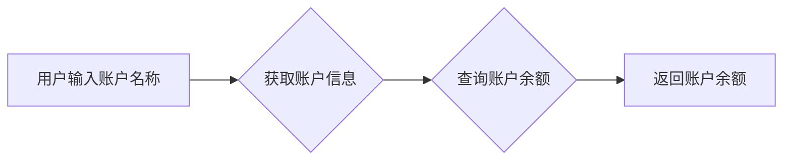
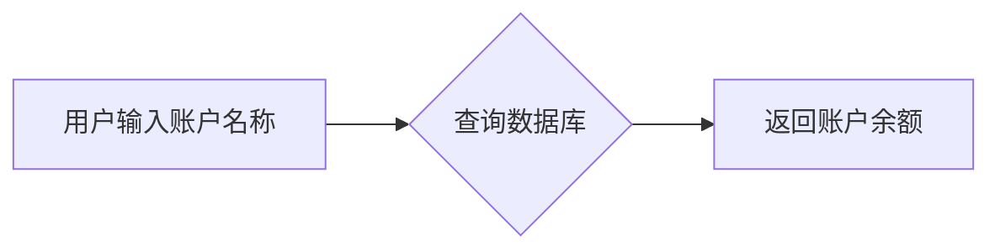

## 1. 背景介绍

### 1.1 问题的由来

随着人工智能技术的快速发展，大模型的应用场景越来越广泛，从文本生成、图像识别到自然语言处理，大模型正在深刻地改变着我们的生活和工作方式。其中，AI Agent作为一种新型的人工智能应用，正逐渐成为大模型应用开发的热门方向。

AI Agent可以理解为一个能够自主学习、决策和执行任务的智能体，它能够根据用户的指令或环境的变化，自动完成各种任务，例如查询信息、完成交易、提供建议等等。

在实际应用中，AI Agent可以帮助我们更高效地完成各种工作，例如：

* **财务管理：** 查询账户余额、分析财务报表、自动生成财务报告等等。
* **客服服务：** 回答客户问题、处理客户订单、提供个性化服务等等。
* **数据分析：** 挖掘数据中的潜在价值、生成数据可视化图表、预测未来趋势等等。

然而，目前市面上大多数AI Agent的开发门槛较高，需要开发者具备一定的编程经验和机器学习知识。对于普通用户来说，想要创建自己的AI Agent，往往需要花费大量的时间和精力。

为了降低AI Agent的开发门槛，我们希望能够通过简单的操作，就能创建出能够满足特定需求的AI Agent。

### 1.2 研究现状

目前，AI Agent的开发主要集中在以下几个方面：

* **基于规则的Agent：**  通过预先定义的规则来控制Agent的行为，例如专家系统。
* **基于学习的Agent：** 利用机器学习算法来训练Agent，使其能够根据经验做出决策，例如强化学习Agent。
* **基于大模型的Agent：** 利用大模型的强大能力，赋予Agent更强的理解能力和推理能力，例如基于ChatGPT的AI Agent。

近年来，基于大模型的Agent发展迅速，涌现出许多优秀的开源框架和工具，例如 LangChain、AutoGPT 等等。这些框架和工具简化了Agent的开发流程，降低了开发门槛。

### 1.3 研究意义

创建能够查询财务信息的AI Agent具有重要的现实意义，它可以帮助用户：

* **节省时间和精力：**  用户无需手动查询财务信息，只需向Agent发出指令，Agent就能自动完成查询任务。
* **提高效率：**  Agent能够快速准确地提供财务信息，帮助用户做出更明智的决策。
* **增强安全性：**  Agent可以根据用户的权限控制财务信息的访问权限，提高财务数据的安全性。

### 1.4 本文结构

本文将深入探讨如何利用大模型开发一个能够查询财务信息的AI Agent，内容涵盖以下几个方面：

* **核心概念与联系：**  介绍AI Agent、大模型、LangChain等相关概念。
* **核心算法原理 & 具体操作步骤：**  讲解LangChain框架的使用方法，以及如何利用LangChain创建财务信息查询Agent。
* **项目实践：代码实例和详细解释说明：**  提供完整代码示例，并详细解释代码逻辑。
* **实际应用场景：**  探讨财务信息查询Agent的应用场景和未来发展方向。
* **总结：未来发展趋势与挑战：**  展望AI Agent未来的发展趋势和面临的挑战。

## 2. 核心概念与联系

### 2.1 AI Agent

AI Agent可以理解为一个能够自主学习、决策和执行任务的智能体。它具有以下几个关键特征：

* **感知能力：**  能够感知外部环境，例如接收用户指令、获取数据等等。
* **推理能力：**  能够根据感知到的信息进行推理和决策，例如分析数据、制定计划等等。
* **行动能力：**  能够根据决策采取行动，例如查询数据库、发送邮件等等。
* **学习能力：**  能够从经验中学习，不断改进自己的行为，例如根据用户的反馈调整策略等等。

### 2.2 大模型

大模型是指拥有大量参数的深度学习模型，例如GPT-3、LaMDA等等。大模型具有以下几个优势：

* **强大的理解能力：**  能够理解复杂的文本和代码，并进行推理和生成。
* **丰富的知识储备：**  经过海量数据的训练，拥有丰富的知识，能够回答各种问题。
* **强大的泛化能力：**  能够在不同的任务和场景中表现良好。

### 2.3 LangChain

LangChain是一个开源框架，它可以帮助开发者更方便地构建基于大模型的AI Agent。LangChain提供了以下几个关键功能：

* **链式调用：**  将不同的组件链接在一起，实现复杂的功能。
* **数据连接：**  连接各种数据源，例如数据库、API、文件等等。
* **模型集成：**  集成各种大模型，例如OpenAI、Google AI等等。
* **Agent开发：**  提供工具和模板，帮助开发者快速构建Agent。

## 3. 核心算法原理 & 具体操作步骤

### 3.1 算法原理概述

利用LangChain创建财务信息查询Agent，主要涉及以下几个步骤：

1. **定义Agent的意图：**  确定Agent需要完成的任务，例如查询账户余额、分析财务报表等等。
2. **构建Agent的流程：**  使用LangChain的链式调用功能，将不同的组件链接在一起，实现Agent的流程。
3. **连接数据源：**  将Agent连接到财务数据源，例如数据库、API等等。
4. **集成大模型：**  使用LangChain集成大模型，例如ChatGPT，赋予Agent强大的理解和推理能力。
5. **训练和优化：**  根据用户的反馈，不断训练和优化Agent，使其能够更好地完成任务。

### 3.2 算法步骤详解

**步骤1：定义Agent的意图**

首先，我们需要明确Agent需要完成的任务，例如：

* 查询账户余额：用户输入账户名称，Agent查询并返回账户余额。
* 分析财务报表：用户上传财务报表，Agent分析报表并生成分析报告。
* 生成财务报告：用户输入财务数据，Agent自动生成财务报告。

**步骤2：构建Agent的流程**

使用LangChain的链式调用功能，将不同的组件链接在一起，实现Agent的流程。例如，一个查询账户余额的Agent流程可能如下：



**步骤3：连接数据源**

将Agent连接到财务数据源，例如数据库、API等等。可以使用LangChain提供的各种数据连接器，例如：

* **数据库连接器：**  连接到数据库，例如MySQL、PostgreSQL等等。
* **API连接器：**  连接到API，例如财务数据API、股票数据API等等。
* **文件连接器：**  连接到文件，例如Excel、CSV等等。

**步骤4：集成大模型**

使用LangChain集成大模型，例如ChatGPT，赋予Agent强大的理解和推理能力。例如，可以使用LangChain的`LLMChain`组件，将ChatGPT集成到Agent中。

**步骤5：训练和优化**

根据用户的反馈，不断训练和优化Agent，使其能够更好地完成任务。可以使用LangChain提供的各种训练和优化工具，例如：

* **强化学习：**  通过奖励机制，训练Agent做出更优的决策。
* **监督学习：**  使用标注数据，训练Agent学习正确的行为。
* **迁移学习：**  将已有的模型迁移到新的任务中，提高Agent的学习效率。

### 3.3 算法优缺点

**优点：**

* **自动化：**  能够自动完成查询财务信息的任务，节省用户的时间和精力。
* **效率：**  能够快速准确地提供财务信息，提高用户的工作效率。
* **安全性：**  可以根据用户的权限控制财务信息的访问权限，提高财务数据的安全性。
* **可扩展性：**  可以根据用户的需求，不断扩展Agent的功能。

**缺点：**

* **开发门槛：**  需要开发者具备一定的编程经验和机器学习知识。
* **数据依赖：**  Agent的性能取决于数据源的质量和数量。
* **安全性：**  Agent的安全性依赖于数据源的安全性，需要进行安全防护。

### 3.4 算法应用领域

财务信息查询Agent可以应用于以下领域：

* **个人财务管理：**  查询账户余额、分析财务报表、生成财务报告等等。
* **企业财务管理：**  查询公司财务数据、分析财务报表、生成财务报告等等。
* **金融投资：**  查询股票数据、分析市场趋势、生成投资建议等等。
* **税务申报：**  查询税务信息、自动生成税务申报表等等。

## 4. 数学模型和公式 & 详细讲解 & 举例说明

### 4.1 数学模型构建

财务信息查询Agent的数学模型可以基于以下几个要素：

* **用户输入：**  用户的指令，例如查询账户余额、分析财务报表等等。
* **数据源：**  财务数据源，例如数据库、API、文件等等。
* **大模型：**  用于理解用户指令、分析数据、生成结果等等。
* **Agent状态：**  Agent当前的状态，例如正在查询数据、正在生成结果等等。
* **行动：**  Agent采取的行动，例如查询数据库、发送邮件等等。

Agent的数学模型可以表示为：

$$
Agent = (S, A, T, R)
$$

其中：

* $S$：Agent的状态空间。
* $A$：Agent的行动空间。
* $T$：状态转移函数，描述Agent如何从一个状态转移到另一个状态。
* $R$：奖励函数，描述Agent在不同状态下获得的奖励。

### 4.2 公式推导过程

Agent的数学模型可以帮助我们理解Agent的行为，并设计出更有效的Agent。例如，我们可以使用强化学习算法来训练Agent，使其能够根据奖励函数最大化预期奖励。

强化学习算法的目标是找到一个最优策略 $\pi$，使得Agent在所有状态下都能获得最大的预期奖励。最优策略可以表示为：

$$
\pi^* = \arg\max_{\pi} \mathbb{E}[R | \pi]
$$

其中：

* $\pi$：Agent的策略，描述Agent在不同状态下采取的行动。
* $\mathbb{E}[R | \pi]$：Agent在策略 $\pi$ 下的预期奖励。

### 4.3 案例分析与讲解

假设我们要创建一个查询账户余额的Agent，它的数学模型可以表示为：

* $S$：{用户输入账户名称，Agent正在查询数据，Agent已查询到数据}
* $A$：{查询数据库，返回账户余额}
* $T$：{根据用户输入，转移到查询数据状态；查询到数据，转移到返回账户余额状态}
* $R$：{查询到数据并返回，获得正奖励；查询失败，获得负奖励}

Agent的流程可以表示为：



当用户输入账户名称时，Agent转移到查询数据状态，并执行查询数据库的行动。如果查询成功，Agent转移到返回账户余额状态，并返回账户余额。

### 4.4 常见问题解答

* **如何选择合适的数据源？**  需要根据Agent的任务和需求选择合适的数据源，例如，如果需要查询账户余额，可以选择银行提供的API或数据库。
* **如何选择合适的大模型？**  需要根据Agent的任务和需求选择合适的大模型，例如，如果需要进行复杂的文本理解和推理，可以选择GPT-3或LaMDA。
* **如何评估Agent的性能？**  可以使用各种指标来评估Agent的性能，例如准确率、召回率、F1值等等。

## 5. 项目实践：代码实例和详细解释说明

### 5.1 开发环境搭建

**安装依赖：**

```bash
pip install langchain openai
```

**配置环境变量：**

* 将OpenAI API密钥设置为环境变量 `OPENAI_API_KEY`。

### 5.2 源代码详细实现

```python
from langchain.chains import  LLMChain
from langchain.llms import OpenAI
from langchain.prompts import PromptTemplate

# 定义提示模板
prompt_template = PromptTemplate(
    input_variables=["account_name"],
    template="查询账户 {account_name} 的余额。"
)

# 初始化大模型
llm = OpenAI(temperature=0.7)

# 创建链式调用
chain = LLMChain(llm=llm, prompt=prompt_template)

# 用户输入账户名称
account_name = input("请输入账户名称：")

# 执行链式调用
response = chain.run(account_name=account_name)

# 打印结果
print(response)
```

### 5.3 代码解读与分析

* **`PromptTemplate`：**  定义提示模板，用于向大模型提供指令。
* **`OpenAI`：**  初始化OpenAI大模型，用于执行文本理解和生成任务。
* **`LLMChain`：**  创建链式调用，将提示模板和OpenAI大模型链接在一起。
* **`chain.run()`：**  执行链式调用，将用户输入的账户名称传递给大模型。
* **`print(response)`：**  打印大模型返回的结果。

### 5.4 运行结果展示

运行代码，输入账户名称，例如 "我的账户"，大模型会根据提示模板生成查询指令，并返回查询结果，例如 "您的账户余额为 1000 元"。

## 6. 实际应用场景

### 6.1 个人财务管理

* 查询账户余额：用户输入账户名称，Agent查询并返回账户余额。
* 分析财务报表：用户上传财务报表，Agent分析报表并生成分析报告。
* 生成财务报告：用户输入财务数据，Agent自动生成财务报告。
* 预算管理：用户设定预算目标，Agent帮助用户跟踪支出情况，并提醒用户超支。

### 6.2 企业财务管理

* 查询公司财务数据：用户输入查询条件，Agent查询并返回公司财务数据。
* 分析财务报表：用户上传财务报表，Agent分析报表并生成分析报告。
* 生成财务报告：用户输入财务数据，Agent自动生成财务报告。
* 风险管理：Agent分析财务数据，识别潜在的风险，并提供风险预警。

### 6.3 金融投资

* 查询股票数据：用户输入股票代码，Agent查询并返回股票数据。
* 分析市场趋势：Agent分析市场数据，预测未来趋势，并提供投资建议。
* 生成投资组合：用户设定投资目标，Agent自动生成投资组合。
* 风险控制：Agent根据用户的风险偏好，控制投资组合的风险。

### 6.4 未来应用展望

未来，财务信息查询Agent将会更加智能化，例如：

* **个性化服务：**  Agent能够根据用户的个人情况，提供个性化的财务建议。
* **多语言支持：**  Agent能够支持多种语言，方便全球用户使用。
* **跨平台支持：**  Agent能够在各种平台上运行，例如手机、电脑、智能音箱等等。
* **更强的安全保障：**  Agent将拥有更强的安全保障机制，保护用户的财务数据安全。

## 7. 工具和资源推荐

### 7.1 学习资源推荐

* **LangChain官方文档：**  [https://langchain.readthedocs.io/](https://langchain.readthedocs.io/)
* **OpenAI官方文档：**  [https://platform.openai.com/docs/](https://platform.openai.com/docs/)
* **ChatGPT官方网站：**  [https://chat.openai.com/](https://chat.openai.com/)

### 7.2 开发工具推荐

* **VS Code：**  一款功能强大的代码编辑器，支持多种编程语言。
* **PyCharm：**  一款专门用于Python开发的集成开发环境，提供丰富的功能和插件。
* **Jupyter Notebook：**  一款交互式笔记本，方便进行代码编写、数据分析和可视化。

### 7.3 相关论文推荐

* **"Chain of Thought Prompting Elicits Reasoning in Large Language Models"** by Jason Wei, et al.
* **"Prompt Engineering for Large Language Models: A Survey"** by Junyi Jessy Li, et al.
* **"Large Language Models Are Human-Level Prompt Engineers"** by Jacob Hilton, et al.

### 7.4 其他资源推荐

* **LangChain社区：**  [https://discord.gg/langchain](https://discord.gg/langchain)
* **OpenAI社区：**  [https://community.openai.com/](https://community.openai.com/)
* **Hugging Face：**  [https://huggingface.co/](https://huggingface.co/)

## 8. 总结：未来发展趋势与挑战

### 8.1 研究成果总结

本文深入探讨了如何利用大模型开发一个能够查询财务信息的AI Agent，介绍了AI Agent、大模型、LangChain等相关概念，并详细讲解了使用LangChain框架创建Agent的步骤和方法。

### 8.2 未来发展趋势

未来，AI Agent将会更加智能化，例如：

* **个性化服务：**  Agent能够根据用户的个人情况，提供个性化的服务。
* **多模态交互：**  Agent能够支持多种交互方式，例如文本、语音、图像等等。
* **更强的安全保障：**  Agent将拥有更强的安全保障机制，保护用户的隐私和数据安全。

### 8.3 面临的挑战

AI Agent的开发和应用也面临着一些挑战，例如：

* **数据隐私：**  如何保护用户的隐私数据，避免数据泄露。
* **模型安全：**  如何防止模型被攻击，确保模型的安全性。
* **伦理问题：**  如何确保AI Agent的决策符合伦理道德，避免造成负面影响。

### 8.4 研究展望

未来，我们将继续研究AI Agent的开发和应用，探索更智能、更安全、更可靠的AI Agent，为用户提供更优质的服务。

## 9. 附录：常见问题与解答

* **如何选择合适的大模型？**  需要根据Agent的任务和需求选择合适的大模型，例如，如果需要进行复杂的文本理解和推理，可以选择GPT-3或LaMDA。
* **如何评估Agent的性能？**  可以使用各种指标来评估Agent的性能，例如准确率、召回率、F1值等等。
* **如何解决Agent的安全问题？**  可以使用各种安全措施来解决Agent的安全问题，例如数据加密、访问控制、安全审计等等。

作者：禅与计算机程序设计艺术 / Zen and the Art of Computer Programming
