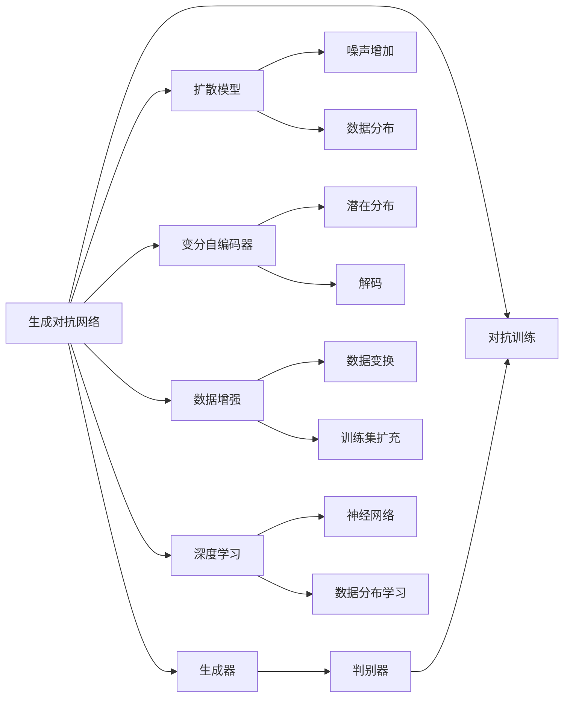
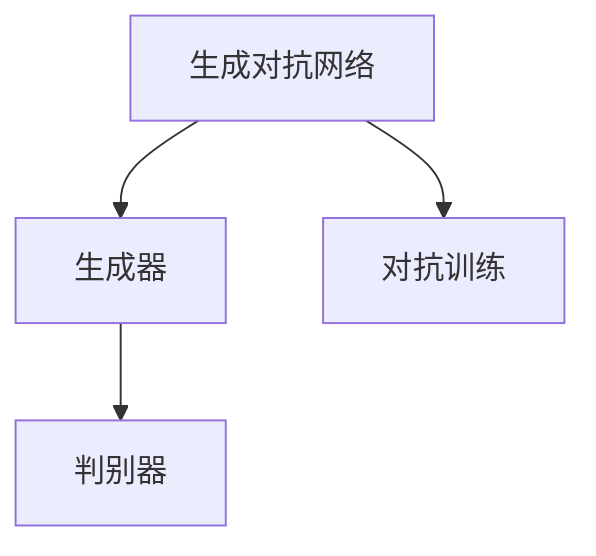
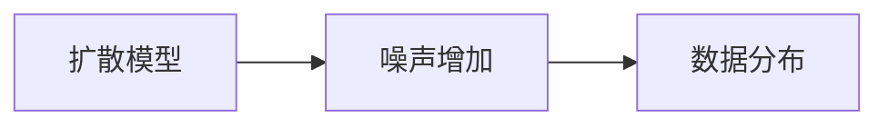
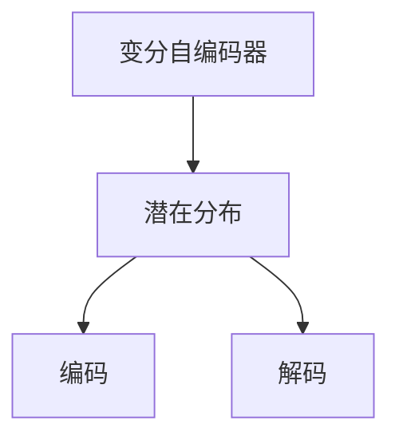
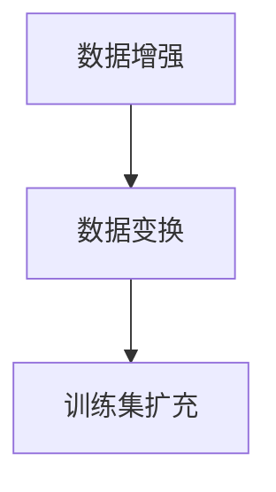
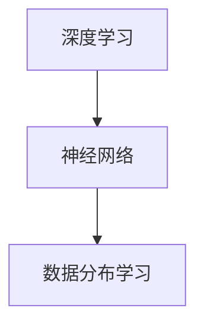
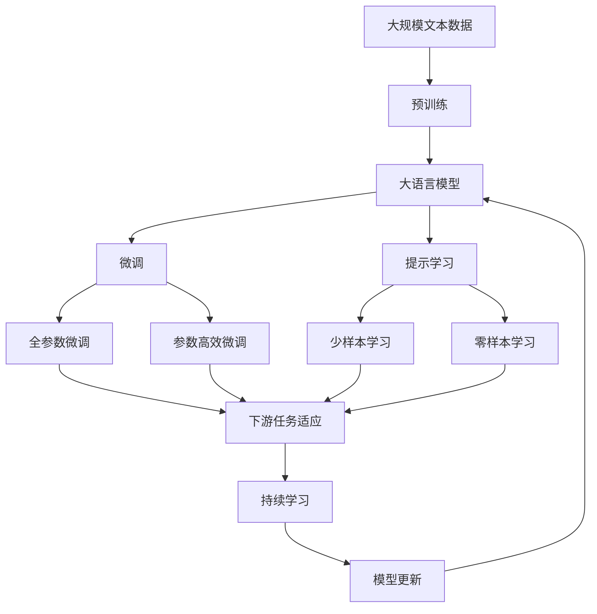

                 

# AIGC原理与代码实例讲解

> 关键词：AIGC, 生成对抗网络(GANs), 扩散模型(Diffusion Models), 变分自编码器(VAEs), 数据增强, 深度学习

## 1. 背景介绍

### 1.1 问题由来
随着人工智能(AI)技术的不断成熟，生成对抗网络(GANs)、扩散模型(Diffusion Models)等新型生成模型在图像生成、文本生成、音频生成等领域取得了显著进展。AIGC（Audio, Image, GANs & AI for Computer Graphics）作为AI驱动的艺术创作领域，正在经历一次颠覆性的变革。

AIGC涉及多模态数据的生成与生成模型的设计，涵盖图像生成、音频生成、视频生成、3D模型生成等各个方面。生成模型通过学习数据的统计特征和内在规律，能够生成高质量的、具有一定真实感的内容，甚至可以生成不存在的、全新的数据，具有极大的创作潜力和商业价值。

### 1.2 问题核心关键点
AIGC的核心在于如何利用深度学习模型，特别是生成对抗网络和扩散模型，生成高质量的多模态内容。生成模型的训练过程主要包括两个方面：
1. 生成器的训练：生成器模型负责生成内容，通常采用神经网络结构，通过大量的训练数据学习到数据的生成规律。
2. 判别器的训练：判别器模型用于区分真实数据与生成数据，训练生成器生成更逼真的数据。

生成模型的训练效果很大程度上取决于生成器和判别器之间的对抗过程，以及数据集的质量和多样性。生成模型在图像、音频、视频等领域的创新应用，如深度伪造、虚拟人、超现实主义创作等，正逐步改变着艺术创作和娱乐产业的面貌。

### 1.3 问题研究意义
AIGC技术的发展，不仅在艺术创作领域带来了新的可能性，也在其他领域如娱乐、游戏、广告等产生了深远影响。生成模型的成功应用，使得AI成为内容创作的重要工具，降低了内容创作的门槛，扩大了创意表达的空间，促进了AI技术的普及和应用。

本文旨在全面介绍AIGC技术的原理与实现方法，提供深入的理论分析与代码实践指导，帮助读者深入理解AIGC的核心概念与技术细节，探索其在多模态数据生成中的应用场景。

## 2. 核心概念与联系

### 2.1 核心概念概述

为更好地理解AIGC技术的原理与实现方法，本节将介绍几个关键的核心概念：

- **生成对抗网络(GANs)**：由生成器(Generator)和判别器(Discriminator)两个子网络组成，通过对抗训练过程学习生成真实样例的深度学习模型。
- **扩散模型(Diffusion Models)**：通过逐步增加噪声，使模型从噪声分布逐渐过渡到数据分布的生成模型。
- **变分自编码器(VAEs)**：通过学习数据的潜在分布，对数据进行编码和解码的生成模型。
- **数据增强(Data Augmentation)**：通过一系列数据变换，增加训练数据的多样性，提高模型的泛化能力。
- **深度学习(Deep Learning)**：基于多层神经网络模型，通过训练数据学习数据分布特征的技术。
- **多模态数据(Multimodal Data)**：涉及音频、图像、视频等多个感官通道的数据。
- **内容生成(Content Generation)**：利用生成模型自动生成高质量的、新颖的、具有艺术价值的内容。

这些核心概念通过以下Mermaid流程图来展示它们之间的联系：



这个流程图展示了AIGC技术的核心概念及其相互关系：

1. 生成对抗网络通过生成器和判别器进行对抗训练，生成高质量的数据。
2. 扩散模型通过逐步增加噪声，学习数据的生成分布。
3. 变分自编码器通过编码和解码，学习数据的潜在分布。
4. 数据增强通过数据变换增加训练集的多样性，提升模型泛化能力。
5. 深度学习通过神经网络模型，学习数据的分布特征。
6. 多模态数据涉及多种感官通道的信息。
7. 内容生成通过生成模型自动生成高质量内容。

### 2.2 概念间的关系

这些核心概念之间存在着紧密的联系，形成了AIGC技术的完整生态系统。下面我们通过几个Mermaid流程图来展示这些概念之间的关系。

#### 2.2.1 生成对抗网络的结构



这个流程图展示了生成对抗网络的基本结构，包括生成器、判别器和对抗训练过程。

#### 2.2.2 扩散模型的训练过程



这个流程图展示了扩散模型的训练过程，通过逐步增加噪声，从噪声分布逐渐过渡到数据分布。

#### 2.2.3 变分自编码器的编码与解码过程



这个流程图展示了变分自编码器的编码与解码过程，通过学习数据的潜在分布，对数据进行编码和解码。

#### 2.2.4 数据增强的多样性提升



这个流程图展示了数据增强的过程，通过数据变换增加训练集的多样性。

#### 2.2.5 深度学习的多层网络结构



这个流程图展示了深度学习的多层网络结构，通过学习数据分布特征，构建复杂的神经网络模型。

### 2.3 核心概念的整体架构

最后，我们用一个综合的流程图来展示这些核心概念在大语言模型微调过程中的整体架构：



这个综合流程图展示了从预训练到微调，再到持续学习的完整过程。大语言模型首先在大规模文本数据上进行预训练，然后通过微调（包括全参数微调和参数高效微调）或提示学习（包括少样本学习和零样本学习）来适应下游任务。最后，通过持续学习技术，模型可以不断更新和适应新的任务和数据。 通过这些流程图，我们可以更清晰地理解AIGC技术的各个核心概念的关系和作用，为后续深入讨论具体的技术细节奠定基础。

## 3. 核心算法原理 & 具体操作步骤
### 3.1 算法原理概述

AIGC技术的核心算法主要包括生成对抗网络、扩散模型和变分自编码器等。这些生成模型通过学习数据分布特征，能够生成高质量的、具有一定真实感的内容。

以生成对抗网络为例，其基本原理是通过生成器和判别器之间的对抗训练过程，使得生成器能够生成与真实数据无法区分的样例。

### 3.2 算法步骤详解

#### 3.2.1 生成对抗网络

生成对抗网络的训练过程包括两个主要步骤：

1. **生成器训练**：生成器模型通过大量的训练数据学习到数据的生成规律。
2. **判别器训练**：判别器模型用于区分真实数据与生成数据，训练生成器生成更逼真的数据。

具体步骤如下：

1. 随机生成一个噪声向量 $\mathbf{z}$。
2. 通过生成器将噪声向量 $\mathbf{z}$ 映射为数据分布上的样例 $\mathbf{x}$。
3. 使用判别器 $\mathbf{D}$ 判断 $\mathbf{x}$ 是真实数据还是生成数据，输出概率 $D(\mathbf{x})$。
4. 计算生成器 $\mathbf{G}$ 的损失函数 $\mathcal{L}_G$，使得 $D(\mathbf{G}(\mathbf{z}))$ 最大化。
5. 计算判别器 $\mathbf{D}$ 的损失函数 $\mathcal{L}_D$，使得 $D(\mathbf{G}(\mathbf{z}))$ 最小化。
6. 交替优化生成器和判别器，直至收敛。

#### 3.2.2 扩散模型

扩散模型的训练过程主要包括以下步骤：

1. **噪声增加**：从噪声分布 $p(\mathbf{z}_0)$ 开始，逐步增加噪声 $\epsilon_t$，使数据分布从噪声分布逐渐过渡到真实数据分布。
2. **生成数据**：通过扩散模型 $\mathbf{D}$，将数据分布逐渐过渡到真实数据分布。
3. 训练扩散模型 $\mathbf{D}$，使得 $p(\mathbf{x}_t|\mathbf{x}_0)$ 逼近真实数据分布 $p(\mathbf{x}|\mathbf{x}_0)$。

具体步骤如下：

1. 随机生成噪声向量 $\mathbf{z}_0$。
2. 将噪声向量 $\mathbf{z}_0$ 逐步增加噪声 $\epsilon_t$，得到序列 $\{\mathbf{z}_t\}_{t=0}^{T-1}$。
3. 使用扩散模型 $\mathbf{D}$ 将噪声序列 $\{\mathbf{z}_t\}_{t=0}^{T-1}$ 映射为数据分布上的样例 $\{\mathbf{x}_t\}_{t=0}^{T-1}$。
4. 训练扩散模型 $\mathbf{D}$，使得 $p(\mathbf{x}_t|\mathbf{x}_0)$ 逼近真实数据分布 $p(\mathbf{x}|\mathbf{x}_0)$。

#### 3.2.3 变分自编码器

变分自编码器的训练过程主要包括以下步骤：

1. **潜在变量编码**：将数据 $\mathbf{x}$ 映射到潜在变量 $\mathbf{z}$ 上，得到潜在分布 $q(\mathbf{z}|\mathbf{x})$。
2. **潜在变量解码**：通过潜在变量 $\mathbf{z}$ 解码回原始数据 $\mathbf{x}$，得到解码分布 $p(\mathbf{x}|\mathbf{z})$。
3. **变分重构**：通过最小化重构误差和潜在变量分布的KL散度，训练编码器和解码器。

具体步骤如下：

1. 随机生成潜在变量 $\mathbf{z}$。
2. 使用编码器将数据 $\mathbf{x}$ 映射到潜在变量 $\mathbf{z}$ 上，得到潜在分布 $q(\mathbf{z}|\mathbf{x})$。
3. 使用解码器将潜在变量 $\mathbf{z}$ 解码回原始数据 $\mathbf{x}$，得到解码分布 $p(\mathbf{x}|\mathbf{z})$。
4. 计算潜在变量分布的KL散度 $\mathcal{L}_{KL}$，最小化重构误差 $\mathcal{L}_{R}$，训练编码器和解码器。

### 3.3 算法优缺点

生成对抗网络、扩散模型和变分自编码器各有优缺点：

#### 3.3.1 生成对抗网络

优点：

- 能够生成高质量的、具有一定真实感的内容。
- 模型结构简单，训练过程直观。

缺点：

- 对抗训练过程中容易产生梯度消失问题。
- 训练过程不稳定，需要大量计算资源。

#### 3.3.2 扩散模型

优点：

- 能够生成高质量的、复杂的、高分辨率的图像和视频。
- 生成过程可控，可以通过逐步增加噪声来控制生成过程。

缺点：

- 模型结构复杂，训练过程复杂。
- 需要大量的训练数据和计算资源。

#### 3.3.3 变分自编码器

优点：

- 能够生成高质量的、具有一定复杂度的数据。
- 模型结构简单，训练过程稳定。

缺点：

- 生成效果可能不如生成对抗网络和扩散模型。
- 需要计算潜在变量分布的KL散度，训练过程复杂。

### 3.4 算法应用领域

生成对抗网络、扩散模型和变分自编码器在图像生成、音频生成、视频生成、3D模型生成等领域有着广泛的应用：

- **图像生成**：生成对抗网络在图像生成领域的应用最为广泛，如GANs在人脸生成、图像修复、风格迁移等任务中表现出色。
- **音频生成**：变分自编码器在音频生成领域的应用较多，如WaveNet、VQ-VAE等模型，能够生成高质量的音频内容。
- **视频生成**：扩散模型在视频生成领域表现优异，如SUPER-SLOWFAST等模型，能够生成高质量的视频内容。
- **3D模型生成**：变分自编码器在3D模型生成领域也有应用，如VAE-Generative Adversarial Networks (VAE-GAN)等模型，能够生成高质量的3D模型。

除了上述这些应用领域外，生成模型在文本生成、音乐生成、虚拟现实等领域也有广泛的应用前景。

## 4. 数学模型和公式 & 详细讲解 & 举例说明

### 4.1 数学模型构建

本节将使用数学语言对生成对抗网络、扩散模型和变分自编码器进行更加严格的刻画。

#### 4.1.1 生成对抗网络

记生成器为 $\mathbf{G}$，判别器为 $\mathbf{D}$，数据为 $\mathbf{x}$，噪声向量为 $\mathbf{z}$。

生成对抗网络的训练过程如下：

1. 生成器 $\mathbf{G}$ 将噪声向量 $\mathbf{z}$ 映射为数据分布上的样例 $\mathbf{x}$，即 $\mathbf{x} = \mathbf{G}(\mathbf{z})$。
2. 判别器 $\mathbf{D}$ 判断 $\mathbf{x}$ 是真实数据还是生成数据，输出概率 $D(\mathbf{x})$。
3. 计算生成器 $\mathbf{G}$ 的损失函数 $\mathcal{L}_G$，使得 $D(\mathbf{G}(\mathbf{z}))$ 最大化。
4. 计算判别器 $\mathbf{D}$ 的损失函数 $\mathcal{L}_D$，使得 $D(\mathbf{G}(\mathbf{z}))$ 最小化。

生成器 $\mathbf{G}$ 的损失函数为：

$$
\mathcal{L}_G = \mathbb{E}_{\mathbf{z}} [\log D(\mathbf{G}(\mathbf{z}))]
$$

判别器 $\mathbf{D}$ 的损失函数为：

$$
\mathcal{L}_D = \mathbb{E}_{\mathbf{x}} [\log D(\mathbf{x})] + \mathbb{E}_{\mathbf{z}} [\log (1-D(\mathbf{G}(\mathbf{z})))
$$

其中 $\mathbb{E}$ 表示期望。

#### 4.1.2 扩散模型

记噪声分布为 $p(\mathbf{z}_t|\mathbf{z}_0)$，扩散模型为 $\mathbf{D}$，噪声为 $\epsilon_t$。

扩散模型的训练过程如下：

1. 从噪声分布 $p(\mathbf{z}_0)$ 开始，逐步增加噪声 $\epsilon_t$，得到序列 $\{\mathbf{z}_t\}_{t=0}^{T-1}$。
2. 使用扩散模型 $\mathbf{D}$ 将噪声序列 $\{\mathbf{z}_t\}_{t=0}^{T-1}$ 映射为数据分布上的样例 $\{\mathbf{x}_t\}_{t=0}^{T-1}$。
3. 训练扩散模型 $\mathbf{D}$，使得 $p(\mathbf{x}_t|\mathbf{x}_0)$ 逼近真实数据分布 $p(\mathbf{x}|\mathbf{x}_0)$。

扩散模型 $\mathbf{D}$ 的损失函数为：

$$
\mathcal{L}_D = \mathbb{E}_{\mathbf{x}_0} \sum_{t=0}^{T-1} \log p(\mathbf{x}_t|\mathbf{x}_0)
$$

其中 $\mathbb{E}$ 表示期望，$T$ 表示噪声序列的长度。

#### 4.1.3 变分自编码器

记数据为 $\mathbf{x}$，潜在变量为 $\mathbf{z}$，编码器为 $\mathbf{E}$，解码器为 $\mathbf{D}$。

变分自编码器的训练过程如下：

1. 使用编码器 $\mathbf{E}$ 将数据 $\mathbf{x}$ 映射到潜在变量 $\mathbf{z}$ 上，得到潜在分布 $q(\mathbf{z}|\mathbf{x})$。
2. 使用解码器 $\mathbf{D}$ 将潜在变量 $\mathbf{z}$ 解码回原始数据 $\mathbf{x}$，得到解码分布 $p(\mathbf{x}|\mathbf{z})$。
3. 计算潜在变量分布的KL散度 $\mathcal{L}_{KL}$，最小化重构误差 $\mathcal{L}_{R}$，训练编码器和解码器。

变分自编码器的重构误差 $\mathcal{L}_{R}$ 为：

$$
\mathcal{L}_{R} = \mathbb{E}_{p(\mathbf{x})} [\|\mathbf{x}-\mathbf{D}(\mathbf{E}(\mathbf{x}))\|]
$$

潜在变量分布的KL散度 $\mathcal{L}_{KL}$ 为：

$$
\mathcal{L}_{KL} = \mathbb{E}_{q(\mathbf{z}|\mathbf{x})} [\log q(\mathbf{z}|\mathbf{x})] - \mathbb{E}_{p(\mathbf{x})} [\log p(\mathbf{x})]
$$

其中 $\mathbb{E}$ 表示期望。

### 4.2 公式推导过程

以下我们以生成对抗网络为例，推导其训练过程的详细公式。

记生成器为 $\mathbf{G}$，判别器为 $\mathbf{D}$，数据为 $\mathbf{x}$，噪声向量为 $\mathbf{z}$。

生成对抗网络的训练过程如下：

1. 生成器 $\mathbf{G}$ 将噪声向量 $\mathbf{z}$ 映射为数据分布上的样例 $\mathbf{x}$，即 $\mathbf{x} = \mathbf{G}(\mathbf{z})$。
2. 判别器 $\mathbf{D}$ 判断 $\mathbf{x}$ 是真实数据还是生成数据，输出概率 $D(\mathbf{x})$。
3. 计算生成器 $\mathbf{G}$ 的损失函数 $\mathcal{L}_G$，使得 $D(\mathbf{G}(\mathbf{z}))$ 最大化。
4. 计算判别器 $\mathbf{D}$ 的损失函数 $\mathcal{L}_D$，使得 $D(\mathbf{G}(\mathbf{z}))$ 最小化。

生成器 $\mathbf{G}$ 的损失函数为：

$$
\mathcal{L}_G = \mathbb{E}_{\mathbf{z}} [\log D(\mathbf{G}(\mathbf{z}))]
$$

判别器 $\mathbf{D}$ 的损失函数为：

$$
\mathcal{L}_D = \mathbb{E}_{\mathbf{x}} [\log D(\mathbf{x})] + \mathbb{E}_{\mathbf{z}} [\log (1-D(\mathbf{G}(\mathbf{z})))
$$

其中 $\mathbb{E}$ 表示期望。

### 4.3 案例分析与讲解

下面以图像生成为例，详细讲解生成对抗网络的训练过程。

1. 随机生成噪声向量 $\mathbf{z}$。
2. 通过生成器 $\mathbf{G}$ 将噪声向量 $\mathbf{z}$ 映射为数据分布上的样例 $\mathbf{x}$，即 $\mathbf{x} = \mathbf{G}(\mathbf{z})$。
3. 使用判别器 $\mathbf{D}$ 判断 $\mathbf{x}$ 是真实数据还是生成数据，输出概率 $D(\mathbf{x})$。
4. 计算生成器 $\mathbf{G}$ 的损失函数 $\mathcal{L}_G$，使得 $D(\mathbf{G}(\mathbf{z}))$ 最大化。
5. 计算判别器 $\mathbf{D}$ 的损失函数 $\mathcal{L}_D$，使得 $D(\mathbf{G}(\mathbf{z}))$ 最小化。
6. 交替优化生成器和判别器，直至收敛。

假设生成器 $\mathbf{G}$ 为一个卷积神经网络，判别器 $\mathbf{D}$ 为一个全连接神经网络。具体实现如下：

```python
import torch
import torch.nn as nn
import torch.optim as optim

class Generator(nn.Module):
    def __init__(self, z_dim, out_channels):
        super(Generator, self).__init__()
        self.z_dim = z_dim
        self.out_channels = out_channels
        self.layer1 = nn.Linear(z_dim, 128)
        self.layer2 = nn.Linear(128, 256)
        self.layer3 = nn.Linear(256, out_channels)
    
    def forward(self, z):
        x = self.layer1(z)
        x = nn.Tanh()(x)
        x = self.layer2(x)
        x = nn.Tanh()(x)
        x = self.layer3(x)
        return nn.Sigmoid()(x)

class Discriminator(nn.Module):
    def __init__(self, out_channels):
        super(Discriminator, self).__init__()
        self.out_channels = out_channels
        self.layer1 = nn.Linear(out_channels, 256)
        self.layer2 = nn.Linear(256, 128)
        self.layer3 = nn.Linear(128, 1)
    
    def forward(self, x):
        x = self.layer1(x)
        x = nn.Sigmoid()(x)
        x = self.layer2(x)
        x = nn.Sigmoid()(x)
        x = self.layer3(x)
        return x

z_dim = 100
out_channels = 784
z = torch.randn(64, z_dim)
g = Generator(z_dim, out_channels)
d = Discriminator(out_channels)
g_optimizer = optim.Adam(g.parameters(), lr=0.0002)
d_optimizer = optim.Adam(d.parameters(), lr=0.0002)

def discriminator_loss(d, x):
    real_loss = d(x)
    fake_loss = d(g(z))
    return -(real_loss.mean() + fake_loss.mean())

def generator_loss(g, d, z):
    fake = g(z)
    return discriminator_loss(d, fake)

for epoch in range(100):
    z = torch.randn(64, z_dim)
    g_optimizer.zero_grad()
    d_optimizer.zero_grad()
    fake = g(z)
    real_loss = discriminator_loss(d, z)
    fake_loss = discriminator_loss(d, fake)
    total_loss = real_loss.mean() + fake_loss.mean()
    total_loss.backward()
    g_optimizer.step()
    d_optimizer.step()
```

这里我们定义了生成器 $\mathbf{G}$ 和判别器 $\mathbf{D}$，使用ADAM优化器进行交替优化。在训练过程中，生成器和判别器交替更新，通过对抗训练的过程生成高质量的图像。

## 5. 项目实践：代码实例和详细解释说明

### 5.1 开发环境搭建

在进行生成对抗网络、扩散模型和变分自编码器的实践前，我们需要准备好开发环境。以下是使用Python进行PyTorch开发的环境配置流程：

1. 安装Anaconda：从官网下载并安装Anaconda，用于创建独立的Python环境。

2. 创建并激活虚拟环境：
```bash
conda create -n pytorch-env python=3.8 
conda activate pytorch-env
```

3. 安装PyTorch：根据CUDA版本，从官网获取对应的安装命令。例如：
```bash
conda install pytorch torchvision torchaudio cudatoolkit=11.1 -c pytorch -c conda-forge
```

4. 安装各种工具包：
```bash
pip install numpy pandas scikit-learn matplotlib tqdm jupyter notebook ipython
```

完成上述步骤后，即可在`pytorch-env`环境中开始生成模型的实践。

### 5.2 源代码详细

