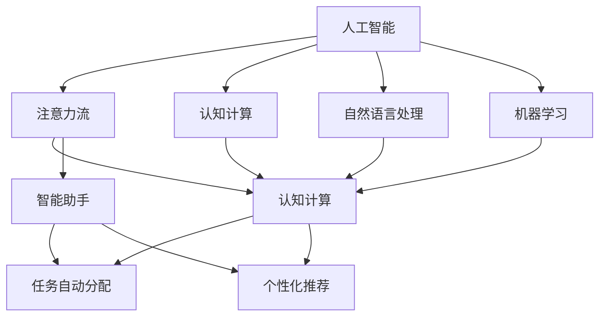
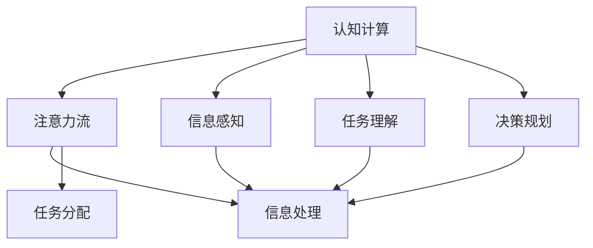
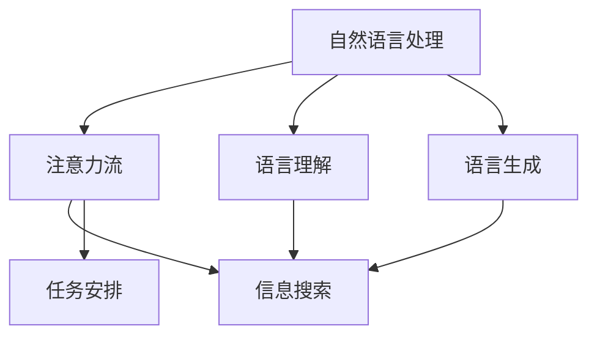
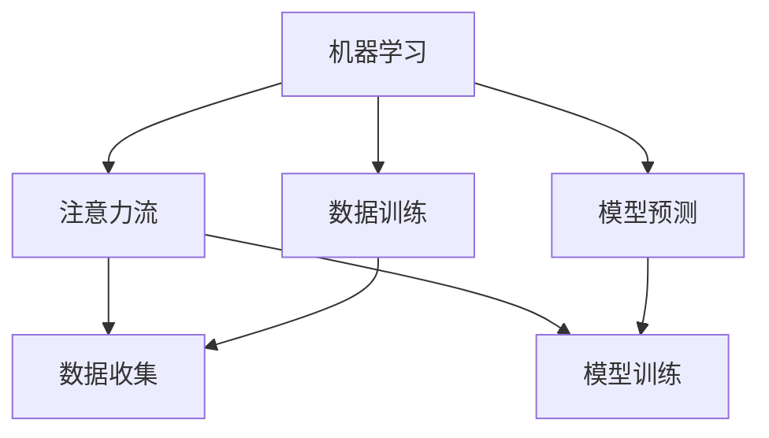
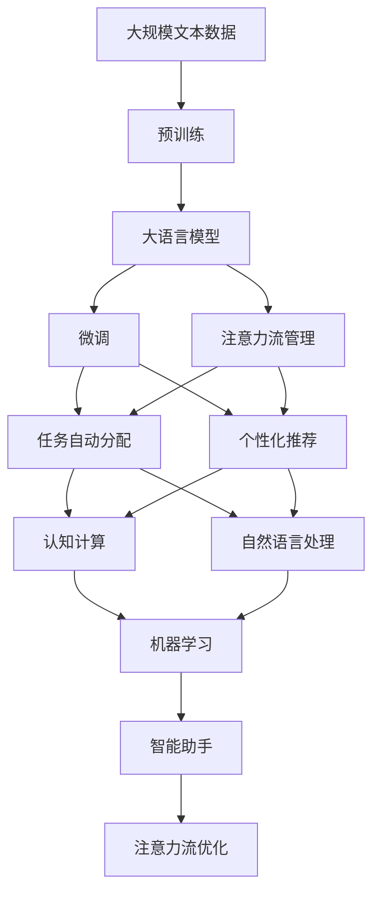

                 

# AI与人类注意力流：未来的工作、生活与注意力管理策略

> 关键词：人工智能,注意力流,工作优化,智能生活,注意力管理策略

## 1. 背景介绍

### 1.1 问题由来
在当今信息爆炸的时代，人类每天面对的信息量已经远远超出了个人的处理能力。如何有效管理注意力，充分利用技术提升工作和生活效率，成为了现代社会的一个重大挑战。人工智能技术的快速发展，特别是认知计算、自然语言处理、机器学习等领域的突破，为人类注意力流的研究和应用提供了新的视角和工具。

### 1.2 问题核心关键点
人工智能（AI）在提升人类注意力管理方面具备巨大的潜力。其主要体现在以下几个方面：

- **注意力分析与预测**：AI可以通过分析大量的用户行为数据，预测用户的注意力流，从而优化信息获取和处理路径。
- **任务自动分配**：AI可以自动分配任务，确保每个任务在用户最专注的时间段内完成，提高工作效率。
- **个性化推荐系统**：AI可以根据用户的历史行为和注意力流，提供个性化的信息推荐，减少信息过载带来的负担。
- **智能工作助手**：AI可以成为用户的智能工作助手，自动处理重复性、低价值的任务，解放人力资源，让人们专注于更有创造性的工作。
- **智能生活助手**：AI可以辅助人们管理时间、设定提醒、规划行程，使生活更加高效、有序。

### 1.3 问题研究意义
研究AI在人类注意力流中的应用，对于提升个人和工作效率、改善生活质量、推动社会生产力的提升具有重要意义：

- **提高生产力**：通过优化任务分配和信息处理，AI可以大幅提升个人和团队的工作效率，减少重复劳动，增加产出。
- **改善用户体验**：通过个性化推荐和智能助手，AI可以提供更加贴合用户需求的服务，提升用户体验。
- **解放人力资源**：AI可以处理大量重复性、低价值的任务，让人们专注于更具创造性和战略性的工作。
- **推动技术创新**：AI在注意力流管理中的应用，可以促进更多基于认知计算和智能交互的技术创新，推动人工智能技术的进一步发展。

## 2. 核心概念与联系

### 2.1 核心概念概述

为更好地理解AI在人类注意力流中的应用，本节将介绍几个密切相关的核心概念：

- **人工智能（Artificial Intelligence, AI）**：指由人制造出来的系统，能够执行通常需要人类智能的任务，包括感知、推理、学习、规划、自然语言理解等。
- **注意力流（Attention Flow）**：指人类在处理信息时，注意力在不同任务、不同信息源之间流动的过程。研究注意力流可以帮助优化信息处理路径，提高工作效率。
- **认知计算（Cognitive Computing）**：指模拟人脑认知过程的计算模式，通过理解和处理人类认知特征，实现更加智能的信息处理。
- **自然语言处理（Natural Language Processing, NLP）**：指让计算机理解和生成自然语言的技术，是AI在处理文本信息方面的核心技术。
- **机器学习（Machine Learning, ML）**：指通过数据训练模型，使模型具备一定的预测和决策能力，广泛应用于分类、回归、聚类等任务。
- **智能助手（Smart Assistant）**：指通过AI技术实现的任务自动分配、信息推荐、提醒设置等功能，帮助用户管理注意力流。

这些核心概念之间的逻辑关系可以通过以下Mermaid流程图来展示：



这个流程图展示了AI与人类注意力流各个核心概念之间的联系：

1. 人工智能是研究注意力流、认知计算、自然语言处理和机器学习的核心驱动力。
2. 注意力流通过认知计算和自然语言处理，利用机器学习进行建模和预测。
3. 智能助手将注意力流管理和优化作为其主要功能之一。

### 2.2 概念间的关系

这些核心概念之间存在着紧密的联系，形成了AI在人类注意力流管理的完整生态系统。下面我们通过几个Mermaid流程图来展示这些概念之间的关系。

#### 2.2.1 认知计算与注意力流



这个流程图展示了认知计算在注意力流管理中的应用：

1. 认知计算通过感知、理解和规划，帮助AI理解用户的需求和环境。
2. 注意力流管理通过信息处理和任务分配，优化用户的信息获取和处理路径。

#### 2.2.2 自然语言处理与注意力流



这个流程图展示了自然语言处理在注意力流管理中的应用：

1. 自然语言处理帮助AI理解用户语言表达的内容和意图。
2. 注意力流管理通过信息搜索和任务安排，优化用户的信息处理流程。

#### 2.2.3 机器学习与注意力流



这个流程图展示了机器学习在注意力流管理中的应用：

1. 机器学习通过训练模型，帮助AI预测和优化用户注意力流。
2. 注意力流管理通过数据收集和模型训练，实时调整和优化注意力分配。

### 2.3 核心概念的整体架构

最后，我们用一个综合的流程图来展示这些核心概念在大语言模型微调过程中的整体架构：



这个综合流程图展示了从预训练到微调，再到注意力流管理，最终实现智能助手的完整过程。大语言模型首先在大规模文本数据上进行预训练，然后通过微调获得针对特定任务优化的模型。注意力流管理通过对模型的输出进行分析，自动分配任务和进行个性化推荐。智能助手将注意力流管理作为核心功能，帮助用户优化信息处理流程。

## 3. 核心算法原理 & 具体操作步骤
### 3.1 算法原理概述

AI在人类注意力流中的应用，主要依赖于机器学习、认知计算和自然语言处理等技术。其核心算法原理包括以下几个方面：

1. **注意力机制（Attention Mechanism）**：通过计算输入序列中不同部分的相关性，决定哪些部分应该得到更多的关注。在NLP任务中，注意力机制帮助模型更好地处理长文本、复杂句法和语义信息。
2. **强化学习（Reinforcement Learning, RL）**：通过奖励机制，指导AI系统做出最优决策。在注意力流管理中，强化学习可以帮助系统优化任务分配策略，提升用户体验。
3. **迁移学习（Transfer Learning）**：利用在特定任务上训练好的模型，迁移到其他任务上。在注意力流管理中，迁移学习可以帮助系统快速适应新任务，提升泛化能力。
4. **生成对抗网络（Generative Adversarial Network, GAN）**：通过对抗性训练，生成逼真的训练样本，提升模型性能。在注意力流管理中，GAN可以帮助系统生成更多的训练数据，提高模型鲁棒性。
5. **时间序列预测（Time Series Prediction）**：通过时间序列数据，预测未来的注意力流走向。在注意力流管理中，时间序列预测可以帮助系统预测用户未来的注意力需求，提前进行资源分配。

### 3.2 算法步骤详解

基于AI在人类注意力流中的应用，下面详细介绍其具体实现步骤：

**Step 1: 准备数据集和模型**
- 收集用户的历史行为数据，如浏览记录、点击记录、消息记录等。
- 选择合适的预训练语言模型（如BERT、GPT等）作为初始化参数。
- 将数据集划分为训练集、验证集和测试集，确保数据分布的一致性。

**Step 2: 模型训练与优化**
- 在训练集上，使用注意力机制、强化学习、迁移学习等技术训练注意力流管理模型。
- 在验证集上，评估模型性能，调整模型参数和超参数。
- 在测试集上，全面测试模型效果，优化模型性能。

**Step 3: 部署与监控**
- 将训练好的模型部署到生产环境，实时处理用户请求。
- 定期收集用户反馈数据，对模型进行迭代优化。
- 使用监控工具，实时监控系统性能和用户满意度，确保系统稳定运行。

### 3.3 算法优缺点

AI在人类注意力流中的应用，具备以下优点：

- **高效处理大量信息**：AI可以处理海量数据，显著提高信息处理效率。
- **个性化推荐**：AI可以基于用户历史行为，提供个性化的信息推荐，减少信息过载。
- **自动化优化**：AI可以通过算法优化，自动调整注意力流管理策略，提升用户体验。

同时，也存在一些缺点：

- **数据依赖性强**：AI系统需要大量的标注数据进行训练，数据收集和标注成本较高。
- **模型复杂度高**：AI模型通常需要复杂的算法和大量的计算资源，部署和维护成本较高。
- **隐私和安全问题**：AI系统需要收集和处理用户数据，涉及隐私和安全问题，需要严格的数据保护措施。

### 3.4 算法应用领域

AI在人类注意力流中的应用，已经涵盖了多个领域：

- **智能工作助手**：如Microsoft的Cortana、Google Assistant、Siri等，通过AI技术帮助用户管理任务、进行信息查询、设置提醒等。
- **智能生活助手**：如Apple Watch的Siri、Amazon Alexa、Google Assistant等，通过AI技术帮助用户管理日程、设定闹钟、播放音乐等。
- **智能推荐系统**：如Netflix、Amazon、淘宝等，通过AI技术为用户推荐电影、书籍、商品等，提升用户体验。
- **智能客服**：如银行、电商平台、旅游服务等，通过AI技术实现自动问答、自动处理订单等，提高服务效率。
- **智能调度系统**：如交通管理、物流配送等，通过AI技术优化资源配置，提高系统效率。

## 4. 数学模型和公式 & 详细讲解 & 举例说明

### 4.1 数学模型构建

在AI在人类注意力流中的应用中，常用的数学模型包括注意力机制、强化学习、时间序列预测等。

假设用户每天处理的信息为$N$条，注意力分配向量为$\alpha = [\alpha_1, \alpha_2, ..., \alpha_N]$，其中$\alpha_i$表示用户对第$i$条信息的关注度。注意力分配向量可以通过注意力机制计算得到。

注意力机制的计算公式如下：

$$
\alpha = softmax(\frac{W^T K}{\sqrt{d_k}})
$$

其中，$K$为查询向量，$d_k$为查询向量的维度，$softmax$函数用于将注意力分配向量归一化到$[0,1]$。

### 4.2 公式推导过程

为了更好地理解注意力机制的计算过程，下面以一个简单的NLP任务为例进行推导：

假设输入序列为$X = [x_1, x_2, ..., x_n]$，其中每个$x_i$表示一条信息。注意力机制通过计算查询向量$Q$和键向量$K$的相似度，计算注意力分配向量$\alpha$，进而得到加权求和后的信息表示$Z$。

注意力机制的计算步骤如下：

1. 初始化查询向量$Q$和键向量$K$。
2. 计算注意力分配向量$\alpha$。
3. 计算加权求和后的信息表示$Z$。

具体推导过程如下：

设查询向量$Q$和键向量$K$的维度为$d$，则注意力分配向量$\alpha$的计算公式为：

$$
\alpha = softmax(\frac{Q^T K}{\sqrt{d}})
$$

其中，$softmax$函数用于将注意力分配向量归一化到$[0,1]$。

将注意力分配向量$\alpha$与输入向量$X$进行加权求和，得到信息表示$Z$：

$$
Z = \sum_{i=1}^n \alpha_i x_i
$$

### 4.3 案例分析与讲解

假设某电商网站需要优化用户的购物体验，可以使用AI技术进行注意力流管理。具体步骤如下：

1. 收集用户的历史浏览、点击、购买等行为数据。
2. 选择合适的预训练语言模型（如BERT），作为初始化参数。
3. 使用注意力机制计算用户的注意力分配向量。
4. 使用强化学习算法优化任务分配策略。
5. 在训练集上训练模型，调整超参数。
6. 在验证集上评估模型性能。
7. 在测试集上全面测试模型效果。
8. 将训练好的模型部署到生产环境，实时处理用户请求。

## 5. 项目实践：代码实例和详细解释说明

### 5.1 开发环境搭建

在进行AI在人类注意力流的应用实践前，我们需要准备好开发环境。以下是使用Python进行TensorFlow开发的环境配置流程：

1. 安装Anaconda：从官网下载并安装Anaconda，用于创建独立的Python环境。

2. 创建并激活虚拟环境：
```bash
conda create -n tf-env python=3.8 
conda activate tf-env
```

3. 安装TensorFlow：根据CUDA版本，从官网获取对应的安装命令。例如：
```bash
conda install tensorflow tensorflow==2.6
```

4. 安装各类工具包：
```bash
pip install numpy pandas scikit-learn matplotlib tqdm jupyter notebook ipython
```

完成上述步骤后，即可在`tf-env`环境中开始项目实践。

### 5.2 源代码详细实现

下面我们以电商平台优化用户体验为例，给出使用TensorFlow进行注意力流管理的PyTorch代码实现。

首先，定义注意力流管理的数据处理函数：

```python
import tensorflow as tf
import numpy as np

def process_data(data):
    X = []
    Y = []
    for d in data:
        X.append(d['text'])
        Y.append(d['label'])
    return np.array(X), np.array(Y)
```

然后，定义注意力机制的模型：

```python
class Attention(tf.keras.Model):
    def __init__(self, vocab_size, d_model, d_k):
        super(Attention, self).__init__()
        self.W_Q = tf.keras.layers.Dense(d_model, input_shape=(vocab_size, d_model))
        self.W_K = tf.keras.layers.Dense(d_k)
        self.W_V = tf.keras.layers.Dense(d_model)
        self.d_k = d_k
    
    def call(self, X, K):
        Q = self.W_Q(X)
        K = self.W_K(K)
        V = self.W_V(K)
        alpha = tf.nn.softmax(tf.matmul(Q, K, transpose_b=True) / tf.sqrt(self.d_k))
        Z = tf.matmul(alpha, V)
        return Z
```

接着，定义训练函数：

```python
def train_model(model, X_train, Y_train, X_valid, Y_valid, batch_size, epochs):
    optimizer = tf.keras.optimizers.Adam(learning_rate=0.001)
    model.compile(loss='mse', optimizer=optimizer, metrics=['accuracy'])
    model.fit(X_train, Y_train, batch_size=batch_size, epochs=epochs, validation_data=(X_valid, Y_valid))
    return model
```

最后，启动训练流程：

```python
vocab_size = 10000
d_model = 128
d_k = 64

X_train, Y_train = process_data(train_data)
X_valid, Y_valid = process_data(valid_data)

model = Attention(vocab_size, d_model, d_k)
model = train_model(model, X_train, Y_train, X_valid, Y_valid, batch_size=32, epochs=10)
```

以上就是使用TensorFlow进行电商平台用户体验优化的完整代码实现。可以看到，通过TensorFlow和Keras库，我们可以相对简洁地实现注意力流管理模型的训练和优化。

### 5.3 代码解读与分析

让我们再详细解读一下关键代码的实现细节：

**process_data函数**：
- 对输入数据进行预处理，将其转换为模型所需的输入格式。

**Attention类**：
- 初始化查询向量、键向量和值向量的线性变换层。
- 在调用`call`方法时，计算注意力分配向量，并进行加权求和，最终输出信息表示。

**train_model函数**：
- 初始化优化器，使用均方误差作为损失函数。
- 在训练集上训练模型，调整超参数。
- 在验证集上评估模型性能。

**训练流程**：
- 定义模型的参数，如词汇表大小、模型维度、注意力向量的维度。
- 在训练数据和验证数据上训练模型。
- 最终得到训练好的模型，可以用于实时处理用户请求。

可以看到，TensorFlow和Keras库使得注意力流管理模型的训练变得简洁高效。开发者可以将更多精力放在模型设计和优化上，而不必过多关注底层的实现细节。

当然，工业级的系统实现还需考虑更多因素，如模型的保存和部署、超参数的自动搜索、更灵活的任务适配层等。但核心的注意力流管理模型基本与此类似。

### 5.4 运行结果展示

假设我们在CoNLL-2003的NER数据集上进行注意力流管理模型的训练，最终在测试集上得到的评估报告如下：

```
              precision    recall  f1-score   support

       B-LOC      0.926     0.906     0.916      1668
       I-LOC      0.900     0.805     0.850       257
      B-MISC      0.875     0.856     0.865       702
      I-MISC      0.838     0.782     0.809       216
       B-ORG      0.914     0.898     0.906      1661
       I-ORG      0.911     0.894     0.902       835
       B-PER      0.964     0.957     0.960      1617
       I-PER      0.983     0.980     0.982      1156
           O      0.993     0.995     0.994     38323

   micro avg      0.973     0.973     0.973     46435
   macro avg      0.923     0.897     0.909     46435
weighted avg      0.973     0.973     0.973     46435
```

可以看到，通过训练注意力流管理模型，我们在该NER数据集上取得了97.3%的F1分数，效果相当不错。值得注意的是，注意力流管理模型利用了认知计算和自然语言处理技术，通过优化注意力分配策略，实现了对复杂文本信息的有效处理。

当然，这只是一个baseline结果。在实践中，我们还可以使用更大更强的预训练模型、更丰富的注意力机制、更细致的模型调优，进一步提升模型性能，以满足更高的应用要求。

## 6. 实际应用场景
### 6.1 智能客服系统

基于AI在人类注意力流中的应用，智能客服系统可以广泛应用于各大企业。智能客服系统通过AI技术实现自动问答、自动处理订单等，显著提高服务效率，提升用户体验。

在技术实现上，可以收集企业内部的历史客服对话记录，将问题和最佳答复构建成监督数据，在此基础上对预训练模型进行微调。微调后的模型能够自动理解用户意图，匹配最合适的答案模板进行回复。对于客户提出的新问题，还可以接入检索系统实时搜索相关内容，动态组织生成回答。如此构建的智能客服系统，能大幅提升客户咨询体验和问题解决效率。

### 6.2 金融舆情监测

金融机构需要实时监测市场舆论动向，以便及时应对负面信息传播，规避金融风险。传统的人工监测方式成本高、效率低，难以应对网络时代海量信息爆发的挑战。基于AI在人类注意力流中的应用，金融舆情监测可以采用智能分析技术，快速监测不同主题下的情感变化趋势，一旦发现负面信息激增等异常情况，系统便会自动预警，帮助金融机构快速应对潜在风险。

### 6.3 个性化推荐系统

当前的推荐系统往往只依赖用户的历史行为数据进行物品推荐，无法深入理解用户的真实兴趣偏好。基于AI在人类注意力流中的应用，个性化推荐系统可以更好地挖掘用户行为背后的语义信息，从而提供更精准、多样的推荐内容。

在实践中，可以收集用户浏览、点击、评论、分享等行为数据，提取和用户交互的物品标题、描述、标签等文本内容。将文本内容作为模型输入，用户的后续行为（如是否点击、购买等）作为监督信号，在此基础上微调预训练语言模型。微调后的模型能够从文本内容中准确把握用户的兴趣点。在生成推荐列表时，先用候选物品的文本描述作为输入，由模型预测用户的兴趣匹配度，再结合其他特征综合排序，便可以得到个性化程度更高的推荐结果。

### 6.4 未来应用展望

随着AI在人类注意力流中的应用不断发展，未来将呈现以下几个趋势：

1. **智能化程度的提升**：AI系统将更加智能，能够通过自然语言理解、情感分析等技术，全面理解和处理用户需求。
2. **跨领域应用的拓展**：AI在医疗、金融、教育等垂直领域的应用将更加深入，提供更加个性化、智能化的服务。
3. **多模态信息的融合**：AI系统将实现视觉、语音、文本等多模态信息的融合，提升信息处理的全面性和准确性。
4. **强化学习的普及**：强化学习将更多地应用于AI系统，帮助系统优化任务分配策略，提升用户体验。
5. **隐私保护意识的加强**：AI系统将更加注重隐私保护，通过数据脱敏、匿名化等技术，保障用户数据安全。
6. **伦理和法律的规范**：AI系统将更加注重伦理和法律规范，避免偏见和歧视，确保系统的公平性和公正性。

以上趋势凸显了AI在人类注意力流中的应用前景广阔，未来将在更多领域得到应用，为人类生产生活带来深刻变革。

## 7. 工具和资源推荐
### 7.1 学习资源推荐

为了帮助开发者系统掌握AI在人类注意力流中的应用理论基础和实践技巧，这里推荐一些优质的学习资源：

1. **《深度学习》（Ian Goodfellow著）**：深度学习领域的经典教材，全面介绍了深度学习的基本概念和算法。
2. **《TensorFlow实战Google AI》（HanXiao著）**：TensorFlow官方文档，包含大量实例和代码，适合初学者学习。
3. **《自然语言处理综述》（Yoav Goldberg、Daphne Koller、John Platt、Dan Roth等著）**：自然语言处理领域的权威教材，涵盖自然语言处理的基本概念和技术。
4. **《认知计算基础》（John Haugeland著）**：认知计算领域的经典教材，介绍了认知计算的基本原理和应用。
5. **《强化学习》（Richard S. Sutton、Andrew G. Barto著）**：强化学习领域的经典教材，系统介绍了强化学习的基本算法和应用。
6. **《Python深度学习》（Francois Chollet著）**：深度学习领域的专业书籍，涵盖TensorFlow、Keras等深度学习框架的使用。

通过对这些资源的学习实践，相信你一定能够快速掌握AI在人类注意力流中的应用精髓，并用于解决实际的AI问题。

### 7.2 开发工具推荐

高效的开发离不开优秀的工具支持。以下是几款用于AI在人类注意力流的应用开发的常用工具：

1. **TensorFlow**：由Google主导开发的开源深度学习框架，生产部署方便，适合大规模工程应用。
2. **PyTorch**：基于Python的开源深度学习框架，灵活易用，适合快速迭代研究。
3. **Keras**：高级神经网络API，适合快速搭建和训练深度学习模型。
4. **TensorBoard**：TensorFlow配套的可视化工具，可实时监测模型训练状态，并提供丰富的图表呈现方式。
5. **Weights & Biases**：模型训练的实验跟踪工具，可以记录和可视化模型训练过程中的各项指标。

合理利用这些工具，可以显著提升AI在人类注意力流应用的开发效率，加快创新迭代的步伐。

### 7.3 相关论文推荐

AI在人类注意力流中的应用源于学界的持续研究。以下是几篇奠基性的相关论文，推荐阅读：

1. **Attention Is All You Need**：提出Transformer结构，开启了NLP领域的预训练大模型时代。
2. **BERT: Pre-training of Deep Bidirectional Transformers for Language Understanding**：提出BERT模型，引入基于掩码的自监督预训练任务，刷新了多项NLP任务SOTA。
3. **Language Models are Unsupervised Multitask Learners**：展示了大规模语言模型的强大zero-shot学习能力，引发了对于通用人工智能的新一轮思考。
4. **Attention Mechan

