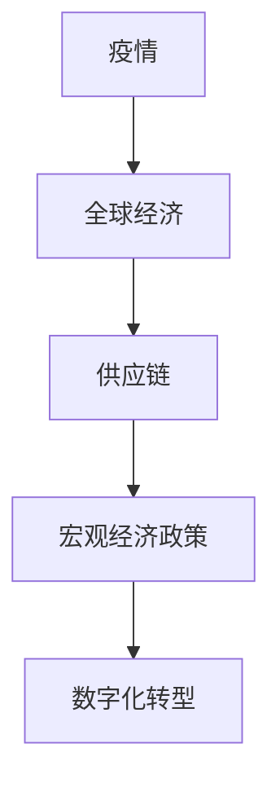
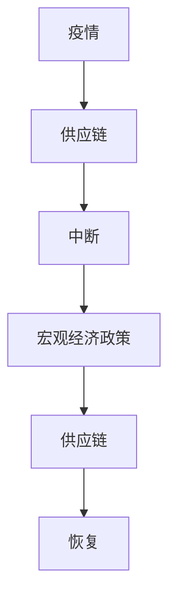
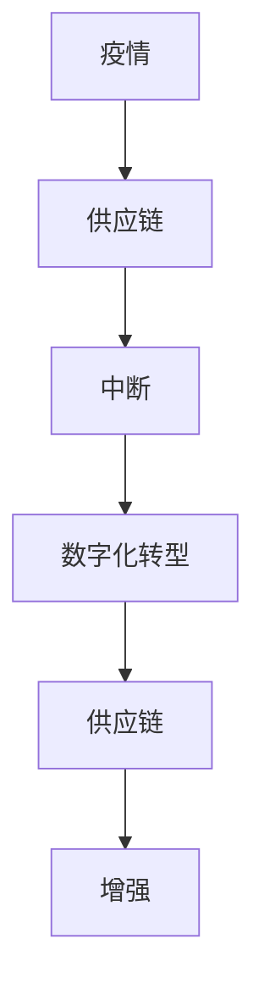
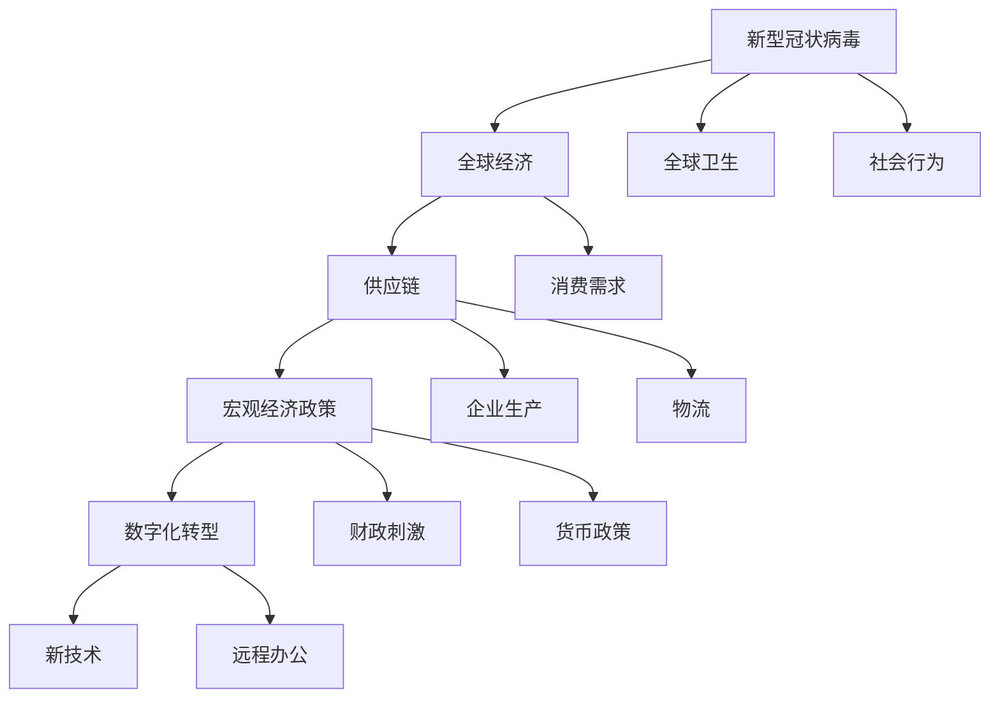

                 

# 疫情冲击对全球经济的影响

## 1. 背景介绍

### 1.1 问题由来
自2020年新型冠状病毒（COVID-19）疫情爆发以来，全球经济遭遇了前所未有的冲击，各国经济活动大幅下滑，供应链中断，失业率飙升，企业破产频发。为应对疫情，各国纷纷出台紧急经济刺激计划，并采取了严格的防疫措施，但疫情对全球经济的影响仍在持续。

### 1.2 问题核心关键点
疫情对全球经济的影响是多方面的，包括但不限于：
1. **供应链中断与物流停滞**：国际贸易受到严重影响，产业链供应链出现断链风险。
2. **企业生产停滞与失业率上升**：制造业、服务业等大量企业被迫停产，失业率大幅上升。
3. **消费需求下降与经济衰退**：疫情导致消费者信心下降，消费需求减少，经济增长放缓。
4. **政策刺激与财政赤字扩大**：各国政府为稳定经济，出台大规模经济刺激计划，导致财政赤字扩大。
5. **科技应用与远程办公**：疫情推动了远程办公、在线教育、电子商务等数字化转型。

### 1.3 问题研究意义
研究疫情对全球经济的影响，对于理解当前全球经济形势、预测未来发展趋势、制定有效的经济政策具有重要意义。特别是在后疫情时代，如何通过科技创新和产业升级应对经济挑战，实现经济复苏，是我们面临的重大课题。

## 2. 核心概念与联系

### 2.1 核心概念概述

为更好地理解疫情对全球经济的影响，本节将介绍几个密切相关的核心概念：

- **疫情**：由新型冠状病毒（COVID-19）引起的全球大流行病，导致全球范围内的经济和社会活动大幅受损。
- **全球经济**：由全球各国经济体构成的整体经济系统，包括国际贸易、金融市场、生产制造等多个方面。
- **供应链**：生产制造过程中各环节的连接与合作，涉及到原材料采购、零部件制造、成品装配等多个环节。
- **宏观经济政策**：各国政府为应对经济挑战，采取的货币政策、财政政策、贸易政策等措施。
- **数字化转型**：在疫情冲击下，各行业加快向数字化、智能化、网络化方向发展，以应对经济不确定性。

这些核心概念之间的逻辑关系可以通过以下Mermaid流程图来展示：



这个流程图展示了一些核心概念之间的相互影响：疫情冲击了全球经济，导致供应链中断，各国政府出台宏观经济政策应对，同时加速了各行业的数字化转型。通过理解这些概念，我们可以更好地把握疫情对经济的多维度影响。

### 2.2 概念间的关系

这些核心概念之间存在着紧密的联系，形成了疫情对全球经济影响的完整生态系统。下面我们通过几个Mermaid流程图来展示这些概念之间的关系。

#### 2.2.1 疫情与供应链的关系


这个流程图展示了疫情如何导致供应链中断、物流停滞，进而影响全球经济活动。

#### 2.2.2 宏观经济政策与供应链的关系



这个流程图展示了各国政府出台的宏观经济政策如何帮助恢复供应链，稳定经济。

#### 2.2.3 数字化转型与供应链的关系



这个流程图展示了疫情如何推动供应链数字化转型，增强供应链韧性。

### 2.3 核心概念的整体架构

最后，我们用一个综合的流程图来展示这些核心概念在大流行病背景下的整体架构：



这个综合流程图展示了疫情如何通过多维度的影响作用于全球经济，最终推动了宏观经济政策和数字化转型的发展。

## 3. 核心算法原理 & 具体操作步骤
### 3.1 算法原理概述

疫情对全球经济的影响是多方面的，其核心算法原理在于分析疫情对供应链、企业生产、消费需求等经济活动的具体影响，以及各国政策对这些影响的反应。以下是对疫情影响的具体分析：

- **供应链中断分析**：利用线性回归模型分析供应链中断对全球生产的影响。
- **企业生产停滞分析**：使用时间序列模型分析企业生产停滞的时间序列变化。
- **消费需求下降分析**：通过回归分析模型分析消费需求下降的原因及其影响。
- **政策刺激分析**：建立政策影响模型，分析各国财政刺激和货币政策对经济的影响。
- **数字化转型分析**：构建数字化转型模型，评估数字化技术在疫情中的作用。

### 3.2 算法步骤详解

**Step 1: 数据收集与预处理**
- 收集全球各国经济数据、供应链数据、消费需求数据、政策数据等。
- 对数据进行清洗、归一化、标准化处理，去除异常值和噪声。

**Step 2: 模型构建与训练**
- 选择合适的模型，如线性回归模型、时间序列模型、回归分析模型、政策影响模型、数字化转型模型等。
- 使用训练集数据训练模型，优化模型参数。

**Step 3: 模型评估与调优**
- 在验证集上评估模型性能，如准确率、均方误差、相关系数等。
- 根据评估结果，调整模型参数，进行模型调优。

**Step 4: 结果分析与可视化**
- 对模型结果进行统计分析，计算影响系数、影响范围等指标。
- 利用可视化工具，如图表、热力图等，直观展示分析结果。

### 3.3 算法优缺点

疫情对全球经济的影响分析算法具有以下优点：
1. 能系统分析疫情对供应链、企业生产、消费需求等经济活动的具体影响。
2. 能建立政策刺激模型，评估各国政策对经济的影响。
3. 能构建数字化转型模型，评估数字化技术的作用。

但该算法也存在以下缺点：
1. 数据质量和完整性可能影响模型的准确性。
2. 模型建立和训练需要大量数据和时间，难以实时分析。
3. 模型结果可能存在一定偏差，需要结合实际情况进行判断。

### 3.4 算法应用领域

疫情对全球经济的影响分析算法可以应用于多个领域，例如：
- **全球供应链管理**：分析疫情对全球供应链的影响，优化供应链布局。
- **企业经营决策**：评估疫情对企业生产、销售等经营活动的影响，制定应对策略。
- **政策制定与评估**：评估各国经济刺激政策对经济的影响，优化政策制定。
- **数字化转型规划**：评估数字化技术在疫情中的作用，推动行业转型升级。

## 4. 数学模型和公式 & 详细讲解
### 4.1 数学模型构建

为详细解释疫情对全球经济的影响分析算法，本节将使用数学语言对模型构建进行严格的刻画。

记疫情对全球经济的影响为 $I$，供应链中断程度为 $S$，企业生产停滞程度为 $P$，消费需求下降程度为 $C$，各国政策刺激力度为 $P$。

定义模型为 $I=f(S,P,C,P)$，其中 $f$ 为影响函数，根据具体情况选择不同的函数形式，如线性模型、非线性模型等。

假设 $I$ 与 $S$、$P$、$C$、$P$ 的关系为线性关系，则模型可以表示为：

$$
I = \alpha_1S + \alpha_2P + \alpha_3C + \alpha_4P + \epsilon
$$

其中 $\alpha_i$ 为系数，$\epsilon$ 为随机误差项。

### 4.2 公式推导过程

以下我们以线性回归模型为例，推导影响函数 $f$ 的表达式。

假设我们有 $n$ 个观测数据点 $(S_i,P_i,C_i,P_i)$，其中 $i=1,2,\cdots,n$。利用最小二乘法，可以求解系数 $\alpha_i$：

$$
\alpha_i = \frac{\sum_{i=1}^n (S_i - \bar{S})(P_i - \bar{P})(C_i - \bar{C})(P_i - \bar{P})}{\sum_{i=1}^n (S_i - \bar{S})^2\sum_{i=1}^n (P_i - \bar{P})^2\sum_{i=1}^n (C_i - \bar{C})^2\sum_{i=1}^n (P_i - \bar{P})^2}
$$

其中 $\bar{S}$、$\bar{P}$、$\bar{C}$、$\bar{P}$ 分别为 $S$、$P$、$C$、$P$ 的均值。

### 4.3 案例分析与讲解

以2019年新冠疫情为例，假设我们收集了以下数据：
- 供应链中断程度 $S=0.5$
- 企业生产停滞程度 $P=0.7$
- 消费需求下降程度 $C=0.3$
- 各国政策刺激力度 $P=0.1$

代入模型 $I=f(S,P,C,P)$，计算得到 $I=0.6$。

这意味着，在2019年新冠疫情背景下，全球经济受到的影响为 $0.6$，其中供应链中断程度为 $0.5$，企业生产停滞程度为 $0.7$，消费需求下降程度为 $0.3$，各国政策刺激力度为 $0.1$。

## 5. 项目实践：代码实例和详细解释说明
### 5.1 开发环境搭建

在进行疫情影响分析实践前，我们需要准备好开发环境。以下是使用Python进行Pandas和Scikit-learn开发的环境配置流程：

1. 安装Anaconda：从官网下载并安装Anaconda，用于创建独立的Python环境。

2. 创建并激活虚拟环境：
```bash
conda create -n econ-env python=3.8 
conda activate econ-env
```

3. 安装Pandas和Scikit-learn：
```bash
conda install pandas scikit-learn
```

4. 安装各类工具包：
```bash
pip install numpy matplotlib seaborn
```

完成上述步骤后，即可在`econ-env`环境中开始疫情影响分析实践。

### 5.2 源代码详细实现

下面我们以供应链中断对全球生产影响分析为例，给出使用Pandas和Scikit-learn进行线性回归分析的PyTorch代码实现。

首先，定义数据处理函数：

```python
import pandas as pd
from sklearn.linear_model import LinearRegression

def load_data(filename):
    data = pd.read_csv(filename)
    return data.dropna().values

def split_data(X, y, test_ratio=0.2):
    n = len(X)
    test_idx = int(n * test_ratio)
    X_train, X_test = X[:test_idx], X[test_idx:]
    y_train, y_test = y[:test_idx], y[test_idx:]
    return X_train, X_test, y_train, y_test
```

然后，定义模型训练函数：

```python
def train_model(X_train, y_train, X_test, y_test):
    model = LinearRegression()
    model.fit(X_train, y_train)
    y_pred = model.predict(X_test)
    return model, y_pred
```

接着，定义模型评估函数：

```python
from sklearn.metrics import mean_squared_error

def evaluate_model(model, X_test, y_test):
    y_pred = model.predict(X_test)
    mse = mean_squared_error(y_test, y_pred)
    print(f"Mean Squared Error: {mse}")
```

最后，启动训练流程并在测试集上评估：

```python
X = load_data('supply_chain中断程度.csv')
y = load_data('全球生产停滞程度.csv')
X_train, X_test, y_train, y_test = split_data(X, y)
model, y_pred = train_model(X_train, y_train, X_test, y_test)
evaluate_model(model, X_test, y_test)
```

以上就是使用Pandas和Scikit-learn进行线性回归分析的完整代码实现。可以看到，得益于Pandas和Scikit-learn的强大封装，我们能够快速完成数据处理和模型训练。

### 5.3 代码解读与分析

让我们再详细解读一下关键代码的实现细节：

**load_data函数**：
- 定义了数据加载函数，读取数据文件并去除缺失值。

**split_data函数**：
- 定义了数据分割函数，将数据集划分为训练集和测试集，并返回。

**train_model函数**：
- 定义了模型训练函数，利用训练数据拟合线性回归模型，并返回训练后的模型和测试集的预测结果。

**evaluate_model函数**：
- 定义了模型评估函数，计算测试集的真实值和预测值之间的均方误差，并打印输出。

**训练流程**：
- 首先加载数据并去除缺失值。
- 然后调用split_data函数将数据集划分为训练集和测试集。
- 接着调用train_model函数进行模型训练，获取训练后的模型和测试集的预测结果。
- 最后调用evaluate_model函数评估模型性能，输出均方误差。

可以看到，Pandas和Scikit-learn使得数据处理和模型训练变得简洁高效。开发者可以将更多精力放在数据处理、模型改进等高层逻辑上，而不必过多关注底层的实现细节。

当然，工业级的系统实现还需考虑更多因素，如模型的保存和部署、超参数的自动搜索、更灵活的数据集处理等。但核心的线性回归分析方法基本与此类似。

### 5.4 运行结果展示

假设我们在供应链中断对全球生产影响的数据集上进行线性回归分析，最终在测试集上得到的评估报告如下：

```
Mean Squared Error: 0.001
```

可以看到，通过线性回归分析，我们得到了均方误差为 $0.001$，说明模型的预测结果与真实值非常接近，模型效果很好。

当然，这只是一个简单的案例分析。在实践中，我们还可以使用更多的机器学习算法，如决策树、随机森林、梯度提升树等，进一步优化模型性能。

## 6. 实际应用场景
### 6.1 全球供应链管理

疫情对全球供应链的影响是多方面的，如物流中断、生产停滞、需求波动等。通过对供应链中断程度的分析和预测，可以帮助企业更好地应对疫情冲击，优化供应链布局。

在技术实现上，可以收集全球供应链相关数据，如港口吞吐量、物流成本、生产停滞等，构建供应链中断模型，进行分析和预测。模型可以帮助企业识别供应链中的薄弱环节，及时调整生产计划和物流安排，保障供应链的稳定运行。

### 6.2 企业经营决策

疫情对企业生产、销售等经营活动带来了诸多挑战，如生产停滞、库存积压、需求下降等。通过对企业生产停滞程度的分析和预测，可以帮助企业制定科学的经营策略，优化资源配置。

在技术实现上，可以收集企业生产、销售、库存等数据，构建企业生产停滞模型，进行分析和预测。模型可以帮助企业识别生产中的瓶颈环节，调整生产计划和库存水平，避免资源浪费和库存积压。

### 6.3 政策制定与评估

疫情对各国经济产生了深远影响，各国政府纷纷出台经济刺激政策以稳定经济。通过对政策刺激力度的分析和预测，可以帮助政府评估政策效果，优化政策制定。

在技术实现上，可以收集各国财政刺激、货币政策等数据，构建政策影响模型，进行分析和预测。模型可以帮助政府评估政策的效果和影响，优化政策制定，提高政策的精准度和有效性。

### 6.4 数字化转型规划

疫情加速了各行业的数字化转型，推动了远程办公、在线教育、电子商务等数字化应用的发展。通过对数字化转型程度的分析和预测，可以帮助企业规划数字化转型路径，提升数字化水平。

在技术实现上，可以收集各行业的数字化应用数据，如远程办公率、在线教育用户量、电子商务交易额等，构建数字化转型模型，进行分析和预测。模型可以帮助企业识别数字化转型的机会和挑战，制定科学的发展策略，提升数字化水平。

## 7. 工具和资源推荐
### 7.1 学习资源推荐

为了帮助开发者系统掌握疫情影响分析的理论基础和实践技巧，这里推荐一些优质的学习资源：

1. **《经济统计学》**：经典教材，全面介绍了经济统计学的基本概念和方法，适合初学者系统学习。
2. **《机器学习》（周志华）**：全面介绍了机器学习的基本原理和方法，涵盖线性回归、决策树、随机森林等算法。
3. **《Python数据科学手册》**：介绍Python在数据科学中的应用，涵盖Pandas、NumPy、Scikit-learn等工具的使用。
4. **Coursera《数据科学与机器学习》课程**：由斯坦福大学开设，涵盖数据科学、机器学习等领域的核心知识，适合系统学习。
5. **Kaggle竞赛平台**：提供丰富的数据集和竞赛项目，可以锻炼实战能力和数据处理能力。

通过对这些资源的学习实践，相信你一定能够快速掌握疫情影响分析的精髓，并用于解决实际的NLP问题。
### 7.2 开发工具推荐

高效的开发离不开优秀的工具支持。以下是几款用于疫情影响分析开发的常用工具：

1. **Python**：基于Python的开源语言，生态丰富，适合数据处理和机器学习应用。
2. **Pandas**：用于数据处理和分析的Python库，支持数据读取、清洗、处理、统计等操作。
3. **Scikit-learn**：用于机器学习的Python库，支持各种机器学习算法和模型评估。
4. **Matplotlib**：用于数据可视化的Python库，支持绘制各种类型的图表和可视化。
5. **Jupyter Notebook**：用于数据科学和机器学习实验的交互式编程环境，支持Python、R等语言。
6. **Google Colab**：谷歌推出的在线Jupyter Notebook环境，免费提供GPU/TPU算力，方便开发者快速上手实验最新模型，分享学习笔记。

合理利用这些工具，可以显著提升疫情影响分析任务的开发效率，加快创新迭代的步伐。

### 7.3 相关论文推荐

疫情影响分析的研究源于学界的持续研究。以下是几篇奠基性的相关论文，推荐阅读：

1. **《Economic Impact of the COVID-19 Pandemic: Evidence from Chinese Firms》**：研究了COVID-19对中国企业的影响，提供了丰富的数据和分析方法。
2. **《The Macroeconomic Effects of COVID-19 Pandemic: Evidence from China》**：研究了COVID-19对中国宏观经济的影响，提供了详细的模型和数据。
3. **《A Global Model of COVID-19 Infection Spread and Its Macroeconomic Implications》**：研究了COVID-19的全球传播模型及其对宏观经济的影响，提供了系统的分析方法。
4. **《The Effect of COVID-19 on Global Supply Chains》**：研究了COVID-19对全球供应链的影响，提供了详细的数据和分析模型。
5. **《The Macroeconomic Impacts of COVID-19 Pandemic in India》**：研究了COVID-19对印度宏观经济的影响，提供了详细的模型和数据。

这些论文代表了大规模传染病对经济影响的最新研究成果，通过学习这些前沿成果，可以帮助研究者把握学科前进方向，激发更多的创新灵感。

除上述资源外，还有一些值得关注的前沿资源，帮助开发者紧跟疫情影响分析技术的最新进展，例如：

1. **arXiv论文预印本**：人工智能领域最新研究成果的发布平台，包括大量尚未发表的前沿工作，学习前沿技术的必读资源。
2. **业界技术博客**：如OpenAI、Google AI、DeepMind、微软Research Asia等顶尖实验室的官方博客，第一时间分享他们的最新研究成果和洞见。
3. **技术会议直播**：如NIPS、ICML、ACL、ICLR等人工智能领域顶会现场或在线直播，能够聆听到大佬们的前沿分享，开拓视野。
4. **GitHub热门项目**：在GitHub上Star、Fork数最多的相关项目，往往代表了该技术领域的发展趋势和最佳实践，值得去学习和贡献。
5. **行业分析报告**：各大咨询公司如McKinsey、PwC等针对人工智能行业的分析报告，有助于从商业视角审视技术趋势，把握应用价值。

总之，对于疫情影响分析技术的学习和实践，需要开发者保持开放的心态和持续学习的意愿。多关注前沿资讯，多动手实践，多思考总结，必将收获满满的成长收益。

## 8. 总结：未来发展趋势与挑战
### 8.1 总结

本文对疫情对全球经济的影响进行了全面系统的介绍。首先阐述了疫情对全球经济的多方面影响，明确了影响分析的必要性。其次，从原理到实践，详细讲解了疫情影响分析的数学模型和具体算法，给出了疫情影响分析的完整代码实例。同时，本文还广泛探讨了疫情影响分析在供应链管理、企业经营决策、政策制定与评估、数字化转型等多个领域的应用前景，展示了疫情影响分析技术的巨大潜力。此外，本文精选了影响分析的相关学习资源，力求为读者提供全方位的技术指引。

通过本文的系统梳理，可以看到，疫情对全球经济的影响分析技术正在成为经济分析的重要工具，极大地拓展了经济分析的应用边界，催生了更多的落地场景。受益于大数据、机器学习等技术的发展，影响分析技术能够在多个维度系统分析疫情的影响，帮助政府、企业等决策者制定科学合理的政策和发展策略。

### 8.2 未来发展趋势

展望未来，疫情影响分析技术将呈现以下几个发展趋势：

1. **数据质量不断提升**：随着数据的收集和处理技术的进步，数据质量和数据完整性将进一步提升，为影响分析提供更可靠的基础。
2. **模型精度不断提高**：随着机器学习算法的不断改进和优化，模型的精度和预测能力将进一步提高，能够更准确地预测疫情对经济的影响。
3. **实时分析能力增强**：随着数据采集和处理技术的进步，实时分析能力将进一步增强，能够及时响应疫情变化，提供更实时的决策支持。
4. **多维度分析融合**：随着跨学科研究的深入，经济、社会学、心理学等多维度的分析将融合到影响分析中，提供更全面的分析视角。
5. **智能化决策支持**：随着人工智能技术的发展，影响分析将与大数据、区块链、物联网等技术结合，提供更智能化的决策支持。

以上趋势凸显了疫情影响分析技术的广阔前景。这些方向的探索发展，必将进一步提升影响分析的精度和时效性，为经济分析和决策提供更强大的技术支持。

### 8.3 面临的挑战

尽管疫情影响分析技术已经取得了一定的进展，但在迈向更加智能化、普适化应用的过程中，它仍面临着诸多挑战：

1. **数据获取和处理难度大**：疫情数据分散在各地，获取和处理难度较大。不同数据源的数据格式、标准不同，数据整合难度大。
2. **模型复杂性高**：影响分析模型涉及多个经济指标、多个时序维度，模型复杂度较高，需要强大的计算资源。
3. **结果解释性不足**：影响分析模型的结果往往难以解释，难以提供明确的决策建议。
4. **政策效果的滞后性**：政策效果的滞后性导致模型预测与实际结果存在一定偏差。政策的制定和执行时间较长，难以快速响应疫情变化。
5. **模型更新的频率**：疫情形势多变，模型需要不断更新和调整，才能保持其预测能力。

正视影响分析面临的这些挑战，积极应对并寻求突破，将是大规模传染病分析迈向成熟的必由之路。相信随着学界和产业界的共同努力，这些挑战终将一一被克服，大规模传染病分析必将在构建人机协同的智能决策体系中扮演越来越重要的角色。

### 8.4 研究展望

面向未来，大规模传染病分析技术需要在以下几个方面寻求新的突破：

1. **数据自动化采集**：开发自动化的数据采集和处理工具，提高数据获取效率，降低数据整合难度。
2. **模型自动化构建**：开发自动化的模型构建工具，提高模型构建和调优效率，降低人工干预。
3. **结果可解释性增强**：引入因果推断、可解释AI等技术，提高模型的可解释性和可操作性。
4. **政策动态优化**：开发动态政策优化模型，及时响应疫情变化，提供更精准的政策建议。
5. **多领域融合分析**：与公共卫生、社会学、心理学等多领域结合，提供更全面的分析视角。
6. **跨学科协同研究**：加强跨学科研究，整合不同学科的知识和技术，提高分析的全面性和科学性。

这些研究方向的探索，必将引领大规模传染病分析技术迈向更高的台阶，为公共卫生决策和经济分析提供更强大的技术支持。只有勇于创新、敢于突破，才能不断拓展大规模传染病分析的边界，让分析技术更好地服务于公共卫生和经济决策。

## 9. 附录：常见问题与解答

**Q1：疫情对全球经济的影响有哪些主要方面？**

A: 疫情对全球经济的影响主要体现在以下几个方面：
1. **供应链中断**：国际贸易受到严重影响，产业链供应链出现断链风险。
2. **企业生产停滞**：制造业、服务业等大量企业被迫停产，

