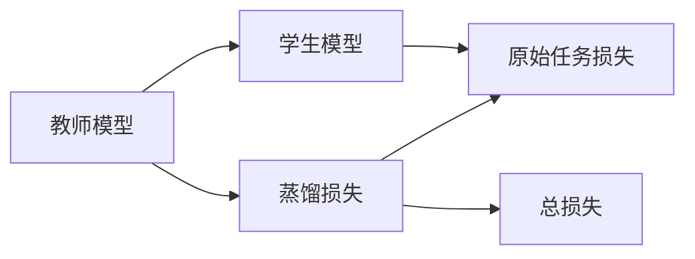

                 

# 知识蒸馏在模型压缩中的创新应用

## 1. 背景介绍

在当今数据科学和人工智能领域，深度学习模型因其强大的表示能力和出色的性能而被广泛应用。然而，随着模型规模的不断扩大，其计算复杂度和存储需求也随之增加。这不仅对计算资源提出了更高的要求，还带来了更高的能量消耗和训练成本。

为了缓解这些问题，模型压缩技术逐渐兴起。其中，知识蒸馏（Knowledge Distillation）是一种通过训练一个小模型（蒸馏模型）来复制大模型（教师模型）的能力的方法。它通过将大模型的知识传递给小模型，使小模型能够在保持高精度的同时大幅减少参数数量和计算成本。

本文将详细介绍知识蒸馏的基本原理、操作步骤及其在模型压缩中的应用，并通过具体案例展示其在实际项目中的创新应用。

## 2. 核心概念与联系

### 2.1 核心概念概述

知识蒸馏是一种模型压缩技术，其核心思想是将大模型的知识（通常是其预测能力）蒸馏到一个小模型中。这通过在大模型和小模型之间进行联合训练来实现，其中大模型作为“教师”，小模型作为“学生”。知识蒸馏的目标是在小模型中保留大模型的重要特征，从而减少小模型的参数数量，同时保持其性能。

知识蒸馏的应用领域广泛，包括但不限于计算机视觉、自然语言处理、音频处理等。在计算机视觉领域，知识蒸馏已经被应用于图像分类、目标检测和语义分割等任务。在自然语言处理领域，知识蒸馏被用于文本分类、情感分析和机器翻译等任务。

### 2.2 核心概念间的联系

知识蒸馏涉及以下几个核心概念：

- **教师模型（Teacher Model）**：在大模型中选择一个作为教师模型，通常是精度高且参数量大的模型。
- **学生模型（Student Model）**：一个小模型，通常参数量少且计算成本低。
- **知识传递（Knowledge Transfer）**：通过教师模型对学生模型进行指导，使其学习教师模型的知识和能力。
- **损失函数（Loss Function）**：用于衡量教师模型和学生模型之间的差异，包括蒸馏损失和原始任务的损失。

这些概念之间的联系可以通过以下Mermaid流程图来展示：



其中，蒸馏损失（蒸馏损失）用于衡量教师模型和学生模型之间的预测差异，而原始任务损失（原始任务损失）用于衡量学生模型在原始任务上的表现。总损失（总损失）是两者的加权和。

## 3. 核心算法原理 & 具体操作步骤

### 3.1 算法原理概述

知识蒸馏的算法原理是通过教师模型和学生模型之间的联合训练，使学生模型学习教师模型的预测能力。教师模型的输出被视为目标，学生模型尝试通过匹配这些目标来学习教师模型的知识。

知识蒸馏可以分为两种主要类型：软蒸馏和硬蒸馏。在软蒸馏中，教师模型对每个样本的输出都被视为一个概率分布，学生模型通过匹配这些分布来学习教师模型的知识。在硬蒸馏中，教师模型对每个样本的输出被视为一个具体的标签，学生模型通过匹配这些标签来学习教师模型的知识。

### 3.2 算法步骤详解

知识蒸馏的操作步骤如下：

1. **选择合适的教师模型和学生模型**：通常选择教师模型为精度高且参数量大的模型，学生模型为参数量小且计算成本低的模型。
2. **定义蒸馏损失和原始任务损失**：根据具体的任务类型和教师模型的输出，定义蒸馏损失和原始任务损失。
3. **联合训练**：通过联合训练教师模型和学生模型，使学生模型学习教师模型的知识和能力。
4. **评估和调整**：评估学生模型的性能，根据需要调整蒸馏损失和原始任务损失的权重，进一步优化学生模型。

### 3.3 算法优缺点

知识蒸馏的优点包括：

- **参数效率**：通过蒸馏损失的引导，可以在参数量少的小模型上实现与大模型相当的性能。
- **计算效率**：小模型通常具有较低的计算复杂度和存储需求，使其适用于移动设备和大规模分布式系统。
- **知识传递**：知识蒸馏通过教师模型对学生模型的指导，可以有效地传递大模型的知识。

知识蒸馏的缺点包括：

- **复杂度增加**：蒸馏过程中需要进行联合训练，增加了训练的复杂度和计算成本。
- **性能损失**：由于学生模型需要学习教师模型的知识，因此在某些情况下可能会出现性能损失。
- **超参数调整**：蒸馏过程中需要调整蒸馏损失和原始任务损失的权重，调整不当可能导致性能下降。

### 3.4 算法应用领域

知识蒸馏在模型压缩中的应用领域广泛，以下是几个典型应用：

- **计算机视觉**：在图像分类、目标检测、语义分割等任务中，通过知识蒸馏可以减少卷积神经网络（CNN）的参数量和计算成本。
- **自然语言处理**：在文本分类、情感分析、机器翻译等任务中，通过知识蒸馏可以减少递归神经网络（RNN）和长短期记忆网络（LSTM）的参数量。
- **语音识别**：在语音识别任务中，通过知识蒸馏可以减少声学模型的参数量，提高模型的计算效率。

## 4. 数学模型和公式 & 详细讲解

### 4.1 数学模型构建

知识蒸馏的数学模型构建涉及教师模型和学生模型的预测能力之间的匹配。设教师模型为 $T$，学生模型为 $S$，原始任务为 $y$，蒸馏损失为 $L_{kd}$，原始任务损失为 $L_{task}$，则总损失函数可以表示为：

$$
L = \alpha L_{task} + (1-\alpha) L_{kd}
$$

其中，$\alpha$ 为蒸馏损失的权重，通常设置在0.2到0.8之间。

### 4.2 公式推导过程

在知识蒸馏中，蒸馏损失的推导通常基于softmax函数。假设教师模型对某个样本 $x$ 的输出为 $T(x)$，学生模型对同一样本的输出为 $S(x)$。则蒸馏损失可以表示为：

$$
L_{kd} = -\sum_{i=1}^{C} p_i \log q_i
$$

其中，$C$ 为类别数量，$p_i$ 表示教师模型输出的概率分布，$q_i$ 表示学生模型输出的概率分布。

### 4.3 案例分析与讲解

以图像分类任务为例，假设教师模型为ResNet-50，学生模型为MobileNetV2，原始任务为图像分类。定义蒸馏损失为：

$$
L_{kd} = -\sum_{i=1}^{C} \log S(x_i)
$$

其中，$S(x_i)$ 表示学生模型对样本 $x_i$ 的输出，$C$ 为类别数量。原始任务损失通常使用交叉熵损失。

## 5. 项目实践：代码实例和详细解释说明

### 5.1 开发环境搭建

在代码实现之前，需要搭建相应的开发环境。

1. **安装必要的库**：安装TensorFlow、PyTorch等深度学习框架，以及图像处理库OpenCV等。
2. **准备数据集**：准备一个标注好的图像数据集，并划分为训练集、验证集和测试集。
3. **配置超参数**：设置蒸馏损失的权重、学习率、批大小等超参数。

### 5.2 源代码详细实现

以下是一个基于TensorFlow的知识蒸馏代码实现，用于将ResNet-50蒸馏到MobileNetV2中：

```python
import tensorflow as tf
from tensorflow.keras.applications.resnet50 import ResNet50
from tensorflow.keras.models import Model
from tensorflow.keras.layers import Dense, GlobalAveragePooling2D

# 定义教师模型
teacher = ResNet50(weights='imagenet', include_top=False, input_shape=(224, 224, 3))

# 定义学生模型
student = MobileNetV2(input_shape=(224, 224, 3), include_top=False)

# 教师模型的输出层
teacher_output = Dense(1000)(teacher.output)

# 学生模型的输出层
student_output = Dense(1000)(student.output)

# 定义蒸馏损失
teacher_loss = tf.keras.losses.CategoricalCrossentropy(from_logits=True)
student_loss = tf.keras.losses.CategoricalCrossentropy(from_logits=True)

# 定义总损失
total_loss = tf.keras.losses.WeightedSum(
    [
        teacher_loss(teacher_output, teacher_model.trainable_variables[0]),
        student_loss(student_output, student_model.trainable_variables[0]),
    ]
)

# 编译模型
model = Model(inputs=teacher.input, outputs=total_loss)
model.compile(optimizer=tf.keras.optimizers.Adam(), loss=total_loss)

# 训练模型
model.fit(train_dataset, epochs=10, batch_size=32, validation_data=val_dataset)
```

### 5.3 代码解读与分析

在代码实现中，首先定义了教师模型和学生模型，然后分别定义了它们的输出层。接着，定义了蒸馏损失和原始任务损失，并使用`WeightedSum`将两者结合成总损失。最后，编译并训练模型。

在训练过程中，蒸馏损失和原始任务损失的权重需要根据具体任务进行调整。通常情况下，蒸馏损失的权重越大，知识蒸馏的效果越好，但同时也会带来一定的性能损失。

### 5.4 运行结果展示

运行上述代码，训练完成后，可以评估学生模型的性能，并与教师模型进行比较。

```python
test_loss, test_acc = model.evaluate(test_dataset)
print(f'Test loss: {test_loss:.4f}')
print(f'Test accuracy: {test_acc:.4f}')
```

这将输出学生模型在测试集上的损失和准确率。

## 6. 实际应用场景

知识蒸馏在实际应用中具有广泛的场景，以下是几个典型应用：

### 6.1 移动设备上的模型压缩

在移动设备上，计算资源和存储容量有限。通过知识蒸馏，可以将大模型的知识和能力压缩到小模型中，从而提高移动设备的运行效率和用户体验。

### 6.2 边缘计算中的模型压缩

在边缘计算中，由于网络带宽的限制，将大模型传输到边缘设备是不可行的。通过知识蒸馏，可以在边缘设备上训练一个小模型，实现模型压缩和本地推理。

### 6.3 数据中心中的模型压缩

在大规模数据中心中，计算资源充足，但存储资源昂贵。通过知识蒸馏，可以将大模型的知识蒸馏到多个小模型中，从而减少存储成本，提高计算效率。

## 7. 工具和资源推荐

### 7.1 学习资源推荐

为了深入理解知识蒸馏技术，以下是一些推荐的资源：

1. **知识蒸馏教程**：在线上平台如Coursera、Udacity等可以找到相关的知识蒸馏课程和教程。
2. **知识蒸馏论文**：阅读经典论文如"Distilling the Knowledge in a Neural Network"、"Knowledge Distillation in Deep Learning"等，可以帮助理解知识蒸馏的基本原理和应用方法。
3. **深度学习框架文档**：TensorFlow、PyTorch等深度学习框架的官方文档，通常包含详细的蒸馏算法和代码实现。

### 7.2 开发工具推荐

以下是一些常用的知识蒸馏开发工具：

1. **TensorFlow**：一个强大的深度学习框架，支持多种蒸馏算法，包括软蒸馏和硬蒸馏。
2. **PyTorch**：另一个流行的深度学习框架，支持蒸馏算法的实现。
3. **Keras**：一个简单易用的深度学习框架，支持蒸馏算法的基本实现。

### 7.3 相关论文推荐

以下是一些经典的知识蒸馏论文，推荐阅读：

1. "Distilling the Knowledge in a Neural Network" by Hinton et al.（2015）
2. "Knowledge Distillation" by Zagoruyko et al.（2017）
3. "Networks of Experts for Scalable Knowledge Distillation" by Hiriart-Urruty et al.（2019）

## 8. 总结：未来发展趋势与挑战

### 8.1 研究成果总结

知识蒸馏作为一种有效的模型压缩技术，已经在多个领域得到了广泛应用，取得了显著的性能提升。通过将大模型的知识蒸馏到小模型中，可以在保持高精度的同时显著减少模型参数量和计算成本。

### 8.2 未来发展趋势

知识蒸馏的未来发展趋势包括：

- **更加高效的蒸馏算法**：随着深度学习框架的发展，新的蒸馏算法将不断涌现，进一步提高蒸馏效率和精度。
- **多任务蒸馏**：通过在一个蒸馏过程中同时蒸馏多个任务的知识，可以进一步提高蒸馏效果和模型性能。
- **蒸馏融合**：将蒸馏与其他模型压缩技术（如剪枝、量化）结合，形成更全面的模型压缩方案。
- **模型自适应蒸馏**：在训练过程中，动态调整蒸馏损失和原始任务损失的权重，以适应不同的数据分布和任务需求。

### 8.3 面临的挑战

知识蒸馏在实际应用中也面临一些挑战：

- **数据分布变化**：在数据分布变化的情况下，如何动态调整蒸馏损失和原始任务损失的权重，保持蒸馏效果。
- **性能损失**：在蒸馏过程中，学生模型可能会在一定程度上损失精度，如何平衡性能和蒸馏效果。
- **超参数调整**：蒸馏过程中需要调整蒸馏损失和原始任务损失的权重，调整不当可能导致性能下降。

### 8.4 研究展望

未来的研究将集中在以下几个方面：

- **蒸馏算法创新**：研究新的蒸馏算法，提高蒸馏效率和精度。
- **多任务蒸馏**：研究多任务蒸馏方法，提高模型的多任务学习能力。
- **蒸馏融合**：研究蒸馏与其他模型压缩技术的结合，形成更全面的模型压缩方案。
- **模型自适应蒸馏**：研究模型自适应蒸馏方法，提高蒸馏过程中的灵活性和鲁棒性。

## 9. 附录：常见问题与解答

**Q1：什么是知识蒸馏？**

A: 知识蒸馏是一种通过训练一个小模型（蒸馏模型）来复制大模型（教师模型）的能力的方法。

**Q2：知识蒸馏如何减少模型参数量？**

A: 知识蒸馏通过教师模型对学生模型进行指导，使学生模型学习教师模型的知识和能力。这使得学生模型可以在保持高精度的同时，大幅减少参数数量。

**Q3：知识蒸馏的优缺点是什么？**

A: 知识蒸馏的优点包括参数效率高、计算效率高、知识传递能力强。缺点包括训练复杂度高、性能损失、超参数调整复杂。

**Q4：知识蒸馏可以应用于哪些领域？**

A: 知识蒸馏可以应用于计算机视觉、自然语言处理、语音识别等多个领域。

**Q5：如何调整蒸馏损失和原始任务损失的权重？**

A: 蒸馏损失和原始任务损失的权重需要根据具体任务进行调整。通常情况下，蒸馏损失的权重越大，知识蒸馏的效果越好，但同时也会带来一定的性能损失。

---

作者：禅与计算机程序设计艺术 / Zen and the Art of Computer Programming

