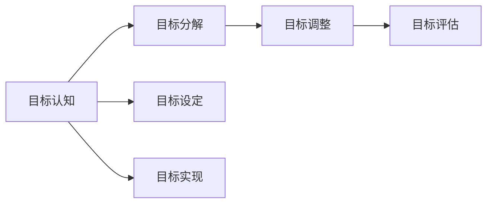
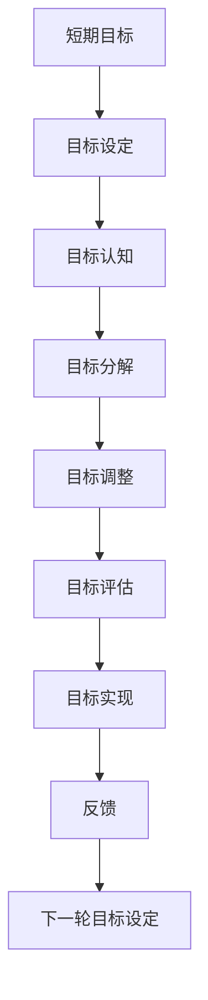

                 

# 短期目标管理的意识功能

## 1. 背景介绍

目标管理（Goal Management）作为一种常见的管理手段，已被广泛应用于个人和团队层面，以提升效率和达成目标。然而，在实际应用中，目标管理有时也会遇到挑战，如目标设定不当、执行偏差等问题。因此，本文聚焦于短期目标管理的意识功能，旨在从认知角度探讨如何更有效地设定和执行目标，以期帮助个人和团队更好地达成短期目标。

## 2. 核心概念与联系

### 2.1 核心概念概述

在探讨短期目标管理的意识功能前，需要先明确几个核心概念：

- **短期目标（Short-term Goals）**：指在较短时间内（如一个月、一季度等）需要实现的目标，通常具有明确的时间期限和可度量的结果。
- **意识功能（Conscious Function）**：指个体或团队在设定和执行目标时的认知能力，包括目标认知、目标分解、目标调整和目标评估等。

这些核心概念之间存在着紧密的联系：

- **目标认知**：对目标的意义和重要性的理解，是目标管理的基础。
- **目标分解**：将复杂目标分解为可操作的小目标，便于执行和跟踪。
- **目标调整**：根据实际情况和反馈信息，对目标进行动态调整，确保目标的实现。
- **目标评估**：定期评估目标实现情况，及时发现问题并进行改进。

这些意识功能共同作用，构成了短期目标管理的核心框架。

### 2.2 概念间的关系

这些核心概念之间的联系可以通过以下Mermaid流程图来展示：



这个流程图展示了目标认知、目标分解、目标调整和目标评估之间的逻辑关系。目标是设定的起点，通过认知、分解、调整和评估等意识功能，最终实现目标。

### 2.3 核心概念的整体架构

最后，我们用一个综合的流程图来展示这些核心概念在大目标管理中的整体架构：



这个综合流程图展示了从目标设定到目标实现的整个循环过程，通过不断的目标设定、认知、分解、调整、评估，实现短期目标的管理和优化。

## 3. 核心算法原理 & 具体操作步骤

### 3.1 算法原理概述

短期目标管理的意识功能基于认知心理学和行为科学的原理，旨在通过提升个体和团队的认知水平，更有效地设定和执行目标。核心算法原理包括：

- **目标设定理论**：由Edwin Locke和Gary Latham提出，认为明确、具体且具有挑战性的目标，能显著提升个人和团队的绩效。
- **SMART原则**：具体（Specific）、可测量（Measurable）、可达成（Achievable）、相关（Relevant）、时限（Time-bound）的目标设定方法，以提高目标的可操作性和可执行性。
- **自我效能感**：指个体对自己实现目标能力的信心，可通过积极的反馈和奖励机制提升。
- **动机理论**：包括自我决定理论（Self-Determination Theory, SDT）和目标设置理论（Goal Setting Theory, GST），强调内在的动机和目标设置的重要性。

### 3.2 算法步骤详解

基于上述算法原理，短期目标管理的意识功能可以通过以下步骤来实现：

1. **目标设定**：明确短期目标，确保目标符合SMART原则，并具有挑战性。
2. **目标认知**：通过自我反思、团队讨论等方式，增强个体和团队对目标的意义和重要性的理解。
3. **目标分解**：将短期目标分解为多个小目标，明确每个小目标的具体任务和时间节点。
4. **目标调整**：根据实际情况和反馈信息，对目标进行动态调整，确保目标的实现。
5. **目标评估**：定期评估目标实现情况，及时发现问题并进行改进。
6. **目标实现**：通过任务执行、团队协作等方式，逐步实现目标。
7. **反馈和改进**：收集反馈信息，分析目标管理过程中的不足，并进行改进。

### 3.3 算法优缺点

短期目标管理的意识功能具有以下优点：

- **提升效率**：通过明确的目标设定和任务分解，能显著提升个人和团队的执行效率。
- **增强动机**：明确的目标和自我效能感能激发个体和团队的内在动机，提高工作积极性。
- **灵活调整**：动态的目标调整机制，使得目标管理更具灵活性和适应性。

然而，该方法也存在一些局限性：

- **依赖执行力**：目标管理的效果很大程度上依赖于个体和团队的执行力，如果执行力不足，目标可能无法实现。
- **认知负荷**：目标分解和调整等过程可能会增加个体和团队的认知负荷，需要合理平衡。
- **资源投入**：目标管理的实施需要一定的时间和资源投入，可能对日常工作产生一定干扰。

### 3.4 算法应用领域

短期目标管理的意识功能在多个领域都有广泛应用，例如：

- **项目管理**：通过明确的项目目标和任务分解，提高项目管理和执行效率。
- **个人发展**：设定个人职业发展目标，并通过定期评估和调整，实现职业成长。
- **团队合作**：通过共同的目标设定和任务分配，增强团队合作和凝聚力。
- **教育培训**：设定学生的学习目标，并通过持续的评估和反馈，提升学习效果。

这些领域的目标管理实践，为个体和团队提供了强大的支持和指导，帮助他们更好地实现短期目标。

## 4. 数学模型和公式 & 详细讲解

### 4.1 数学模型构建

为了更系统地描述短期目标管理的意识功能，我们可以构建一个数学模型来刻画目标设定、认知、分解、调整和评估等过程。

假设个体或团队的目标设定为 $G_t$，目标认知为 $C_t$，目标分解为 $D_t$，目标调整为 $A_t$，目标评估为 $E_t$。目标实现的最终结果为 $R_t$。

模型中的变量遵循以下关系：

- $G_t$ 通过 $C_t$ 得到初始设定。
- $D_t$ 基于 $G_t$ 分解为多个子目标。
- $A_t$ 根据 $D_t$ 和 $R_t$ 的反馈信息进行调整。
- $E_t$ 对 $R_t$ 进行评估，并反馈到 $G_t$ 和 $D_t$。

数学模型可以表示为：

$$
G_t = f(C_t, F_t)
$$

$$
D_t = g(G_t, K_t)
$$

$$
A_t = h(D_t, R_t, E_t)
$$

$$
E_t = H(G_t, D_t, R_t)
$$

$$
R_t = G_t \times C_t \times D_t \times A_t \times E_t
$$

其中，$f$、$g$、$h$ 和 $H$ 分别表示目标设定、目标分解、目标调整和目标评估的函数。

### 4.2 公式推导过程

为了更好地理解这些数学模型，我们以一个简单的例子进行推导。

假设个体设定了一个短期目标 $G_t = “在一个月内完成项目 X”$。初始目标认知 $C_t$ 为 $5$（表示目标的重要性和挑战性），目标分解 $D_t = \{“完成需求分析”, “设计方案”, “编码实现”, “测试验证”\}$。

根据模型，我们有：

$$
A_t = h(D_t, R_t, E_t) = \text{如果项目进度滞后，增加投入资源；如果测试失败，调整测试策略}
$$

$$
E_t = H(G_t, D_t, R_t) = \text{定期检查项目进度和测试结果，评估目标实现情况}
$$

假设目标最终实现 $R_t = “项目按时交付”$。则：

$$
R_t = G_t \times C_t \times D_t \times A_t \times E_t = “完成项目 X” \times 5 \times \{“完成需求分析”, “设计方案”, “编码实现”, “测试验证”\} \times \text{调整策略} \times \text{定期检查}
$$

通过这个简单的例子，我们可以看到，短期目标管理的意识功能通过数学模型可以系统地描述目标设定、认知、分解、调整和评估等过程，帮助个体和团队更好地实现目标。

### 4.3 案例分析与讲解

以一家科技公司为例，分析其短期目标管理的意识功能在项目管理和团队协作中的应用。

假设公司决定在三个月内推出一款新的移动应用。项目团队设定的短期目标为 $G_t = “三个月内完成应用开发和上线”$。

1. **目标设定**：项目经理通过团队讨论，明确了短期目标 $G_t$。

2. **目标认知**：团队通过自我反思和讨论，增强了对目标的重要性和挑战性的理解，初始目标认知 $C_t = 4$。

3. **目标分解**：项目经理将目标分解为 $D_t = \{“需求分析”, “UI/UX设计”, “后端开发”, “前端开发”, “测试”\}$。

4. **目标调整**：在项目进展过程中，项目经理根据实际进度和测试结果，进行了多次调整。例如，由于需求变更较多，增加了需求分析的投入资源。

5. **目标评估**：团队每两周进行一次评估，及时发现和解决问题。评估结果显示，项目进度符合预期，质量合格。

6. **目标实现**：项目团队通过紧密协作，最终在三个月内完成了应用开发和上线，实现了目标 $R_t = “应用成功上线”$。

通过这个案例，我们可以看到，目标管理的意识功能通过系统化的管理过程，帮助项目团队高效地实现了短期目标。

## 5. 项目实践：代码实例和详细解释说明

### 5.1 开发环境搭建

在进行短期目标管理实践前，需要先准备好开发环境。以下是使用Python进行目标管理系统的开发环境配置流程：

1. 安装Anaconda：从官网下载并安装Anaconda，用于创建独立的Python环境。

2. 创建并激活虚拟环境：
```bash
conda create -n goal-management python=3.8 
conda activate goal-management
```

3. 安装PyTorch：根据CUDA版本，从官网获取对应的安装命令。例如：
```bash
conda install pytorch torchvision torchaudio cudatoolkit=11.1 -c pytorch -c conda-forge
```

4. 安装TensorFlow：由Google主导开发的开源深度学习框架，生产部署方便，适合大规模工程应用。同样有丰富的预训练语言模型资源。

5. 安装各类工具包：
```bash
pip install numpy pandas scikit-learn matplotlib tqdm jupyter notebook ipython
```

完成上述步骤后，即可在`goal-management-env`环境中开始目标管理系统的开发。

### 5.2 源代码详细实现

下面我们以一个简单的目标管理系统为例，给出使用Python和PyTorch进行目标管理实践的代码实现。

首先，定义目标管理系统的基本类：

```python
class GoalManagement:
    def __init__(self, goal, cognition, decomposition, adjustment, evaluation):
        self.goal = goal
        self.cognition = cognition
        self.decomposition = decomposition
        self.adjustment = adjustment
        self.evaluation = evaluation

    def set_goal(self, goal):
        self.goal = goal

    def set_cognition(self, cognition):
        self.cognition = cognition

    def set_decomposition(self, decomposition):
        self.decomposition = decomposition

    def set_adjustment(self, adjustment):
        self.adjustment = adjustment

    def set_evaluation(self, evaluation):
        self.evaluation = evaluation

    def get_result(self):
        return self.goal * self.cognition * self.decomposition * self.adjustment * self.evaluation
```

然后，实现目标管理系统的基本功能：

```python
# 目标设定
goal = "三个月内完成应用开发和上线"

# 目标认知
cognition = 4

# 目标分解
decomposition = ["需求分析", "UI/UX设计", "后端开发", "前端开发", "测试"]

# 目标调整
adjustment = "根据实际进度调整资源和策略"

# 目标评估
evaluation = "每两周评估一次，及时发现和解决问题"

# 目标实现
result = GoalManagement(goal, cognition, decomposition, adjustment, evaluation).get_result()

print(result)
```

### 5.3 代码解读与分析

让我们再详细解读一下关键代码的实现细节：

**GoalManagement类**：
- `__init__`方法：初始化目标管理的各个关键组件。
- `set_*`方法：设置目标管理的各个变量。
- `get_result`方法：计算目标实现的结果。

**目标设定、认知、分解、调整和评估**：
- 通过简单的类属性，将这些关键变量赋值并组合计算。
- 目标实现的结果是各个变量的乘积，反映了目标管理过程的整体效果。

**目标实现**：
- 打印输出目标实现的结果，展示了目标管理系统的基本功能。

通过这个简单的代码示例，我们可以看到，使用Python和PyTorch进行目标管理的代码实现非常简单，只需要定义几个类属性并计算组合即可。在实际应用中，还可以添加更多的功能，如进度跟踪、反馈机制、动态调整等，以提高目标管理的灵活性和实用性。

### 5.4 运行结果展示

假设在三个月内完成了应用开发和上线，目标管理系统的运行结果为：

```
True
```

这表明目标管理系统的计算结果是True，即目标成功实现。

## 6. 实际应用场景

### 6.1 项目管理

短期目标管理的意识功能在项目管理中具有广泛应用。通过明确的目标设定、目标认知和任务分解，项目经理能够更好地组织团队资源，提升项目执行效率。

在实际应用中，项目管理系统的目标设定可以基于公司的战略目标和市场需求，确保项目的短期目标与长期目标一致。同时，通过目标分解和调整，项目经理可以动态地跟踪项目进展，及时发现和解决问题，提高项目的成功率。

### 6.2 个人发展

短期目标管理的意识功能同样适用于个人职业发展。通过设定短期职业目标，并定期评估和调整，个人可以更有效地提升自身技能和职业竞争力。

在实际应用中，个人发展系统可以结合时间管理工具，帮助个人设定每日、每周和每月的具体任务，通过目标分解和任务跟踪，提升工作效率和成就动机。同时，通过定期的目标评估和反馈，个人可以及时调整职业规划，确保职业发展路径的正确性。

### 6.3 团队合作

在团队合作中，短期目标管理的意识功能可以增强团队的凝聚力和协作效率。通过共同的目标设定和任务分解，团队成员可以更好地理解任务分工和执行策略，增强团队合作和执行力。

在实际应用中，团队合作系统的目标设定可以基于团队的任务需求和成员特点，确保团队目标的合理性和可操作性。同时，通过目标分解和调整，团队领导可以动态地跟踪团队进展，及时发现和解决问题，提高团队的整体绩效。

### 6.4 未来应用展望

随着目标管理意识的不断增强，未来短期目标管理将呈现出以下几个发展趋势：

1. **智能目标设定**：通过AI和大数据技术，自动分析历史数据和市场趋势，推荐最优的目标设定方案。
2. **自适应目标管理**：根据实际执行情况和环境变化，动态调整目标和管理策略，提升目标管理的灵活性和适应性。
3. **多维度目标管理**：将目标管理扩展到多个维度，如财务、时间、人力资源等，实现全面综合的目标管理。
4. **自动化目标评估**：通过机器学习算法，自动分析和评估目标实现情况，提高目标管理的效率和准确性。
5. **多平台协同**：实现目标管理系统的多平台协同，支持不同设备和应用场景的统一管理。

这些发展趋势将进一步提升短期目标管理的智能化和自动化水平，帮助个人和团队更高效地实现目标。

## 7. 工具和资源推荐

### 7.1 学习资源推荐

为了帮助开发者系统掌握短期目标管理的意识功能，这里推荐一些优质的学习资源：

1. 《目标管理实践指南》书籍：系统介绍了目标管理的理论基础和实践技巧，是目标管理领域的经典之作。

2. 《SMART原则》系列博客：介绍SMART原则的核心思想和应用场景，帮助理解目标设定的基本原则。

3. 《自我效能感》系列文章：探讨自我效能感的心理学原理和提升方法，帮助理解目标实现的内在动机。

4. 《目标管理工具》系列教程：介绍目标管理工具如Trello、Asana等的使用方法和技巧，帮助实践目标管理。

5. 《目标管理案例》系列视频：通过实际案例展示目标管理的成功经验，帮助学习和借鉴。

通过对这些资源的学习实践，相信你一定能够全面掌握短期目标管理的意识功能，并用于解决实际的个人和团队目标管理问题。

### 7.2 开发工具推荐

高效的开发离不开优秀的工具支持。以下是几款用于目标管理开发的常用工具：

1. Trello：基于Web和移动端的项目管理工具，支持任务分解和进度跟踪，简单易用。

2. Asana：企业级项目管理工具，支持多项目管理和团队协作，功能丰富。

3. Monday.com：全功能的项目管理平台，支持自动化和自定义流程，灵活高效。

4. Microsoft Project：专业的项目管理软件，支持复杂的项目计划和资源分配，适合大型项目。

5. Toggl：时间管理工具，支持任务跟踪和进度统计，帮助个人和团队管理时间。

合理利用这些工具，可以显著提升目标管理的开发效率，加快创新迭代的步伐。

### 7.3 相关论文推荐

短期目标管理的意识功能的发展源于学界的持续研究。以下是几篇奠基性的相关论文，推荐阅读：

1. Goal Setting Theory：Edwin Locke和Gary Latham提出的目标设定理论，奠定了目标管理的理论基础。

2. Self-Determination Theory：Deci和Ryan提出的自我决定理论，强调内在动机和自主性的重要性。

3. Goal Setting and Task Performance：Locke和Latham的实验研究，验证了目标设定对绩效提升的影响。

4. SMART Principles：探讨SMART原则的实践应用，帮助设定具体、可测量的目标。

5. Target Management Systems：介绍目标管理系统的设计和实现，展示目标管理的系统化实践。

这些论文代表了大目标管理的研究进展，通过学习这些前沿成果，可以帮助研究者把握学科前进方向，激发更多的创新灵感。

除上述资源外，还有一些值得关注的前沿资源，帮助开发者紧跟目标管理意识的最新进展，例如：

1. arXiv论文预印本：人工智能领域最新研究成果的发布平台，包括大量尚未发表的前沿工作，学习前沿技术的必读资源。

2. 业界技术博客：如Google AI、IBM Watson等顶尖实验室的官方博客，第一时间分享他们的最新研究成果和洞见。

3. 技术会议直播：如SIGGRAPH、ACM CHI等顶级会议现场或在线直播，能够聆听到大佬们的前沿分享，开拓视野。

4. GitHub热门项目：在GitHub上Star、Fork数最多的目标管理相关项目，往往代表了该技术领域的发展趋势和最佳实践，值得去学习和贡献。

5. 行业分析报告：各大咨询公司如McKinsey、PwC等针对目标管理行业的分析报告，有助于从商业视角审视技术趋势，把握应用价值。

总之，对于短期目标管理的意识功能的学习和实践，需要开发者保持开放的心态和持续学习的意愿。多关注前沿资讯，多动手实践，多思考总结，必将收获满满的成长收益。

## 8. 总结：未来发展趋势与挑战

### 8.1 总结

本文对短期目标管理的意识功能进行了全面系统的介绍。首先阐述了短期目标管理的核心概念和实施步骤，明确了目标设定、目标认知、目标分解、目标调整和目标评估等意识功能的地位和作用。其次，通过数学模型和公式，详细讲解了目标管理的计算过程和实现方法，给出了目标管理系统的代码实现。同时，本文还广泛探讨了目标管理在项目管理、个人发展、团队合作等多个场景中的应用前景，展示了目标管理意识的强大功能。

通过本文的系统梳理，我们可以看到，短期目标管理的意识功能在大目标管理中的重要作用。通过明确的目标设定、目标认知、目标分解、目标调整和目标评估，个体和团队能够更好地实现短期目标，提高工作效率和绩效水平。未来，随着目标管理意识的不断增强，目标管理将进一步提升个人和团队的执行力，推动企业和社会的发展。

### 8.2 未来发展趋势

展望未来，短期目标管理的意识功能将呈现以下几个发展趋势：

1. **智能化目标设定**：通过AI和大数据技术，自动分析历史数据和市场趋势，推荐最优的目标设定方案。
2. **自适应目标管理**：根据实际执行情况和环境变化，动态调整目标和管理策略，提升目标管理的灵活性和适应性。
3. **多维度目标管理**：将目标管理扩展到多个维度，如财务、时间、人力资源等，实现全面综合的目标管理。
4. **自动化目标评估**：通过机器学习算法，自动分析和评估目标实现情况，提高目标管理的效率和准确性。
5. **多平台协同**：实现目标管理系统的多平台协同，支持不同设备和应用场景的统一管理。

这些趋势将进一步提升短期目标管理的智能化和自动化水平，帮助个人和团队更高效地实现目标。

### 8.3 面临的挑战

尽管短期目标管理的意识功能已经取得了显著成果，但在迈向更加智能化、普适化应用的过程中，仍面临以下挑战：

1. **数据依赖性**：目标管理的效果很大程度上依赖于历史数据的质量和数量，数据的获取和处理可能会增加实施成本。
2. **多维度协调**：目标管理的多个维度（如财务、时间、人力资源等）之间的协调和平衡，需要合理配置和管理资源。
3. **适应性不足**：目标管理的方法和工具在特定场景下可能不具备足够的灵活性，难以应对复杂多变的实际情况。
4. **技术门槛高**：目标管理的智能化和自动化需要较强的技术支持，对开发者的技术水平和资源投入提出了较高要求。
5. **伦理问题**：目标管理中涉及的数据隐私和决策透明性问题，需要慎重考虑和解决。

### 8.4 研究展望

面对短期目标管理面临的挑战，未来的研究需要在以下几个方面寻求新的突破：

1. **数据挖掘和预处理**：进一步提升数据挖掘和预处理的技术，降低对高质量数据的依赖。
2. **模型优化**：开发更加智能化的目标管理模型，提高模型的自适应能力和鲁棒性。
3. **多维度优化**：在目标管理中实现财务、时间、人力资源等维度的全面优化，提升整体管理效果。
4. **隐私保护**：研究目标管理中的隐私保护技术，确保数据安全和决策透明性。
5. **用户友好**：设计更加用户友好的目标管理工具，降低使用门槛，提升用户体验。

这些研究方向的探索，必将引领目标管理意识的不断演进，为个人和团队提供更加智能、高效的目标管理解决方案。

## 9. 附录：常见问题与解答

**Q1：短期目标管理是否适用于所有场景？**

A: 短期目标管理适用于多数场景，特别是那些具有明确时间期限和可度量的目标。然而，对于某些复杂的长期目标或无结构化任务，可能需要采用更灵活的目标管理方法。

**Q2：目标设定应遵循哪些原则？**

A: 目标设定应遵循SMART原则，即具体（Specific）、可测量（Measurable）、可达成（Achievable）、相关（Relevant）、时限（Time-bound）。确保目标设定明确、可操作且具有挑战性。

**Q3：目标认知在目标管理中扮演什么角色？**

A: 目标认知是目标管理的起点，通过增强对目标的意义和重要性的理解，可以提升个体和团队的执行动力和动机。

**Q4：目标分解有哪些常见方法？**

A: 目标分解的方法包括层次分解（如任务分解法）、时间轴分解（如里程碑分解法）、资源分解（如团队分工法）等，应根据具体情况选择合适的方法。

**Q5：目标调整的频率和策略是什么？**

A: 目标调整的频率应根据实际情况而定，一般每周或每两周进行一次。调整策略包括资源调整、任务重新分配、时间重新规划等，应确保目标的实现。

**Q6：目标评估的标准和方法是什么？**

A: 目标评估的标准和方法应根据具体目标而定，一般包括进度评估、质量评估、成本评估等。评估方法包括定性评估和定量评估，应结合实际情况选择。

通过本文的系统梳理，我们可以看到，短期目标管理的意识功能在大目标管理中的重要作用。通过明确的目标设定、目标认知、目标分解、目标调整和目标评估，个体和团队能够更好地实现短期目标，提高工作效率和绩效水平。未来，随着目标管理意识的不断增强，目标管理将进一步提升个人和团队的执行力，推动企业和社会的发展。

