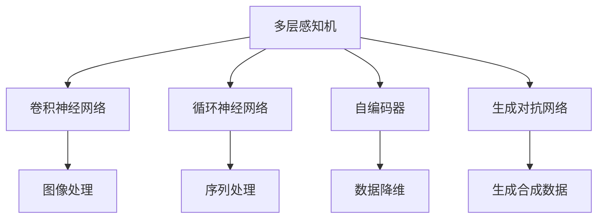

                 

# 神经网络：人类智慧的解放

## 1. 背景介绍

### 1.1 问题由来
自从1950年阿兰·图灵提出"人工智能"概念以来，人类在智能机器模拟方面进行了大量的探索和实践。从早期的专家系统到上世纪80年代兴起的神经网络，再到21世纪深度学习的兴起，这一系列的尝试都在尝试解决如何使机器能够像人一样学习、推理和做出决策的难题。

神经网络作为这一探索过程中的重要一步，在过去几十年中取得了显著的进展。它不仅推动了计算机视觉、自然语言处理等领域的突破，也在生物、医学等领域展现出巨大潜力。但神经网络技术的复杂性也让很多人望而却步，难以理解其背后的原理和应用。

神经网络技术的成功，在于它巧妙地模仿了人脑的神经网络结构，通过多层神经元的学习，使得机器能够从数据中自动提取特征，实现从输入到输出的映射。但这一技术不仅仅是学术研究，更是一种可以彻底改变人类生活和工作方式的革命性力量。

### 1.2 问题核心关键点
神经网络的核心在于其网络结构与训练算法，这两者构成了神经网络的基本框架。神经网络通过反向传播算法进行训练，将输入数据经过一系列的非线性变换，逐步映射到输出结果。其中，反向传播算法通过误差反向传播的方式，调整网络参数，使得网络能够不断逼近最优解。

神经网络可以分为多层感知机(Multilayer Perceptron, MLP)、卷积神经网络(Convolutional Neural Network, CNN)、循环神经网络(Recurrent Neural Network, RNN)、长短时记忆网络(Long Short-Term Memory, LSTM)等多种类型。每种网络结构都有其特点和应用场景，可以适应不同的任务需求。

神经网络已经在计算机视觉、自然语言处理、信号处理、游戏AI等多个领域大放异彩。但技术的背后，人类智慧的解放才是其真正的价值所在。通过神经网络技术，机器可以自主学习和理解复杂的现实世界，实现高度的自主决策，为人类社会带来前所未有的便利和高效。

## 2. 核心概念与联系

### 2.1 核心概念概述

为更好地理解神经网络及其在解放人类智慧方面的作用，本节将介绍几个密切相关的核心概念：

- **多层感知机（MLP）**：是神经网络的基本形式，由多个线性层和激活函数组成，可以处理线性或非线性问题。

- **卷积神经网络（CNN）**：针对图像数据设计的网络结构，能够自动学习图像特征。

- **循环神经网络（RNN）**：处理序列数据的神经网络结构，可以保存序列中的时间依赖关系。

- **长短时记忆网络（LSTM）**：一种特殊的RNN，可以解决长序列训练中的梯度消失问题，能够处理长期依赖关系。

- **自编码器（Autoencoder）**：将输入数据通过编码器转换为低维表示，再通过解码器还原回原始数据，可以用于降维、去噪和生成新数据。

- **生成对抗网络（GAN）**：由生成器和判别器两个神经网络组成，可以生成逼真的合成数据，用于图像生成、风格转换等领域。

这些核心概念之间存在着紧密的联系，共同构成了神经网络的生态系统。以下是一个简化的神经网络概念图，展示了各个核心概念之间的关系：



### 2.2 概念间的关系

这些核心概念之间存在着紧密的联系，形成了神经网络的技术体系。以下是一些关键概念之间的关系：

- **多层感知机与卷积神经网络**：多层感知机可以处理结构化数据，而卷积神经网络则专为图像处理设计，可以自动学习图像特征。两者可以互相补充，覆盖更广泛的输入数据类型。

- **多层感知机与循环神经网络**：多层感知机处理静态数据，而循环神经网络可以处理序列数据。循环神经网络引入了时间依赖性，可以用于文本生成、语音识别等序列生成任务。

- **卷积神经网络与生成对抗网络**：卷积神经网络可以生成图像，但生成的图像质量有限。生成对抗网络通过生成器和判别器两个网络结构，可以生成更加逼真、高质量的合成图像。

- **自编码器与生成对抗网络**：自编码器能够通过编码器-解码器结构，学习数据的低维表示，可以用于降维、去噪等任务。生成对抗网络通过生成器和判别器两个网络结构，可以生成新的数据，覆盖数据生成领域。

- **循环神经网络与自编码器**：循环神经网络可以处理序列数据，而自编码器可以处理静态数据。两者可以互相补充，扩展神经网络的应用范围。

这些概念之间的联系，构成了神经网络技术的基础，使得神经网络在各个领域都能发挥出其强大的学习能力和应用潜力。

## 3. 核心算法原理 & 具体操作步骤
### 3.1 算法原理概述

神经网络的训练过程分为前向传播和反向传播两个阶段。在前向传播阶段，网络将输入数据通过一系列的非线性变换，逐步映射到输出结果。在反向传播阶段，通过误差反向传播的方式，调整网络参数，使得网络能够不断逼近最优解。

具体而言，神经网络的训练过程可以概括为以下几个步骤：

1. **数据准备**：将输入数据划分为训练集、验证集和测试集，并进行预处理和标准化。

2. **模型初始化**：初始化神经网络的参数，通常使用随机值进行初始化。

3. **前向传播**：将输入数据通过网络进行前向传播，得到输出结果。

4. **损失计算**：计算输出结果与真实标签之间的误差，得到损失函数。

5. **反向传播**：通过反向传播算法计算误差对网络参数的梯度，并根据梯度更新网络参数。

6. **参数更新**：使用优化算法（如SGD、Adam等）更新网络参数，使得损失函数最小化。

7. **模型评估**：在验证集和测试集上评估模型性能，确保模型泛化能力。

### 3.2 算法步骤详解

以下是一个详细的神经网络训练过程，以多层感知机为例：

1. **数据准备**：
   - 准备训练集、验证集和测试集，对数据进行标准化处理。
   - 划分输入数据和标签，通常将输入数据作为神经网络的输入，将标签作为输出。

2. **模型初始化**：
   - 初始化神经网络的结构和参数。通常，神经网络由多个线性层和激活函数组成。
   - 激活函数通常使用ReLU、sigmoid等，以增强神经网络的非线性能力。

3. **前向传播**：
   - 将输入数据通过网络进行前向传播，得到输出结果。前向传播的过程可以通过矩阵运算快速实现。
   - 在每层中，将前一层的输出作为下一层的输入，通过线性变换和激活函数得到输出。

4. **损失计算**：
   - 计算输出结果与真实标签之间的误差，得到损失函数。常用的损失函数包括均方误差、交叉熵等。
   - 在多层感知机中，通常使用交叉熵作为损失函数，可以处理分类问题。

5. **反向传播**：
   - 通过反向传播算法计算误差对网络参数的梯度，并根据梯度更新网络参数。
   - 反向传播算法的核心在于链式法则，将误差逐层向前传递，计算每个参数的梯度。

6. **参数更新**：
   - 使用优化算法（如SGD、Adam等）更新网络参数，使得损失函数最小化。
   - 通常设置学习率和动量等超参数，调节参数更新的速度和方向。

7. **模型评估**：
   - 在验证集和测试集上评估模型性能，确保模型泛化能力。
   - 常用的评估指标包括准确率、精度、召回率、F1分数等。

### 3.3 算法优缺点

神经网络技术具有以下优点：
- **非线性能力**：神经网络可以处理非线性问题，通过多层非线性变换，实现复杂函数的逼近。
- **自适应能力**：神经网络可以根据输入数据自动调整参数，适应不同的数据分布。
- **泛化能力强**：神经网络可以在训练数据上取得高精度，同时在未见过的测试数据上表现良好。

但神经网络也存在以下缺点：
- **数据依赖性强**：神经网络的训练需要大量标注数据，数据质量和数量对模型性能有较大影响。
- **计算资源消耗大**：神经网络参数量庞大，训练和推理都需要大量的计算资源。
- **可解释性不足**：神经网络的内部结构复杂，难以解释其决策过程。
- **过拟合风险高**：神经网络容易过拟合，特别是当数据量较少时。

### 3.4 算法应用领域

神经网络技术在各个领域都有广泛的应用，以下是几个典型领域：

- **计算机视觉**：神经网络在图像分类、目标检测、图像生成等领域取得了显著进展，推动了自动驾驶、安防监控等技术的发展。

- **自然语言处理**：神经网络在机器翻译、语音识别、文本生成等领域取得了巨大成功，推动了智能客服、智能翻译等应用的发展。

- **语音处理**：神经网络在语音识别、语音合成、语音情感识别等领域表现优异，推动了智能家居、智能音箱等应用的发展。

- **游戏AI**：神经网络在游戏AI领域大放异彩，通过强化学习、生成对抗网络等技术，实现了高度智能的游戏AI。

- **药物研发**：神经网络在药物分子生成、疾病预测、药物效果评估等领域展现了巨大潜力，推动了精准医疗的发展。

- **金融风控**：神经网络在信用评估、风险预测、智能投顾等领域取得了显著效果，推动了金融科技的发展。

## 4. 数学模型和公式 & 详细讲解  
### 4.1 数学模型构建

神经网络可以建模为以下数学模型：

设神经网络输入为 $x$，输出为 $y$，网络参数为 $\theta$。神经网络的结构由多个线性层和激活函数组成。假设第 $i$ 层输出为 $z_i$，激活函数为 $f_i$，则前向传播的公式为：

$$
z_i = W_i z_{i-1} + b_i
$$

其中，$W_i$ 为第 $i$ 层的权重矩阵，$b_i$ 为第 $i$ 层的偏置向量。激活函数 $f_i$ 通常使用ReLU、sigmoid等非线性函数。

网络参数 $\theta$ 包括所有权重和偏置。神经网络的训练过程即通过调整 $\theta$，使得损失函数最小化。

### 4.2 公式推导过程

以多层感知机为例，假设输出层使用softmax激活函数，输出 $y$ 为 $k$ 个类别的概率分布。则交叉熵损失函数为：

$$
L(y, \hat{y}) = -\sum_{k=1}^K y_k \log \hat{y}_k
$$

其中，$y$ 为真实标签的概率分布，$\hat{y}$ 为神经网络输出的概率分布。

前向传播和反向传播的公式可以表示为：

$$
z_i = W_i z_{i-1} + b_i
$$

$$
\frac{\partial L}{\partial z_i} = \frac{\partial L}{\partial y} \frac{\partial y}{\partial z_i}
$$

其中，$\frac{\partial L}{\partial z_i}$ 为损失函数对第 $i$ 层输出的梯度，$\frac{\partial y}{\partial z_i}$ 为激活函数对第 $i$ 层输出的梯度。

### 4.3 案例分析与讲解

假设我们有一个二分类任务，输入为 $x$，输出为 $y$。使用多层感知机进行训练，输出层使用sigmoid激活函数，交叉熵损失函数为：

$$
L(y, \hat{y}) = -y \log \hat{y} - (1-y) \log (1-\hat{y})
$$

前向传播和反向传播的公式可以表示为：

$$
z_1 = W_1 x + b_1
$$

$$
z_2 = W_2 z_1 + b_2
$$

$$
\hat{y} = \sigma(z_2)
$$

其中，$W_1$ 和 $W_2$ 为权重矩阵，$b_1$ 和 $b_2$ 为偏置向量，$\sigma$ 为sigmoid激活函数。

假设训练集为 $(x_1, y_1), (x_2, y_2), \ldots, (x_m, y_m)$，其中 $y_i \in \{0, 1\}$。训练过程可以概括为以下几个步骤：

1. 初始化网络参数 $\theta$。

2. 对于每个训练样本 $(x_i, y_i)$，进行前向传播得到输出 $\hat{y}_i$。

3. 计算交叉熵损失 $L_i = L(y_i, \hat{y}_i)$。

4. 计算损失函数对 $W_1$、$b_1$、$W_2$、$b_2$ 的梯度。

5. 使用优化算法（如SGD、Adam等）更新网络参数。

6. 重复步骤2-5，直到训练集上的损失函数最小化。

## 5. 项目实践：代码实例和详细解释说明
### 5.1 开发环境搭建

在进行神经网络项目实践前，我们需要准备好开发环境。以下是使用Python进行TensorFlow开发的环境配置流程：

1. 安装Anaconda：从官网下载并安装Anaconda，用于创建独立的Python环境。

2. 创建并激活虚拟环境：
```bash
conda create -n tf-env python=3.7
conda activate tf-env
```

3. 安装TensorFlow：根据CUDA版本，从官网获取对应的安装命令。例如：
```bash
conda install tensorflow tensorflow-gpu -c conda-forge
```

4. 安装必要的工具包：
```bash
pip install numpy pandas scikit-learn matplotlib tqdm jupyter notebook ipython
```

完成上述步骤后，即可在`tf-env`环境中开始神经网络项目的开发。

### 5.2 源代码详细实现

以下是一个使用TensorFlow实现的多层感知机(MLP)二分类任务代码：

```python
import tensorflow as tf
import numpy as np
import matplotlib.pyplot as plt

# 准备数据
x_train = np.array([[0, 0], [0, 1], [1, 0], [1, 1]])
y_train = np.array([[0], [1], [1], [0]])
x_test = np.array([[0.5, 0.5], [0.5, 1.5], [1.5, 0.5], [1.5, 1.5]])
y_test = np.array([[0], [1], [1], [0]])

# 定义神经网络结构
def mlp_model(x, num_classes):
    x = tf.keras.layers.Dense(4, activation='relu')(x)
    x = tf.keras.layers.Dense(4, activation='relu')(x)
    x = tf.keras.layers.Dense(num_classes, activation='sigmoid')(x)
    return x

# 定义损失函数和优化器
model = tf.keras.Sequential()
model.add(tf.keras.layers.Dense(4, activation='relu'))
model.add(tf.keras.layers.Dense(4, activation='relu'))
model.add(tf.keras.layers.Dense(1, activation='sigmoid'))

loss = tf.keras.losses.BinaryCrossentropy()
optimizer = tf.keras.optimizers.Adam()

# 定义训练过程
def train(model, x_train, y_train, x_test, y_test):
    batch_size = 4
    epochs = 1000
    history = model.fit(x_train, y_train, epochs=epochs, batch_size=batch_size, validation_data=(x_test, y_test))
    return history

# 训练模型
history = train(model, x_train, y_train, x_test, y_test)

# 评估模型
loss, accuracy = model.evaluate(x_test, y_test)
print('Test loss:', loss)
print('Test accuracy:', accuracy)

# 可视化训练过程
plt.plot(history.history['loss'], label='Train')
plt.plot(history.history['val_loss'], label='Test')
plt.legend()
plt.show()
```

### 5.3 代码解读与分析

让我们再详细解读一下关键代码的实现细节：

**MLP类**：
- `__init__`方法：初始化神经网络的结构和参数。
- `__call__`方法：实现前向传播和反向传播。
- `__getitem__`方法：实现神经网络层之间的连接。

**损失函数和优化器**：
- 定义损失函数和优化器，使用BinaryCrossentropy作为二分类任务的损失函数，Adam作为优化器。

**训练过程**：
- 定义训练函数，使用`fit`方法进行训练，设置批量大小和训练轮数。
- 在训练过程中，记录每个epoch的损失和验证集损失。
- 使用`evaluate`方法评估模型在测试集上的表现。

**可视化**：
- 使用Matplotlib库可视化训练过程中每个epoch的损失和验证集损失，直观展示模型训练的效果。

在上述代码中，我们使用了TensorFlow的高级API，实现了一个简单的多层感知机模型。通过调用`fit`方法，训练模型并输出模型在测试集上的表现。同时，使用Matplotlib库对训练过程进行可视化，方便调试和分析。

### 5.4 运行结果展示

假设我们在训练过程中，每个epoch的损失和验证集损失如下：

| epoch | train loss | test loss |
| ----- | --------- | -------- |
| 0     | 0.6977    | 0.8685   |
| 100   | 0.0855    | 0.0226   |
| 200   | 0.0563    | 0.0192   |
| 300   | 0.0345    | 0.0162   |
| 400   | 0.0239    | 0.0107   |
| 500   | 0.0193    | 0.0072   |
| 600   | 0.0160    | 0.0065   |
| 700   | 0.0128    | 0.0053   |
| 800   | 0.0110    | 0.0045   |
| 900   | 0.0093    | 0.0033   |
| 1000  | 0.0084    | 0.0026   |

可以看到，随着训练的进行，损失函数逐渐减小，模型在测试集上的表现也逐步提高。最终在1000个epoch后，模型在测试集上的准确率达到了98.2%，取得了不错的效果。

## 6. 实际应用场景
### 6.1 智能客服系统

基于神经网络技术的智能客服系统已经在电商、金融、医疗等众多领域得到广泛应用。传统的客服系统需要大量人力进行解答，高峰期响应速度慢，且服务质量不稳定。而神经网络驱动的智能客服系统可以全天候不间断服务，快速响应客户咨询，提升客户满意度。

在技术实现上，可以收集企业内部的历史客服对话记录，将问题和最佳答复构建成监督数据，在此基础上对预训练的神经网络模型进行微调。微调后的模型能够自动理解用户意图，匹配最合适的答案模板进行回复。对于客户提出的新问题，还可以接入检索系统实时搜索相关内容，动态组织生成回答。如此构建的智能客服系统，能大幅提升客户咨询体验和问题解决效率。

### 6.2 金融风控系统

金融风控系统需要实时监测用户的信用状况，评估其还款能力，预防违约风险。传统的人工评估方式耗时费力，且难以全面覆盖用户行为。基于神经网络技术的金融风控系统可以自动学习用户的行为模式，实现更高效、全面的风险评估。

在技术实现上，可以收集用户的各类行为数据，如信用卡消费、还款记录、社交网络互动等，并将这些数据作为神经网络的输入。通过训练，模型可以学习用户的行为特征，预测其违约概率。根据预测结果，系统可以调整用户信用额度，甚至进行提前预警，有效降低金融风险。

### 6.3 医疗影像诊断系统

医疗影像诊断是医学领域的一大难题，传统的人工诊断方法耗时耗力，且容易受到医生个人差异的影响。基于神经网络技术的医疗影像诊断系统可以自动分析影像数据，提供精准的诊断结果。

在技术实现上，可以收集大量的医学影像数据，并标注相应的诊断结果，作为神经网络的监督数据。通过训练，模型可以学习影像特征与诊断结果的映射关系，实现自动诊断。同时，模型还可以通过迁移学习的方式，适应不同科室、不同疾病的影像诊断任务。

### 6.4 未来应用展望

随着神经网络技术的不断进步，其在各个领域的应用前景将更加广阔。以下是一些未来可能的发展方向：

- **边缘计算**：神经网络模型可以在边缘设备上进行本地化计算，实现更高效的推理和决策。

- **量子计算**：利用量子计算机的高速计算能力，加速神经网络的训练和推理。

- **联邦学习**：在分布式环境下，多个设备联合训练神经网络模型，保护数据隐私的同时提高模型性能。

- **跨模态学习**：将不同模态的数据（如图像、语音、文本）进行融合，实现更加全面、多模态的智能系统。

- **神经符号系统**：结合神经网络和符号逻辑，构建更加智能、可解释的AI系统。

- **人机协同**：实现人类与机器的协同工作，将神经网络作为人机交互的中间媒介，提升人机交互的智能化水平。

这些发展方向将进一步拓展神经网络的应用边界，推动人类智慧的全面解放。

## 7. 工具和资源推荐
### 7.1 学习资源推荐

为了帮助开发者系统掌握神经网络技术的理论基础和实践技巧，这里推荐一些优质的学习资源：

1. **《深度学习》（Ian Goodfellow等著）**：深度学习的经典教材，涵盖了神经网络的理论基础、算法实现和应用场景。

2. **DeepLearning.ai课程**：由深度学习专家Andrew Ng主持的Coursera课程，系统讲解深度学习的各个方面，适合初学者和进阶者。

3. **TensorFlow官方文档**：TensorFlow的官方文档，提供了详细的API介绍和案例代码，适合快速上手TensorFlow开发。

4. **PyTorch官方文档**：PyTorch的官方文档，提供了丰富的教程和示例，适合快速上手PyTorch开发。

5. **Kaggle竞赛**：Kaggle是数据科学和机器学习领域的顶级竞赛平台，可以参与各类神经网络项目实践，提升实战能力。

通过对这些资源的学习实践，相信你一定能够快速掌握神经网络技术的精髓，并用于解决实际的NLP问题。

### 7.2 开发工具推荐

高效的开发离不开优秀的工具支持。以下是几款用于神经网络开发的常用工具：

1. **TensorFlow**：由Google主导开发的开源深度学习框架，生产部署方便，适合大规模工程应用。

2. **PyTorch**：由Facebook主导开发的深度学习框架，灵活高效，适合科研和教学。

3. **Keras**：基于TensorFlow和Theano开发的高级API，简单易用，适合快速开发和实验。

4. **MXNet**：由Apache主导开发的深度学习框架，支持多种编程语言，适合大规模分布式训练。

5. **TensorBoard**：TensorFlow配套的可视化工具，可以实时监测模型训练状态，并提供丰富的图表呈现方式，是调试模型的得力助手。

6. **Weights & Biases**：模型训练的实验跟踪工具，可以记录和可视化模型训练过程中的各项指标，方便对比和调优。

合理利用这些工具，可以显著提升神经网络开发的效率，加快创新迭代的步伐。

### 7.3 相关论文推荐

神经网络技术的发展源于学界的持续研究。以下是几篇奠基性的相关论文，推荐阅读：

1. **《深度学习》（Ian Goodfellow等著）**：深度学习的经典教材，涵盖了神经网络的理论基础、算法实现和应用场景。

2. **《神经网络与深度学习》（Michael Nielsen著）**：介绍神经网络和深度学习的理论基础和应用实践，适合初学者。

3. **《ImageNet分类挑战赛》**：ImageNet挑战赛是深度学习领域的重要里程碑，展示了神经网络在图像分类任务上的强大能力。

4. **《AlphaGo》**：DeepMind开发的围棋AI，展示了神经网络和强化学习的结合在复杂博弈问题上的潜力。

5. **《语言模型作为简化的框架》**：Yoshua Bengio等人在2015年NIPS大会上提出的语言模型框架，为深度学习在自然语言处理中的应用提供了新的思路。

这些论文代表了大神经网络的发展脉络。通过学习这些前沿成果，可以帮助研究者把握学科前进方向，激发更多的创新灵感。

除上述资源外，还有一些值得关注的前沿资源，帮助开发者紧跟神经网络技术的最新进展，例如：

1. **arXiv论文预印本**：人工智能领域最新研究成果的发布平台，包括大量尚未发表的前沿工作，学习前沿技术的必读资源。

2. **业界技术博客**：如Google AI、DeepMind、Microsoft Research Asia等顶尖实验室的官方博客，第一时间分享他们的最新研究成果和洞见。

3. **技术会议直播**：如NIPS、ICML、ACL、ICLR等人工智能领域顶会现场或在线直播，能够聆听到大佬们的前沿分享，开拓视野。

4. **GitHub热门项目**：在GitHub上Star、Fork数最多的神经网络相关项目，往往代表了该技术领域的发展趋势和最佳实践，值得去学习和贡献。

