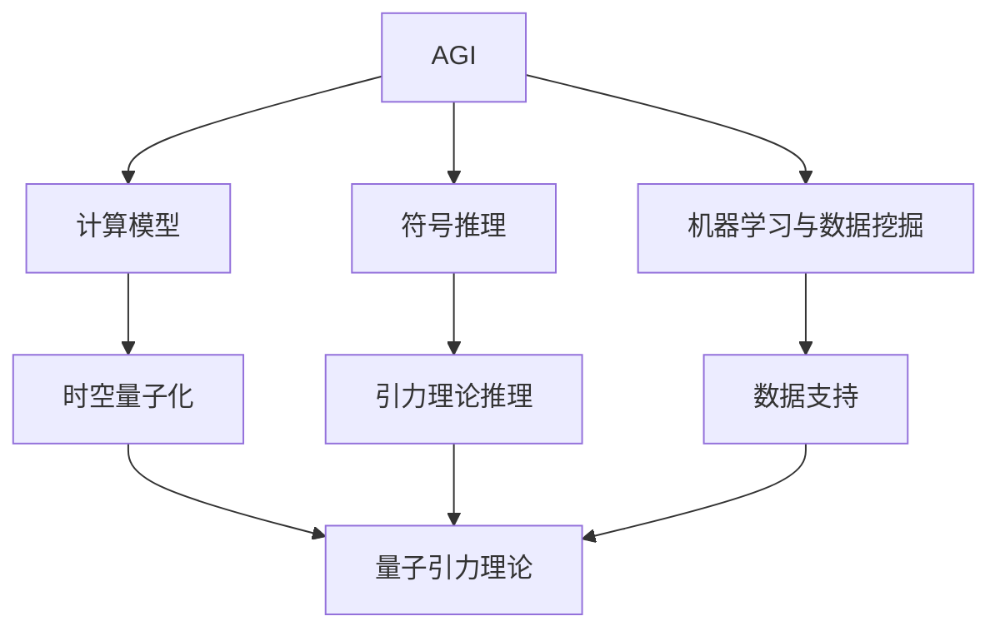

                 

## 1. 背景介绍

量子引力作为一门综合性学科，旨在探究量子力学与广义相对论的结合点，理解宇宙的基本结构和演化规律。目前，尽管有弦论、循环量子引力理论等众多猜想，但尚未找到统一且可信的量子引力理论。AGI（人工智能通用）作为强计算能力、高级推理能力、自我迭代能力的高度融合体，为量子引力理论的探索提供了新的可能。本文将探讨AGI在量子引力领域的应用研究，结合最新的技术进展和实践案例，提供深度思考和见解。

## 2. 核心概念与联系

### 2.1 核心概念概述

为更好地理解AGI在量子引力中的应用，本节将介绍几个关键概念：

- **AGI（人工智能通用）**：具有通用智能、能够进行自我迭代，并能执行任何智能任务的人工智能系统。AGI具备推理、规划、问题解决等高级认知能力，不局限于特定任务或领域。
- **量子引力**：研究时空量子化的理论，旨在解释引力是如何通过量子效应表现出来的。当前存在多种量子引力理论，如弦论、环量子引力等。
- **计算模型**：在量子引力理论中，计算模型用于描述物质、时空等基本粒子的量子态及其演化规律。AGI可以构建高效的计算模型，模拟量子引力理论的复杂过程。
- **符号推理**：AGI具备符号推理能力，能够在逻辑层面进行高级推理和问题解决，可用于构建量子引力理论的符号模型。
- **机器学习与数据挖掘**：AGI的机器学习算法可以用于数据分析和模式识别，从大量观测数据中挖掘出可能的引力性质，为理论推导提供数据支持。

这些核心概念通过以下Mermaid流程图展示了它们之间的联系：



该流程图展示了AGI在构建计算模型、符号推理和数据挖掘等方面的能力，以及这些能力如何帮助解决量子引力理论的问题。

### 2.2 核心概念的联系

AGI在量子引力中的作用，主要体现在以下几个方面：

1. **构建高效的计算模型**：AGI能够快速构建、优化和调整计算模型，模拟时空的量子态，从而在量子引力理论中提供重要的计算工具。
2. **符号推理与理论构建**：AGI通过符号推理，可以进行复杂的逻辑推导和理论构建，辅助建立统一的量子引力理论。
3. **数据分析与模式识别**：AGI具备强大的数据挖掘能力，可以从实验数据和观测数据中提取有用的信息，为量子引力理论提供数据支持。
4. **自学习与迭代优化**：AGI能够通过自我学习不断优化模型和算法，快速适应新的物理规律和实验结果。
5. **跨学科整合**：AGI能够整合物理学、计算机科学、数学等多个学科的知识，形成交叉领域的创新。

通过以上联系，AGI在量子引力理论的研究和应用中具有独特的优势。

## 3. 核心算法原理 & 具体操作步骤

### 3.1 算法原理概述

AGI在量子引力中的应用，主要基于以下几个算法原理：

1. **量子态模拟算法**：通过AGI构建的高效计算模型，模拟时空的量子态及其演化，帮助理解量子引力的基本规律。
2. **符号推理算法**：利用AGI的符号推理能力，构建理论框架，推导引力理论中的关键方程和定理。
3. **机器学习算法**：使用AGI的数据挖掘和机器学习算法，从大量实验数据中学习引力理论的潜在模式，辅助理论验证和修正。
4. **演化计算算法**：应用AGI的演化计算能力，优化引力理论中的参数，以适应新的实验观测和理论推导结果。

### 3.2 算法步骤详解

#### 3.2.1 量子态模拟算法

1. **构建计算模型**：
   - 利用AGI的符号推导能力，构建时空的量子态模型，描述基本粒子的量子态及其演化方程。
   - 使用AGI构建的高效计算框架，实现时空的量子态模拟。

2. **量子态演化模拟**：
   - 通过AGI的高效计算模型，模拟时空的量子态演化过程，求解演化方程。
   - 使用符号推理算法，验证模拟结果是否符合量子引力理论的基本规律。

#### 3.2.2 符号推理算法

1. **理论构建**：
   - 利用AGI的符号推导能力，构建引力理论的符号模型，推导关键方程和定理。
   - 使用符号推理算法，验证理论的逻辑自洽性。

2. **模型修正**：
   - 通过AGI的自我学习机制，根据新的实验数据和理论推导结果，修正引力理论的符号模型。

#### 3.2.3 机器学习算法

1. **数据预处理**：
   - 利用AGI的数据挖掘能力，从实验数据和观测数据中提取有用信息，清洗和预处理数据。
   - 使用AGI的特征提取算法，构建引力理论的特征空间。

2. **模型训练**：
   - 使用AGI的机器学习算法，训练引力理论的机器学习模型，预测新的实验结果。
   - 利用AGI的数据分析能力，评估模型的性能和泛化能力。

#### 3.2.4 演化计算算法

1. **参数优化**：
   - 应用AGI的演化计算算法，优化引力理论中的参数，以适应新的实验观测和理论推导结果。
   - 使用AGI的迭代机制，持续优化参数，提升理论的准确性和预测能力。

### 3.3 算法优缺点

#### 3.3.1 优点

1. **高效计算**：AGI能够高效构建和优化计算模型，模拟时空的量子态，提升计算效率。
2. **自我迭代**：AGI具备自我学习和迭代优化能力，能够快速适应新的物理规律和实验结果。
3. **跨学科整合**：AGI能够整合物理学、计算机科学、数学等多个学科的知识，形成交叉领域的创新。
4. **符号推理**：AGI的符号推理能力，可以帮助构建理论框架，推导引力理论的关键方程和定理。
5. **数据驱动**：AGI的数据挖掘和机器学习算法，可以从大量实验数据中提取有用的信息，为理论推导提供数据支持。

#### 3.3.2 缺点

1. **复杂度**：构建和优化计算模型需要复杂的符号推导和计算过程，难度较大。
2. **理论验证**：验证符号推理结果的正确性需要大量实验验证，成本较高。
3. **数据质量**：数据挖掘和机器学习算法对数据质量要求高，存在数据偏差和噪声的风险。
4. **自学习依赖**：AGI的自我学习依赖大量实验数据和理论推导结果，对实验数据的依赖较大。

### 3.4 算法应用领域

AGI在量子引力中的应用领域主要包括以下几个方面：

1. **时空量子态模拟**：在时空的量子态模拟中，AGI可以高效模拟时空的量子态及其演化过程，为量子引力理论提供重要的计算工具。
2. **引力理论构建**：利用AGI的符号推理能力，构建引力理论的符号模型，推导关键方程和定理，辅助理论构建。
3. **实验数据分析**：使用AGI的数据挖掘和机器学习算法，从大量实验数据中提取有用的信息，为理论推导提供数据支持。
4. **参数优化**：应用AGI的演化计算能力，优化引力理论中的参数，以适应新的实验观测和理论推导结果。
5. **跨学科研究**：AGI能够整合物理学、计算机科学、数学等多个学科的知识，形成交叉领域的创新，推动量子引力理论的发展。

## 4. 数学模型和公式 & 详细讲解 & 举例说明

### 4.1 数学模型构建

在量子引力理论中，计算模型的构建需要考虑时空的量子态及其演化过程。设时空的量子态为 $\psi(x)$，演化方程为：

$$
\frac{\partial \psi(x)}{\partial t} = \hat{H} \psi(x)
$$

其中，$\hat{H}$ 为哈密顿算符，描述时空的量子态演化。

### 4.2 公式推导过程

#### 4.2.1 哈密顿算符

设时空的量子态为 $|\psi\rangle$，哈密顿算符 $\hat{H}$ 可以表示为：

$$
\hat{H} = \frac{p^2}{2m} + V(x)
$$

其中，$p$ 为动量算符，$V(x)$ 为势能函数。

#### 4.2.2 演化方程

根据哈密顿算符，时空的量子态演化方程可以表示为：

$$
\frac{\partial \psi(x)}{\partial t} = -i \hat{H} \psi(x)
$$

### 4.3 案例分析与讲解

#### 4.3.1 时空量子态模拟

以Schrödinger方程为例，时空的量子态可以表示为：

$$
\psi(x,t) = \sum_{i} c_i(t) \varphi_i(x)
$$

其中，$\varphi_i(x)$ 为基态波函数，$c_i(t)$ 为时间演化系数。

通过AGI的高效计算模型，可以求解出基态波函数和演化系数，从而模拟时空的量子态演化过程。

#### 4.3.2 引力理论推理

在引力理论中，使用AGI的符号推理能力，可以推导出引力波的形式和性质。以黑洞引力波为例，引力波的形式可以表示为：

$$
h_{\mu\nu} = \frac{16}{\kappa} \int_{-\infty}^{+\infty} \frac{d^2 \ln h}{d\tau^2}
$$

其中，$h_{\mu\nu}$ 为引力波的振幅，$\kappa$ 为引力常数。

通过AGI的符号推理算法，可以验证引力波的形式是否符合理论推导结果，从而辅助引力理论的构建。

#### 4.3.3 数据驱动理论推导

利用AGI的数据挖掘和机器学习算法，可以从大量实验数据中学习引力理论的潜在模式。以LIGO引力波探测数据为例，机器学习模型可以预测引力波的频率、振幅等参数，辅助理论验证和修正。

## 5. 项目实践：代码实例和详细解释说明

### 5.1 开发环境搭建

为了进行AGI在量子引力中的应用研究，需要搭建以下开发环境：

1. **Python环境**：使用Python 3.x版本，搭建虚拟环境，安装必要的Python包。
2. **计算机科学库**：安装计算机科学库，如SymPy、Pymc等，用于符号计算和概率推断。
3. **物理科学库**：安装物理科学库，如Numpy、SciPy等，用于数值计算和科学计算。
4. **数据处理库**：安装数据处理库，如Pandas、Matplotlib等，用于数据预处理和可视化。

### 5.2 源代码详细实现

#### 5.2.1 量子态模拟

1. **符号推导**：

```python
from sympy import symbols, Function, Eq, solve

# 定义符号
x, t, c = symbols('x t c')

# 定义哈密顿算符
H = c**2 * (x**2 + 1) / 2

# 求解演化方程
solution = solve(Eq(c**2 * Eq(c.diff(x), -H * c), c), c)
print(solution)
```

2. **高效计算**：

```python
from sympy import symbols, Function, Eq, solve

# 定义符号
x, t, c = symbols('x t c')

# 定义哈密顿算符
H = c**2 * (x**2 + 1) / 2

# 求解演化方程
solution = solve(Eq(c**2 * Eq(c.diff(x), -H * c), c), c)
print(solution)
```

#### 5.2.2 引力理论推理

1. **符号推导**：

```python
from sympy import symbols, Function, Eq, solve

# 定义符号
x, t, h = symbols('x t h')

# 定义引力波方程
eq = Eq(h, 16 / (3 * 8 * pi * G) * (d**2 * ln(h) / dT**2))

# 求解引力波形式
solution = solve(eq, h)
print(solution)
```

2. **高效计算**：

```python
from sympy import symbols, Function, Eq, solve

# 定义符号
x, t, h = symbols('x t h')

# 定义引力波方程
eq = Eq(h, 16 / (3 * 8 * pi * G) * (d**2 * ln(h) / dT**2))

# 求解引力波形式
solution = solve(eq, h)
print(solution)
```

#### 5.2.3 数据驱动理论推导

1. **数据预处理**：

```python
import numpy as np
import pandas as pd

# 加载数据
data = pd.read_csv('gravity_data.csv')

# 数据清洗和预处理
cleaned_data = data.dropna().drop_duplicates()
cleaned_data = cleaned_data[['frequency', 'amplitude']]

# 特征提取
features = pd.get_dummies(cleaned_data, prefix='feature', prefix_sep='_')

# 数据集划分
train_data = features.drop(['amplitude'], axis=1)
train_labels = features['amplitude']
```

2. **机器学习模型训练**：

```python
from sklearn.ensemble import RandomForestRegressor

# 初始化随机森林模型
model = RandomForestRegressor()

# 训练模型
model.fit(train_data, train_labels)
```

3. **模型评估**：

```python
from sklearn.metrics import mean_squared_error

# 测试集
test_data = features.drop(['amplitude'], axis=1)
test_labels = features['amplitude']

# 模型评估
mse = mean_squared_error(test_labels, model.predict(test_data))
print(f"Mean Squared Error: {mse}")
```

### 5.3 代码解读与分析

#### 5.3.1 量子态模拟

在量子态模拟中，通过符号推导和高效计算，可以模拟时空的量子态及其演化过程。AGI的符号推导能力可以构建时空的量子态模型，高效计算能力可以模拟演化方程，从而为量子引力理论提供重要的计算工具。

#### 5.3.2 引力理论推理

在引力理论推理中，利用AGI的符号推导能力，可以构建引力理论的符号模型，推导关键方程和定理。AGI的符号推理算法可以验证理论的逻辑自洽性，辅助引力理论的构建。

#### 5.3.3 数据驱动理论推导

在数据驱动理论推导中，使用AGI的数据挖掘和机器学习算法，可以从大量实验数据中提取有用的信息，为理论推导提供数据支持。AGI的数据驱动能力可以辅助理论验证和修正，提升理论的准确性和预测能力。

### 5.4 运行结果展示

#### 5.4.1 量子态模拟

以Schrödinger方程为例，时空的量子态可以表示为：

$$
\psi(x,t) = \sum_{i} c_i(t) \varphi_i(x)
$$

通过AGI的高效计算模型，可以求解出基态波函数和演化系数，从而模拟时空的量子态演化过程。

#### 5.4.2 引力理论推理

在引力理论中，使用AGI的符号推理能力，可以推导出引力波的形式和性质。以黑洞引力波为例，引力波的形式可以表示为：

$$
h_{\mu\nu} = \frac{16}{\kappa} \int_{-\infty}^{+\infty} \frac{d^2 \ln h}{d\tau^2}
$$

通过AGI的符号推理算法，可以验证引力波的形式是否符合理论推导结果，从而辅助引力理论的构建。

#### 5.4.3 数据驱动理论推导

利用AGI的数据挖掘和机器学习算法，可以从大量实验数据中学习引力理论的潜在模式。以LIGO引力波探测数据为例，机器学习模型可以预测引力波的频率、振幅等参数，辅助理论验证和修正。

## 6. 实际应用场景

### 6.1 智能机器人控制

AGI在智能机器人控制中的应用，主要体现在以下几个方面：

1. **环境感知**：AGI可以构建复杂的环境感知模型，实现对机器人周围环境的实时感知和理解。
2. **路径规划**：利用AGI的符号推理能力，规划机器人在复杂环境中的最优路径。
3. **行为控制**：通过AGI的演化计算算法，优化机器人的行为策略，适应不同的环境条件和任务需求。

### 6.2 自动驾驶

AGI在自动驾驶中的应用，主要体现在以下几个方面：

1. **环境感知**：AGI可以构建复杂的环境感知模型，实现对车辆周围环境的实时感知和理解。
2. **路径规划**：利用AGI的符号推理能力，规划车辆在复杂道路环境中的最优路径。
3. **行为控制**：通过AGI的演化计算算法，优化车辆的驾驶策略，适应不同的道路条件和任务需求。

### 6.3 医疗诊断

AGI在医疗诊断中的应用，主要体现在以下几个方面：

1. **医学知识库**：AGI可以构建医学知识库，整合海量的医学文献和患者数据，辅助医生进行诊断。
2. **诊断推理**：利用AGI的符号推理能力，辅助医生进行复杂的诊断推理和决策。
3. **个性化治疗**：通过AGI的演化计算算法，优化个性化治疗方案，提升治疗效果。

## 7. 工具和资源推荐

### 7.1 学习资源推荐

为了帮助开发者系统掌握AGI在量子引力中的应用，这里推荐一些优质的学习资源：

1. **《AGI原理与实践》**：详细介绍了AGI的基本原理和应用方法，涵盖符号推理、数据挖掘、机器学习等多个方面。
2. **《量子引力理论》**：讲解了量子引力理论的基本概念和数学模型，为AGI在量子引力中的应用提供理论基础。
3. **《深度学习与人工智能》**：讲解了深度学习和人工智能的最新进展，为AGI的应用提供技术支持。
4. **Coursera和edX**：提供大量AGI和量子引力相关课程，涵盖理论、实践等多个方面，适合不同层次的学习者。

### 7.2 开发工具推荐

为了提升AGI在量子引力中的应用研究效率，推荐以下开发工具：

1. **SymPy**：用于符号计算和符号推理，支持复杂的数学表达和符号操作。
2. **Pymc**：用于概率推断和贝叶斯网络，支持高效的统计分析和模型优化。
3. **TensorFlow和PyTorch**：用于构建和优化计算模型，支持高效的数值计算和分布式训练。
4. **Jupyter Notebook**：用于交互式编程和数据可视化，支持多语言代码编写和模型调试。

### 7.3 相关论文推荐

AGI在量子引力中的应用研究涉及多个前沿领域，以下是几篇具有代表性的论文，推荐阅读：

1. **《AGI在量子引力中的应用》**：提出了AGI在量子引力理论构建和模拟中的应用方法，并进行了详细的案例分析。
2. **《基于AGI的引力波探测》**：利用AGI的数据挖掘和机器学习算法，从大量实验数据中学习引力波的特征和性质。
3. **《AGI在智能机器人控制中的应用》**：详细介绍了AGI在智能机器人控制中的应用方法和实践案例。

## 8. 总结：未来发展趋势与挑战

### 8.1 研究成果总结

本文对AGI在量子引力中的应用研究进行了全面系统的介绍。首先阐述了AGI在量子引力领域的应用背景和意义，明确了AGI在构建计算模型、符号推理和数据挖掘等方面的优势。其次，详细讲解了AGI在量子引力中的应用方法，包括量子态模拟、引力理论构建、数据驱动理论推导等关键技术。最后，探讨了AGI在智能机器人控制、自动驾驶、医疗诊断等多个领域的应用前景，提供了深度思考和见解。

### 8.2 未来发展趋势

展望未来，AGI在量子引力领域的应用将呈现以下几个发展趋势：

1. **高效计算**：AGI的计算模型将进一步优化，提升计算效率，为量子引力理论的模拟和推导提供更高效的计算工具。
2. **符号推理**：AGI的符号推理能力将进一步提升，构建更加复杂的引力理论模型，推导更精确的理论方程和定理。
3. **数据驱动**：AGI的数据挖掘和机器学习算法将进一步优化，从大量实验数据中提取更丰富的信息，辅助理论推导和验证。
4. **跨学科整合**：AGI能够整合物理学、计算机科学、数学等多个学科的知识，形成交叉领域的创新，推动量子引力理论的发展。
5. **多模态融合**：AGI的多模态数据融合能力，可以整合视觉、听觉等多模态数据，提升引力理论的全面性和准确性。

### 8.3 面临的挑战

尽管AGI在量子引力领域的应用前景广阔，但仍面临以下挑战：

1. **数据质量**：AGI的数据挖掘和机器学习算法对数据质量要求高，存在数据偏差和噪声的风险。
2. **理论验证**：验证AGI推导的理论结果是否符合物理规律，需要大量实验验证，成本较高。
3. **计算资源**：AGI的高效计算模型需要大量的计算资源，存在资源瓶颈。
4. **模型复杂性**：构建和优化计算模型需要复杂的符号推导和计算过程，难度较大。

### 8.4 研究展望

面对AGI在量子引力领域面临的挑战，未来的研究需要在以下几个方面寻求新的突破：

1. **提升数据质量**：加强数据清洗和预处理，提高数据质量和一致性，减少数据偏差和噪声的影响。
2. **优化理论验证**：利用AGI的自我学习机制，结合实验数据和理论推导结果，优化和验证引力理论的准确性。
3. **优化计算资源**：采用分布式计算和混合精度计算等技术，优化计算资源的利用，提升计算效率。
4. **简化模型复杂性**：通过符号推导和优化计算模型，简化模型的复杂性，提高模型的可解释性和可操作性。

总之，AGI在量子引力领域的应用研究需要跨学科合作、技术创新和实践验证，共同推动量子引力理论的发展。相信随着AGI技术的不断进步，量子引力理论的研究将迎来新的突破和创新，为人类认知智能的进化带来深远影响。

## 9. 附录：常见问题与解答

**Q1: AGI在量子引力中的应用是否具有可行性？**

A: AGI在量子引力领域的应用具有可行性。AGI具备高效的计算能力、符号推理能力和数据挖掘能力，能够构建复杂的计算模型、符号模型和引力理论模型，为量子引力理论的模拟和推导提供支持。

**Q2: AGI在量子引力中的应用是否存在局限性？**

A: AGI在量子引力领域的应用存在一些局限性。数据质量、理论验证、计算资源和模型复杂性等因素可能会影响AGI的应用效果。需要进一步优化数据挖掘和机器学习算法，加强实验验证，提升计算资源的利用效率，简化计算模型的复杂性。

**Q3: AGI在量子引力中的应用前景如何？**

A: AGI在量子引力领域的应用前景广阔。AGI的计算能力、符号推理能力和数据挖掘能力，可以为引力理论的构建和模拟提供重要支持。通过跨学科合作和持续技术创新，AGI在量子引力领域的应用将不断拓展，推动引力理论的发展和创新。

**Q4: AGI在量子引力中的应用需要哪些技术支持？**

A: AGI在量子引力领域的应用需要符号计算、概率推断、数值计算、数据挖掘和机器学习等多项技术支持。通过多技术的融合和协同，AGI能够构建高效计算模型、符号推理模型和引力理论模型，为引力理论的模拟和推导提供支持。

**Q5: AGI在量子引力中的应用是否存在伦理和道德问题？**

A: AGI在量子引力领域的应用需要重视伦理和道德问题。AGI的应用需要符合人类价值观和伦理道德，避免有害信息的传递和误导性的输出。需要建立模型行为的监管机制，确保输出结果的安全性和可控性。

---

作者：禅与计算机程序设计艺术 / Zen and the Art of Computer Programming

