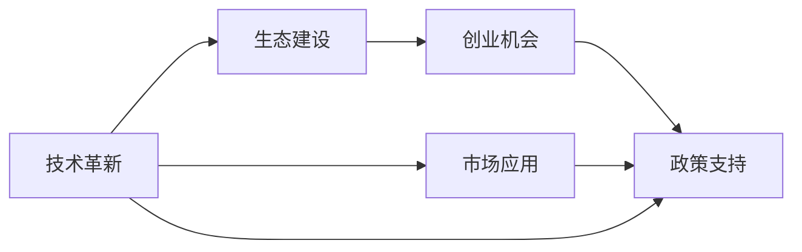
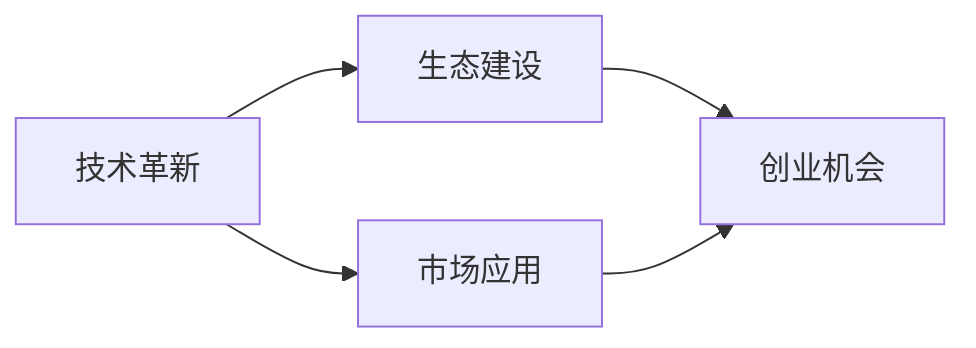
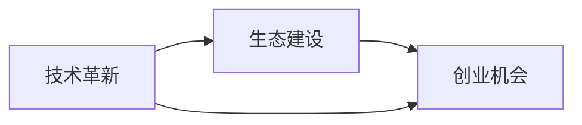
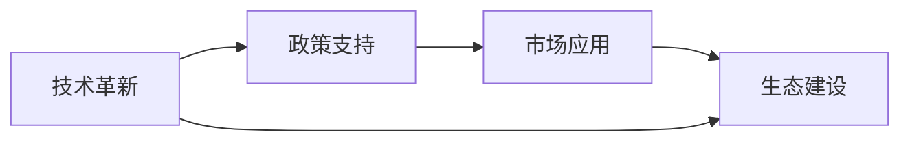
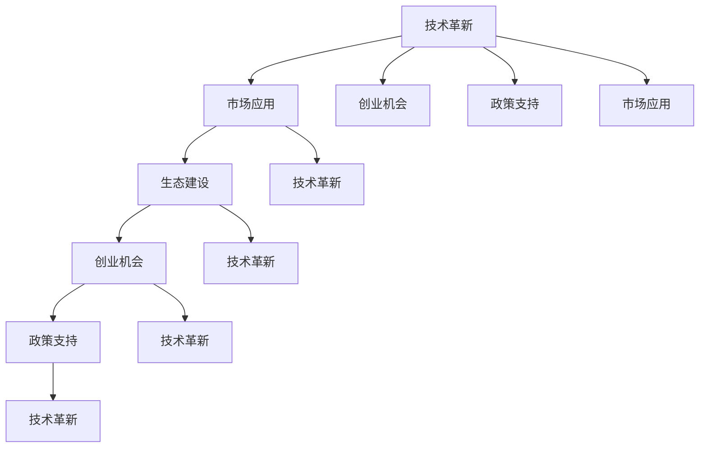

                 

# AI 2.0 时代的投资机会

## 1. 背景介绍

### 1.1 问题由来
在人类社会迈向AI 2.0时代的过程中，人工智能的迅猛发展正在深刻地改变着世界的面貌。AI 2.0不仅仅是人工智能技术的进化，更是技术和应用领域的全面融合与扩展。它代表了人工智能从实验室走向市场，从封闭体系向开放生态的历史性转变。

在这个转型过程中，我们看到了许多前所未有的投资机会。AI 2.0技术的革新正驱动着传统行业数字化转型，催生了新兴业务模式，并孕育出新的产业生态。无论是科技公司、创业企业还是传统企业，都能在这个充满机遇的时代找到自己的位置。

### 1.2 问题核心关键点
AI 2.0时代的投资机会主要集中在以下几个方面：

- **技术革新**：AI 2.0引领的技术革命，如量子计算、脑机接口、类脑计算、高精度神经网络等，为技术型企业带来了巨大的投资价值。
- **市场应用**：AI 2.0在医疗健康、金融、零售、制造、能源、农业等行业的应用，推动了这些领域的数字化升级，为相关企业提供了巨大的商业机会。
- **生态建设**：AI 2.0的普及需要基础设施的支撑，如云计算、大数据、5G、IoT等，这些领域的投资前景广阔。
- **创业机会**：AI 2.0时代涌现出大量创业机会，如AI芯片、机器人、自动驾驶、虚拟现实（VR）、增强现实（AR）等，吸引了大量风险投资。
- **政策支持**：各国政府对AI 2.0技术的政策支持，如研发补贴、税收优惠、人才培养等，为AI企业提供了良好的外部环境。

### 1.3 问题研究意义
研究和把握AI 2.0时代的投资机会，对于企业和投资者来说，具有以下重要意义：

1. **抓住先机**：AI 2.0技术的快速发展，使得投资决策需要快速反应，抓住市场先机。
2. **优化资源配置**：根据AI 2.0的发展趋势和市场需求，合理分配投资资源，避免资源浪费。
3. **提升竞争力**：在AI 2.0时代，技术是企业的核心竞争力，投资于AI技术有助于提升企业的市场竞争力。
4. **拓展市场**：AI 2.0技术的应用，开辟了新的市场空间，提供了新的业务增长点。
5. **促进创新**：AI 2.0技术的突破性进展，催生了大量的创新机会，投资于AI创新项目，有望获得丰厚回报。

## 2. 核心概念与联系

### 2.1 核心概念概述

为了更好地理解AI 2.0时代的投资机会，本节将介绍几个密切相关的核心概念：

- **AI 2.0**：相较于AI 1.0，AI 2.0更加注重技术应用和跨行业融合，旨在通过深度学习、增强学习、多模态融合等技术，实现人工智能的全面普及和应用。
- **技术革新**：指新技术、新方法、新算法的研发和应用，如量子计算、类脑计算、脑机接口等，是推动AI 2.0发展的重要力量。
- **市场应用**：AI 2.0技术在不同行业中的应用，如医疗、金融、零售、制造等，对各行业的数字化转型具有重要影响。
- **生态建设**：指AI 2.0所需的支撑基础设施，如云计算、大数据、5G、IoT等，为AI技术的落地提供保障。
- **创业机会**：AI 2.0时代涌现出的新兴技术领域，如AI芯片、自动驾驶、VR/AR等，为创业者提供了广阔的市场空间。
- **政策支持**：各国政府对AI 2.0技术的政策扶持，如研发补贴、税收优惠、人才培养等，为AI企业提供了良好的外部环境。

这些核心概念之间存在着紧密的联系，形成了AI 2.0时代的投资机会生态系统。下面我们将通过一个Mermaid流程图来展示这些概念之间的联系。

这个流程图展示了AI 2.0投资机会生态系统的整体架构：技术革新推动市场应用，市场应用需要生态建设支撑，创业机会在技术革新和生态建设中孕育，政策支持为所有环节提供良好的外部环境。通过理解这些核心概念及其关系，我们能够更好地把握AI 2.0时代的投资机会。

### 2.2 概念间的关系

这些核心概念之间存在着紧密的联系，形成了AI 2.0时代的投资机会生态系统。下面我们通过几个Mermaid流程图来展示这些概念之间的关系。

#### 2.2.1 AI 2.0的市场应用

这个流程图展示了AI 2.0技术如何在市场应用中实现商业化，市场应用是技术革新的最终目标，同时需要生态建设和创业机会的支持。

#### 2.2.2 生态建设与创业机会

这个流程图展示了技术革新如何推动生态建设，生态建设为创业机会的孕育提供基础，创业机会进一步推动技术革新。

#### 2.2.3 政策支持

这个流程图展示了政策支持如何影响AI 2.0的各个环节，政策支持为技术革新和市场应用提供保障，同时也推动了生态建设和创业机会的发展。

### 2.3 核心概念的整体架构

最后，我们用一个综合的流程图来展示这些核心概念在大语言模型微调过程中的整体架构：

这个综合流程图展示了AI 2.0技术的创新、应用、生态、创业和政策支持之间的相互促进和循环关系，共同推动AI 2.0时代的蓬勃发展。通过这些流程图，我们可以更清晰地理解AI 2.0投资机会生态系统的各个环节及其相互关系。

## 3. 核心算法原理 & 具体操作步骤
### 3.1 算法原理概述

AI 2.0时代的投资机会，从根本上讲，是AI技术创新和应用拓展的结果。本文将详细探讨几个关键的核心算法原理。

**3.1.1 技术革新**

AI 2.0的技术革新主要包括深度学习、增强学习、量子计算、脑机接口、类脑计算等领域。以下是这些技术的基本原理：

- **深度学习**：通过多层神经网络模拟人脑的学习过程，实现模式识别和预测。
- **增强学习**：通过智能体与环境的交互，通过奖励机制不断优化决策策略。
- **量子计算**：利用量子比特的量子并行特性，实现计算能力的指数级提升。
- **脑机接口**：通过神经信号采集和解码，实现人机交互。
- **类脑计算**：模拟人脑神经网络的工作机制，实现高效计算。

**3.1.2 市场应用**

AI 2.0技术在医疗、金融、零售、制造、能源、农业等行业的应用，通过数据驱动的方式，提高了效率，降低了成本，创造了新的价值。以下是这些应用的基本原理：

- **医疗健康**：通过数据分析和机器学习，提升疾病诊断、个性化治疗和医疗管理效率。
- **金融**：通过算法交易、风险管理和智能客服，提高金融服务质量和效率。
- **零售**：通过消费者行为分析、供应链优化和智能推荐，提升用户体验和销售效率。
- **制造**：通过预测性维护、智能制造和质量控制，提升生产效率和产品竞争力。
- **能源**：通过数据分析和智能控制，提高能源利用效率和安全性。
- **农业**：通过智能农业技术和数据预测，提高农业生产效率和可持续性。

**3.1.3 生态建设**

AI 2.0的生态建设主要涉及云计算、大数据、5G、IoT等基础设施的建设。以下是这些基础设施的基本原理：

- **云计算**：通过分布式计算和资源共享，提供高效、可扩展的计算能力。
- **大数据**：通过数据存储、处理和分析，实现数据的价值挖掘。
- **5G**：通过高带宽、低延迟的网络技术，实现高效的实时通信和数据传输。
- **IoT**：通过传感器和设备互联，实现智能化和自动化的生产和生活。

**3.1.4 创业机会**

AI 2.0时代的创业机会主要集中在AI芯片、机器人、自动驾驶、VR/AR等领域。以下是这些领域的基本原理：

- **AI芯片**：通过高性能计算芯片，提升AI算法的执行效率。
- **机器人**：通过自主导航和智能控制，实现自动化生产和服务。
- **自动驾驶**：通过感知、决策和控制技术，实现智能交通。
- **VR/AR**：通过虚拟现实和增强现实技术，提供沉浸式交互体验。

### 3.2 算法步骤详解

AI 2.0时代的投资机会，需要从技术、市场、生态等多个维度进行全面考虑。以下是AI 2.0投资的详细操作步骤：

**步骤 1: 市场调研**

- **识别需求**：了解不同行业对AI技术的需求，如自动化、智能化、个性化等。
- **分析机会**：分析市场潜力、竞争态势和技术趋势，寻找投资机会。

**步骤 2: 技术评估**

- **评估技术可行性**：评估AI技术的成熟度、可行性、潜在收益等。
- **识别技术风险**：评估技术实现的难度、成本、可扩展性等风险。

**步骤 3: 团队评估**

- **评估团队能力**：评估团队的技术背景、经验、执行力等。
- **识别管理风险**：评估团队的管理能力、市场洞察力、风险控制能力等。

**步骤 4: 商业模式设计**

- **设计盈利模式**：设计合理的商业模式，如订阅、按需服务、SaaS等。
- **制定增长策略**：制定增长策略，如市场推广、合作伙伴关系、定价策略等。

**步骤 5: 投资决策**

- **评估投资价值**：评估技术、市场、团队、商业模式的综合价值。
- **制定投资方案**：制定投资方案，明确投资比例、时间表、退出策略等。

**步骤 6: 持续投资**

- **跟踪项目进展**：跟踪项目的进展，及时发现和解决问题。
- **优化投资组合**：根据市场变化和项目表现，优化投资组合。

### 3.3 算法优缺点

AI 2.0时代的投资机会具有以下优缺点：

**优点**：

- **创新性强**：AI 2.0技术具有高度的创新性，能够带来新的商业模式和应用场景。
- **投资回报高**：AI 2.0技术在医疗、金融、制造等领域的应用，具有高潜力和高回报。
- **多领域覆盖**：AI 2.0技术能够覆盖多个行业，为不同企业提供投资机会。

**缺点**：

- **技术风险高**：AI 2.0技术的研发和实现具有高技术难度和不确定性。
- **市场竞争激烈**：AI 2.0领域吸引了大量资本和人才，市场竞争激烈。
- **政策风险大**：AI 2.0技术的政策法规和标准尚未完全建立，存在政策风险。

### 3.4 算法应用领域

AI 2.0技术在不同行业中的应用，推动了这些行业的数字化转型，带来了巨大的商业机会。以下是AI 2.0技术的主要应用领域：

- **医疗健康**：智能诊断、个性化治疗、医疗管理等。
- **金融**：算法交易、风险管理、智能客服等。
- **零售**：消费者行为分析、智能推荐、供应链优化等。
- **制造**：预测性维护、智能制造、质量控制等。
- **能源**：数据分析、智能控制、能源管理等。
- **农业**：智能农业、数据预测、精准农业等。

## 4. 数学模型和公式 & 详细讲解 & 举例说明

### 4.1 数学模型构建

AI 2.0技术的应用，往往需要构建数学模型来进行描述和优化。以下是几个常见的数学模型：

- **深度学习模型**：如卷积神经网络（CNN）、循环神经网络（RNN）、变换器（Transformer）等。
- **增强学习模型**：如Q-learning、SARSA、Deep Q-Network（DQN）等。
- **量子计算模型**：如量子线路模型、量子误差校正等。
- **脑机接口模型**：如神经网络解码、信号滤波等。

### 4.2 公式推导过程

以下是几个常见数学模型的公式推导过程：

#### 4.2.1 深度学习模型

以卷积神经网络（CNN）为例，其基本结构如下：

- **卷积层**：通过卷积核对输入数据进行卷积操作，提取特征。
- **池化层**：通过池化操作对特征进行降维和抽象。
- **全连接层**：通过全连接层将特征映射到输出结果。

卷积层公式如下：

$$
y = f(\sum_{i=1}^{k} \sum_{j=1}^{n} w_{i,j}x_{i,j} + b)
$$

其中，$x$ 为输入数据，$w$ 为卷积核，$b$ 为偏置项，$f$ 为激活函数。

池化层公式如下：

$$
y = \max_{i,j}(x_{i,j})
$$

其中，$x$ 为输入数据，$y$ 为池化后的结果。

全连接层公式如下：

$$
y = f(\sum_{i=1}^{d} w_i z_i + b)
$$

其中，$z$ 为输入特征，$w$ 为权重，$b$ 为偏置项，$f$ 为激活函数。

#### 4.2.2 增强学习模型

以Q-learning为例，其基本算法如下：

- **状态**：学习环境中的状态表示。
- **动作**：学习环境中的动作选择。
- **奖励**：学习环境中的奖励机制。
- **策略**：学习环境的策略选择。

Q-learning的公式如下：

$$
Q(s, a) = Q(s, a) + \alpha(r + \gamma \max_{a'} Q(s', a') - Q(s, a))
$$

其中，$s$ 为当前状态，$a$ 为当前动作，$r$ 为奖励，$s'$ 为下一状态，$a'$ 为下一动作，$\alpha$ 为学习率，$\gamma$ 为折扣因子。

#### 4.2.3 量子计算模型

以量子线路模型为例，其基本结构如下：

- **量子比特**：量子计算的基本单位。
- **量子门**：量子比特的逻辑运算。
- **量子算法**：通过量子门实现量子计算。

量子线路模型公式如下：

$$
U = \prod_{i=1}^{n} U_i
$$

其中，$U$ 为量子线路，$U_i$ 为量子门。

#### 4.2.4 脑机接口模型

以神经网络解码为例，其基本结构如下：

- **输入数据**：神经信号数据。
- **网络模型**：多层神经网络模型。
- **输出结果**：解码后的信号。

神经网络解码公式如下：

$$
y = f(\sum_{i=1}^{k} \sum_{j=1}^{n} w_{i,j}x_{i,j} + b)
$$

其中，$x$ 为输入数据，$w$ 为权重，$b$ 为偏置项，$f$ 为激活函数。

### 4.3 案例分析与讲解

#### 4.3.1 医疗健康领域

以智能诊断为例，AI 2.0技术通过深度学习和增强学习，实现了医学影像的自动分析和诊断。以下是具体步骤：

- **数据收集**：收集大量的医学影像数据，如CT、MRI、X光等。
- **数据标注**：对数据进行标注，如病灶、器官、病变等。
- **模型训练**：通过深度学习模型（如卷积神经网络）进行训练，提取医学影像的特征。
- **性能评估**：通过增强学习模型（如强化学习）进行性能评估，优化模型参数。
- **临床应用**：将训练好的模型应用于临床，实现自动分析和诊断。

#### 4.3.2 金融领域

以智能客服为例，AI 2.0技术通过自然语言处理和增强学习，实现了智能客服的自动化服务。以下是具体步骤：

- **数据收集**：收集大量的客户咨询记录，如电话、邮件、社交媒体等。
- **数据标注**：对数据进行标注，如问题类别、意图、回答等。
- **模型训练**：通过自然语言处理模型（如BERT）进行训练，提取客户的意图和需求。
- **性能评估**：通过增强学习模型（如Q-learning）进行性能评估，优化模型策略。
- **服务应用**：将训练好的模型应用于智能客服系统，实现自动回答和对话。

#### 4.3.3 零售领域

以智能推荐为例，AI 2.0技术通过深度学习和增强学习，实现了个性化推荐。以下是具体步骤：

- **数据收集**：收集大量的用户行为数据，如浏览记录、购买记录等。
- **数据标注**：对数据进行标注，如商品类别、用户偏好等。
- **模型训练**：通过深度学习模型（如推荐系统）进行训练，提取用户和商品之间的关联关系。
- **性能评估**：通过增强学习模型（如强化学习）进行性能评估，优化推荐策略。
- **服务应用**：将训练好的模型应用于电商平台，实现个性化推荐和商品展示。

## 5. 项目实践：代码实例和详细解释说明

### 5.1 开发环境搭建

在进行AI 2.0投资机会的实践时，我们需要准备好开发环境。以下是使用Python进行TensorFlow开发的环

