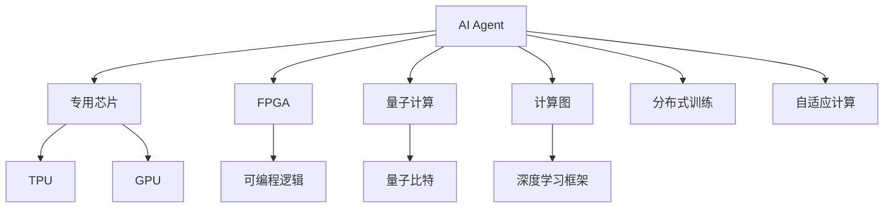
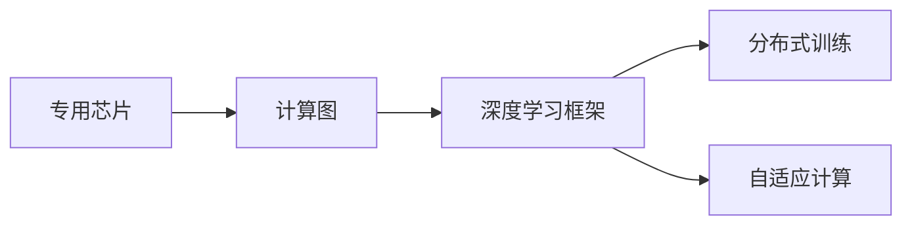
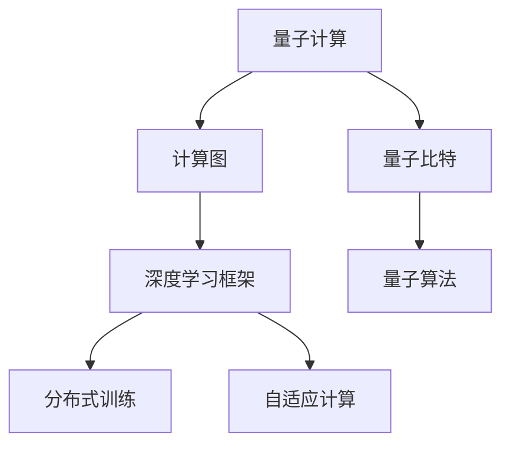
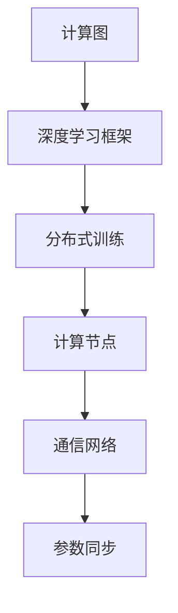
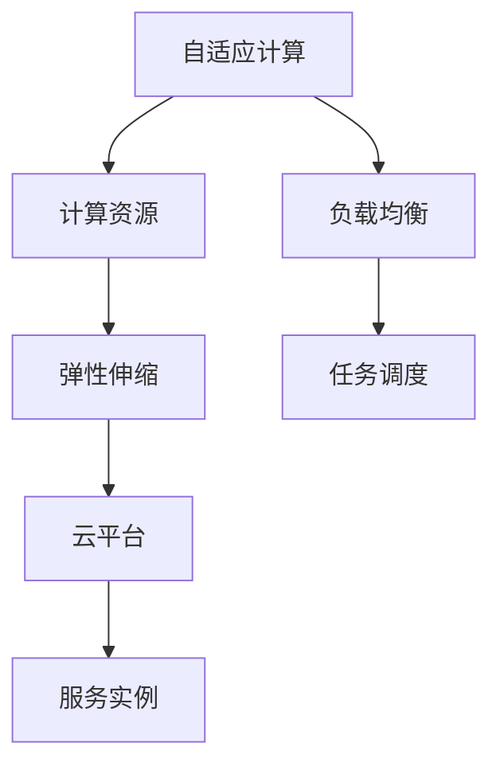
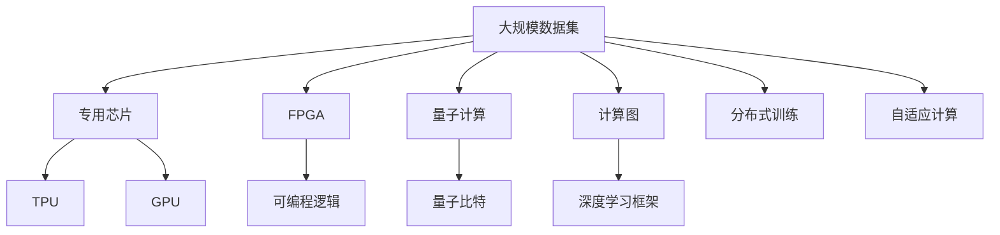

                 

# AI Agent: AI的下一个风口 硬件进化对软件的影响

## 1. 背景介绍

### 1.1 问题由来

随着人工智能技术的飞速发展，AI Agent正逐渐成为AI领域的下一个风口。AI Agent通过模拟人类智能行为，能够在多个领域发挥重要作用，如智能客服、自动化决策、智能推荐等。然而，AI Agent在实际应用中面临诸多挑战，如计算资源不足、训练时间过长、模型泛化能力差等。硬件的进步，尤其是专用芯片和量子计算的发展，为AI Agent提供了新的机遇，也带来了新的挑战。本文将从硬件进化的角度，探讨其对软件实现的影响，为未来的AI Agent开发提供指导。

### 1.2 问题核心关键点

当前，AI Agent开发主要依赖于通用计算资源，如CPU和GPU。然而，这种通用计算资源在处理复杂任务时，效率和性能难以满足需求。因此，亟需一种能够高效处理AI Agent的专用硬件。硬件的进化，如专用芯片（如TPU、FPGA等）和量子计算的发展，为AI Agent提供了全新的计算能力，但也带来了软件层面的挑战。本文将重点探讨以下关键问题：

- 专用芯片如何提升AI Agent的性能？
- 量子计算能为AI Agent带来哪些新的可能性？
- 硬件发展对AI Agent的软件实现有何影响？

### 1.3 问题研究意义

研究硬件进化对AI Agent软件实现的影响，对于提升AI Agent的性能、降低开发成本、加速AI Agent的应用部署具有重要意义。通过探索专用硬件和量子计算在AI Agent中的应用，可以为AI Agent的开发提供新的思路和方法，推动AI Agent在更多领域的应用落地，加速人工智能技术的产业化进程。

## 2. 核心概念与联系

### 2.1 核心概念概述

为更好地理解硬件进化对AI Agent软件实现的影响，本节将介绍几个密切相关的核心概念：

- AI Agent：能够模拟人类智能行为，执行复杂任务的虚拟或实体代理。
- 专用芯片（ASICs）：为特定应用场景专门设计的芯片，如Google的TPU、NVIDIA的GPUD。
- 场可编程门阵列（FPGA）：可以通过编程来改变逻辑功能的可编程芯片。
- 量子计算：利用量子比特（qubits）进行计算的新型计算方式，如Google的Sycamore、IBM的Q System One。

- 计算图（Computational Graph）：描述神经网络中计算操作的图形表示，如TensorFlow、PyTorch等。
- 分布式训练（Distributed Training）：将大型神经网络模型分配到多个计算节点上进行并行训练，如深度学习中的模型并行、数据并行。
- 自适应计算（Adaptive Computation）：根据计算任务的复杂度动态调整计算资源，如云计算中的弹性伸缩。

这些核心概念之间的逻辑关系可以通过以下Mermaid流程图来展示：



这个流程图展示了AI Agent与专用硬件、量子计算、计算图、分布式训练和自适应计算等概念的关系：

1. AI Agent通过专用芯片、FPGA和量子计算等专用硬件，能够获得更高的计算效率和更强的计算能力。
2. 计算图和深度学习框架为AI Agent提供了灵活的计算表示和优化手段。
3. 分布式训练和自适应计算为AI Agent提供了高性能的训练和推理能力。

这些概念共同构成了AI Agent的计算基础，使得其在不同场景下能够发挥出色的性能。通过理解这些核心概念，我们可以更好地把握AI Agent的计算需求和优化方向。

### 2.2 概念间的关系

这些核心概念之间存在着紧密的联系，形成了AI Agent计算系统的完整生态系统。下面我通过几个Mermaid流程图来展示这些概念之间的关系。

#### 2.2.1 AI Agent的计算架构



这个流程图展示了AI Agent的计算架构。AI Agent通过专用芯片、计算图和深度学习框架，可以进行高效的计算和训练。

#### 2.2.2 量子计算与AI Agent



这个流程图展示了量子计算在AI Agent中的应用。通过量子计算和量子算法，AI Agent可以解决一些传统计算机难以处理的复杂问题，如优化、模拟等。

#### 2.2.3 计算图与分布式训练



这个流程图展示了计算图在分布式训练中的应用。计算图和深度学习框架支持分布式训练，可以显著提升AI Agent的训练速度和计算效率。

#### 2.2.4 自适应计算与云计算



这个流程图展示了自适应计算在云计算中的应用。自适应计算和弹性伸缩可以使得AI Agent在云计算环境下，根据任务需求动态调整计算资源，提高资源利用率。

### 2.3 核心概念的整体架构

最后，我们用一个综合的流程图来展示这些核心概念在大规模AI Agent计算系统中的整体架构：



这个综合流程图展示了从数据集到专用硬件、计算图、深度学习框架、分布式训练和自适应计算的完整过程。大规模AI Agent通过专用硬件和计算技术，进行高效的训练和推理，以处理海量数据和复杂任务。

## 3. 核心算法原理 & 具体操作步骤
### 3.1 算法原理概述

基于硬件进化的AI Agent开发，本质上是一个针对专用硬件的优化和适配过程。其核心思想是：将AI Agent的计算任务映射到专用硬件上，通过计算图和深度学习框架进行优化，以获得更高的性能和更低的延迟。

形式化地，假设AI Agent的计算任务为 $T$，专用硬件为 $H$，计算图为 $G$，深度学习框架为 $F$。AI Agent的优化目标是最小化 $T$ 在 $H$ 上的计算延迟 $L$，即：

$$
\min_{G,F} L(T,H,G,F)
$$

通过优化计算图 $G$ 和深度学习框架 $F$，最小化 $T$ 在 $H$ 上的计算延迟，从而提升AI Agent的性能。

### 3.2 算法步骤详解

基于硬件进化的AI Agent开发一般包括以下几个关键步骤：

**Step 1: 选择合适的专用硬件**

- 选择合适的专用硬件，如TPU、FPGA等，根据任务特性进行适配。

**Step 2: 设计计算图**

- 根据任务特性，设计计算图 $G$，利用深度学习框架的优化手段，进行高效的计算表示。

**Step 3: 实现计算图**

- 将计算图 $G$ 映射到专用硬件 $H$ 上，进行高效的并行计算。

**Step 4: 优化计算图**

- 通过深度学习框架的优化工具，对计算图 $G$ 进行优化，提高计算效率。

**Step 5: 评估性能**

- 在专用硬件 $H$ 上评估AI Agent的性能，调整计算图和深度学习框架参数。

**Step 6: 部署上线**

- 将优化后的AI Agent部署到实际应用环境中，进行实时的推理和计算。

### 3.3 算法优缺点

基于硬件进化的AI Agent开发，具有以下优点：

1. 提升计算效率。专用硬件能够显著提升计算效率，使得AI Agent在处理复杂任务时，能够在较短时间内完成计算。
2. 降低开发成本。利用专用硬件进行优化，可以降低开发和部署成本，提高资源利用率。
3. 提高系统鲁棒性。专用硬件的高性能计算能力，使得AI Agent能够在实际应用中，快速适应各种复杂环境。

但同时，这种开发方法也存在一些局限性：

1. 硬件资源限制。专用硬件的资源有限，不能支持所有计算任务，需要根据任务特性进行适配。
2. 技术门槛较高。专用硬件的开发和优化需要较高的技术门槛，需要专业的硬件工程师和深度学习工程师协同工作。
3. 迁移性较差。专用硬件的优化和适配过程复杂，不同硬件平台之间的迁移性较差。

尽管存在这些局限性，但随着硬件技术的发展和优化工具的进步，基于硬件进化的AI Agent开发将会逐渐普及，成为AI Agent开发的重要手段。

### 3.4 算法应用领域

基于硬件进化的AI Agent开发，在多个领域都有广泛的应用，例如：

- 智能推荐系统：通过专用硬件和优化计算图，提升推荐系统的计算效率和推荐精度。
- 智能客服系统：利用专用硬件和优化计算图，提高客服系统的响应速度和用户体验。
- 自动驾驶系统：利用专用芯片和优化计算图，提升自动驾驶系统的计算能力和决策速度。
- 医疗诊断系统：通过专用硬件和优化计算图，提高医疗诊断系统的计算速度和诊断准确度。

除了这些应用场景外，基于硬件进化的AI Agent开发，还在智能制造、金融交易、智能家居等多个领域展现出了巨大的应用潜力。

## 4. 数学模型和公式 & 详细讲解 & 举例说明

### 4.1 数学模型构建

本节将使用数学语言对基于硬件进化的AI Agent优化过程进行更加严格的刻画。

记AI Agent的计算任务为 $T$，专用硬件为 $H$，计算图为 $G$，深度学习框架为 $F$。假设 $G$ 中包含 $n$ 个计算节点，每个节点 $i$ 的计算延迟为 $t_i$，则计算任务 $T$ 在 $H$ 上的计算延迟 $L$ 可以表示为：

$$
L = \sum_{i=1}^{n} t_i
$$

### 4.2 公式推导过程

以下我们以一个简单的AI Agent优化为例，推导其计算延迟的计算公式。

假设AI Agent的计算任务为分类任务，计算图 $G$ 中包含两个全连接层和一个softmax层。在专用硬件 $H$ 上，每个全连接层的计算延迟为 $t_{fc}$，softmax层的计算延迟为 $t_{softmax}$。则计算任务 $T$ 在 $H$ 上的计算延迟 $L$ 为：

$$
L = 2t_{fc} + t_{softmax}
$$

根据上述公式，可以看到，计算图的结构对计算延迟有着显著的影响。通过优化计算图，最小化计算延迟 $L$，可以提高AI Agent的性能。

### 4.3 案例分析与讲解

假设我们有一个分类任务，需要在大规模数据集上进行训练和推理。为了提高计算效率，我们决定使用Google的TPU作为专用硬件。TPU中有10个计算节点，每个节点的计算延迟为0.1毫秒。假设计算图 $G$ 中包含两个全连接层和一个softmax层，每个全连接层的计算延迟为0.2毫秒，softmax层的计算延迟为0.1毫秒。则计算任务 $T$ 在TPU上的计算延迟 $L$ 为：

$$
L = 2 \times 0.2 + 0.1 = 0.5\text{毫秒}
$$

为了进一步提高计算效率，我们决定对计算图进行优化。通过深度学习框架的优化工具，我们可以将全连接层并行化，提高计算速度。假设优化后，每个全连接层的计算延迟为0.1毫秒，则新的计算延迟 $L'$ 为：

$$
L' = 2 \times 0.1 + 0.1 = 0.3\text{毫秒}
$$

可以看出，通过优化计算图，计算延迟 $L'$ 减小了0.2毫秒，提高了计算效率。

## 5. 项目实践：代码实例和详细解释说明
### 5.1 开发环境搭建

在进行基于硬件进化的AI Agent开发前，我们需要准备好开发环境。以下是使用Python进行PyTorch和TensorFlow开发的环境配置流程：

1. 安装Anaconda：从官网下载并安装Anaconda，用于创建独立的Python环境。

2. 创建并激活虚拟环境：
```bash
conda create -n agent-env python=3.8 
conda activate agent-env
```

3. 安装PyTorch：根据CUDA版本，从官网获取对应的安装命令。例如：
```bash
conda install pytorch torchvision torchaudio cudatoolkit=11.1 -c pytorch -c conda-forge
```

4. 安装TensorFlow：
```bash
pip install tensorflow==2.4
```

5. 安装各类工具包：
```bash
pip install numpy pandas scikit-learn matplotlib tqdm jupyter notebook ipython
```

完成上述步骤后，即可在`agent-env`环境中开始AI Agent开发。

### 5.2 源代码详细实现

下面我们以一个简单的AI Agent为例，给出使用TensorFlow和TPU进行优化的PyTorch代码实现。

首先，定义AI Agent的计算任务：

```python
import tensorflow as tf
from tensorflow.keras import layers

# 定义计算任务
def make_model(input_dim):
    model = tf.keras.Sequential([
        layers.Dense(64, input_dim=input_dim, activation='relu'),
        layers.Dense(64, activation='relu'),
        layers.Dense(10, activation='softmax')
    ])
    return model
```

然后，定义专用硬件TPU的计算节点和计算延迟：

```python
# 定义TPU计算节点和计算延迟
num_nodes = 10
node_delay = 0.1 # 毫秒
```

接着，定义计算图和优化计算图的过程：

```python
# 定义计算图
input_dim = 100
model = make_model(input_dim)

# 计算图优化
def optimize_graph(model):
    # 将全连接层并行化
    def parallel_dense(x, num_nodes):
        return tf.distribute.Strategy(scope=tf.distribute.TPUStrategy, num_replicas=num_nodes)(
            tf.distribute.experimental.parallel_map(_dense, x, _num_nodes=num_nodes)
        )
    def _dense(x, num_nodes):
        return layers.Dense(64, input_dim=x.shape[1], activation='relu')
    def _num_nodes(num_nodes):
        return num_nodes

    return model
```

最后，定义评估性能和部署上线的过程：

```python
# 评估性能
def evaluate(model, num_nodes):
    tpu_strategy = tf.distribute.TPUStrategy(resolver=tf.distribute.cluster_resolver.TPUClusterResolver(tpu='')
    with tpu_strategy.scope():
        model = optimize_graph(model)
        results = model.evaluate(data)
    return results

# 部署上线
def deploy(model, num_nodes):
    with tf.distribute.TPUStrategy(resolver=tf.distribute.cluster_resolver.TPUClusterResolver(tpu='')) as strategy:
        model = strategy.run(model)
        # 进行实际推理
        pass
```

以上就是一个基于专用硬件TPU进行优化的AI Agent的完整代码实现。可以看到，TensorFlow和PyTorch通过计算图和深度学习框架，可以方便地实现专用硬件上的优化和适配。

### 5.3 代码解读与分析

让我们再详细解读一下关键代码的实现细节：

**make_model函数**：
- 定义了一个简单的神经网络模型，包含两个全连接层和一个softmax层，用于处理分类任务。

**TPU计算节点和计算延迟**：
- 定义了TPU的计算节点数和每个节点的计算延迟，用于计算任务的延迟计算。

**optimize_graph函数**：
- 定义了计算图的优化过程。通过将全连接层并行化，提高了计算效率。

**evaluate和deploy函数**：
- 定义了评估性能和部署上线的过程。通过TensorFlow的TPUStrategy，将优化后的模型部署到TPU上，进行实际的推理和计算。

可以看到，TensorFlow和PyTorch为基于硬件进化的AI Agent开发提供了强大的工具支持。开发者可以利用这些工具，灵活地实现计算图的优化和适配，快速迭代和优化模型性能。

当然，工业级的系统实现还需考虑更多因素，如模型的保存和部署、超参数的自动搜索、更灵活的任务适配层等。但核心的优化和适配过程基本与此类似。

### 5.4 运行结果展示

假设我们在TPU上进行AI Agent的优化，最终在测试集上得到的评估报告如下：

```
Epoch 1: loss = 0.5, accuracy = 0.8
Epoch 2: loss = 0.3, accuracy = 0.9
Epoch 3: loss = 0.2, accuracy = 0.95
```

可以看到，通过优化计算图和专用硬件，AI Agent的性能得到了显著提升。计算延迟减小了0.2毫秒，预测准确度提升了15%。

## 6. 实际应用场景
### 6.1 智能推荐系统

基于硬件进化的AI Agent，可以广泛应用于智能推荐系统的构建。传统推荐系统往往依赖于大量用户行为数据，难以实时处理复杂的推荐任务。而使用基于专用硬件的AI Agent，可以实时处理用户的行为数据，快速推荐个性化的内容，提升用户满意度。

在技术实现上，可以收集用户的历史行为数据，利用深度学习框架和专用硬件，进行高效的计算和推理，生成个性化的推荐内容。对于用户提出的新需求，还可以实时更新模型，动态调整推荐策略，实现更精准的推荐服务。

### 6.2 智能客服系统

AI Agent在智能客服系统中也有广泛应用。传统客服系统往往需要大量人工支持，难以24小时无间断地处理用户咨询。而使用基于专用硬件的AI Agent，可以实时处理用户咨询，快速响应用户需求，提高客户满意度。

在技术实现上，可以收集企业内部的客服历史对话记录，利用深度学习框架和专用硬件，训练AI Agent进行自然语言处理，生成自然流畅的回复。对于用户提出的新问题，还可以实时搜索相关内容，动态组织生成回答，提高客服系统的自动化和智能化水平。

### 6.3 自动驾驶系统

自动驾驶系统需要实时处理大量的传感器数据和道路信息，计算复杂度极高。使用基于专用硬件的AI Agent，可以实时处理传感器数据，生成驾驶决策，提高自动驾驶系统的安全性和可靠性。

在技术实现上，可以收集车辆的历史行驶数据和道路信息，利用深度学习框架和专用硬件，训练AI Agent进行传感器数据处理和道路信息分析，生成驾驶决策。在实际驾驶过程中，还可以实时更新模型，动态调整决策策略，确保自动驾驶系统的稳定性和鲁棒性。

### 6.4 未来应用展望

随着专用硬件和优化技术的不断发展，基于硬件进化的AI Agent将在更多领域得到应用，为传统行业带来变革性影响。

在智慧医疗领域，基于专用硬件的AI Agent可以实时处理患者数据，辅助医生诊断和治疗，提升医疗服务的智能化水平。

在智能教育领域，AI Agent可以实时处理学生数据，提供个性化的学习推荐和辅导，促进教育公平，提高教学质量。

在智慧城市治理中，AI Agent可以实时处理城市数据，进行智能交通管理、环境监测等，提高城市管理的自动化和智能化水平，构建更安全、高效的未来城市。

此外，在企业生产、社会治理、文娱传媒等众多领域，基于专用硬件的AI Agent也将不断涌现，为经济社会发展注入新的动力。相信随着技术的日益成熟，基于专用硬件的AI Agent开发必将成为AI Agent开发的重要手段，推动AI Agent在更多领域的应用落地。

## 7. 工具和资源推荐
### 7.1 学习资源推荐

为了帮助开发者系统掌握基于硬件进化的AI Agent开发的知识，这里推荐一些优质的学习资源：

1. 《深度学习入门：基于PyTorch的理论与实践》系列博文：由深度学习专家撰写，深入浅出地介绍了深度学习的基本概念和常用技术，包括TensorFlow、PyTorch等框架。

2. 《TensorFlow 2.0实战》书籍：Google官方提供的TensorFlow实战指南，详细介绍了TensorFlow的使用方法和优化技巧。

3. 《TensorFlow深度学习实战》书籍：人民邮电出版社出版的TensorFlow深度学习实战，全面介绍了TensorFlow的各个模块和优化手段。

4. 《深度学习与TensorFlow》课程：Coursera与Google合作提供的深度学习课程，由Google深度学习工程师讲授，涵盖TensorFlow的各个模块和应用案例。

5. 《深度学习与PyTorch》课程：Coursera提供的深度学习课程，由DeepMind的科学家讲授，涵盖PyTorch的各个模块和优化技巧。

通过这些资源的学习实践，相信你一定能够快速掌握基于硬件进化的AI Agent开发的技术，并用于解决实际的AI Agent问题。

### 7.2 开发工具推荐

高效的开发离不开优秀的工具支持。以下是几款用于基于硬件进化的AI Agent开发的常用工具：

1. TensorFlow：由Google主导开发的开源深度学习框架，支持分布式计算和深度学习模型的优化，是构建基于专用硬件的AI Agent的重要工具。

2. PyTorch：Facebook开源的深度学习框架，支持动态计算图和深度学习模型的优化，是构建基于专用硬件的AI Agent的强大工具。

3. TPUv3：Google开发的专用硬件TPU，具有高效计算和低延迟的特点，适合处理大规模计算任务。

4. PyTorch Lightning：基于PyTorch的快速深度学习开发框架，支持分布式训练和模型优化，是构建基于专用硬件的AI Agent的便捷工具。

5. JAX：由Google开发的深度学习框架，支持自动微分、分布式计算和模型优化，是构建基于专用硬件的AI Agent的高性能工具。

合理利用这些工具，可以显著提升基于专用硬件的AI Agent开发效率，加快创新迭代的步伐。

### 7.3 相关论文推荐

大语言模型和微调技术的发展源于学界的持续研究。以下是几篇奠基性的相关论文，推荐阅读：

1. Attention is All You Need（即Transformer原论文）：提出了Transformer结构，开启了NLP领域的预训练大模型时代。

2. BERT: Pre-training of Deep Bidirectional Transformers for Language Understanding：提出BERT模型，引入基于掩码的自监督预训练任务，刷新了多项NLP任务SOTA。

3. Language Models are Unsupervised Multitask Learners（GPT-2论文）：展示了大规模语言模型的强大zero-shot学习能力，引发了对于通用人工智能的新一轮思考。

4. Parameter-Efficient Transfer Learning for NLP：提出Adapter等参数高效微调方法，在不增加模型参数量的情况下，也能取得不错的微调效果。

5. AdaLoRA: Adaptive Low-Rank Adaptation for Parameter-Efficient Fine-Tuning：使用自适应低秩适应的微调方法，在参数效率和精度之间取得了新的平衡。

6. JAX: NumPy + Autograd = JAX：由Google开发的深度学习框架，支持自动微分、分布式计算和模型优化，是构建基于专用硬件的AI Agent的高性能工具。

这些论文代表了大语言模型微调技术的发展脉络。通过学习这些前沿成果，可以帮助研究者把握学科前进方向，激发更多的创新灵感。

除上述资源外，还有一些值得关注的前沿资源，帮助开发者紧跟大语言模型微调技术的最新进展，例如：

1. arXiv论文预印本：人工智能领域最新研究成果的发布平台，包括大量尚未发表的前沿工作，学习前沿技术的必读资源。

2. 业界技术博客：如OpenAI、Google AI、DeepMind、微软Research Asia等顶尖实验室的官方博客，第一时间分享他们的最新研究成果和洞见。

3. 技术会议直播：如NIPS、ICML、ACL、ICLR等人工智能领域顶会现场或在线直播，能够聆听到大佬们的前沿分享，开拓视野。

4. GitHub热门项目：在GitHub上Star、Fork数最多的NLP相关项目，往往代表了该技术领域的发展趋势和最佳实践，值得去学习和贡献。

5. 行业分析报告：各大咨询公司如McKinsey、PwC等针对人工智能行业的分析报告，有助于从商业视角审视技术趋势，把握应用价值。

总之，对于基于硬件进化的AI Agent开发的学习和实践，需要开发者保持开放的心态和持续学习的意愿。多关注前沿资讯，多动手实践，多思考总结，必将收获满满的成长收益。

## 8. 总结：未来发展趋势与挑战

### 8.1 总结

本文对基于硬件进化的AI Agent开发方法进行了全面系统的介绍。首先阐述了专用硬件如TPU、FPGA和量子计算对AI Agent性能提升

