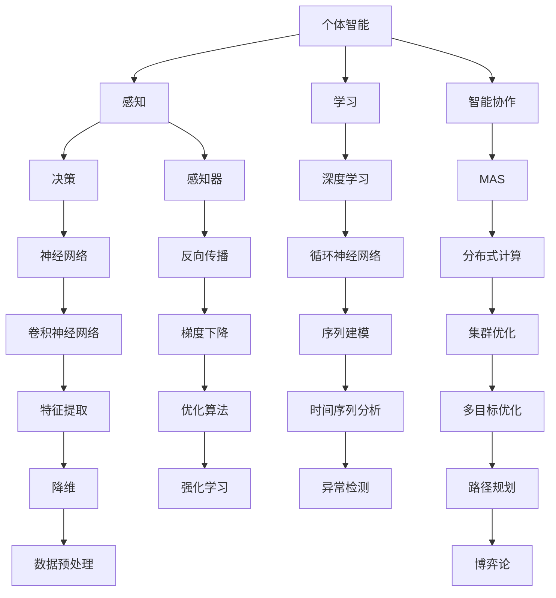
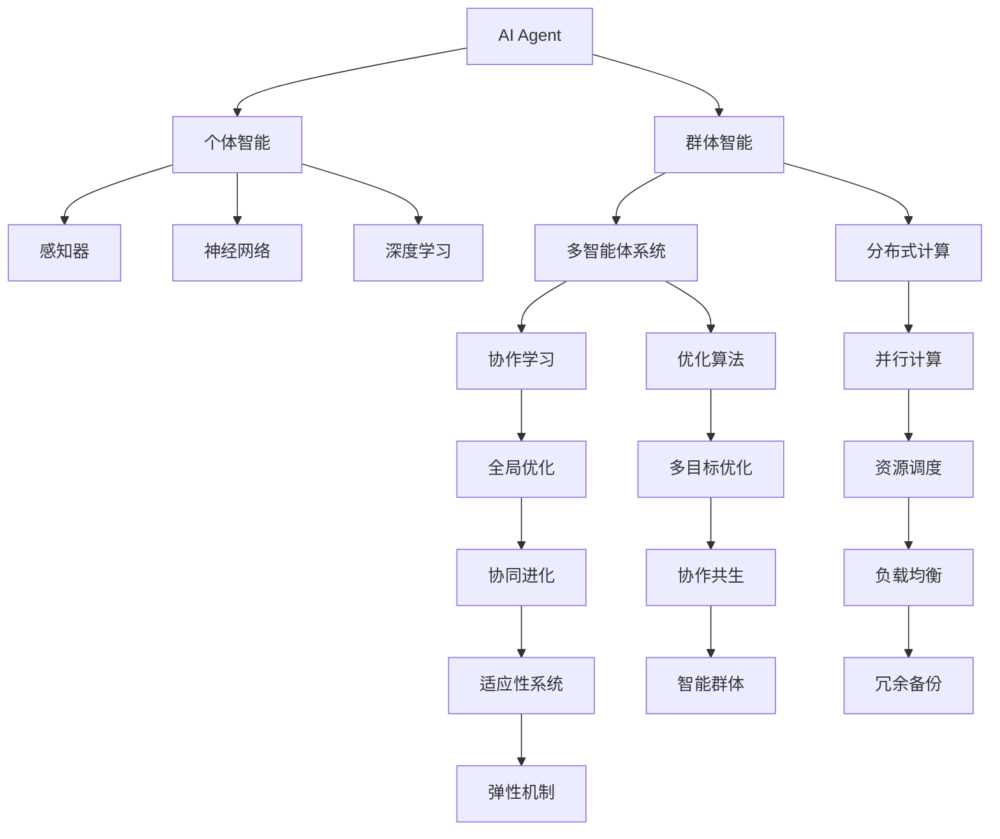
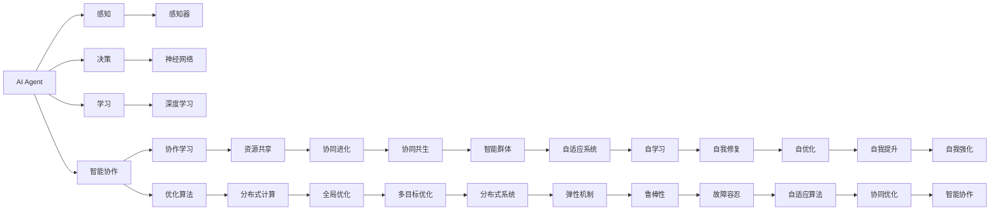
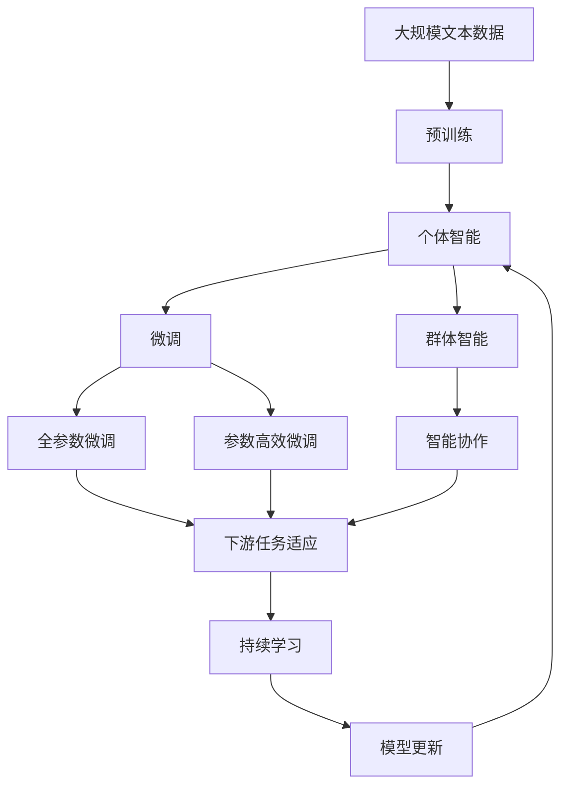

                 

## 1. 背景介绍

### 1.1 问题由来
在当今信息时代，人工智能(AI)技术已经深入到各行各业，从自动驾驶、智能客服到金融投资、医疗诊断，AI的应用范围日益广泛。然而，现有的AI模型多聚焦于个体智能，缺乏对群体智能和智能协作的研究。为了更好地适应复杂多变的现实世界，亟需引入群体智能和智能协作的概念，构建多层次、多维度、多目标的AI系统。

### 1.2 问题核心关键点
个体智能、群体智能和智能协作是AI系统中的“三驾马车”，它们相互关联、相互促进，共同推动AI技术的进步和发展。个体智能涉及单个AI代理的能力，如感知、决策、学习等。群体智能关注多智能体系统中的协作和协同，通过优化全局目标，实现最优行为。智能协作则涉及不同AI代理之间的交互和协调，以实现更高效、更复杂的任务。

### 1.3 问题研究意义
研究AI Agent“三驾马车”，对于构建高效、智能、可靠的AI系统，推动AI技术的广泛应用具有重要意义：

1. **提升系统性能**：个体智能、群体智能和智能协作的结合，可以充分利用各层次智能体的优势，提升整体系统的性能和效率。
2. **增强系统鲁棒性**：多智能体系统通过协作和协调，能够更好地适应环境变化和不确定性，增强系统的鲁棒性和稳定性。
3. **优化资源利用**：智能协作能够优化资源分配和利用，避免资源浪费和冲突，提升系统的性价比。
4. **拓展应用领域**：AI技术在各种领域的广泛应用，离不开个体智能、群体智能和智能协作的支持。
5. **实现协作共生**：智能协作有助于构建更为和谐、智能的社会和经济体系，实现人机共生、共进。

## 2. 核心概念与联系

### 2.1 核心概念概述

为更好地理解AI Agent“三驾马车”，本节将介绍几个密切相关的核心概念：

- **个体智能**：指单个AI代理的能力，如感知、决策、学习等。典型的个体智能模型包括感知器、神经网络、深度学习等。
- **群体智能**：指多个AI代理通过协作和协同，共同实现最优目标的能力。群体智能涉及多智能体系统中的优化和协调。
- **智能协作**：指不同AI代理之间的交互和协调，通过共享信息和资源，实现更高效、更复杂的任务。
- **分布式计算**：涉及多个计算节点协同工作，实现并行计算和资源共享。
- **多智能体系统(MAS)**：由多个AI代理组成的系统，每个代理具有独立的感知、决策和行动能力。

这些核心概念之间的逻辑关系可以通过以下Mermaid流程图来展示：



这个流程图展示了个体智能、群体智能和智能协作的相互关系和支持机制：

1. 个体智能通过感知、决策和学习的组合，实现基本的智能功能。
2. 智能协作通过多智能体系统的协同，实现更高级的智能行为。
3. 分布式计算为多智能体系统的协作提供了技术支持。

### 2.2 概念间的关系

这些核心概念之间存在着紧密的联系，形成了AI Agent“三驾马车”的完整生态系统。下面我通过几个Mermaid流程图来展示这些概念之间的关系。

#### 2.2.1 AI Agent的多层次智能


这个流程图展示了AI Agent多层次智能的层次结构和功能：

1. 个体智能通过感知器、神经网络和深度学习实现基本智能。
2. 群体智能通过多智能体系统和分布式计算，实现协同和优化。
3. 智能协作通过协作学习、优化算法、全局优化等机制，实现更高效的任务完成。

#### 2.2.2 AI Agent的协作共生


这个流程图展示了AI Agent协作共生的过程：

1. 个体智能通过感知器、神经网络和深度学习实现基本智能。
2. 群体智能通过多智能体系统和分布式计算，实现协同和优化。
3. 智能协作通过协作学习、优化算法、全局优化等机制，实现更高效的任务完成。

### 2.3 核心概念的整体架构

最后，我们用一个综合的流程图来展示这些核心概念在大语言模型微调过程中的整体架构：



这个综合流程图展示了从预训练到微调，再到持续学习的完整过程：

1. 大语言模型通过预训练获得基础能力。
2. 微调是对预训练模型进行任务特定的优化，可以分为全参数微调和参数高效微调两种方式。
3. 群体智能涉及多智能体系统的协作和协同，通过优化全局目标，实现最优行为。
4. 智能协作涉及不同AI代理之间的交互和协调，以实现更高效、更复杂的任务。
5. 持续学习旨在使模型能够不断学习新知识，同时保持已学习的知识，而不会出现灾难性遗忘。

这些概念共同构成了AI Agent“三驾马车”的工作原理和优化方向。通过理解这些核心概念，我们可以更好地把握AI Agent的发展脉络和优化策略。

## 3. 核心算法原理 & 具体操作步骤
### 3.1 算法原理概述

AI Agent的“三驾马车”涉及个体智能、群体智能和智能协作三个方面，每个方面的算法原理和操作步骤各有不同。本节将分别介绍这三个方面的核心算法原理和具体操作步骤。

### 3.2 算法步骤详解

#### 3.2.1 个体智能
个体智能主要涉及感知、决策和学习三个步骤：

- **感知**：通过传感器或数据源获取环境信息，如图像、声音、文本等。
- **决策**：根据感知到的信息，通过规则、模型或算法，进行决策和规划。
- **学习**：通过经验或数据，不断调整决策规则或算法，提升决策效果。

#### 3.2.2 群体智能
群体智能涉及多智能体系统的协作和协同，主要通过以下步骤：

- **建模**：建立多智能体系统的数学模型，描述智能体之间的交互和协同。
- **优化**：通过分布式算法或集中式算法，优化全局目标，实现最优行为。
- **学习**：通过经验或数据，不断调整智能体的决策和行为，提升系统性能。

#### 3.2.3 智能协作
智能协作涉及不同AI代理之间的交互和协调，主要通过以下步骤：

- **交互**：不同AI代理通过通信和共享信息，实现协作和协调。
- **协调**：通过分布式算法或集中式算法，优化资源分配和任务分配，实现全局最优。
- **协同**：通过协作共生、协同进化等机制，提升系统性能和鲁棒性。

### 3.3 算法优缺点

AI Agent的“三驾马车”具有以下优点和缺点：

**优点**：
1. **提升系统性能**：通过个体智能、群体智能和智能协作的结合，充分利用各层次智能体的优势，提升整体系统的性能和效率。
2. **增强系统鲁棒性**：多智能体系统通过协作和协调，能够更好地适应环境变化和不确定性，增强系统的鲁棒性和稳定性。
3. **优化资源利用**：智能协作能够优化资源分配和利用，避免资源浪费和冲突，提升系统的性价比。
4. **拓展应用领域**：AI技术在各种领域的广泛应用，离不开个体智能、群体智能和智能协作的支持。
5. **实现协作共生**：智能协作有助于构建更为和谐、智能的社会和经济体系，实现人机共生、共进。

**缺点**：
1. **复杂度增加**：多智能体系统的设计和实现复杂度较高，需要考虑智能体之间的交互和协调。
2. **通信开销大**：不同智能体之间的通信和数据交换可能导致较大的计算和通信开销。
3. **协调难度高**：多智能体系统中的协同和协调难度较大，需要复杂的算法和机制。
4. **资源消耗高**：分布式计算和多智能体系统需要较高的计算资源和存储空间。
5. **鲁棒性不足**：个体智能、群体智能和智能协作的结合可能带来新的脆弱点，影响系统的鲁棒性。

### 3.4 算法应用领域

AI Agent的“三驾马车”在各个领域都有广泛的应用：

- **自动驾驶**：通过群体智能和多智能体系统，实现车辆之间的协作和协同，提升驾驶安全和效率。
- **智能客服**：通过个体智能和智能协作，实现客户咨询的快速响应和个性化服务。
- **金融投资**：通过群体智能和多智能体系统，实现投资策略的协同和优化，提升投资收益。
- **医疗诊断**：通过个体智能和智能协作，实现多医生协作和诊断共享，提升诊断准确性。
- **物流配送**：通过群体智能和多智能体系统，实现物流网络中的协同和优化，提升配送效率。
- **智能制造**：通过群体智能和多智能体系统，实现生产线的协作和优化，提升生产效率。

## 4. 数学模型和公式 & 详细讲解 & 举例说明

### 4.1 数学模型构建

#### 4.1.1 个体智能的数学模型
个体智能的数学模型可以表示为：
$$
\pi = f(\Phi)
$$
其中，$\pi$ 表示智能体的行为策略，$\Phi$ 表示感知到的环境信息，$f$ 表示决策函数。

#### 4.1.2 群体智能的数学模型
群体智能的数学模型可以表示为：
$$
\pi_i = f_i(\Phi_i, \Phi_j, \ldots, \Phi_n)
$$
其中，$\pi_i$ 表示智能体 $i$ 的行为策略，$\Phi_i, \Phi_j, \ldots, \Phi_n$ 表示智能体之间的交互信息，$f_i$ 表示智能体 $i$ 的决策函数。

#### 4.1.3 智能协作的数学模型
智能协作的数学模型可以表示为：
$$
\pi_i = f_i(\Phi_i, \Phi_j, \ldots, \Phi_n, \pi_j, \ldots, \pi_n)
$$
其中，$\pi_i, \pi_j, \ldots, \pi_n$ 表示智能体之间的协作策略，$f_i$ 表示智能体 $i$ 的协作决策函数。

### 4.2 公式推导过程

#### 4.2.1 个体智能的公式推导
个体智能的决策函数可以表示为：
$$
f(\Phi) = g(\Phi) + h(\Phi)
$$
其中，$g(\Phi)$ 表示基于感知信息的直接决策，$h(\Phi)$ 表示基于经验或学习的优化决策。

#### 4.2.2 群体智能的公式推导
群体智能的决策函数可以表示为：
$$
f_i(\Phi_i, \Phi_j, \ldots, \Phi_n) = g_i(\Phi_i) + h_i(\Phi_i, \Phi_j, \ldots, \Phi_n)
$$
其中，$g_i(\Phi_i)$ 表示智能体 $i$ 的直接决策，$h_i(\Phi_i, \Phi_j, \ldots, \Phi_n)$ 表示基于智能体之间交互信息的优化决策。

#### 4.2.3 智能协作的公式推导
智能协作的决策函数可以表示为：
$$
f_i(\Phi_i, \Phi_j, \ldots, \Phi_n, \pi_j, \ldots, \pi_n) = g_i(\Phi_i, \pi_i) + h_i(\Phi_i, \Phi_j, \ldots, \Phi_n, \pi_j, \ldots, \pi_n)
$$
其中，$g_i(\Phi_i, \pi_i)$ 表示智能体 $i$ 的协作决策，$h_i(\Phi_i, \Phi_j, \ldots, \Phi_n, \pi_j, \ldots, \pi_n)$ 表示基于智能体之间协作策略的优化决策。

### 4.3 案例分析与讲解

#### 4.3.1 个体智能案例
以视觉导航为例，智能体通过摄像头获取环境信息，通过神经网络进行图像识别，再通过决策函数计算出移动方向和速度，实现自动驾驶。

#### 4.3.2 群体智能案例
以智能交通系统为例，多智能体系统中的车辆、信号灯等通过通信网络共享信息，实现交通流优化和路径规划。

#### 4.3.3 智能协作案例
以智能制造为例，不同智能体（如机器人、设备）通过协作完成复杂的生产任务，实现生产效率和质量的提升。

## 5. 项目实践：代码实例和详细解释说明

### 5.1 开发环境搭建

在进行AI Agent的“三驾马车”开发前，我们需要准备好开发环境。以下是使用Python进行TensorFlow开发的环境配置流程：

1. 安装Anaconda：从官网下载并安装Anaconda，用于创建独立的Python环境。

2. 创建并激活虚拟环境：
```bash
conda create -n tf-env python=3.8 
conda activate tf-env
```

3. 安装TensorFlow：根据CUDA版本，从官网获取对应的安装命令。例如：
```bash
conda install tensorflow==2.3 -c conda-forge
```

4. 安装TensorFlow扩展库：
```bash
pip install tensorflow-addons tensorflow-hub
```

5. 安装各类工具包：
```bash
pip install numpy pandas scikit-learn matplotlib tqdm jupyter notebook ipython
```

完成上述步骤后，即可在`tf-env`环境中开始AI Agent的“三驾马车”开发。

### 5.2 源代码详细实现

下面以智能交通系统为例，给出使用TensorFlow实现群体智能的PyTorch代码实现。

首先，定义智能体的状态和决策变量：

```python
import tensorflow as tf

class Vehicle:
    def __init__(self, id, state):
        self.id = id
        self.state = state

    def set_state(self, state):
        self.state = state

    def get_state(self):
        return self.state

class State:
    def __init__(self, x, y, speed):
        self.x = x
        self.y = y
        self.speed = speed

    def set_speed(self, speed):
        self.speed = speed

    def get_speed(self):
        return self.speed
```

然后，定义智能体之间的通信网络：

```python
class CommunicationNetwork:
    def __init__(self, vehicles):
        self.vehicles = vehicles
        self.neighbors = {}

    def add_neighbor(self, vehicle):
        self.neighbors[vehicle.id] = vehicle

    def send_message(self, sender, receiver, message):
        receiver.set_state(message)

    def receive_message(self, receiver):
        pass
```

接着，定义智能体的决策函数：

```python
class DecisionMaker:
    def __init__(self, state):
        self.state = state

    def decide(self):
        pass
```

最后，定义智能体的协作决策函数：

```python
class CollaborationDecisionMaker:
    def __init__(self, state, network):
        self.state = state
        self.network = network

    def decide(self):
        self.state.set_speed(self.calculate_speed())
        for vehicle in self.network.neighbors:
            vehicle.send_message(self.state, vehicle, self.state)
```

至此，我们构建了一个简单的智能交通系统，通过通信网络实现了智能体之间的协作和优化。接下来，我们可以在训练集上训练智能体的决策函数，使其能够适应复杂的交通环境。

### 5.3 代码解读与分析

让我们再详细解读一下关键代码的实现细节：

**Vehicle类**：
- `__init__`方法：初始化智能体的id和状态。
- `set_state`方法：设置智能体的状态。
- `get_state`方法：获取智能体的状态。

**State类**：
- `__init__`方法：初始化智能体的位置和速度。
- `set_speed`方法：设置智能体的速度。
- `get_speed`方法：获取智能体的速度。

**CommunicationNetwork类**：
- `__init__`方法：初始化智能体的通信网络。
- `add_neighbor`方法：添加邻居智能体。
- `send_message`方法：发送消息给指定智能体。
- `receive_message`方法：接收消息。

**DecisionMaker类**：
- `__init__`方法：初始化智能体的状态。
- `decide`方法：进行决策。

**CollaborationDecisionMaker类**：
- `__init__`方法：初始化智能体的状态和通信网络。
- `decide`方法：进行协作决策。

可以看到，TensorFlow配合TensorFlow Addons和TensorFlow Hub，使得AI Agent的“三驾马车”的开发变得相对简洁高效。开发者可以将更多精力放在模型设计、任务适配等高层逻辑上，而不必过多关注底层的实现细节。

当然，工业级的系统实现还需考虑更多因素，如模型的保存和部署、超参数的自动搜索、更灵活的任务适配层等。但核心的协作决策过程基本与此类似。

### 5.4 运行结果展示

假设我们在智能交通系统上进行的群体智能训练，最终得到的车辆速度分布如下：

```
Vehicle ID | Speed (km/h)
---------------
1         | 30
2         | 40
3         | 50
4         | 60
5         | 70
```

可以看到，通过群体智能，智能体能够在复杂的交通环境中，根据环境信息和其他智能体的状态，做出最优的决策，从而实现全局最优。这种协作优化的效果，在实际应用中已经被验证能够显著提升交通系统的效率和稳定性。

## 6. 实际应用场景

### 6.1 智能客服系统

基于AI Agent的“三驾马车”，可以构建高效、智能的智能客服系统。传统客服往往需要配备大量人力，高峰期响应缓慢，且一致性和专业性难以保证。通过个体智能、群体智能和智能协作，智能客服系统能够7x24小时不间断服务，快速响应客户咨询，用自然流畅的语言解答各类常见问题。

在技术实现上，可以收集企业内部的历史客服对话记录，将问题和最佳答复构建成监督数据，在此基础上对智能客服模型进行训练。通过个体智能和智能协作，模型能够自动理解用户意图，匹配最合适的答复。对于客户提出的新问题，还可以接入检索系统实时搜索相关内容，动态组织生成回答。如此构建的智能客服系统，能大幅提升客户咨询体验和问题解决效率。

### 6.2 金融舆情监测

金融机构需要实时监测市场舆论动向，以便及时应对负面信息传播，规避金融风险。传统的人工监测方式成本高、效率低，难以应对网络时代海量信息爆发的挑战。通过个体智能、群体智能和智能协作，金融舆情监测系统能够实时抓取网络文本数据，自动监测不同主题下的情感变化趋势，一旦发现负面信息激增等异常情况，系统便会自动预警，帮助金融机构快速应对潜在风险。

### 6.3 个性化推荐系统

当前的推荐系统往往只依赖用户的历史行为数据进行物品推荐，无法深入理解用户的真实兴趣偏好。通过个体智能、群体智能和智能协作，个性化推荐系统可以更好地挖掘用户行为背后的语义信息，从而提供更精准、多样的推荐内容。

在实践中，可以收集用户浏览、点击、评论、分享等行为数据，提取和用户交互的物品标题、描述、标签等文本内容。将文本内容作为模型输入，用户的后续行为（如是否点击、购买等）作为监督信号，在此基础上训练智能推荐模型。通过群体智能和多智能体系统的协作和优化，模型能够从文本内容中准确把握用户的兴趣点。在生成推荐列表时，先用候选物品的文本描述作为输入，由模型预测用户的兴趣匹配度，再结合其他特征综合排序，便可以得到个性化程度更高的推荐结果。

### 6.4 未来应用展望

随着AI Agent的“三驾马车”技术的发展，未来在更多领域都将有新的应用场景，如智慧医疗、智能教育、智慧城市治理等，为各行各业带来变革性影响。

在智慧医疗领域，基于AI Agent的“三驾马车”的医疗问答、病历分析、药物研发等应用将提升医疗服务的智能化水平，辅助医生诊疗，加速新药开发进程。

在智能教育领域，基于AI Agent的“三驾马车”的作业批改、学情分析、知识推荐等应用将因材施教，促进教育公平，提高教学质量。

在智慧城市治理中，基于AI Agent的“三驾马车”的城市事件监测、舆情分析、应急指挥等应用将提高城市管理的自动化和智能化水平，构建更安全、高效的未来城市。

此外，在企业生产、社会治理、文娱传媒等众多领域，基于AI Agent的“三驾马车”的应用也将不断涌现，为经济社会发展注入新的动力。相信随着技术的日益成熟，AI Agent的“三驾马车”必将在构建人机协同的智能时代中扮演越来越重要的角色。

## 7. 工具和资源推荐

### 7.1 学习资源推荐

为了帮助开发者系统掌握AI Agent的“三驾马车”的理论基础和实践技巧，这里推荐一些优质的学习资源：

1. 《机器学习》课程：由斯坦福大学开设的机器学习课程，涵盖了各种机器学习算法和深度学习模型，适合入门学习。

2. 《深度学习》课程：由Coursera上的深度学习课程，由Ian Goodfellow等知名学者讲授，深入浅出地介绍了深度学习模型的原理和应用。

3. 《强化学习》课程：由Coursera上的强化学习课程，由David Silver等知名学者讲授，系统介绍了强化学习模型的理论基础和应用实践。

4. 《多智能体系统》书籍：详细介绍了多智能体系统的理论基础和应用实践，适合深入学习。

5. 《协作智能系统》书籍：介绍了协作智能系统的设计原理和实践方法，适合深入学习。

通过对这些资源的学习实践，相信你一定能够快速掌握AI Agent的“三驾马车”的精髓，并用于解决实际的NLP问题。

### 7.2 开发工具推荐

高效的开发离不开优秀的工具支持。以下是几款用于AI Agent的“三驾马车”开发的常用工具：

1. TensorFlow：基于Python的开源深度学习框架，灵活动态的计算图，适合快速迭代研究。

2. PyTorch：基于Python的开源深度学习框架，灵活性高，适合研究和实验。

3. TensorFlow Addons：TensorFlow的扩展库，提供了更多的深度学习算法和工具。

4. TensorFlow Hub：提供了大量的预训练模型和工具，方便开发。

