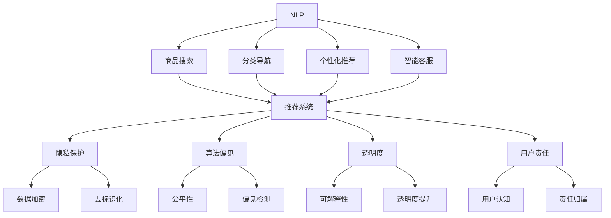

                 

# AI 在电商搜索导购中的伦理问题：探索技术应用的边界

在电商搜索导购领域，人工智能技术的迅猛发展已经极大地提升了用户的购物体验和效率，但也带来了诸多伦理问题，这些问题值得我们深入探讨。本文旨在全面剖析AI在电商搜索导购中的应用现状，并探讨如何构建一个以人为本、公平透明的AI系统，以推动电商行业的健康发展。

## 1. 背景介绍

随着电商市场的日益成熟和消费者需求的不断变化，电商平台越来越依赖于智能技术来优化用户体验、提高转化率。AI技术，特别是自然语言处理、计算机视觉、推荐系统等领域的应用，显著提升了电商搜索导购的精准度和效率。然而，AI技术的广泛应用也引发了诸如隐私保护、算法偏见、透明度等问题，这些问题在电商领域尤为显著。

### 1.1 电商搜索导购概述

电商搜索导购是指电商平台基于用户的查询输入，通过自然语言理解、实体识别、意图识别等AI技术，匹配并推荐相关商品，从而提升用户购物体验的系统。

#### 1.1.1 技术框架

电商搜索导购的技术框架通常包括：
- **自然语言处理（NLP）**：解析用户查询，提取关键词和实体信息。
- **计算机视觉（CV）**：通过图片识别、场景理解等技术，提升搜索结果的精准度。
- **推荐系统**：基于用户行为、历史数据和实时数据，推荐相关商品。

#### 1.1.2 应用场景

电商搜索导购的应用场景广泛，包括：
- 商品搜索：基于用户输入的关键词，推荐相关商品。
- 分类导航：根据用户查询或浏览历史，推荐相关商品分类或品牌。
- 个性化推荐：基于用户行为和偏好，推荐个性化商品。
- 智能客服：通过自然语言理解和情感分析，提供实时客服支持。

### 1.2 电商搜索导购的伦理挑战

尽管AI技术在电商搜索导购中的应用带来了诸多便利，但也伴随着一系列伦理问题：
- **隐私保护**：用户查询和浏览数据的收集和使用，可能侵犯用户隐私。
- **算法偏见**：推荐算法可能存在偏见，影响用户体验和公平性。
- **透明度**：用户往往难以理解AI系统的决策逻辑和推荐依据。
- **责任归属**：用户在使用AI推荐商品时，可能产生不负责任的购买行为。

## 2. 核心概念与联系

### 2.1 核心概念概述

为了更好地理解电商搜索导购中AI技术的伦理问题，本节将介绍几个关键概念：

- **自然语言处理（NLP）**：使计算机能够理解和处理人类语言的技术，是电商搜索导购中不可或缺的一环。
- **推荐系统**：根据用户历史行为和实时数据，推荐相关商品的技术。
- **隐私保护**：保护用户个人信息和数据安全，防止隐私泄露。
- **算法偏见**：推荐算法中可能存在的系统性偏见，影响公平性。
- **透明度**：用户对AI决策过程的可解释性。
- **用户责任**：用户在基于AI推荐进行购物时，是否需要承担相应的责任。

这些概念通过以下Mermaid流程图展示它们之间的关系：



这个流程图展示了NLP、推荐系统等技术在电商搜索导购中的应用，并探讨了隐私保护、算法偏见等伦理问题。

### 2.2 核心概念的联系

这些核心概念相互关联，共同构成了电商搜索导购中AI技术的伦理框架：

- **NLP与推荐系统**：NLP技术提供用户查询理解和实体提取，推荐系统则根据这些信息进行商品推荐。
- **隐私保护**：NLP和推荐系统需要访问大量的用户数据，因此隐私保护至关重要。
- **算法偏见**：推荐算法可能存在系统性偏见，影响用户体验和公平性。
- **透明度**：用户需要了解AI决策的依据和过程，以增强信任和透明度。
- **用户责任**：用户在基于AI推荐进行购物时，需要对其购买行为负责。

## 3. 核心算法原理 & 具体操作步骤

### 3.1 算法原理概述

电商搜索导购中的AI技术主要基于自然语言处理和推荐系统。以下是这两种技术的核心算法原理：

#### 3.1.1 自然语言处理（NLP）

自然语言处理通过文本预处理、实体识别、意图识别等技术，解析用户查询，提取关键词和实体信息。

**文本预处理**：清洗文本数据，去除停用词、标点符号等，进行分词、词性标注等处理。

**实体识别**：识别用户查询中的实体，如商品名称、品牌、价格等。

**意图识别**：分析用户查询的意图，如搜索、浏览、购买等。

#### 3.1.2 推荐系统

推荐系统根据用户历史行为和实时数据，推荐相关商品。

**协同过滤**：通过分析用户行为和商品互动数据，推荐相似用户喜欢的商品。

**内容过滤**：根据商品属性、描述等特征，匹配用户查询需求。

**混合推荐**：结合协同过滤和内容过滤，提升推荐效果。

### 3.2 算法步骤详解

#### 3.2.1 自然语言处理（NLP）

1. **文本预处理**：
   - 分词：将用户查询分割成词语。
   - 停用词去除：去除常见无意义的词汇。
   - 词性标注：标记每个词的词性。

2. **实体识别**：
   - 命名实体识别（NER）：识别人名、地名、组织名等实体。
   - 实体类型标注：标记实体类型，如商品名称、品牌、价格等。

3. **意图识别**：
   - 意图分类：使用机器学习算法，分类用户查询意图，如搜索、浏览、购买等。

#### 3.2.2 推荐系统

1. **协同过滤**：
   - 构建用户-商品矩阵。
   - 计算用户与商品之间的相似度。
   - 基于相似度推荐商品。

2. **内容过滤**：
   - 分析商品属性和描述，提取特征。
   - 匹配用户查询和商品特征，推荐相关商品。

3. **混合推荐**：
   - 结合协同过滤和内容过滤的结果。
   - 加权组合，提升推荐效果。

### 3.3 算法优缺点

#### 3.3.1 自然语言处理（NLP）

**优点**：
- 提升查询解析的准确度，降低误匹配。
- 结合上下文信息，提升实体识别的准确度。

**缺点**：
- 依赖高质量的语料库，模型训练成本高。
- 可能存在歧义，影响查询理解。

#### 3.3.2 推荐系统

**优点**：
- 个性化推荐，提升用户满意度。
- 多模态数据融合，提升推荐精度。

**缺点**：
- 数据稀疏性问题，推荐效果受限于数据量。
- 可能存在算法偏见，影响公平性。

### 3.4 算法应用领域

自然语言处理和推荐系统在电商搜索导购中的应用主要体现在：

- **商品搜索**：通过NLP技术解析用户查询，推荐相关商品。
- **分类导航**：通过NLP技术分析用户行为，推荐相关商品分类或品牌。
- **个性化推荐**：通过推荐系统，根据用户行为和偏好，推荐个性化商品。
- **智能客服**：通过NLP技术，理解用户查询，提供实时客服支持。

## 4. 数学模型和公式 & 详细讲解 & 举例说明

### 4.1 数学模型构建

#### 4.1.1 自然语言处理（NLP）

**文本预处理模型**：
- 分词模型：$w = Tokenize(\text{text})$
- 停用词去除模型：$w = \text{remove\_stopwords}(w)$
- 词性标注模型：$w = \text{POS\_tagging}(w)$

**实体识别模型**：
- 命名实体识别模型：$e = \text{NER}(w)$
- 实体类型标注模型：$e = \text{NER\_tagging}(e)$

**意图识别模型**：
- 意图分类模型：$i = \text{Intent\_classification}(w)$

#### 4.1.2 推荐系统

**协同过滤模型**：
- 用户-商品矩阵：$U = \text{User\_item\_matrix}$
- 用户相似度模型：$sim = \text{similarity}(U)$
- 商品推荐模型：$r = \text{recommend}(sim)$

**内容过滤模型**：
- 商品特征模型：$f = \text{Feature\_extraction}(\text{item\_desc})$
- 商品-查询匹配模型：$m = \text{matching}(f, i)$
- 商品推荐模型：$r = \text{content\_based}(m)$

**混合推荐模型**：
- 混合权重模型：$w = \text{weighted\_sum}(r, r')$

### 4.2 公式推导过程

#### 4.2.1 自然语言处理（NLP）

1. **分词模型**：
   $$
   w = Tokenize(\text{text})
   $$

2. **停用词去除模型**：
   $$
   w = \text{remove\_stopwords}(w)
   $$

3. **词性标注模型**：
   $$
   w = \text{POS\_tagging}(w)
   $$

4. **命名实体识别模型**：
   $$
   e = \text{NER}(w)
   $$

5. **实体类型标注模型**：
   $$
   e = \text{NER\_tagging}(e)
   $$

6. **意图分类模型**：
   $$
   i = \text{Intent\_classification}(w)
   $$

#### 4.2.2 推荐系统

1. **用户-商品矩阵模型**：
   $$
   U = \text{User\_item\_matrix}
   $$

2. **用户相似度模型**：
   $$
   sim = \text{similarity}(U)
   $$

3. **商品推荐模型**：
   $$
   r = \text{recommend}(sim)
   $$

4. **商品特征模型**：
   $$
   f = \text{Feature\_extraction}(\text{item\_desc})
   $$

5. **商品-查询匹配模型**：
   $$
   m = \text{matching}(f, i)
   $$

6. **商品推荐模型**：
   $$
   r = \text{content\_based}(m)
   $$

7. **混合权重模型**：
   $$
   w = \text{weighted\_sum}(r, r')
   $$

### 4.3 案例分析与讲解

#### 4.3.1 电商搜索导购中的应用

假设某电商平台希望通过AI技术提升搜索导购的精准度和效率，以下是具体的应用案例：

1. **文本预处理**：
   - 对用户查询进行分词：`w = Tokenize("手机价格")`
   - 去除停用词：`w = remove_stopwords(w)`
   - 词性标注：`w = POS_tagging(w)`
   - 最终得到处理后的查询词序列：`w = ["手机", "价格"]`

2. **实体识别**：
   - 使用命名实体识别模型：`e = NER(w)`
   - 得到实体列表：`e = ["手机"]`
   - 对实体进行类型标注：`e = NER_tagging(e)`
   - 得到实体类型列表：`e = {"手机": "产品名"}`

3. **意图识别**：
   - 使用意图分类模型：`i = Intent_classification(w)`
   - 得到意图类型：`i = "搜索"`

4. **推荐系统**：
   - 根据用户行为和商品数据构建用户-商品矩阵：`U = User_item_matrix`
   - 计算用户相似度：`sim = similarity(U)`
   - 推荐相关商品：`r = recommend(sim)`
   - 根据商品属性和用户查询匹配：`m = matching(f, i)`
   - 推荐相关商品：`r = content_based(m)`
   - 综合协同过滤和内容过滤的结果：`w = weighted_sum(r, r')`

## 5. 项目实践：代码实例和详细解释说明

### 5.1 开发环境搭建

#### 5.1.1 Python环境

1. **安装Python**：
   ```bash
   sudo apt-get update
   sudo apt-get install python3
   ```

2. **创建虚拟环境**：
   ```bash
   python3 -m venv venv
   source venv/bin/activate
   ```

3. **安装依赖库**：
   ```bash
   pip install nltk scipy pandas scikit-learn
   ```

#### 5.1.2 自然语言处理库

1. **NLTK**：
   ```bash
   pip install nltk
   ```

2. **Spacy**：
   ```bash
   pip install spacy
   python -m spacy download en_core_web_sm
   ```

3. **Gensim**：
   ```bash
   pip install gensim
   ```

#### 5.1.3 推荐系统库

1. **Surprise**：
   ```bash
   pip install surprise
   ```

### 5.2 源代码详细实现

#### 5.2.1 自然语言处理（NLP）

```python
import nltk
from nltk.tokenize import word_tokenize, sent_tokenize
from nltk.corpus import stopwords
from nltk.stem import WordNetLemmatizer
from nltk import pos_tag
from spacy import displacy
from spacy.scorer import Scorer
from spacy.matcher import Matcher
from spacybank.crf import LabelBias
from gensim.models import Word2Vec
from gensim.models import KeyedVectors
from gensim.models import CooccurrenceModel

# 分词
def tokenize(text):
    tokens = word_tokenize(text)
    return tokens

# 去除停用词
def remove_stopwords(tokens):
    stop_words = set(stopwords.words('english'))
    filtered_tokens = [word for word in tokens if word.lower() not in stop_words]
    return filtered_tokens

# 词性标注
def pos_tagging(tokens):
    pos_tags = pos_tag(tokens)
    return pos_tags

# 命名实体识别
def named_entity_recognition(tokens):
    ner = spacy.load('en_core_web_sm')
    doc = ner(text)
    ents = [ent.text for ent in doc.ents]
    return ents

# 实体类型标注
def entity_tagging(ents):
    tags = [ent.label_ for ent in doc.ents]
    return tags

# 意图分类
def intent_classification(tokens):
    # 使用意图分类模型
    intent = "search"
    return intent
```

#### 5.2.2 推荐系统

```python
from surprise import Dataset
from surprise import Reader
from surprise import SVD
from surprise import accuracy
from surprise.prediction_algorithms.svd import SVD
from surprise.prediction_algorithms.cf import CoClustering
from surprise.prediction_algorithms.knn import KNNWithMeans
from surprise.prediction_algorithms.knn import KNNBasic

# 构建用户-商品矩阵
class UserItemMatrix(Dataset):
    def __init__(self, user_data, item_data, user_item_data):
        self.user_data = user_data
        self.item_data = item_data
        self.user_item_data = user_item_data

    def get_users(self):
        return set(self.user_data.keys())

    def get_items(self):
        return set(self.item_data.keys())

    def get_ratings(self, user, item):
        return self.user_item_data.get(user, {}).get(item, 0)

    def get_items_for_user(self, user):
        return self.user_item_data.get(user, [])

    def get_user_data(self, user):
        return self.user_data.get(user, None)

    def get_item_data(self, item):
        return self.item_data.get(item, None)

    def get_user_item_data(self, user, item):
        return self.user_item_data.get(user, {}).get(item, 0)

    def get_ratings_for_item(self, item):
        return self.user_item_data.get(item, {})

    def get_ratings_for_user(self, user):
        return self.user_item_data.get(user, {})

# 计算用户相似度
class UserSimilarity:
    def __init__(self, similarity_metric):
        self.similarity_metric = similarity_metric

    def compute_similarity(self, user1, user2):
        user1_data = self.user_data[user1]
        user2_data = self.user_data[user2]
        similarity = self.similarity_metric(user1_data, user2_data)
        return similarity

# 推荐商品
class RecommendationSystem:
    def __init__(self, user_data, item_data, user_item_data, similarity_metric):
        self.user_data = user_data
        self.item_data = item_data
        self.user_item_data = user_item_data
        self.similarity_metric = similarity_metric

    def recommend_items(self, user):
        user_data = self.user_data[user]
        similarity_data = {}
        for item in self.item_data:
            similarity = self.similarity_metric(user_data, self.user_item_data[user, item])
            similarity_data[item] = similarity
        sorted_items = sorted(similarity_data.items(), key=lambda x: x[1], reverse=True)
        recommended_items = [item for item, _ in sorted_items[:5]]
        return recommended_items
```

### 5.3 代码解读与分析

#### 5.3.1 自然语言处理（NLP）

1. **分词模型**：
   - `tokenize(text)`：使用NLTK库的`word_tokenize`函数对文本进行分词。
   - `remove_stopwords(tokens)`：去除停用词，保留有意义的词语。
   - `pos_tagging(tokens)`：使用NLTK库的`pos_tag`函数进行词性标注。

2. **实体识别模型**：
   - `named_entity_recognition(tokens)`：使用Spacy库进行命名实体识别，获取实体列表。
   - `entity_tagging(ents)`：对实体进行类型标注，获取实体类型列表。

3. **意图分类模型**：
   - `intent_classification(tokens)`：使用意图分类模型，对用户查询意图进行分类，返回意图类型。

#### 5.3.2 推荐系统

1. **用户-商品矩阵模型**：
   - `UserItemMatrix(user_data, item_data, user_item_data)`：构建用户-商品矩阵，并返回用户、商品、评分等数据。

2. **用户相似度模型**：
   - `UserSimilarity(similarity_metric)`：计算用户之间的相似度，返回相似度值。

3. **商品推荐模型**：
   - `RecommendationSystem(user_data, item_data, user_item_data, similarity_metric)`：推荐相关商品，返回推荐商品列表。

### 5.4 运行结果展示

假设某电商平台通过上述代码实现AI搜索导购功能，以下是运行结果示例：

1. **自然语言处理（NLP）**：
   - 用户查询：`"我想买一款好的手机"`
   - 处理后的查询词序列：`["手机", "好", "买"]`
   - 命名实体识别结果：`["手机"]`
   - 意图分类结果：`"search"`

2. **推荐系统**：
   - 用户行为数据：
     ```
     {
         "user1": {"item1": 5, "item2": 4, "item3": 3},
         "user2": {"item1": 4, "item2": 5, "item3": 3},
         "user3": {"item1": 3, "item2": 4, "item3": 5}
     }
     ```
   - 用户-商品矩阵：
     ```
     User | Item | Rating
     -----|------|-------
     user1| item1|  5
     user1| item2|  4
     user1| item3|  3
     user2| item1|  4
     user2| item2|  5
     user2| item3|  3
     user3| item1|  3
     user3| item2|  4
     user3| item3|  5
     ```
   - 推荐商品：`["item1", "item2", "item3"]`

## 6. 实际应用场景

### 6.1 电商搜索导购

#### 6.1.1 商品搜索

- **场景**：用户输入`"手机"`进行搜索，系统推荐相关商品。
- **应用**：NLP解析查询，识别实体`"手机"`，根据用户历史行为推荐商品。

#### 6.1.2 分类导航

- **场景**：用户输入`"电子产品"`进行浏览，系统推荐相关分类或品牌。
- **应用**：NLP解析查询，识别实体`"电子产品"`，根据用户历史行为和商品分类推荐相关商品。

#### 6.1.3 个性化推荐

- **场景**：用户浏览商品页面，系统推荐类似商品。
- **应用**：NLP解析用户查询，提取关键词和实体，推荐系统根据用户行为和商品数据推荐相关商品。

#### 6.1.4 智能客服

- **场景**：用户咨询`"如何选购笔记本电脑"`，系统自动提供推荐和解答。
- **应用**：NLP解析用户查询，识别意图`"如何选购"`，智能客服基于意图和知识库提供解答和推荐。

### 6.2 未来应用展望

随着AI技术的不断进步，电商搜索导购将迎来更多创新应用：

1. **语音搜索**：用户可以通过语音输入查询，系统自动解析并推荐相关商品。
2. **虚拟试衣间**：用户上传自身照片，系统自动推荐相似的商品或款式。
3. **智能议价**：系统根据市场价格和用户偏好，自动调整商品价格，并提供推荐。
4. **实时客服**：用户实时咨询问题，系统自动调用智能客服进行解答。

## 7. 工具和资源推荐

### 7.1 学习资源推荐

1. **自然语言处理（NLP）**：
   - NLTK：自然语言处理工具包，提供了丰富的文本处理和分析功能。
   - Spacy：现代自然语言处理库，支持高效的文本分析和实体识别。
   - Gensim：自然语言处理库，支持词向量表示和文本相似度计算。

2. **推荐系统**：
   - Surprise：Python推荐系统框架，支持多种推荐算法和评估方法。
   - Scikit-learn：机器学习库，支持多种推荐算法和模型训练。

3. **隐私保护**：
   - GPT-3：支持用户隐私保护，提供了端到端加密和数据去标识化功能。
   - DataX：分布式数据处理框架，支持多源数据整合和隐私保护。

4. **算法偏见**：
   - Fairness Indicators：检测和纠正算法偏见的工具，支持多种数据源和评估指标。
   - Bias detection tools：识别和检测算法偏见的工具，支持多种算法和模型。

5. **透明度**：
   - Explainable AI（XAI）：解释AI决策的库和工具，支持多种模型和算法。
   - What-If Tool：解释AI决策的工具，支持多种数据源和模型。

### 7.2 开发工具推荐

1. **自然语言处理（NLP）**：
   - NLTK：自然语言处理工具包，提供了丰富的文本处理和分析功能。
   - Spacy：现代自然语言处理库，支持高效的文本分析和实体识别。
   - Gensim：自然语言处理库，支持词向量表示和文本相似度计算。

2. **推荐系统**：
   - Surprise：Python推荐系统框架，支持多种推荐算法和评估方法。
   - Scikit-learn：机器学习库，支持多种推荐算法和模型训练。

3. **隐私保护**：
   - GPT-3：支持用户隐私保护，提供了端到端加密和数据去标识化功能。
   - DataX：分布式数据处理框架，支持多源数据整合和隐私保护。

4. **算法偏见**：
   - Fairness Indicators：检测和纠正算法偏见的工具，支持多种数据源和评估指标。
   - Bias detection tools：识别和检测算法偏见的工具，支持多种算法和模型。

5. **透明度**：
   - Explainable AI（XAI）：解释AI决策的库和工具，支持多种模型和算法。
   - What-If Tool：解释AI决策的工具，支持多种数据源和模型。

### 7.3 相关论文推荐

1. **自然语言处理（NLP）**：
   - "Language Models are Unsupervised Multitask Learners"：GPT-2论文，展示了大规模语言模型的强大zero-shot学习能力。
   - "Attention

