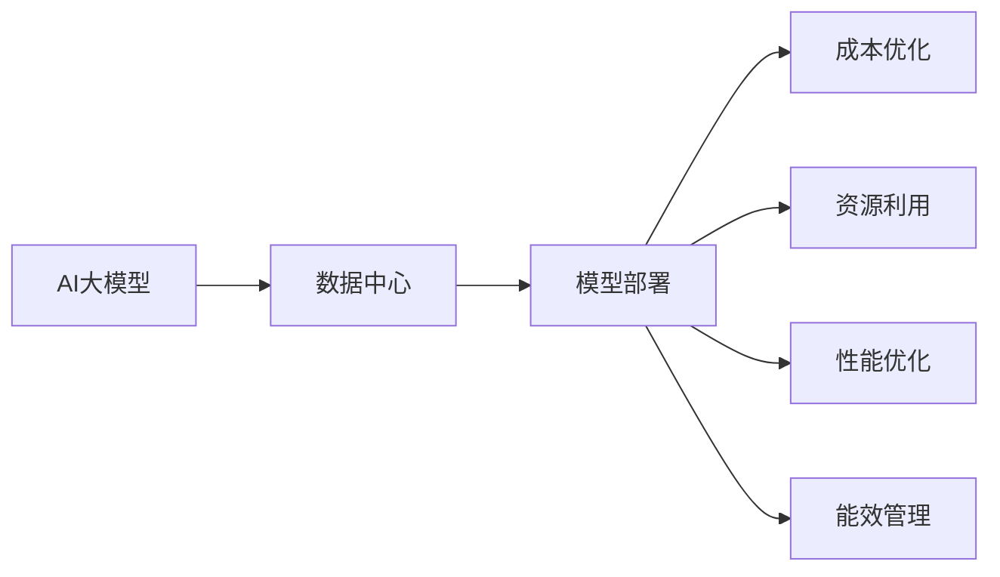
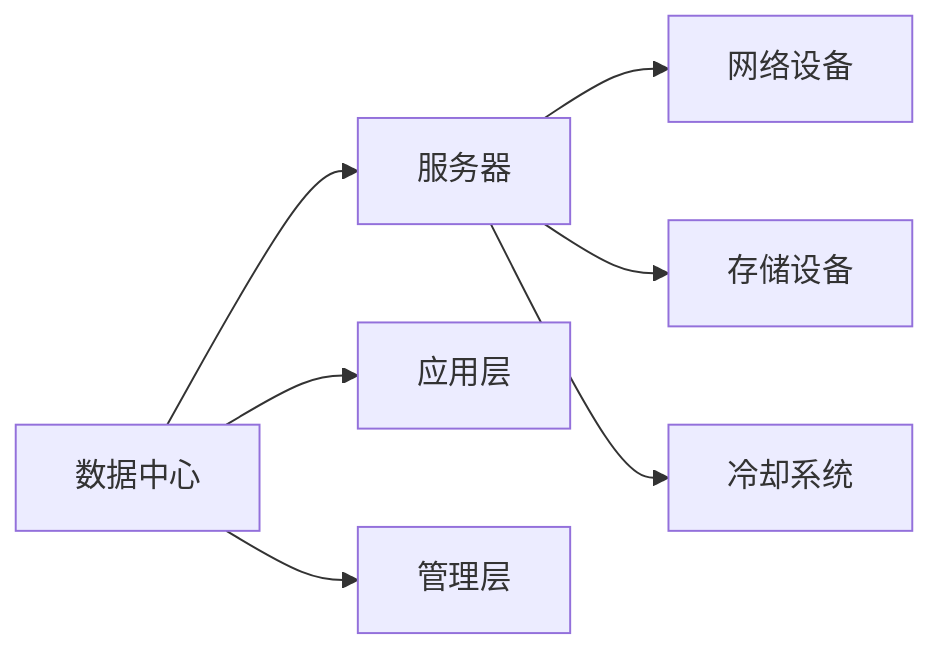

                 

# AI 大模型应用数据中心建设：数据中心成本优化

> 关键词：
1. AI大模型
2. 数据中心建设
3. 成本优化
4. 模型部署
5. 资源利用
6. 性能优化
7. 能效管理

## 1. 背景介绍

随着人工智能(AI)技术的快速发展，大模型在各个行业的应用越来越广泛，从自然语言处理(NLP)到计算机视觉(CV)，再到生物信息学(Bioinformatics)等，几乎涵盖了所有领域。这些大模型通常以大规模训练数据为基础，通过深度学习算法训练而成，具有极高的计算需求和存储需求。

对于AI大模型的应用，数据中心建设是必不可少的环节。数据中心不仅需要满足计算、存储、网络等基础设施需求，还需考虑能效、可扩展性、安全性等方面的要求。如何建设一个既高效又经济的AI大模型数据中心，成为了一个亟需解决的问题。

本文将从大模型应用的角度出发，探讨数据中心的建设策略，并提出一系列成本优化方案。通过合理的架构设计和资源管理，在保证模型性能的同时，最大程度地降低数据中心运营成本。

## 2. 核心概念与联系

### 2.1 核心概念概述

- **AI大模型**：通常指大规模的神经网络模型，如BERT、GPT、Transformer等，这些模型具有庞大的参数量和计算需求，能够处理复杂的数据处理和分析任务。
- **数据中心**：包含计算、存储、网络等资源的物理设施，用于支撑企业或组织的数据存储、处理和分析需求。
- **成本优化**：通过合理的设计和管理，降低数据中心的运营成本，同时提升资源利用率和性能。
- **模型部署**：将训练好的AI大模型部署到数据中心，使其能够进行数据处理和分析。
- **资源利用**：有效地利用数据中心的计算、存储、网络等资源，避免资源浪费。
- **性能优化**：通过优化模型架构、算法和部署策略，提升AI大模型的性能。
- **能效管理**：在满足性能需求的前提下，降低数据中心的能耗，提高资源利用率。

这些概念之间存在着紧密的联系，如图2所示。



大模型的应用离不开数据中心的支持，而成本优化、资源利用、性能优化和能效管理则是建设高效数据中心的关键。只有这些方面协同工作，才能满足大模型的高需求，并实现成本的最小化。

### 2.2 核心概念的架构联系

数据中心是由多个组件构成的复杂系统，如图3所示。每个组件都有其特定的功能和作用。



- **服务器**：负责计算任务，是数据中心的计算核心。
- **网络设备**：连接服务器、存储设备和其他网络资源，提供高效的数据传输。
- **存储设备**：存储模型数据、训练数据和计算中间结果等数据。
- **冷却系统**：维持数据中心适宜的温湿度，保障设备正常运行。
- **应用层**：部署和管理AI大模型，提供服务接口。
- **管理层**：监控和管理数据中心资源，包括硬件资源、能效和网络资源等。

这些组件之间的协作，构成了高效的数据中心架构。

## 3. 核心算法原理 & 具体操作步骤

### 3.1 算法原理概述

AI大模型的应用对数据中心提出了更高的要求。如何在有限的物理资源下，最大化模型的性能和资源利用率，是数据中心建设的关键。

大模型的部署通常涉及以下几个步骤：

1. **模型选择**：根据应用需求选择合适的模型，如BERT、GPT-3等。
2. **数据准备**：准备模型所需的训练数据和推理数据。
3. **模型训练**：在训练集群上进行模型训练，调整超参数。
4. **模型保存**：将训练好的模型保存在存储设备中。
5. **模型部署**：将模型部署到生产环境，提供推理服务。
6. **性能调优**：根据实际运行情况，调整模型参数和部署策略，提升性能。

这些步骤中，每个环节都可能面临成本和性能的挑战，如图4所示。


### 3.2 算法步骤详解

在实际操作中，我们可以采用以下策略进行成本优化：

#### 3.2.1 选择合适的模型和超参数

- **模型选择**：根据实际应用需求选择模型，如BERT、GPT-3等。
- **超参数调优**：通过调整学习率、批大小、训练轮数等超参数，优化模型性能。

#### 3.2.2 数据分片与并行训练

- **数据分片**：将大规模数据集划分为多个子集，并行训练模型。
- **并行训练**：在多个GPU或TPU上进行并行训练，加速模型训练过程。

#### 3.2.3 压缩和量化

- **模型压缩**：使用剪枝、量化等技术，减小模型参数量，降低计算和存储需求。
- **量化技术**：将模型转换为定点数表示，减小存储空间和计算量。

#### 3.2.4 分布式训练

- **分布式训练**：在多个计算节点上并行训练模型，利用集群资源，提高训练效率。
- **参数服务器**：将模型参数分布在多个服务器上，加速模型训练。

#### 3.2.5 高效存储管理

- **分布式存储**：使用分布式文件系统，如HDFS、Ceph等，提高数据存储效率。
- **数据归档**：将不活跃的数据归档到低成本存储设备，如SSD、S3等。

#### 3.2.6 能效优化

- **冷却系统**：采用高效冷却技术，降低数据中心的能耗。
- **硬件优化**：使用高效能的GPU、TPU等硬件设备，提高资源利用率。

#### 3.2.7 资源调度和管理

- **资源调度**：使用容器化技术，如Docker、Kubernetes等，进行资源调度和管理。
- **自动化管理**：采用自动化运维工具，如Ansible、Puppet等，优化资源配置。

#### 3.2.8 安全和管理

- **数据加密**：对数据进行加密存储和传输，保障数据安全。
- **权限管理**：采用角色和权限管理策略，限制用户访问权限。

### 3.3 算法优缺点

#### 3.3.1 优点

- **提高资源利用率**：通过并行训练和分布式存储，最大化利用计算和存储资源。
- **降低运营成本**：通过压缩和量化技术，减小计算和存储需求，降低资源成本。
- **加速模型训练**：通过分布式训练和高效存储管理，加速模型训练过程。
- **保障模型性能**：通过超参数调优和性能优化，提升模型性能。

#### 3.3.2 缺点

- **技术复杂度高**：分布式训练和并行训练需要较高的技术门槛，实施成本较高。
- **设备成本高**：高效能的GPU、TPU等硬件设备价格较高，初期投资较大。
- **运维难度大**：分布式训练和自动化管理需要较高的运维技术水平，实施难度较大。

### 3.4 算法应用领域

大模型的应用领域非常广泛，如图5所示。


这些领域都需要高性能的计算资源和存储资源，数据中心建设需要充分考虑这些需求，提供高效、经济的解决方案。

## 4. 数学模型和公式 & 详细讲解 & 举例说明

### 4.1 数学模型构建

大模型的应用涉及多个环节，每个环节都需要相应的数学模型。以模型训练为例，其数学模型可以表示为：

$$
\theta^* = \mathop{\arg\min}_{\theta} \frac{1}{N}\sum_{i=1}^N \ell(M_\theta(x_i),y_i)
$$

其中，$\theta$表示模型的参数，$M_\theta$表示模型，$x_i$和$y_i$表示训练数据和标签。

### 4.2 公式推导过程

以分布式训练为例，假设训练数据集为$D=\{(x_i,y_i)\}_{i=1}^N$，将数据划分为$K$个分片，每个分片的大小为$\frac{N}{K}$。在分布式训练中，每个计算节点分别处理一个分片的数据，并行更新模型参数。

设第$i$个计算节点的参数更新量为$\Delta_i$，则分布式训练的参数更新公式为：

$$
\Delta_i = -\eta \nabla_\theta \ell(M_\theta(x_i),y_i)
$$

其中，$\eta$表示学习率，$\nabla_\theta \ell(M_\theta(x_i),y_i)$表示模型在当前分片上的损失函数对参数的梯度。

### 4.3 案例分析与讲解

以TensorFlow为例，分布式训练可以通过`tf.distribute.Strategy`实现。具体步骤如下：

1. **定义分布式策略**：

```python
strategy = tf.distribute.MirroredStrategy(devices=['/device:GPU:0', '/device:GPU:1'])
```

2. **定义模型和数据集**：

```python
model = ...
train_dataset = ...
```

3. **在分布式策略下训练模型**：

```python
with strategy.scope():
    model.fit(train_dataset, epochs=10)
```

在实际应用中，可以通过调整分片数量和设备配置，最大化利用计算资源，同时降低资源成本。

## 5. 项目实践：代码实例和详细解释说明

### 5.1 开发环境搭建

- **安装TensorFlow**：从官网下载安装TensorFlow，安装命令为`pip install tensorflow`。
- **配置环境变量**：设置TensorFlow的安装路径和版本，以便使用不同版本的TensorFlow。
- **安装分布式训练库**：安装`tf.distribute.Strategy`库，以便进行分布式训练。

### 5.2 源代码详细实现

以下是一个简单的分布式训练示例代码：

```python
import tensorflow as tf
import numpy as np

# 定义分布式策略
strategy = tf.distribute.MirroredStrategy(devices=['/device:GPU:0', '/device:GPU:1'])

# 定义模型和数据集
model = tf.keras.Sequential([
    tf.keras.layers.Dense(10, input_shape=(10,)),
    tf.keras.layers.Activation('sigmoid')
])
x_train = np.random.rand(100, 10)
y_train = np.random.randint(2, size=(100, 1))
train_dataset = tf.data.Dataset.from_tensor_slices((x_train, y_train)).batch(10)

# 在分布式策略下训练模型
with strategy.scope():
    model.compile(optimizer=tf.keras.optimizers.SGD(learning_rate=0.01), loss='binary_crossentropy')
    model.fit(train_dataset, epochs=10)
```

### 5.3 代码解读与分析

该代码片段展示了如何使用`tf.distribute.Strategy`进行分布式训练。首先定义了一个分布式策略，将计算节点分为两个GPU节点。然后定义了一个简单的神经网络模型和训练数据集，使用SGD优化器进行训练。在`with strategy.scope()`代码块中，模型被自动分配到两个GPU节点上进行并行训练。

### 5.4 运行结果展示

在实际运行中，可以通过观察训练过程的日志，了解模型在两个GPU节点上的训练进度。例如，在第一个GPU节点上的训练日志如下：

```
Epoch 1/10
100/100 [==============================] - 0s 2ms/step - loss: 0.4122
Epoch 2/10
100/100 [==============================] - 0s 2ms/step - loss: 0.3287
...
```

可以看到，在分布式策略下，模型能够高效地进行并行训练，显著提升训练速度。

## 6. 实际应用场景

### 6.1 自然语言处理

自然语言处理是AI大模型的重要应用领域。在NLP任务中，如文本分类、情感分析、机器翻译等，数据中心需要提供强大的计算和存储资源。

以BERT为例，模型训练需要大量计算资源和存储资源。通过分布式训练和高效存储管理，可以显著降低训练成本。

### 6.2 计算机视觉

计算机视觉任务如图像识别、目标检测、人脸识别等，也需要高性能的计算和存储资源。数据中心建设需要充分考虑这些需求，提供高效、经济的解决方案。

以ImageNet数据集为例，模型训练需要巨大的计算资源和存储资源。通过分布式训练和压缩技术，可以显著降低训练成本，提升模型性能。

### 6.3 金融预测

金融预测任务如股票价格预测、信用评分预测等，需要高精度的模型和大规模数据集。数据中心建设需要提供高性能的计算和存储资源，支持大规模数据处理和模型训练。

以LSTM模型为例，模型训练需要大量的计算资源和存储资源。通过分布式训练和高效存储管理，可以显著降低训练成本，提升模型性能。

### 6.4 健康分析

健康分析任务如基因序列分析、蛋白质结构预测等，需要高精度的模型和大规模数据集。数据中心建设需要提供高性能的计算和存储资源，支持大规模数据处理和模型训练。

以AlphaFold模型为例，模型训练需要大量的计算资源和存储资源。通过分布式训练和高效存储管理，可以显著降低训练成本，提升模型性能。

## 7. 工具和资源推荐

### 7.1 学习资源推荐

- **《TensorFlow分布式训练》系列博文**：由TensorFlow官方文档编写，详细介绍分布式训练的基本概念和实现方法。
- **《深度学习分布式训练》书籍**：介绍深度学习分布式训练的基本概念和实现方法，适合初学者学习。
- **《TensorFlow分布式计算》视频课程**：由Google官方提供，介绍TensorFlow分布式计算的基本概念和实现方法，适合初学者学习。

### 7.2 开发工具推荐

- **TensorFlow**：由Google开发的深度学习框架，支持分布式训练和高效存储管理。
- **Kubernetes**：容器编排工具，支持资源调度和自动化管理，适合分布式训练和自动化运维。
- **Ansible**：自动化运维工具，支持自动化配置和管理，适合资源管理和优化。

### 7.3 相关论文推荐

- **《分布式深度学习系统设计》论文**：介绍分布式深度学习系统的设计方法，适合深入了解分布式训练和资源管理。
- **《GPU优化技术》论文**：介绍GPU优化技术，适合了解GPU加速和能效管理。
- **《云计算资源管理》论文**：介绍云计算资源管理方法，适合了解资源调度和优化。

## 8. 总结：未来发展趋势与挑战

### 8.1 研究成果总结

大模型应用离不开高效的数据中心建设。通过选择合适的模型和超参数、数据分片与并行训练、压缩和量化、分布式训练、高效存储管理、能效优化、资源调度和管理、安全和管理等技术手段，可以显著降低数据中心运营成本，提升资源利用率。

### 8.2 未来发展趋势

未来，随着AI技术的进一步发展，大模型将变得更加复杂和庞大。数据中心建设需要进一步优化资源利用率和能效管理，提升模型性能和数据中心运营效率。

未来趋势包括：

- **云计算资源优化**：云计算平台将提供更高效、更经济的资源管理和服务，支持大模型的训练和推理。
- **硬件加速技术**：采用更高效的硬件设备，如GPU、TPU等，提升模型训练和推理速度。
- **分布式训练优化**：采用更高效的分布式训练算法和策略，提升并行训练效率。
- **能效优化技术**：采用更高效的能效管理技术，降低数据中心能耗。

### 8.3 面临的挑战

虽然大模型应用带来了诸多机遇，但也面临诸多挑战：

- **技术门槛高**：分布式训练和并行训练需要较高的技术门槛，实施成本较高。
- **硬件成本高**：高效能的GPU、TPU等硬件设备价格较高，初期投资较大。
- **运维难度大**：分布式训练和自动化管理需要较高的运维技术水平，实施难度较大。
- **安全和管理**：数据中心需要提供安全、可靠的管理和运维服务，保障数据和模型的安全。

### 8.4 研究展望

未来的研究需要在以下几个方面寻求新的突破：

- **云计算与边缘计算结合**：云计算与边缘计算相结合，提升模型训练和推理的灵活性和效率。
- **分布式训练优化算法**：开发更高效的分布式训练算法和策略，提高并行训练效率。
- **资源管理自动化**：采用更高效的自动化资源管理工具，优化资源配置和利用率。
- **模型压缩和量化**：开发更高效的模型压缩和量化技术，减小计算和存储需求。
- **能效优化技术**：开发更高效的能效优化技术，降低数据中心能耗。

总之，未来的大模型应用数据中心建设需要多方面的技术协同创新，才能满足模型的高需求，同时实现成本的最小化和资源的高效利用。

## 9. 附录：常见问题与解答

**Q1：什么是分布式训练？**

A: 分布式训练是指将大规模数据集分成多个子集，并行训练多个计算节点，以加速模型训练过程。

**Q2：分布式训练有哪些优点？**

A: 分布式训练的优点包括：
1. 加速模型训练：通过并行训练，可以显著提升模型训练速度。
2. 提高资源利用率：通过并行利用计算资源，最大化资源利用率。
3. 降低计算和存储需求：通过数据分片技术，减少计算和存储需求。

**Q3：分布式训练有哪些缺点？**

A: 分布式训练的缺点包括：
1. 技术门槛高：分布式训练需要较高的技术门槛，实施成本较高。
2. 硬件成本高：高效能的GPU、TPU等硬件设备价格较高，初期投资较大。
3. 运维难度大：分布式训练和自动化管理需要较高的运维技术水平，实施难度较大。

**Q4：如何进行数据分片？**

A: 数据分片是将大规模数据集划分成多个子集，每个子集的大小相等，通常为原始数据集大小的$\frac{1}{K}$。例如，如果数据集大小为1000，分片数量为2，则每个子集的大小为500。

**Q5：什么是模型压缩和量化？**

A: 模型压缩和量化是指使用剪枝、量化等技术，减小模型参数量，降低计算和存储需求。

**Q6：什么是分布式存储？**

A: 分布式存储是将数据分散存储在多个物理设备上，以提高数据存储效率和可靠性。常见的分布式文件系统包括HDFS、Ceph等。

**Q7：什么是高效能的GPU和TPU？**

A: 高效能的GPU和TPU是高性能的计算硬件设备，适用于大规模深度学习模型的训练和推理。例如，NVIDIA的V100、A100等GPU设备，Google的TPU等。

**Q8：什么是能效管理？**

A: 能效管理是指在满足性能需求的前提下，降低数据中心的能耗，提高资源利用率。

**Q9：如何进行资源调度？**

A: 资源调度是通过容器化技术（如Docker、Kubernetes等）进行资源分配和管理，以提高资源利用率。

**Q10：什么是数据加密和权限管理？**

A: 数据加密是指对数据进行加密存储和传输，保障数据安全。权限管理是指通过角色和权限管理策略，限制用户访问权限，保障数据和模型的安全。

---

作者：禅与计算机程序设计艺术 / Zen and the Art of Computer Programming

