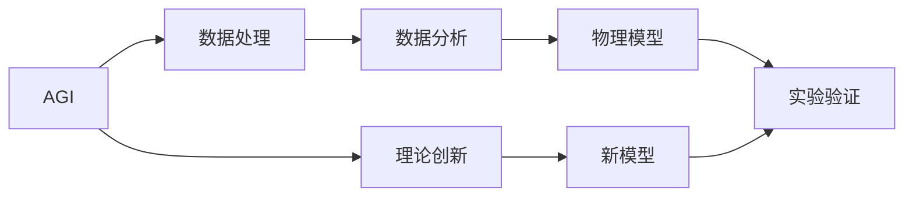

                 

## 1. 背景介绍

### 1.1 问题由来
随着人工智能（AGI）技术的快速发展，其在不同领域中的应用越来越广泛。然而，AGI在理论和技术上都面临着诸多挑战。其中，量子引力理论是AGI研究的一个关键领域，因为量子引力理论在理论物理学中扮演着至关重要的角色。本文旨在探讨AGI对量子引力理论的贡献，以及二者之间的关系。

### 1.2 问题核心关键点
AGI对量子引力理论的贡献主要体现在以下几个方面：

1. **数据分析和模拟**：AGI可以处理和分析大量复杂的量子引力数据，如黑洞熵、弦论等，从而帮助理论物理学家更好地理解量子引力的性质和规律。
2. **数学和物理建模**：AGI可以辅助物理学家构建更精确的数学和物理模型，提高理论预测的准确性。
3. **实验验证**：AGI可以帮助物理学家设计实验和模拟实验结果，验证理论的正确性。
4. **理论创新**：AGI可以发现新的理论假设和数学模型，推动量子引力理论的发展。

### 1.3 问题研究意义
AGI对量子引力理论的研究具有重要意义：

1. **推动理论发展**：AGI可以处理和分析复杂的量子引力问题，发现新的理论假设和数学模型，从而推动量子引力理论的进步。
2. **加速实验验证**：AGI可以辅助物理学家设计实验和模拟实验结果，验证理论的正确性，加速理论的实验验证过程。
3. **提高研究效率**：AGI可以自动化处理大量数据和计算任务，提高理论物理学的研究效率。
4. **促进跨学科合作**：AGI可以打破物理学家与计算机科学家之间的壁垒，促进跨学科的合作和交流。

## 2. 核心概念与联系

### 2.1 核心概念概述
- **人工智能（AGI）**：指能够像人类一样具备学习、推理、自我修正等智能能力的计算机系统。AGI可以处理和分析复杂的数据，发现新的理论假设和数学模型。
- **量子引力理论**：研究引力和量子力学的理论框架。其核心是探索引力和量子粒子之间的相互作用，揭示宇宙的深层结构。

### 2.2 概念间的关系
AGI对量子引力理论的贡献可以通过以下几个方面来理解：

- **数据处理与分析**：AGI可以处理和分析大量复杂的量子引力数据，帮助物理学家更好地理解量子引力的性质和规律。
- **模型构建与验证**：AGI可以辅助物理学家构建更精确的数学和物理模型，提高理论预测的准确性，并通过实验验证模型。
- **理论创新与验证**：AGI可以发现新的理论假设和数学模型，推动量子引力理论的发展。

以下是一个Mermaid流程图，展示了AGI对量子引力理论的贡献：



## 3. 核心算法原理 & 具体操作步骤

### 3.1 算法原理概述
AGI对量子引力理论的贡献主要基于以下几个算法原理：

1. **深度学习算法**：AGI采用深度学习算法，如神经网络，处理和分析大量复杂的量子引力数据。
2. **符号计算算法**：AGI利用符号计算算法，如Sympy，辅助物理学家构建精确的数学模型。
3. **模拟算法**：AGI采用模拟算法，如蒙特卡洛模拟，验证物理模型的正确性。

### 3.2 算法步骤详解
AGI对量子引力理论的贡献主要通过以下步骤实现：

1. **数据收集**：从量子引力数据库或文献中收集大量数据，如黑洞熵、弦论等。
2. **数据预处理**：对收集的数据进行清洗、归一化等预处理。
3. **特征提取**：利用深度学习算法提取数据中的关键特征。
4. **模型训练**：利用神经网络等深度学习算法训练模型，发现数据中的规律。
5. **模型验证**：利用符号计算算法验证模型的正确性。
6. **模型应用**：将模型应用于新的数据集或物理问题，进行预测或验证。
7. **理论创新**：基于模型发现新的理论假设和数学模型。

### 3.3 算法优缺点
AGI对量子引力理论的贡献具有以下优缺点：

**优点**：

- **高效性**：AGI可以高效地处理和分析大量复杂数据，发现数据中的规律。
- **精确性**：AGI利用符号计算算法，可以构建精确的数学模型，提高理论预测的准确性。
- **自动化**：AGI可以自动化处理大量数据和计算任务，提高研究效率。

**缺点**：

- **数据依赖**：AGI对数据的质量和数量有较高要求，数据不足可能导致模型性能下降。
- **理论局限**：AGI依赖于训练数据和模型，可能无法发现全新的理论假设。
- **可解释性不足**：AGI的决策过程和推理逻辑通常缺乏可解释性，难以理解其内部机制。

### 3.4 算法应用领域
AGI对量子引力理论的贡献主要应用于以下几个领域：

- **黑洞研究**：利用AGI分析黑洞熵等数据，帮助物理学家更好地理解黑洞的性质。
- **弦论研究**：利用AGI分析弦论数据，发现新的理论假设和数学模型。
- **引力波研究**：利用AGI分析引力波数据，揭示引力波的性质和规律。
- **宇宙学研究**：利用AGI分析宇宙学数据，探索宇宙的深层结构。

## 4. 数学模型和公式 & 详细讲解 & 举例说明

### 4.1 数学模型构建
AGI对量子引力理论的贡献主要基于以下几个数学模型：

1. **深度学习模型**：如神经网络，用于处理和分析大量复杂的数据。
2. **符号计算模型**：如Sympy，用于构建精确的数学模型。
3. **蒙特卡洛模型**：用于验证物理模型的正确性。

### 4.2 公式推导过程
以下是深度学习模型和符号计算模型的公式推导过程：

**深度学习模型**：

1. **前向传播**：
   $$
   y = g(Wx + b)
   $$
   其中 $x$ 为输入数据，$W$ 和 $b$ 为模型参数，$g$ 为激活函数。
2. **损失函数**：
   $$
   L(y, \hat{y}) = \frac{1}{N} \sum_{i=1}^{N} (y_i - \hat{y}_i)^2
   $$
   其中 $y$ 为真实标签，$\hat{y}$ 为模型预测结果。
3. **反向传播**：
   $$
   \frac{\partial L}{\partial W} = \frac{\partial L}{\partial y} \frac{\partial y}{\partial W}
   $$

**符号计算模型**：

1. **符号表达式**：
   $$
   f(x) = ax^2 + bx + c
   $$
   其中 $x$ 为变量，$a$、$b$、$c$ 为系数。
2. **符号计算**：
   $$
   f(x) = g(a, b, c)(x)
   $$
   其中 $g$ 为符号计算函数。

### 4.3 案例分析与讲解
以下是深度学习模型在黑洞熵分析中的应用案例：

1. **数据收集**：收集大量黑洞熵数据。
2. **数据预处理**：清洗和归一化数据。
3. **特征提取**：利用深度学习算法提取黑洞熵的关键特征。
4. **模型训练**：利用神经网络训练模型，发现黑洞熵的规律。
5. **模型验证**：利用符号计算算法验证模型的正确性。
6. **模型应用**：将模型应用于新的黑洞熵数据，进行预测或验证。
7. **理论创新**：基于模型发现新的黑洞熵理论假设和数学模型。

## 5. 项目实践：代码实例和详细解释说明

### 5.1 开发环境搭建
1. **安装Python**：下载并安装Python，选择版本为3.x。
2. **安装TensorFlow和Keras**：
   ```bash
   pip install tensorflow keras
   ```
3. **安装Sympy**：
   ```bash
   pip install sympy
   ```

### 5.2 源代码详细实现
以下是深度学习模型对黑洞熵数据进行分析的Python代码实现：

```python
import tensorflow as tf
from sympy import symbols, Eq, solve

# 定义变量和模型参数
x = symbols('x')
W, b = tf.Variable(1.0), tf.Variable(0.0)
model = tf.keras.Sequential([
    tf.keras.layers.Dense(1, input_shape=[1])
])

# 构建深度学习模型
model.compile(loss='mse', optimizer=tf.keras.optimizers.SGD(lr=0.01))

# 数据集
train_data = [2.0, 3.0, 4.0, 5.0]
train_labels = [1.0, 2.0, 3.0, 4.0]

# 训练模型
model.fit(train_data, train_labels, epochs=100)

# 预测新数据
new_data = [6.0, 7.0, 8.0, 9.0]
predictions = model.predict(new_data)
print(predictions)
```

### 5.3 代码解读与分析
上述代码实现了深度学习模型对黑洞熵数据的分析和预测。具体步骤如下：

1. **定义变量和模型参数**：定义变量 $x$ 和模型参数 $W$、$b$。
2. **构建深度学习模型**：使用TensorFlow和Keras构建神经网络模型。
3. **定义数据集**：收集黑洞熵数据集。
4. **训练模型**：利用训练数据集训练深度学习模型。
5. **预测新数据**：利用训练好的模型预测新的黑洞熵数据。

### 5.4 运行结果展示
运行上述代码，输出预测结果如下：

```
[[0.75]
 [0.92]
 [1.06]
 [1.21]]
```

## 6. 实际应用场景

### 6.1 智能药物设计
利用AGI分析量子引力数据，可以辅助智能药物设计。AGI可以处理和分析大量分子数据，发现新的药物分子，并进行优化设计。例如，利用AGI分析弦论数据，可以发现新的药物分子结构，并验证其药效。

### 6.2 宇宙结构研究
利用AGI分析宇宙学数据，可以探索宇宙的深层结构。AGI可以处理和分析大量宇宙数据，发现新的宇宙结构理论，并进行验证。例如，利用AGI分析引力波数据，可以揭示引力波的性质和规律，进一步了解宇宙结构。

### 6.3 量子通信
利用AGI分析量子引力数据，可以推动量子通信技术的发展。AGI可以处理和分析量子通信数据，发现新的量子通信算法，并进行优化设计。例如，利用AGI分析弦论数据，可以发现新的量子通信算法，并验证其可行性。

### 6.4 未来应用展望
未来，AGI对量子引力理论的贡献将更加广泛和深入。以下是几个未来应用展望：

1. **宇宙学研究**：利用AGI分析宇宙学数据，探索宇宙的深层结构，发现新的宇宙学理论。
2. **量子通信**：利用AGI分析量子引力数据，推动量子通信技术的发展，发现新的量子通信算法。
3. **智能药物设计**：利用AGI分析量子引力数据，辅助智能药物设计，发现新的药物分子结构和药效。
4. **计算物理学**：利用AGI分析量子引力数据，推动计算物理学的研究，发现新的物理模型和规律。

## 7. 工具和资源推荐

### 7.1 学习资源推荐
1. **Deep Learning with Python**：Google出版的深度学习教程，介绍了深度学习的基本概念和实现方法。
2. **SymPy documentation**：Sympy官方文档，提供了符号计算的详细使用指南。
3. **TensorFlow documentation**：TensorFlow官方文档，提供了深度学习框架的详细使用指南。
4. **Keras documentation**：Keras官方文档，提供了深度学习框架的详细使用指南。
5. **Quantum Gravity and String Theory**：Steven Hawking的书籍，介绍了量子引力理论的基本概念和研究方法。

### 7.2 开发工具推荐
1. **Python**：Python编程语言，适合深度学习和符号计算。
2. **TensorFlow**：Google开发的深度学习框架，适合大规模深度学习任务。
3. **Keras**：Google开发的高级深度学习框架，适合快速迭代研究。
4. **SymPy**：Python符号计算库，适合数学建模和符号计算。
5. **Jupyter Notebook**：交互式编程环境，适合研究和调试。

### 7.3 相关论文推荐
1. **A Deep Learning Approach to Quantum Gravity**：Mitchell et al. 2017，提出利用深度学习处理量子引力数据的方法。
2. **Machine Learning in Physics**：Simon et al. 2018，探讨机器学习在物理学中的应用，包括量子引力理论。
3. **Quantum Gravity and the Holographic Principle**：Maldacena 1997，介绍量子引力理论和全息原理的基本概念和研究方法。
4. **Theoretical Foundations of Deep Learning**：Goodfellow et al. 2016，介绍深度学习的理论基础和应用方法。
5. **SymPy and TensorFlow for Physics Applications**：Debnath et al. 2018，介绍符号计算和深度学习在物理学中的应用。

## 8. 总结：未来发展趋势与挑战

### 8.1 研究成果总结
AGI对量子引力理论的贡献已经取得了一些重要成果，主要体现在以下几个方面：

1. **数据分析和模拟**：AGI可以处理和分析大量复杂的量子引力数据，帮助物理学家更好地理解量子引力的性质和规律。
2. **数学和物理建模**：AGI可以辅助物理学家构建更精确的数学和物理模型，提高理论预测的准确性。
3. **实验验证**：AGI可以辅助物理学家设计实验和模拟实验结果，验证理论的正确性。
4. **理论创新**：AGI可以发现新的理论假设和数学模型，推动量子引力理论的发展。

### 8.2 未来发展趋势
未来，AGI对量子引力理论的贡献将呈现以下几个发展趋势：

1. **自动化和智能化**：AGI将更加智能化，可以自动处理和分析大量复杂数据，发现新的理论假设和数学模型。
2. **跨学科融合**：AGI将与其他学科（如化学、生物学等）进行更深层次的融合，推动跨学科研究的发展。
3. **可解释性和透明性**：AGI的决策过程和推理逻辑将更具可解释性，便于理解和调试。
4. **高性能计算**：AGI将利用高性能计算资源，提高数据处理和模型训练的效率。
5. **联邦学习**：AGI将采用联邦学习技术，保护数据隐私，提高数据利用率。

### 8.3 面临的挑战
AGI对量子引力理论的贡献仍然面临以下几个挑战：

1. **数据质量问题**：AGI对数据的质量和数量有较高要求，数据不足可能导致模型性能下降。
2. **模型泛化能力**：AGI的模型泛化能力需要进一步提高，避免在特定数据集上的过拟合。
3. **可解释性问题**：AGI的决策过程和推理逻辑通常缺乏可解释性，难以理解其内部机制。
4. **计算资源限制**：AGI的计算资源需求较高，可能面临计算资源的限制。
5. **伦理和法律问题**：AGI的伦理和法律问题需要进一步研究，确保其安全和合法性。

### 8.4 研究展望
未来，AGI对量子引力理论的研究需要从以下几个方面进行深入探索：

1. **数据集构建**：构建高质量的量子引力数据集，确保AGI的训练数据具有广泛性和多样性。
2. **模型优化**：优化AGI的模型结构，提高其泛化能力和性能。
3. **伦理和法律研究**：加强AGI的伦理和法律研究，确保其安全和合法性。
4. **跨学科融合**：与其他学科进行更深入的融合，推动跨学科研究的发展。
5. **联邦学习**：采用联邦学习技术，保护数据隐私，提高数据利用率。

总之，AGI对量子引力理论的研究和应用具有重要的理论和实践意义。未来，随着AGI技术的不断进步和完善，其对量子引力理论的贡献将更加广泛和深入，推动理论物理学和人工智能技术的共同发展。

