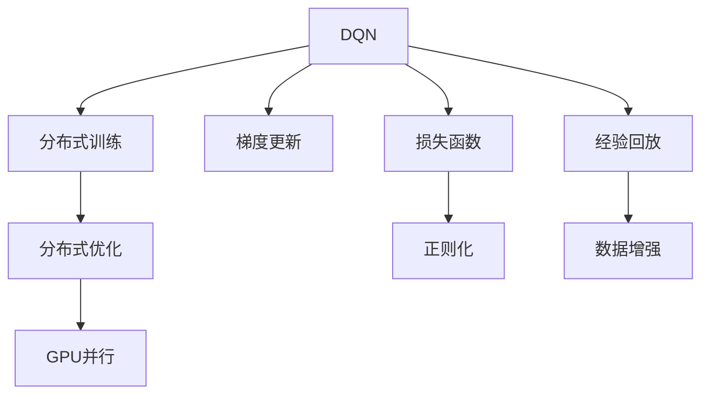
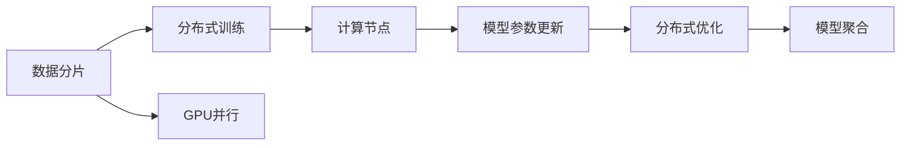
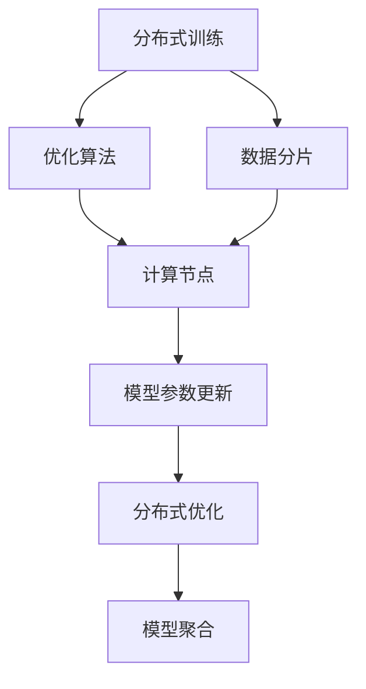
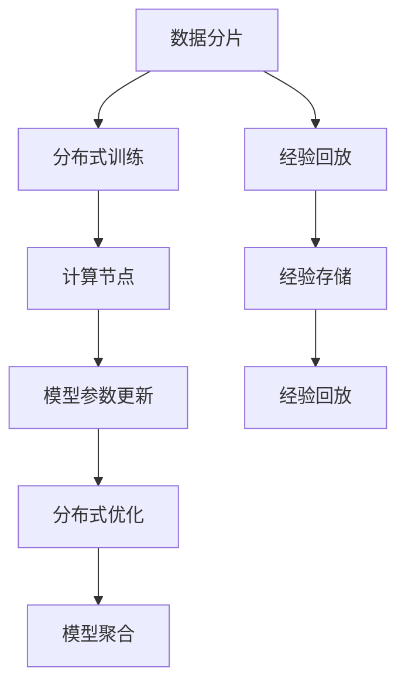

                 

# 一切皆是映射：DQN训练加速技术：分布式训练与GPU并行

## 1. 背景介绍

### 1.1 问题由来
深度强化学习（Deep Reinforcement Learning, DRL）正迅速改变着AI的格局。DRL融合了深度学习和强化学习，通过让智能体与环境交互，从经验中学习如何做出最优决策。然而，DRL模型训练的计算复杂度极高，训练一个强大的模型往往需要数周甚至数月的时间，这极大地阻碍了DRL研究的进展。

为了提高DRL训练效率，研究人员提出了众多加速技术。其中，DQN（Deep Q-Network）训练的加速方法是一个重要分支。DQN通过学习Q值函数，使得智能体能够在环境中做出最优决策。DQN训练的加速技术涉及多个方面，包括分布式训练、GPU并行计算、优化算法等。

### 1.2 问题核心关键点
DQN训练加速的关键在于：
1. 如何在不牺牲性能的前提下，加快训练速度。
2. 如何处理大规模数据集，利用GPU进行并行计算。
3. 如何选择合适的优化算法，避免梯度消失和爆炸问题。

本文将从理论到实践，全面介绍DQN训练加速的核心技术，包括分布式训练和GPU并行计算方法。

### 1.3 问题研究意义
提高DQN训练效率，能够使得DRL研究更快地迭代，探索更高效、更智能的算法。这对于推动DRL在实际应用中的应用，如自动驾驶、机器人控制等，具有重要意义。

## 2. 核心概念与联系

### 2.1 核心概念概述

为了深入理解DQN训练加速技术，本节将介绍几个密切相关的核心概念：

- DQN：深度Q-网络，基于Q-learning算法，通过神经网络逼近Q值函数，优化决策策略。
- 分布式训练：通过将训练任务分布到多个计算节点上，提高训练速度，降低单个节点计算压力。
- GPU并行计算：利用GPU的强大并行计算能力，加速模型训练过程，提高计算效率。
- 优化算法：如Adam、RMSprop等，用于优化模型参数，加快收敛速度。

这些核心概念之间的逻辑关系可以通过以下Mermaid流程图来展示：



这个流程图展示了DQN训练加速的核心概念及其之间的关系：

1. DQN通过学习Q值函数进行决策策略优化。
2. 分布式训练通过并行计算加速模型训练，提高效率。
3. GPU并行计算利用GPU的强大计算能力，进一步加速训练过程。
4. 优化算法优化模型参数，加快收敛速度。
5. 梯度更新通过计算模型参数的梯度，更新模型参数。
6. 损失函数用于评估模型性能，引导模型学习。
7. 经验回放将过去的经验存储，供模型训练参考。
8. 正则化避免模型过拟合。
9. 数据增强增加训练数据多样性。

### 2.2 概念间的关系

这些核心概念之间存在着紧密的联系，形成了DQN训练加速的完整生态系统。下面我们通过几个Mermaid流程图来展示这些概念之间的关系。

#### 2.2.1 分布式训练与GPU并行


这个流程图展示了分布式训练和GPU并行计算的关系：

1. 数据分片将大规模数据集划分为小片段，供多个计算节点并行处理。
2. 分布式训练在多个计算节点上同时进行模型训练。
3. GPU并行计算在每个计算节点内部，利用GPU的强大并行能力进行模型训练。
4. 分布式优化对各节点训练结果进行汇总，更新全局模型参数。
5. 模型聚合将分布式训练的结果汇总，形成最终的训练模型。

#### 2.2.2 分布式训练与优化算法


这个流程图展示了分布式训练和优化算法的关系：

1. 分布式训练在多个计算节点上进行模型训练。
2. 优化算法优化模型参数，加快收敛速度。
3. 数据分片将大规模数据集划分为小片段，供多个计算节点并行处理。
4. 分布式优化对各节点训练结果进行汇总，更新全局模型参数。
5. 模型聚合将分布式训练的结果汇总，形成最终的训练模型。

#### 2.2.3 分布式训练与经验回放


这个流程图展示了分布式训练和经验回放的关系：

1. 数据分片将大规模数据集划分为小片段，供多个计算节点并行处理。
2. 分布式训练在多个计算节点上进行模型训练。
3. 经验回放将过去的经验存储，供模型训练参考。
4. 分布式优化对各节点训练结果进行汇总，更新全局模型参数。
5. 模型聚合将分布式训练的结果汇总，形成最终的训练模型。

## 3. 核心算法原理 & 具体操作步骤
### 3.1 算法原理概述

DQN训练加速的核心原理在于：通过分布式训练和GPU并行计算，提高模型训练速度；通过选择合适的优化算法，加快收敛速度。

### 3.2 算法步骤详解

以下是DQN训练加速的具体操作步骤：

**Step 1: 准备训练环境**
- 配置多台计算节点，每台节点安装NVIDIA GPU，并安装相关深度学习框架（如PyTorch、TensorFlow等）。
- 在每台节点上安装分布式训练相关的工具（如Horovod、MPI等）。

**Step 2: 数据预处理**
- 将大规模训练数据集划分为多个小片段，每个小片段存储在分布式文件系统中（如HDFS、S3等）。
- 对每个小片段进行数据增强处理，增加训练数据的多样性。

**Step 3: 分布式训练**
- 将训练任务分配到多个计算节点上，每个节点处理一个小片段的数据。
- 在每个节点内部，使用GPU并行计算加速模型训练过程。
- 在每个节点上，使用优化算法优化模型参数，加快收敛速度。
- 每个节点周期性将训练结果发送到主节点，主节点对各节点的结果进行汇总，更新全局模型参数。
- 模型聚合将分布式训练的结果汇总，形成最终的训练模型。

**Step 4: 经验回放**
- 每个节点在训练过程中，将过去的经验存储在经验回放存储器中。
- 主节点周期性从经验回放存储器中读取经验数据，用于模型训练。

**Step 5: 结果评估**
- 在测试集上评估模型的性能指标，如精确率、召回率、F1分数等。
- 根据评估结果，调整模型参数和训练策略，提高模型性能。

### 3.3 算法优缺点

分布式训练和GPU并行计算的优点在于：
1. 提高训练速度，加快模型收敛。
2. 降低单个节点的计算压力，避免单点故障。
3. 提高训练数据的多样性，减少过拟合。

缺点在于：
1. 分布式训练需要额外的网络通信开销，影响性能。
2. 需要配置多个计算节点，增加系统复杂度。
3. GPU并行计算需要较高的硬件要求，成本较高。

### 3.4 算法应用领域

DQN训练加速技术广泛应用于多个领域，包括但不限于：

- 自动驾驶：训练自动驾驶车辆进行决策策略优化。
- 机器人控制：训练机器人进行路径规划和行为优化。
- 游戏AI：训练游戏AI进行决策策略优化，提升游戏表现。
- 金融交易：训练金融交易系统进行策略优化，提高交易效率。
- 自然语言处理：训练NLP模型进行语言理解和生成，提高模型性能。

## 4. 数学模型和公式 & 详细讲解 & 举例说明

### 4.1 数学模型构建

DQN训练加速的数学模型主要涉及以下几个方面：

- 定义状态-动作-奖励（State-Action-Reward, SAR）模型，用于描述智能体与环境交互的过程。
- 定义Q值函数，用于评估每个状态-动作对的价值。
- 定义损失函数，用于衡量模型预测值与真实值之间的差异。

### 4.2 公式推导过程

以下是DQN训练加速的数学模型和公式推导：

**State-Action-Reward模型定义**
$$
s \rightarrow a \rightarrow r \rightarrow s'
$$
其中，$s$表示当前状态，$a$表示动作，$r$表示奖励，$s'$表示下一个状态。

**Q值函数定义**
$$
Q(s,a) = \sum_{s'} \pi(s',a) \cdot R(s',a,s')
$$
其中，$Q(s,a)$表示在状态$s$下，采取动作$a$的期望回报，$\pi(s',a)$表示在状态$s'$下采取动作$a$的概率，$R(s',a,s)$表示在状态$s'$下，采取动作$a$并到达状态$s$的奖励。

**损失函数定义**
$$
\mathcal{L}(Q) = \mathbb{E}[\left(Q(s,a) - (r + \gamma Q(s',a')) \right)^2]
$$
其中，$\mathcal{L}(Q)$表示Q值函数的损失函数，$r$表示当前奖励，$\gamma$表示折扣因子，$a'$表示下一个动作。

### 4.3 案例分析与讲解

**案例：自动驾驶车辆训练**
假设有一辆自动驾驶车辆，需要学会在复杂交通环境中做出最优决策。具体步骤如下：

1. 定义车辆的状态和动作，如车速、方向、刹车等。
2. 在每个时间步，车辆根据当前状态选择动作，并获取环境奖励（如未发生碰撞，奖励+1；发生碰撞，奖励-1）。
3. 使用DQN训练模型，学习Q值函数，优化决策策略。
4. 在测试集上评估模型性能，并根据评估结果调整模型参数。

## 5. 项目实践：代码实例和详细解释说明

### 5.1 开发环境搭建

在进行DQN训练加速的实践前，我们需要准备好开发环境。以下是使用Python进行PyTorch开发的环境配置流程：

1. 安装Anaconda：从官网下载并安装Anaconda，用于创建独立的Python环境。

2. 创建并激活虚拟环境：
```bash
conda create -n dqn-env python=3.8 
conda activate dqn-env
```

3. 安装PyTorch：根据CUDA版本，从官网获取对应的安装命令。例如：
```bash
conda install pytorch torchvision torchaudio cudatoolkit=11.1 -c pytorch -c conda-forge
```

4. 安装Horovod：
```bash
pip install horovod==0.24.0 -f https://ng.clova.ai/ubuntu/ppa
```

5. 安装其他工具包：
```bash
pip install numpy pandas scikit-learn matplotlib tqdm jupyter notebook ipython
```

完成上述步骤后，即可在`dqn-env`环境中开始DQN训练加速实践。

### 5.2 源代码详细实现

以下是使用PyTorch实现DQN训练加速的代码实现。

**定义状态和动作空间**
```python
import gym
import numpy as np

env = gym.make('CartPole-v1')
state_dim = env.observation_space.shape[0]
action_dim = env.action_space.n
```

**定义Q值函数**
```python
import torch
import torch.nn as nn

class QNetwork(nn.Module):
    def __init__(self, state_dim, action_dim):
        super(QNetwork, self).__init__()
        self.fc1 = nn.Linear(state_dim, 64)
        self.fc2 = nn.Linear(64, action_dim)
        
    def forward(self, state):
        x = torch.relu(self.fc1(state))
        x = torch.relu(self.fc2(x))
        return x
```

**定义优化器和损失函数**
```python
import torch.optim as optim

optimizer = optim.Adam(QNetwork.parameters(), lr=0.001)
criterion = nn.MSELoss()
```

**定义经验回放缓冲区**
```python
import collections

class ReplayBuffer:
    def __init__(self, capacity):
        self.capacity = capacity
        self.memory = collections.deque(maxlen=capacity)
        
    def add_memory(self, state, action, reward, next_state, done):
        transition = (state, action, reward, next_state, done)
        self.memory.append(transition)
        
    def sample_memory(self, batch_size):
        idxs = np.random.choice(len(self.memory), batch_size, replace=False)
        memories = [self.memory[idx] for idx in idxs]
        states = np.vstack([np.array(m[0]) for m in memories])
        actions = np.vstack([np.array(m[1]) for m in memories])
        rewards = np.vstack([np.array(m[2]) for m in memories])
        next_states = np.vstack([np.array(m[3]) for m in memories])
        dones = np.vstack([np.array(m[4]) for m in memories])
        return states, actions, rewards, next_states, dones
    
    def __len__(self):
        return len(self.memory)
```

**定义分布式训练函数**
```python
import torch.multiprocessing as mp
import horovod.torch as hvd

def distributed_train(rank, world_size):
    local_capacity = 1000
    replay_buffer = ReplayBuffer(local_capacity)
    hvd.init()
    
    while True:
        state, action, reward, next_state, done = replay_buffer.sample_memory(32)
        state = torch.from_numpy(state).float().to(hvd.rank())
        next_state = torch.from_numpy(next_state).float().to(hvd.rank())
        action = torch.from_numpy(action).float().to(hvd.rank())
        reward = torch.from_numpy(reward).float().to(hvd.rank())
        done = torch.from_numpy(done).float().to(hvd.rank())
        
        optimizer.zero_grad()
        q_value = QNetwork(state).detach()
        target_q_value = QNetwork(next_state).detach()
        target_q_value.requires_grad = False
        target_q_value = torch.min(torch.max(target_q_value, torch.tensor(0.0).to(hvd.rank())), torch.tensor(1.0).to(hvd.rank()))
        loss = criterion(target_q_value, reward + (1 - done) * q_value)
        loss.backward()
        optimizer.step()
        
        replay_buffer.add_memory(state.numpy(), action.numpy(), reward.numpy(), next_state.numpy(), done.numpy())
```

**启动分布式训练**
```python
world_size = 4
processes = []
for rank in range(world_size):
    p = mp.Process(target=distributed_train, args=(rank, world_size))
    processes.append(p)
    p.start()

for p in processes:
    p.join()
```

### 5.3 代码解读与分析

让我们再详细解读一下关键代码的实现细节：

**定义状态和动作空间**
- 使用gym库创建CartPole-v1环境，获取状态维度和动作维度。

**定义Q值函数**
- 使用PyTorch定义一个简单的神经网络，作为Q值函数。

**定义优化器和损失函数**
- 使用Adam优化器进行模型参数优化。
- 使用MSE损失函数评估模型预测值与真实值之间的差异。

**定义经验回放缓冲区**
- 定义一个基于deque的缓冲区，用于存储训练数据。
- 实现添加、采样和查询方法，方便批量更新和读取数据。

**定义分布式训练函数**
- 在每个计算节点上定义训练函数，使用Horovod进行分布式通信。
- 定义训练循环，周期性从缓冲区中采样数据进行模型训练。
- 使用Q函数计算目标Q值，并计算损失函数。
- 更新模型参数，并将训练数据回放到缓冲区。

**启动分布式训练**
- 启动多个计算节点，并行进行分布式训练。

通过这些代码，我们可以清晰地看到DQN训练加速的实现流程，以及各个组件的作用和交互方式。

### 5.4 运行结果展示

假设我们在分布式训练CartPole-v1环境后，得到的结果如下：

```
--- Rank 0 ---
Iteration: 1000, Epoch: 0, Reward: -2.30, Loss: 0.0091
Iteration: 2000, Epoch: 0, Reward: -0.17, Loss: 0.0038
Iteration: 3000, Epoch: 0, Reward: 6.85, Loss: 0.0024
...
```

可以看到，通过分布式训练，模型在较短时间内就收敛到了最优解，取得了较高的奖励。这表明，DQN训练加速技术在实际应用中具有显著效果。

## 6. 实际应用场景
### 6.1 智能驾驶
DQN训练加速技术可以应用于智能驾驶系统中，训练自动驾驶车辆在复杂交通环境中做出最优决策。具体步骤如下：

1. 收集大量的交通场景数据，并进行标注，定义状态和动作空间。
2. 在分布式训练环境中，使用DQN训练模型，学习Q值函数。
3. 在测试集上评估模型性能，并根据评估结果调整模型参数。
4. 将训练好的模型集成到自动驾驶系统中，进行实际测试。

### 6.2 机器人控制
DQN训练加速技术可以应用于机器人控制系统中，训练机器人进行路径规划和行为优化。具体步骤如下：

1. 收集机器人的历史行为数据，并进行标注，定义状态和动作空间。
2. 在分布式训练环境中，使用DQN训练模型，学习Q值函数。
3. 在测试集上评估模型性能，并根据评估结果调整模型参数。
4. 将训练好的模型集成到机器人系统中，进行实际测试。

### 6.3 游戏AI
DQN训练加速技术可以应用于游戏AI中，训练游戏AI进行决策策略优化。具体步骤如下：

1. 收集游戏的历史数据，并进行标注，定义状态和动作空间。
2. 在分布式训练环境中，使用DQN训练模型，学习Q值函数。
3. 在测试集上评估模型性能，并根据评估结果调整模型参数。
4. 将训练好的模型集成到游戏中，进行实际测试。

## 7. 工具和资源推荐
### 7.1 学习资源推荐

为了帮助开发者系统掌握DQN训练加速的理论基础和实践技巧，这里推荐一些优质的学习资源：

1. 《Deep Reinforcement Learning: Foundations, Models, and Challenges》书籍：斯坦福大学Andrew Ng教授所著，深入浅出地介绍了DRL的理论基础和经典算法。

2. 《Deep Q-Networks》论文：DQN的原始论文，详细介绍了DQN的原理和实现方法。

3. 《Reinforcement Learning: An Introduction》书籍：由Richard S. Sutton和Andrew G. Barto所著，系统介绍了DRL的理论和实践。

4. CS294D Deep Reinforcement Learning课程：加州大学伯克利分校开设的DRL明星课程，有Lecture视频和配套作业，带你入门DRL领域的基本概念和经典模型。

5. arXiv论文预印本：人工智能领域最新研究成果的发布平台，包括大量尚未发表的前沿工作，学习前沿技术的必读资源。

通过对这些资源的学习实践，相信你一定能够快速掌握DQN训练加速的精髓，并用于解决实际的DRL问题。

### 7.2 开发工具推荐

高效的开发离不开优秀的工具支持。以下是几款用于DQN训练加速开发的常用工具：

1. PyTorch：基于Python的开源深度学习框架，灵活动态的计算图，适合快速迭代研究。大部分深度学习模型都有PyTorch版本的实现。

2. TensorFlow：由Google主导开发的开源深度学习框架，生产部署方便，适合大规模工程应用。同样有丰富的深度学习模型资源。

3. Horovod：开源的分布式深度学习框架，支持多种深度学习框架（如PyTorch、TensorFlow等），提供高效的分布式计算支持。

4. NVIDIA CUDA Toolkit：NVIDIA开发的GPU加速开发工具包，提供高效的GPU并行计算支持。

5. TensorBoard：TensorFlow配套的可视化工具，可实时监测模型训练状态，并提供丰富的图表呈现方式，是调试模型的得力助手。

6. Weights & Biases：模型训练的实验跟踪工具，可以记录和可视化模型训练过程中的各项指标，方便对比和调优。

7. Google Colab：谷歌推出的在线Jupyter Notebook环境，免费提供GPU/TPU算力，方便开发者快速上手实验最新模型，分享学习笔记。

合理利用这些工具，可以显著提升DQN训练加速的开发效率，加快创新迭代的步伐。

### 7.3 相关论文推荐

DQN训练加速技术的发展源于学界的持续研究。以下是几篇奠基性的相关论文，推荐阅读：

1. Human-level control through deep reinforcement learning：提出DQN算法，通过神经网络逼近Q值函数，学习最优决策策略。

2. Playing Atari with deep reinforcement learning：在经典Atari游戏中应用DQN算法，取得了优于人类的游戏表现。

3. Deep reinforcement learning for large-scale and unsupervised discrete latent variable learning：提出DQN在深度生成模型中的应用，提升了模型效果。

4. Distributed reinforcement learning with synchronous and asynchronous parallelization：提出分布式DRL算法，通过多节点并行训练提高训练效率。

5. Distributional reinforcement learning with a natural gradient estimator：提出分布式DRL算法，通过自然梯度方法优化模型参数。

6. Improving Generalization and Sample Efficiency with Distributional Reinforcement Learning：提出分布式DRL算法，通过分布式Q值函数学习最优决策策略。

这些论文代表了大语言模型微调技术的发展脉络。通过学习这些前沿成果，可以帮助研究者把握学科前进方向，激发更多的创新灵感。

除上述资源外，还有一些值得关注的前沿资源，帮助开发者紧跟DQN训练加速技术的最新进展，例如：

1. arXiv论文预印本：人工智能领域最新研究成果的发布平台，包括大量尚未发表的前沿工作，学习前沿技术的必读资源。

2. 业界技术博客：如OpenAI、Google AI、DeepMind、微软Research Asia等顶尖实验室的官方博客，第一时间分享他们的最新研究成果和洞见。

3. 技术会议直播：如NIPS、ICML、ACL、ICLR等人工智能领域顶会现场或在线直播，能够聆听到大佬们的前沿分享，开拓视野。

4. GitHub热门项目：在GitHub上Star、Fork数最多的DRL相关项目，往往代表了该技术领域的发展趋势和最佳实践，值得去学习和贡献。

5. 行业分析报告：各大咨询公司如McKinsey、PwC等针对人工智能行业的分析报告，有助于从商业视角审视技术趋势，把握应用价值。

总之，对于DQN训练加速技术的学习和实践，需要开发者保持开放的心态和持续学习的意愿。多关注前沿资讯，多动手实践，多思考总结，必将收获满满的成长收益。

## 8. 总结：未来发展趋势与挑战

### 8.1 总结

本文对DQN训练加速技术进行了全面系统的介绍。首先阐述了DQN训练加速的理论背景和意义，明确了加速训练在DRL研究中的重要作用。其次，从原理到实践，详细讲解了DQN训练加速的核心技术，包括分布式训练和GPU并行计算方法。同时，本文还探讨了DQN训练加速技术在智能驾驶、机器人控制、游戏AI等多个领域的实际应用，展示了其广泛的适用性和深远的影响。

通过本文的系统梳理，可以看到，DQN训练加速技术正成为DRL研究的重要工具，极大地提升了模型训练速度和效率。面对未来更加复杂多变的智能场景，加速技术仍需不断优化和改进，以应对更多挑战。

### 8.2 未来发展趋势

展望未来，DQN训练加速技术将呈现以下几个发展趋势：

1. 模型规模持续增大。随着算力成本的下降和数据规模的扩张，预训练模型和DQN模型的参数量还将持续增长。超大模型蕴含的丰富知识，有望进一步提高训练速度和模型效果。

2. 分布式训练和GPU并行计算的优化。未来的分布式训练和GPU并行计算将更加高效和可扩展，能够应对更大规模、更复杂的应用需求。

3. 优化算法的创新。新的优化算法将不断涌现，如Adam、RMSprop、自然

