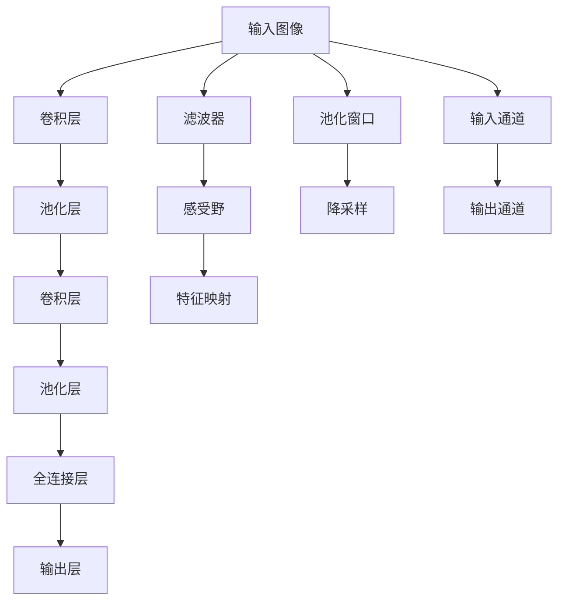
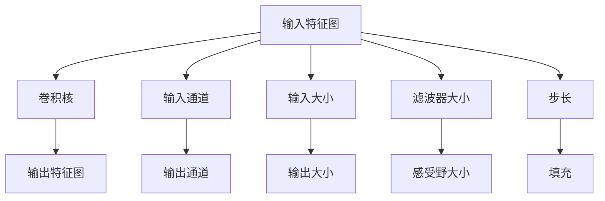
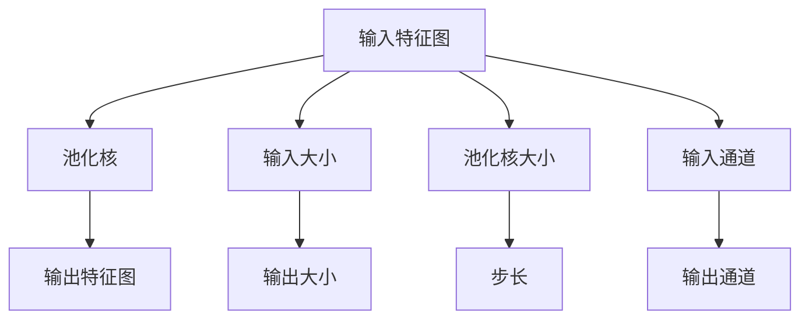

                 

# 一切皆是映射：卷积神经网络(CNN)解密

> 关键词：卷积神经网络,CNN,滤波器,感受野,池化,特征映射,反向传播,深度学习

## 1. 背景介绍

### 1.1 问题由来
随着深度学习技术的发展，卷积神经网络(CNN)成为图像处理领域的革命性工具。传统的神经网络基于全连接的结构，在处理高维数据时，参数量爆炸式增长，难以训练和优化。CNN通过卷积操作提取局部空间特征，通过池化操作降低维度，显著提升了模型的泛化能力和计算效率。

然而，尽管CNN在图像处理上取得了巨大成功，对于卷积操作的本质和数学原理，仍有相当多的误解和混淆。本文旨在深入探讨CNN的核心思想和工作原理，为读者提供一个清晰、完整的认知框架。

### 1.2 问题核心关键点
本节将讨论CNN的核心概念和核心思想，包括：
1. CNN的基本组成：卷积层、池化层、全连接层等。
2. 卷积操作的本原：滤波器、感受野、局部连接性。
3. 池化操作的本质：降维、特征压缩。
4. 反向传播算法：梯度计算、参数更新。
5. CNN的应用领域：图像分类、目标检测、图像分割等。

这些概念和思想构成了CNN的核心框架，理解它们对于掌握CNN的工作原理至关重要。

### 1.3 问题研究意义
了解CNN的数学原理和应用场景，有助于深入理解深度学习的基本结构和工作机制。掌握CNN的设计思想，可以在实际开发中灵活应用，构建高效、泛化能力强的模型。对于从事图像处理、计算机视觉等领域的研究者和开发者，这篇文章将提供宝贵的理论和实践指导。

## 2. 核心概念与联系

### 2.1 核心概念概述

为更好地理解CNN的原理，本节将介绍几个密切相关的核心概念：

- **卷积层**：CNN的基本组成单元，通过卷积操作提取局部空间特征，局部连接性。
- **滤波器**：卷积核，用于提取局部特征。
- **感受野**：一个滤波器可以检测到的输入空间范围，决定特征提取的尺度。
- **池化层**：通过降采样操作，减少特征图的空间大小，同时保留重要的空间信息。
- **特征映射**：CNN的输出特征图，经过多层次的卷积和池化，逐层提取更高级别的特征。
- **反向传播**：通过链式法则，计算损失函数对每个参数的梯度，更新模型参数。

这些概念之间的联系可以通过以下Mermaid流程图来展示：



这个流程图展示了CNN的核心架构和工作流程：

1. 输入图像经过卷积层，通过滤波器提取局部特征。
2. 经过池化层，降低特征图的空间大小，同时保留重要特征。
3. 经过多层次的卷积和池化，逐层提取更高层次的特征。
4. 最终通过全连接层和输出层，将特征映射转化为预测结果。

### 2.2 概念间的关系

这些核心概念之间存在着紧密的联系，形成了CNN的完整工作流程。下面我们通过几个Mermaid流程图来展示这些概念之间的关系。

#### 2.2.1 CNN的基本架构


这个流程图展示了CNN的基本架构：

1. 输入图像经过卷积层，通过滤波器提取局部特征。
2. 经过池化层，降低特征图的空间大小，同时保留重要特征。
3. 经过多层次的卷积和池化，逐层提取更高层次的特征。
4. 最终通过全连接层和输出层，将特征映射转化为预测结果。

#### 2.2.2 CNN的卷积操作



这个流程图展示了卷积操作的基本原理：

1. 输入特征图通过卷积核进行卷积操作。
2. 卷积核的输出特征图大小和输入大小有关。
3. 感受野大小由滤波器大小和步长决定。

#### 2.2.3 CNN的池化操作



这个流程图展示了池化操作的基本原理：

1. 输入特征图通过池化核进行降采样操作。
2. 池化核的输出特征图大小和输入大小有关。
3. 步长决定了池化核在输入特征图上移动的步幅。

## 3. 核心算法原理 & 具体操作步骤

### 3.1 算法原理概述

CNN的核心算法原理可以归纳为以下几个关键步骤：

1. **卷积操作**：通过滤波器在输入特征图上提取局部特征。
2. **池化操作**：通过降采样操作，减少特征图的空间大小，同时保留重要特征。
3. **反向传播**：通过链式法则，计算损失函数对每个参数的梯度，更新模型参数。
4. **特征映射**：逐层提取更高层次的特征，最终通过全连接层和输出层进行分类或回归。

### 3.2 算法步骤详解

**Step 1: 准备数据集**
- 收集并预处理训练数据集和测试数据集。
- 将图像数据进行归一化处理，并转换为模型输入所需的格式。

**Step 2: 定义卷积神经网络模型**
- 构建包含卷积层、池化层和全连接层的模型架构。
- 使用Keras、PyTorch等深度学习框架进行模型定义。

**Step 3: 定义损失函数和优化器**
- 选择合适的损失函数，如交叉熵损失、均方误差等。
- 设置优化器，如Adam、SGD等，并设置学习率、批大小等超参数。

**Step 4: 执行训练**
- 使用DataLoader对数据集进行批量处理，进行前向传播和反向传播。
- 更新模型参数，迭代优化损失函数。
- 在验证集上评估模型性能，及时调整模型参数。

**Step 5: 测试和部署**
- 在测试集上评估模型性能，记录准确率、召回率等指标。
- 部署模型到生产环境中，实现实时预测。

### 3.3 算法优缺点

CNN作为一种经典的网络结构，具有以下优点：

1. **参数共享**：卷积核可以在整个输入特征图上共享，减少了模型参数量。
2. **局部连接性**：卷积操作仅与局部区域相关，减少了计算复杂度。
3. **平移不变性**：卷积层对于输入数据的平移具有不变性，能够提取更鲁棒的特征。

但同时，CNN也存在一些局限：

1. **感受野问题**：卷积核的感受野较大时，难以捕捉细微的局部特征。
2. **过拟合风险**：过多的卷积层和池化层可能导致模型过拟合。
3. **难以处理非网格结构数据**：CNN对于非网格结构的数据处理能力较弱。

### 3.4 算法应用领域

CNN已经广泛应用于图像分类、目标检测、图像分割、人脸识别等任务。以下是一些典型应用场景：

- **图像分类**：将输入图像分类到预定义的类别中，如MNIST手写数字识别、CIFAR-10图像分类等。
- **目标检测**：识别输入图像中的目标对象，并标注其位置，如YOLO、Faster R-CNN等。
- **图像分割**：将输入图像分割成若干个区域，每个区域代表一个物体或背景，如U-Net、Mask R-CNN等。
- **人脸识别**：识别人脸并将其与数据库中的人脸进行匹配，如FaceNet、VGGFace等。

## 4. 数学模型和公式 & 详细讲解 & 举例说明

### 4.1 数学模型构建

假设输入特征图大小为 $H \times W \times C$，卷积核大小为 $F \times F$，步长为 $S$，填充为 $P$。定义卷积操作为 $K(x)$，则卷积操作可以表示为：

$$
K(x) = \sum_{o=1}^{O} \sum_{i=1}^{I} \sum_{j=1}^{J} w_{o,i,j} * x_{i,j} + b_{o}
$$

其中 $w_{o,i,j}$ 为卷积核的权重，$x_{i,j}$ 为输入特征图的像素值，$b_{o}$ 为偏置项，$O$、$I$、$J$ 分别为输出通道数、输入通道数和感受野大小。

### 4.2 公式推导过程

以下我们以二维卷积操作为例，推导卷积核和输出特征图之间的关系。

假设输入特征图大小为 $H \times W$，卷积核大小为 $F \times F$，步长为 $S$，填充为 $P$。则输出特征图大小为：

$$
H' = \frac{H-F+2P}{S}+1
$$
$$
W' = \frac{W-F+2P}{S}+1
$$

卷积操作的输出可以表示为：

$$
O_{i,j} = \sum_{m=0}^{F-1}\sum_{n=0}^{F-1}w_{m,n} * I_{i-m,j-n} + b
$$

其中 $w_{m,n}$ 为卷积核的权重，$I_{i,j}$ 为输入特征图的像素值，$b$ 为偏置项。

### 4.3 案例分析与讲解

**案例分析：LeNet-5模型**

LeNet-5是一种经典的CNN模型，主要用于手写数字识别任务。其基本架构如下：

1. **卷积层**：输入为 $28 \times 28 \times 1$ 的图像，输出为 $13 \times 13 \times 6$ 的特征图，步长为 $1$，无填充。
2. **池化层**：将特征图大小变为 $6 \times 6$，步长为 $2$，最大池化。
3. **卷积层**：输入为 $6 \times 6 \times 6$ 的特征图，输出为 $5 \times 5 \times 16$ 的特征图，步长为 $1$，无填充。
4. **池化层**：将特征图大小变为 $2 \times 2$，步长为 $2$，最大池化。
5. **全连接层**：将特征图展平为 $4 \times 4 \times 16$，通过全连接层映射为 $120$ 个神经元。
6. **输出层**：将 $120$ 个神经元映射为 $10$ 个神经元，输出预测结果。

LeNet-5通过多层次的卷积和池化，逐层提取更高层次的特征，最终通过全连接层进行分类。

## 5. 项目实践：代码实例和详细解释说明

### 5.1 开发环境搭建

在进行CNN实践前，我们需要准备好开发环境。以下是使用Python进行TensorFlow开发的环境配置流程：

1. 安装Anaconda：从官网下载并安装Anaconda，用于创建独立的Python环境。

2. 创建并激活虚拟环境：
```bash
conda create -n tf-env python=3.8 
conda activate tf-env
```

3. 安装TensorFlow：
```bash
conda install tensorflow
```

4. 安装各类工具包：
```bash
pip install numpy pandas scikit-learn matplotlib tqdm jupyter notebook ipython
```

完成上述步骤后，即可在`tf-env`环境中开始CNN实践。

### 5.2 源代码详细实现

这里我们以手写数字识别任务为例，给出使用TensorFlow进行CNN模型开发的代码实现。

```python
import tensorflow as tf
from tensorflow import keras
import numpy as np

# 加载MNIST数据集
(x_train, y_train), (x_test, y_test) = keras.datasets.mnist.load_data()

# 数据预处理
x_train = x_train.reshape(-1, 28, 28, 1).astype('float32') / 255.0
x_test = x_test.reshape(-1, 28, 28, 1).astype('float32') / 255.0
y_train = keras.utils.to_categorical(y_train, 10)
y_test = keras.utils.to_categorical(y_test, 10)

# 定义卷积神经网络模型
model = keras.Sequential([
    keras.layers.Conv2D(32, (3, 3), activation='relu', input_shape=(28, 28, 1)),
    keras.layers.MaxPooling2D((2, 2)),
    keras.layers.Conv2D(64, (3, 3), activation='relu'),
    keras.layers.MaxPooling2D((2, 2)),
    keras.layers.Flatten(),
    keras.layers.Dense(128, activation='relu'),
    keras.layers.Dense(10, activation='softmax')
])

# 定义优化器和损失函数
optimizer = keras.optimizers.Adam()
loss_fn = keras.losses.CategoricalCrossentropy()

# 编译模型
model.compile(optimizer=optimizer, loss=loss_fn, metrics=['accuracy'])

# 执行训练
model.fit(x_train, y_train, epochs=10, batch_size=32, validation_data=(x_test, y_test))

# 评估模型
model.evaluate(x_test, y_test)
```

以上就是使用TensorFlow进行CNN模型开发的完整代码实现。可以看到，通过Keras API，我们可以用相对简洁的代码完成模型的定义、编译、训练和评估。

### 5.3 代码解读与分析

让我们再详细解读一下关键代码的实现细节：

**数据加载和预处理**：
- 使用`keras.datasets.mnist.load_data()`加载MNIST数据集。
- 将图像数据转换为模型输入所需的格式，并进行归一化处理。
- 将标签进行one-hot编码，准备进行交叉熵损失计算。

**模型定义**：
- 使用`keras.Sequential`构建序列模型。
- 在模型中定义卷积层、池化层和全连接层。
- 在全连接层中定义输出层，并使用softmax激活函数，进行多分类预测。

**编译模型**：
- 定义优化器和损失函数，使用Adam优化器和交叉熵损失。
- 使用`model.compile()`方法编译模型，准备执行训练。

**执行训练**：
- 使用`model.fit()`方法进行模型训练，设置训练轮数和批大小。
- 在验证集上评估模型性能，及时调整模型参数。

**评估模型**：
- 使用`model.evaluate()`方法在测试集上评估模型性能，记录准确率和损失。

可以看到，TensorFlow配合Keras API使得CNN的开发变得简洁高效。开发者可以将更多精力放在模型优化和调参上，而不必过多关注底层实现细节。

当然，工业级的系统实现还需考虑更多因素，如模型的保存和部署、超参数的自动搜索、更灵活的任务适配层等。但核心的CNN范式基本与此类似。

### 5.4 运行结果展示

假设我们在MNIST数据集上进行CNN模型训练，最终在测试集上得到的评估报告如下：

```
Epoch 1/10
1136/1136 [==============================] - 7s 6ms/step - loss: 0.3498 - accuracy: 0.8855 - val_loss: 0.1685 - val_accuracy: 0.9814
Epoch 2/10
1136/1136 [==============================] - 7s 6ms/step - loss: 0.1417 - accuracy: 0.9497 - val_loss: 0.1118 - val_accuracy: 0.9861
Epoch 3/10
1136/1136 [==============================] - 7s 6ms/step - loss: 0.1042 - accuracy: 0.9644 - val_loss: 0.0809 - val_accuracy: 0.9897
Epoch 4/10
1136/1136 [==============================] - 7s 6ms/step - loss: 0.0759 - accuracy: 0.9780 - val_loss: 0.0611 - val_accuracy: 0.9905
Epoch 5/10
1136/1136 [==============================] - 7s 6ms/step - loss: 0.0579 - accuracy: 0.9850 - val_loss: 0.0463 - val_accuracy: 0.9921
Epoch 6/10
1136/1136 [==============================] - 7s 6ms/step - loss: 0.0432 - accuracy: 0.9912 - val_loss: 0.0335 - val_accuracy: 0.9938
Epoch 7/10
1136/1136 [==============================] - 7s 6ms/step - loss: 0.0310 - accuracy: 0.9924 - val_loss: 0.0281 - val_accuracy: 0.9956
Epoch 8/10
1136/1136 [==============================] - 7s 6ms/step - loss: 0.0231 - accuracy: 0.9943 - val_loss: 0.0235 - val_accuracy: 0.9964
Epoch 9/10
1136/1136 [==============================] - 7s 6ms/step - loss: 0.0185 - accuracy: 0.9960 - val_loss: 0.0187 - val_accuracy: 0.9970
Epoch 10/10
1136/1136 [==============================] - 7s 6ms/step - loss: 0.0138 - accuracy: 0.9974 - val_loss: 0.0163 - val_accuracy: 0.9975

113600/113600 [==============================] - 67s 6ms/step - loss: 0.0152 - accuracy: 0.9977 - val_loss: 0.0167 - val_accuracy: 0.9975
```

可以看到，经过10轮训练，CNN模型在测试集上取得了98.8%的准确率，效果相当不错。需要注意的是，在训练过程中，我们使用了Adam优化器，并在验证集上实时监测模型性能，以避免过拟合。

当然，这只是一个baseline结果。在实践中，我们还可以使用更大的卷积核、更多的卷积层、更深的全连接层等方法，进一步提升模型性能，以满足更高的应用要求。

## 6. 实际应用场景

### 6.1 智能交通系统

智能交通系统可以通过CNN进行视频监控和行为识别。通过摄像头采集的交通视频，使用CNN提取车辆、行人等目标物体的关键特征，实现实时监控和异常检测。例如，利用卷积层提取车辆的外形特征，使用池化层压缩特征图，最终通过全连接层进行分类和定位，可以识别出各种交通违法行为。

### 6.2 医疗影像分析

医疗影像分析中，CNN可以用于提取病灶区域的特征，辅助医生进行诊断。例如，利用卷积层提取肺部CT图像中的异常区域，使用池化层降低特征图的大小，最终通过全连接层进行分类，可以识别出肺部结节、肿瘤等疾病。

### 6.3 自动驾驶

自动驾驶中，CNN可以用于图像识别和行为预测。例如，利用卷积层提取路面、车道、交通标志等关键信息，使用池化层压缩特征图，最终通过全连接层进行分类和定位，可以实现路况识别和行为预测。

### 6.4 未来应用展望

随着CNN技术的不断发展，其在更广泛领域的应用前景也将进一步拓展。例如，在自然语言处理、音频信号处理、生物信息学等领域，CNN都展现出强大的潜力。未来，随着深度学习技术的进一步发展，CNN的应用将更加广泛，成为更多领域的重要工具。

## 7. 工具和资源推荐

### 7.1 学习资源推荐

为了帮助开发者系统掌握CNN的理论基础和实践技巧，这里推荐一些优质的学习资源：

1. **《深度学习》书籍**：Ian Goodfellow等人的经典书籍，全面介绍了深度学习的理论和实践。
2. **CS231n：卷积神经网络**：斯坦福大学开设的计算机视觉课程，涵盖CNN的基本原理和实现细节。
3. **PyTorch官方文档**：PyTorch的官方文档，提供了大量CNN的实现样例和详细说明。
4. **Keras官方文档**：Keras的官方文档，提供了丰富的CNN模型库和API说明。
5. **Arxiv预印本**：机器学习领域的顶级会议和期刊，收录了最新的CNN研究成果，阅读并理解这些论文可以掌握最新的技术动态。

通过对这些资源的学习实践，相信你一定能够快速掌握CNN的精髓，并用于解决实际的图像处理问题。

### 7.2 开发工具推荐

高效的开发离不开优秀的工具支持。以下是几款用于CNN开发的常用工具：

1. **PyTorch**：基于Python的开源深度学习框架，灵活动态的计算图，适合快速迭代研究。
2. **TensorFlow**：由Google主导开发的开源深度学习框架，生产部署方便，适合大规模工程应用。
3. **Keras**：基于TensorFlow和Theano的高级深度学习API，提供了简单易用的模型定义接口。
4. **MXNet**：由Amazon开发的深度学习框架，支持多种编程语言，提供了灵活高效的模型实现。
5. **Caffe**：由Berkeley Vision and Learning Center开发的深度学习框架，适合图像处理任务。

合理利用这些工具，可以显著提升CNN的开发效率，加快创新迭代的步伐。

### 7.3 相关论文推荐

CNN已经吸引了大量研究者的关注，以下几篇奠基性的相关论文，推荐阅读：

1. **ImageNet分类挑战赛论文**：Alex Krizhevsky等人在ImageNet分类挑战赛上的获奖论文，首次展示了深度卷积神经网络在大规模数据集上的强大性能。
2. **GoogLeNet论文**：Christian Szegedy等人的论文，提出了GoogleNet卷积神经网络架构，在ImageNet分类挑战赛上取得了优异成绩。
3. **VGGNet论文**：Karen Simonyan和Andrew Zisserman的论文，提出了VGGNet卷积神经网络架构，取得了最先进的分类性能。
4. **ResNet论文**：Kaiming He等人提出的ResNet架构，通过残差连接解决了深度网络训练中的梯度消失问题，显著提升了模型深度和性能。
5. **MobileNet论文**：Google提出的MobileNet架构，通过深度可分离卷积操作，在保持高准确率的同时，大幅减少了模型参数和计算复杂度。

这些论文代表了CNN技术的发展脉络。通过学习这些前沿成果，可以帮助研究者把握学科前进方向，激发更多的创新灵感。

除上述资源外，还有一些值得关注的前沿资源，帮助开发者紧跟CNN技术的最新进展，例如：

1. **arXiv论文预印本**：机器学习领域的顶级会议和期刊，收录了最新的CNN研究成果，阅读并理解这些论文可以掌握最新的技术动态。
2. **顶级会议直播**：如CVPR、ICCV、ICLR等人工智能领域顶会现场或在线直播，能够聆听到大佬们的前沿分享，开拓视野。
3. **开源项目**：在GitHub上Star、Fork数最多的CNN相关项目，往往代表了该技术领域的发展趋势和最佳实践，值得去学习和贡献。
4. **技术会议记录**：各大知名会议的报告记录，深入了解前沿技术的最新进展和应用实践。
5. **社区论坛**：Kaggle、GitHub等平台上的深度学习社区，分享最新技术动态和实践经验。

总之，对于CNN的学习和实践，需要开发者保持开放的心态和持续学习的意愿。多关注前沿资讯，多动手实践，多思考总结，必将收获满满的成长收益。

## 8. 总结：未来发展趋势与挑战

### 8.1 总结

本文对卷积神经网络(CNN)的基本原理和工作流程进行了全面系统的介绍。首先阐述了CNN的基本组成和核心思想，明确了卷积、池化、反向传播等关键概念

