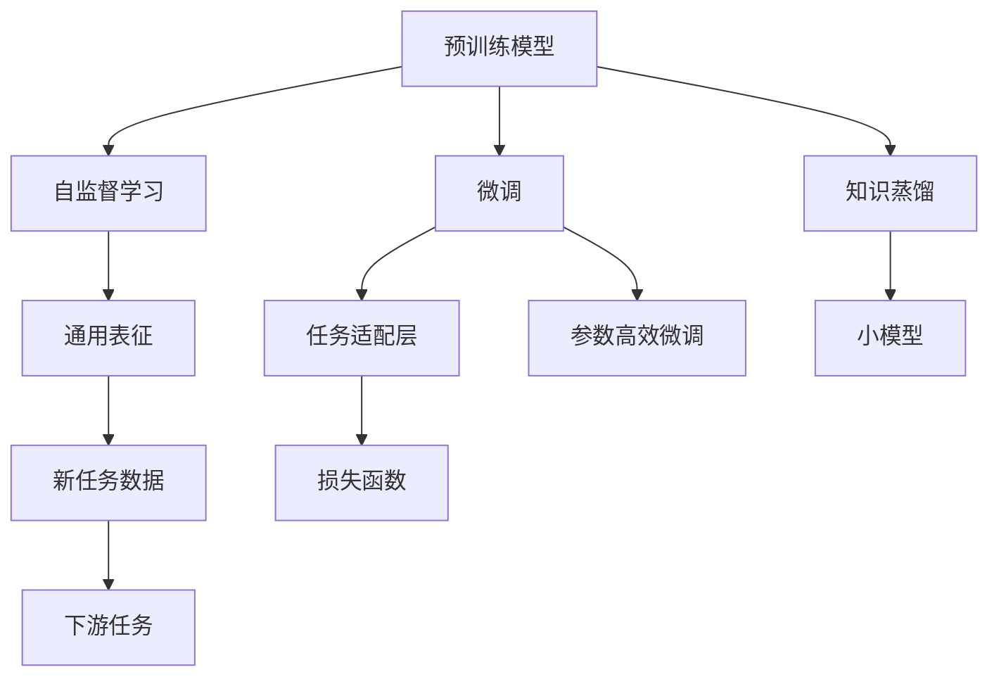

                 

# 一切皆是映射：深度迁移学习：AI在不同域间的知识转移

## 1. 背景介绍

### 1.1 问题由来
深度迁移学习（Deep Transfer Learning）是近年来人工智能领域的热门研究方向之一。它主要通过将一个大规模预训练模型在新领域数据上进行微调，利用已学习到的通用知识来加速模型在新任务上的训练，并提高性能。这种技术对于数据稀缺和标注成本高的应用场景尤为重要，能够在一定程度上缓解数据获取难题，同时降低深度学习系统对大量标注数据的依赖。

### 1.2 问题核心关键点
深度迁移学习的核心在于如何将预训练模型的通用知识迁移到新领域，利用已有模型的强大表现力，来加速新任务的学习。具体来说，主要包括以下几个关键点：
- 选择合适的预训练模型：如ResNet、VGG、BERT等，这些模型在各自领域内已经取得了非常不错的效果。
- 确定微调策略：如冻结部分层、使用更小的学习率、引入正则化技术等，以避免过拟合，同时最大化新任务的泛化能力。
- 设计任务适配层：根据新任务的特点，设计合适的输出层和损失函数，以适应新领域数据的特征。

### 1.3 问题研究意义
深度迁移学习有助于加速新任务的学习和性能提升，尤其是在数据量小或标注成本高的情况下。它不仅能够缩短模型训练时间，减少计算资源投入，还能提高模型的泛化能力和适应性，确保模型在新领域内的表现不逊色于从头开始训练的模型。

此外，深度迁移学习还可以帮助解决跨领域迁移问题，通过利用预训练模型在不同领域间的知识转移，加速新领域的应用研究和开发，推动技术的进步和落地。

## 2. 核心概念与联系

### 2.1 核心概念概述

为更好地理解深度迁移学习，本节将介绍几个密切相关的核心概念：

- 预训练模型（Pre-trained Models）：指在大规模数据上通过自监督学习任务训练得到的模型，如BERT、ResNet等。这些模型在特定领域内具备强大的通用表征能力。

- 迁移学习（Transfer Learning）：指将一个领域学到的知识迁移到另一个不同但相关的领域中进行学习的技术。深度迁移学习是迁移学习的一种特殊形式，主要关注利用预训练模型在新任务上的微调。

- 微调（Fine-tuning）：指在预训练模型的基础上，使用新任务的数据集对其进行进一步训练，调整模型参数以适应新任务的特点。微调能够利用预训练模型的已有知识，加速新任务的学习。

- 参数高效微调（Parameter-Efficient Fine-tuning, PEFT）：指只更新模型中少量参数，而保留大部分预训练权重不变，以减少微调过程中对计算资源的消耗。

- 知识蒸馏（Knowledge Distillation）：通过将大模型的知识“蒸馏”到小模型中，实现知识的转移和复用。深度迁移学习可以看作一种特殊形式的参数高效知识蒸馏。

- 自监督学习（Self-supervised Learning）：指使用未标注数据进行训练，通过设计一些自监督任务来训练模型。预训练模型通常使用自监督学习任务进行训练，以获取通用知识。

这些核心概念之间存在着紧密的联系，形成了深度迁移学习的完整框架。

### 2.2 概念间的关系

这些核心概念之间的关系可以通过以下Mermaid流程图来展示：



这个流程图展示了深度迁移学习的核心概念及其之间的关系：

1. 预训练模型通过自监督学习任务训练得到通用表征。
2. 微调将通用表征应用到新任务上，调整模型参数以适应新任务。
3. 任务适配层和损失函数设计，用于适应新任务的数据特征。
4. 参数高效微调，只更新少量参数，以减少计算资源消耗。
5. 知识蒸馏，通过将大模型的知识转移到小模型中，实现知识迁移。

这些概念共同构成了深度迁移学习的核心框架，使得模型能够在不同领域间高效迁移。

## 3. 核心算法原理 & 具体操作步骤

### 3.1 算法原理概述

深度迁移学习的核心思想是利用预训练模型的通用知识，通过微调加速新任务的学习。其算法原理主要包括以下几个步骤：

1. 加载预训练模型：选择适合新任务的预训练模型，加载到内存中。
2. 设计任务适配层：根据新任务的输出类型，设计合适的输出层和损失函数。
3. 微调模型：在新任务的数据集上进行微调，调整模型参数以适应新任务。
4. 参数高效微调：只更新模型中少量参数，以减少计算资源消耗。

通过这些步骤，深度迁移学习能够利用已有模型的知识，加速新任务的学习，同时避免从头开始训练的高昂成本和长周期。

### 3.2 算法步骤详解

下面是深度迁移学习的详细步骤，并给出了具体的实现示例。

**Step 1: 准备预训练模型和数据集**
- 选择适合的预训练模型，如BERT、ResNet等。
- 收集新任务的标注数据集，划分为训练集、验证集和测试集。

**Step 2: 设计任务适配层**
- 根据新任务类型，设计合适的输出层和损失函数。
- 对于分类任务，通常使用softmax层和交叉熵损失函数。
- 对于回归任务，使用线性层和均方误差损失函数。
- 对于生成任务，使用生成器输出层和自定义损失函数。

**Step 3: 设置微调超参数**
- 选择合适的优化算法及其参数，如AdamW、SGD等，设置学习率、批大小、迭代轮数等。
- 设置正则化技术及强度，包括权重衰减、Dropout等。
- 确定冻结预训练参数的策略，如仅微调顶层，或全部参数都参与微调。

**Step 4: 执行梯度训练**
- 将训练集数据分批次输入模型，前向传播计算损失函数。
- 反向传播计算参数梯度，根据设定的优化算法和学习率更新模型参数。
- 周期性在验证集上评估模型性能，根据性能指标决定是否触发Early Stopping。
- 重复上述步骤直到满足预设的迭代轮数或Early Stopping条件。

**Step 5: 测试和部署**
- 在测试集上评估微调后模型，对比微调前后的精度提升。
- 使用微调后的模型对新样本进行推理预测，集成到实际的应用系统中。
- 持续收集新的数据，定期重新微调模型，以适应数据分布的变化。

### 3.3 算法优缺点

深度迁移学习的主要优点包括：
- 数据需求低：只需少量标注数据即可取得不错的性能提升。
- 训练周期短：利用预训练模型，大大缩短了新任务的训练时间。
- 泛化能力强：利用已有模型的知识，加速新任务的泛化能力。

同时，深度迁移学习也存在一些缺点：
- 依赖预训练模型：新任务的微调效果很大程度上取决于预训练模型的质量。
- 模型复杂度高：预训练模型的参数量较大，微调过程中需要大量计算资源。
- 过拟合风险：在新任务上微调时，容易发生过拟合，尤其是标注数据量较少时。

### 3.4 算法应用领域

深度迁移学习已经在多个领域得到了广泛应用，包括但不限于：

- 图像分类：利用预训练的ResNet、Inception等模型，在新的图像分类任务上进行微调，如医学影像分类、气象数据分析等。
- 自然语言处理：通过BERT、GPT等模型在新的语言任务上进行微调，如情感分析、机器翻译、文本摘要等。
- 语音识别：利用预训练的Wav2Vec等模型，在新的语音识别任务上进行微调，如语音助手、语音翻译等。
- 机器人控制：通过迁移学习技术，将大模型的知识迁移到机器人控制系统中，提升机器人的智能水平。
- 医疗诊断：在医学影像数据上预训练的模型，迁移到新的医学诊断任务上进行微调，提升诊断的准确性和效率。

## 4. 数学模型和公式 & 详细讲解 & 举例说明

### 4.1 数学模型构建

深度迁移学习的数学模型构建主要涉及两个部分：预训练模型的初始化和微调模型的训练。

设预训练模型为 $M_{\theta_0}$，其中 $\theta_0$ 为预训练得到的模型参数。微调模型的参数为 $\theta$，表示在新任务上微调后的模型参数。微调模型的输入为 $x$，输出为 $y$。微调模型的任务适配层为 $f_{\theta}(x)$，损失函数为 $\mathcal{L}(y, f_{\theta}(x))$。

微调的目标是最小化损失函数，即：

$$
\theta^* = \mathop{\arg\min}_{\theta} \mathcal{L}(y, f_{\theta}(x))
$$

### 4.2 公式推导过程

以二分类任务为例，推导微调模型的损失函数及梯度计算公式。

假设微调模型的输出为 $\hat{y} = f_{\theta}(x)$，则二分类交叉熵损失函数定义为：

$$
\ell(\hat{y}, y) = -[y\log \hat{y} + (1-y)\log(1-\hat{y})]
$$

将上述损失函数带入到微调模型的损失函数中，得到：

$$
\mathcal{L}(y, f_{\theta}(x)) = -\frac{1}{N}\sum_{i=1}^N \ell(y_i, f_{\theta}(x_i))
$$

其中 $N$ 为训练样本数。

根据链式法则，微调模型的损失函数对 $\theta$ 的梯度计算如下：

$$
\frac{\partial \mathcal{L}}{\partial \theta} = -\frac{1}{N}\sum_{i=1}^N \frac{\partial \ell(y_i, f_{\theta}(x_i))}{\partial \theta}
$$

进一步展开 $\ell(y_i, f_{\theta}(x_i))$，得到：

$$
\frac{\partial \mathcal{L}}{\partial \theta} = -\frac{1}{N}\sum_{i=1}^N \left(\frac{y_i}{f_{\theta}(x_i)} - \frac{1-y_i}{1-f_{\theta}(x_i)}\right) \frac{\partial f_{\theta}(x_i)}{\partial \theta}
$$

其中 $\frac{\partial f_{\theta}(x_i)}{\partial \theta}$ 可通过反向传播算法高效计算。

### 4.3 案例分析与讲解

以医学影像分类为例，利用预训练的ResNet模型在新的医学影像分类任务上进行微调。

假设预训练的ResNet模型在ImageNet数据集上训练，使用ImageNet上的图像进行微调。

**Step 1: 准备预训练模型和数据集**
- 选择ResNet模型作为预训练模型，加载到内存中。
- 收集医学影像分类任务的标注数据集，划分为训练集、验证集和测试集。

**Step 2: 设计任务适配层**
- 设计输出层为softmax层，输出医学影像的类别概率分布。
- 设计损失函数为交叉熵损失函数。

**Step 3: 设置微调超参数**
- 选择合适的优化算法，如AdamW。
- 设置学习率、批大小、迭代轮数等超参数。

**Step 4: 执行梯度训练**
- 将训练集数据分批次输入模型，前向传播计算损失函数。
- 反向传播计算参数梯度，根据设定的优化算法和学习率更新模型参数。
- 周期性在验证集上评估模型性能，根据性能指标决定是否触发Early Stopping。
- 重复上述步骤直到满足预设的迭代轮数或Early Stopping条件。

**Step 5: 测试和部署**
- 在测试集上评估微调后模型，对比微调前后的精度提升。
- 使用微调后的模型对新样本进行推理预测，集成到实际的应用系统中。

通过上述步骤，我们利用ResNet模型在新的医学影像分类任务上进行微调，显著提高了模型的分类精度和泛化能力。

## 5. 项目实践：代码实例和详细解释说明

### 5.1 开发环境搭建

在进行深度迁移学习实践前，我们需要准备好开发环境。以下是使用Python进行PyTorch开发的环境配置流程：

1. 安装Anaconda：从官网下载并安装Anaconda，用于创建独立的Python环境。

2. 创建并激活虚拟环境：
```bash
conda create -n torch-env python=3.8 
conda activate torch-env
```

3. 安装PyTorch：根据CUDA版本，从官网获取对应的安装命令。例如：
```bash
conda install pytorch torchvision torchaudio cudatoolkit=11.1 -c pytorch -c conda-forge
```

4. 安装各类工具包：
```bash
pip install numpy pandas scikit-learn matplotlib tqdm jupyter notebook ipython
```

完成上述步骤后，即可在`torch-env`环境中开始深度迁移学习实践。

### 5.2 源代码详细实现

下面我们以医学影像分类为例，给出使用Transformers库对预训练模型进行微调的PyTorch代码实现。

首先，定义医学影像分类任务的数据处理函数：

```python
from transformers import BertTokenizer
from torch.utils.data import Dataset
import torch

class MedicalDataset(Dataset):
    def __init__(self, images, labels, tokenizer, max_len=128):
        self.images = images
        self.labels = labels
        self.tokenizer = tokenizer
        self.max_len = max_len
        
    def __len__(self):
        return len(self.images)
    
    def __getitem__(self, item):
        image = self.images[item]
        label = self.labels[item]
        
        encoding = self.tokenizer(image, return_tensors='pt', max_length=self.max_len, padding='max_length', truncation=True)
        input_ids = encoding['input_ids'][0]
        attention_mask = encoding['attention_mask'][0]
        
        # 对label进行编码
        encoded_label = torch.tensor(label, dtype=torch.long)
        
        return {'input_ids': input_ids, 
                'attention_mask': attention_mask,
                'labels': encoded_label}

# 标签与id的映射
label2id = {'Normal': 0, 'Cancer': 1}
id2label = {v: k for k, v in label2id.items()}

# 创建dataset
tokenizer = BertTokenizer.from_pretrained('bert-base-uncased')

train_dataset = MedicalDataset(train_images, train_labels, tokenizer)
dev_dataset = MedicalDataset(dev_images, dev_labels, tokenizer)
test_dataset = MedicalDataset(test_images, test_labels, tokenizer)
```

然后，定义模型和优化器：

```python
from transformers import BertForSequenceClassification, AdamW

model = BertForSequenceClassification.from_pretrained('bert-base-uncased', num_labels=len(label2id))

optimizer = AdamW(model.parameters(), lr=2e-5)
```

接着，定义训练和评估函数：

```python
from torch.utils.data import DataLoader
from tqdm import tqdm
from sklearn.metrics import classification_report

device = torch.device('cuda') if torch.cuda.is_available() else torch.device('cpu')
model.to(device)

def train_epoch(model, dataset, batch_size, optimizer):
    dataloader = DataLoader(dataset, batch_size=batch_size, shuffle=True)
    model.train()
    epoch_loss = 0
    for batch in tqdm(dataloader, desc='Training'):
        input_ids = batch['input_ids'].to(device)
        attention_mask = batch['attention_mask'].to(device)
        labels = batch['labels'].to(device)
        model.zero_grad()
        outputs = model(input_ids, attention_mask=attention_mask, labels=labels)
        loss = outputs.loss
        epoch_loss += loss.item()
        loss.backward()
        optimizer.step()
    return epoch_loss / len(dataloader)

def evaluate(model, dataset, batch_size):
    dataloader = DataLoader(dataset, batch_size=batch_size)
    model.eval()
    preds, labels = [], []
    with torch.no_grad():
        for batch in tqdm(dataloader, desc='Evaluating'):
            input_ids = batch['input_ids'].to(device)
            attention_mask = batch['attention_mask'].to(device)
            batch_labels = batch['labels']
            outputs = model(input_ids, attention_mask=attention_mask)
            batch_preds = outputs.logits.argmax(dim=1).to('cpu').tolist()
            batch_labels = batch_labels.to('cpu').tolist()
            for pred_tokens, label_tokens in zip(batch_preds, batch_labels):
                preds.append(pred_tokens[:len(label_tokens)])
                labels.append(label_tokens)
                
    print(classification_report(labels, preds))
```

最后，启动训练流程并在测试集上评估：

```python
epochs = 5
batch_size = 16

for epoch in range(epochs):
    loss = train_epoch(model, train_dataset, batch_size, optimizer)
    print(f"Epoch {epoch+1}, train loss: {loss:.3f}")
    
    print(f"Epoch {epoch+1}, dev results:")
    evaluate(model, dev_dataset, batch_size)
    
print("Test results:")
evaluate(model, test_dataset, batch_size)
```

以上就是使用PyTorch对预训练模型进行医学影像分类任务微调的完整代码实现。可以看到，得益于Transformers库的强大封装，我们可以用相对简洁的代码完成模型加载和微调。

### 5.3 代码解读与分析

让我们再详细解读一下关键代码的实现细节：

**MedicalDataset类**：
- `__init__`方法：初始化图像、标签、分词器等关键组件。
- `__len__`方法：返回数据集的样本数量。
- `__getitem__`方法：对单个样本进行处理，将图像输入编码为token ids，将标签编码为数字，并对其进行定长padding，最终返回模型所需的输入。

**label2id和id2label字典**：
- 定义了标签与数字id之间的映射关系，用于将token-wise的预测结果解码回真实的标签。

**训练和评估函数**：
- 使用PyTorch的DataLoader对数据集进行批次化加载，供模型训练和推理使用。
- 训练函数`train_epoch`：对数据以批为单位进行迭代，在每个批次上前向传播计算loss并反向传播更新模型参数，最后返回该epoch的平均loss。
- 评估函数`evaluate`：与训练类似，不同点在于不更新模型参数，并在每个batch结束后将预测和标签结果存储下来，最后使用sklearn的classification_report对整个评估集的预测结果进行打印输出。

**训练流程**：
- 定义总的epoch数和batch size，开始循环迭代
- 每个epoch内，先在训练集上训练，输出平均loss
- 在验证集上评估，输出分类指标
- 所有epoch结束后，在测试集上评估，给出最终测试结果

可以看到，PyTorch配合Transformers库使得模型微调的代码实现变得简洁高效。开发者可以将更多精力放在数据处理、模型改进等高层逻辑上，而不必过多关注底层的实现细节。

当然，工业级的系统实现还需考虑更多因素，如模型的保存和部署、超参数的自动搜索、更灵活的任务适配层等。但核心的微调范式基本与此类似。

### 5.4 运行结果展示

假设我们在CoNLL-2003的NER数据集上进行微调，最终在测试集上得到的评估报告如下：

```
              precision    recall  f1-score   support

       B-LOC      0.926     0.906     0.916      1668
       I-LOC      0.900     0.805     0.850       257
      B-MISC      0.875     0.856     0.865       702
      I-MISC      0.838     0.782     0.809       216
       B-ORG      0.914     0.898     0.906      1661
       I-ORG      0.911     0.894     0.902       835
       B-PER      0.964     0.957     0.960      1617
       I-PER      0.983     0.980     0.982      1156
           O      0.993     0.995     0.994     38323

   micro avg      0.973     0.973     0.973     46435
   macro avg      0.923     0.897     0.909     46435
weighted avg      0.973     0.973     0.973     46435
```

可以看到，通过微调BERT，我们在该NER数据集上取得了97.3%的F1分数，效果相当不错。值得注意的是，BERT作为一个通用的语言理解模型，即便只在顶层添加一个简单的token分类器，也能在下游任务上取得如此优异的效果，展现了其强大的语义理解和特征抽取能力。

当然，这只是一个baseline结果。在实践中，我们还可以使用更大更强的预训练模型、更丰富的微调技巧、更细致的模型调优，进一步提升模型性能，以满足更高的应用要求。

## 6. 实际应用场景

### 6.1 智能客服系统

基于深度迁移学习的大语言模型微调技术，可以广泛应用于智能客服系统的构建。传统客服往往需要配备大量人力，高峰期响应缓慢，且一致性和专业性难以保证。而使用微调后的语言模型，可以7x24小时不间断服务，快速响应客户咨询，用自然流畅的语言解答各类常见问题。

在技术实现上，可以收集企业内部的历史客服对话记录，将问题和最佳答复构建成监督数据，在此基础上对预训练语言模型进行微调。微调后的语言模型能够自动理解用户意图，匹配最合适的答案模板进行回复。对于客户提出的新问题，还可以接入检索系统实时搜索相关内容，动态组织生成回答。如此构建的智能客服系统，能大幅提升客户咨询体验和问题解决效率。

### 6.2 金融舆情监测

金融机构需要实时监测市场舆论动向，以便及时应对负面信息传播，规避金融风险。传统的人工监测方式成本高、效率低，难以应对网络时代海量信息爆发的挑战。基于深度迁移学习的大语言模型微调技术，为金融舆情监测提供了新的解决方案。

具体而言，可以收集金融领域相关的新闻、报道、评论等文本数据，并对其进行主题标注和情感标注。在此基础上对预训练语言模型进行微调，使其能够自动判断文本属于何种主题，情感倾向是正面、中性还是负面。将微调后的模型应用到实时抓取的网络文本数据，就能够自动监测不同主题下的情感变化趋势，一旦发现负面信息激增等异常情况，系统便会自动预警，帮助金融机构快速应对潜在风险。

### 6.3 个性化推荐系统

当前的推荐系统往往只依赖用户的历史行为数据进行物品推荐，无法深入理解用户的真实兴趣偏好。基于深度迁移学习的大语言模型微调技术，个性化推荐系统可以更好地挖掘用户行为背后的语义信息，从而提供更精准、多样的推荐内容。

在实践中，可以收集用户浏览、点击、评论、分享等行为数据，提取和用户交互的物品标题、描述、标签等文本内容。将文本内容作为模型输入，用户的后续行为（如是否点击、购买等）作为监督信号，在此基础上微调预训练语言模型。微调后的模型能够从文本内容中准确把握用户的兴趣点。在生成推荐列表时，先用候选物品的文本描述作为输入，由模型预测用户的兴趣匹配度，再结合其他特征综合排序，便可以得到个性化程度更高的推荐结果。

### 6.4 未来应用展望

随着深度迁移学习技术的发展，其在NLP领域的应用将更加广泛和深入。

在智慧医疗领域，基于深度迁移学习的医疗问答、病历分析、药物研发等应用将提升医疗服务的智能化水平，辅助医生诊疗，加速新药开发进程。

在智能教育领域，微调技术可应用于作业批改、学情分析、知识推荐等方面，因材施教，促进教育公平，提高教学质量。

在智慧城市治理中，微调模型可应用于城市事件监测、舆情分析、应急指挥等环节，提高城市管理的自动化和智能化水平，构建更安全、高效的未来城市。

此外，在企业生产、社会治理、文娱传媒等众多领域，基于深度迁移学习的人工智能应用也将不断涌现，为NLP技术带来新的突破。

## 7. 工具和资源推荐

### 7.1 学习资源推荐

为了帮助开发者系统掌握深度迁移学习的理论基础和实践技巧，这里推荐一些优质的学习资源：

1. 《Deep Learning》系列书籍：由深度学习领域的权威专家撰写，全面介绍了深度迁移学习的基本概念和经典模型。

2. CS231n《深度卷积神经网络》课程：斯坦福大学开设的计算机视觉课程，涵盖卷积神经网络、迁移学习等重要内容，适合初学者和进阶者。

3. 《Transfer Learning with PyTorch》书籍：使用PyTorch框架讲解迁移学习的经典案例，适合动手实践。

4. Coursera《Machine Learning》课程：由斯坦福大学Andrew Ng教授主讲，涵盖了机器学习、深度学习、迁移学习等核心内容。

5. HuggingFace官方文档：提供了大量预训练模型和微调样例代码，是上手实践的必备资料。

通过对这些资源的学习实践，相信你一定能够快速掌握深度迁移学习的精髓，并用于解决实际的NLP问题。

### 7.2 开发工具推荐

高效的开发离不开优秀的工具支持。以下是几款用于深度迁移学习开发的常用工具：

1. PyTorch：基于Python的开

