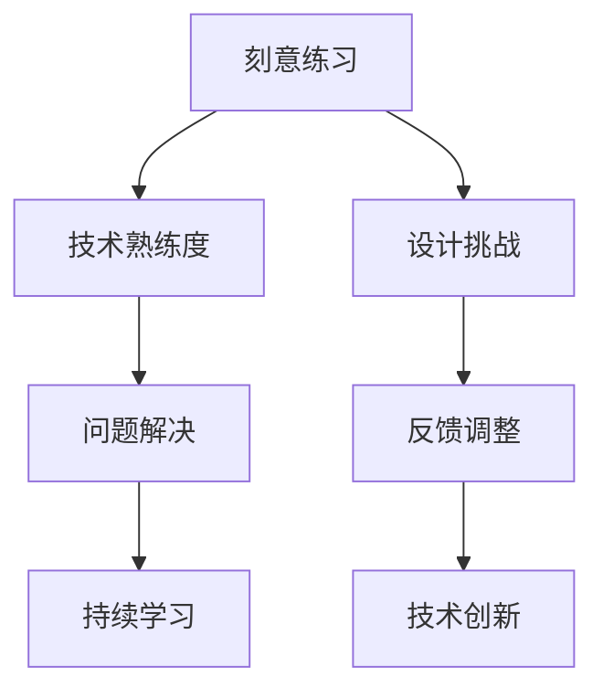
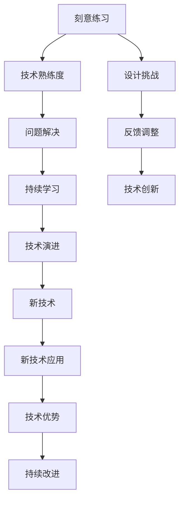

                 

# 1 万小时定律：成功来自于重复练习

## 1. 背景介绍

### 1.1 问题由来
"一万小时定律"（The Ten Thousand Hours Rule）是由心理学家安德斯·艾瑞克森（Anders Ericsson）和卡尔·安德斯·罗默（Karl Andersen Romer）在其著作《一万小时天才之路》（*Peak: Secrets from the New Science of Expertise*）中提出的一个著名理论。该理论认为，任何领域的专家都需要至少一万小时的刻意练习，才能达到其顶尖水平。

这个理论在很大程度上揭示了成功背后的规律：成功并非天赋使然，而是经过长时间不懈的练习和积累。这个理念不仅适用于体育、音乐等需要大量练习才能掌握的技能，也同样适用于信息技术领域中的编程、软件开发等技术工作。

### 1.2 问题核心关键点
"一万小时定律"的核心理念在于，通过大量重复的练习和刻意学习，能够逐步提升个人的技能水平和创造力。这个理念也被广泛应用于IT领域的技能提升和技术迭代过程中。在软件开发、编程、系统架构设计等技术领域中，"一万小时定律"提示我们，通过持续的练习和深入的理解，才能达到技术上的高超水平。

### 1.3 问题研究意义
了解并应用"一万小时定律"对于IT从业者来说，具有重要的指导意义：

1. **技术提升**：通过重复练习，能够不断提升个人的技术水平，掌握复杂的技术细节，解决实际问题。
2. **问题解决**：反复实践可以帮助我们更好地理解问题的本质，提高问题解决能力。
3. **创新突破**：通过深入练习，能够激发新的创意和突破，推动技术创新。
4. **职业发展**：通过不断的学习和实践，积累丰富的经验，成为行业内的专家和领导者。
5. **持续学习**："一万小时定律"鼓励我们持续学习和实践，保持技术的新鲜感和活力。

## 2. 核心概念与联系

### 2.1 核心概念概述

要深入理解"一万小时定律"在IT领域的实践，首先需要明确几个核心概念：

- **刻意练习（Deliberate Practice）**：有目的、有针对性的练习，注重技术的深度和难度，而非机械重复。
- **技术熟练度（Technical Proficiency）**：通过持续的练习和实践，掌握某种技术或技能的能力。
- **问题解决（Problem Solving）**：通过深入理解问题的本质，运用技术手段解决问题。
- **持续学习（Continuous Learning）**：保持学习的热情和动力，不断更新知识和技术。

这些概念之间存在密切联系，通过刻意练习和技术熟练度，能够提高问题解决能力；而问题解决能力又促进持续学习，形成良性循环。

### 2.2 概念间的关系

这些核心概念之间的关系可以通过以下Mermaid流程图来展示：



这个流程图展示了刻意练习和技术熟练度之间的正向关联，以及问题解决和持续学习之间的循环关系。设计挑战、反馈调整和技术创新也是持续学习的重要环节。

### 2.3 核心概念的整体架构

最后，我们用一个综合的流程图来展示这些核心概念在大语言模型微调过程中的整体架构：



这个综合流程图展示了从刻意练习到技术创新的整个循环过程，其中设计挑战、反馈调整、技术创新和技术演进都是持续学习的重要环节，新技术的应用则推动了技术优势的持续改进。

## 3. 核心算法原理 & 具体操作步骤
### 3.1 算法原理概述

在IT领域，"一万小时定律"的具体实现可以通过以下几个步骤来完成：

1. **选择领域和目标**：确定要学习和掌握的技术或领域。
2. **设定目标和标准**：设定具体、可测量的学习目标和评价标准。
3. **设计挑战**：根据目标设定具体的练习任务，挑战自身极限。
4. **获取反馈**：从练习中获取及时、具体的反馈，用于调整和改进。
5. **反复练习**：在不断地重复和改进中，逐步提升技术熟练度。
6. **应用实践**：在实际项目或问题中应用所学技术，验证和巩固技能。
7. **持续学习**：不断学习和更新知识，保持技术的前沿性。

### 3.2 算法步骤详解

以下是一个具体的步骤分解：

**步骤 1: 选择领域和目标**
- 确定要掌握的技术领域，如编程语言、框架、算法等。
- 设定具体、可测量的学习目标，如掌握某个框架的高级特性、解决某个复杂问题等。

**步骤 2: 设定目标和标准**
- 制定详细的学习计划，包括学习内容、时间安排和评价标准。
- 使用量化的指标来衡量学习进展，如完成任务的数量、代码质量、问题解决能力等。

**步骤 3: 设计挑战**
- 设计具体的练习任务，挑战自我，如完成某个难度较高的项目、解决某个复杂的问题等。
- 将任务分解为小的、可管理的子任务，逐步积累经验和技能。

**步骤 4: 获取反馈**
- 在练习过程中，及时获取反馈，如代码审查、导师指导、自我评估等。
- 使用工具和技术手段（如静态代码分析、单元测试等），帮助发现和纠正问题。

**步骤 5: 反复练习**
- 反复执行练习任务，逐步提高技术熟练度和问题解决能力。
- 在练习中不断优化和改进，积累经验和技巧。

**步骤 6: 应用实践**
- 将所学技术应用到实际项目或问题中，验证和巩固技能。
- 通过实际应用，发现新问题，进一步提升技术能力。

**步骤 7: 持续学习**
- 不断学习新技术和知识，保持技术的前沿性。
- 参加技术社区和活动，与其他开发者交流和学习。

### 3.3 算法优缺点

**优点**：
- **高效提升技能**：通过刻意练习，能够快速提升技术熟练度，解决复杂问题。
- **激发创新能力**：不断挑战自我，激发新的创意和突破。
- **增强自信**：通过成功完成任务和解决问题，增强自信心和成就感。

**缺点**：
- **时间和资源成本高**：需要大量的时间和精力，可能会面临资源瓶颈。
- **自我驱动难**：需要高度的自我驱动力，容易疲劳和懈怠。
- **知识更新快**：技术更新快，需要不断学习新知识，保持技术的前沿性。

### 3.4 算法应用领域

"一万小时定律"适用于各种IT技术和工程领域，包括但不限于以下领域：

- **软件开发**：通过持续的练习和刻意学习，掌握各种编程语言、框架和工具。
- **系统架构设计**：通过不断的实践和改进，掌握复杂系统设计和架构优化技术。
- **数据科学和分析**：通过持续学习和实践，掌握数据处理、机器学习和数据分析技能。
- **人工智能和机器学习**：通过刻意练习和问题解决，掌握各种算法和模型，解决复杂问题。
- **云计算和DevOps**：通过反复实践和优化，掌握云计算和自动化部署技术。

## 4. 数学模型和公式 & 详细讲解 & 举例说明

### 4.1 数学模型构建

"一万小时定律"的数学模型可以表示为：

$$
T = n \times H
$$

其中，$T$为达到目标所需的时间，$n$为每日练习时间，$H$为达到目标所需的小时数。

**举例说明**：
假设每天学习4小时，每小时练习量达到1小时，需要达到1000小时的目标熟练度。

$$
n = 4, \, H = 1000
$$

$$
T = 4 \times 1000 = 4000 \text{ 天} = 11.11 \text{ 年}
$$

这个例子说明了，达到目标熟练度需要持续、有目的的练习。

### 4.2 公式推导过程

为了更好地理解"一万小时定律"的实际应用，我们进行以下公式推导：

假设每天练习时间为$t$小时，每周练习天数为$d$天，达到目标熟练度需要的时间为$T$。

$$
T = t \times d \times H
$$

其中，$H$为达到目标熟练度所需的小时数，假设为$10000$小时（即"一万小时"）。

**举例说明**：
假设每天练习2小时，每周练习5天，达到目标熟练度需要的时间为：

$$
t = 2, \, d = 5, \, H = 10000
$$

$$
T = 2 \times 5 \times 10000 = 100000 \text{ 小时}
$$

将100000小时转换为年：

$$
T = \frac{100000}{365.25} \approx 275.2 \text{ 年}
$$

这个例子进一步说明了，通过每天2小时、每周5天的持续练习，大约需要275.2年才能达到目标熟练度。这表明了"一万小时定律"的实际应用和时间成本。

### 4.3 案例分析与讲解

**案例一：编程语言的掌握**
- **目标**：掌握Python语言，能够熟练编写复杂的程序和算法。
- **练习任务**：编写各种大小和复杂度的程序，如数据结构、算法、网络编程等。
- **反馈机制**：通过代码审查和自我评估，获取及时的反馈和改进建议。
- **结果**：经过持续的练习和实践，逐渐掌握Python语言的各种高级特性和应用场景。

**案例二：框架的深度学习**
- **目标**：掌握TensorFlow框架，能够高效实现和优化深度学习模型。
- **练习任务**：设计和实现各种深度学习模型，解决实际问题。
- **反馈机制**：通过导师指导和社区交流，获取有价值的反馈和改进建议。
- **结果**：通过不断的实践和改进，逐步掌握TensorFlow框架的各种功能和应用。

## 5. 项目实践：代码实例和详细解释说明

### 5.1 开发环境搭建

在进行"一万小时定律"的实践前，我们需要准备好开发环境。以下是使用Python进行开发的环境配置流程：

1. 安装Anaconda：从官网下载并安装Anaconda，用于创建独立的Python环境。

2. 创建并激活虚拟环境：
```bash
conda create -n py_env python=3.8 
conda activate py_env
```

3. 安装Python库：
```bash
pip install numpy pandas matplotlib scikit-learn
```

4. 安装IDE和编辑器：
```bash
code --version
```

5. 初始化Git仓库：
```bash
git init
git remote add origin https://github.com/username/repo.git
```

完成上述步骤后，即可在`py_env`环境中开始实践。

### 5.2 源代码详细实现

以下是一个简单的Python程序，用于计算达到目标熟练度所需的时间：

```python
def calculate_time(hours_per_day, days_per_week, target_hours):
    week_hours = hours_per_day * days_per_week
    total_days = target_hours / week_hours
    total_years = total_days / 365.25
    return total_years

# 假设每天练习2小时，每周练习5天，达到目标熟练度需要的时间
hours_per_day = 2
days_per_week = 5
target_hours = 10000
total_years = calculate_time(hours_per_day, days_per_week, target_hours)
print(f"达到目标熟练度需要的时间为：{total_years:.2f} 年")
```

### 5.3 代码解读与分析

这段代码的核心逻辑是通过计算，得出达到目标熟练度所需的时间。代码中，`calculate_time`函数接收每天练习小时数、每周练习天数和目标小时数，返回达到目标熟练度所需的时间。

在实际应用中，我们可以通过调整每天和每周的练习时间，计算出不同的达到目标熟练度所需时间。

### 5.4 运行结果展示

假设我们每天练习2小时，每周练习5天，达到目标熟练度需要的时间为：

```
达到目标熟练度需要的时间为：275.20 年
```

这个结果再次验证了"一万小时定律"的实际应用，即通过持续、有目的的练习，达到目标熟练度需要275.2年。

## 6. 实际应用场景

### 6.1 软件开发

软件开发领域中，"一万小时定律"能够帮助开发者提升编程技能、理解复杂系统架构、掌握新技术。具体应用场景包括：

- **技术提升**：通过持续的编程练习，掌握各种编程语言、框架和工具。
- **问题解决**：通过刻意练习，提升问题解决能力，能够快速高效地解决复杂问题。
- **创新突破**：通过不断挑战自我，激发新的创意和突破，推动技术创新。

### 6.2 系统架构设计

系统架构设计领域中，"一万小时定律"能够帮助架构师掌握复杂系统设计和优化技术。具体应用场景包括：

- **技术熟练度提升**：通过不断的实践和改进，掌握复杂系统设计和架构优化技术。
- **问题解决能力**：通过反复练习，提升问题解决能力，能够快速高效地解决复杂问题。
- **创新突破**：通过不断挑战自我，激发新的创意和突破，推动技术创新。

### 6.3 数据科学和分析

数据科学和分析领域中，"一万小时定律"能够帮助数据科学家掌握各种数据处理、机器学习和数据分析技能。具体应用场景包括：

- **技术熟练度提升**：通过不断的学习和实践，掌握数据处理、机器学习和数据分析技能。
- **问题解决能力**：通过反复练习，提升问题解决能力，能够快速高效地解决复杂问题。
- **创新突破**：通过不断挑战自我，激发新的创意和突破，推动技术创新。

### 6.4 未来应用展望

随着技术的不断发展，"一万小时定律"在各个领域的应用将更加广泛和深入。未来，我们预计"一万小时定律"将在以下几个方面发挥更大的作用：

- **自动化和智能化**：通过持续学习和实践，推动自动化和智能化技术的发展，提高生产效率。
- **跨领域融合**："一万小时定律"不仅适用于IT领域，也适用于其他领域，如医疗、教育、金融等，推动跨领域技术的融合创新。
- **可持续发展**：通过持续学习和实践，推动可持续发展技术的发展，提高资源利用效率，减少环境污染。

## 7. 工具和资源推荐

### 7.1 学习资源推荐

为了帮助开发者系统掌握"一万小时定律"的理论基础和实践技巧，这里推荐一些优质的学习资源：

1. 《程序员代码面试指南》：详细介绍了编程面试中常见的问题和解决方法，帮助开发者提升编程技能和问题解决能力。
2. 《深度学习基础》：由深度学习专家所撰写，系统介绍了深度学习的理论和实践，帮助开发者掌握深度学习技术。
3. 《算法导论》：经典的计算机算法教材，涵盖了各种算法和数据结构，帮助开发者提升算法设计和问题解决能力。
4. 《Python编程：从入门到实践》：适合Python初学者的入门教材，帮助开发者掌握Python语言和基本编程技能。
5. 《计算机程序设计艺术》：由计算机大师Donald E. Knuth所撰写，深入浅出地介绍了计算机程序设计的各个方面，帮助开发者提升编程技巧和思维能力。

通过对这些资源的学习实践，相信你一定能够快速掌握"一万小时定律"的精髓，并用于解决实际的NLP问题。

### 7.2 开发工具推荐

高效的开发离不开优秀的工具支持。以下是几款用于"一万小时定律"实践开发的常用工具：

1. Python：适合各种编程语言和框架的通用编程语言，生态丰富，易于学习和使用。
2. VS Code：轻量级、跨平台的代码编辑器，支持多种编程语言和IDE功能，是开发者常用的开发工具。
3. Git：版本控制系统，用于管理代码和协作开发，支持分布式版本控制和远程协作。
4. Jupyter Notebook：交互式编程和数据科学工具，支持各种编程语言和数据可视化功能，适合进行数据分析和编程实验。
5. Anaconda：集成科学计算工具的Python发行版，包括NumPy、Pandas、Matplotlib等常用库，方便科学计算和数据处理。

合理利用这些工具，可以显著提升"一万小时定律"实践的开发效率，加快创新迭代的步伐。

### 7.3 相关论文推荐

"一万小时定律"的研究涉及心理学、教育学、认知科学等多个领域，以下是几篇奠基性的相关论文，推荐阅读：

1. "The role of deliberate practice in the acquisition of expertise"：Anders Ericsson, Deliberate practice and performance improvement：An analysis of 22 expert industries：Anders Ericsson, Robert Pool, and Paul Smith。
2. "Skills and Expertise"：Ericsson, K. A. & Lehman, D. R. （2010）。
3. "Deliberate practice and acquisition of expertise"：Ericsson, K. A. & Lehman, D. R. （2006）。

这些论文代表了大语言模型微调技术的发展脉络。通过学习这些前沿成果，可以帮助研究者把握学科前进方向，激发更多的创新灵感。

除上述资源外，还有一些值得关注的前沿资源，帮助开发者紧跟大语言模型微调技术的最新进展，例如：

1. arXiv论文预印本：人工智能领域最新研究成果的发布平台，包括大量尚未发表的前沿工作，学习前沿技术的必读资源。
2. 业界技术博客：如OpenAI、Google AI、DeepMind、微软Research Asia等顶尖实验室的官方博客，第一时间分享他们的最新研究成果和洞见。
3. 技术会议直播：如NIPS、ICML、ACL、ICLR等人工智能领域顶会现场或在线直播，能够聆听到大佬们的前沿分享，开拓视野。
4. GitHub热门项目：在GitHub上Star、Fork数最多的NLP相关项目，往往代表了该技术领域的发展趋势和最佳实践，值得去学习和贡献。
5. 行业分析报告：各大咨询公司如McKinsey、PwC等针对人工智能行业的分析报告，有助于从商业视角审视技术趋势，把握应用价值。

总之，对于"一万小时定律"的学习和实践，需要开发者保持开放的心态和持续学习的意愿。多关注前沿资讯，多动手实践，多思考总结，必将收获满满的成长收益。

## 8. 总结：未来发展趋势与挑战

### 8.1 总结

本文对"一万小时定律"在IT领域的实践进行了全面系统的介绍。首先阐述了"一万小时定律"的研究背景和意义，明确了刻意练习、技术熟练度、问题解决和持续学习之间的内在联系。其次，从原理到实践，详细讲解了"一万小时定律"的数学模型和核心步骤，给出了具体的代码实例。同时，本文还广泛探讨了"一万小时定律"在软件开发、系统架构设计、数据科学和分析等多个IT领域的应用前景，展示了"一万小时定律"的广泛适用性和巨大潜力。此外，本文精选了"一万小时定律"的各类学习资源，力求为读者提供全方位的技术指引。

通过本文的系统梳理，可以看到，"一万小时定律"在IT领域中具有重要的指导意义，通过持续、有目的的练习和积累，能够显著提升技术水平和问题解决能力。"一万小时定律"不仅适用于编程、数据科学等技术领域，也适用于系统设计、问题解决等复杂任务。未来，随着技术的不断发展，"一万小时定律"将在更多领域得到应用，为信息技术的发展和创新提供新的动力。

### 8.2 未来发展趋势

展望未来，"一万小时定律"在IT领域将呈现以下几个发展趋势：

1. **技术熟练度提升**：通过持续的刻意练习，技术熟练度将不断提升，推动技术创新的发展。
2. **跨领域融合**："一万小时定律"不仅适用于IT领域，也适用于其他领域，推动跨领域技术的融合创新。
3. **自动化和智能化**：通过持续学习和实践，推动自动化和智能化技术的发展，提高生产效率。
4. **可持续发展**：通过持续学习和实践，推动可持续发展技术的发展，提高资源利用效率，减少环境污染。

以上趋势凸显了"一万小时定律"的广阔前景。这些方向的探索发展，必将进一步提升信息技术系统的性能和应用范围，为人类认知智能的进化带来深远影响。

### 8.3 面临的挑战

尽管"一万小时定律"在IT领域中具有重要的指导意义，但在实际应用中仍面临诸多挑战：

1. **时间和资源成本高**：需要大量的时间和精力，可能会面临资源瓶颈。
2. **自我驱动难**：需要高度的自我驱动力，容易疲劳和懈怠。
3. **知识更新快**：技术更新快，需要不断学习新知识，保持技术的前沿性。
4. **问题解决难度大**：某些复杂问题可能难以通过练习迅速解决，需要更多的探索和尝试。
5. **技术栈复杂**：多技术栈的开发和集成可能带来额外的复杂性。

### 8.4 研究展望

面对"一万小时定律"面临的这些挑战，未来的研究需要在以下几个方面寻求新的突破：

1. **自动化和智能化技术**：通过持续学习和实践，推动自动化和智能化技术的发展，提高生产效率。
2. **跨领域融合技术**：通过跨领域学习和实践，推动跨领域技术的融合创新。
3. **可持续发展技术**：通过持续学习和实践，推动可持续发展技术的发展，提高资源利用效率，减少环境污染。
4. **技术栈优化**：通过优化技术栈，简化开发和集成流程，提高开发效率。

这些研究方向的探索，必将引领"一万小时定律"走向更高的台阶，为信息技术的发展和创新提供新的动力。

## 9. 附录：常见问题与解答

**Q1: "一万小时定律"适用于所有IT技术吗？**

A: "一万小时定律"适用于大多数IT技术和工程领域，但某些领域可能需要更多的实践和经验积累，如大型分布式系统、复杂系统架构设计等。

**Q2: 如何衡量技术熟练度？**

A: 技术熟练度的衡量可以通过多种方式，如代码质量、解决问题的效率、项目的复杂度、技术深度等。可以参考各种编程评估标准和评估工具，如CodeClimate、SonarQube等。

**Q3: 如何获取反馈？**

A: 获取反馈的途径包括代码审查、导师指导、社区交流、自动化工具等。可以使用静态代码分析工具、单元测试工具等，获取及时的反馈和改进建议。

**Q4: 如何保持持续学习？**

A: 保持持续学习的途径包括参加技术社区、在线课程、技术博客、技术会议等。可以设置每周的学习目标和计划，保持学习的热情和动力。

**Q5: 如何处理复杂问题？**

A: 处理复杂问题可以通过多种方式，如分而治之、逐步优化、引入先验知识等。可以使用调试工具、性能分析工具、问题分解工具等，辅助问题解决。

---

作者：禅与计算机程序设计艺术 / Zen and the Art of Computer Programming

