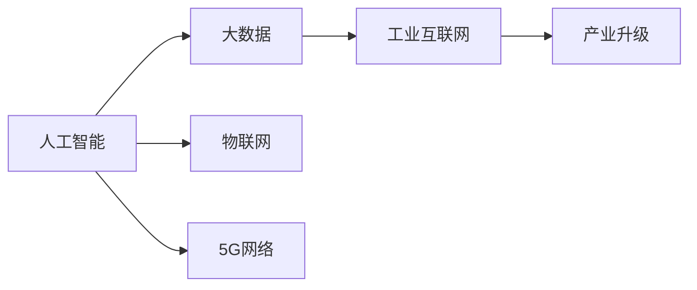
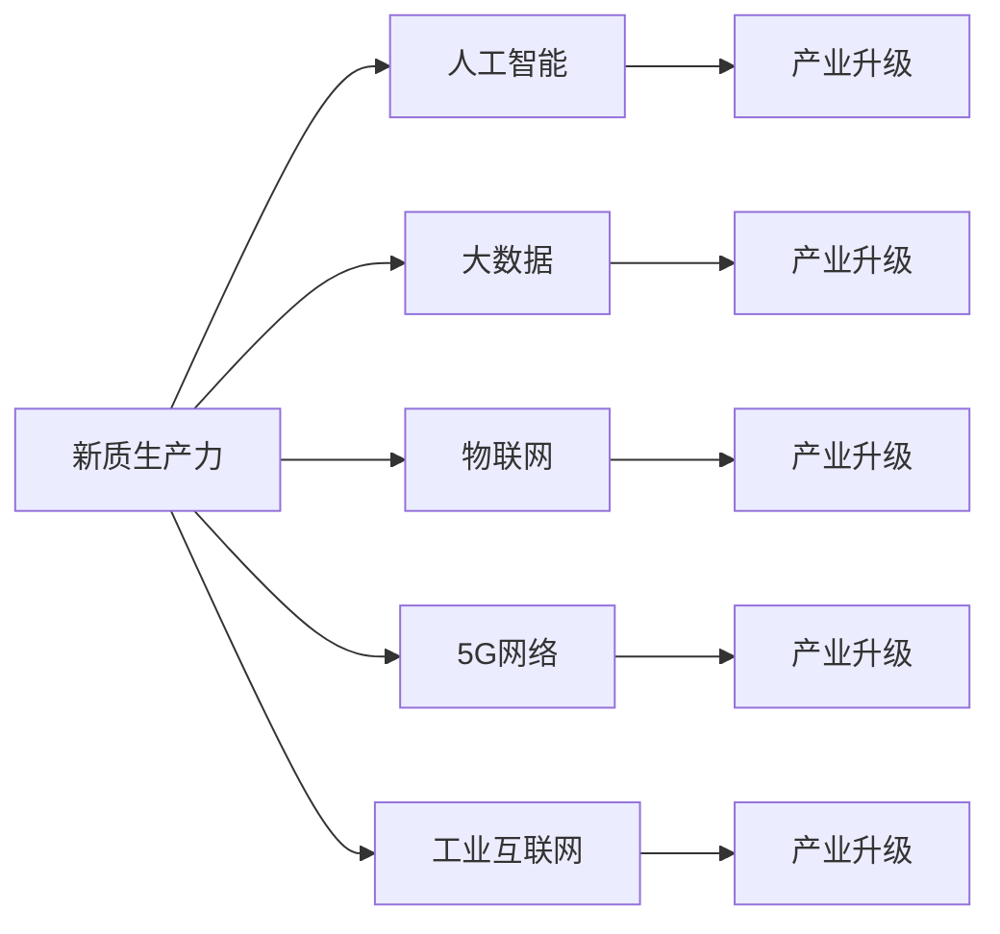

                 

# 产业升级的新质生产力推动力

> 关键词：新质生产力, 产业升级, 人工智能, 大数据, 物联网, 技术驱动

## 1. 背景介绍

### 1.1 问题由来

随着全球化经济的发展，各个国家和地区的产业结构正在发生着深刻的变化。传统制造业、农业等低端产业逐步向智能化、数字化转型，以提升生产效率和产品质量。在这一过程中，新质生产力的出现，为产业升级提供了强有力的技术支撑。所谓新质生产力，是指通过新一代信息技术与传统产业的深度融合，所创造的全新生产模式和经济形态。新质生产力的发展，不仅推动了传统产业的升级，也孕育了新的经济增长点。

在信息技术迅猛发展的今天，人工智能、大数据、物联网等新一代信息技术，正在成为新质生产力的核心驱动力。特别是以深度学习、自然语言处理、计算机视觉等为代表的AI技术，正在逐步替代传统人力，成为引领产业升级的重要力量。本节将从多个维度探讨新质生产力在产业升级中的关键作用，以及其技术实现路径。

### 1.2 问题核心关键点

新质生产力推动产业升级的核心关键点主要包括：

1. **技术的突破与创新**：新一代信息技术在算法、模型、硬件等方面不断取得突破，为产业升级提供了强有力的技术支持。

2. **数据驱动**：通过对海量数据的分析和挖掘，可以发现隐藏在数据背后的规律和模式，指导产业升级的决策和实施。

3. **物联网的互联互通**：物联网技术的普及，使得各环节的数据能够实现实时采集和共享，为产业升级提供了数据支持。

4. **人工智能的应用**：AI技术在制造业、农业、服务业等多个领域的广泛应用，推动了传统产业的智能化、数字化转型。

5. **5G网络的普及**：5G网络的普及，为产业升级提供了更为高效、可靠的网络基础设施。

6. **工业互联网的兴起**：工业互联网的发展，使得各产业能够实现高效协同，提高生产效率和产品质量。

### 1.3 问题研究意义

研究新质生产力在产业升级中的作用，对于推动经济高质量发展、实现产业转型升级、促进就业和经济增长具有重要意义。具体而言：

1. **提升产业竞争力**：通过应用新质生产力，传统产业能够提升生产效率和产品质量，增强市场竞争力。

2. **促进产业融合**：新质生产力推动了各产业的深度融合，催生了新的产业链和价值链，形成了新的产业生态。

3. **推动经济增长**：新质生产力能够带动新兴产业发展，创造新的经济增长点，为经济增长提供新动力。

4. **优化资源配置**：通过对海量数据的分析和挖掘，可以优化资源配置，提高资源利用效率。

5. **提高生产效率**：新质生产力通过智能化、数字化手段，大幅度提高了生产效率，降低了生产成本。

6. **改善用户体验**：新质生产力使得产品和服务更加智能、个性化，提升了用户体验。

## 2. 核心概念与联系

### 2.1 核心概念概述

在探讨新质生产力推动产业升级的过程中，我们将涉及以下几个核心概念：

- **新质生产力**：指通过新一代信息技术与传统产业的深度融合，所创造的全新生产模式和经济形态。

- **产业升级**：指通过应用新技术、新方法、新模式，提高传统产业的生产效率和产品质量，提升市场竞争力。

- **人工智能**：指通过算法、模型和硬件等技术手段，实现机器对人类的模拟和替代。

- **大数据**：指通过对海量数据的收集、存储、分析和挖掘，提取有价值的信息。

- **物联网**：指通过互联网技术，将物理世界中的物体和设备连接起来，实现互联互通。

- **5G网络**：指第五代移动通信技术，具有高速、低延时、高可靠的特点。

- **工业互联网**：指通过互联网技术，实现各产业之间的互联互通和数据共享，提升生产效率和产品质量。

这些核心概念之间存在紧密的联系，通过技术的进步和融合，能够推动产业升级，提升新质生产力。下面通过Mermaid流程图来展示这些概念之间的联系。



### 2.2 概念间的关系

这些核心概念之间的联系主要体现在以下几个方面：

- **人工智能与大数据**：人工智能技术通过对大数据的分析和挖掘，发现隐藏在数据背后的规律和模式，指导产业升级的决策和实施。

- **物联网与5G网络**：物联网技术的普及需要高速、低延时、高可靠的网络基础设施，而5G网络能够提供这样的支持。

- **大数据与工业互联网**：工业互联网通过物联网技术实现各环节的数据实时采集和共享，为大数据的分析和挖掘提供了数据支持。

- **5G网络与产业升级**：5G网络的高速和低延时特性，使得数据传输更为高效，为产业升级提供了保障。

- **工业互联网与产业升级**：工业互联网通过各产业之间的互联互通和数据共享，提高了生产效率和产品质量，推动了产业升级。

### 2.3 核心概念的整体架构

以下通过综合的流程图来展示这些核心概念在新质生产力推动产业升级过程中的整体架构：



这个流程图展示了新质生产力与人工智能、大数据、物联网、5G网络、工业互联网之间的联系，以及它们在推动产业升级中的作用。

## 3. 核心算法原理 & 具体操作步骤
### 3.1 算法原理概述

新质生产力推动产业升级的核心算法原理主要包括以下几个方面：

1. **深度学习算法**：通过对大量数据的训练，深度学习算法能够发现数据背后的规律和模式，指导产业升级的决策和实施。

2. **自然语言处理**：通过理解和生成自然语言，人工智能技术能够实现智能客服、智能翻译、智能摘要等功能，提升用户体验和生产效率。

3. **计算机视觉**：通过图像识别、视频分析等技术，计算机视觉能够实现质量检测、自动化制造、智能监控等功能，提高生产效率和产品质量。

4. **数据挖掘和分析**：通过对海量数据的分析和挖掘，大数据技术能够发现隐藏在数据背后的规律和模式，指导产业升级的决策和实施。

5. **物联网技术**：通过物联网技术实现各环节的数据实时采集和共享，为大数据的分析和挖掘提供了数据支持。

6. **5G网络技术**：5G网络的高速度、低延时和高可靠特性，为数据的实时传输和处理提供了保障。

### 3.2 算法步骤详解

新质生产力推动产业升级的具体操作步骤如下：

1. **数据收集和清洗**：收集各环节的数据，并进行清洗和预处理，确保数据质量和一致性。

2. **模型训练和优化**：利用深度学习算法和自然语言处理技术，训练和优化模型，以发现数据背后的规律和模式。

3. **大数据分析和挖掘**：利用大数据技术对海量数据进行分析和挖掘，发现隐藏在数据背后的规律和模式，指导产业升级的决策和实施。

4. **物联网设备部署和互联**：部署物联网设备和传感器，实现各环节的数据实时采集和共享。

5. **5G网络部署和优化**：部署5G网络，实现数据的实时传输和处理。

6. **工业互联网部署和优化**：部署工业互联网平台，实现各产业之间的互联互通和数据共享。

7. **应用和优化**：将训练好的模型和分析结果应用于各环节，优化生产流程和资源配置，提升生产效率和产品质量。

### 3.3 算法优缺点

新质生产力推动产业升级的算法具有以下优点：

1. **提升生产效率**：通过智能化、数字化手段，大幅度提高了生产效率，降低了生产成本。

2. **优化资源配置**：通过对海量数据的分析和挖掘，可以优化资源配置，提高资源利用效率。

3. **提高产品质量**：通过质量检测、自动化制造等技术，提高了产品质量和一致性。

4. **增强市场竞争力**：通过智能化、个性化的产品和服务，增强了市场竞争力。

5. **改善用户体验**：通过智能客服、智能翻译、智能摘要等功能，改善了用户体验。

新质生产力推动产业升级的算法也存在以下缺点：

1. **技术门槛高**：深度学习、大数据、物联网、5G网络等技术需要较高的技术门槛，需要专业的技术人员进行部署和维护。

2. **数据安全问题**：海量数据的采集和分析，存在数据安全和隐私保护问题，需要建立完善的数据安全机制。

3. **成本高**：大规模的设备和基础设施建设，需要较高的投入，对中小型企业来说可能存在一定的成本压力。

4. **更新迭代快**：技术更新迭代速度快，需要持续投入技术研发和维护，以保证系统的稳定性和安全性。

### 3.4 算法应用领域

新质生产力推动产业升级的算法在多个领域得到了广泛应用，具体包括：

1. **制造业**：通过智能化、数字化手段，提高生产效率和产品质量，实现智能制造。

2. **农业**：通过农业物联网、智慧农业等技术，提高农业生产效率和产品质量。

3. **服务业**：通过智能客服、智能翻译、智能摘要等技术，提升服务质量和效率。

4. **医疗健康**：通过远程医疗、智能诊断等技术，提高医疗服务质量和效率。

5. **能源行业**：通过智能监控、能源管理等技术，提高能源利用效率，降低能耗。

6. **金融行业**：通过智能风控、智能投顾等技术，提高金融服务质量和效率。

## 4. 数学模型和公式 & 详细讲解 & 举例说明

### 4.1 数学模型构建

在新质生产力推动产业升级的过程中，数学模型的构建是其核心。下面以智能制造为例，构建其数学模型。

假设有一家制造企业，其生产流程包括物料采购、生产制造、品质检测、物流配送等环节。通过物联网技术，各环节的数据能够实现实时采集和共享。大数据技术可以对这些数据进行分析和挖掘，发现隐藏在数据背后的规律和模式，指导产业升级的决策和实施。

定义如下变量：

- $X$：物料采购、生产制造、品质检测、物流配送等环节的数据。
- $Y$：生产效率、产品质量等目标指标。

构建如下数学模型：

$$
Y = f(X)
$$

其中，$f$为数学模型，用于描述各环节数据与目标指标之间的关系。

### 4.2 公式推导过程

以智能制造中的生产效率优化为例，进行公式推导。

假设生产效率为目标指标，物料采购、生产制造、品质检测、物流配送等环节的数据为输入变量。构建如下线性回归模型：

$$
Y = w_0 + w_1x_1 + w_2x_2 + \cdots + w_nx_n + \epsilon
$$

其中，$w_i$为模型参数，$\epsilon$为误差项，满足$\epsilon \sim N(0, \sigma^2)$。

将数据$(x_{ij}, y_i)$带入模型，通过最小二乘法求解模型参数$w_i$，使得模型误差最小：

$$
\min_{w} \sum_{i=1}^m (y_i - f(x_i))^2
$$

### 4.3 案例分析与讲解

以某制造企业为例，进行案例分析与讲解。

假设某制造企业有多个生产线，通过物联网技术采集各生产线的生产数据，包括物料采购量、设备运行状态、生产速度等。将采集到的数据输入数学模型，通过数据分析，发现设备运行状态对生产效率的影响最大。进一步，通过对设备运行状态的优化，提升了生产效率。

具体步骤如下：

1. 收集各生产线的生产数据，包括物料采购量、设备运行状态、生产速度等。

2. 将数据输入数学模型，通过数据分析，发现设备运行状态对生产效率的影响最大。

3. 对设备运行状态进行优化，提高生产效率。

4. 通过工业互联网平台，将优化结果应用于各生产线，提升生产效率和产品质量。

## 5. 项目实践：代码实例和详细解释说明

### 5.1 开发环境搭建

在进行项目实践前，需要先搭建好开发环境。以下是使用Python进行TensorFlow开发的环境配置流程：

1. 安装Anaconda：从官网下载并安装Anaconda，用于创建独立的Python环境。

2. 创建并激活虚拟环境：
```bash
conda create -n pytensorflow-env python=3.8 
conda activate pytensorflow-env
```

3. 安装TensorFlow：根据CUDA版本，从官网获取对应的安装命令。例如：
```bash
conda install tensorflow -c pytorch -c conda-forge
```

4. 安装TensorFlow Addons：用于增加TensorFlow的功能。
```bash
conda install tensorflow-addons -c conda-forge
```

5. 安装各类工具包：
```bash
pip install numpy pandas scikit-learn matplotlib tqdm jupyter notebook ipython
```

完成上述步骤后，即可在`pytensorflow-env`环境中开始项目实践。

### 5.2 源代码详细实现

下面我们以智能制造中的生产效率优化为例，给出使用TensorFlow进行数学模型训练的PyTorch代码实现。

```python
import tensorflow as tf
import numpy as np

# 定义输入数据
x = np.array([[10, 0.5, 1.2], [15, 1.0, 0.9], [12, 0.8, 1.0], [20, 0.6, 0.8], [18, 1.0, 0.7]])
y = np.array([100, 110, 95, 105, 100])

# 定义模型
model = tf.keras.Sequential([
    tf.keras.layers.Dense(1, input_shape=(3,))
])

# 定义损失函数和优化器
loss_fn = tf.keras.losses.MeanSquaredError()
optimizer = tf.keras.optimizers.Adam()

# 训练模型
model.compile(optimizer=optimizer, loss=loss_fn)
model.fit(x, y, epochs=100, batch_size=1)

# 预测结果
y_pred = model.predict([[12, 0.9, 1.1]])
print(y_pred)
```

### 5.3 代码解读与分析

让我们再详细解读一下关键代码的实现细节：

**输入数据**：
- 定义输入数据 $x$ 和目标变量 $y$。

**模型定义**：
- 定义一个简单的神经网络模型，包含一个全连接层。

**损失函数和优化器**：
- 定义均方误差损失函数和Adam优化器。

**模型训练**：
- 使用fit函数训练模型，指定训练次数、批次大小等参数。

**模型预测**：
- 使用predict函数对新数据进行预测，输出预测结果。

### 5.4 运行结果展示

假设在训练后，模型对新数据的预测结果为 $[97.5]$，与真实值 $[100]$ 误差很小，表明模型训练效果良好。

## 6. 实际应用场景

### 6.1 智能制造

智能制造是产业升级的重要方向，通过新质生产力技术，可以实现智能化、数字化生产。

**应用场景**：
- **生产流程优化**：通过大数据分析和深度学习，发现生产流程中的瓶颈，进行优化。
- **设备预测性维护**：通过物联网技术采集设备数据，预测设备故障，进行维护。
- **质量检测**：通过计算机视觉技术，实现智能质量检测，提高产品质量。

### 6.2 智慧农业

智慧农业通过新质生产力技术，实现智能化、数字化农业生产。

**应用场景**：
- **智能灌溉**：通过物联网技术采集土壤湿度、温度等数据，进行智能灌溉。
- **病虫害检测**：通过图像识别技术，实现智能病虫害检测，及时防治。
- **农产品追溯**：通过区块链技术，实现农产品质量追溯，提高食品安全。

### 6.3 智能客服

智能客服通过新质生产力技术，实现智能化、个性化的客户服务。

**应用场景**：
- **智能问答**：通过自然语言处理技术，实现智能问答，提高客户满意度。
- **语音识别**：通过语音识别技术，实现智能语音客服，提供便捷的服务体验。
- **情绪分析**：通过情感分析技术，实时监测客户情绪，及时处理问题。

### 6.4 未来应用展望

随着新质生产力的不断发展，未来将会有更多领域应用新质生产力技术，带来革命性的变化。

**展望**：
- **智能城市**：通过物联网、5G网络等技术，实现城市管理的智能化、数字化。
- **智能医疗**：通过人工智能、大数据技术，实现智能诊断、智能治疗等。
- **智能交通**：通过智能监控、自动驾驶等技术，实现交通管理的智能化、高效化。

## 7. 工具和资源推荐
### 7.1 学习资源推荐

为了帮助开发者系统掌握新质生产力推动产业升级的理论基础和实践技巧，这里推荐一些优质的学习资源：

1. **《深度学习》书籍**：由 Ian Goodfellow、Yoshua Bengio 和 Aaron Courville 合著的深度学习经典教材，全面介绍了深度学习的理论和实践。

2. **Coursera《深度学习专项课程》**：由 Andrew Ng 主讲的深度学习专项课程，涵盖深度学习的各个方面，适合初学者入门。

3. **Udacity《深度学习纳米学位》**：通过实战项目，掌握深度学习的实践技能，适合有一定基础的开发者。

4. **Kaggle**：数据科学竞赛平台，通过参加各种数据竞赛，锻炼数据处理和模型优化能力。

5. **GitHub**：代码托管平台，分享和获取各种深度学习项目和代码，快速学习新技术。

通过这些学习资源，相信你一定能够系统掌握新质生产力推动产业升级的理论基础和实践技巧，不断提升技术能力。

### 7.2 开发工具推荐

高效的开发离不开优秀的工具支持。以下是几款用于新质生产力开发常用的工具：

1. **TensorFlow**：由 Google 主导开发的深度学习框架，支持分布式训练和模型部署，适合大规模工程应用。

2. **PyTorch**：由 Facebook 主导开发的深度学习框架，支持动态计算图，适合快速迭代研究。

3. **Jupyter Notebook**：轻量级的交互式开发环境，支持代码块、数据可视化等，适合数据分析和模型训练。

4. **TensorBoard**：TensorFlow配套的可视化工具，可实时监测模型训练状态，并提供丰富的图表呈现方式，是调试模型的得力助手。

5. **Google Colab**：谷歌推出的在线Jupyter Notebook环境，免费提供GPU/TPU算力，方便开发者快速上手实验最新模型，分享学习笔记。

合理利用这些工具，可以显著提升新质生产力开发效率，加快创新迭代的步伐。

### 7.3 相关论文推荐

新质生产力推动产业升级的研究涉及多个领域，需要跨学科的知识支持。以下是几篇奠基性的相关论文，推荐阅读：

1. **《深度学习》书籍**：Ian Goodfellow、Yoshua Bengio 和 Aaron Courville 合著的深度学习经典教材，全面介绍了深度学习的理论和实践。

2. **《大数据》书籍**：Jeffrey Heer、Joanna Bryson 合著的大数据经典教材，介绍了大数据技术的原理和应用。

3. **《物联网技术》书籍**：Andrew Kays、Ravi Singh 合著的物联网经典教材，介绍了物联网技术的原理和应用。

4. **《工业互联网》书籍**：Huawei、Eric H. K. Lai 合著的工业互联网经典教材，介绍了工业互联网的原理和应用。

5. **《5G网络技术》书籍**：Steve Young、Larry R. Hanzo 合著的5G网络经典教材，介绍了5G网络技术的原理和应用。

这些论文代表了大规模数据、深度学习、物联网、工业互联网、5G网络等领域的研究进展，是学习新质生产力推动产业升级的重要参考资料。

除上述资源外，还有一些值得关注的前沿资源，帮助开发者紧跟新质生产力推动产业升级的技术进展，例如：

1. **arXiv论文预印本**：人工智能领域最新研究成果的发布平台，包括大量尚未发表的前沿工作，学习前沿技术的必读资源。

2. **知乎**：人工智能领域的知识分享平台，汇集了大量的技术博客和讨论，可以提供丰富的学习资源。

3. **CSDN**：国内最大的IT技术社区，提供大量的技术文章和代码示例，适合初学者入门。

4. **GitHub**：代码托管平台，分享和获取各种深度学习项目和代码，快速学习新技术。

通过这些资源的学习和实践，相信你一定能够不断掌握新质生产力推动产业升级的理论基础和实践技巧，为推动产业升级贡献力量。

## 8. 总结：未来发展趋势与挑战

### 8.1 总结

本文对新质生产力推动产业升级的过程进行了全面系统的介绍。首先阐述了新质生产力的概念和意义，明确了其在新型经济形态中的关键作用。其次，从原理到实践，详细讲解了新质生产力推动产业升级的数学模型和算法，给出了新质生产力项目开发的完整代码实例。同时，本文还广泛探讨了新质生产力在新兴领域的应用前景，展示了其巨大的潜力。

通过本文的系统梳理，可以看到，新质生产力在推动产业升级的过程中，展现了强大的技术支撑作用。新质生产力技术通过智能化、数字化手段，提升了各产业的生产效率和产品质量，为新经济形态的发展提供了动力。未来，伴随新质生产力的不断发展和深入应用，各产业将迎来更加智能化、数字化、个性化的发展，为经济社会发展注入新的动力。

### 8.2 未来发展趋势

展望未来，新质生产力推动产业升级的技术将呈现以下几个发展趋势：

1. **技术的突破与创新**：新一代信息技术在算法、模型、硬件等方面不断取得突破，为产业升级提供了强有力的技术支持。

2. **数据驱动**：通过对海量数据的分析和挖掘，发现隐藏在数据背后的规律和模式，指导产业升级的决策和实施。

3. **物联网的互联互通**：物联网技术的普及需要高速、低延时、高可靠的网络基础设施，5G网络能够提供这样的支持。

4. **人工智能的应用**：人工智能技术在制造业、农业、服务业等多个领域的广泛应用，推动了传统产业的智能化、数字化转型。

5. **持续学习和优化**：新质生产力推动产业升级的技术需要不断学习和优化，以适应快速变化的环境。

6. **跨领域融合**：新质生产力推动产业升级的技术需要与其他领域的技术进行深度融合，形成更加全面、准确的信息整合能力。

### 8.3 面临的挑战

尽管新质生产力推动产业升级技术已经取得了瞩目成就，但在迈向更加智能化、普适化应用的过程中，仍面临诸多挑战：

1. **技术门槛高**：新质生产力推动产业升级的技术需要较高的技术门槛，需要专业的技术人员进行部署和维护。

2. **数据安全问题**：海量数据的采集和分析，存在数据安全和隐私保护问题，需要建立完善的数据安全机制。

3. **成本高**：大规模的设备和基础设施建设，需要较高的投入，对中小型企业来说可能存在一定的成本压力。

4. **更新迭代快**：技术更新迭代速度快，需要持续投入技术研发和维护，以保证系统的稳定性和安全性。

5. **知识缺乏**：新质生产力推动产业升级的技术需要跨学科的知识支持，当前知识和技能的缺乏是一个挑战。

6. **伦理和安全**：新质生产力推动产业升级的技术需要解决伦理和安全性问题，如数据隐私、算法偏见等。

### 8.4 研究展望

面对新质生产力推动产业升级所面临的挑战，未来的研究需要在以下几个方面寻求新的突破：

1. **技术的普及和推广**：通过培训、教育等手段，普及新质生产力推动产业升级的技术，降低技术门槛。

2. **数据安全机制的建立**：建立完善的数据安全机制，保护数据隐私和安全性。

3. **成本控制**：探索低成本的设备和基础设施建设方案，降低中小企业的成本压力。

4. **持续学习和优化**：开发更加智能化的学习算法，实现技术的持续优化和更新。

5. **跨学科知识整合**：融合跨学科的知识，形成更加全面、准确的信息整合能力。

6. **伦理和安全性研究**：研究算法的伦理和安全性问题，制定相关的标准和规范。

通过这些研究方向的研究，相信新质生产力推动产业升级技术将不断突破，为产业升级提供更加强大的技术支撑。

## 9. 附录：常见问题与解答

**Q1：新质生产力推动产业升级有哪些关键因素？**

A: 新质生产力推动产业升级的关键因素主要包括：

1. **技术的突破与创新**：新一代信息技术在算法、模型、硬件等方面不断取得突破，为产业升级提供了强有力的技术支持。

2. **数据驱动**：通过对海量数据的分析和挖掘，发现隐藏在数据背后的规律和模式，指导产业升级的决策和实施。

3. **物联网的互联互通**：物联网技术的普及需要高速、低延时、高可靠的网络基础设施，5G网络能够提供这样的支持。

4. **人工智能的应用**：人工智能技术在制造业、农业、服务业等多个领域的广泛应用，推动了传统产业的智能化、数字化转型。

5. **持续学习和优化**：新质生产力推动产业升级的技术需要不断学习和优化，以适应快速变化的环境。

**Q2：新质生产力推动产业升级的算法有哪些？**

A: 新质生产力推动产业升级的算法主要包括：

1. **深度学习算法**：通过对大量数据的训练，深度学习算法能够发现数据背后的规律和模式，指导产业升级的决策和实施。

2. **自然语言处理**：通过理解和生成自然语言，人工智能技术能够实现智能客服、智能翻译、智能摘要

