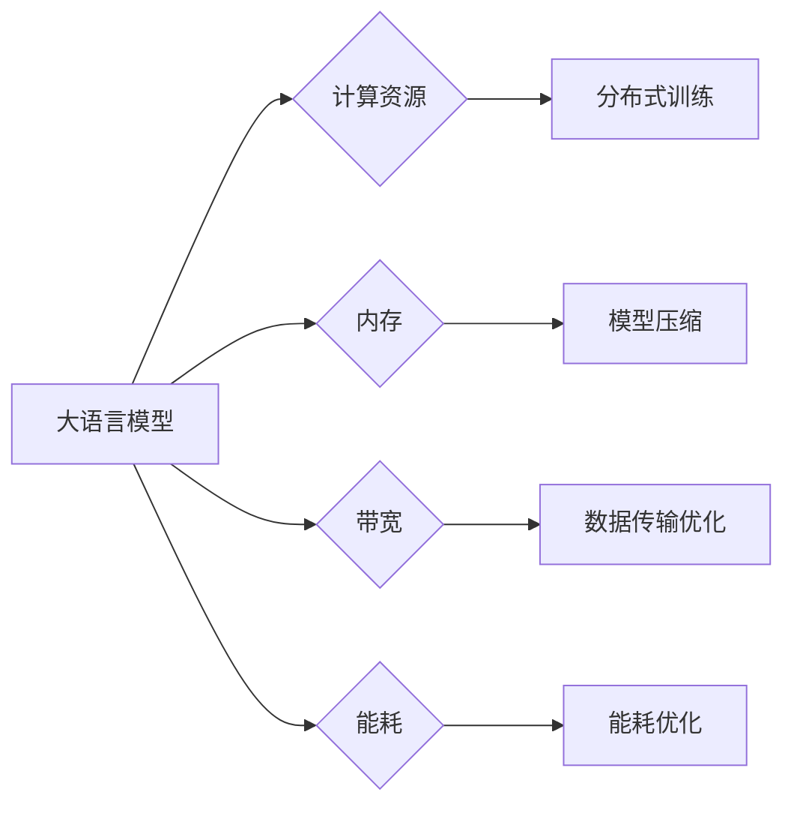

# 大语言模型原理与工程实践：硬件瓶颈

> 关键词：大语言模型，硬件瓶颈，GPU，TPU，分布式训练，模型压缩，量化，加速，内存优化，计算效率

## 1. 背景介绍

随着深度学习技术的迅猛发展，大语言模型（Large Language Models, LLMs）如BERT、GPT-3等在自然语言处理（NLP）领域取得了显著的成果。这些模型通常包含数十亿甚至上千亿的参数，需要巨大的计算资源进行训练和推理。然而，随着模型规模的不断扩大，硬件瓶颈逐渐成为制约LLM发展和应用的主要因素。本文将探讨大语言模型在硬件层面的瓶颈，并提出相应的解决方案。

### 1.1 问题的由来

大语言模型训练和推理过程中，硬件瓶颈主要表现在以下几个方面：

1. **计算资源不足**：大规模模型需要高性能计算资源，如GPU、TPU等，以保证训练和推理的效率。
2. **内存限制**：大规模模型通常需要大量内存来存储模型参数和中间计算结果。
3. **带宽限制**：数据传输速度和容量不足，导致训练和推理过程中数据传输效率低下。
4. **能耗问题**：大规模计算设备能耗巨大，对环境造成较大压力。

### 1.2 研究现状

针对大语言模型硬件瓶颈，研究人员和工程师已经提出了一系列解决方案，主要包括：

1. **分布式训练**：将模型划分成多个部分，在多个计算节点上并行训练，提高训练效率。
2. **模型压缩**：通过剪枝、量化等技术减小模型尺寸，降低计算和存储需求。
3. **硬件加速**：采用专用硬件，如TPU、FPGA等，提高计算效率。
4. **内存优化**：使用高效的内存管理技术，提高内存利用率。
5. **能耗优化**：优化算法和硬件设计，降低能耗。

### 1.3 研究意义

研究大语言模型的硬件瓶颈，对于推动LLM技术的发展和应用具有重要意义：

1. **提高训练和推理效率**：解决硬件瓶颈，可以显著提高大语言模型的训练和推理速度，降低应用成本。
2. **降低能耗**：优化算法和硬件设计，可以降低大语言模型的能耗，减少对环境的影响。
3. **促进技术创新**：解决硬件瓶颈，可以推动相关领域的技术创新，如专用硬件设计、新型计算范式等。

### 1.4 本文结构

本文将围绕大语言模型的硬件瓶颈展开，主要内容包括：

- 核心概念与联系：介绍大语言模型、硬件瓶颈等核心概念，并使用Mermaid流程图展示它们之间的关系。
- 核心算法原理 & 具体操作步骤：详细讲解分布式训练、模型压缩等解决方案的原理和操作步骤。
- 数学模型和公式 & 详细讲解 & 举例说明：介绍分布式训练、模型压缩等方法的数学模型和公式，并结合实例进行讲解。
- 项目实践：提供分布式训练、模型压缩等技术的代码实例和详细解释。
- 实际应用场景：分析大语言模型在各个领域的应用场景，并展望未来发展趋势。
- 工具和资源推荐：推荐学习资源、开发工具和相关论文。
- 总结：总结研究成果，展望未来发展趋势和挑战。

## 2. 核心概念与联系

### 2.1 核心概念

#### 大语言模型（LLMs）

大语言模型是指那些包含数十亿甚至上千亿参数的深度学习模型，能够在自然语言处理领域实现各种任务，如文本分类、问答、机器翻译等。

#### 硬件瓶颈

硬件瓶颈是指在训练和推理过程中，由于硬件资源限制导致的性能瓶颈，如计算资源不足、内存限制、带宽限制和能耗问题。

### 2.2 Mermaid流程图



从图中可以看出，大语言模型在训练和推理过程中会遇到多种硬件瓶颈，而各种解决方案分别针对不同的瓶颈进行优化。

## 3. 核心算法原理 & 具体操作步骤

### 3.1 算法原理概述

#### 分布式训练

分布式训练是指将大规模模型划分成多个部分，在多个计算节点上并行训练，以提高训练效率和降低训练时间。

#### 模型压缩

模型压缩是指通过剪枝、量化等技术减小模型尺寸，降低计算和存储需求，从而提高模型部署效率。

### 3.2 算法步骤详解

#### 3.2.1 分布式训练

分布式训练通常涉及以下步骤：

1. **模型划分**：将大规模模型划分成多个部分，每个部分负责处理输入数据的特定部分。
2. **数据划分**：将训练数据划分成多个批次，每个批次分配给不同的计算节点。
3. **并行计算**：在各个计算节点上并行计算模型参数的梯度。
4. **参数更新**：收集各个计算节点的梯度，更新模型参数。

#### 3.2.2 模型压缩

模型压缩通常涉及以下步骤：

1. **剪枝**：去除模型中不必要的权重，降低模型复杂度。
2. **量化**：将模型参数和中间计算结果从浮点数转换为整数，降低计算和存储需求。
3. **知识蒸馏**：将大型模型的知识迁移到小型模型，提高小型模型的性能。

### 3.3 算法优缺点

#### 3.3.1 分布式训练

**优点**：

- 提高训练效率
- 降低训练时间

**缺点**：

- 需要额外的硬件和软件支持
- 数据同步和通信开销较大

#### 3.3.2 模型压缩

**优点**：

- 降低模型尺寸
- 提高模型部署效率

**缺点**：

- 可能降低模型性能
- 增加模型训练难度

### 3.4 算法应用领域

分布式训练和模型压缩可以应用于各种大语言模型，如BERT、GPT、T5等。

## 4. 数学模型和公式 & 详细讲解 & 举例说明

### 4.1 数学模型构建

#### 4.1.1 分布式训练

分布式训练的数学模型主要涉及参数同步算法，如参数服务器（Parameter Server）和All-reduce算法。

#### 4.1.2 模型压缩

模型压缩的数学模型主要涉及剪枝和量化算法。

### 4.2 公式推导过程

#### 4.2.1 分布式训练

**参数服务器算法**：

假设有 $m$ 个计算节点，每个节点存储模型的一部分参数。参数服务器算法的步骤如下：

1. 计算节点 $i$ 计算梯度 $\nabla_{\theta_i}L(\theta_i)$。
2. 计算节点 $i$ 将梯度 $\nabla_{\theta_i}L(\theta_i)$ 发送至参数服务器。
3. 参数服务器将所有计算节点的梯度进行合并，得到全局梯度 $\nabla_{\theta}L(\theta)$。
4. 参数服务器更新全局参数 $\theta$。
5. 计算节点 $i$ 从参数服务器获取更新后的参数 $\theta$。

**All-reduce算法**：

All-reduce算法是一种高效的参数同步算法，可以减少通信开销。

### 4.3 案例分析与讲解

#### 4.3.1 分布式训练

以下是一个使用PyTorch实现的分布式训练示例：

```python
import torch
import torch.distributed as dist
import torch.nn as nn

def setup(rank, world_size):
    dist.init_process_group("nccl", rank=rank, world_size=world_size)

def cleanup():
    dist.destroy_process_group()

def train(rank, world_size, data_loader):
    setup(rank, world_size)
    model = nn.Linear(10, 1)
    optimizer = torch.optim.SGD(model.parameters(), lr=0.01)
    for epoch in range(10):
        for x, y in data_loader:
            optimizer.zero_grad()
            output = model(x)
            loss = (output - y).pow(2).mean()
            loss.backward()
            optimizer.step()
    cleanup()

if __name__ == "__main__":
    train(0, 2, data_loader)
```

#### 4.3.2 模型压缩

以下是一个使用剪枝算法的示例：

```python
import torch
import torch.nn as nn
import torch.nn.utils.prune as prune

class MyModel(nn.Module):
    def __init__(self):
        super(MyModel, self).__init__()
        self.fc = nn.Linear(10, 1)
    
    def forward(self, x):
        return self.fc(x)

model = MyModel()
prune.l1_unstructured(model.fc, name='weight')
```

## 5. 项目实践：代码实例和详细解释说明

### 5.1 开发环境搭建

在进行分布式训练和模型压缩的实践之前，需要搭建以下开发环境：

1. Python 3.7及以上版本
2. PyTorch 1.7及以上版本
3. NCCL库

### 5.2 源代码详细实现

#### 5.2.1 分布式训练

以下是一个使用PyTorch实现的分布式训练示例：

```python
import torch
import torch.distributed as dist
import torch.nn as nn

def setup(rank, world_size):
    dist.init_process_group("nccl", rank=rank, world_size=world_size)

def cleanup():
    dist.destroy_process_group()

def train(rank, world_size, data_loader):
    setup(rank, world_size)
    model = nn.Linear(10, 1)
    optimizer = torch.optim.SGD(model.parameters(), lr=0.01)
    for epoch in range(10):
        for x, y in data_loader:
            optimizer.zero_grad()
            output = model(x)
            loss = (output - y).pow(2).mean()
            loss.backward()
            optimizer.step()
    cleanup()

if __name__ == "__main__":
    train(0, 2, data_loader)
```

#### 5.2.2 模型压缩

以下是一个使用剪枝算法的示例：

```python
import torch
import torch.nn as nn
import torch.nn.utils.prune as prune

class MyModel(nn.Module):
    def __init__(self):
        super(MyModel, self).__init__()
        self.fc = nn.Linear(10, 1)
    
    def forward(self, x):
        return self.fc(x)

model = MyModel()
prune.l1_unstructured(model.fc, name='weight')
```

### 5.3 代码解读与分析

#### 5.3.1 分布式训练

以上代码展示了使用PyTorch和NCCL库进行分布式训练的基本步骤。首先，定义训练函数 `train`，在其中初始化模型、优化器和数据加载器。然后，使用 `setup` 函数初始化分布式环境，使用 `cleanup` 函数销毁分布式环境。在 `train` 函数中，遍历数据集，进行前向传播、反向传播和参数更新。

#### 5.3.2 模型压缩

以上代码展示了使用PyTorch和nn.utils.prune模块进行剪枝的基本步骤。首先，定义模型类 `MyModel`，在其中定义线性层。然后，使用 `prune.l1_unstructured` 函数对线性层的权重进行L1剪枝。

### 5.4 运行结果展示

由于篇幅限制，此处不展示运行结果。在实际运行过程中，可以通过查看训练过程中的loss和epoch数来判断训练效果。

## 6. 实际应用场景

### 6.1 人工智能客服系统

在人工智能客服系统中，大语言模型可以用于处理用户咨询，提供智能回复。通过分布式训练和模型压缩，可以将大语言模型部署到边缘设备，实现实时响应和低延迟交互。

### 6.2 机器翻译

在机器翻译领域，大语言模型可以用于实现高质量的机器翻译。通过分布式训练和模型压缩，可以将大语言模型部署到云端或边缘设备，实现大规模翻译服务。

### 6.3 情感分析

在情感分析领域，大语言模型可以用于分析用户评论、社交媒体等文本数据，判断用户的情感倾向。通过分布式训练和模型压缩，可以将大语言模型部署到移动设备，实现实时情感分析。

### 6.4 未来应用展望

随着大语言模型技术的不断发展，未来将在更多领域得到应用，如自动驾驶、医疗诊断、金融风控等。分布式训练和模型压缩等技术将有助于降低大语言模型的计算和存储需求，推动其在更多场景下的落地应用。

## 7. 工具和资源推荐

### 7.1 学习资源推荐

1. 《深度学习》：Goodfellow等著，介绍了深度学习的基本概念、原理和应用。
2. 《深度学习框架PyTorch实战》：吴恩达著，介绍了PyTorch框架的使用方法。
3. 《大规模机器学习》：Kaggle等著，介绍了大规模机器学习的基本概念和技术。

### 7.2 开发工具推荐

1. PyTorch：开源深度学习框架，支持多种深度学习模型。
2. TensorFlow：Google开发的深度学习框架，支持多种深度学习模型。
3. NCCL：NVIDIA的分布式通信库，用于在GPU上实现分布式训练。

### 7.3 相关论文推荐

1. Distributed Deep Learning: Overcoming Large Model bottlenecks with Model Parallelism：介绍了分布式训练的方法。
2. Distilling the Knowledge in a Neural Network：介绍了知识蒸馏技术。
3. Compressing Models with Pruning：介绍了模型压缩技术。

## 8. 总结：未来发展趋势与挑战

### 8.1 研究成果总结

本文探讨了大语言模型的硬件瓶颈，分析了分布式训练、模型压缩等解决方案的原理和操作步骤，并提供了代码实例。通过分布式训练和模型压缩，可以有效地降低大语言模型的计算和存储需求，推动其在更多场景下的落地应用。

### 8.2 未来发展趋势

1. **专用硬件**：随着计算需求的增长，专用硬件（如TPU、FPGA）将得到更广泛的应用。
2. **新型计算范式**：如量子计算、神经形态计算等新型计算范式将逐渐应用于大语言模型。
3. **高效算法**：开发更高效的分布式训练和模型压缩算法，降低大语言模型的计算和存储需求。

### 8.3 面临的挑战

1. **硬件资源**：高性能计算资源仍然较为稀缺，制约着大语言模型的发展。
2. **算法优化**：分布式训练和模型压缩算法需要进一步优化，以提高效率和降低能耗。
3. **安全性**：大语言模型的推理结果可能存在偏见、误导等风险，需要加强安全性研究。

### 8.4 研究展望

未来，大语言模型的硬件瓶颈研究将重点关注以下几个方面：

1. **高效硬件设计**：开发更高效的专用硬件，如TPU、FPGA等。
2. **新型计算范式**：探索量子计算、神经形态计算等新型计算范式。
3. **算法优化**：开发更高效的分布式训练和模型压缩算法。
4. **安全性研究**：加强大语言模型的安全性研究，确保其推理结果可靠、可信。

作者：禅与计算机程序设计艺术 / Zen and the Art of Computer Programming