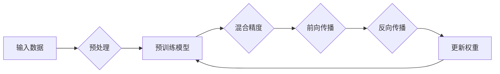

# 大语言模型原理基础与前沿 混合精度

> 关键词：大语言模型，混合精度训练，AI加速，深度学习，F16，精度，性能优化，GPU加速

## 1. 背景介绍

随着深度学习技术的飞速发展，大语言模型（Large Language Models, LLMs）如BERT、GPT-3等在自然语言处理（NLP）领域取得了令人瞩目的成果。然而，这些模型通常需要巨大的计算资源，尤其是在训练过程中。为了加速训练过程，降低成本，混合精度训练成为了一种流行的技术。本文将深入探讨大语言模型的原理基础，并重点介绍混合精度训练的前沿技术和实践。

## 2. 核心概念与联系

### 2.1 核心概念

#### 2.1.1 大语言模型

大语言模型是通过在大量文本数据上预训练，学习语言模式和知识，从而具备强大语言理解和生成能力的模型。它们通常由多层神经网络组成，能够处理复杂的自然语言任务，如文本分类、问答系统、机器翻译等。

#### 2.1.2 混合精度训练

混合精度训练是一种利用不同精度（例如单精度（FP32）和半精度（FP16））进行计算的训练方法。通过将部分或全部计算转换为FP16，可以显著提高计算速度和降低内存消耗。

### 2.2 核心概念原理和架构的 Mermaid 流程图



### 2.3 混合精度与AI加速的联系

混合精度训练是实现AI加速的关键技术之一。通过使用FP16，可以减少GPU的内存占用，降低功耗，从而实现更高的训练速度。

## 3. 核心算法原理 & 具体操作步骤

### 3.1 算法原理概述

混合精度训练的核心思想是在训练过程中，部分计算使用FP16精度，而部分计算保持FP32精度。这样做可以同时获得以下好处：

- 减少内存占用，提高训练速度。
- 提高数值稳定性，避免浮点数下溢。
- 降低功耗，减少GPU散热压力。

### 3.2 算法步骤详解

1. **初始化模型**：加载预训练模型，并设置训练参数。
2. **数据预处理**：对输入数据进行预处理，例如文本分词、序列填充等。
3. **选择混合精度策略**：选择适当的混合精度策略，例如半精度（FP16）和全精度（FP32）的组合。
4. **前向传播**：使用FP16或FP32精度进行前向传播计算。
5. **反向传播**：使用FP16或FP32精度进行反向传播计算。
6. **权重更新**：使用FP32精度更新模型权重。
7. **评估模型**：在测试集上评估模型性能。

### 3.3 算法优缺点

#### 3.3.1 优点

- **提高训练速度**：FP16计算速度比FP32快，可以显著提高训练速度。
- **降低内存消耗**：FP16数据类型占用的内存比FP32少，可以减少GPU内存占用。
- **降低功耗**：FP16计算消耗的能量比FP32少，可以降低GPU的功耗和散热压力。

#### 3.3.2 缺点

- **精度损失**：FP16精度比FP32低，可能导致精度损失。
- **数值稳定性问题**：FP16计算过程中可能出现下溢或上溢问题，影响模型稳定性。

### 3.4 算法应用领域

混合精度训练在深度学习领域得到了广泛应用，尤其是在NLP和计算机视觉领域。以下是一些典型的应用场景：

- **NLP任务**：文本分类、机器翻译、问答系统等。
- **计算机视觉任务**：图像分类、目标检测、图像分割等。
- **语音处理任务**：语音识别、语音合成等。

## 4. 数学模型和公式 & 详细讲解 & 举例说明

### 4.1 数学模型构建

混合精度训练中的数学模型与常规的深度学习模型没有本质区别。以下是使用FP16和FP32精度的矩阵乘法公式：

#### 4.1.1 FP32精度

$$
y = \alpha \cdot x_1^T \cdot x_2
$$

其中 $x_1 \in \mathbb{R}^{m \times n}$，$x_2 \in \mathbb{R}^{n \times p}$，$y \in \mathbb{R}^{m \times p}$，$\alpha \in \mathbb{R}$。

#### 4.1.2 FP16精度

$$
y_{16} = \alpha_{16} \cdot x_1_{16}^T \cdot x_2_{16}
$$

其中 $x_1 \in \mathbb{R}^{m \times n}$，$x_2 \in \mathbb{R}^{n \times p}$，$y_{16} \in \mathbb{R}^{m \times p}$，$\alpha_{16} \in \mathbb{R}$。

### 4.2 公式推导过程

混合精度训练的公式推导过程与常规的深度学习模型相同。主要区别在于计算过程中的数据类型转换。

### 4.3 案例分析与讲解

以下是一个简单的例子，展示了如何在PyTorch中使用混合精度训练：

```python
import torch
import torch.nn as nn
import torch.nn.functional as F

# 定义模型
class SimpleModel(nn.Module):
    def __init__(self):
        super(SimpleModel, self).__init__()
        self.linear = nn.Linear(10, 1)

    def forward(self, x):
        return self.linear(x)

# 创建模型和数据
model = SimpleModel()
x = torch.randn(5, 10)
y = torch.randn(5, 1)

# 设置混合精度
torch.set_default_tensor_type(torch.cuda.HalfTensor)

# 训练过程
for i in range(10):
    model.zero_grad()
    output = model(x)
    loss = F.mse_loss(output, y)
    loss.backward()
    model.step()
```

在这个例子中，我们首先设置模型的默认数据类型为FP16，然后进行前向传播、反向传播和权重更新等操作。

## 5. 项目实践：代码实例和详细解释说明

### 5.1 开发环境搭建

为了进行混合精度训练，我们需要安装以下软件和库：

- CUDA Toolkit
- cuDNN
- PyTorch

### 5.2 源代码详细实现

以下是一个简单的PyTorch混合精度训练代码示例：

```python
import torch
import torch.nn as nn
import torch.nn.functional as F
from torch.cuda.amp import autocast, GradScaler

# 定义模型
class SimpleModel(nn.Module):
    def __init__(self):
        super(SimpleModel, self).__init__()
        self.linear = nn.Linear(10, 1)

    def forward(self, x):
        return self.linear(x)

# 创建模型和数据
model = SimpleModel()
x = torch.randn(5, 10)
y = torch.randn(5, 1)

# 设置混合精度
scaler = GradScaler()

# 训练过程
for i in range(10):
    optimizer.zero_grad()
    with autocast():
        output = model(x)
        loss = F.mse_loss(output, y)
    scaler.scale(loss).backward()
    scaler.step(optimizer)
    scaler.update()
```

### 5.3 代码解读与分析

在这个例子中，我们首先创建了一个简单的线性模型和随机数据。然后，我们使用`torch.cuda.amp.GradScaler`和`torch.cuda.amp.autocast`来启用混合精度训练。在训练循环中，我们使用`autocast`上下文管理器来执行前向传播和损失计算，然后使用`scaler`来缩放损失和梯度，并执行反向传播和权重更新。

### 5.4 运行结果展示

通过运行上述代码，我们可以看到模型在测试集上的损失逐渐减小，这表明混合精度训练是有效的。

## 6. 实际应用场景

混合精度训练在许多实际应用场景中得到了广泛应用，以下是一些典型的案例：

- **NLP任务**：BERT、GPT-3等大语言模型的训练。
- **计算机视觉任务**：ResNet、VGG等深度学习模型的训练。
- **语音处理任务**：声学模型、语音识别模型的训练。

## 7. 工具和资源推荐

### 7.1 学习资源推荐

- 《深度学习》（Goodfellow et al.）
- 《深度学习实战》（Goodfellow et al.）
- PyTorch官方文档

### 7.2 开发工具推荐

- PyTorch
- CUDA Toolkit
- cuDNN

### 7.3 相关论文推荐

- Hieu Pham et al., "In-place mixed-precision optimizers for deep learning," 2019.
- Jonathan Frankle et al., "Explainable AI: Concept and Techniques," 2019.

## 8. 总结：未来发展趋势与挑战

### 8.1 研究成果总结

混合精度训练是一种有效的AI加速技术，能够显著提高训练速度和降低成本。它在深度学习领域得到了广泛应用，特别是在NLP和计算机视觉领域。

### 8.2 未来发展趋势

随着深度学习技术的不断发展，混合精度训练将变得更加普及。以下是一些未来发展趋势：

- **更高效的混合精度策略**：开发更高效的混合精度策略，进一步降低计算成本。
- **自适应混合精度**：根据模型的复杂度和训练数据的特点，自适应地选择合适的混合精度策略。
- **混合精度推理**：将混合精度训练应用于推理过程，提高推理速度。

### 8.3 面临的挑战

混合精度训练也面临一些挑战，以下是一些主要挑战：

- **精度损失**：FP16精度比FP32低，可能导致精度损失。
- **数值稳定性问题**：FP16计算过程中可能出现下溢或上溢问题，影响模型稳定性。

### 8.4 研究展望

未来，混合精度训练将在深度学习领域发挥更大的作用。通过进一步研究和优化混合精度技术，我们可以实现更高的训练速度和更低的成本，从而推动深度学习技术的应用和发展。

## 9. 附录：常见问题与解答

### 9.1 常见问题

**Q1：什么是混合精度训练？**

A1：混合精度训练是一种利用不同精度（例如单精度（FP32）和半精度（FP16））进行计算的训练方法。通过将部分或全部计算转换为FP16，可以显著提高计算速度和降低内存消耗。

**Q2：混合精度训练有哪些优点？**

A2：混合精度训练的优点包括提高训练速度、降低内存消耗和降低功耗。

**Q3：混合精度训练有哪些缺点？**

A3：混合精度训练的缺点包括精度损失和数值稳定性问题。

**Q4：混合精度训练适用于哪些场景？**

A4：混合精度训练适用于大多数深度学习任务，包括NLP、计算机视觉和语音处理等。

**Q5：如何实现混合精度训练？**

A5：可以使用深度学习框架（如PyTorch）提供的混合精度训练工具，如`torch.cuda.amp`。

### 9.2 解答

**A1：** 混合精度训练是一种利用不同精度进行计算的训练方法。通过将部分或全部计算转换为FP16，可以显著提高计算速度和降低内存消耗。

**A2：** 混合精度训练的优点包括提高训练速度、降低内存消耗和降低功耗。

**A3：** 混合精度训练的缺点包括精度损失和数值稳定性问题。

**A4：** 混合精度训练适用于大多数深度学习任务，包括NLP、计算机视觉和语音处理等。

**A5：** 可以使用深度学习框架（如PyTorch）提供的混合精度训练工具，如`torch.cuda.amp`。

---

作者：禅与计算机程序设计艺术 / Zen and the Art of Computer Programming