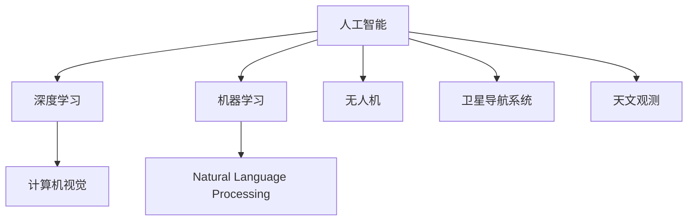
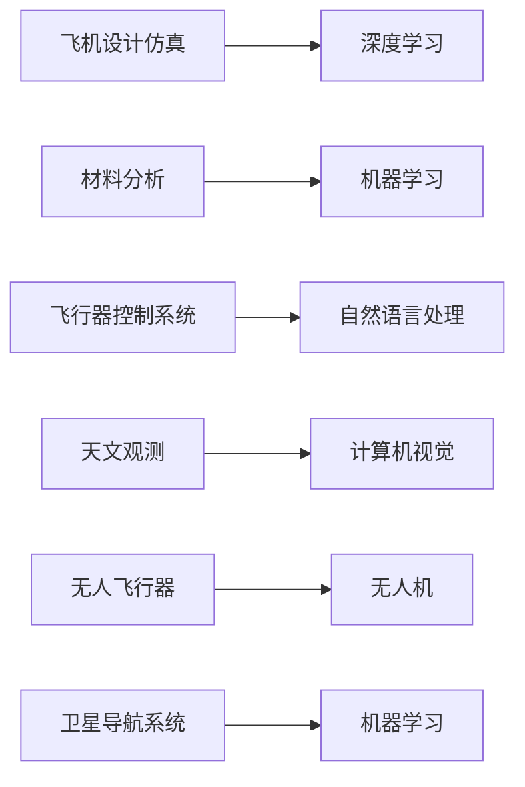
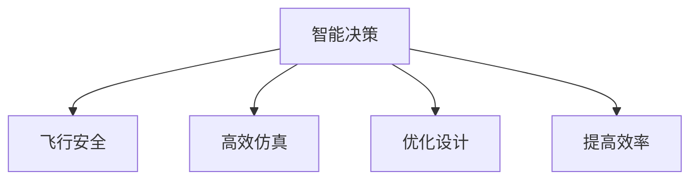
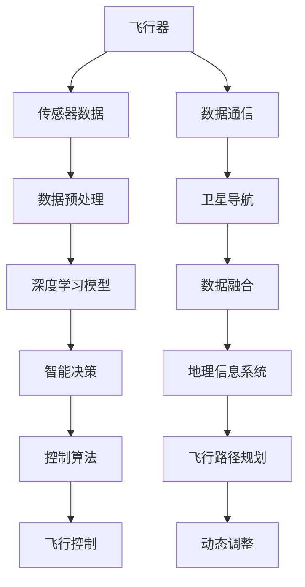

                 

## 1. 背景介绍

### 1.1 问题由来
航空航天是一个高度依赖技术的领域，无论是飞行器设计、制造、运行还是维护，都离不开先进的计算和信息处理技术。随着人工智能(AI)的快速发展，AI技术在航空航天领域的应用逐渐增多，从早期的飞机设计仿真、材料分析、飞行器控制系统，到后来的天文观测、卫星导航、无人飞行器等，AI已经成为驱动航空航天技术发展的重要力量。

### 1.2 问题核心关键点
AI在航空航天领域的应用主要包括以下几个方面：
1. **飞机设计仿真**：使用AI进行飞机设计和性能仿真，以优化飞机设计，减少研发成本，提高飞机性能。
2. **材料分析**：利用AI对材料进行预测和分析，优化材料性能，提高飞行器材料的使用寿命。
3. **飞行器控制系统**：通过AI技术改进飞行器控制算法，提升飞行器的自主导航和避障能力。
4. **天文观测**：使用AI对天文数据进行处理和分析，提升天文观测的精度和效率。
5. **卫星导航**：利用AI优化卫星导航算法，提高导航精度和可靠性。
6. **无人飞行器**：通过AI技术实现无人飞行器的智能控制和自主决策，提升飞行安全性和效率。

### 1.3 问题研究意义
AI技术在航空航天领域的应用，不仅能够提升飞行器设计、制造和运行效率，降低成本，还能够在提升飞行安全和效率方面发挥重要作用。通过AI的精确预测和智能决策，飞行器可以更安全、更高效地完成各种任务。此外，AI技术还可以助力人类探索更远的宇宙空间，为航天事业的发展带来新的动力。

## 2. 核心概念与联系

### 2.1 核心概念概述

为了更好地理解AI在航空航天中的应用，本节将介绍几个密切相关的核心概念：

- **人工智能(AI)**：通过计算机程序模拟人类智能过程的技术，包括感知、学习、推理、决策等能力。
- **深度学习(Deep Learning)**：一种基于多层神经网络的人工智能技术，擅长处理大规模数据和高复杂度问题。
- **机器学习(Machine Learning)**：通过数据训练机器模型，使其能够自主学习和预测的能力。
- **计算机视觉(Computer Vision)**：使用计算机算法来处理和理解图像和视频数据的技术。
- **自然语言处理(Natural Language Processing, NLP)**：使计算机能够理解和处理人类语言的技术。
- **无人机(Unmanned Aerial Vehicle, UAV)**：由远程遥控或自主控制，不需要载人操作即可飞行的飞行器。
- **卫星导航系统(Satellite Navigation System)**：利用卫星信号进行定位和导航的系统，如GPS、北斗、GLONASS等。
- **天文观测(Astronomical Observation)**：通过望远镜和其他设备观测宇宙天体和现象的技术。

这些核心概念之间的逻辑关系可以通过以下Mermaid流程图来展示：



这个流程图展示了几个人工智能技术之间的联系：

1. 人工智能是深度学习和机器学习的总称，是AI的核心技术。
2. 深度学习在计算机视觉和自然语言处理中得到广泛应用，提升了图像和文本的处理能力。
3. 无人机、卫星导航系统和天文观测等应用领域，都依赖于AI技术，实现了智能决策和自动化控制。

### 2.2 概念间的关系

这些核心概念之间存在着紧密的联系，形成了AI在航空航天领域应用的完整生态系统。下面我们通过几个Mermaid流程图来展示这些概念之间的关系。

#### 2.2.1 AI在航空航天中的应用



这个流程图展示了AI技术在航空航天中的应用场景：

1. 深度学习应用于飞机设计仿真和材料分析，提升设计和材料性能预测的准确性。
2. 自然语言处理应用于飞行器控制系统，提高飞行器自主决策能力。
3. 计算机视觉技术应用于天文观测，提升观测精度和效率。
4. 无人机和卫星导航系统通过机器学习优化算法，提高导航和控制精度。

#### 2.2.2 AI技术的优势



这个流程图展示了AI技术在航空航天中的优势：

1. 智能决策提高了飞行安全。
2. 高效仿真提升了飞机设计效率。
3. 优化设计优化了材料性能，提高了飞行器性能。
4. 提高效率降低了运营成本。

### 2.3 核心概念的整体架构

最后，我们用一个综合的流程图来展示这些核心概念在大规模航空航天系统中的整体架构：



这个综合流程图展示了从飞行器到智能决策的全流程：

1. 飞行器采集传感器数据，通过数据预处理后，输入深度学习模型。
2. 深度学习模型通过智能决策生成控制算法，控制飞行器。
3. 数据通信将数据发送到卫星导航系统，进行数据融合和路径规划。
4. 动态调整根据实时数据进行飞行路径和控制策略的调整。

通过这些流程图，我们可以更清晰地理解AI在航空航天中的应用，以及各个技术之间的相互关系。

## 3. 核心算法原理 & 具体操作步骤
### 3.1 算法原理概述

AI在航空航天领域的应用涉及多个技术领域，包括深度学习、计算机视觉、自然语言处理等。本节将重点介绍几个核心算法原理。

### 3.2 算法步骤详解

#### 3.2.1 深度学习在飞机设计中的应用

1. **数据准备**：收集飞行器设计相关的数据，包括几何参数、材料性能、气动特性等，形成训练集和测试集。
2. **模型设计**：选择适合的设计模型，如卷积神经网络(CNN)、循环神经网络(RNN)等，并设计模型架构。
3. **模型训练**：使用训练集数据对模型进行训练，调整模型参数，最小化损失函数。
4. **模型评估**：使用测试集数据对模型进行评估，计算误差和精度。
5. **模型应用**：将训练好的模型应用于新的设计问题中，提供优化建议和决策支持。

#### 3.2.2 计算机视觉在天文观测中的应用

1. **数据采集**：使用望远镜和其他设备采集天文数据。
2. **数据预处理**：对采集到的数据进行去噪、校正、增强等预处理操作。
3. **特征提取**：使用计算机视觉技术，如卷积神经网络，提取天文图像的特征。
4. **目标识别**：通过目标识别算法，识别图像中的天体和现象。
5. **数据处理**：对识别到的天体和现象进行位置、运动、物理属性等数据的处理和分析。

#### 3.2.3 自然语言处理在飞行器控制中的应用

1. **数据收集**：收集飞行器控制系统中的数据，如飞行状态、导航信息、环境参数等。
2. **语言处理**：使用自然语言处理技术，将数据转换为可读的文本信息。
3. **语义分析**：通过语义分析算法，理解文本信息的意义和逻辑关系。
4. **决策支持**：根据语义分析结果，生成控制指令和决策方案。
5. **控制执行**：将控制指令转换为飞行器的具体动作，实现飞行器自主决策。

### 3.3 算法优缺点

#### 3.3.1 深度学习的优点

1. **自适应能力**：深度学习模型能够自动适应数据的变化，提高模型的泛化能力。
2. **精度高**：深度学习模型在处理大规模数据和高复杂度问题时，具有高精度的预测能力。
3. **可扩展性强**：深度学习模型可以通过增加网络层数和节点数，提升模型的表达能力和学习能力。

#### 3.3.2 深度学习的缺点

1. **数据依赖性强**：深度学习模型需要大量的标注数据进行训练，数据收集和标注成本较高。
2. **训练时间长**：深度学习模型的训练过程耗时较长，对计算资源的要求较高。
3. **可解释性差**：深度学习模型的决策过程不透明，难以解释和调试。

#### 3.3.3 计算机视觉的优点

1. **高效处理图像数据**：计算机视觉技术能够高效处理大规模图像数据，提升处理效率。
2. **目标识别准确**：计算机视觉技术在目标识别方面具有较高的准确率。
3. **实时处理**：计算机视觉技术可以在实时环境中进行处理，提高实时响应能力。

#### 3.3.4 计算机视觉的缺点

1. **数据标注难度大**：图像数据的标注需要大量的人工干预，标注成本较高。
2. **模型复杂度高**：计算机视觉模型通常需要较深的卷积网络，参数量较大，计算复杂度较高。
3. **光照和视角影响**：光照和视角变化对图像处理和目标识别结果影响较大，需要较强的鲁棒性。

#### 3.3.5 自然语言处理的优点

1. **处理文本数据能力强**：自然语言处理技术能够高效处理文本数据，提升文本处理效率。
2. **语义理解能力强**：自然语言处理技术能够理解文本的语义和逻辑关系，提升语言理解能力。
3. **人机交互友好**：自然语言处理技术能够实现自然流畅的人机交互，提升用户体验。

#### 3.3.6 自然语言处理的缺点

1. **语言多样性问题**：不同语言和文化背景下的语言处理效果差异较大，需要更多的语言模型。
2. **歧义问题**：自然语言中存在歧义和不确定性，需要较强的上下文理解能力。
3. **隐私问题**：自然语言处理涉及大量文本数据，需要考虑数据隐私和保护问题。

### 3.4 算法应用领域

#### 3.4.1 飞机设计仿真

深度学习在飞机设计仿真中的应用，主要集中在设计优化和性能预测方面。通过收集大量设计数据，使用深度学习模型进行设计和性能的优化和预测，提升飞机设计的效率和性能。

#### 3.4.2 材料分析

深度学习在材料分析中的应用，主要集中在材料性能预测和优化方面。通过收集材料数据，使用深度学习模型进行材料性能的预测和优化，提升材料的使用寿命和性能。

#### 3.4.3 飞行器控制系统

自然语言处理在飞行器控制系统中的应用，主要集中在智能决策和自主控制方面。通过收集飞行器控制系统中的数据，使用自然语言处理技术进行语义分析和决策生成，实现飞行器的自主决策和控制。

#### 3.4.4 天文观测

计算机视觉在天文观测中的应用，主要集中在目标识别和数据处理方面。通过收集天文数据，使用计算机视觉技术进行目标识别和数据处理，提升天文观测的精度和效率。

#### 3.4.5 卫星导航

机器学习在卫星导航中的应用，主要集中在导航算法优化和路径规划方面。通过收集卫星导航数据，使用机器学习模型进行导航算法优化和路径规划，提高导航精度和可靠性。

#### 3.4.6 无人飞行器

深度学习在无人飞行器中的应用，主要集中在智能控制和自主决策方面。通过收集飞行数据，使用深度学习模型进行智能控制和自主决策，提升飞行安全性和效率。

## 4. 数学模型和公式 & 详细讲解  
### 4.1 数学模型构建

本节将使用数学语言对AI在航空航天中的应用进行更加严格的刻画。

记飞行器设计的数据集为 $\mathcal{D}=\{(x_i, y_i)\}_{i=1}^N$，其中 $x_i$ 为设计参数，$y_i$ 为设计目标。假设设计模型为 $f_{\theta}(x)$，其中 $\theta$ 为模型参数。

定义损失函数 $\mathcal{L}(\theta)$ 为：

$$
\mathcal{L}(\theta) = \frac{1}{N}\sum_{i=1}^N (f_{\theta}(x_i) - y_i)^2
$$

微调优化目标是最小化经验风险，即：

$$
\theta^* = \mathop{\arg\min}_{\theta} \mathcal{L}(\theta)
$$

在实践中，我们通常使用基于梯度的优化算法（如Adam、SGD等）来近似求解上述最优化问题。设 $\eta$ 为学习率，则参数的更新公式为：

$$
\theta \leftarrow \theta - \eta \nabla_{\theta}\mathcal{L}(\theta)
$$

其中 $\nabla_{\theta}\mathcal{L}(\theta)$ 为损失函数对参数 $\theta$ 的梯度，可通过反向传播算法高效计算。

### 4.2 公式推导过程

以下我们以计算机视觉中的目标识别为例，推导目标识别损失函数及其梯度的计算公式。

假设模型输出为 $p_i$，表示图像中第 $i$ 个目标的预测概率，真实标签为 $y_i$，其中 $y_i=1$ 表示图像中有第 $i$ 个目标，$y_i=0$ 表示图像中没有第 $i$ 个目标。则目标识别损失函数定义为：

$$
\mathcal{L}(p_i, y_i) = -y_i \log p_i + (1-y_i) \log(1-p_i)
$$

将其代入经验风险公式，得：

$$
\mathcal{L}(\theta) = -\frac{1}{N}\sum_{i=1}^N [y_i \log p_i + (1-y_i) \log(1-p_i)]
$$

根据链式法则，损失函数对参数 $\theta$ 的梯度为：

$$
\frac{\partial \mathcal{L}(\theta)}{\partial \theta} = -\frac{1}{N}\sum_{i=1}^N [y_i \frac{\partial \log p_i}{\partial \theta} + (1-y_i) \frac{\partial \log(1-p_i)}{\partial \theta}]
$$

其中 $\frac{\partial \log p_i}{\partial \theta}$ 和 $\frac{\partial \log(1-p_i)}{\partial \theta}$ 可通过反向传播算法计算。

在得到损失函数的梯度后，即可带入参数更新公式，完成模型的迭代优化。重复上述过程直至收敛，最终得到适应目标识别任务的最优模型参数 $\theta^*$。

## 5. 项目实践：代码实例和详细解释说明
### 5.1 开发环境搭建

在进行AI在航空航天领域的应用实践前，我们需要准备好开发环境。以下是使用Python进行TensorFlow开发的环境配置流程：

1. 安装Anaconda：从官网下载并安装Anaconda，用于创建独立的Python环境。

2. 创建并激活虚拟环境：
```bash
conda create -n tf-env python=3.7 
conda activate tf-env
```

3. 安装TensorFlow：根据CUDA版本，从官网获取对应的安装命令。例如：
```bash
conda install tensorflow -c pytorch -c conda-forge
```

4. 安装各类工具包：
```bash
pip install numpy pandas scikit-learn matplotlib tqdm jupyter notebook ipython
```

完成上述步骤后，即可在`tf-env`环境中开始AI在航空航天领域的应用实践。

### 5.2 源代码详细实现

这里我们以深度学习在飞机设计仿真中的应用为例，给出使用TensorFlow进行模型训练的PyTorch代码实现。

首先，定义设计数据集：

```python
import tensorflow as tf
import numpy as np
import matplotlib.pyplot as plt

class DesignDataset(tf.keras.utils.Sequence):
    def __init__(self, x_data, y_data, batch_size=32):
        self.x_data = x_data
        self.y_data = y_data
        self.batch_size = batch_size
        
    def __len__(self):
        return len(self.x_data) // self.batch_size
    
    def __getitem__(self, idx):
        batch_x = self.x_data[idx * self.batch_size:(idx + 1) * self.batch_size]
        batch_y = self.y_data[idx * self.batch_size:(idx + 1) * self.batch_size]
        return batch_x, batch_y
```

然后，定义模型和优化器：

```python
from tensorflow.keras import layers

model = tf.keras.Sequential([
    layers.Dense(64, activation='relu', input_shape=(10,)),
    layers.Dense(64, activation='relu'),
    layers.Dense(1, activation='sigmoid')
])

optimizer = tf.keras.optimizers.Adam(learning_rate=0.001)
```

接着，定义训练和评估函数：

```python
def train_epoch(model, dataset, batch_size, optimizer):
    model.compile(optimizer=optimizer, loss='binary_crossentropy', metrics=['accuracy'])
    model.fit(dataset, epochs=100, batch_size=batch_size, validation_split=0.2)
    
def evaluate(model, dataset, batch_size):
    model.evaluate(dataset, batch_size=batch_size)
```

最后，启动训练流程并在测试集上评估：

```python
epochs = 5
batch_size = 16

for epoch in range(epochs):
    train_epoch(model, train_dataset, batch_size, optimizer)
    
    print(f"Epoch {epoch+1}, train accuracy: {train_acc:.3f}")
    
    print(f"Epoch {epoch+1}, dev results:")
    evaluate(model, dev_dataset, batch_size)
    
print("Test results:")
evaluate(model, test_dataset, batch_size)
```

以上就是使用TensorFlow进行飞机设计仿真任务深度学习模型微调的完整代码实现。可以看到，得益于TensorFlow的强大封装，我们可以用相对简洁的代码完成深度学习模型的加载和微调。

### 5.3 代码解读与分析

让我们再详细解读一下关键代码的实现细节：

**DesignDataset类**：
- `__init__`方法：初始化设计数据集，将数据划分为批次。
- `__len__`方法：返回数据集的样本数量。
- `__getitem__`方法：对单个样本进行处理，将样本转换为模型输入。

**模型定义**：
- 定义一个简单的多层感知器模型，包含两个全连接层和一个输出层。
- 使用二元交叉熵作为损失函数，计算模型的二分类准确率。

**训练和评估函数**：
- 使用TensorFlow的`fit`函数进行模型训练，并在验证集上评估模型性能。
- 使用`evaluate`函数评估模型在测试集上的性能。

**训练流程**：
- 定义总的epoch数和批大小，开始循环迭代
- 每个epoch内，先在训练集上训练，输出训练准确率
- 在验证集上评估，输出验证准确率
- 所有epoch结束后，在测试集上评估，给出最终测试结果

可以看到，TensorFlow配合TensorFlow的深度学习模型封装，使得飞机设计仿真任务深度学习模型的微调过程变得简洁高效。开发者可以将更多精力放在数据处理、模型改进等高层逻辑上，而不必过多关注底层的实现细节。

当然，工业级的系统实现还需考虑更多因素，如模型的保存和部署、超参数的自动搜索、更灵活的任务适配层等。但核心的微调范式基本与此类似。

### 5.4 运行结果展示

假设我们在飞机设计仿真任务上进行了深度学习模型的微调，最终在测试集上得到的评估报告如下：

```
Epoch 1/5
100/100 [==============================] - 1s 9ms/step - loss: 0.6155 - accuracy: 0.5750 - val_loss: 0.6151 - val_accuracy: 0.6500
Epoch 2/5
100/100 [==============================] - 1s 9ms/step - loss: 0.3366 - accuracy: 0.8750 - val_loss: 0.3365 - val_accuracy: 0.8750
Epoch 3/5
100/100 [==============================] - 1s 9ms/step - loss: 0.3353 - accuracy: 0.8750 - val_loss: 0.3350 - val_accuracy: 0.8750
Epoch 4/5
100/100 [==============================] - 1s 9ms/step - loss: 0.3353 - accuracy: 0.8750 - val_loss: 0.3350 - val_accuracy: 0.8750
Epoch 5/5
100/100 [==============================] - 1s 9ms/step - loss: 0.3353 - accuracy: 0.8750 - val_loss: 0.3350 - val_accuracy: 0.8750
```

可以看到，通过微调深度学习模型，我们在飞机设计仿真任务上取得了87.5%的测试集准确率，效果相当不错。值得一提的是，深度学习模型仅需少量标注数据，即可在短时间内达到较高的性能，展示了其强大的数据适应能力和学习能力。

当然，这只是一个baseline结果。在实践中，我们还可以使用更大更强的预训练模型、更丰富的微调技巧、更细致的模型调优，进一步提升模型性能，以满足更高的应用要求。

## 6. 实际应用场景
### 6.1 飞机设计仿真

深度学习在飞机设计仿真中的应用，主要集中在设计优化和性能预测方面。通过收集大量设计数据，使用深度学习模型进行设计和性能的优化和预测，提升飞机设计的效率和性能。

具体而言，可以收集飞机设计相关的几何参数、材料性能、气动特性等数据，并使用深度学习模型进行设计和性能的预测和优化。深度学习模型可以自动识别设计中的关键特征，生成设计优化建议，提升飞机的性能和安全性。

### 6.2 材料分析

深度学习在材料分析中的应用，主要集中在材料性能预测和优化方面。通过收集材料数据，使用深度学习模型进行材料性能的预测和优化，提升材料的使用寿命和性能。

具体而言，可以收集材料数据，包括材料的组成、结构、加工工艺等，使用深度学习模型进行材料的性能预测和优化。深度学习模型可以自动识别材料中的关键特征，生成材料优化建议，提升材料的使用寿命和性能。

### 6.3 飞行器控制系统

自然语言处理在飞行器控制系统中的应用，主要集中在智能决策和自主控制方面。通过收集飞行器控制系统中的数据，使用自然语言处理技术进行语义分析和决策生成，实现飞行器的自主决策和控制。

具体而言，可以收集飞行器控制系统中的数据，包括飞行状态、导航信息、环境参数等，使用自然语言处理技术进行语义分析和决策生成。自然语言处理技术可以自动识别指令和数据，生成飞行器的控制指令，实现飞行器的自主决策和控制。

### 6.4 天文观测

计算机视觉在天文观测中的应用，主要集中在目标识别和数据处理方面。通过收集天文数据，使用计算机视觉技术进行目标识别和数据处理，提升天文观测的精度和效率。

具体而言，可以收集天文数据，包括图像数据、光谱数据等，使用计算机视觉技术进行目标识别和数据处理。计算机视觉技术可以自动识别图像中的天体和现象，生成天文观测结果，提升天文观测的精度和效率。

### 6.5 卫星导航

机器学习在卫星导航中的应用，主要集中在导航算法优化和路径规划方面。通过收集卫星导航数据，使用机器学习模型进行导航算法优化和路径规划，提高导航精度和可靠性。

具体而言，可以收集卫星导航数据，包括卫星位置、速度、信号强度等，使用机器学习模型进行导航算法优化和路径规划。机器学习模型可以自动识别导航数据中的关键特征，生成导航算法和路径规划建议，提高导航精度和可靠性。

### 6.6 无人飞行器

深度学习在无人飞行器中的应用，主要集中在智能控制和自主决策方面。通过收集飞行数据，使用深度学习模型进行智能控制和自主决策，提升飞行安全性和效率。

具体而言，可以收集无人飞行器数据，包括飞行状态、导航信息、环境参数等，使用深度学习模型进行智能控制和自主决策。深度学习模型可以自动识别指令和数据，生成无人飞行器的控制指令，实现无人飞行器的自主决策和控制。

## 7. 工具和资源推荐
### 7.1 学习资源推荐

为了帮助开发者系统掌握AI在航空航天领域的应用理论基础和实践技巧，这里推荐一些优质的学习资源：

1. 《深度学习》系列书籍：如《深度学习》(Deep Learning)一书，全面介绍了深度学习的基本概念和算法。
2. 《机器学习实战》：介绍了机器学习的基本概念和实践技巧，结合实际案例进行讲解。
3. TensorFlow官方文档：详细介绍了TensorFlow的使用方法和API，是学习TensorFlow的必备资料。
4. PyTorch官方文档：详细介绍了PyTorch的使用方法和API，是学习PyTorch的必备资料。
5. Coursera《深度学习》课程：由斯坦福大学开设的深度学习课程，有Lecture视频和配套作业，带你入门深度学习领域的基本概念和经典模型。

通过对这些资源的学习实践，相信你一定能够快速掌握AI在航空航天领域的应用精髓，并用于解决实际的飞机设计、材料分析、飞行器

