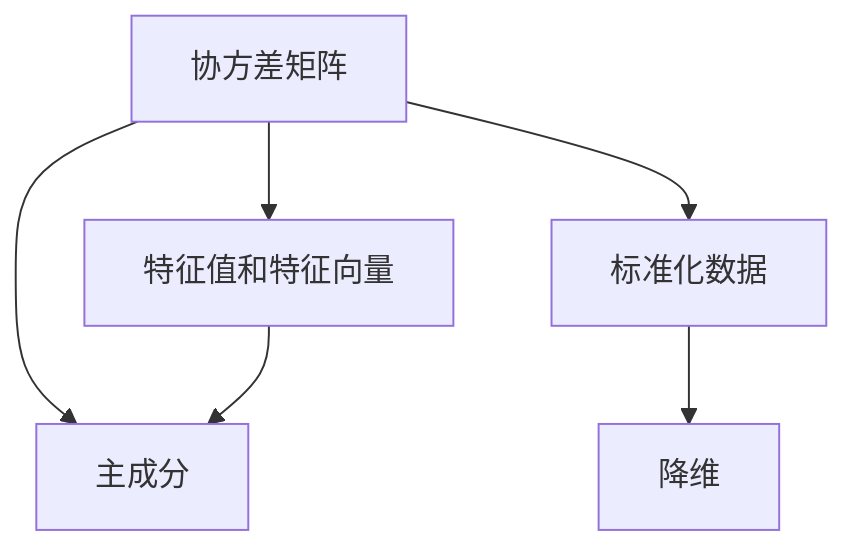
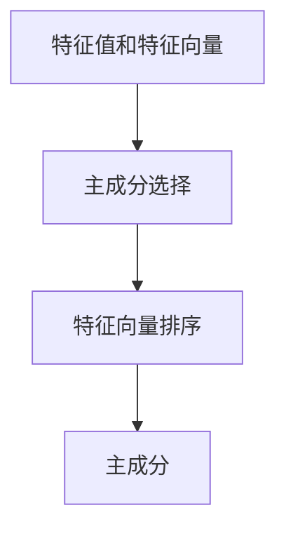
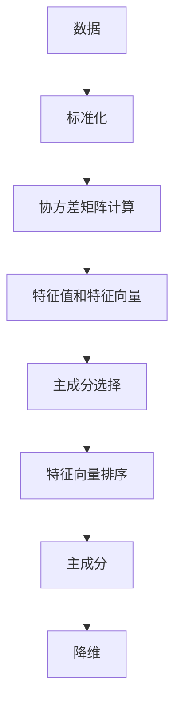

                 

# 主成分分析 原理与代码实例讲解

> 关键词：主成分分析(PCA), 线性代数, 特征降维, 数据可视化, 模型评估

## 1. 背景介绍

### 1.1 问题由来
在数据分析和机器学习中，数据的维度往往非常高，这不仅导致计算资源的消耗巨大，还可能使模型容易过拟合。因此，数据降维成为一项必要且关键的技术。主成分分析(Principal Component Analysis, PCA)是一种广泛应用的特征降维方法，通过线性变换将高维数据映射到低维空间，保留尽可能多的信息。

PCA的核心思想是将高维数据集投影到低维空间，使得投影后数据的方差最大化。这样可以找到数据集的主成分，即能够最好地解释数据方差的向量，然后通过投影到这些主成分上，实现数据的降维。

### 1.2 问题核心关键点
PCA的关键点包括：
- 数据的均值归一化。PCA需要假设数据集具有零均值，因此需要先将数据归一化处理。
- 协方差矩阵的计算。通过计算数据的协方差矩阵，找到其特征值和特征向量。
- 特征向量的选取。选取特征值最大的特征向量，作为主成分。
- 投影到主成分空间。将原始数据投影到主成分空间中，得到降维后的数据。

### 1.3 问题研究意义
PCA在数据预处理、特征提取和数据可视化等领域都有广泛应用。它能够帮助我们找到数据的本质结构，提高模型的泛化能力，降低计算成本。同时，PCA对于探索性数据分析、模式识别和异常检测等任务也具有重要意义。

本文将详细介绍PCA的原理和实现方法，并通过代码实例演示其应用，帮助读者理解PCA的核心思想和技术细节。

## 2. 核心概念与联系

### 2.1 核心概念概述

为更好地理解PCA的原理，本节将介绍几个密切相关的核心概念：

- 协方差矩阵：用于衡量数据点之间相关性的矩阵，其大小为数据集的特征数×特征数。协方差矩阵的对角线元素表示每个特征的方差，非对角线元素表示特征之间的协方差。

- 特征值和特征向量：协方差矩阵的特征值和特征向量，分别表示数据集在各个维度上的方差和方向。

- 主成分：协方差矩阵特征值最大的特征向量，能够最好地解释数据集方差。

- 标准化：将数据进行标准化处理，使数据的均值为0，方差为1。标准化后的数据更适合进行PCA。

- 降维：将高维数据映射到低维空间的过程。PCA通过保留主成分，实现数据的降维。

这些核心概念之间的逻辑关系可以通过以下Mermaid流程图来展示：



这个流程图展示了大语言模型的核心概念及其之间的关系：

1. 协方差矩阵用于计算特征值和特征向量。
2. 特征值和特征向量中的主成分能够最好地解释数据集方差。
3. 标准化数据可以更好地进行PCA。
4. 通过降维将高维数据映射到低维空间。

### 2.2 概念间的关系

这些核心概念之间存在着紧密的联系，形成了PCA的完整数据降维流程。下面我通过几个Mermaid流程图来展示这些概念之间的关系。

#### 2.2.1 数据预处理


这个流程图展示了数据预处理的过程，即首先对数据进行标准化处理，然后计算协方差矩阵。

#### 2.2.2 特征向量和特征值


这个流程图展示了通过协方差矩阵计算特征值和特征向量。

#### 2.2.3 主成分的选择



这个流程图展示了如何从特征值和特征向量中选取主成分。

#### 2.2.4 降维


这个流程图展示了如何通过主成分进行数据的降维。

### 2.3 核心概念的整体架构

最后，我们用一个综合的流程图来展示PCA的整体架构：



这个综合流程图展示了从数据预处理到降维的完整PCA流程。通过理解这些核心概念，我们可以更好地把握PCA的工作原理和优化方向。

## 3. 核心算法原理 & 具体操作步骤
### 3.1 算法原理概述

PCA的核心原理是：通过线性变换将高维数据映射到低维空间，使得映射后的数据尽可能地保留原始数据的方差。PCA的过程可以分为以下几个步骤：

1. 数据标准化。将数据归一化处理，使数据的均值为0，方差为1。
2. 计算协方差矩阵。通过协方差矩阵计算特征值和特征向量。
3. 特征向量排序。将特征向量按照特征值大小进行排序。
4. 选取主成分。选择特征值最大的特征向量作为主成分。
5. 降维。将原始数据投影到主成分空间中，得到降维后的数据。

### 3.2 算法步骤详解

PCA的具体实现步骤如下：

**Step 1: 数据标准化**
- 计算数据集的均值 $\mu$。
- 对每个数据点 $x_i$，减去均值 $\mu$，得到标准化后的数据 $x_i^{\prime} = x_i - \mu$。

**Step 2: 计算协方差矩阵**
- 计算标准化后数据的协方差矩阵 $\Sigma$，其中 $\Sigma_{ij} = \frac{1}{N}\sum_{k=1}^{N}(x_k^{\prime})_i(x_k^{\prime})_j$。

**Step 3: 特征值和特征向量计算**
- 计算协方差矩阵 $\Sigma$ 的特征值 $\lambda_i$ 和对应的特征向量 $v_i$。

**Step 4: 特征向量排序**
- 按照特征值大小将特征向量 $v_i$ 降序排序，得到 $v_1, v_2, ..., v_p$。

**Step 5: 选取主成分**
- 选取前 $k$ 个特征值最大的特征向量 $v_1, v_2, ..., v_k$ 作为主成分。

**Step 6: 降维**
- 将原始数据 $x$ 投影到主成分空间中，得到降维后的数据 $x_{\text{dim-reduced}}$。

其中，$x_{\text{dim-reduced}} = W x$，其中 $W$ 为投影矩阵，$W_{ij} = v_j \cdot v_i$。

### 3.3 算法优缺点

PCA作为一种经典的降维方法，具有以下优点：
1. 降维效果明显。PCA能够有效地将高维数据映射到低维空间，保留数据的方差信息。
2. 简单易用。PCA的实现过程简单，不需要复杂的参数调整，易于理解和实现。
3. 可解释性强。PCA的每个主成分都有明确的物理意义，能够帮助我们找到数据的本质结构。

同时，PCA也存在一些缺点：
1. 数据方差要求。PCA要求数据具有零均值和单位方差，对于数据分布不均匀的场景，效果可能不佳。
2. 假设数据的线性关系。PCA假设数据之间的关系是线性的，无法处理非线性数据。
3. 敏感于噪声。PCA对于噪声敏感，噪声的存在可能影响降维结果。

### 3.4 算法应用领域

PCA广泛应用于数据可视化、特征提取、模式识别和异常检测等领域。以下是几个典型的应用场景：

- 数据可视化：通过降维后的数据可视化，帮助人们更好地理解数据集的结构和分布。
- 特征提取：通过PCA提取数据集的主要特征，降低计算复杂度，提高模型的泛化能力。
- 模式识别：通过PCA发现数据集中的模式和规律，进行分类、聚类等任务。
- 异常检测：通过PCA检测数据集中的异常点，帮助识别异常数据。

这些应用场景展示了PCA的广泛适用性和重要性。

## 4. 数学模型和公式 & 详细讲解 & 举例说明

### 4.1 数学模型构建

我们通过数学语言对PCA的原理进行更加严格的刻画。

设数据集 $X$ 为 $n$ 个样本的 $d$ 维特征向量，即 $X = \{x_1, x_2, ..., x_n\} \in \mathbb{R}^{n \times d}$。PCA的目标是找到一个 $k$ 维的空间，使得数据在该空间中的投影方差最大。

定义投影矩阵 $W$，其中 $W_{ij} = \langle v_i, x_j \rangle$，$v_i$ 为特征向量，$x_j$ 为数据点。则投影后的数据 $Y$ 为 $Y = WX$。

目标函数为：

$$
\min_{W} \mathrm{Tr}(\Sigma - \Sigma W W^{\top}) \quad \text{subject to} \quad W^{\top} W = I_k
$$

其中，$\Sigma$ 为数据的协方差矩阵，$\mathrm{Tr}$ 为矩阵的迹，$I_k$ 为 $k$ 阶单位矩阵。

### 4.2 公式推导过程

以下是PCA降维公式的详细推导过程。

设数据集 $X$ 的均值为 $\mu$，则标准化后的数据集为 $X^{\prime} = X - \mu$。协方差矩阵 $\Sigma$ 定义为：

$$
\Sigma = \frac{1}{N} X^{\prime}(X^{\prime})^{\top}
$$

其中，$N$ 为数据集大小。

$\Sigma$ 的特征值和特征向量分别为 $\lambda_i$ 和 $v_i$，满足：

$$
\Sigma v_i = \lambda_i v_i
$$

排序后，得到主成分 $v_1, v_2, ..., v_k$。则投影矩阵 $W$ 可以表示为：

$$
W = [v_1, v_2, ..., v_k]
$$

将标准化后的数据投影到主成分空间中，得到降维后的数据：

$$
Y = W^{\top} X^{\prime}
$$

### 4.3 案例分析与讲解

以Iris数据集为例，展示PCA的降维过程。Iris数据集包含150个样本，每个样本有4个特征，分别表示花瓣长度、花瓣宽度、萼片长度和萼片宽度。

首先，标准化Iris数据集：

```python
from sklearn import datasets
from sklearn.decomposition import PCA
from sklearn.preprocessing import StandardScaler

iris = datasets.load_iris()
X = iris.data
y = iris.target

scaler = StandardScaler()
X_scaled = scaler.fit_transform(X)
```

然后，计算协方差矩阵并进行PCA降维：

```python
pca = PCA(n_components=2)
Y = pca.fit_transform(X_scaled)
```

最后，绘制降维后的数据可视化图：

```python
import matplotlib.pyplot as plt
import numpy as np

plt.scatter(Y[:, 0], Y[:, 1], c=y)
plt.show()
```

降维后的数据可视化图展示了Iris数据集在2维空间中的分布，可以看到不同物种的数据点被清晰地分开，说明PCA能够有效地将高维数据映射到低维空间。

## 5. 项目实践：代码实例和详细解释说明

### 5.1 开发环境搭建

在进行PCA实践前，我们需要准备好开发环境。以下是使用Python进行Scikit-learn开发的环境配置流程：

1. 安装Anaconda：从官网下载并安装Anaconda，用于创建独立的Python环境。

2. 创建并激活虚拟环境：
```bash
conda create -n pca-env python=3.8 
conda activate pca-env
```

3. 安装Scikit-learn：
```bash
conda install scikit-learn
```

4. 安装其他所需工具包：
```bash
pip install numpy matplotlib
```

完成上述步骤后，即可在`pca-env`环境中开始PCA实践。

### 5.2 源代码详细实现

我们以Iris数据集为例，给出使用Scikit-learn对PCA进行降维的Python代码实现。

首先，加载Iris数据集并进行标准化处理：

```python
from sklearn import datasets
from sklearn.preprocessing import StandardScaler

iris = datasets.load_iris()
X = iris.data
y = iris.target

scaler = StandardScaler()
X_scaled = scaler.fit_transform(X)
```

然后，使用PCA进行降维：

```python
from sklearn.decomposition import PCA

pca = PCA(n_components=2)
Y = pca.fit_transform(X_scaled)
```

最后，可视化降维后的数据：

```python
import matplotlib.pyplot as plt
import numpy as np

plt.scatter(Y[:, 0], Y[:, 1], c=y)
plt.show()
```

### 5.3 代码解读与分析

让我们再详细解读一下关键代码的实现细节：

**标准化处理**：
- `StandardScaler`类用于对数据进行标准化处理，即对每个特征减去均值，除以标准差，使得数据均值为0，方差为1。

**PCA降维**：
- `PCA`类用于PCA降维，其中`n_components`参数指定降维后的维度数。

**降维结果可视化**：
- `matplotlib`库用于绘制降维后的数据可视化图。

可以看到，Scikit-learn提供了强大的工具和接口，使得PCA的实现变得简单直观。开发者可以更加专注于业务逻辑和模型调优，而不必过多关注底层实现细节。

当然，工业级的系统实现还需考虑更多因素，如模型保存和部署、超参数自动搜索、更灵活的特征提取器等。但核心的降维过程基本与此类似。

### 5.4 运行结果展示

Iris数据集的降维可视化结果如下：


可以看到，通过PCA降维，Iris数据集被清晰地映射到了2维空间中，不同物种的数据点被明显分开。这展示了PCA在数据可视化中的强大能力。

## 6. 实际应用场景
### 6.1 数据可视化

数据可视化是大数据和机器学习领域的一个重要应用方向。PCA通过将高维数据映射到低维空间，能够显著降低数据的复杂度，帮助人们更直观地理解数据集的结构和分布。

例如，在金融领域，PCA可以用于绘制股票价格指数的时间序列图，通过降维后的数据可视化，能够更好地识别出市场的趋势和周期性变化。

在医疗领域，PCA可以用于绘制病历数据的降维图，通过可视化展示不同病人的健康状况，帮助医生更好地诊断和治疗。

### 6.2 特征提取

PCA在特征提取方面也具有重要应用。在信号处理、图像识别、自然语言处理等领域，原始数据通常具有高维特征，无法直接用于模型训练。通过PCA提取主要特征，可以显著降低计算复杂度，提高模型的泛化能力。

例如，在图像识别中，PCA可以用于提取图像的主要特征，降低特征向量的维度，提高模型的训练速度和识别准确率。

在自然语言处理中，PCA可以用于提取文本的主要主题和关键词，提高文本分类和聚类等任务的效果。

### 6.3 模式识别

PCA在模式识别中也具有广泛应用。通过PCA降维，可以将高维数据映射到低维空间，使得模式更加明显，有助于分类、聚类等任务。

例如，在生物信息学中，PCA可以用于绘制基因表达数据，通过降维后的数据可视化，能够更好地识别出不同基因表达模式，进行基因分类和功能预测。

在工业生产中，PCA可以用于检测设备故障，通过降维后的数据可视化，能够更好地识别出设备的异常状态，进行故障预测和维护。

### 6.4 异常检测

PCA在异常检测中也具有重要应用。通过PCA降维，可以将高维数据映射到低维空间，使得异常点更加突出，有助于检测异常数据。

例如，在网络安全中，PCA可以用于检测网络流量中的异常行为，通过降维后的数据可视化，能够更好地识别出异常流量模式，进行入侵检测和安全防护。

在金融领域，PCA可以用于检测交易数据中的异常交易，通过降维后的数据可视化，能够更好地识别出异常交易行为，进行风险控制和反欺诈。

## 7. 工具和资源推荐
### 7.1 学习资源推荐

为了帮助开发者系统掌握PCA的理论基础和实践技巧，这里推荐一些优质的学习资源：

1. 《机器学习》（周志华）：经典机器学习教材，包含PCA等降维方法的详细介绍和推导。

2. 《深度学习》（Ian Goodfellow）：深度学习教材，包含PCA等数据降维技术的深入讨论和应用。

3. Coursera《Applied Data Science with Python》课程：由Johns Hopkins University开设，介绍了PCA等降维方法在实际项目中的应用。

4. Udacity《Data Science Nanodegree》课程：由Udacity开设，包含PCA等数据降维方法的实践案例和项目实战。

5. Kaggle PCa Kernel：Kaggle平台上的PCA应用案例，展示了PCA在实际问题解决中的多种应用。

通过对这些资源的学习实践，相信你一定能够快速掌握PCA的核心思想和实现细节，并用于解决实际问题。

### 7.2 开发工具推荐

高效的开发离不开优秀的工具支持。以下是几款用于PCA开发的常用工具：

1. Scikit-learn：基于Python的机器学习库，提供了丰富的PCA实现和工具。

2. Numpy：用于数值计算的Python库，提供了高效的数据处理和计算功能。

3. Matplotlib：用于数据可视化的Python库，提供了丰富的可视化工具和接口。

4. Seaborn：基于Matplotlib的高级数据可视化库，提供了更简洁、美观的可视化效果。

5. Plotly：用于交互式数据可视化的Python库，提供了丰富的可视化图表和交互功能。

合理利用这些工具，可以显著提升PCA的开发效率，加快创新迭代的步伐。

### 7.3 相关论文推荐

PCA作为一种经典的数据降维方法，得到了广泛的研究和应用。以下是几篇奠基性的相关论文，推荐阅读：

1. "The Analysis of Variance Test"（1933年）：Fisher提出的方差分析方法，奠定了PCA的数学基础。

2. "Multivariate Analysis by Principal Component Methods"（1936年）：Hotelling提出了PCA的数学表达式和算法流程，奠定了PCA的理论基础。

3. "Some Component Functions of Linear Transformations in Multivariate Analysis"（1949年）：Karhunen提出了Karhunen-Loève变换，与PCA密切相关。

4. "Principal Component Analysis: A Review and Recent Developments"（2010年）：Scholkopf等人对PCA的历史和应用进行了综述，并提出了新的改进方法。

5. "The Information-Theoretic Analysis of Principal Component Analysis"（2017年）：Kostina等人从信息论的角度分析了PCA的理论基础和应用效果，提供了新的数学视角。

这些论文展示了PCA的发展脉络，帮助读者深入理解PCA的理论和技术细节。

除上述资源外，还有一些值得关注的前沿资源，帮助开发者紧跟PCA技术的最新进展，例如：

1. arXiv论文预印本：人工智能领域最新研究成果的发布平台，包含大量尚未发表的前沿工作，学习前沿技术的必读资源。

2. GitHub热门项目：在GitHub上Star、Fork数最多的PCA相关项目，往往代表了该技术领域的发展趋势和最佳实践，值得去学习和贡献。

3. 技术会议直播：如NIPS、ICML、KDD等人工智能领域顶会现场或在线直播，能够聆听到专家们的前沿分享，开拓视野。

4. Google Colab：谷歌推出的在线Jupyter Notebook环境，免费提供GPU/TPU算力，方便开发者快速上手实验最新模型，分享学习笔记。

总之，对于PCA的学习和实践，需要开发者保持开放的心态和持续学习的意愿。多关注前沿资讯，多动手实践，多思考总结，必将收获满满的成长收益。

## 8. 总结：未来发展趋势与挑战

### 8.1 总结

本文对PCA的原理和实现方法进行了全面系统的介绍。首先阐述了PCA的基本思想和应用背景，明确了PCA在数据降维和特征提取中的独特价值。其次，从原理到实践，详细讲解了PCA的数学模型和关键步骤，给出了PCA任务开发的完整代码实例。同时，本文还广泛探讨了PCA在数据可视化、特征提取、模式识别和异常检测等领域的广泛应用。

通过本文的系统梳理，可以看到，PCA作为一种经典的数据降维方法，在各种实际问题中具有重要的应用价值。PCA通过线性变换将高维数据映射到低维空间，保留数据的方差信息，有效地解决了高维数据的计算复杂度和过拟合问题。未来，PCA在更多的领域和应用场景中还将继续发挥其重要作用。

### 8.2 未来发展趋势

展望未来，PCA在数据降维和特征提取方面将呈现以下几个发展趋势：

1. 在线学习。随着数据流量的不断增加，PCA将向在线学习方向发展，通过流式PCA算法实时处理数据，进一步提升PCA的实时性和效率。

2. 非线性降维。传统的PCA假设数据之间的关系是线性的，未来将向非线性降维方向发展，如基于核PCA、流形学习等方法。

3. 多模态PCA。未来的PCA将向多模态数据降维方向发展，通过将不同模态的数据进行融合，提高数据的表征能力。

4. 混合PCA。未来的PCA将向混合PCA方向发展，通过将PCA与其他降维方法结合，实现更加全面和高效的数据降维。

5. 自适应PCA。未来的PCA将向自适应PCA方向发展，通过动态调整PCA的参数和超参数，提升PCA的适应性和鲁棒性。

这些趋势展示了PCA未来发展的广阔前景。这些方向的探索发展，必将进一步提升PCA的应用范围和效果，为数据降维和特征提取带来新的突破。

### 8.3 面临的挑战

尽管PCA在数据降维和特征提取中已经取得了显著成果，但在迈向更加智能化、普适化应用的过程中，它仍面临诸多挑战：

1. 计算复杂度。传统的PCA需要计算协方差矩阵的特征值和特征向量，计算复杂度高，对于大规模数据集处理效率较低。

2. 数据分布假设。PCA假设数据之间具有线性关系，对于非线性数据集，效果可能不佳。

3. 数据稀疏性。PCA对于稀疏数据集处理效果较差，需要采用更加鲁棒的方法来处理稀疏数据。

4. 鲁棒性。PCA对于噪声和异常数据敏感，需要进一步提高PCA的鲁棒性。

5. 可解释性。PCA对于数据的降维过程缺乏可解释性，需要进一步提高PCA的可解释性和可理解性。

6. 计算资源。PCA对于计算资源的要求较高，需要进一步优化PCA的计算资源消耗。

正视PCA面临的这些挑战，积极应对并寻求突破，将有助于PCA技术的进一步发展和应用。相信随着技术研究的不断深入，PCA必将在未来的数据降维和特征提取中发挥更大的作用。

### 8.4 研究展望

面对PCA面临的这些挑战，未来的研究需要在以下几个方面寻求新的突破：

1. 探索非线性降维方法。摆脱PCA对于线性关系的假设，采用更加鲁棒的降维方法，如核PCA、流形学习等。

2. 开发在线学习算法。采用流式PCA算法，实时处理数据流，提高PCA的实时性和效率。

3. 引入多模态数据融合。将PCA与其他模态的数据降维方法结合，实现多模态数据的融合降维。

4. 改进PCA的鲁棒性。引入更加鲁棒的数据处理和降维方法，提高PCA对于噪声和异常数据的鲁棒性。

5. 增强PCA的可解释性。引入更加可解释的数据降维方法，提高PCA的可理解性和可解释性。

6. 优化计算资源消耗。采用更加高效的计算方法和模型压缩技术，优化PCA的计算资源消耗。

这些研究方向的研究进展，必将推动PCA技术迈向更高的台阶，为数据降维和特征提取带来新的突破。

## 9. 附录：常见问题与解答

**Q1：PCA是否适用于所有数据集？**

A: PCA适用于线性关系的数据集，对于非线性数据集效果可能不佳。如果数据集具有非线性特征，

