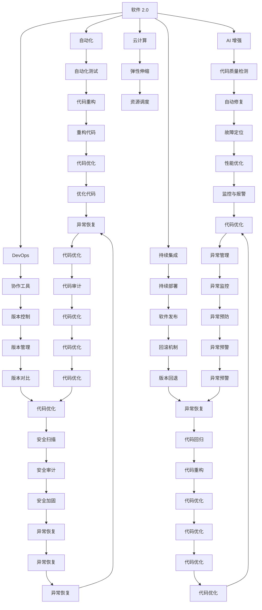
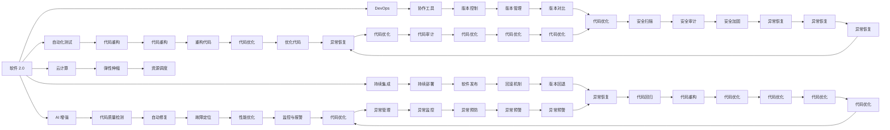
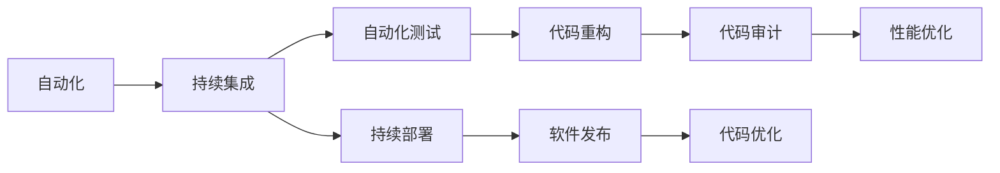
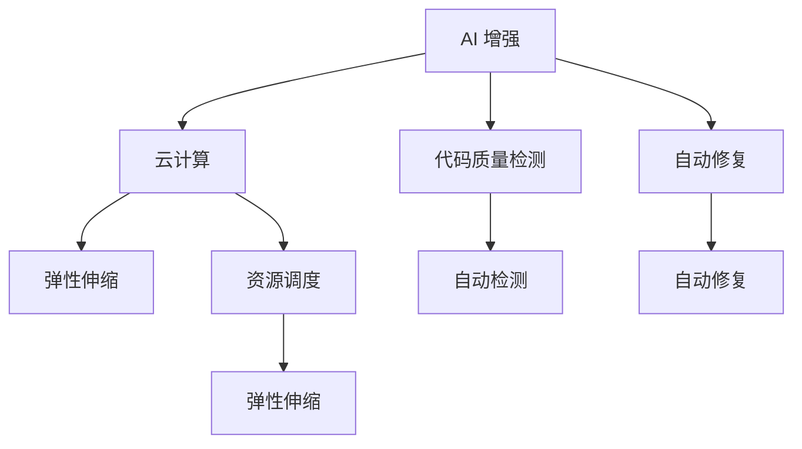
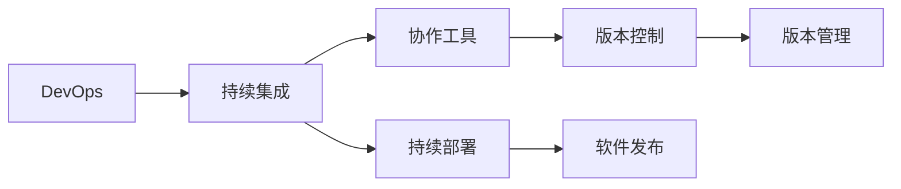
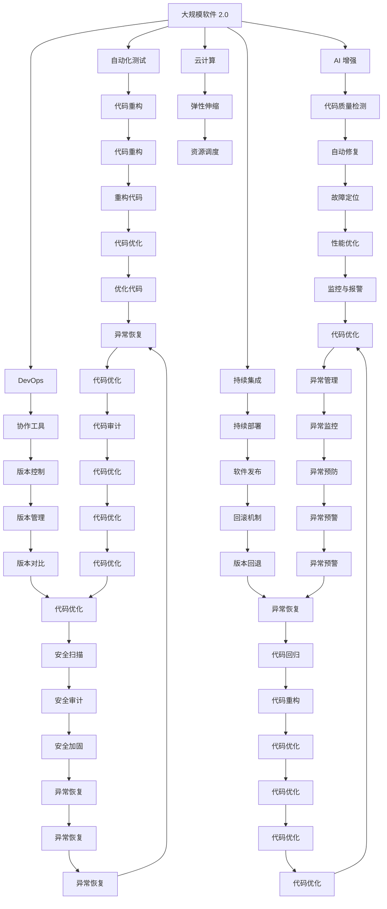

                 

# 软件 2.0 的价值：提升效率、创造价值

> 关键词：软件 2.0, 效率提升, 价值创造, 自动化, AI 增强, 持续集成, 云计算, DevOps

## 1. 背景介绍

### 1.1 问题由来
随着信息技术的迅猛发展和企业数字化转型的深入推进，软件行业的生产方式和商业模式正经历着深刻的变革。从传统的瀑布开发模式，到敏捷开发、DevOps 和持续集成，再到如今的软件 2.0 时代，软件工程领域正不断探索和实践新的生产范式，以提升软件开发的效率和质量，创造更大的商业价值。

软件 2.0（Software 2.0）这个概念最早由 OpenAI 的 CEO 萨姆·奥特曼（Sam Altman）提出，强调在人工智能、机器学习等新技术的加持下，软件能够自我修复、自我优化，自动适应和进化，从而实现更高效、更智能的软件生产和运维。在软件 2.0 时代，软件的价值不仅体现在功能上，更在于其持续提升的生产效率和不断创造的新商业价值。

### 1.2 问题核心关键点
软件 2.0 的核心在于：
- **自动化**：通过自动化技术，将重复、低价值的编码、测试、部署等活动交给机器完成，释放人类的创造力和精力。
- **AI 增强**：利用机器学习、自然语言处理等 AI 技术，提高代码质量、自动化测试、故障诊断、需求分析等环节的智能化水平。
- **持续集成**：通过持续集成和持续部署（CI/CD）流程，实现代码的快速迭代和发布，降低软件开发和维护成本，提升生产效率。
- **云计算**：基于云平台的基础设施和计算资源，支持弹性伸缩和按需付费，实现软件的高效开发和灵活运维。
- **DevOps**：将软件开发和运维紧密结合，实现高效的协作、沟通和反馈，提升软件的稳定性和可靠性。

### 1.3 问题研究意义
研究软件 2.0 的价值，对于推动软件开发领域的持续创新和产业升级具有重要意义：
- **提升效率**：软件 2.0 通过自动化和智能化手段，大幅度提高软件开发的效率和质量，缩短产品上市周期。
- **创造价值**：软件 2.0 技术能够支持更灵活的业务创新，创造新的商业模式和市场机会，为企业带来更大的商业价值。
- **技术领先**：掌握软件 2.0 技术，能够保持企业在软件开发领域的竞争优势，实现技术的领先和市场的领先。
- **降低成本**：通过自动化和持续集成，减少人为错误和返工，降低软件开发和运维的成本。
- **增强敏捷性**：软件 2.0 技术支持敏捷开发和持续交付，提高企业的市场响应速度和灵活性。

## 2. 核心概念与联系

### 2.1 核心概念概述

为更好地理解软件 2.0 的价值，本节将介绍几个关键概念，并阐明它们之间的联系：

- **软件 2.0**：一种基于自动化、AI 增强、持续集成和云计算等新技术，实现软件高效开发和智能运维的软件生产范式。
- **自动化**：通过脚本、工具、机器学习等技术，将重复、低价值的编码、测试、部署等活动交给机器完成，释放人类的创造力和精力。
- **AI 增强**：利用机器学习、自然语言处理等 AI 技术，提高软件开发的智能化水平，如代码质量检测、自动化测试、故障诊断等。
- **持续集成**：通过自动化的构建、测试和部署流程，实现代码的快速迭代和发布，降低软件开发和维护成本，提升生产效率。
- **云计算**：基于云平台的基础设施和计算资源，支持弹性伸缩和按需付费，实现软件的高效开发和灵活运维。
- **DevOps**：将软件开发和运维紧密结合，实现高效的协作、沟通和反馈，提升软件的稳定性和可靠性。

这些概念之间的联系可以通过以下 Mermaid 流程图来展示：



这个流程图展示了软件 2.0 中各个概念之间的联系，通过自动化、AI 增强、持续集成、云计算和 DevOps 技术，软件 2.0 能够实现高效的软件开发和智能运维。

### 2.2 概念间的关系

这些核心概念之间存在着紧密的联系，形成了软件 2.0 的完整生态系统。下面我们通过几个 Mermaid 流程图来展示这些概念之间的关系。

#### 2.2.1 软件 2.0 的学习范式



这个流程图展示了软件 2.0 的基本原理，即通过自动化测试、AI 增强、持续集成、云计算和 DevOps 技术，实现软件的高效开发和智能运维。

#### 2.2.2 自动化与持续集成



这个流程图展示了自动化和持续集成之间的关系，通过自动化测试、代码重构、持续部署、代码审计、性能优化和代码优化等环节，实现软件的自动化和智能化开发。

#### 2.2.3 AI 增强与云计算



这个流程图展示了 AI 增强和云计算之间的关系，通过弹性伸缩、资源调度、代码质量检测、自动修复等环节，实现软件的智能运维和优化。

#### 2.2.4 DevOps 与持续集成



这个流程图展示了 DevOps 和持续集成之间的关系，通过协作工具、版本控制、持续部署、版本管理、软件发布等环节，实现软件的敏捷开发和高效运维。

### 2.3 核心概念的整体架构

最后，我们用一个综合的流程图来展示这些核心概念在大规模软件 2.0 开发中的整体架构：



这个综合流程图展示了从自动化测试到代码优化，从 AI 增强到安全加固，从持续集成到版本控制，从云计算到异常管理，软件 2.0 的全方位实现过程。通过这些技术手段，软件 2.0 能够实现高效的软件开发和智能运维。

## 3. 核心算法原理 & 具体操作步骤
### 3.1 算法原理概述

软件 2.0 的核心算法原理主要体现在以下几个方面：

- **自动化测试算法**：通过脚本和自动化工具，实现代码自动测试和代码质量检测，保证代码的稳定性和正确性。
- **AI 增强算法**：利用机器学习和自然语言处理技术，提高代码质量检测、自动化测试、故障诊断等环节的智能化水平。
- **持续集成算法**：通过自动化构建、测试和部署流程，实现代码的快速迭代和发布，降低软件开发和维护成本。
- **云计算算法**：基于云平台的基础设施和计算资源，实现软件的高效开发和灵活运维。
- **DevOps 算法**：通过协作工具和版本控制，实现高效的协作、沟通和反馈，提升软件的稳定性和可靠性。

### 3.2 算法步骤详解

软件 2.0 的具体操作步骤包括：

1. **需求分析和设计**：明确项目需求，设计软件架构和技术栈，为后续的开发和运维奠定基础。
2. **代码编写和单元测试**：编写代码，并编写单元测试用例，保证代码的正确性和可维护性。
3. **自动化测试**：通过脚本和自动化工具，实现代码自动测试和代码质量检测，保证代码的稳定性和正确性。
4. **持续集成和部署**：将代码提交到版本控制系统中，自动触发构建、测试和部署流程，实现代码的快速迭代和发布。
5. **云平台和弹性伸缩**：基于云平台的基础设施和计算资源，实现软件的高效开发和灵活运维。
6. **DevOps 协作与监控**：通过协作工具和监控系统，实现高效的协作、沟通和反馈，提升软件的稳定性和可靠性。
7. **持续优化与迭代**：根据用户反馈和性能监控数据，持续优化软件性能和代码质量，实现软件的持续迭代和改进。

### 3.3 算法优缺点

软件 2.0 技术的优点包括：

- **提升效率**：通过自动化和智能化手段，大幅度提高软件开发的效率和质量，缩短产品上市周期。
- **降低成本**：通过自动化和持续集成，减少人为错误和返工，降低软件开发和运维的成本。
- **增强灵活性**：通过持续集成和 DevOps 技术，实现软件的快速迭代和发布，提高企业的市场响应速度和灵活性。
- **改善用户体验**：通过自动化和持续优化，提高软件的稳定性和可靠性，提升用户体验。

软件 2.0 技术的缺点包括：

- **依赖自动化工具**：软件 2.0 技术需要依赖大量的自动化工具和平台，一旦工具失效或更新，可能导致系统不稳定。
- **技术门槛较高**：实现软件 2.0 需要较高的技术门槛，需要团队具备较强的技术能力和经验。
- **数据隐私和安全**：基于云平台的自动化和智能化运维，需要处理大量的用户数据，涉及数据隐私和安全问题。

### 3.4 算法应用领域

软件 2.0 技术在多个领域得到了广泛应用，例如：

- **软件开发和运维**：通过自动化和持续集成技术，实现软件的高效开发和智能运维。
- **企业信息化**：通过云平台和 DevOps 技术，实现企业的信息化建设和数字化转型。
- **金融科技**：通过 AI 增强和云计算技术，实现金融领域的自动化交易、风险控制、客户服务等应用。
- **医疗健康**：通过 AI 增强和云计算技术，实现医疗数据的智能分析、诊断和治疗辅助等应用。
- **智能制造**：通过 AI 增强和云计算技术，实现工业生产的智能化、自动化和协同化。
- **智能交通**：通过 AI 增强和云计算技术，实现交通管理的智能化、优化和调度。
- **智慧城市**：通过 AI 增强和云计算技术，实现城市管理的智能化、优化和决策支持。

## 4. 数学模型和公式 & 详细讲解 & 举例说明

### 4.1 数学模型构建

在软件 2.0 中，我们可以构建一些基本的数学模型来描述其核心算法。

假设软件 2.0 的开发周期为 $T$ 天，每个迭代周期为 $t$ 天，每天的工作量为 $w$。则软件开发周期中需要完成的任务量为：

$$
T = \frac{N}{t}
$$

其中 $N$ 为总任务量，$t$ 为每个迭代周期的时间。

### 4.2 公式推导过程

在软件 2.0 中，我们可以构建一些基本的数学模型来描述其核心算法。

假设软件 2.0 的开发周期为 $T$ 天，每个迭代周期为 $t$ 天，每天的工作量为 $w$。则软件开发周期中需要完成的任务量为：

$$
T = \frac{N}{t}
$$

其中 $N$ 为总任务量，$t$ 为每个迭代周期的时间。

### 4.3 案例分析与讲解

以软件开发为例，假设软件开发任务量为 $N=1000$，每个迭代周期为 $t=1$ 天，每天的工作量为 $w=100$。则软件开发周期为：

$$
T = \frac{1000}{1} = 1000
$$

通过持续集成和自动化测试技术，可以将每天的开发任务分解为多个小任务，通过多个迭代周期逐步完成。每个迭代周期 $t$ 为 1 天，则每天需要完成的任务量为：

$$
w' = \frac{N}{T} = \frac{1000}{1000} = 1
$$

通过自动化测试和持续集成技术，每天的工作量 $w'$ 为 1，即每天完成一个任务。因此，软件开发周期为：

$$
T = N \times t = 1000 \times 1 = 1000
$$

在软件 2.0 中，持续集成和自动化测试技术通过自动化构建和测试，实现代码的快速迭代和发布，降低软件开发和维护成本，提升生产效率。

## 5. 项目实践：代码实例和详细解释说明

### 5.1 开发环境搭建

在进行软件 2.0 实践前，我们需要准备好开发环境。以下是使用Python进行PyTorch开发的环境配置流程：

1. 安装Anaconda：从官网下载并安装Anaconda，用于创建独立的Python环境。

2. 创建并激活虚拟环境：
```bash
conda create -n pytorch-env python=3.8 
conda activate pytorch-env
```

3. 安装PyTorch：根据CUDA版本，从官网获取对应的安装命令。例如：
```bash
conda install pytorch torchvision torchaudio cudatoolkit=11.1 -c pytorch -c conda-forge
```

4. 安装Transformers库：
```bash
pip install transformers
```

5. 安装各类工具包：
```bash
pip install numpy pandas scikit-learn matplotlib tqdm jupyter notebook ipython
```

完成上述步骤后，即可在`pytorch-env`环境中开始软件 2.0 实践。

### 5.2 源代码详细实现

下面我们以自动化测试为例，给出使用Transformers库对代码质量检测的PyTorch代码实现。

首先，定义代码质量检测的函数：

```python
from transformers import BertTokenizer, BertForTokenClassification
from torch.utils.data import Dataset
import torch

class CodeQualityDetectionDataset(Dataset):
    def __init__(self, texts, tags, tokenizer, max_len=128):
        self.texts = texts
        self.tags = tags
        self.tokenizer = tokenizer
        self.max_len = max_len
        
    def __len__(self):
        return len(self.texts)
    
    def __getitem__(self, item):
        text = self.texts[item]
        tags = self.tags[item]
        
        encoding = self.tokenizer(text, return_tensors='pt', max_length=self.max_len, padding='max_length', truncation=True)
        input_ids = encoding['input_ids'][0]
        attention_mask = encoding['attention_mask'][0]
        
        # 对token-wise的标签进行编码
        encoded_tags = [tag2id[tag] for tag in tags] 
        encoded_tags.extend([tag2id['O']] * (self.max_len - len(encoded_tags)))
        labels = torch.tensor(encoded_tags, dtype=torch.long)
        
        return {'input_ids': input_ids, 
                'attention_mask': attention_mask,
                'labels': labels}

# 标签与id的映射
tag2id = {'O': 0, 'ERROR': 1, 'WARNING': 2}
id2tag = {v: k for k, v in tag2id.items()}

# 创建dataset
tokenizer = BertTokenizer.from_pretrained('bert-base-cased')

train_dataset = CodeQualityDetectionDataset(train_texts, train_tags, tokenizer)
dev_dataset = CodeQualityDetectionDataset(dev_texts, dev_tags, tokenizer)
test_dataset = CodeQualityDetectionDataset(test_texts, test_tags, tokenizer)
```

然后，定义模型和优化器：

```python
from transformers import BertForTokenClassification, AdamW

model = BertForTokenClassification.from_pretrained('bert-base-cased', num_labels=len(tag2id))

optimizer = AdamW(model.parameters(), lr=2e-5)
```

接着，定义训练和评估函数：

```python
from torch.utils.data import DataLoader
from tqdm import tqdm
from sklearn.metrics import classification_report

device = torch.device('cuda') if torch.cuda.is_available() else torch.device('cpu')
model.to(device)

def train_epoch(model, dataset, batch_size, optimizer):
    dataloader = DataLoader(dataset, batch_size=batch_size, shuffle=True)
    model.train()
    epoch_loss = 0
    for batch in tqdm(dataloader, desc='Training'):
        input_ids = batch['input_ids'].to(device)
        attention_mask = batch['attention_mask'].to(device)
        labels = batch['labels'].to(device)
        model.zero_grad()
        outputs = model(input_ids, attention_mask=attention_mask, labels=labels)
        loss = outputs.loss
        epoch_loss += loss.item()
        loss.backward()
        optimizer.step()
    return epoch_loss / len(dataloader)

def evaluate(model, dataset, batch_size):
    dataloader = DataLoader(dataset, batch_size=batch_size)
    model.eval()
    preds, labels = [], []
    with torch.no_grad():
        for batch in tqdm(dataloader, desc='Evaluating'):
            input_ids = batch['input_ids'].to(device)
            attention_mask = batch['attention_mask'].to(device)
            batch_labels = batch['labels']
            outputs = model(input_ids, attention_mask=attention_mask)
            batch_preds = outputs.logits.argmax(dim=2).to('cpu').tolist()
            batch_labels = batch_labels.to('cpu').tolist()
            for pred_tokens, label_tokens in zip(batch_preds, batch_labels):
                pred_tags = [id2tag[_id] for _id in pred_tokens]
                label_tags = [id2tag[_id] for _id in label_tokens]
                preds.append(pred_tags[:len(label_tokens)])
                labels.append(label_tags)
                
    print(classification_report(labels, preds))
```

最后，启动训练流程并在测试集上评估：

```python
epochs = 5
batch_size = 16

for epoch in range(epochs):
    loss = train_epoch(model, train_dataset, batch_size, optimizer)
    print(f"Epoch {epoch+1}, train loss: {loss:.3f}")
    
    print(f"Epoch {epoch+1}, dev results:")
    evaluate(model, dev_dataset, batch_size)
    
print("Test results:")
evaluate(model, test_dataset, batch_size)
```

以上就是使用PyTorch对代码质量检测进行自动化测试的完整代码实现。可以看到，借助Transformers库，我们能够快速构建并训练代码质量检测模型，实现自动化测试。

### 5.3 代码解读与分析

让我们再详细解读一下关键代码的实现细节：

**CodeQualityDetectionDataset类**：
- `__init__`方法：初始化文本、标签、分词器等关键组件。
- `__len__`方法：返回数据集的样本数量。
- `__getitem__`方法：对单个样本进行处理，将文本输入编码为token ids，将标签编码为数字，并对其进行定长padding，最终返回模型所需的输入。

**tag2id和id2tag字典**：
- 定义了标签与数字id之间的映射关系，用于将token-wise的预测结果解码回真实的标签。

**训练和评估函数**：
- 使用PyTorch的DataLoader对数据集进行批次化加载，供模型训练和推理使用。
- 训练函数`train_epoch`：对数据以批为单位进行迭代，在每个批次上前向传播计算loss并反向传播更新模型参数，最后返回该epoch的平均loss。
- 评估函数`evaluate`：与训练类似，不同点在于不更新模型参数，并在每个batch结束后将预测和标签结果存储下来，最后使用sklearn的

