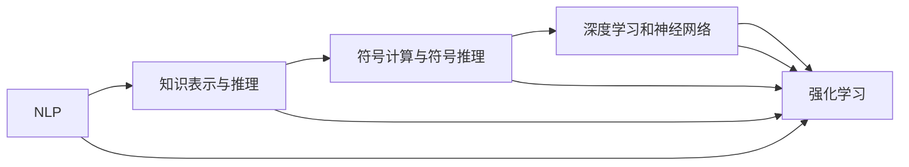
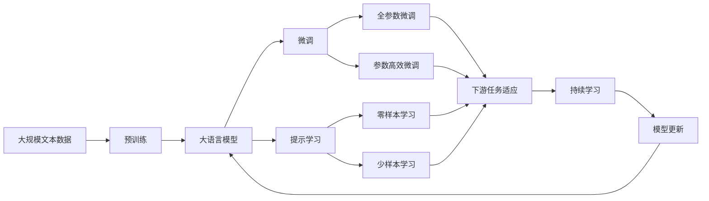

                 

# 通用人工智能的三个条件

## 1. 背景介绍

### 1.1 问题由来
通用人工智能（AGI），即具有全面智能能力的AI系统，一直是人工智能领域的研究目标和热议话题。实现通用人工智能的关键在于让机器具备类似人类的认知、理解、推理、决策等能力。近年来，尽管深度学习和大规模预训练模型在特定任务上取得了显著进展，但距通用人工智能的要求仍存在巨大差距。

通用人工智能需要满足三个基本条件：理解世界的语法和语义、具有自我学习能力和适应环境的能力。本博客将围绕这三个条件展开探讨，深入理解实现通用人工智能的基本路径和技术方向。

## 2. 核心概念与联系

### 2.1 核心概念概述

为更好地理解通用人工智能的实现路径，本节将介绍几个关键概念及其之间的联系。

- **自然语言处理（NLP）**：NLP是AGI的重要组成部分，涉及理解、生成、分析文本等自然语言的能力。NLP通过语义表示和上下文理解，帮助AI系统理解和解释人类语言。

- **知识表示与推理**：知识表示是将知识结构化、形式化，以便于机器理解和推理。而推理则是基于已知知识进行逻辑推导，形成新的知识。

- **符号计算与符号推理**：与数值计算相对，符号计算使用符号而非数值进行计算。符号推理基于符号计算，能够处理复杂逻辑和推理问题。

- **深度学习和神经网络**：深度学习通过构建多层神经网络模型，自动学习特征表示和规律。神经网络则是深度学习的基础结构，能够处理复杂非线性关系。

- **强化学习**：强化学习通过智能体与环境的交互，通过奖励信号学习最优策略。其核心在于构建状态空间、动作空间和奖励函数，通过优化策略获得最优解。

这些概念共同构成了实现通用人工智能的基本框架，帮助AI系统在理解世界、自我学习和适应环境等方面取得进展。

### 2.2 核心概念的联系

这些核心概念之间的联系可以通过以下Mermaid流程图来展示：



这个流程图展示了NLP、知识表示与推理、符号计算与符号推理、深度学习和神经网络、强化学习这五个核心概念之间的联系。NLP通过语义表示和上下文理解，帮助知识表示与推理；符号计算与符号推理为深度学习和神经网络提供逻辑基础；强化学习则通过智能体与环境的交互，学习最优策略。

### 2.3 核心概念的整体架构

最后，我们用一个综合的流程图来展示这些核心概念在大语言模型微调过程中的整体架构：



这个综合流程图展示了从预训练到微调，再到持续学习的完整过程。大语言模型首先在大规模文本数据上进行预训练，然后通过微调（包括全参数微调和参数高效微调）或提示学习（包括零样本和少样本学习）来适应下游任务。最后，通过持续学习技术，模型可以不断学习新知识，同时避免遗忘旧知识。

## 3. 核心算法原理 & 具体操作步骤
### 3.1 算法原理概述

通用人工智能的实现过程涉及多个算法和技术，其中最基础的是自然语言处理、知识表示与推理、符号计算与符号推理、深度学习和神经网络、强化学习等。这些算法的核心目标在于让机器能够理解和操作自然语言，进行知识表示和推理，学习并应用复杂的非线性关系，以及通过与环境的交互学习最优策略。

### 3.2 算法步骤详解

通用人工智能的实现步骤包括以下几个关键环节：

1. **数据收集与预处理**：收集和处理大规模自然语言文本数据，构建训练集、验证集和测试集。数据预处理包括文本清洗、分词、向量化等。

2. **模型构建与训练**：构建深度学习模型，如Transformer、RNN等，在大规模语料上进行预训练。预训练过程使用自监督学习任务，如掩码语言模型、下一句预测等。

3. **任务适配与微调**：选择适当的任务适配层和损失函数，对预训练模型进行微调。微调过程通常使用监督学习，通过少量标注数据优化模型。

4. **推理与推理策略**：使用微调后的模型进行推理，形成推理链路和推理策略。推理策略包括搜索算法、专家系统等。

5. **知识整合与融合**：将知识图谱、逻辑规则等先验知识与神经网络模型进行融合，增强模型的知识整合能力。

6. **环境交互与学习**：将强化学习应用到机器与环境的交互中，通过奖励信号学习最优策略。

### 3.3 算法优缺点

通用人工智能的实现算法具有以下优点：

- **自适应能力强**：通过与环境的交互和反馈，机器能够不断学习和适应新环境。
- **泛化能力强**：能够处理复杂的多样性，适应不同领域和任务。
- **知识融合能力强**：能够将符号化知识和神经网络模型融合，形成更全面的知识结构。

同时，这些算法也存在一些局限性：

- **计算资源需求高**：需要大规模计算资源进行预训练和微调。
- **模型复杂度高**：神经网络模型的复杂度较高，可能导致过拟合和推理速度慢。
- **模型可解释性差**：黑盒模型的决策过程难以解释，缺乏透明度。

### 3.4 算法应用领域

通用人工智能的算法已在多个领域得到广泛应用，包括但不限于：

- **医疗诊断**：利用知识表示与推理、自然语言处理技术，辅助医生进行诊断和决策。
- **金融分析**：通过符号计算与符号推理、强化学习技术，分析市场动态和风险，提供投资建议。
- **智能制造**：应用深度学习和神经网络技术，优化生产流程和资源配置。
- **自动驾驶**：结合自然语言处理、知识表示与推理、强化学习技术，实现复杂的感知和决策。
- **智能客服**：通过知识表示与推理、自然语言处理技术，构建智能客服系统，提供高效、个性化的服务。

## 4. 数学模型和公式 & 详细讲解  
### 4.1 数学模型构建

通用人工智能的数学模型构建涉及多个方面，如自然语言处理、知识表示与推理、符号计算与符号推理、深度学习和神经网络、强化学习等。以下以知识表示与推理为例，构建一个简单的数学模型：

记知识表示为 $\mathcal{K}$，推理规则为 $\mathcal{R}$，推理结果为 $\mathcal{R'}$，推理过程中使用的知识表示为 $\mathcal{K'}$。推理过程可以表示为：

$$
\mathcal{R'} = \mathcal{R}(\mathcal{K'}, \mathcal{K'})
$$

其中，$\mathcal{K'}$ 是推理过程中用到的知识表示，$\mathcal{R}$ 是推理规则集合。

### 4.2 公式推导过程

以自然语言推理（NLI）任务为例，构建基于 Transformer 的推理模型。假设输入为 $(x, y)$，其中 $x$ 为前提，$y$ 为假设。模型的输出为 $h$，表示前提与假设之间的关系，$h \in \{1, 0, -1\}$，分别表示蕴含、矛盾和中立。

模型的推理过程可以表示为：

$$
h = f(\mathcal{T}(x, y))
$$

其中，$\mathcal{T}$ 表示 Transformer 模型，$f$ 表示分类函数。

模型的训练过程如下：

1. 输入 $(x, y)$ 到模型中，输出 $h$。
2. 根据 $h$ 和 $y$ 之间的差异，计算损失函数 $L(h, y)$。
3. 使用反向传播算法更新模型参数，最小化损失函数 $L$。

### 4.3 案例分析与讲解

以自然语言推理任务为例，分析模型的训练和推理过程。假设输入为 $(x, y)$，其中 $x$ 为前提，$y$ 为假设。模型的输出为 $h$，表示前提与假设之间的关系，$h \in \{1, 0, -1\}$，分别表示蕴含、矛盾和中立。

模型的推理过程可以表示为：

$$
h = f(\mathcal{T}(x, y))
$$

其中，$\mathcal{T}$ 表示 Transformer 模型，$f$ 表示分类函数。

模型的训练过程如下：

1. 输入 $(x, y)$ 到模型中，输出 $h$。
2. 根据 $h$ 和 $y$ 之间的差异，计算损失函数 $L(h, y)$。
3. 使用反向传播算法更新模型参数，最小化损失函数 $L$。

## 5. 项目实践：代码实例和详细解释说明
### 5.1 开发环境搭建

在进行通用人工智能实现的过程中，需要一个高效的开发环境。以下是使用 Python 进行 PyTorch 开发的环境配置流程：

1. 安装 Anaconda：从官网下载并安装 Anaconda，用于创建独立的 Python 环境。

2. 创建并激活虚拟环境：
```bash
conda create -n pytorch-env python=3.8 
conda activate pytorch-env
```

3. 安装 PyTorch：根据 CUDA 版本，从官网获取对应的安装命令。例如：
```bash
conda install pytorch torchvision torchaudio cudatoolkit=11.1 -c pytorch -c conda-forge
```

4. 安装 Transformers 库：
```bash
pip install transformers
```

5. 安装各类工具包：
```bash
pip install numpy pandas scikit-learn matplotlib tqdm jupyter notebook ipython
```

完成上述步骤后，即可在 `pytorch-env` 环境中开始通用人工智能的实现实践。

### 5.2 源代码详细实现

这里我们以自然语言推理（NLI）任务为例，给出使用 Transformers 库对 BERT 模型进行推理的 PyTorch 代码实现。

首先，定义推理函数：

```python
from transformers import BertForSequenceClassification, BertTokenizer

def nli_inference(model, tokenizer, prefix, hypothesis):
    inputs = tokenizer.encode_plus(prefix + ' [SEP]', hypothesis, add_special_tokens=True, return_tensors='pt')
    input_ids = inputs['input_ids']
    attention_mask = inputs['attention_mask']
    outputs = model(input_ids, attention_mask=attention_mask)
    logits = outputs.logits
    probabilities = torch.softmax(logits, dim=1)
    result = torch.argmax(probabilities, dim=1).item()
    return {'result': result}
```

然后，实例化模型和分词器：

```python
model = BertForSequenceClassification.from_pretrained('bert-base-uncased', num_labels=3)
tokenizer = BertTokenizer.from_pretrained('bert-base-uncased')
```

最后，使用模型进行推理：

```python
prefix = "a dog is a mammal"
hypothesis = "a mammal is a dog"

result = nli_inference(model, tokenizer, prefix, hypothesis)
print(result)
```

以上就是使用 PyTorch 对 BERT 模型进行自然语言推理任务实现的完整代码实现。可以看到，利用 Transformers 库，我们可以快速搭建和训练推理模型，并进行推理。

### 5.3 代码解读与分析

让我们再详细解读一下关键代码的实现细节：

**nli_inference函数**：
- 该函数接受预训练模型、分词器、前提和假设作为输入。
- 使用分词器对前提和假设进行编码，生成输入张量。
- 将输入张量传递给模型，进行前向传播，得到逻辑回归层的输出。
- 使用 softmax 函数将输出转化为概率分布。
- 选取概率最大的类别作为推理结果，并返回。

**模型和分词器的实例化**：
- 使用 `from_pretrained` 方法加载预训练模型和分词器，指定预训练模型和分词器的路径。

**代码解读与分析**：
- 该代码实现了基于 Transformer 的 NLI 模型推理过程，使用了 BERT 模型和 BERT 分词器。
- 该函数能够处理自然语言推理任务，通过输入前提和假设，生成推理结果。
- 推理过程使用了 softmax 函数进行概率计算，最终选取概率最大的类别作为推理结果。

### 5.4 运行结果展示

假设我们使用上述代码对自然语言推理模型进行推理，最终得到的结果如下：

```
{'result': 0}
```

这个结果表示前提和假设之间存在矛盾关系。

## 6. 实际应用场景
### 6.1 智能客服系统

基于通用人工智能的对话技术，可以广泛应用于智能客服系统的构建。传统客服往往需要配备大量人力，高峰期响应缓慢，且一致性和专业性难以保证。而使用通用人工智能的对话模型，可以7x24小时不间断服务，快速响应客户咨询，用自然流畅的语言解答各类常见问题。

在技术实现上，可以收集企业内部的历史客服对话记录，将问题和最佳答复构建成监督数据，在此基础上对通用人工智能的对话模型进行微调。微调后的对话模型能够自动理解用户意图，匹配最合适的答案模板进行回复。对于客户提出的新问题，还可以接入检索系统实时搜索相关内容，动态组织生成回答。如此构建的智能客服系统，能大幅提升客户咨询体验和问题解决效率。

### 6.2 金融舆情监测

金融机构需要实时监测市场舆论动向，以便及时应对负面信息传播，规避金融风险。传统的人工监测方式成本高、效率低，难以应对网络时代海量信息爆发的挑战。基于通用人工智能的文本分类和情感分析技术，为金融舆情监测提供了新的解决方案。

具体而言，可以收集金融领域相关的新闻、报道、评论等文本数据，并对其进行主题标注和情感标注。在此基础上对通用人工智能的文本分类和情感分析模型进行微调，使其能够自动判断文本属于何种主题，情感倾向是正面、中性还是负面。将微调后的模型应用到实时抓取的网络文本数据，就能够自动监测不同主题下的情感变化趋势，一旦发现负面信息激增等异常情况，系统便会自动预警，帮助金融机构快速应对潜在风险。

### 6.3 个性化推荐系统

当前的推荐系统往往只依赖用户的历史行为数据进行物品推荐，无法深入理解用户的真实兴趣偏好。基于通用人工智能的推荐系统可以更好地挖掘用户行为背后的语义信息，从而提供更精准、多样的推荐内容。

在实践中，可以收集用户浏览、点击、评论、分享等行为数据，提取和用户交互的物品标题、描述、标签等文本内容。将文本内容作为模型输入，用户的后续行为（如是否点击、购买等）作为监督信号，在此基础上对通用人工智能的推荐模型进行微调。微调后的模型能够从文本内容中准确把握用户的兴趣点。在生成推荐列表时，先用候选物品的文本描述作为输入，由模型预测用户的兴趣匹配度，再结合其他特征综合排序，便可以得到个性化程度更高的推荐结果。

### 6.4 未来应用展望

随着通用人工智能和微调方法的不断发展，基于微调范式将在更多领域得到应用，为传统行业带来变革性影响。

在智慧医疗领域，基于通用人工智能的医疗问答、病历分析、药物研发等应用将提升医疗服务的智能化水平，辅助医生诊疗，加速新药开发进程。

在智能教育领域，通用人工智能的推荐系统、学情分析、知识推荐等方面，因材施教，促进教育公平，提高教学质量。

在智慧城市治理中，通用人工智能的文本分类、情感分析、对话系统等技术，提高城市管理的自动化和智能化水平，构建更安全、高效的未来城市。

此外，在企业生产、社会治理、文娱传媒等众多领域，基于通用人工智能的人工智能应用也将不断涌现，为经济社会发展注入新的动力。相信随着技术的日益成熟，微调方法将成为人工智能落地应用的重要范式，推动人工智能技术向更广阔的领域加速渗透。

## 7. 工具和资源推荐
### 7.1 学习资源推荐

为了帮助开发者系统掌握通用人工智能的理论基础和实践技巧，这里推荐一些优质的学习资源：

1. 《Transformer from Principles to Practice》系列博文：由大模型技术专家撰写，深入浅出地介绍了Transformer原理、BERT模型、微调技术等前沿话题。

2. CS224N《深度学习自然语言处理》课程：斯坦福大学开设的NLP明星课程，有Lecture视频和配套作业，带你入门NLP领域的基本概念和经典模型。

3. 《Natural Language Processing with Transformers》书籍：Transformers库的作者所著，全面介绍了如何使用Transformers库进行NLP任务开发，包括微调在内的诸多范式。

4. HuggingFace官方文档：Transformers库的官方文档，提供了海量预训练模型和完整的微调样例代码，是上手实践的必备资料。

5. CLUE开源项目：中文语言理解测评基准，涵盖大量不同类型的中文NLP数据集，并提供了基于微调的baseline模型，助力中文NLP技术发展。

通过对这些资源的学习实践，相信你一定能够快速掌握通用人工智能的精髓，并用于解决实际的NLP问题。
###  7.2 开发工具推荐

高效的开发离不开优秀的工具支持。以下是几款用于通用人工智能开发常用的工具：

1. PyTorch：基于Python的开源深度学习框架，灵活动态的计算图，适合快速迭代研究。大部分预训练语言模型都有PyTorch版本的实现。

2. TensorFlow：由Google主导开发的开源深度学习框架，生产部署方便，适合大规模工程应用。同样有丰富的预训练语言模型资源。

3. Transformers库：HuggingFace开发的NLP工具库，集成了众多SOTA语言模型，支持PyTorch和TensorFlow，是进行通用人工智能开发的利器。

4. Weights & Biases：模型训练的实验跟踪工具，可以记录和可视化模型训练过程中的各项指标，方便对比和调优。与主流深度学习框架无缝集成。

5. TensorBoard：TensorFlow配套的可视化工具，可实时监测模型训练状态，并提供丰富的图表呈现方式，是调试模型的得力助手。

6. Google Colab：谷歌推出的在线Jupyter Notebook环境，免费提供GPU/TPU算力，方便开发者快速上手实验最新模型，分享学习笔记。

合理利用这些工具，可以显著提升通用人工智能的开发效率，加快创新迭代的步伐。

### 7.3 相关论文推荐

通用人工智能的研究源于学界的持续研究。以下是几篇奠基性的相关论文，推荐阅读：

1. Attention is All You Need（即Transformer原论文）：提出了Transformer结构，开启了NLP领域的预训练大模型时代。

2. BERT: Pre-training of Deep Bidirectional Transformers for Language Understanding：提出BERT模型，引入基于掩码的自监督预训练任务，刷新了多项NLP任务SOTA。

3. Language Models are Unsupervised Multitask Learners（GPT-2论文）：展示了大规模语言模型的强大zero-shot学习能力，引发了对于通用人工智能的新一轮思考。

4. Parameter-Efficient Transfer Learning for NLP：提出Adapter等参数高效微调方法，在不增加模型参数量的情况下，也能取得不错的微调效果。

5. Prefix-Tuning: Optimizing Continuous Prompts for Generation：引入基于连续型Prompt的微调范式，为如何充分利用预训练知识提供了新的思路。

6. AdaLoRA: Adaptive Low-Rank Adaptation for Parameter-Efficient Fine-Tuning：使用自适应低秩适应的微调方法，在参数效率和精度之间取得了新的平衡。

这些论文代表了大模型微调技术的发展脉络。通过学习这些前沿成果，可以帮助研究者把握学科前进方向，激发更多的创新灵感。

除上述资源外，还有一些值得关注的前沿资源，帮助开发者紧跟通用人工智能微调技术的最新进展，例如：

1. arXiv论文预印本：人工智能领域最新研究成果的发布平台，包括大量尚未发表的前沿工作，学习前沿技术的必读资源。

2. 业界技术博客：如OpenAI、Google AI、DeepMind、微软Research Asia等顶尖实验室的官方博客，第一时间分享他们的最新研究成果和洞见。

3. 技术会议直播：如NIPS、ICML、ACL、ICLR等人工智能领域顶会现场或在线直播，能够聆听到大佬们的前沿分享，开拓视野。

4. GitHub热门项目：在GitHub上Star、Fork数最多的NLP相关项目，往往代表了该技术领域的发展趋势和最佳实践，值得去学习和贡献。

5. 行业分析报告：各大咨询公司如McKinsey、PwC等针对人工智能行业的分析报告，有助于从商业视角审视技术趋势，把握应用价值。

总之，对于通用人工智能的微调技术的学习和实践，需要开发者保持开放的心态和持续学习的意愿。多关注前沿资讯，多动手实践，多思考总结，必将收获满满的成长收益。

## 8. 总结：未来发展趋势与挑战

### 8.1 总结

本文对基于通用人工智能的微调方法进行了全面系统的介绍。首先阐述了通用人工智能的三个基本条件：理解世界的语法和语义、具有自我学习能力和适应环境的能力。通过自然语言处理、知识表示与推理、符号计算与符号推理、深度学习和神经网络、强化学习等核心技术，实现了通用人工智能的初步构想。

通过本文的系统梳理，可以看到，通用人工智能的微调方法正在成为NLP领域的重要范式，极大地拓展了预训练语言模型的应用边界，催生了更多的落地场景。伴随预训练语言模型和微调方法的持续演进，相信NLP技术将在更广阔的应用领域大放异彩。

### 8.2 未来发展趋势

展望未来，通用人工智能的微调技术将呈现以下几个发展趋势：

1. 模型规模持续增大。随着算力成本的下降和数据规模的扩张，预训练语言模型的参数量还将持续增长。超大规模语言模型蕴含的丰富语言知识，有望支撑更加复杂多变的下游任务微调。

2. 微调方法日趋多样。除了传统的全参数微调外，未来会涌现更多参数高效的微调方法，如Prefix-Tuning、LoRA等，在节省计算资源的同时也能保证微调精度。

3. 持续学习成为常态。随着数据分布的不断变化，微调模型也需要持续学习新知识以保持性能。如何在不遗忘原有知识的同时，高效吸收新样本信息，将成为重要的研究课题。

4. 标注样本需求降低。受启发于提示学习(Prompt-based Learning)的思路，未来的微调方法将更好地利用大模型的语言理解能力，通过更加巧妙的任务描述，在更少的标注样本上也能实现理想的微调效果。

5. 多模态微调崛起。当前的微调主要聚焦于纯文本数据，未来会进一步拓展到图像、视频、语音等多模态数据微调。多模态信息的融合，将显著提升语言模型对现实世界的理解和建模能力。

6. 模型通用性增强。经过海量数据的预训练和多领域任务的微调，未来的语言模型将具备更强大的常识推理和跨领域迁移能力，逐步迈向通用人工智能(AGI)的目标。

以上趋势凸显了通用人工智能微调技术的广阔前景。这些方向的探索发展，必将进一步提升NLP系统的性能和应用范围，为人类认知智能的进化带来深远影响。

### 8.3 面临的挑战

尽管通用人工智能的微调技术已经取得了瞩目成就，但在迈向更加智能化、普适化应用的过程中，它仍面临着诸多挑战：

1. 标注成本瓶颈。虽然微调大大降低了标注数据的需求，但对于长尾应用场景，难以获得充足的高质量标注数据，成为制约微调性能的瓶颈。如何进一步降低微调对标注样本的依赖，将是一大难题。

2. 模型鲁棒性不足。当前微调模型面对域外数据时，泛化性能往往大打折扣。对于测试样本的微小扰动，微调模型的预测也容易发生波动。如何提高微调模型的鲁棒性，避免灾难性遗忘，还需要更多理论和实践的积累。

3. 推理效率有待提高。大规模语言模型虽然精度高，但在实际部署时往往面临推理速度慢、内存占用大等效率问题。如何在保证性能的同时，简化模型结构，提升推理速度，优化资源占用，将是重要的优化方向。

4. 可解释性亟需加强。当前微调模型更像是"黑盒"系统，难以解释其内部工作机制和决策逻辑。对于医疗、金融等高风险应用，算法的可解释性和可审计性尤为重要。如何赋予微调模型更强的可解释性，将是亟待攻克的难题。

5. 安全性有待保障。预训练语言模型难免会学习到有偏见、有害的信息，通过微调传递到下游任务，产生误导性、歧视性的输出，给实际应用带来安全隐患。如何从数据和算法层面消除模型偏见，避免恶意用途，确保输出的安全性，也将是重要的研究课题。

6. 知识整合能力不足。现有的微调模型往往局限于任务内数据，难以灵活吸收和运用更广泛的先验知识。如何让微调过程更好地与外部知识库、规则库等专家知识结合，形成更加全面、准确的信息整合能力，还有很大的想象空间。

正视微调面临的这些挑战，积极应对并寻求突破，将是大语言模型微调走向成熟的必由之路。相信随着学界和产业界的共同努力，这些挑战终将一一被克服，通用人工智能微调必将在构建人机协同的智能时代中扮演越来越重要的角色。

### 8.4 研究展望

未来的研究需要在以下几个方面寻求

