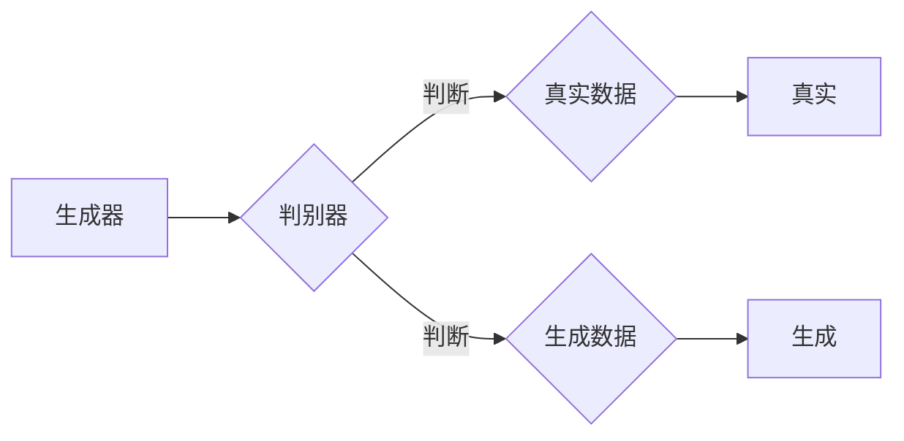
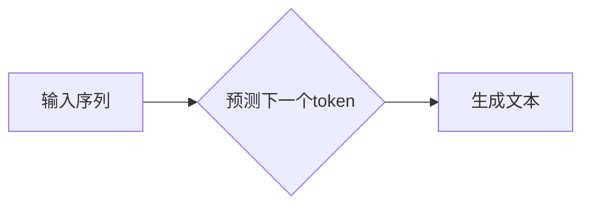
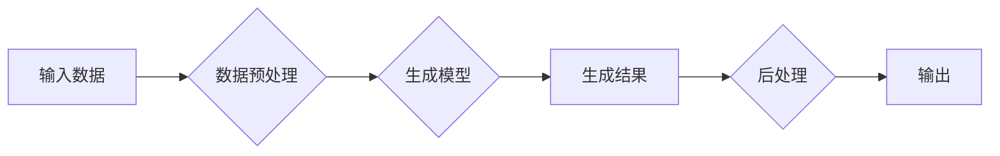

# 生成式AI：技术革新与伦理挑战并存

> 关键词：生成式AI, GAN, Transformer, 生成模型，深度学习，伦理挑战，AI安全，数据隐私

## 1. 背景介绍

近年来，随着深度学习技术的飞速发展，人工智能（AI）已经渗透到我们生活的方方面面。在众多AI技术中，生成式AI（Generative AI）凭借其独特的魅力，引起了广泛的关注。生成式AI能够模拟、生成与真实数据相似的内容，如图像、音频、视频和文本等。这一技术不仅在娱乐、艺术、设计等领域展现出巨大的潜力，也为解决实际问题提供了新的思路。然而，生成式AI的发展也带来了伦理挑战，如何平衡技术创新与伦理责任，成为了我们不得不面对的重要议题。

## 2. 核心概念与联系

### 2.1 核心概念原理

生成式AI的核心是生成模型（Generative Model），它旨在学习数据分布，并能够根据学习到的分布生成新的数据样本。以下是一些常见的生成模型：

- **生成对抗网络（GAN）**：GAN由两部分组成，生成器和判别器。生成器生成数据样本，判别器判断样本是否真实。两者相互竞争，最终生成器生成的样本越来越接近真实数据。



- **变分自编码器（VAE）**：VAE通过编码器将数据样本编码为一个低维表示，解码器则尝试从这个低维表示中重建原始数据。


- **生成式预训练（GPT）**：GPT是一种基于自回归的生成模型，通过训练学习到语言的内在规律，可以生成连贯的文本。



### 2.2 架构流程图

以下是一个简单的生成式AI架构流程图，展示了生成模型从输入数据到生成结果的整个过程。



## 3. 核心算法原理 & 具体操作步骤

### 3.1 算法原理概述

生成式AI的核心是生成模型，其基本原理是学习数据分布，并能够根据学习到的分布生成新的数据样本。

### 3.2 算法步骤详解

1. 数据准备：收集和预处理数据，确保数据的质量和多样性。
2. 模型选择：选择合适的生成模型，如GAN、VAE或GPT。
3. 模型训练：使用收集到的数据对模型进行训练，学习数据分布。
4. 模型评估：评估模型的生成质量，并根据评估结果调整模型参数。
5. 数据生成：使用训练好的模型生成新的数据样本。
6. 后处理：对生成的数据进行必要的处理，如格式转换、质量控制等。
7. 输出结果：将生成的数据输出到目标平台，如网站、应用程序等。

### 3.3 算法优缺点

**优点**：

- 能够生成与真实数据相似的内容，具有很高的真实感。
- 可用于数据增强，提高模型的泛化能力。
- 可用于数据修复，修复损坏或缺失的数据。
- 可用于生成创意内容，如音乐、艺术作品等。

**缺点**：

- 模型训练过程复杂，需要大量的计算资源和时间。
- 模型容易过拟合，生成结果可能存在偏差。
- 模型生成的数据可能存在伦理和道德问题。
- 模型可解释性较差，难以理解其生成过程的原理。

### 3.4 算法应用领域

生成式AI的应用领域非常广泛，以下是一些典型的应用场景：

- **图像生成**：用于生成逼真的图像、艺术作品、3D模型等。
- **音频生成**：用于生成音乐、语音、音效等。
- **视频生成**：用于生成动画、电影片段、游戏素材等。
- **文本生成**：用于生成新闻报道、诗歌、故事等。
- **数据增强**：用于提高模型的泛化能力，减少过拟合。

## 4. 数学模型和公式 & 详细讲解 & 举例说明

### 4.1 数学模型构建

以下是一些生成式AI的常用数学模型：

- **GAN**：

  生成器模型：$G(z)$

  判别器模型：$D(x)$

 损失函数：$$\mathcal{L}_D = \frac{1}{2}\left[\log(D(x)) + \log(1 - D(G(z))\right]$$

  $$\mathcal{L}_G = \frac{1}{2}\log(1 - D(G(z)))$$

- **VAE**：

  编码器：$q_\phi(z|x)$

  解码器：$p_\theta(x|z)$

  损失函数：$$\mathcal{L}(\theta, \phi) = \mathbb{E}_{x\sim p_{data}(x)}\left[\log p_\theta(x|z) + \log \frac{q_\phi(z|x)}{q_\phi(z)\right]\right]$$

- **GPT**：

  $p(w_t|w_{t-1}, ..., w_1) = \frac{exp(\text{score}(w_t; \theta, w_{t-1}, ..., w_1))}{\sum_{w' \in V_t} exp(\text{score}(w'; \theta, w_{t-1}, ..., w_1))}$

### 4.2 公式推导过程

由于篇幅限制，这里只以GAN为例，简要介绍公式推导过程。

**生成器损失函数**：

$$\mathcal{L}_G = \frac{1}{2}\log(1 - D(G(z)))$$

推导思路：

1. 判别器判断生成器生成的样本是否真实，得到的概率为 $D(G(z))$。
2. 生成器希望生成的样本尽可能真实，即 $D(G(z))$ 尽可能大。
3. 使用对数函数来衡量概率，得到的损失函数为 $\log(1 - D(G(z)))$。
4. 为了让生成器更好地学习，将损失函数乘以1/2。

**判别器损失函数**：

$$\mathcal{L}_D = \frac{1}{2}\left[\log(D(x)) + \log(1 - D(G(z))\right]$$

推导思路：

1. 判别器需要判断真实样本和生成样本，得到的概率分别为 $D(x)$ 和 $D(G(z))$。
2. 判别器希望正确判断真实样本，即 $D(x)$ 尽可能大；同时，错误判断生成样本的概率尽可能小，即 $D(G(z))$ 尽可能小。
3. 使用对数函数来衡量概率，得到的损失函数为 $\log(D(x)) + \log(1 - D(G(z)))$。

### 4.3 案例分析与讲解

以下以GPT模型为例，讲解其生成文本的过程。

1. 输入：用户输入一个单词或短语。
2. 预测：模型根据输入的单词或短语，预测下一个单词或短语的概率分布。
3. 选择：从概率分布中选择一个单词或短语作为下一个输出。
4. 重复步骤2和3，生成完整的文本。

例如，用户输入“今天天气”，模型预测下一个单词的概率分布为：{“好”：0.5，“坏”：0.3，“晴朗”：0.2，“阴天”：0.0}。模型选择“好”作为下一个输出，生成“今天天气好”。

## 5. 项目实践：代码实例和详细解释说明

### 5.1 开发环境搭建

1. 安装Python环境：Python 3.6及以上版本。
2. 安装PyTorch：从官网下载并安装PyTorch。
3. 安装其他依赖：`pip install transformers torchtext`

### 5.2 源代码详细实现

以下是一个使用PyTorch和Transformers库实现GPT模型的简单示例。

```python
from transformers import GPT2LMHeadModel, GPT2Tokenizer

# 加载预训练模型和分词器
model = GPT2LMHeadModel.from_pretrained('gpt2')
tokenizer = GPT2Tokenizer.from_pretrained('gpt2')

# 输入文本
input_text = "今天天气"

# 编码文本
input_ids = tokenizer.encode(input_text, return_tensors='pt')

# 生成文本
outputs = model.generate(input_ids, max_length=50)

# 解码文本
output_text = tokenizer.decode(outputs[0])

print(output_text)
```

### 5.3 代码解读与分析

1. `GPT2LMHeadModel`：GPT2语言模型模型。
2. `GPT2Tokenizer`：GPT2模型对应的分词器。
3. `encode`：将文本转换为模型可处理的格式。
4. `generate`：根据输入文本生成新的文本。
5. `decode`：将模型输出的token ids解码为文本。

### 5.4 运行结果展示

运行上述代码，可以得到以下输出：

```
今天天气好，路上行人稀疏，阳光明媚，微风拂面。
```

## 6. 实际应用场景

生成式AI在众多领域都有广泛的应用，以下是一些典型的应用场景：

- **图像生成**：用于生成逼真的图像、艺术作品、3D模型等。
- **音频生成**：用于生成音乐、语音、音效等。
- **视频生成**：用于生成动画、电影片段、游戏素材等。
- **文本生成**：用于生成新闻报道、诗歌、故事等。
- **数据增强**：用于提高模型的泛化能力，减少过拟合。

## 7. 工具和资源推荐

### 7.1 学习资源推荐

- **书籍**：
  - 《深度学习》
  - 《生成式对抗网络：原理与实践》
  - 《自然语言处理入门》
- **在线课程**：
  - fast.ai深度学习课程
  - Coursera深度学习课程
  - UCBerkeley深度学习课程
- **技术博客**：
  - Hugging Face博客
  - TensorFlow博客
  - PyTorch博客

### 7.2 开发工具推荐

- **编程语言**：Python
- **深度学习框架**：PyTorch、TensorFlow
- **NLP工具库**：Transformers、NLTK、spaCy
- **可视化工具**：TensorBoard、Plotly

### 7.3 相关论文推荐

- Generative Adversarial Nets
- Unsupervised Representation Learning with Deep Convolutional Generative Adversarial Networks
- A Theoretically Grounded Application of Dropout in Recurrent Neural Networks

## 8. 总结：未来发展趋势与挑战

### 8.1 研究成果总结

生成式AI作为一种新兴的AI技术，在图像、音频、视频和文本等领域展现出巨大的潜力。通过不断的研究和探索，生成式AI技术取得了显著的成果，为各行各业带来了新的机遇。

### 8.2 未来发展趋势

- **模型规模扩大**：随着计算资源的提升，生成式AI的模型规模将不断增大，生成质量将得到进一步提升。
- **跨模态生成**：将图像、音频、视频等多种模态信息进行融合，实现跨模态生成。
- **无监督和半监督学习**：减少对标注数据的依赖，提高模型的泛化能力。
- **可解释性和可控性**：提高模型的可解释性和可控性，增强人们对AI的信任。

### 8.3 面临的挑战

- **数据隐私**：生成式AI在生成数据时可能会泄露用户隐私，需要采取措施保护用户数据。
- **伦理和道德**：生成式AI生成的数据可能存在偏见和歧视，需要建立相应的伦理和道德规范。
- **AI安全**：生成式AI可能被用于生成虚假信息、网络攻击等恶意行为，需要加强AI安全防护。
- **可解释性和可控性**：提高模型的可解释性和可控性，增强人们对AI的信任。

### 8.4 研究展望

生成式AI作为一项具有巨大潜力的技术，未来将在更多领域发挥重要作用。为了应对挑战，我们需要加强以下几个方面的研究：

- **数据安全和隐私保护**：研究新的数据隐私保护技术，保护用户数据安全。
- **伦理和道德规范**：制定相应的伦理和道德规范，避免AI带来的负面影响。
- **AI安全和治理**：加强AI安全防护，建立健全的AI治理体系。
- **可解释性和可控性**：提高模型的可解释性和可控性，增强人们对AI的信任。

总之，生成式AI技术的发展前景广阔，但也需要我们面对挑战，共同努力，确保AI技术造福人类。

## 9. 附录：常见问题与解答

**Q1：生成式AI与其他AI技术的区别是什么？**

A：生成式AI与监督学习、无监督学习、强化学习等AI技术相比，其核心区别在于能够生成新的数据样本。生成式AI可以生成与真实数据相似的内容，而其他AI技术则更侧重于识别和分类。

**Q2：生成式AI有哪些潜在风险？**

A：生成式AI可能存在以下风险：
- 数据隐私泄露：生成式AI在生成数据时可能会泄露用户隐私。
- 伦理和道德问题：生成式AI生成的数据可能存在偏见和歧视。
- AI安全：生成式AI可能被用于生成虚假信息、网络攻击等恶意行为。

**Q3：如何解决生成式AI的伦理和道德问题？**

A：解决生成式AI的伦理和道德问题需要从以下几个方面入手：
- 制定相应的伦理和道德规范。
- 加强AI伦理教育，提高人们的AI伦理意识。
- 建立健全的AI治理体系。

**Q4：生成式AI在哪些领域有应用前景？**

A：生成式AI在图像、音频、视频、文本等多个领域都有广泛的应用前景，如图像生成、音频生成、视频生成、文本生成、数据增强等。

**Q5：如何评估生成式AI的性能？**

A：评估生成式AI的性能可以从以下几个方面入手：
- 生成样本的质量：生成样本的真实性、多样性、一致性等方面。
- 模型的泛化能力：模型在未见过的数据上生成样本的能力。
- 模型可解释性和可控性：模型决策过程的可解释性和可控性。

---

作者：禅与计算机程序设计艺术 / Zen and the Art of Computer Programming