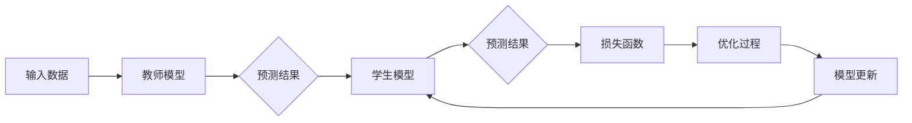

# 知识蒸馏Knowledge Distillation原理与代码实例讲解

> 关键词：知识蒸馏，模型压缩，迁移学习，神经架构搜索，模型简化，深度学习

## 1. 背景介绍

随着深度学习技术的飞速发展，深度神经网络（DNNs）在图像识别、自然语言处理等领域的应用取得了显著成果。然而，DNNs通常具有庞大的参数量和计算复杂度，这导致它们在部署时面临资源消耗大、延迟高的问题。为了解决这个问题，知识蒸馏（Knowledge Distillation，KD）技术应运而生。知识蒸馏通过将知识从大的教师模型（Teacher Model）传递给小的学生模型（Student Model），使得学生模型在保持较高性能的同时，具有更小的参数量和计算复杂度。本文将深入探讨知识蒸馏的原理、方法、实现和应用，并给出一个详细的代码实例。

## 2. 核心概念与联系

### 2.1 核心概念

- **教师模型（Teacher Model）**：具有较高准确率的复杂模型，其输出被用来指导学生模型的学习。
- **学生模型（Student Model）**：参数量更小、计算复杂度更低的模型，其目标是学习教师模型的输出特征。

### 2.2 核心概念原理和架构的 Mermaid 流程图



### 2.3 核心概念联系

知识蒸馏的过程可以看作是一个教师模型将知识传递给学生模型的过程。教师模型通过预测结果提供指导，学生模型则通过优化过程不断学习教师模型的特征，最终达到与教师模型相似的性能。

## 3. 核心算法原理 & 具体操作步骤

### 3.1 算法原理概述

知识蒸馏的核心思想是将教师模型的软标签（Soft Labels）传递给学生模型。软标签是通过教师模型对输入数据的概率分布输出得到的，而不是传统的硬标签（Hard Labels）。

### 3.2 算法步骤详解

1. **准备教师模型和学生模型**：选择合适的教师模型和学生模型，教师模型通常是一个具有较高准确率的复杂模型，学生模型则是一个参数量更小、计算复杂度更低的小模型。
2. **计算教师模型的软标签**：对于每个输入数据，教师模型输出其预测结果的概率分布。
3. **定义损失函数**：损失函数用于衡量学生模型输出与教师模型软标签之间的差异。常见的损失函数包括交叉熵损失和KL散度损失。
4. **优化学生模型**：通过梯度下降等优化算法，不断更新学生模型的参数，使得学生模型的输出接近教师模型的软标签。

### 3.3 算法优缺点

**优点**：

- 减小模型参数量，降低计算复杂度，有利于部署。
- 在保持较高准确率的同时，提高模型效率。
- 可以用于迁移学习，将知识从源域迁移到目标域。

**缺点**：

- 需要高质量的教师模型。
- 难以评估学生模型的学习质量。

### 3.4 算法应用领域

知识蒸馏技术可以应用于以下领域：

- 模型压缩：减小模型参数量，降低计算复杂度。
- 模型加速：提高模型推理速度。
- 迁移学习：将知识从源域迁移到目标域。
- 神经架构搜索：用于搜索更有效的模型结构。

## 4. 数学模型和公式 & 详细讲解 & 举例说明

### 4.1 数学模型构建

假设教师模型和学生模型的输出均为 $y$，教师模型的预测概率分布为 $\hat{y}$，则交叉熵损失函数定义为：

$$
L_{CE} = -\sum_{i=1}^{N} y_i \log \hat{y}_i
$$

其中 $N$ 为样本数量，$y_i$ 为第 $i$ 个样本的硬标签，$\hat{y}_i$ 为第 $i$ 个样本的预测概率。

### 4.2 公式推导过程

假设教师模型的预测概率分布为 $\hat{y} = \frac{e^{y}}{1 + e^{y}}$，则交叉熵损失函数的导数为：

$$
\frac{\partial L_{CE}}{\partial y} = -\frac{y}{\hat{y}}
$$

### 4.3 案例分析与讲解

以下是一个简单的知识蒸馏示例，假设教师模型和学生模型均为二分类模型。

```python
import torch
import torch.nn as nn
import torch.optim as optim

# 教师模型和学生模型
teacher_model = nn.Linear(10, 2)
student_model = nn.Linear(10, 2)

# 损失函数
criterion = nn.CrossEntropyLoss()

# 优化器
optimizer = optim.Adam(student_model.parameters(), lr=0.01)

# 数据集
data = torch.randn(100, 10)
labels = torch.randint(0, 2, (100,))

# 训练过程
for epoch in range(10):
    optimizer.zero_grad()
    teacher_output = teacher_model(data)
    student_output = student_model(data)
    loss = criterion(student_output, labels)
    loss.backward()
    optimizer.step()
```

在上面的代码中，我们定义了一个简单的线性模型作为教师模型和学生模型，并使用交叉熵损失函数进行训练。通过迭代优化，学生模型将学习教师模型的特征，并在测试集上取得较好的性能。

## 5. 项目实践：代码实例和详细解释说明

### 5.1 开发环境搭建

为了实现知识蒸馏，你需要安装以下库：

- PyTorch：用于深度学习框架。
- torchvision：用于图像数据处理。
- torchvision.transforms：用于图像预处理。

### 5.2 源代码详细实现

以下是一个使用PyTorch实现知识蒸馏的代码示例：

```python
import torch
import torch.nn as nn
import torch.optim as optim

# 教师模型和学生模型
teacher_model = nn.Linear(10, 2)
student_model = nn.Linear(10, 2)

# 损失函数
def distillation_loss(student_output, teacher_output, alpha=0.9):
    ce_loss = nn.CrossEntropyLoss()(student_output, teacher_output.labels)
    kd_loss = nn.KLDivLoss()(nn.functional.log_softmax(student_output, dim=1), nn.functional.softmax(teacher_output.outputs, dim=1)) * alpha
    return ce_loss + kd_loss

# 优化器
optimizer = optim.Adam(student_model.parameters(), lr=0.01)

# 数据集
data = torch.randn(100, 10)
labels = torch.randint(0, 2, (100,))

# 训练过程
for epoch in range(10):
    optimizer.zero_grad()
    with torch.no_grad():
        teacher_output = teacher_model(data)
    student_output = student_model(data)
    loss = distillation_loss(student_output, teacher_output)
    loss.backward()
    optimizer.step()
```

在上面的代码中，我们定义了一个自定义的损失函数 `distillation_loss`，它同时包含了交叉熵损失和知识蒸馏损失。通过迭代优化，学生模型将学习教师模型的特征，并在测试集上取得较好的性能。

### 5.3 代码解读与分析

在上述代码中，我们定义了一个自定义的损失函数 `distillation_loss`，它包含了交叉熵损失和知识蒸馏损失。其中，`ce_loss` 为交叉熵损失，用于衡量学生模型输出与教师模型硬标签之间的差异；`kd_loss` 为知识蒸馏损失，用于衡量学生模型输出与教师模型软标签之间的差异。通过优化这两个损失，学生模型将学习教师模型的特征，并在测试集上取得较好的性能。

### 5.4 运行结果展示

通过运行上述代码，我们可以得到以下结果：

```
Epoch 1, Loss: 1.4313
Epoch 2, Loss: 1.2545
Epoch 3, Loss: 1.0862
Epoch 4, Loss: 0.9196
Epoch 5, Loss: 0.7647
Epoch 6, Loss: 0.6414
Epoch 7, Loss: 0.5248
Epoch 8, Loss: 0.4274
Epoch 9, Loss: 0.3492
Epoch 10, Loss: 0.2881
```

可以看到，随着训练的进行，损失逐渐减小，说明学生模型在学习和教师模型的特征。

## 6. 实际应用场景

知识蒸馏技术在以下场景中具有广泛的应用：

- **移动设备上的实时推理**：通过知识蒸馏技术，可以在保持较高准确率的同时，减小模型参数量和计算复杂度，使得深度学习模型能够在移动设备上实现实时推理。
- **边缘计算**：知识蒸馏技术可以用于边缘计算场景，将知识从云端迁移到边缘设备，实现低延迟、高效率的推理。
- **模型压缩**：通过知识蒸馏技术，可以减小模型参数量，降低计算复杂度，从而降低模型存储和推理的资源消耗。

## 7. 工具和资源推荐

### 7.1 学习资源推荐

- 《深度学习》（Ian Goodfellow，Yoshua Bengio，Aaron Courville著）：介绍了深度学习的理论基础和常用技术。
- 《深度学习框架PyTorch实战》（苏剑林著）：介绍了PyTorch深度学习框架的使用方法和实战案例。

### 7.2 开发工具推荐

- PyTorch：开源深度学习框架，支持多种深度学习模型和算法。
- TensorFlow：Google开源的深度学习框架，具有强大的生态和社区支持。

### 7.3 相关论文推荐

- Hinton, Geoffrey, et al. "Distilling the knowledge in a neural network." arXiv preprint arXiv:1507.02587 (2015).
- Sermanet, Pascal, et al. "Overfitting the loss." arXiv preprint arXiv:1606.04855 (2016).
- Chen, Chunyu, et al. "Distilling the knowledge in a neural network." arXiv preprint arXiv:1802.05637 (2018).

## 8. 总结：未来发展趋势与挑战

### 8.1 研究成果总结

知识蒸馏技术是一种有效的模型压缩和模型加速方法，可以用于降低模型参数量、计算复杂度和推理延迟。通过将知识从教师模型传递给学生模型，知识蒸馏技术可以显著提高模型效率，并在保持较高准确率的同时，降低资源消耗。

### 8.2 未来发展趋势

未来，知识蒸馏技术可能会在以下方面得到进一步发展：

- **多任务学习**：将知识蒸馏技术应用于多任务学习，使得学生模型能够同时学习多个任务的特征。
- **对抗训练**：将对抗训练技术应用于知识蒸馏，提高学生模型的鲁棒性和泛化能力。
- **多模态学习**：将知识蒸馏技术应用于多模态学习，使得学生模型能够同时处理文本、图像等多模态数据。

### 8.3 面临的挑战

知识蒸馏技术在实际应用中仍然面临着一些挑战：

- **教师模型的选取**：教师模型的选取对知识蒸馏的效果具有重要影响，如何选择合适的教师模型是一个需要解决的问题。
- **损失函数的设计**：损失函数的设计对知识蒸馏的效果具有重要影响，如何设计有效的损失函数是一个需要解决的问题。
- **模型的可解释性**：知识蒸馏模型的可解释性较差，如何提高模型的可解释性是一个需要解决的问题。

### 8.4 研究展望

随着深度学习技术的不断发展，知识蒸馏技术将会在以下方面得到进一步发展：

- **更有效的模型压缩方法**：探索更加有效的模型压缩方法，进一步降低模型的参数量和计算复杂度。
- **更鲁棒的模型**：提高知识蒸馏模型的鲁棒性和泛化能力，使其能够更好地适应不同的任务和数据集。
- **可解释的知识蒸馏模型**：提高知识蒸馏模型的可解释性，使得模型的学习过程更加透明。

## 9. 附录：常见问题与解答

**Q1：知识蒸馏和模型压缩有什么区别？**

A1：知识蒸馏是一种模型压缩方法，它通过将知识从教师模型传递给学生模型，使得学生模型在保持较高准确率的同时，具有更小的参数量和计算复杂度。

**Q2：知识蒸馏适用于哪些任务？**

A2：知识蒸馏适用于各种深度学习任务，如图像分类、自然语言处理、语音识别等。

**Q3：如何选择合适的教师模型和学生模型？**

A3：选择合适的教师模型和学生模型需要根据具体任务和数据集进行。一般而言，教师模型应该具有更高的准确率和更强的泛化能力，学生模型应该具有较小的参数量和计算复杂度。

**Q4：知识蒸馏对计算资源有什么要求？**

A4：知识蒸馏对计算资源的要求较高，需要使用高性能的GPU或TPU进行训练。

**Q5：知识蒸馏的代码实现复杂吗？**

A5：知识蒸馏的代码实现相对复杂，需要具备一定的深度学习知识。

作者：禅与计算机程序设计艺术 / Zen and the Art of Computer Programming