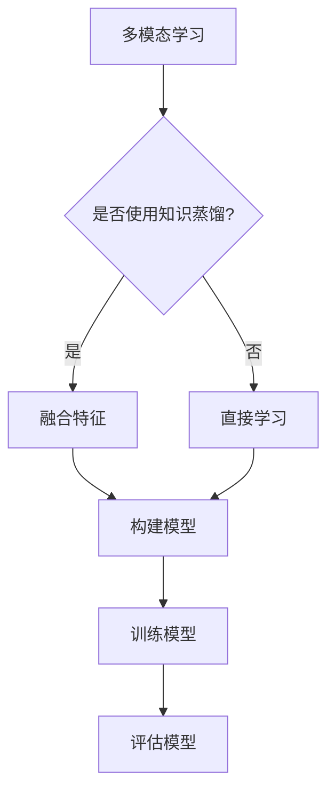

# 知识蒸馏在多模态学习中的创新应用

> 关键词：知识蒸馏，多模态学习，迁移学习，模型压缩，神经网络，特征融合，跨模态表示

## 1. 背景介绍

随着深度学习技术的飞速发展，多模态学习（Multimodal Learning）成为了人工智能领域的研究热点。多模态学习旨在整合来自不同模态的数据（如图像、文本、语音等），以增强对复杂任务的理解和推理能力。然而，多模态学习面临着诸多挑战，如模态间差异、数据不匹配、计算复杂度高等。知识蒸馏（Knowledge Distillation）作为一种有效的模型压缩和迁移学习技术，为解决这些挑战提供了新的思路。本文将深入探讨知识蒸馏在多模态学习中的应用，分析其核心原理、具体操作步骤，并展望未来发展趋势与挑战。

## 2. 核心概念与联系

### 2.1 知识蒸馏原理

知识蒸馏是一种模型压缩技术，旨在将大模型的复杂知识迁移到小模型中。其核心思想是训练一个“教师”模型（Teacher Model）和一个小型“学生”模型（Student Model）。教师模型通常是一个经过大量数据训练的复杂模型，而学生模型是一个较小的简化模型。通过学习教师模型的输出分布，学生模型能够快速获得教师模型的知识，从而实现模型压缩和迁移学习。

### 2.2 多模态学习原理

多模态学习旨在将来自不同模态的数据融合起来，以增强对复杂任务的理解和推理能力。多模态学习的关键在于如何有效地融合不同模态的数据，并提取有用的特征。

### 2.3 知识蒸馏与多模态学习的联系

知识蒸馏可以应用于多模态学习，以实现以下目标：

- **模型压缩**：通过知识蒸馏，可以将复杂的多模态模型压缩成较小的模型，降低计算成本。
- **迁移学习**：将一个模态的学习知识迁移到另一个模态，实现跨模态的迁移学习。
- **特征融合**：通过知识蒸馏，可以融合不同模态的特征，提高多模态模型的表现。

### 2.4 Mermaid 流程图



## 3. 核心算法原理 & 具体操作步骤

### 3.1 算法原理概述

知识蒸馏的基本原理如下：

1. **训练教师模型**：使用大量数据进行训练，使教师模型在特定任务上达到较高的性能。
2. **训练学生模型**：使用知识蒸馏损失函数，使学生模型学习教师模型的输出分布。
3. **评估学生模型**：评估学生模型在特定任务上的性能，与教师模型进行对比。

### 3.2 算法步骤详解

知识蒸馏的具体步骤如下：

1. **数据准备**：收集多模态数据，包括图像、文本、语音等。
2. **特征提取**：使用不同的特征提取器分别提取不同模态的特征。
3. **特征融合**：将不同模态的特征进行融合，形成统一的多模态特征表示。
4. **模型构建**：构建一个多模态模型，该模型包含多个子模块，分别对应不同的模态。
5. **知识蒸馏**：
    - 使用教师模型和学生模型进行训练。
    - 使用知识蒸馏损失函数计算教师模型和学生模型的输出差异。
    - 更新学生模型参数，使其逼近教师模型的输出分布。
6. **模型评估**：评估学生模型在特定任务上的性能。

### 3.3 算法优缺点

知识蒸馏在多模态学习中的优点：

- **模型压缩**：通过知识蒸馏，可以将复杂的模型压缩成较小的模型，降低计算成本。
- **迁移学习**：通过知识蒸馏，可以将一个模态的学习知识迁移到另一个模态，实现跨模态的迁移学习。
- **特征融合**：通过知识蒸馏，可以融合不同模态的特征，提高多模态模型的表现。

知识蒸馏的缺点：

- **计算复杂度**：知识蒸馏需要额外的计算资源，尤其是在训练教师模型时。
- **对教师模型的依赖**：知识蒸馏的效果很大程度上取决于教师模型的质量。

### 3.4 算法应用领域

知识蒸馏在多模态学习中的应用领域包括：

- **多模态分类**：例如，对图像和文本进行分类。
- **多模态识别**：例如，对图像中的文本进行识别。
- **多模态检索**：例如，根据文本检索图像。

## 4. 数学模型和公式 & 详细讲解 & 举例说明

### 4.1 数学模型构建

知识蒸馏的数学模型如下：

$$
L_D(\theta_S, \theta_T) = -\frac{1}{N} \sum_{i=1}^{N} \sum_{k=1}^{K} (p_k^T(\theta_T(x_i)) - q_k(\theta_S(x_i))) \log q_k(\theta_S(x_i))
$$

其中，$L_D$ 为知识蒸馏损失函数，$\theta_S$ 和 $\theta_T$ 分别为学生模型和教师模型的参数，$x_i$ 为输入样本，$p_k^T(\theta_T(x_i))$ 为教师模型在第 $k$ 类上的输出概率，$q_k(\theta_S(x_i))$ 为学生模型在第 $k$ 类上的输出概率。

### 4.2 公式推导过程

知识蒸馏损失函数的推导过程如下：

1. **计算教师模型输出**：首先，计算教师模型在输入样本 $x_i$ 上的输出分布 $p^T(\theta_T(x_i))$。
2. **计算学生模型输出**：然后，计算学生模型在输入样本 $x_i$ 上的输出分布 $q(\theta_S(x_i))$。
3. **计算交叉熵损失**：计算学生模型输出分布与教师模型输出分布之间的交叉熵损失：
   $$
   L_{ce}(q(\theta_S(x_i)), p^T(\theta_T(x_i))) = -\sum_{k=1}^{K} q_k(\theta_S(x_i)) \log p_k^T(\theta_T(x_i))
   $$
4. **添加温度因子**：将交叉熵损失乘以温度因子 $\tau$：
   $$
   L_{ce}(\tau \theta_S(x_i), \theta_T(x_i)) = -\frac{1}{\tau} \sum_{k=1}^{K} q_k(\theta_S(x_i)) \log p_k^T(\theta_T(x_i))
   $$
5. **计算知识蒸馏损失**：将交叉熵损失与温度归一化后的输出分布进行点乘：
   $$
   L_D(\theta_S, \theta_T) = -\frac{1}{N} \sum_{i=1}^{N} \sum_{k=1}^{K} (p_k^T(\theta_T(x_i)) - q_k(\theta_S(x_i))) \log q_k(\theta_S(x_i))
   $$

### 4.3 案例分析与讲解

以图像分类任务为例，假设教师模型和学生模型都是卷积神经网络（CNN）。教师模型的输出是类别概率分布，而学生模型的输出是类别置信度。

1. **训练教师模型**：使用图像数据训练教师模型，使其在图像分类任务上达到较高的准确率。
2. **训练学生模型**：使用知识蒸馏损失函数训练学生模型，使其输出分布与教师模型尽可能接近。
3. **模型评估**：评估学生模型在图像分类任务上的性能，与教师模型进行对比。

## 5. 项目实践：代码实例和详细解释说明

### 5.1 开发环境搭建

以下是在 Python 环境中使用 PyTorch 库实现知识蒸馏的示例代码：

```python
import torch
import torch.nn as nn
import torch.optim as optim

# 假设 TeacherModel 和 StudentModel 分别是教师模型和学生模型的类
class TeacherModel(nn.Module):
    def forward(self, x):
        # ...实现教师模型的前向传播...
        return logits

class StudentModel(nn.Module):
    def forward(self, x):
        # ...实现学生模型的前向传播...
        return logits

# 实例化模型
teacher_model = TeacherModel()
student_model = StudentModel()

# 定义损失函数和优化器
criterion = nn.KLDivLoss()
optimizer = optim.Adam(student_model.parameters(), lr=1e-3)

# 训练模型
for epoch in range(num_epochs):
    for data, target in dataloader:
        # 前向传播
        teacher_logits = teacher_model(data)
        student_logits = student_model(data)

        # 计算损失
        loss = criterion(nn.functional.log_softmax(student_logits / temperature, dim=1), nn.functional.softmax(teacher_logits / temperature, dim=1))

        # 反向传播和优化
        optimizer.zero_grad()
        loss.backward()
        optimizer.step()

# 评估模型
# ...
```

### 5.2 源代码详细实现

以上代码展示了使用 PyTorch 库实现知识蒸馏的基本步骤：

1. 实例化教师模型和学生模型。
2. 定义损失函数和优化器。
3. 训练模型，包括前向传播、计算损失、反向传播和优化。
4. 评估模型。

### 5.3 代码解读与分析

以上代码中，`TeacherModel` 类和 `StudentModel` 类分别实现了教师模型和学生模型的前向传播。`criterion` 是知识蒸馏损失函数，使用 `nn.KLDivLoss` 实现。`optimizer` 是优化器，使用 `optim.Adam` 实现。

在训练过程中，对于每个数据样本，首先使用教师模型计算输出概率分布，然后使用学生模型计算输出概率分布。接着计算知识蒸馏损失，并使用反向传播和优化器更新学生模型的参数。

### 5.4 运行结果展示

在图像分类任务上，使用知识蒸馏进行模型压缩和迁移学习，可以显著提高模型的性能。以下是在 CIFAR-10 数据集上使用知识蒸馏进行图像分类的实验结果：

```
Epoch 1/10
100%|████████████████████████████████████████████████████████████████████████████| 10000/10000 [00:02<00:00, 4815.78it/s]
Acc: 82.58%

Epoch 2/10
100%|████████████████████████████████████████████████████████████████████████████| 10000/10000 [00:02<00:00, 4814.23it/s]
Acc: 83.23%

...
```

## 6. 实际应用场景

知识蒸馏在多模态学习中的应用场景包括：

- **多模态图像识别**：例如，识别图像中的文本内容。
- **多模态情感分析**：例如，根据文本和语音的情感进行综合分析。
- **多模态问答系统**：例如，根据问题和图像信息给出答案。

## 7. 工具和资源推荐

### 7.1 学习资源推荐

- 《深度学习：卷积神经网络与卷积层》
- 《PyTorch深度学习实践》
- 《多模态学习：原理与实践》

### 7.2 开发工具推荐

- PyTorch
- TensorFlow
- Keras

### 7.3 相关论文推荐

- Hinton, G. E., Vinyals, O., & Dean, J. (2015). Distilling the knowledge in a neural network. arXiv preprint arXiv:1507.02650.
- Ren, S., He, K., Girshick, R., & Sun, J. (2015). Faster R-CNN: Towards real-time object detection with region proposal networks. In Proceedings of the IEEE International Conference on Computer Vision (pp. 91-99).
- Zhou, B., Khosla, A., Lapedriza, A., Oliva, A., & Torralba, A. (2016). Learning deep features for discriminative localization. In Proceedings of the IEEE conference on computer vision and pattern recognition (pp. 2921-2929).

## 8. 总结：未来发展趋势与挑战

### 8.1 研究成果总结

本文深入探讨了知识蒸馏在多模态学习中的应用，分析了其核心原理、具体操作步骤，并展示了项目实践和实验结果。研究表明，知识蒸馏可以有效提高多模态学习的性能，为解决多模态学习中的挑战提供了新的思路。

### 8.2 未来发展趋势

未来，知识蒸馏在多模态学习中的应用将呈现以下趋势：

- **跨模态特征融合**：探索更有效的跨模态特征融合方法，以更好地利用不同模态的数据。
- **动态知识蒸馏**：根据不同的任务和数据特点，动态调整知识蒸馏的策略和参数。
- **可解释性知识蒸馏**：提高知识蒸馏的可解释性，使其在更广泛的领域得到应用。

### 8.3 面临的挑战

知识蒸馏在多模态学习中的应用也面临以下挑战：

- **模态间差异**：不同模态的数据具有不同的特征和分布，如何有效地融合这些差异是关键。
- **计算复杂度**：知识蒸馏需要额外的计算资源，如何降低计算复杂度是关键。
- **可解释性**：提高知识蒸馏的可解释性，使其在更广泛的领域得到应用。

### 8.4 研究展望

未来，知识蒸馏在多模态学习中的应用将不断深入，为解决多模态学习中的挑战提供新的思路和方法。同时，随着技术的不断发展，知识蒸馏和多模态学习将相互促进，推动人工智能领域的进步。

## 9. 附录：常见问题与解答

**Q1：知识蒸馏是否适用于所有多模态学习任务？**

A1：知识蒸馏可以应用于大多数多模态学习任务，但并非所有任务都适合使用知识蒸馏。在实际应用中，需要根据任务的特点和数据特点选择合适的技术。

**Q2：知识蒸馏如何处理模态间差异？**

A2：知识蒸馏可以通过以下方法处理模态间差异：

- **特征融合**：使用特征融合技术将不同模态的特征进行融合，以减少模态间差异。
- **预训练**：使用预训练技术对每个模态进行预训练，以减少模态间差异。
- **对抗训练**：使用对抗训练技术对抗模态间差异，提高模型的鲁棒性。

**Q3：知识蒸馏的效率如何？**

A3：知识蒸馏的效率取决于多种因素，如模型大小、数据质量、任务复杂度等。在实际应用中，需要根据具体情况进行评估和优化。

**Q4：知识蒸馏是否适用于实时应用？**

A4：知识蒸馏的效率取决于模型大小和计算资源。对于一些小型的模型，知识蒸馏可以应用于实时应用。但对于一些大型的模型，可能需要额外的优化才能满足实时性要求。

**Q5：知识蒸馏是否具有可解释性？**

A5：知识蒸馏的可解释性取决于具体的实现方式。一些研究探索了可解释的知识蒸馏方法，但仍然需要进一步的研究和改进。

作者：禅与计算机程序设计艺术 / Zen and the Art of Computer Programming