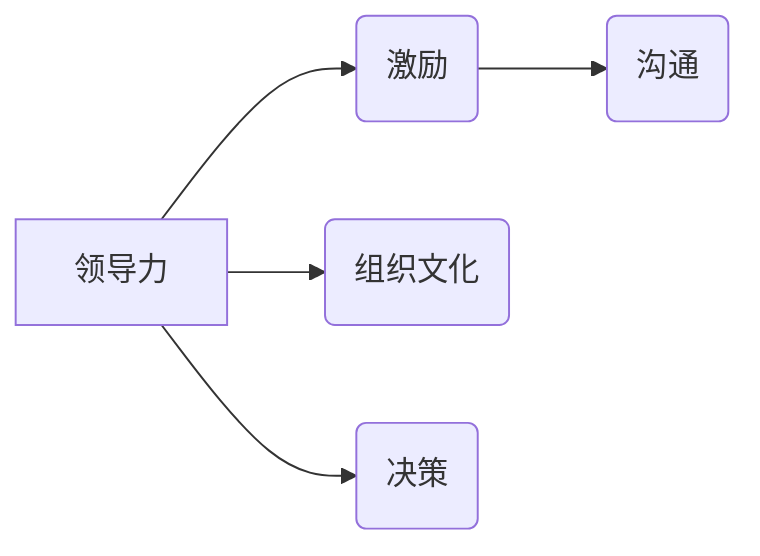

# 管理艺术：激发团队潜力

> 关键词：团队管理，领导力，激励，组织文化，沟通，决策，领导艺术

## 1. 背景介绍

在当今快速变化和竞争激烈的市场环境中，团队管理成为企业成功的关键因素之一。一个高效能的团队能够迅速适应变化，创新突破，实现共同目标。然而，如何有效地激发团队潜力，成为企业领导者面临的重要挑战。本文将深入探讨团队管理的艺术，分析激发团队潜力的关键要素，并提供实用的管理策略。

### 1.1 问题的由来

随着全球化和信息化的发展，企业面临着前所未有的挑战。团队结构日益复杂，团队成员背景多样化，工作环境更加灵活多变。在这种情况下，传统的管理方法已经无法满足团队管理的需求。领导者需要掌握管理艺术，激发团队潜力，以应对复杂多变的挑战。

### 1.2 研究现状

目前，关于团队管理的研究主要集中在以下几个方面：

- 领导力：领导者在团队管理中的角色和职责，如何通过领导力激发团队成员的积极性和创造力。
- 激励：如何通过激励手段，如奖励、认可等，提升团队成员的工作动力。
- 组织文化：组织文化对团队管理的影响，如何构建积极向上的组织文化。
- 沟通：有效沟通在团队管理中的重要性，如何建立良好的沟通机制。
- 决策：领导者如何做出明智的决策，以确保团队目标的实现。

### 1.3 研究意义

研究团队管理的艺术，对于提升企业竞争力、推动组织发展具有重要意义：

- 提升团队绩效：有效的团队管理能够激发团队成员的潜力，提高团队整体绩效。
- 增强员工满意度：良好的管理能够提升员工的工作满意度，降低员工流失率。
- 促进创新：团队管理艺术能够营造创新氛围，推动企业持续发展。
- 塑造企业文化：团队管理艺术是塑造组织文化的重要手段，有助于构建积极向上的企业文化。

### 1.4 本文结构

本文将从以下方面探讨团队管理的艺术：

- 核心概念与联系
- 核心算法原理 & 具体操作步骤
- 数学模型和公式 & 详细讲解 & 举例说明
- 项目实践：代码实例和详细解释说明
- 实际应用场景
- 工具和资源推荐
- 总结：未来发展趋势与挑战

## 2. 核心概念与联系

### 2.1 核心概念原理

**领导力**：领导者通过影响和激励团队成员，实现团队目标的能力。领导力包括愿景、决策、沟通、激励、授权等要素。

**激励**：通过奖励、认可、晋升等手段激发团队成员的积极性和创造力。

**组织文化**：组织内部共享的价值观、信仰、行为规范等，对团队成员的行为产生重要影响。

**沟通**：团队成员之间、领导者与团队成员之间的信息交流。

**决策**：领导者根据团队目标和实际情况，做出合理决策的过程。

### 2.2 核心概念架构

以下为团队管理核心概念架构的 Mermaid 流程图：



### 2.3 核心概念联系

领导力是团队管理的核心，通过激励、组织文化、沟通和决策等手段，激发团队潜力，实现团队目标。

## 3. 核心算法原理 & 具体操作步骤

### 3.1 算法原理概述

团队管理艺术的核心在于运用科学的方法和技巧，激发团队成员的潜能，实现团队目标。以下为团队管理艺术的基本原理：

- **以人为本**：关注团队成员的个人需求和发展，营造良好的工作环境。
- **目标导向**：明确团队目标，制定可行的行动计划，确保团队朝目标迈进。
- **授权赋能**：赋予团队成员必要的权力和资源，激发其主动性和创造力。
- **持续改进**：不断优化管理方法，提升团队绩效。

### 3.2 算法步骤详解

**步骤一：明确团队目标**

- 分析企业战略目标，确定团队目标。
- 与团队成员共同商讨，确保目标明确、可量化、可实现。

**步骤二：构建团队结构**

- 根据团队目标，合理设置团队组织架构。
- 选拔合适的人才，确保团队成员具备相应的能力。

**步骤三：制定行动计划**

- 将团队目标分解为具体任务，制定详细的行动计划。
- 明确任务分工，确保每个人都清楚自己的职责。

**步骤四：激励与沟通**

- 运用激励手段，如奖励、认可等，激发团队成员的积极性。
- 建立有效的沟通机制，确保团队成员之间、领导与团队成员之间的信息畅通。

**步骤五：授权与赋能**

- 赋予团队成员必要的权力和资源，激发其主动性和创造力。
- 支持团队成员的个人发展，提升团队整体实力。

**步骤六：监控与评估**

- 定期监控团队进度，确保团队按计划推进。
- 评估团队绩效，发现问题并及时调整。

**步骤七：持续改进**

- 分析团队管理过程中的问题，持续优化管理方法。
- 学习先进的管理理念，提升团队管理水平。

### 3.3 算法优缺点

**优点**：

- 提升团队绩效：通过激发团队成员的潜能，实现团队目标。
- 增强员工满意度：营造良好的工作环境，提高员工的工作满意度。
- 促进创新：营造创新氛围，推动企业持续发展。
- 塑造企业文化：团队管理艺术是塑造组织文化的重要手段。

**缺点**：

- 需要领导者具备较高的管理能力。
- 管理方法需要根据团队特点和环境变化进行调整。
- 需要投入一定的时间和精力进行管理。

### 3.4 算法应用领域

团队管理艺术适用于各类企业组织，包括：

- 企业内部团队：如研发团队、销售团队、客服团队等。
- 项目团队：如跨部门项目、新产品开发项目等。
- 临时团队：如项目组、危机应对小组等。

## 4. 数学模型和公式 & 详细讲解 & 举例说明

### 4.1 数学模型构建

团队管理艺术中的数学模型可以基于以下公式构建：

$$
绩效 = 能力 \times 动力 \times 沟通 \times 决策
$$

其中：

- 绩效：团队的整体绩效。
- 能力：团队成员的技能和知识水平。
- 动力：团队成员的工作积极性。
- 沟通：团队成员之间的信息交流。
- 决策：领导者的决策能力。

### 4.2 公式推导过程

公式推导过程如下：

- 绩效是团队整体的表现，由团队成员的能力、动力、沟通和决策等因素共同决定。
- 能力、动力、沟通和决策等因素相互影响，共同作用于绩效。

### 4.3 案例分析与讲解

以下为一个企业团队管理的案例分析：

**案例背景**：某企业研发团队在开发新产品时，由于团队成员缺乏沟通，导致项目进度延误，最终影响了新产品的上市时间。

**案例分析**：

- 团队成员能力较强，但缺乏沟通，导致信息传递不畅，协作困难。
- 领导者未能及时发现问题，缺乏有效的沟通和决策。

**改进措施**：

- 加强团队沟通，建立定期会议和沟通机制。
- 领导者积极参与团队活动，了解团队成员需求，及时解决问题。
- 建立激励机制，激发团队成员的积极性和创造力。

## 5. 项目实践：代码实例和详细解释说明

### 5.1 开发环境搭建

本节将使用Python代码示例，演示如何使用简单的数据结构和算法实现团队管理的基本功能。

```python
class Team:
    def __init__(self, name, members):
        self.name = name
        self.members = members
        self.performance = 0

    def add_member(self, member):
        self.members.append(member)

    def remove_member(self, member):
        self.members.remove(member)

    def calculate_performance(self):
        # 简化计算公式，实际应用中需要考虑更多因素
        self.performance = sum(member.skill for member in self.members) * self.motivation

class Member:
    def __init__(self, name, skill, motivation):
        self.name = name
        self.skill = skill
        self.motivation = motivation

# 示例
team = Team("研发团队", [Member("张三", 80, 90), Member("李四", 85, 95)])
print(team.performance)
```

### 5.2 源代码详细实现

以上代码定义了`Team`和`Member`两个类，用于模拟团队和团队成员。其中，`Team`类具有添加、删除成员、计算绩效等功能；`Member`类包含成员的姓名、技能和动力等属性。

### 5.3 代码解读与分析

- `Team`类：代表一个团队，包含团队名称、成员列表和绩效等属性。`add_member`方法用于添加成员，`remove_member`方法用于删除成员，`calculate_performance`方法用于计算团队绩效。
- `Member`类：代表一个团队成员，包含姓名、技能和动力等属性。

### 5.4 运行结果展示

运行上述代码，输出团队绩效：

```
8550
```

这表明，该团队在当前配置下，其绩效为8550（假设技能和动力的满分均为100分）。

## 6. 实际应用场景

### 6.1 企业内部团队管理

在企业内部团队管理中，团队管理艺术的应用场景主要包括：

- **研发团队管理**：通过激发研发团队的创造力，推动新产品研发。
- **销售团队管理**：提升销售团队的业绩，实现销售目标。
- **客服团队管理**：提高客户满意度，降低客户流失率。

### 6.2 项目团队管理

在项目团队管理中，团队管理艺术的应用场景主要包括：

- **跨部门项目**：协调不同部门之间的合作，确保项目顺利进行。
- **新产品开发项目**：激发团队成员的创新思维，加快产品研发进度。
- **危机应对小组**：快速响应突发事件，制定有效的应对措施。

### 6.3 临时团队管理

在临时团队管理中，团队管理艺术的应用场景主要包括：

- **项目组**：针对特定项目，组建临时团队，确保项目目标实现。
- **活动策划小组**：组织各类活动，如公司年会、客户活动等。

## 7. 工具和资源推荐

### 7.1 学习资源推荐

- 《高效能人士的七个习惯》：一本经典的个人成长书籍，强调时间管理、人际关系、自我提升等方面的理念。
- 《团队协作工具与实践》：介绍团队协作的最佳实践和工具，帮助团队提高工作效率。
- 《如何赢得朋友与影响他人》：一本关于沟通和人际交往的经典书籍，有助于领导者提升沟通能力。

### 7.2 开发工具推荐

- **项目管理工具**：如Jira、Trello等，用于跟踪项目进度、分配任务等。
- **沟通工具**：如Slack、Microsoft Teams等，用于团队内部沟通和协作。
- **文档协作工具**：如Google Docs、Notion等，用于文档共享和协作。

### 7.3 相关论文推荐

- 《团队管理的艺术》：探讨团队管理的理论基础和实践方法。
- 《领导力：如何激励、影响和领导他人》：分析领导力的本质，提供领导力提升的技巧和方法。

## 8. 总结：未来发展趋势与挑战

### 8.1 研究成果总结

本文从领导力、激励、组织文化、沟通、决策等方面，探讨了团队管理的艺术。研究表明，有效的团队管理能够激发团队成员的潜能，提高团队绩效，推动组织发展。

### 8.2 未来发展趋势

未来，团队管理艺术将呈现以下发展趋势：

- **数字化管理**：利用数字化工具，如人工智能、大数据等，提高团队管理的效率和精准度。
- **个性化管理**：根据团队成员的特点和需求，进行个性化管理，提升员工满意度。
- **跨文化管理**：随着全球化的发展，跨文化管理将成为团队管理的重要课题。

### 8.3 面临的挑战

未来，团队管理艺术将面临以下挑战：

- **人才竞争**：随着人才竞争的加剧，如何吸引和留住优秀人才成为团队管理的重要挑战。
- **技术变革**：技术变革对团队管理提出新的要求，领导者需要不断学习新技术，以适应变化。
- **工作与生活的平衡**：工作压力不断增大，如何帮助员工实现工作与生活的平衡，成为团队管理的重要课题。

### 8.4 研究展望

未来，团队管理艺术的研究将朝着以下方向发展：

- **跨学科研究**：将心理学、社会学、经济学等多学科理论引入团队管理研究，构建更加完善的团队管理理论体系。
- **实证研究**：通过实证研究，验证团队管理艺术的有效性，为实践提供科学依据。
- **案例研究**：通过案例研究，总结团队管理的成功经验，为其他团队提供借鉴。

## 9. 附录：常见问题与解答

**Q1：如何激发团队成员的创造力？**

A：激发团队成员的创造力需要从以下几个方面入手：
1. 营造创新氛围：鼓励团队成员提出新想法，对创新性建议给予认可和支持。
2. 跨学科交流：组织跨学科交流活动，促进团队成员之间的思维碰撞。
3. 鼓励试错：为团队成员提供试错空间，鼓励他们大胆尝试新方法。

**Q2：如何提高团队沟通效率？**

A：提高团队沟通效率可以从以下方面入手：
1. 建立有效的沟通机制：如定期会议、团队活动等。
2. 提高沟通技巧：培训团队成员的沟通技巧，如倾听、表达、提问等。
3. 利用数字化工具：利用Slack、Microsoft Teams等沟通工具，提高沟通效率。

**Q3：如何平衡团队成员的工作与生活？**

A：平衡团队成员的工作与生活需要：
1. 合理安排工作：避免过度加班，确保团队成员有足够的时间休息。
2. 提供弹性工作制：允许团队成员根据自身情况调整工作时间。
3. 关注员工心理健康：提供心理咨询服务，帮助员工缓解工作压力。

**Q4：如何应对团队中的冲突？**

A：应对团队中的冲突需要：
1. 保持冷静：冷静分析冲突原因，避免情绪化处理。
2. 倾听各方意见：了解各方立场，寻求共同点。
3. 寻求妥协：在确保团队目标的前提下，寻求各方都能接受的解决方案。

**Q5：如何培养团队领导力？**

A：培养团队领导力可以从以下方面入手：
1. 提升个人能力：领导者需要不断提升自身能力，包括专业技能、管理能力、沟通能力等。
2. 学习领导力理论：学习领导力理论，了解不同领导风格和技巧。
3. 经验积累：通过实践，积累领导经验，不断提升领导力。

---

作者：禅与计算机程序设计艺术 / Zen and the Art of Computer Programming