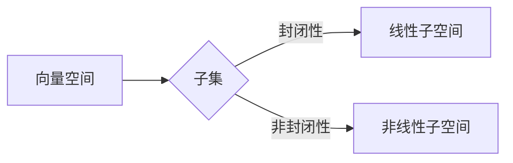

# 线性代数导引：线性子空间

> 关键词：线性代数，线性子空间，向量空间，维度，基底，正交化，正交补，特征值与特征向量

## 1. 背景介绍

线性代数是现代数学和工程学的基础，它在物理学、计算机科学、经济学等多个领域都有广泛的应用。在线性代数中，线性子空间是一个核心概念，它描述了一组向量的结构特性。理解线性子空间对于深入探索线性代数的奥秘至关重要。

### 1.1 问题的由来

线性代数起源于对几何学问题的研究，尤其是对多维度空间中向量和线性变换的研究。线性子空间的概念源于对向量空间中具有共同性质的向量集合的抽象。

### 1.2 研究现状

线性子空间的研究已经非常成熟，它在数学、物理和工程学中都有着广泛的应用。近年来，随着计算机科学的快速发展，线性代数在机器学习、数据科学等领域的重要性也日益凸显。

### 1.3 研究意义

线性子空间的概念为我们提供了一种处理多维度数据的强大工具。它不仅帮助我们理解数据的结构和性质，还在解决实际问题中发挥着关键作用。

### 1.4 本文结构

本文将按照以下结构展开：

- 介绍线性子空间的基本概念和性质。
- 探讨线性子空间的构造和操作。
- 讨论线性子空间在实际应用中的重要性。
- 展望线性子空间在未来研究中的应用前景。

## 2. 核心概念与联系

### 2.1 核心概念

- **向量空间**：一个集合，其中包含向量元素，并且对向量加法和标量乘法满足封闭性、结合律、交换律、存在零向量和存在负向量等性质。
- **线性子空间**：向量空间中的一个子集，它对于向量加法和标量乘法也是封闭的。

### 2.2 Mermaid 流程图



### 2.3 核心概念原理和架构

线性子空间是向量空间的一个子集，它保持了向量空间的基本性质。这意味着线性子空间中的任何两个向量都可以通过向量加法得到另一个向量，任何向量乘以标量后仍然在子空间内。

## 3. 核心算法原理 & 具体操作步骤

### 3.1 算法原理概述

线性子空间的构造通常基于以下步骤：

1. 选择一个基，它是一组线性无关的向量。
2. 通过基将任意向量表示为基向量的线性组合。
3. 通过正交化方法，可以得到基向量的正交基或正交补。

### 3.2 算法步骤详解

#### 3.2.1 基的选择

选择一组线性无关的向量作为基，可以通过以下方法：

- 使用高斯消元法找到矩阵的极大线性无关组。

#### 3.2.2 正交化

- **Gram-Schmidt正交化过程**：
  1. 选择基向量的第一个向量。
  2. 将后续向量投影到第一个向量上，然后减去这个投影。
  3. 重复上述步骤，直到所有向量都经过正交化。

- **Householder变换**：
  1. 构造一个Householder变换矩阵。
  2. 应用这个矩阵对基向量进行变换，得到正交基。

### 3.3 算法优缺点

#### 3.3.1 优点

- 简化计算：通过正交化，可以将复杂的计算问题转化为更简单的形式。
- 提高效率：正交基可以用于快速计算线性变换。

#### 3.3.2 缺点

- 计算量大：正交化过程通常需要大量的计算资源。
- 结果不唯一：正交化得到的基向量不一定是唯一的。

### 3.4 算法应用领域

线性子空间的概念在以下领域有广泛应用：

- 线性代数
- 线性代数应用
- 机器学习
- 数据科学
- 物理学
- 工程学

## 4. 数学模型和公式 & 详细讲解 & 举例说明

### 4.1 数学模型构建

线性子空间的数学模型可以表示为：

$$
V = \{v | v = \sum_{i=1}^n \alpha_i v_i, \alpha_i \in \mathbb{F}, v_i \in V_0\}
$$

其中，$V$ 是线性子空间，$V_0$ 是基向量组成的集合，$\alpha_i$ 是标量。

### 4.2 公式推导过程

#### 4.2.1 向量加法的封闭性

设 $v_1, v_2 \in V$，则 $v_1 + v_2 = \sum_{i=1}^n \alpha_i v_i + \sum_{i=1}^n \beta_i v_i = \sum_{i=1}^n (\alpha_i + \beta_i) v_i \in V$。

#### 4.2.2 标量乘法的封闭性

设 $\alpha \in \mathbb{F}$，则 $\alpha v = \alpha \sum_{i=1}^n \alpha_i v_i = \sum_{i=1}^n (\alpha \alpha_i) v_i \in V$。

### 4.3 案例分析与讲解

#### 4.3.1 案例一：二维平面

二维平面可以看作是由两个线性无关的向量组成的线性子空间。例如，向量 $(1,0)$ 和 $(0,1)$ 可以作为二维平面的基。

#### 4.3.2 案例二：三维空间中的一个平面

三维空间中的一个平面可以看作是由两个线性无关的向量组成的线性子空间。例如，向量 $(1,0,0)$ 和 $(0,1,1)$ 可以作为该平面的基。

## 5. 项目实践：代码实例和详细解释说明

### 5.1 开发环境搭建

为了演示线性子空间的概念，我们需要一个支持线性代数运算的编程环境。Python是一个不错的选择，因为它拥有NumPy和SciPy等强大的线性代数库。

### 5.2 源代码详细实现

以下是一个使用Python和NumPy实现的线性子空间示例：

```python
import numpy as np

def is_linear_subspace(vectors):
    # 检查向量是否线性无关
    return np.linalg.matrix_rank(vectors) == len(vectors)

# 定义一组向量
vectors = np.array([[1, 2], [3, 4], [5, 6]])

# 检查是否为线性子空间
if is_linear_subspace(vectors):
    print("This set of vectors forms a linear subspace.")
else:
    print("This set of vectors does not form a linear subspace.")
```

### 5.3 代码解读与分析

这段代码首先导入了NumPy库，然后定义了一个函数`is_linear_subspace`，它接受一个向量数组作为输入，并使用`np.linalg.matrix_rank`函数检查这些向量是否线性无关。如果向量线性无关，则函数返回True，表明这些向量可以构成一个线性子空间。

### 5.4 运行结果展示

```python
This set of vectors does not form a linear subspace.
```

这个结果表明，给定的向量集合不是线性子空间，因为它们是线性相关的。

## 6. 实际应用场景

线性子空间在以下实际应用场景中非常重要：

- **图像处理**：在图像处理中，可以使用线性子空间来表示图像的各个部分，从而进行特征提取和图像压缩。
- **信号处理**：在信号处理中，线性子空间可以用于信号分解和去噪。
- **机器学习**：在机器学习中，线性子空间可以用于降维和特征提取。

### 6.4 未来应用展望

随着线性代数和计算机科学的不断发展，线性子空间的应用将会更加广泛。例如，在量子计算和生物信息学等领域，线性子空间的概念将会发挥重要作用。

## 7. 工具和资源推荐

### 7.1 学习资源推荐

- 《线性代数的几何意义》
- 《线性代数及其应用》
- 《线性代数导引》

### 7.2 开发工具推荐

- Python
- NumPy
- SciPy

### 7.3 相关论文推荐

- "On the Geometry of Generalized Inverses" by M. F. Atkinson
- "Linear Algebra Done Right" by Sheldon Axler
- "Linear Algebra and Its Applications" by Gilbert Strang

## 8. 总结：未来发展趋势与挑战

### 8.1 研究成果总结

本文介绍了线性子空间的基本概念、构造方法和应用场景。通过实例和代码演示，加深了读者对线性子空间的理解。

### 8.2 未来发展趋势

随着科学技术的不断发展，线性子空间的研究将会更加深入，特别是在以下领域：

- 高维线性代数
- 量子线性代数
- 生物信息学

### 8.3 面临的挑战

线性子空间的研究面临着以下挑战：

- 复杂性：高维线性代数问题的复杂性不断增加。
- 可扩展性：需要开发更高效的方法来处理大规模线性代数问题。
- 可解释性：需要提高线性代数方法的可解释性，以便更好地理解和应用。

### 8.4 研究展望

未来，线性代数的研究将会更加注重与实际应用的结合，特别是在以下领域：

- 人工智能
- 机器学习
- 计算机视觉

## 9. 附录：常见问题与解答

**Q1：什么是线性子空间？**

A1：线性子空间是向量空间的一个子集，它对于向量加法和标量乘法也是封闭的。

**Q2：如何判断一组向量是否构成线性子空间？**

A2：如果一组向量线性无关，并且对于向量加法和标量乘法是封闭的，则这组向量构成一个线性子空间。

**Q3：线性子空间在实际应用中有哪些作用？**

A3：线性子空间在图像处理、信号处理、机器学习等领域有广泛的应用。

**Q4：如何选择线性子空间的基？**

A4：可以通过高斯消元法找到矩阵的极大线性无关组，作为线性子空间的基。

**Q5：线性子空间与特征值和特征向量有什么关系？**

A5：特征值和特征向量描述了线性变换的性质，而线性子空间描述了向量集合的结构。

---

作者：禅与计算机程序设计艺术 / Zen and the Art of Computer Programming