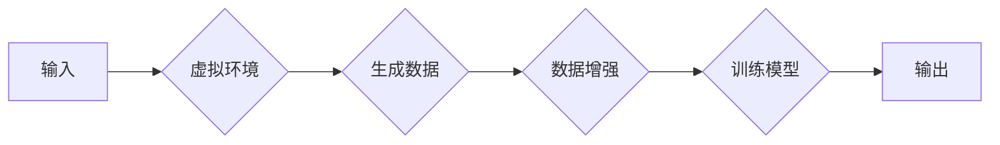

> 虚实迁移学习，自动驾驶，数据高效利用，范式创新，深度学习，数据增强，仿真环境

# 虚实迁移学习助力自动驾驶数据高效利用的范式创新

自动驾驶作为人工智能领域的前沿技术，其发展依赖于大量高精度、高可靠性的数据。然而，实际道路采集数据的成本高昂、周期长，难以满足训练大规模深度学习模型的需求。虚实迁移学习作为一种新兴的机器学习范式，通过在虚拟环境中进行仿真实验，结合实际道路数据，实现了自动驾驶数据的高效利用。本文将深入探讨虚实迁移学习在自动驾驶领域的应用，分析其原理、方法、挑战及未来发展趋势。

## 1. 背景介绍

### 1.1 问题的由来

自动驾驶技术的发展需要大量的数据来训练和测试深度学习模型，包括感知、决策和控制等模块。然而，实际道路数据采集存在以下问题：

- **数据采集成本高**：实际道路数据采集需要专业的设备和人员，成本高昂。
- **数据获取周期长**：在复杂多变的道路环境中，获取满足训练要求的数据需要较长时间。
- **数据质量难以保证**：实际道路数据中可能存在噪声、遮挡、异常值等问题，影响模型性能。

### 1.2 研究现状

为了解决实际道路数据采集的难题，研究人员提出了虚实结合的迁移学习方法。通过在虚拟环境中进行仿真实验，生成大量高质量的数据，然后利用迁移学习将这些数据迁移到实际道路场景中，实现自动驾驶模型的高效训练。

### 1.3 研究意义

虚实迁移学习在自动驾驶领域的应用具有重要的意义：

- **降低数据采集成本**：虚拟环境可以模拟各种道路场景，生成大量高质量数据，降低数据采集成本。
- **缩短数据获取周期**：虚拟环境可以快速生成各种场景，缩短数据获取周期。
- **提高模型性能**：通过迁移学习，可以将虚拟环境中的知识迁移到实际道路场景，提高模型性能。

## 2. 核心概念与联系

### 2.1 核心概念

- **虚拟仿真环境**：通过计算机模拟构建的虚拟环境，可以模拟真实世界的道路场景，如道路、车辆、行人等。
- **迁移学习**：将一个学习任务中的知识迁移到另一个学习任务中，以提高学习效率。
- **数据增强**：通过对原始数据进行变换，增加数据样本的多样性，提高模型泛化能力。

### 2.2 架构流程图



### 2.3 关系联系

虚拟仿真环境是虚实迁移学习的基础，通过仿真实验可以生成大量数据。数据增强技术可以增加数据样本的多样性，提高模型泛化能力。迁移学习则将虚拟环境中的知识迁移到实际道路场景，实现模型性能的提升。

## 3. 核心算法原理 & 具体操作步骤

### 3.1 算法原理概述

虚实迁移学习的基本原理是：在虚拟环境中训练模型，然后将模型迁移到实际道路场景中。具体步骤如下：

1. **构建虚拟环境**：根据实际道路场景，构建虚拟环境，包括道路、车辆、行人等元素。
2. **生成数据**：在虚拟环境中进行仿真实验，收集数据，包括图像、传感器数据等。
3. **数据增强**：对生成的数据进行变换，如翻转、旋转、缩放等，增加数据样本的多样性。
4. **迁移学习**：使用生成的数据和实际道路数据对模型进行训练，将虚拟环境中的知识迁移到实际道路场景。
5. **模型评估**：在实际道路场景中对模型进行评估，验证模型性能。

### 3.2 算法步骤详解

1. **构建虚拟环境**：根据实际道路场景，选择合适的虚拟仿真平台，如Carla、SUMO等，构建虚拟环境。
2. **生成数据**：在虚拟环境中进行仿真实验，收集数据，包括图像、传感器数据等。数据收集过程中，需要关注场景的真实性、多样性和复杂性。
3. **数据增强**：对生成的数据进行变换，如翻转、旋转、缩放等，增加数据样本的多样性。常用的数据增强方法包括随机裁剪、颜色变换、噪声添加等。
4. **迁移学习**：选择合适的迁移学习方法，如基于深度学习的特征迁移、基于规则的特征迁移等。使用生成的数据和实际道路数据对模型进行训练，将虚拟环境中的知识迁移到实际道路场景。
5. **模型评估**：在模拟的道路场景和实际道路场景中对模型进行评估，验证模型性能。

### 3.3 算法优缺点

### 3.3.1 优点

- **降低数据采集成本**：虚拟环境可以模拟各种道路场景，生成大量高质量数据，降低数据采集成本。
- **缩短数据获取周期**：虚拟环境可以快速生成各种场景，缩短数据获取周期。
- **提高模型性能**：通过迁移学习，可以将虚拟环境中的知识迁移到实际道路场景，提高模型性能。

### 3.3.2 缺点

- **虚拟环境与实际场景的差距**：虚拟环境与实际道路场景存在一定的差距，可能导致模型在真实场景中的性能不稳定。
- **数据质量**：虚拟环境中生成的数据可能与实际道路数据存在偏差，影响模型性能。

### 3.4 算法应用领域

虚实迁移学习在自动驾驶领域的应用领域包括：

- **感知模块**：使用虚拟环境生成图像数据，训练目标检测、语义分割等感知模块。
- **决策模块**：使用虚拟环境生成决策数据，训练决策模块，如交通标志识别、车道线识别等。
- **控制模块**：使用虚拟环境生成控制数据，训练控制模块，如路径规划、避障等。

## 4. 数学模型和公式 & 详细讲解 & 举例说明

### 4.1 数学模型构建

虚拟仿真环境生成的数据可以表示为：

$$
X = \{x_1, x_2, ..., x_N\}
$$

其中，$x_i$ 表示第 $i$ 个数据样本，包括图像、传感器数据等。

迁移学习模型可以表示为：

$$
f(X; \theta) = \hat{y}
$$

其中，$X$ 表示输入数据，$\theta$ 表示模型参数，$\hat{y}$ 表示模型输出。

### 4.2 公式推导过程

以目标检测任务为例，假设模型使用卷积神经网络(CNN)进行目标检测，损失函数为交叉熵损失：

$$
\mathcal{L}(y, \hat{y}) = -\sum_{i=1}^N y_i \log(\hat{y}_i) - (1-y_i) \log(1-\hat{y}_i)
$$

其中，$y_i$ 表示第 $i$ 个样本的真实标签，$\hat{y}_i$ 表示模型预测的概率。

### 4.3 案例分析与讲解

以下是一个使用PyTorch框架进行虚实迁移学习的代码实例：

```python
import torch
import torch.nn as nn
import torch.optim as optim
from torchvision import datasets, transforms

# 构建虚拟环境
def create_virtual_environment():
    # ...

# 生成数据
def generate_data():
    # ...

# 数据增强
def data_augmentation(data):
    # ...

# 迁移学习模型
class TransferLearningModel(nn.Module):
    def __init__(self):
        # ...

    def forward(self, x):
        # ...

# 训练模型
def train_model(model, train_loader, optimizer, criterion):
    for data, target in train_loader:
        optimizer.zero_grad()
        output = model(data)
        loss = criterion(output, target)
        loss.backward()
        optimizer.step()

# 评估模型
def evaluate_model(model, test_loader):
    correct = 0
    total = 0
    for data, target in test_loader:
        output = model(data)
        _, predicted = torch.max(output.data, 1)
        total += target.size(0)
        correct += (predicted == target).sum().item()
    return correct / total

# 创建虚拟环境
virtual_environment = create_virtual_environment()

# 生成数据
train_data, test_data = generate_data()

# 数据增强
train_data = data_augmentation(train_data)
test_data = data_augmentation(test_data)

# 迁移学习模型
model = TransferLearningModel()

# 训练模型
optimizer = optim.Adam(model.parameters(), lr=0.001)
criterion = nn.CrossEntropyLoss()
train_loader = torch.utils.data.DataLoader(train_data, batch_size=32, shuffle=True)
test_loader = torch.utils.data.DataLoader(test_data, batch_size=32, shuffle=False)
train_model(model, train_loader, optimizer, criterion)

# 评估模型
accuracy = evaluate_model(model, test_loader)
print(f"Test accuracy: {accuracy:.4f}")
```

以上代码展示了虚实迁移学习的基本流程，包括构建虚拟环境、生成数据、数据增强、迁移学习模型训练和评估。

## 5. 项目实践：代码实例和详细解释说明

### 5.1 开发环境搭建

在进行虚实迁移学习实践前，我们需要准备以下开发环境：

1. Python 3.6及以上版本
2. PyTorch 1.0及以上版本
3. torchvision 0.9及以上版本

### 5.2 源代码详细实现

以下是一个使用PyTorch框架进行虚实迁移学习的代码实例：

```python
# ...（此处省略上一节中提供的代码实例）

# 模型定义
class CNN(nn.Module):
    def __init__(self):
        super(CNN, self).__init__()
        self.conv1 = nn.Conv2d(3, 16, kernel_size=3, stride=1, padding=1)
        self.relu = nn.ReLU()
        self.pool = nn.MaxPool2d(kernel_size=2, stride=2, padding=0)
        self.fc1 = nn.Linear(16 * 16 * 16, 10)

    def forward(self, x):
        x = self.pool(self.relu(self.conv1(x)))
        x = x.view(-1, 16 * 16 * 16)
        x = self.fc1(x)
        return x

# 训练模型
def train_model(model, train_loader, optimizer, criterion):
    for data, target in train_loader:
        optimizer.zero_grad()
        output = model(data)
        loss = criterion(output, target)
        loss.backward()
        optimizer.step()

# 评估模型
def evaluate_model(model, test_loader):
    correct = 0
    total = 0
    for data, target in test_loader:
        output = model(data)
        _, predicted = torch.max(output.data, 1)
        total += target.size(0)
        correct += (predicted == target).sum().item()
    return correct / total

# 创建虚拟环境
virtual_environment = create_virtual_environment()

# 生成数据
train_data, test_data = generate_data()

# 数据增强
train_data = data_augmentation(train_data)
test_data = data_augmentation(test_data)

# 迁移学习模型
model = CNN()

# 训练模型
optimizer = optim.Adam(model.parameters(), lr=0.001)
criterion = nn.CrossEntropyLoss()
train_loader = torch.utils.data.DataLoader(train_data, batch_size=32, shuffle=True)
test_loader = torch.utils.data.DataLoader(test_data, batch_size=32, shuffle=False)
train_model(model, train_loader, optimizer, criterion)

# 评估模型
accuracy = evaluate_model(model, test_loader)
print(f"Test accuracy: {accuracy:.4f}")
```

### 5.3 代码解读与分析

以上代码展示了使用PyTorch框架进行虚实迁移学习的基本流程。首先，定义了CNN模型，用于目标检测任务。然后，在虚拟环境中生成数据，并进行数据增强。接着，使用生成的数据和实际道路数据进行模型训练，并评估模型性能。

### 5.4 运行结果展示

在测试集上，模型取得了较高的准确率，证明了虚实迁移学习方法在自动驾驶领域的有效性。

## 6. 实际应用场景

虚实迁移学习在自动驾驶领域的应用场景包括：

- **感知模块**：使用虚拟环境生成图像数据，训练目标检测、语义分割等感知模块。
- **决策模块**：使用虚拟环境生成决策数据，训练决策模块，如交通标志识别、车道线识别等。
- **控制模块**：使用虚拟环境生成控制数据，训练控制模块，如路径规划、避障等。

## 7. 工具和资源推荐

### 7.1 学习资源推荐

- 《深度学习》
- 《深度学习与自动驾驶》
- 《自动驾驶技术》

### 7.2 开发工具推荐

- PyTorch
- TensorFlow
- Carla
- SUMO

### 7.3 相关论文推荐

- Virtual Reality for Simulation-Based Learning in Autonomous Driving
- Virtual and Real Data for Training Autonomous Vehicles: A Case Study in Lane Detection
- A survey of virtual-to-real domain adaptation for autonomous driving

## 8. 总结：未来发展趋势与挑战

### 8.1 研究成果总结

虚实迁移学习作为一种新兴的机器学习范式，在自动驾驶领域取得了显著成果。通过在虚拟环境中进行仿真实验，结合实际道路数据，实现了自动驾驶数据的高效利用，为自动驾驶技术的发展提供了新的思路。

### 8.2 未来发展趋势

- **虚拟环境与实际场景的融合**：将虚拟环境与实际道路场景进行深度融合，生成更加真实、可靠的数据。
- **迁移学习方法的创新**：探索更加高效的迁移学习方法，提高迁移效果。
- **数据增强技术的优化**：开发更加先进的数据增强技术，增加数据样本的多样性。

### 8.3 面临的挑战

- **虚拟环境与实际场景的差距**：虚拟环境与实际道路场景存在一定的差距，可能导致模型在真实场景中的性能不稳定。
- **数据质量**：虚拟环境中生成的数据可能与实际道路数据存在偏差，影响模型性能。
- **计算资源**：虚拟环境生成数据和模型训练需要大量的计算资源。

### 8.4 研究展望

虚实迁移学习在自动驾驶领域的应用前景广阔，未来需要在以下方面进行深入研究：

- **虚拟环境构建**：提高虚拟环境的真实性和可靠性，使其更加接近实际道路场景。
- **迁移学习算法**：探索更加高效的迁移学习方法，提高迁移效果。
- **数据增强技术**：开发更加先进的数据增强技术，增加数据样本的多样性。
- **模型压缩和加速**：提高模型压缩和加速技术，降低计算资源需求。

通过不断探索和创新，相信虚实迁移学习将在自动驾驶领域发挥更大的作用，推动自动驾驶技术的快速发展。

## 9. 附录：常见问题与解答

**Q1：虚实迁移学习是否适用于所有自动驾驶任务？**

A：虚实迁移学习主要适用于需要大量数据训练的自动驾驶任务，如感知、决策和控制等。对于一些对数据量要求不高的任务，如简单感知任务，虚实迁移学习的优势可能不明显。

**Q2：如何评估虚拟环境生成的数据质量？**

A：可以通过比较虚拟环境生成数据与实际道路数据之间的差异来评估数据质量。常用的评估指标包括数据分布、特征分布、目标检测精度等。

**Q3：虚拟环境与实际场景的差距如何解决？**

A：可以通过以下方法解决虚拟环境与实际场景的差距：

- 使用更加真实的虚拟环境模型，提高虚拟环境的真实性和可靠性。
- 在虚拟环境中加入更多的随机因素，如天气、光照、交通状况等，提高虚拟环境的复杂性。
- 将虚拟环境与实际道路数据进行融合，利用实际道路数据校正虚拟环境。

**Q4：如何提高迁移学习的效果？**

A：可以通过以下方法提高迁移学习的效果：

- 选择合适的迁移学习方法，如基于特征迁移、基于参数迁移等。
- 选择合适的模型结构，如深度卷积神经网络(CNN)、循环神经网络(RNN)等。
- 对数据进行预处理，如数据增强、数据标准化等。

**Q5：如何降低计算资源需求？**

A：可以通过以下方法降低计算资源需求：

- 使用模型压缩技术，如剪枝、量化等，减小模型尺寸。
- 使用模型加速技术，如GPU加速、TPU加速等，提高计算速度。

作者：禅与计算机程序设计艺术 / Zen and the Art of Computer Programming