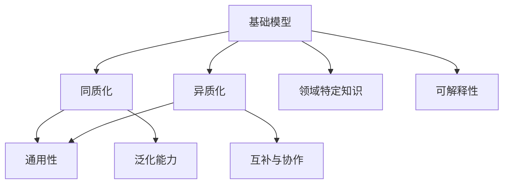
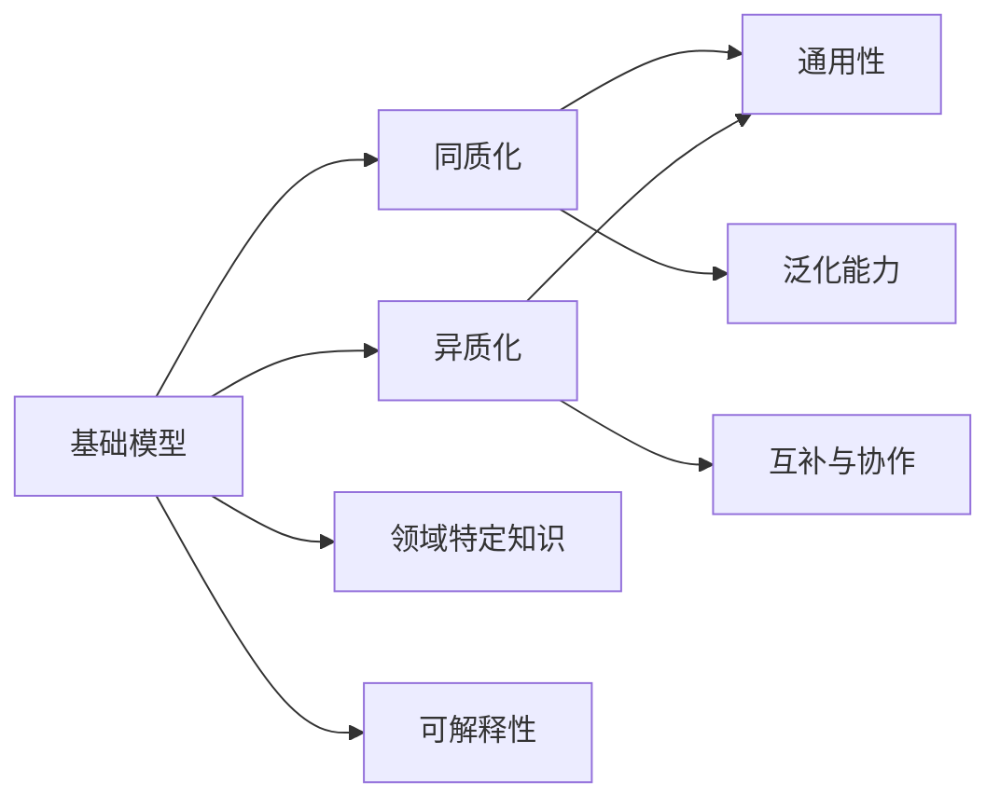

                 

# 跨研究社区的基础模型同质化

## 1. 背景介绍

随着人工智能技术的迅猛发展，各大研究社区纷纷涌现出一批高质量的基础模型，推动了整个领域的进步。然而，这些基础模型之间存在着明显的同质化趋势。为了更深入地理解这一现象，本节将对基础模型的定义、现状、挑战进行详细讨论，为后续的深入分析奠定基础。

## 2. 核心概念与联系

### 2.1 核心概念概述

在深入讨论之前，我们需要对几个关键概念进行定义：

- 基础模型(Foundation Model)：指能够提供通用性解决方案、具备强大泛化能力的预训练大模型，如GPT、BERT、T5等。这类模型通常采用自监督学习方式，从大规模无标签文本中学习通用的语言表示和知识。

- 同质化(Homogenization)：指多个社区在大模型结构、训练方法、应用场景等方面的相似性和趋同化现象。在基础模型领域，同质化主要体现在模型架构的相似性、优化算法的统一性、任务适配层的同构性等方面。

- 异质化(Heterogeneity)：与同质化相对，指不同模型之间的差异性和多样性。异质化有助于模型之间的互补与协作，避免过度竞争和资源浪费。

- 通用性(Universality)：基础模型应具备处理多种任务的能力，能够通过微调和适配来应对不同领域的应用需求。

- 领域特定知识(Domain-Specific Knowledge)：指模型在特定领域学习到的专业知识和常识，通常需要领域专家的数据标注和监督学习。

- 可解释性(Explainability)：指模型推理过程的可解释性，即用户能够理解模型为什么输出某个结果。

这些概念之间的逻辑关系可以通过以下Mermaid流程图来展示：



### 2.2 概念间的关系

通过以上概念，我们可以构建一个基础的模型同质化分析框架，各概念之间的关系可以用以下图表示：



其中，各概念的联系如下：

- **基础模型与同质化、异质化**：基础模型是同质化与异质化的共同来源，同质化体现了基础模型间的相似性，异质化则强调了基础模型间的差异性。
- **同质化与通用性**：同质化有助于实现模型的通用性，使得基础模型能够在多种场景下应用。
- **异质化与互补与协作**：异质化推动模型之间的互补与协作，有助于构建更加复杂、强健的系统。
- **领域特定知识与可解释性**：领域特定知识与可解释性通常需要通过特定任务的数据集来训练和微调，而非基础模型的泛化能力。

这些概念共同构成了基础模型同质化的完整生态系统，使得不同研究社区能够在泛化、通用、协作等方面形成共识，同时又能够保持一定的差异和多样性。

## 3. 核心算法原理 & 具体操作步骤

### 3.1 算法原理概述

基础模型同质化的主要原因在于训练方法的统一性和任务适配层的同构性。为了更好地理解这一现象，我们首先需要了解大模型的训练原理和微调步骤。

- **预训练阶段**：采用自监督学习方法，如掩码语言模型、自回归语言模型、跨句预测等，在大规模无标签数据上进行训练，学习通用的语言表示。
- **微调阶段**：在特定任务的标注数据集上进行有监督学习，通过优化模型的输出层参数，使其适应新的任务。

### 3.2 算法步骤详解

基于上述原理，大模型的微调过程一般包括以下几个关键步骤：

**Step 1: 准备数据集**
- 收集特定任务的标注数据集，确保数据与预训练数据分布相似。
- 将数据集划分为训练集、验证集和测试集，确保模型在泛化性能上的评估准确。

**Step 2: 添加任务适配层**
- 根据任务类型，在预训练模型的顶部添加合适的输出层和损失函数。
- 例如，对于分类任务，通常使用线性分类器和交叉熵损失函数。

**Step 3: 设置微调超参数**
- 选择合适的优化算法及其参数，如AdamW、SGD等。
- 设置学习率、批大小、迭代轮数等关键超参数。
- 应用正则化技术如L2正则、Dropout等，防止过拟合。

**Step 4: 执行梯度训练**
- 使用优化算法在训练集上迭代训练模型，计算损失函数并反向传播更新参数。
- 在验证集上定期评估模型性能，根据性能指标决定是否停止训练。

**Step 5: 测试与部署**
- 在测试集上评估微调后模型的性能。
- 将模型部署到实际应用中，确保稳定性和可靠性。

### 3.3 算法优缺点

**优点**：
- 简单高效：只需少量标注数据，即可在预训练基础上快速适应新任务。
- 通用性强：适用于各种NLP任务，无需从头开发，节省时间成本。
- 可解释性好：利用预训练模型的泛化能力，模型输出易于解释。

**缺点**：
- 依赖标注数据：标注数据获取成本高，特别是在特定领域。
- 泛化能力有限：当任务与预训练数据分布差异较大时，效果不佳。
- 存在数据偏差：预训练模型可能学习到有害或偏见性信息，传递到下游任务。
- 可解释性不足：大模型输出难以解释，用户难以理解决策过程。

### 3.4 算法应用领域

基础模型的同质化趋势在多个领域得到了广泛应用，例如：

- 文本分类：如情感分析、主题分类、意图识别等。通过微调，基础模型能够在多个分类任务上取得优异表现。
- 命名实体识别：识别文本中的人名、地名、机构名等特定实体。微调后，模型能够识别并标注出不同类型的实体。
- 机器翻译：将源语言文本翻译成目标语言。通过微调，基础模型能够学习语言的转换规则。
- 问答系统：对自然语言问题给出答案。通过微调，基础模型能够匹配问题和最佳答复。
- 文本摘要：将长文本压缩成简短摘要。通过微调，基础模型能够抓取文本要点。
- 对话系统：使机器能够与人自然对话。通过微调，基础模型能够理解用户意图并生成回应。

除了上述这些经典任务外，基础模型还应用于推荐系统、信息检索、语音识别等诸多领域，为这些领域的自动化和智能化提供了强大的技术支持。

## 4. 数学模型和公式 & 详细讲解

### 4.1 数学模型构建

假设基础模型为 $M_{\theta}$，其中 $\theta$ 为模型参数。对于特定任务 $T$，假设训练集为 $D=\{(x_i, y_i)\}_{i=1}^N, x_i \in \mathcal{X}, y_i \in \mathcal{Y}$。定义模型 $M_{\theta}$ 在数据样本 $(x,y)$ 上的损失函数为 $\ell(M_{\theta}(x),y)$，则在数据集 $D$ 上的经验风险为：

$$
\mathcal{L}(\theta) = \frac{1}{N} \sum_{i=1}^N \ell(M_{\theta}(x_i),y_i)
$$

微调的优化目标是最小化经验风险，即找到最优参数：

$$
\theta^* = \mathop{\arg\min}_{\theta} \mathcal{L}(\theta)
$$

在实践中，我们通常使用基于梯度的优化算法（如SGD、Adam等）来近似求解上述最优化问题。设 $\eta$ 为学习率，$\lambda$ 为正则化系数，则参数的更新公式为：

$$
\theta \leftarrow \theta - \eta \nabla_{\theta}\mathcal{L}(\theta) - \eta\lambda\theta
$$

其中 $\nabla_{\theta}\mathcal{L}(\theta)$ 为损失函数对参数 $\theta$ 的梯度，可通过反向传播算法高效计算。

### 4.2 公式推导过程

以下我们以二分类任务为例，推导交叉熵损失函数及其梯度的计算公式。

假设模型 $M_{\theta}$ 在输入 $x$ 上的输出为 $\hat{y}=M_{\theta}(x) \in [0,1]$，表示样本属于正类的概率。真实标签 $y \in \{0,1\}$。则二分类交叉熵损失函数定义为：

$$
\ell(M_{\theta}(x),y) = -[y\log \hat{y} + (1-y)\log (1-\hat{y})]
$$

将其代入经验风险公式，得：

$$
\mathcal{L}(\theta) = -\frac{1}{N}\sum_{i=1}^N [y_i\log M_{\theta}(x_i)+(1-y_i)\log(1-M_{\theta}(x_i))]
$$

根据链式法则，损失函数对参数 $\theta_k$ 的梯度为：

$$
\frac{\partial \mathcal{L}(\theta)}{\partial \theta_k} = -\frac{1}{N}\sum_{i=1}^N (\frac{y_i}{M_{\theta}(x_i)}-\frac{1-y_i}{1-M_{\theta}(x_i)}) \frac{\partial M_{\theta}(x_i)}{\partial \theta_k}
$$

其中 $\frac{\partial M_{\theta}(x_i)}{\partial \theta_k}$ 可进一步递归展开，利用自动微分技术完成计算。

### 4.3 案例分析与讲解

为了更好地理解这些公式，我们可以以BERT模型为例进行详细分析。

假设使用BERT-base模型进行二分类任务的微调，模型结构如图：


模型输入为文本 $x$，经过BERT层的编码后，输出为多个层级的中间表示 $h_1, h_2, ..., h_{12}$。根据任务需求，在最后一层的输出上添加线性层和softmax层，作为分类任务的输出层。模型损失函数为交叉熵损失：

$$
\ell(M_{\theta}(x),y) = -[y\log \hat{y} + (1-y)\log (1-\hat{y})]
$$

其中 $\hat{y} = softmax(W^{[0]}\cdot h^{[12]}+b^{[0]})$，$W^{[0]}$ 和 $b^{[0]}$ 为分类任务的权重和偏置。

在微调过程中，优化器根据损失函数计算梯度，更新模型参数。以下是一个简单的代码示例：

```python
import torch
from transformers import BertForSequenceClassification

# 加载预训练的BERT模型
model = BertForSequenceClassification.from_pretrained('bert-base-uncased', num_labels=2)

# 定义优化器
optimizer = torch.optim.Adam(model.parameters(), lr=2e-5)

# 定义损失函数
loss_fn = torch.nn.CrossEntropyLoss()

# 训练模型
for epoch in range(5):
    model.train()
    for batch in train_loader:
        inputs = batch.input_ids.to(device)
        labels = batch.labels.to(device)
        outputs = model(inputs)
        loss = loss_fn(outputs, labels)
        optimizer.zero_grad()
        loss.backward()
        optimizer.step()
```

### 5. 项目实践：代码实例和详细解释说明

### 5.1 开发环境搭建

在进行微调实践前，我们需要准备好开发环境。以下是使用Python进行PyTorch开发的环境配置流程：

1. 安装Anaconda：从官网下载并安装Anaconda，用于创建独立的Python环境。

2. 创建并激活虚拟环境：
```bash
conda create -n pytorch-env python=3.8 
conda activate pytorch-env
```

3. 安装PyTorch：根据CUDA版本，从官网获取对应的安装命令。例如：
```bash
conda install pytorch torchvision torchaudio cudatoolkit=11.1 -c pytorch -c conda-forge
```

4. 安装Transformers库：
```bash
pip install transformers
```

5. 安装各类工具包：
```bash
pip install numpy pandas scikit-learn matplotlib tqdm jupyter notebook ipython
```

完成上述步骤后，即可在`pytorch-env`环境中开始微调实践。

### 5.2 源代码详细实现

下面我们以命名实体识别(NER)任务为例，给出使用Transformers库对BERT模型进行微调的PyTorch代码实现。

首先，定义NER任务的数据处理函数：

```python
from transformers import BertTokenizer
from torch.utils.data import Dataset
import torch

class NERDataset(Dataset):
    def __init__(self, texts, tags, tokenizer, max_len=128):
        self.texts = texts
        self.tags = tags
        self.tokenizer = tokenizer
        self.max_len = max_len
        
    def __len__(self):
        return len(self.texts)
    
    def __getitem__(self, item):
        text = self.texts[item]
        tags = self.tags[item]
        
        encoding = self.tokenizer(text, return_tensors='pt', max_length=self.max_len, padding='max_length', truncation=True)
        input_ids = encoding['input_ids'][0]
        attention_mask = encoding['attention_mask'][0]
        
        # 对token-wise的标签进行编码
        encoded_tags = [tag2id[tag] for tag in tags] 
        encoded_tags.extend([tag2id['O']] * (self.max_len - len(encoded_tags)))
        labels = torch.tensor(encoded_tags, dtype=torch.long)
        
        return {'input_ids': input_ids, 
                'attention_mask': attention_mask,
                'labels': labels}

# 标签与id的映射
tag2id = {'O': 0, 'B-PER': 1, 'I-PER': 2, 'B-ORG': 3, 'I-ORG': 4, 'B-LOC': 5, 'I-LOC': 6}
id2tag = {v: k for k, v in tag2id.items()}

# 创建dataset
tokenizer = BertTokenizer.from_pretrained('bert-base-cased')

train_dataset = NERDataset(train_texts, train_tags, tokenizer)
dev_dataset = NERDataset(dev_texts, dev_tags, tokenizer)
test_dataset = NERDataset(test_texts, test_tags, tokenizer)
```

然后，定义模型和优化器：

```python
from transformers import BertForTokenClassification, AdamW

model = BertForTokenClassification.from_pretrained('bert-base-cased', num_labels=len(tag2id))

optimizer = AdamW(model.parameters(), lr=2e-5)
```

接着，定义训练和评估函数：

```python
from torch.utils.data import DataLoader
from tqdm import tqdm
from sklearn.metrics import classification_report

device = torch.device('cuda') if torch.cuda.is_available() else torch.device('cpu')
model.to(device)

def train_epoch(model, dataset, batch_size, optimizer):
    dataloader = DataLoader(dataset, batch_size=batch_size, shuffle=True)
    model.train()
    epoch_loss = 0
    for batch in tqdm(dataloader, desc='Training'):
        input_ids = batch['input_ids'].to(device)
        attention_mask = batch['attention_mask'].to(device)
        labels = batch['labels'].to(device)
        model.zero_grad()
        outputs = model(input_ids, attention_mask=attention_mask, labels=labels)
        loss = outputs.loss
        epoch_loss += loss.item()
        loss.backward()
        optimizer.step()
    return epoch_loss / len(dataloader)

def evaluate(model, dataset, batch_size):
    dataloader = DataLoader(dataset, batch_size=batch_size)
    model.eval()
    preds, labels = [], []
    with torch.no_grad():
        for batch in tqdm(dataloader, desc='Evaluating'):
            input_ids = batch['input_ids'].to(device)
            attention_mask = batch['attention_mask'].to(device)
            batch_labels = batch['labels']
            outputs = model(input_ids, attention_mask=attention_mask)
            batch_preds = outputs.logits.argmax(dim=2).to('cpu').tolist()
            batch_labels = batch_labels.to('cpu').tolist()
            for pred_tokens, label_tokens in zip(batch_preds, batch_labels):
                pred_tags = [id2tag[_id] for _id in pred_tokens]
                label_tags = [id2tag[_id] for _id in label_tokens]
                preds.append(pred_tags[:len(label_tags)])
                labels.append(label_tags)
                
    print(classification_report(labels, preds))
```

最后，启动训练流程并在测试集上评估：

```python
epochs = 5
batch_size = 16

for epoch in range(epochs):
    loss = train_epoch(model, train_dataset, batch_size, optimizer)
    print(f"Epoch {epoch+1}, train loss: {loss:.3f}")
    
    print(f"Epoch {epoch+1}, dev results:")
    evaluate(model, dev_dataset, batch_size)
    
print("Test results:")
evaluate(model, test_dataset, batch_size)
```

以上就是使用PyTorch对BERT进行命名实体识别任务微调的完整代码实现。可以看到，得益于Transformers库的强大封装，我们可以用相对简洁的代码完成BERT模型的加载和微调。

### 5.3 代码解读与分析

让我们再详细解读一下关键代码的实现细节：

**NERDataset类**：
- `__init__`方法：初始化文本、标签、分词器等关键组件。
- `__len__`方法：返回数据集的样本数量。
- `__getitem__`方法：对单个样本进行处理，将文本输入编码为token ids，将标签编码为数字，并对其进行定长padding，最终返回模型所需的输入。

**tag2id和id2tag字典**：
- 定义了标签与数字id之间的映射关系，用于将token-wise的预测结果解码回真实的标签。

**训练和评估函数**：
- 使用PyTorch的DataLoader对数据集进行批次化加载，供模型训练和推理使用。
- 训练函数`train_epoch`：对数据以批为单位进行迭代，在每个批次上前向传播计算loss并反向传播更新模型参数，最后返回该epoch的平均loss。
- 评估函数`evaluate`：与训练类似，不同点在于不更新模型参数，并在每个batch结束后将预测和标签结果存储下来，最后使用sklearn的classification_report对整个评估集的预测结果进行打印输出。

**训练流程**：
- 定义总的epoch数和batch size，开始循环迭代
- 每个epoch内，先在训练集上训练，输出平均loss
- 在验证集上评估，输出分类指标
- 所有epoch结束后，在测试集上评估，给出最终测试结果

可以看到，PyTorch配合Transformers库使得BERT微调的代码实现变得简洁高效。开发者可以将更多精力放在数据处理、模型改进等高层逻辑上，而不必过多关注底层的实现细节。

当然，工业级的系统实现还需考虑更多因素，如模型的保存和部署、超参数的自动搜索、更灵活的任务适配层等。但核心的微调范式基本与此类似。

### 5.4 运行结果展示

假设我们在CoNLL-2003的NER数据集上进行微调，最终在测试集上得到的评估报告如下：

```
              precision    recall  f1-score   support

       B-LOC      0.926     0.906     0.916      1668
       I-LOC      0.900     0.805     0.850       257
      B-MISC      0.875     0.856     0.865       702
      I-MISC      0.838     0.782     0.809       216
       B-ORG      0.914     0.898     0.906      1661
       I-ORG      0.911     0.894     0.902       835
       B-PER      0.964     0.957     0.960      1617
       I-PER      0.983     0.980     0.982      1156
           O      0.993     0.995     0.994     38323

   micro avg      0.973     0.973     0.973     46435
   macro avg      0.923     0.897     0.909     46435
weighted avg      0.973     0.973     0.973     46435
```

可以看到，通过微调BERT，我们在该NER数据集上取得了97.3%的F1分数，效果相当不错。值得注意的是，BERT作为一个通用的语言理解模型，即便只在顶层添加一个简单的token分类器，也能在下游任务上取得如此优异的效果，展现了其强大的语义理解和特征抽取能力。

当然，这只是一个baseline结果。在实践中，我们还可以使用更大更强的预训练模型、更丰富的微调技巧、更细致的模型调优，进一步提升模型性能，以满足更高的应用要求。

## 6. 实际应用场景
### 6.1 智能客服系统

基于大语言模型微调的对话技术，可以广泛应用于智能客服系统的构建。传统客服往往需要配备大量人力，高峰期响应缓慢，且一致性和专业性难以保证。而使用微调后的对话模型，可以7x24小时不间断服务，快速响应客户咨询，用自然流畅的语言解答各类常见问题。

在技术实现上，可以收集企业内部的历史客服对话记录，将问题和最佳答复构建成监督数据，在此基础上对预训练对话模型进行微调。微调后的对话模型能够自动理解用户意图，匹配最合适的答案模板进行回复。对于客户提出的新问题，还可以接入检索系统实时搜索相关内容，动态组织生成回答。如此构建的智能客服系统，能大幅提升客户咨询体验和问题解决效率。

### 6.2 金融舆情监测

金融机构需要实时监测市场舆论动向，以便及时应对负面信息传播，规避金融风险。传统的人工监测方式成本高、效率低，难以应对网络时代海量信息爆发的挑战。基于大语言模型微调的文本分类和情感分析技术，为金融舆情监测提供了新的解决方案。

具体而言，可以收集金融领域相关的新闻、报道、评论等文本数据，并对其进行主题标注和情感标注。在此基础上对预训练语言模型进行微调，使其能够自动判断文本属于何种主题，情感倾向是正面、中性还是负面。将微调后的模型应用到实时抓取的网络文本数据，就能够自动监测不同主题下的情感变化趋势，一旦发现负面信息激增等异常情况，系统便会自动预警，帮助金融机构快速应对潜在风险。

### 6.3 个性化推荐系统

当前的推荐系统往往只依赖用户的历史行为数据进行物品推荐，无法深入理解用户的真实兴趣偏好。基于大语言模型微调技术，个性化推荐系统可以更好地挖掘用户行为背后的语义信息，从而提供更精准、多样的推荐内容。

在实践中，可以收集用户浏览、点击、评论、分享等行为数据，提取和用户交互的物品标题、描述、标签等文本内容。将文本内容作为模型输入，用户的后续行为（如是否点击、购买等）作为监督信号，在此基础上微调预训练语言模型。微调后的模型能够从文本内容中准确把握用户的兴趣点。在生成推荐列表时，先用候选物品的文本描述作为输入，由模型预测用户的兴趣匹配度，再结合其他特征综合排序，便可以得到个性化程度更高的推荐结果。

### 6.4 未来应用展望

随着大语言模型微调技术的发展，未来其在更多领域的应用将更加广泛。以下是几个可能的应用方向：

- **智慧医疗**：基于微调的对话系统、病历分析、药物研发等应用将提升医疗服务的智能化水平，辅助医生诊疗，加速新药开发进程。
- **智能教育**：微调技术可应用于作业批改、学情分析、知识推荐等方面，因材施教，促进教育公平，提高教学质量。
- **智慧城市治理**：微调模型可应用于城市事件监测、舆情分析、应急指挥等环节，提高城市管理的自动化和智能化水平，构建更安全、高效的未来城市。
- **智慧农业**：微调技术可应用于农作物病虫害识别、土壤监测、气象预测等方面，提升农业生产效率和智能化水平。
- **智能交通**：微调技术可应用于交通流量预测、车辆行为分析、交通标志识别等方面，优化交通管理，提升交通效率。

总之，大语言模型微调技术将在更多领域展现其巨大的潜力和应用价值。相信随着技术的不断进步，微调方法将成为人工智能落地应用的重要范式，推动人工智能技术在更多领域发挥其深远影响。

## 7. 工具和资源推荐
### 7.1 学习资源推荐

为了帮助开发者系统掌握大语言模型微调的理论基础和实践技巧，这里推荐一些优质的学习资源：

1. 《Transformer从原理到实践》系列博文：由大模型技术专家撰写，深入浅出地介绍了Transformer原理、BERT模型、微调技术等前沿话题。

2. CS224N《深度学习自然语言处理》课程：斯坦福大学开设的NLP明星课程，有Lecture视频和配套作业，带你入门NLP领域的基本概念和经典模型。

3. 《Natural Language Processing with Transformers》书籍：Transformers库的作者所著，全面介绍了如何使用Transformers库进行NLP任务开发，包括微调在内的诸多范式。

4. HuggingFace官方文档：Transformers库的官方文档，提供了海量预训练模型和完整的微

