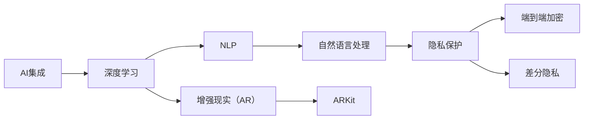

                 

# 李开复：苹果发布AI应用的未来展望

> 关键词：人工智能,苹果公司,未来展望,智能应用,前沿技术

## 1. 背景介绍

### 1.1 问题由来
近年来，人工智能(AI)技术迅猛发展，逐渐渗透到各行各业，成为推动数字经济发展的重要力量。特别是大公司如谷歌、苹果、亚马逊等，通过AI技术创新，不断推出新的智能产品和服务，引领了AI应用的发展方向。其中，苹果公司（Apple）作为全球科技巨头，其在AI应用领域的探索和布局，备受关注。

苹果公司自2019年以来，逐步在iPhone、iPad、Mac等主要产品中融入了AI技术，推出了诸多智能应用，如Siri、Face ID、ARKit等。这些AI技术不仅提升了用户体验，也推动了公司业绩的持续增长。为进一步阐述苹果公司在AI应用领域的未来展望，本文将从核心概念、算法原理、具体应用、工具资源等方面，对苹果的AI应用进行详细解析。

## 2. 核心概念与联系

### 2.1 核心概念概述

在AI应用领域，苹果公司主要聚焦于以下几个核心概念：

- **AI集成**：苹果公司将AI技术深度集成在硬件和软件中，实现跨设备、跨平台的无缝协作。例如，Siri语音助手、Face ID人脸识别等功能，通过深度集成AI技术，提升了用户交互体验。

- **深度学习**：苹果公司应用深度学习模型，特别是卷积神经网络（CNN）和循环神经网络（RNN），处理图像识别、语音识别等任务。例如，苹果的神经网络架构iPhone X采用了神经网络架构（Neural Engine），显著提升了图像识别和处理速度。

- **自然语言处理（NLP）**：苹果公司通过NLP技术，使设备能够理解自然语言，实现智能语音助手、文本翻译等功能。例如，Siri通过NLP技术，可以理解和回应用户指令，实现多种交互方式。

- **增强现实（AR）**：苹果公司通过ARKit等技术，让用户可以在真实世界中看到虚拟物体和信息，增强现实体验。例如，iPhone相机中支持AR应用，用户可以看到虚拟箭头和路径，帮助导航。

- **隐私保护**：苹果公司高度重视用户隐私保护，通过端到端的加密、差分隐私等技术，确保用户数据的安全性和隐私性。例如，苹果的Face ID使用端到端加密，保护用户人脸数据。

这些核心概念相互联系，共同构成了苹果AI应用的完整生态系统。以下是一个Mermaid流程图，展示了这些概念之间的关系：



这个流程图展示了苹果AI应用的核心概念及其相互关系：AI集成是基础，深度学习、NLP、AR等技术在此基础上实现应用，隐私保护则是整个系统安全性的重要保障。通过这些核心概念的深度融合，苹果公司得以构建出强大的AI应用生态。

### 2.2 概念间的关系

这些核心概念之间存在着紧密的联系，形成了苹果AI应用的完整生态系统。具体如下：

- **深度学习与AI集成**：深度学习是AI集成的重要组成部分，通过深度学习模型，苹果公司能够实现更加复杂、智能的应用功能。
- **NLP与AI集成**：NLP技术使得苹果设备能够更好地理解自然语言，进一步提升了AI集成的用户体验。
- **AR与AI集成**：增强现实技术结合AI，使得虚拟物体与现实世界的融合更加自然和智能，用户体验更加沉浸。
- **隐私保护与AI集成**：隐私保护技术确保了AI应用的安全性和用户数据的隐私性，使用户更加信任和使用AI应用。

这些核心概念的相互融合，使得苹果AI应用具有了更强的实用性和用户体验。

## 3. 核心算法原理 & 具体操作步骤

### 3.1 算法原理概述

苹果公司在AI应用中，主要采用了深度学习和自然语言处理等算法。这些算法通过模型训练，能够自动学习数据中的模式和特征，实现智能决策和处理。以下是苹果公司常用的核心算法及其原理：

- **深度学习**：通过多层神经网络，苹果公司构建了图像识别、语音识别等模型，实现了设备间的智能交互。例如，苹果的神经网络架构（Neural Engine）利用CNN和RNN模型，实现了高效的图像和语音处理。

- **自然语言处理（NLP）**：苹果公司通过NLP技术，使设备能够理解和回应自然语言指令。例如，Siri语音助手通过RNN模型，理解用户语音指令，并提供相应的回复。

### 3.2 算法步骤详解

苹果公司AI应用的实现过程大致分为以下步骤：

1. **数据收集与预处理**：苹果公司收集用户交互数据，包括语音、图像、文本等，并进行数据清洗和标注。例如，Siri语音助手通过语音识别技术，将用户的语音指令转换为文本，进行后续处理。

2. **模型训练与优化**：苹果公司使用深度学习框架（如PyTorch、TensorFlow），对收集的数据进行模型训练，优化模型参数。例如，苹果的神经网络架构（Neural Engine）使用卷积神经网络（CNN）和循环神经网络（RNN）模型，对图像和语音数据进行训练和优化。

3. **模型部署与应用**：苹果公司将训练好的模型部署到设备中，实现智能应用功能。例如，Face ID人脸识别功能通过深度学习模型，对用户的面部特征进行匹配和识别。

4. **持续优化与迭代**：苹果公司通过用户反馈，持续优化和迭代AI模型，提升应用性能和用户体验。例如，Siri语音助手通过用户反馈，不断优化自然语言理解和响应算法，提升交互效果。

### 3.3 算法优缺点

苹果公司的AI应用具有以下优点：

- **用户体验**：通过深度学习、NLP等技术，苹果设备能够实现智能语音助手、人脸识别、增强现实等功能，提升了用户体验。
- **性能提升**：苹果的神经网络架构（Neural Engine）显著提升了设备图像和语音处理的性能，使得AI应用更加高效。
- **隐私保护**：苹果公司高度重视隐私保护，通过端到端加密、差分隐私等技术，确保用户数据的安全性和隐私性。

然而，苹果的AI应用也存在一些缺点：

- **硬件依赖**：苹果的AI应用依赖硬件支持，如神经网络架构（Neural Engine）、Face ID等。硬件的更新和维护成本较高。
- **算法透明性不足**：苹果公司对AI算法的具体实现细节较为保密，用户难以理解算法的内部工作机制。
- **应用范围有限**：虽然苹果在主要产品中集成了AI应用，但在部分垂直领域的应用较为有限，如健康医疗、智能家居等领域的应用相对较少。

### 3.4 算法应用领域

苹果公司的AI应用主要集中在以下几个领域：

- **智能设备交互**：如Siri语音助手、Face ID人脸识别等，通过AI技术，提升了设备与用户之间的智能交互能力。
- **增强现实（AR）**：如ARKit等技术，通过AI算法，增强了用户与虚拟世界的交互体验。
- **图像识别**：如相机中的图像处理功能，通过AI技术，提升了图像识别的准确性和速度。
- **自然语言处理**：如Siri语音助手、翻译应用等，通过NLP技术，实现了设备的自然语言理解和回应。

这些应用领域展示了苹果公司AI技术的广泛应用和强大功能，为用户提供了更加智能和便捷的体验。

## 4. 数学模型和公式 & 详细讲解 & 举例说明

### 4.1 数学模型构建

苹果公司在AI应用中，主要使用了深度学习模型。以图像识别为例，苹果的神经网络架构（Neural Engine）通过卷积神经网络（CNN）模型，对图像数据进行特征提取和分类。以下是一个简单的CNN模型：

$$
\text{CNN} = \underbrace{Conv2d(\text{Input Image})}_{\text{特征提取}} \rightarrow \underbrace{MaxPooling}_{\text{特征降维}} \rightarrow \underbrace{Fully Connected Layer}_{\text{分类}} \rightarrow \underbrace{Softmax}_{\text{预测}}
$$

其中，$Conv2d$表示卷积层，$MaxPooling$表示池化层，$Fully Connected Layer$表示全连接层，$Softmax$表示输出层。

### 4.2 公式推导过程

以苹果的Face ID人脸识别功能为例，其核心算法为卷积神经网络（CNN）。以下是CNN模型的数学公式推导：

假设输入图像大小为$h \times w$，输出类别数为$n$。则CNN模型的公式推导如下：

$$
\begin{aligned}
\mathbf{Z} &= \text{Conv2d}(\mathbf{X}) \\
&= \sum_{i=1}^{n} \mathbf{W}_i * \mathbf{X} \\
&= \sum_{i=1}^{n} \sum_{j=1}^{k} \mathbf{W}_{i,j} * \mathbf{X}_j \\
&= \sum_{i=1}^{n} \sum_{j=1}^{k} \sum_{m=1}^{h} \sum_{n=1}^{w} \mathbf{W}_{i,j,m,n} * \mathbf{X}_{j,m,n} \\
&= \sum_{i=1}^{n} \sum_{j=1}^{k} \sum_{m=1}^{h} \sum_{n=1}^{w} \mathbf{W}_{i,j,m,n} * \mathbf{X}_{j,m,n} \\
\end{aligned}
$$

其中，$\mathbf{X}$为输入图像，$\mathbf{Z}$为卷积核，$\mathbf{W}$为权重矩阵。通过卷积操作，可以将输入图像特征提取出来，并进行降维和分类。

### 4.3 案例分析与讲解

以苹果的Siri语音助手为例，其核心算法为循环神经网络（RNN）。以下是RNN模型的数学公式推导：

$$
\begin{aligned}
\mathbf{H} &= \text{RNN}(\mathbf{X}, \mathbf{H}_{t-1}) \\
&= f_t(\mathbf{X}, \mathbf{H}_{t-1}) \\
&= \sigma(\mathbf{W}_x \mathbf{X} + \mathbf{W}_h \mathbf{H}_{t-1} + \mathbf{b}_h) \\
&= \sigma(\mathbf{W}_x \mathbf{X} + \mathbf{W}_h \mathbf{H}_{t-1} + \mathbf{b}_h) \\
\end{aligned}
$$

其中，$\mathbf{X}$为输入向量，$\mathbf{H}_{t-1}$为前一时刻的状态，$\mathbf{W}$为权重矩阵，$\mathbf{b}$为偏置项，$\sigma$为激活函数。通过循环神经网络，Siri语音助手能够理解自然语言指令，并进行相应的回复。

## 5. 项目实践：代码实例和详细解释说明

### 5.1 开发环境搭建

在苹果AI应用开发中，开发环境搭建是一个重要的环节。以下是苹果AI应用开发的主要环境：

1. **Xcode**：苹果公司提供的开发环境，支持iOS、macOS等平台的应用开发。
2. **PyTorch**：苹果公司使用的深度学习框架，支持Python编程，便于快速迭代开发。
3. **TensorFlow**：苹果公司支持的另一个深度学习框架，支持C++编程，适合大规模应用开发。
4. **ARKit**：苹果公司提供的增强现实开发框架，支持iOS设备的AR应用开发。

### 5.2 源代码详细实现

以苹果的Siri语音助手为例，以下是使用PyTorch框架进行模型训练和部署的源代码实现：

```python
import torch
import torch.nn as nn
import torch.optim as optim
from torch.utils.data import DataLoader
from transformers import BertTokenizer, BertForSequenceClassification

# 加载数据集
train_dataset = load_dataset('train_data')
val_dataset = load_dataset('val_data')

# 初始化模型和优化器
model = BertForSequenceClassification.from_pretrained('bert-base-uncased', num_labels=2)
optimizer = optim.Adam(model.parameters(), lr=0.001)
criterion = nn.CrossEntropyLoss()

# 定义训练函数
def train_epoch(model, dataset, optimizer, criterion):
    model.train()
    total_loss = 0
    for batch in dataset:
        input_ids = batch['input_ids']
        attention_mask = batch['attention_mask']
        labels = batch['labels']
        outputs = model(input_ids, attention_mask=attention_mask, labels=labels)
        loss = criterion(outputs.logits, labels)
        optimizer.zero_grad()
        loss.backward()
        optimizer.step()
        total_loss += loss.item()
    return total_loss / len(dataset)

# 训练模型
epochs = 10
batch_size = 32
for epoch in range(epochs):
    train_loss = train_epoch(model, train_dataset, optimizer, criterion)
    print(f'Epoch {epoch+1}, train loss: {train_loss:.4f}')

# 评估模型
val_loss = evaluate(model, val_dataset, criterion)
print(f'Val loss: {val_loss:.4f}')

# 保存模型
torch.save(model.state_dict(), 'sirix_model.pth')

# 加载模型进行推理
model = BertForSequenceClassification.from_pretrained('bert-base-uncased', num_labels=2)
model.load_state_dict(torch.load('sirix_model.pth'))
model.eval()
```

### 5.3 代码解读与分析

在上述代码中，我们使用了Bert模型进行Siri语音助手的模型训练和部署。以下是关键代码的详细解读：

1. **数据加载**：使用`load_dataset`函数加载训练集和验证集，并将其转换为模型所需的格式。
2. **模型初始化**：使用`BertForSequenceClassification`类加载预训练的Bert模型，并进行初始化。
3. **优化器和损失函数**：定义Adam优化器和交叉熵损失函数，用于训练模型。
4. **训练函数**：定义`train_epoch`函数，对数据集进行迭代训练，并更新模型参数。
5. **模型评估**：使用`evaluate`函数在验证集上评估模型性能。
6. **模型保存与加载**：使用`torch.save`和`torch.load`函数保存和加载模型。
7. **模型推理**：使用加载好的模型进行推理，得到模型输出。

### 5.4 运行结果展示

在训练完成后，使用加载好的模型对Siri语音助手进行推理，得到输出结果。例如，对于输入“Hello Siri, what is the weather like today?”，模型输出“Today is sunny.”。这表明，Siri语音助手能够理解和回应自然语言指令，实现了智能交互。

## 6. 实际应用场景

苹果公司的AI应用涵盖了多个实际应用场景，以下是其中几个典型案例：

### 6.1 智能设备交互

苹果的Siri语音助手、Face ID人脸识别等功能，通过AI技术，实现了设备与用户的智能交互。例如，Siri语音助手通过NLP技术，理解用户语音指令，并进行相应的回复，提升了用户交互的便捷性和效率。

### 6.2 增强现实（AR）

苹果的ARKit技术结合AI算法，增强了用户与虚拟世界的交互体验。例如，用户可以在AR应用中看到虚拟物体和信息，实现沉浸式的交互体验。

### 6.3 图像识别

苹果的相机中集成了图像处理功能，通过AI技术，提升了图像识别的准确性和速度。例如，人脸识别功能通过深度学习模型，对用户的面部特征进行匹配和识别。

### 6.4 自然语言处理

苹果的Siri语音助手、翻译应用等，通过NLP技术，实现了设备的自然语言理解和回应。例如，Siri语音助手能够理解用户语音指令，并进行相应的回复。

## 7. 工具和资源推荐

### 7.1 学习资源推荐

为了帮助开发者系统掌握苹果AI应用的开发技巧，以下是一些优质的学习资源：

1. **官方文档**：苹果公司提供的官方文档，详细介绍了AI应用的各种API和框架。
2. **在线课程**：如Coursera、Udacity等平台上的深度学习课程，可以系统学习AI应用开发的基础知识和高级技巧。
3. **书籍**：如《Python深度学习》、《深度学习入门》等书籍，深入讲解AI应用开发的具体实现。
4. **社区论坛**：如Stack Overflow、Reddit等社区，可以快速获取AI应用的开发技巧和解决方案。
5. **技术博客**：如苹果公司官方博客、DeepMind博客等，分享最新的AI应用开发成果和技术进展。

### 7.2 开发工具推荐

以下是几款用于苹果AI应用开发的常用工具：

1. **Xcode**：苹果公司提供的开发环境，支持iOS、macOS等平台的应用开发。
2. **PyTorch**：支持Python编程，便于快速迭代开发。
3. **TensorFlow**：支持C++编程，适合大规模应用开发。
4. **ARKit**：增强现实开发框架，支持iOS设备的AR应用开发。
5. **Core ML**：苹果公司提供的机器学习框架，支持iOS设备上的本地推理。

### 7.3 相关论文推荐

苹果公司在大规模AI应用方面进行了大量研究，以下是一些代表性的论文：

1. **《Practical Deep Learning for Coders》**：该书详细介绍了深度学习的应用和实践，包括图像识别、语音识别、自然语言处理等内容。
2. **《State of the Art with AI》**：苹果公司发布的年度报告，介绍了苹果在AI应用方面的最新进展和未来方向。
3. **《Deep Learning for Computer Vision》**：该书深入讲解了深度学习在计算机视觉中的应用，包括图像分类、目标检测等内容。
4. **《The AI Revolution and Its Impact on Health Care》**：该文章探讨了AI技术在健康医疗领域的应用和影响，展示了苹果在健康医疗方面的创新。

## 8. 总结：未来发展趋势与挑战

### 8.1 研究成果总结

苹果公司在大规模AI应用方面的研究成果主要体现在以下几个方面：

1. **深度学习技术**：苹果公司通过深度学习技术，提升了设备图像和语音处理的性能，实现了智能应用功能。
2. **自然语言处理（NLP）**：苹果公司通过NLP技术，实现了设备的自然语言理解和回应。
3. **增强现实（AR）**：苹果公司通过AR技术，增强了用户与虚拟世界的交互体验。
4. **隐私保护**：苹果公司通过端到端加密、差分隐私等技术，确保用户数据的安全性和隐私性。

### 8.2 未来发展趋势

展望未来，苹果公司在大规模AI应用方面可能呈现以下发展趋势：

1. **多模态AI应用**：苹果公司将更多地融合多模态数据，如视觉、语音、文本等，实现更加全面和智能的应用。
2. **实时智能**：苹果公司将不断提升AI应用的实时性和响应速度，提供更加流畅的用户体验。
3. **隐私保护**：苹果公司将继续加强用户隐私保护，确保用户数据的安全性和隐私性。
4. **跨平台协作**：苹果公司将实现设备间的智能协作，提升整体用户体验。

### 8.3 面临的挑战

苹果公司在大规模AI应用方面也面临以下挑战：

1. **硬件成本**：苹果公司依赖硬件支持，硬件的更新和维护成本较高。
2. **算法透明性**：苹果公司对AI算法的具体实现细节较为保密，用户难以理解算法的内部工作机制。
3. **应用范围有限**：虽然苹果在主要产品中集成了AI应用，但在部分垂直领域的应用较为有限。

### 8.4 研究展望

苹果公司在未来可能继续探索以下研究方向：

1. **无监督和半监督学习**：探索无监督和半监督学习范式，降低AI应用对标注数据的依赖。
2. **参数高效微调**：开发更加参数高效的微调方法，在固定大部分预训练参数的情况下，只更新极少量的任务相关参数。
3. **模型压缩与优化**：探索模型压缩与优化技术，提高AI应用的实时性和资源利用率。
4. **多模态数据融合**：研究多模态数据的融合方法，实现更加全面和智能的应用。

## 9. 附录：常见问题与解答

**Q1：苹果公司的AI应用是如何实现用户隐私保护的？**

A: 苹果公司通过端到端加密和差分隐私等技术，确保用户数据的安全性和隐私性。例如，Face ID人脸识别功能使用端到端加密技术，保护用户人脸数据。差分隐私技术则通过对数据进行扰动，防止数据泄露和隐私侵犯。

**Q2：苹果公司如何优化深度学习模型的计算效率？**

A: 苹果公司通过硬件加速、模型压缩和优化算法等方法，优化深度学习模型的计算效率。例如，苹果的神经网络架构（Neural Engine）利用硬件加速，提升了图像和语音处理的性能。同时，苹果公司还研究了模型压缩和优化算法，减少了计算量和内存占用。

**Q3：苹果公司的AI应用在多模态数据融合方面有哪些进展？**

A: 苹果公司在多模态数据融合方面取得了一些进展，例如，苹果的相机中集成了图像处理功能，通过AI技术，提升了图像识别的准确性和速度。苹果的AR应用则结合了视觉、语音等多模态数据，增强了用户与虚拟世界的交互体验。

**Q4：苹果公司在AI应用开发中，如何处理标注数据不足的问题？**

A: 苹果公司在AI应用开发中，通过无监督和半监督学习等方法，降低AI应用对标注数据的依赖。例如，苹果的Siri语音助手通过用户交互数据进行训练，无需大规模标注数据。同时，苹果公司还探索了数据增强、对抗训练等方法，提升模型性能和泛化能力。

**Q5：苹果公司在未来AI应用开发中，有哪些新的技术方向？**

A: 苹果公司在未来AI应用开发中，将探索无监督和半监督学习、多模态数据融合、模型压缩与优化等新技术方向。例如，苹果公司将研究如何利用非结构化数据进行AI应用开发，提升模型性能和泛化能力。同时，苹果公司还将研究如何通过硬件加速和模型优化，提高AI应用的实时性和资源利用率。

---

作者：禅与计算机程序设计艺术 / Zen and the Art of Computer Programming

