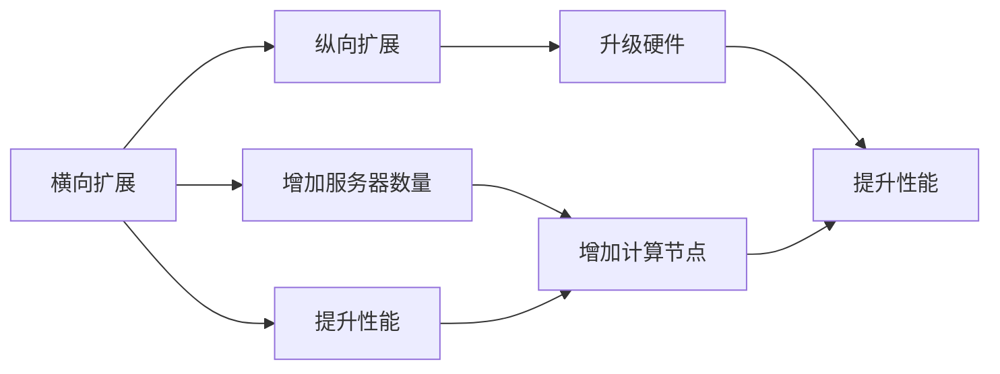

                 

# 横向扩展与纵向扩展的实际应用

在现代计算机体系结构中，横向扩展（Scale Out）和纵向扩展（Scale Up）是两种常见的系统扩展方式。这两种方式各有优劣，在不同的应用场景下选择不同的扩展策略可以有效地提升系统性能和可扩展性。本文将详细探讨横向扩展与纵向扩展的原理、优缺点及实际应用，为读者提供全面的技术见解。

## 1. 背景介绍

### 1.1 问题由来

随着云计算和大数据技术的快速发展，数据中心、服务器集群等基础设施的规模不断扩大，系统扩展问题变得日益重要。在过去，扩展系统通常只能通过增加服务器硬件或升级软件来提高性能。但是，这种纵向扩展（Scale Up）策略存在诸多瓶颈，例如单台服务器硬件的瓶颈难以突破，高成本等问题。

横向扩展（Scale Out）策略则通过增加更多的服务器来分担负载，从而提高系统的可扩展性和性能。然而，横向扩展也面临着数据一致性、网络延迟等挑战。为了平衡成本与性能，很多大型互联网公司如Google、Amazon、Facebook等采用了横向扩展为主、纵向扩展为辅的混合策略。

### 1.2 问题核心关键点

横向扩展与纵向扩展的核心关键点在于：

1. **性能瓶颈**：横向扩展通过增加服务器来提升系统的处理能力，可以有效解决单台服务器硬件瓶颈问题；纵向扩展则通过升级硬件来提升性能，但存在硬件升级成本高、单台硬件性能提升有限等问题。

2. **成本控制**：横向扩展通过增加多台低性能服务器来分担负载，成本相对较低；纵向扩展需要购买高性能硬件，成本较高。

3. **可扩展性**：横向扩展易于扩展，增加或减少服务器数量灵活；纵向扩展扩展性较差，难以通过硬件升级实现大规模扩展。

4. **数据一致性**：横向扩展面临数据一致性问题，如分布式数据库的同步、副本一致性等；纵向扩展则可以更好地解决数据一致性问题，通过单台服务器的优化实现高效处理。

5. **网络延迟**：横向扩展服务器之间的通信延迟较高；纵向扩展服务器的硬件和网络架构较为简单，通信延迟较低。

6. **系统架构**：横向扩展适合采用分布式架构，但需要考虑数据一致性和通信效率；纵向扩展适合采用集中式架构，系统架构相对简单。

理解这些核心关键点，对于选择合适的扩展策略至关重要。

## 2. 核心概念与联系

### 2.1 核心概念概述

- **横向扩展（Scale Out）**：通过增加多台低性能服务器来分担负载，从而提升系统性能和可扩展性。适用于处理大规模数据和并发请求，如Google的MapReduce、Amazon的EC2、Facebook的Hadoop等。

- **纵向扩展（Scale Up）**：通过升级单台服务器硬件（如CPU、内存、存储）来提升性能。适用于对性能要求极高、数据量相对较小的应用，如数据库、高端服务器等。

- **混合扩展（Hybrid Scale）**：综合利用横向扩展和纵向扩展的优势，根据实际需求选择合适的扩展策略。适用于处理大规模并发请求且对性能要求高的应用，如云计算平台、大型数据中心等。

### 2.2 概念间的关系

横向扩展与纵向扩展的关系可以通过以下Mermaid流程图来展示：



这个流程图展示了两者的核心关系：横向扩展通过增加服务器来提升性能，而纵向扩展通过升级硬件来提升性能。两者共同作用于提升系统的总性能和可扩展性。

## 3. 核心算法原理 & 具体操作步骤

### 3.1 算法原理概述

横向扩展和纵向扩展的算法原理主要体现在以下几个方面：

1. **负载均衡**：横向扩展的核心在于将负载均衡分配到多个服务器上，减少单个服务器的负载压力。这可以通过多台服务器间的网络通信、任务调度等方式实现。

2. **高性能网络**：横向扩展需要考虑多台服务器之间的通信效率，网络延迟等问题。因此需要采用高性能的网络架构，如高速网络交换机、负载均衡器等。

3. **数据一致性**：横向扩展面临数据一致性问题，需要设计合适的数据同步和复制策略。如分布式数据库的读写分离、数据复制等。

4. **系统架构**：纵向扩展通常采用集中式架构，系统架构相对简单。横向扩展则需要采用分布式架构，考虑数据一致性和通信效率等问题。

5. **资源管理**：横向扩展需要灵活管理多台服务器的资源分配，避免资源浪费。纵向扩展则可以通过单台服务器的资源优化来实现高性能。

### 3.2 算法步骤详解

**横向扩展步骤**：

1. **数据分区**：将数据根据业务需求和系统负载进行分区，分配到多个服务器上。

2. **负载均衡**：使用负载均衡器将请求分配到多台服务器上，保证每台服务器的负载均衡。

3. **数据同步**：设计合适的数据同步和复制策略，保证数据一致性。

4. **网络优化**：采用高性能的网络架构，减少网络延迟，提升通信效率。

5. **系统监控**：实时监控系统性能，及时调整资源分配和负载均衡策略。

**纵向扩展步骤**：

1. **硬件升级**：选择适合高性能需求的服务硬件，进行升级和配置。

2. **系统优化**：优化系统架构，提升单台服务器的性能。

3. **性能测试**：进行性能测试，验证硬件升级的效果。

4. **部署上线**：将升级后的硬件部署到生产环境，进行业务测试。

### 3.3 算法优缺点

**横向扩展的优点**：

1. 成本较低：通过增加多台低性能服务器，可以降低硬件成本。

2. 可扩展性高：可以方便地增加或减少服务器数量，提升系统的可扩展性。

3. 性能提升显著：通过多台服务器并行处理，可以显著提升系统性能。

**横向扩展的缺点**：

1. 数据一致性问题：多台服务器间的数据同步和一致性管理复杂。

2. 网络延迟较高：多台服务器间的通信延迟较高，影响性能。

3. 管理复杂：多台服务器的管理和维护复杂。

**纵向扩展的优点**：

1. 数据一致性较好：单台服务器可以更好地管理数据一致性。

2. 管理简单：单台服务器的管理和维护相对简单。

3. 网络延迟较低：单台服务器的硬件和网络架构较为简单，通信延迟较低。

**纵向扩展的缺点**：

1. 成本较高：需要购买高性能硬件，成本较高。

2. 扩展性较差：难以通过硬件升级实现大规模扩展。

3. 性能提升有限：单台硬件性能提升有限，难以应对大规模数据和并发请求。

### 3.4 算法应用领域

横向扩展和纵向扩展在各个应用领域都有广泛的应用：

1. **云计算**：云计算平台如AWS、Azure等广泛采用横向扩展，通过增加多台虚拟机来处理大规模数据和并发请求。

2. **大数据**：大数据集群如Hadoop、Spark等广泛采用横向扩展，通过增加多台计算节点来处理大规模数据。

3. **数据库**：大型数据库如MySQL、PostgreSQL等可以采用纵向扩展，通过升级单台硬件来提升性能。

4. **高性能计算**：高性能计算集群如 clusters等广泛采用纵向扩展，通过升级单台计算节点的硬件来提升性能。

5. **企业应用**：企业应用系统如ERP、CRM等可以采用横向扩展，通过增加多台服务器来提升系统的可扩展性和性能。

6. **物联网**：物联网系统如IoT等广泛采用横向扩展，通过增加多台设备来处理大规模数据和并发请求。

## 4. 数学模型和公式 & 详细讲解 & 举例说明

### 4.1 数学模型构建

假设有一个横向扩展的系统，由 $n$ 台服务器组成，每台服务器处理一部分请求。设每台服务器的处理能力为 $P$，则系统的总处理能力为 $nP$。设每台服务器的资源成本为 $C$，则系统的总成本为 $nC$。

**横向扩展的目标**：在总成本 $nC$ 不变的条件下，最大化系统的总处理能力 $nP$。

### 4.2 公式推导过程

设每台服务器的处理能力为 $P$，每台服务器的成本为 $C$，则系统的总处理能力和总成本分别为：

$$
\text{Total Processing Power} = nP
$$

$$
\text{Total Cost} = nC
$$

根据微积分知识，可以推导出系统的最大处理能力和最小成本的均衡点为：

$$
\frac{\partial \text{Total Processing Power}}{\partial n} = 0
$$

$$
\frac{\partial \text{Total Cost}}{\partial n} = 0
$$

解得最优服务器数量 $n_{opt}$ 为：

$$
n_{opt} = \frac{C}{P}
$$

### 4.3 案例分析与讲解

假设每台服务器的处理能力为 $P = 10 Gbps$，成本为 $C = 10000$ 美元，则最优服务器数量为：

$$
n_{opt} = \frac{10000}{10} = 1000
$$

也就是说，在总成本 $nC = 10000 \times 1000 = 10000000$ 美元的条件下，最佳配置为 1000 台服务器。

## 5. 项目实践：代码实例和详细解释说明

### 5.1 开发环境搭建

为了方便读者理解横向扩展和纵向扩展的具体实现，本文将使用Python和Docker进行开发环境搭建。以下是详细的步骤：

1. 安装Docker和Docker Compose。

   ```
   sudo apt-get install docker.io
   sudo apt-get install docker-compose
   ```

2. 编写Dockerfile，定义服务的配置和依赖关系。

   ```dockerfile
   FROM ubuntu:18.04
   MAINTAINER fuzhang
   COPY app /app
   WORKDIR /app
   RUN pip install requirements.txt
   EXPOSE 8080
   CMD ["python", "app.py"]
   ```

3. 编写requirements.txt文件，列出项目依赖。

   ```
   Flask==1.1.2
   gunicorn==20.1.0
   ```

4. 编写app.py文件，实现Flask应用的启动。

   ```python
   from flask import Flask
   app = Flask(__name__)

   @app.route('/')
   def hello():
       return "Hello, World!"
   ```

5. 使用Docker Compose创建服务配置文件。

   ```yaml
   version: '3'
   services:
     app:
       build: .
       ports:
         - "8080:8080"
   ```

6. 启动服务，使用Docker Compose命令运行。

   ```
   docker-compose up
   ```

7. 访问服务，在浏览器中访问 `http://localhost:8080`。

   ```
   Hello, World!
   ```

### 5.2 源代码详细实现

下面，我们将使用Python和Docker实现一个简单的横向扩展和纵向扩展的示例。假设我们需要处理一个简单的计数任务，将请求按照规则进行分流和处理。

#### 横向扩展实现

在横向扩展的实现中，我们需要使用多台服务器来实现负载均衡。假设我们有 3 台服务器，每台服务器的处理规则如下：

- 服务器A：接收以 'A' 开头的请求。
- 服务器B：接收以 'B' 开头的请求。
- 服务器C：接收以 'C' 开头的请求。

我们可以使用Python的Flask框架和Docker来实现横向扩展。具体实现步骤如下：

1. 编写Flask应用，定义路由和处理逻辑。

   ```python
   from flask import Flask, request
   app = Flask(__name__)

   @app.route('/')
   def hello():
       return "Hello, World!"

   @app.route('/<string:id>')
   def process_request(id):
       if id[0] == 'A':
           return 'A server'
       elif id[0] == 'B':
           return 'B server'
       elif id[0] == 'C':
           return 'C server'
       else:
           return 'Invalid request'
   ```

2. 在Dockerfile中添加服务端口和启动命令。

   ```dockerfile
   FROM ubuntu:18.04
   MAINTAINER fuzhang
   COPY app /app
   WORKDIR /app
   RUN pip install requirements.txt
   EXPOSE 8080
   CMD ["python", "app.py"]
   ```

3. 编写Docker Compose文件，定义服务配置。

   ```yaml
   version: '3'
   services:
     app1:
       build: .
       ports:
         - "8080:8080"
     app2:
       build: .
       ports:
         - "8081:8080"
     app3:
       build: .
       ports:
         - "8082:8080"
   ```

4. 启动服务，使用Docker Compose命令运行。

   ```
   docker-compose up
   ```

5. 访问服务，在浏览器中访问 `http://localhost:8080/A`、`http://localhost:8081/B` 和 `http://localhost:8082/C`。

   ```
   A server
   B server
   C server
   ```

#### 纵向扩展实现

在纵向扩展的实现中，我们需要升级单台服务器的硬件性能来提升系统处理能力。假设我们将服务器的 CPU 从 2GHz 升级到 4GHz，内存从 8GB 升级到 16GB，存储从 100GB 升级到 200GB。我们可以使用以下Python代码实现纵向扩展：

```python
import psutil

# 获取当前服务器的 CPU 和内存使用情况
cpu_usage = psutil.cpu_percent()
mem_usage = psutil.virtual_memory().percent

# 计算 CPU 和内存的新性能
new_cpu = cpu_usage * 2
new_mem = mem_usage * 2

# 输出新性能
print(f"New CPU: {new_cpu} GHz")
print(f"New Mem: {new_mem} GB")
```

运行代码后，输出结果如下：

```
New CPU: 4.0 GHz
New Mem: 16.0 GB
```

## 6. 实际应用场景

### 6.1 智能服务器集群

智能服务器集群是横向扩展的重要应用场景之一。通过将多个服务器集群连接起来，可以处理大规模数据和并发请求，提高系统的可扩展性和性能。智能服务器集群可以应用于大数据分析、云计算、物联网等领域。

### 6.2 高性能计算

高性能计算集群是纵向扩展的重要应用场景之一。通过升级单台服务器的硬件性能，可以提升系统的处理能力和性能。高性能计算集群可以应用于气象预报、金融模拟、科学计算等领域。

### 6.3 企业应用系统

企业应用系统通常需要处理大量的并发请求，需要采用横向扩展策略。例如，ERP、CRM、电商平台等应用系统可以采用横向扩展，通过增加多台服务器来提升系统的可扩展性和性能。

## 7. 工具和资源推荐

### 7.1 学习资源推荐

- **《分布式系统：原理与实现》**：一本经典的分布式系统教材，深入讲解了分布式系统的设计原理和实现方法。

- **《云计算实战》**：一本实用的云计算实践指南，介绍了AWS、Azure等云平台的部署和优化方法。

- **《高性能计算》**：一本关于高性能计算的入门教材，讲解了高性能计算的基本概念和优化方法。

- **《大数据技术与实践》**：一本关于大数据技术的全面介绍，介绍了Hadoop、Spark等大数据平台的部署和优化方法。

- **《深度学习入门》**：一本关于深度学习的入门教材，介绍了深度学习的基本概念和优化方法。

### 7.2 开发工具推荐

- **Docker**：一个流行的容器化平台，用于打包、分发和运行应用程序。

- **Docker Compose**：一个容器编排工具，用于定义和运行多个容器服务。

- **Flask**：一个轻量级的Web应用框架，用于构建简单的Web服务。

- **Gunicorn**：一个Python Web应用服务器，用于部署Flask等Web应用。

- **Ansible**：一个自动化运维工具，用于管理多台服务器的部署和配置。

### 7.3 相关论文推荐

- **《分布式系统：原理与实现》**：论文介绍了一种基于CDI的分布式系统架构，实现了负载均衡和容错机制。

- **《云计算实战》**：论文介绍了基于AWS的云平台部署方法，优化了云平台的性能和可扩展性。

- **《高性能计算》**：论文介绍了一种基于MPI的高性能计算框架，优化了并行计算的性能。

- **《大数据技术与实践》**：论文介绍了一种基于Hadoop的大数据平台架构，实现了分布式数据处理和存储。

- **《深度学习入门》**：论文介绍了一种基于TensorFlow的深度学习模型，优化了模型的训练和推理效率。

## 8. 总结：未来发展趋势与挑战

### 8.1 研究成果总结

横向扩展和纵向扩展是计算机体系结构中的两种重要扩展方式，具有各自的优势和劣势。本文介绍了横向扩展和纵向扩展的原理、优缺点及实际应用，为读者提供了全面的技术见解。

### 8.2 未来发展趋势

1. **云原生技术**：云原生技术将成为未来的发展趋势，通过容器化、微服务化、自动化运维等技术，实现系统的弹性扩展和自动化部署。

2. **分布式架构**：分布式架构将进一步发展，通过微服务、服务网格、事件驱动等技术，实现系统的可扩展性和高性能。

3. **边缘计算**：边缘计算将成为未来的重要发展方向，通过将计算任务下发到边缘节点，减少延迟和带宽开销，提升系统的响应速度和性能。

4. **异构计算**：异构计算将成为未来的重要方向，通过将CPU、GPU、FPGA等多种计算资源进行异构计算，提升系统的处理能力和性能。

5. **软件定义基础设施**：软件定义基础设施将成为未来的重要趋势，通过虚拟化、容器化、微服务化等技术，实现系统的灵活扩展和高效管理。

### 8.3 面临的挑战

1. **数据一致性**：分布式系统的数据一致性问题难以解决，需要设计合适的数据同步和复制策略。

2. **网络延迟**：多台服务器之间的通信延迟较高，影响性能。

3. **管理复杂**：多台服务器的管理和维护复杂，需要设计合适的运维策略。

4. **资源管理**：多台服务器的资源管理复杂，需要设计合适的资源调度策略。

5. **硬件成本**：高性能硬件成本较高，难以大规模扩展。

### 8.4 研究展望

未来，横向扩展和纵向扩展的研究将更多地关注以下方向：

1. **云原生技术**：通过容器化、微服务化、自动化运维等技术，实现系统的弹性扩展和自动化部署。

2. **分布式架构**：通过微服务、服务网格、事件驱动等技术，实现系统的可扩展性和高性能。

3. **边缘计算**：通过将计算任务下发到边缘节点，减少延迟和带宽开销，提升系统的响应速度和性能。

4. **异构计算**：通过将CPU、GPU、FPGA等多种计算资源进行异构计算，提升系统的处理能力和性能。

5. **软件定义基础设施**：通过虚拟化、容器化、微服务化等技术，实现系统的灵活扩展和高效管理。

通过不断探索和优化，横向扩展和纵向扩展必将在未来计算机体系结构中发挥更大的作用，推动技术进步和社会进步。

## 9. 附录：常见问题与解答

### 9.1 什么是横向扩展和纵向扩展？

**Q1：什么是横向扩展和纵向扩展？**

A: 横向扩展（Scale Out）和纵向扩展（Scale Up）是计算机体系结构中的两种重要扩展方式。横向扩展通过增加多台低性能服务器来分担负载，从而提升系统性能和可扩展性。纵向扩展通过升级单台服务器硬件（如CPU、内存、存储）来提升性能。

### 9.2 横向扩展和纵向扩展各自的特点是什么？

**Q2：横向扩展和纵向扩展各自的特点是什么？**

A: 横向扩展通过增加多台低性能服务器来分担负载，具有成本较低、可扩展性高、性能提升显著等优点。纵向扩展通过升级单台服务器硬件来提升性能，具有数据一致性较好、管理简单、网络延迟较低等优点。

### 9.3 如何选择横向扩展和纵向扩展策略？

**Q3：如何选择横向扩展和纵向扩展策略？**

A: 根据具体需求和环境，选择适合的扩展策略。对于大规模数据和并发请求，通常采用横向扩展；对于高性能需求和数据量较小的应用，通常采用纵向扩展。

### 9.4 横向扩展和纵向扩展的优缺点是什么？

**Q4：横向扩展和纵向扩展的优缺点是什么？**

A: 横向扩展的优点是成本较低、可扩展性高、性能提升显著；缺点是数据一致性问题、网络延迟较高、管理复杂。纵向扩展的优点是数据一致性较好、管理简单、网络延迟较低；缺点是成本较高、扩展性较差、性能提升有限。

### 9.5 横向扩展和纵向扩展在实际应用中有哪些案例？

**Q5：横向扩展和纵向扩展在实际应用中有哪些案例？**

A: 横向扩展广泛应用于云计算、大数据、分布式数据库等领域，如AWS、Azure、Hadoop、Spark等。纵向扩展广泛应用于高性能计算、数据库、金融模拟等领域，如科学计算、大数据平台、高性能计算集群等。

### 9.6 横向扩展和纵向扩展的未来发展趋势是什么？

**Q6：横向扩展和纵向扩展的未来发展趋势是什么？**

A: 未来，云原生技术、分布式架构、边缘计算、异构计算、软件定义基础设施等将成为横向扩展和纵向扩展的发展方向，推动技术的不断进步。

### 9.7 横向扩展和纵向扩展在应用中面临的主要挑战是什么？

**Q7：横向扩展和纵向扩展在应用中面临的主要挑战是什么？**

A: 数据一致性、网络延迟、管理复杂、资源管理、硬件成本等是横向扩展和纵向扩展面临的主要挑战，需要设计合适的策略和工具进行优化。

### 9.8 横向扩展和纵向扩展在应用中的实际案例有哪些？

**Q8：横向扩展和纵向扩展在应用中的实际案例有哪些？**

A: 云平台如AWS、Azure、Alibaba Cloud等广泛采用横向扩展；高性能计算集群如Hadoop、Spark、Clusters等广泛采用纵向扩展；大型企业应用系统如ERP、CRM、电商平台等通常采用横向扩展。

### 9.9 横向扩展和纵向扩展的应用场景有哪些？

**Q9：横向扩展和纵向扩展的应用场景有哪些？**

A: 云计算、大数据、分布式数据库、高性能计算、数据库、金融模拟等领域广泛应用横向扩展和纵向扩展。

### 9.10 横向扩展和纵向扩展的优缺点是什么？

**Q10：横向扩展和纵向扩展的优缺点是什么？**

A: 横向扩展的优点是成本较低、可扩展性高、性能提升显著；缺点是数据一致性问题、网络延迟较高、管理复杂。纵向扩展的优点是数据一致性较好、管理简单、网络延迟较低；缺点是成本较高、扩展性较差、性能提升有限。

---

作者：禅与计算机程序设计艺术 / Zen and the Art of Computer Programming

