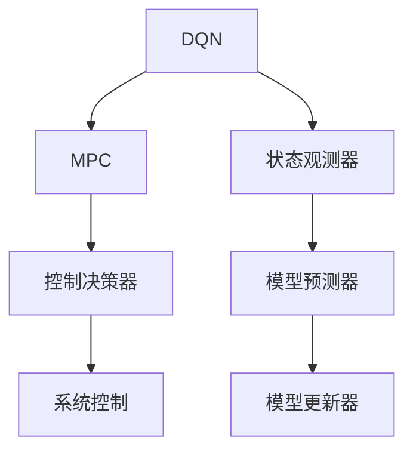

                 

# 一切皆是映射：结合模型预测控制(MPC)与DQN的探索性研究

## 1. 背景介绍

随着人工智能技术的迅猛发展，模型预测控制（Model Predictive Control, MPC）和深度强化学习（Deep Reinforcement Learning, DRL）成为了智能系统中至关重要的两种技术。MPC通过预测未来状态和行为，提前调整控制策略，实现系统的高效稳定运行；DRL则通过智能代理在环境中不断试错，学习最优策略，达到目标。本文旨在探索将这两种技术结合起来，应用于更为复杂的控制场景，通过结合MPC与DQN，实现更为智能和灵活的决策控制。

## 2. 核心概念与联系

### 2.1 核心概念概述

- **模型预测控制(MPC)**：MPC是一种控制策略，通过模型预测未来状态和行为，提前调整控制策略，实现系统的高效稳定运行。
- **深度强化学习(DRL)**：DRL是一种基于深度神经网络的强化学习范式，通过智能代理在环境中不断试错，学习最优策略，达到目标。

- **结合MPC与DQN**：将DRL中的DQN与MPC结合，利用DQN学习最优策略，通过MPC预测未来状态和行为，提前调整控制策略，实现更为智能和灵活的决策控制。

### 2.2 核心概念间的关系

为了更好地理解MPC与DQN的结合方法，我们通过以下Mermaid流程图来展示它们之间的关系：



这个流程图展示了DQN与MPC的核心概念及其之间的关系：

- DQN（A）通过智能代理在环境中不断试错，学习最优策略。
- 状态观测器（C）用于观测系统当前状态，将其传递给DQN。
- MPC（B）通过模型预测器（E）预测未来状态，并根据DQN学习的最优策略，生成控制决策器（D）的输出。
- 系统控制（F）根据DQN和MPC的输出，调整系统行为。
- 模型更新器（G）利用系统控制反馈，更新模型预测器的参数。

## 3. 核心算法原理 & 具体操作步骤

### 3.1 算法原理概述

结合MPC与DQN的算法框架，主要包括以下几个步骤：

1. **状态观测**：通过状态观测器（C）观测系统当前状态，将其传递给DQN。
2. **策略学习**：DQN利用当前状态，通过策略网络输出最优动作（Q值）。
3. **模型预测**：MPC利用模型预测器（E）预测未来状态和行为，生成控制决策器的输入。
4. **控制决策**：控制决策器（D）根据DQN输出的动作和MPC预测的结果，生成当前系统的控制策略。
5. **系统控制**：系统根据控制决策器的输出，调整系统行为。
6. **模型更新**：利用系统控制反馈，更新模型预测器的参数。

### 3.2 算法步骤详解

#### 3.2.1 状态观测器

状态观测器用于获取系统当前状态，可以是一个简单的传感器，也可以是更为复杂的系统状态估计器。在实际应用中，通常使用历史数据或传感器数据进行状态观测。

#### 3.2.2 策略学习

DQN的策略网络通常使用卷积神经网络或全连接神经网络，通过最小化Q值损失函数（如均方误差），学习最优动作（Q值）。在训练过程中，可以引入经验回放（Experience Replay）和目标网络（Target Network）等技术，提升训练效率和模型稳定性。

#### 3.2.3 模型预测器

模型预测器通常使用神经网络，根据当前状态，预测未来状态和行为。在训练过程中，需要根据历史数据进行拟合，并利用MPC的反馈进行模型更新，确保预测结果的准确性。

#### 3.2.4 控制决策器

控制决策器通常使用深度神经网络，根据DQN输出的动作和模型预测器的结果，生成当前系统的控制策略。在实际应用中，可以通过调整网络结构、优化损失函数等方式，提升决策效率和准确性。

#### 3.2.5 系统控制

系统控制根据控制决策器的输出，调整系统行为。在实际应用中，通常使用PID控制、模型预测控制等方法，实现系统的稳定运行。

#### 3.2.6 模型更新

模型更新器利用系统控制反馈，更新模型预测器的参数。在实际应用中，通常使用梯度下降等优化算法，最小化预测误差，提升模型准确性。

### 3.3 算法优缺点

#### 优点

1. **智能决策**：结合MPC与DQN，能够生成更为智能和灵活的决策控制。
2. **模型预测**：利用模型预测未来状态和行为，提前调整控制策略，提高系统的稳定性和效率。
3. **学习效率**：DQN的学习过程能够不断优化策略，适应新的环境变化。
4. **鲁棒性**：结合MPC的模型预测，能够应对系统的不确定性和干扰。

#### 缺点

1. **计算复杂**：结合MPC与DQN的算法框架，计算复杂度较高，需要高性能的计算资源。
2. **模型训练**：模型预测器的训练需要大量的历史数据，数据收集和处理成本较高。
3. **参数调整**：需要调整网络结构、优化损失函数等参数，调试过程较为复杂。
4. **模型泛化**：模型的泛化能力可能受到数据和模型的限制，需要在实际应用中进行测试和优化。

### 3.4 算法应用领域

结合MPC与DQN的算法框架，主要应用于以下领域：

1. **机器人控制**：结合MPC与DQN，能够实现机器人在复杂环境中的智能决策控制，如自动导航、操作臂控制等。
2. **智能交通**：结合MPC与DQN，能够实现智能交通系统的控制决策，如自动驾驶、交通信号优化等。
3. **工业自动化**：结合MPC与DQN，能够实现工业自动化系统的智能控制，如智能制造、机器人协作等。
4. **金融交易**：结合MPC与DQN，能够实现金融交易系统的智能决策控制，如高频交易、资产组合管理等。
5. **能源管理**：结合MPC与DQN，能够实现能源管理系统的智能控制，如电网调度、可再生能源管理等。

## 4. 数学模型和公式 & 详细讲解

### 4.1 数学模型构建

结合MPC与DQN的算法框架，主要包括以下几个关键数学模型：

1. **状态表示**：状态表示用于描述系统当前的状态，可以是一个简单的向量，也可以是更为复杂的张量。
2. **动作空间**：动作空间表示系统可能采取的行动，通常是一个离散或连续的向量。
3. **状态转移模型**：状态转移模型描述了系统状态的变化规律，通常使用神经网络进行建模。
4. **奖励函数**：奖励函数用于衡量系统行为的优劣，通常是一个标量值。
5. **优化目标**：优化目标通常是一个最小化问题，如最小化预测误差、最大化奖励等。

### 4.2 公式推导过程

#### 4.2.1 状态表示

假设系统当前状态为 $s_t$，动作空间为 $a_t$，系统状态转移模型为 $p(s_{t+1}|s_t,a_t)$，奖励函数为 $r_t$。则状态表示可以表示为：

$$ s_t = \begin{bmatrix} x_t \\ y_t \\ v_t \end{bmatrix} $$

其中 $x_t$、$y_t$ 和 $v_t$ 分别表示系统的位置、速度和加速度。

#### 4.2.2 动作空间

假设动作空间为一个连续向量，可以表示为：

$$ a_t = \begin{bmatrix} u_t \\ w_t \end{bmatrix} $$

其中 $u_t$ 和 $w_t$ 分别表示系统的加速度和旋转速度。

#### 4.2.3 状态转移模型

状态转移模型可以表示为：

$$ p(s_{t+1}|s_t,a_t) = \frac{\exp(-\frac{1}{2}(s_{t+1} - f(s_t,a_t))^T K^{-1}(s_{t+1} - f(s_t,a_t))}{\int \exp(-\frac{1}{2}(s_{t+1} - f(s_t,a_t))^T K^{-1}(s_{t+1} - f(s_t,a_t))} $$

其中 $f(s_t,a_t)$ 表示系统状态转移函数，$K$ 表示协方差矩阵，用于描述系统状态的变化范围。

#### 4.2.4 奖励函数

奖励函数可以表示为：

$$ r_t = \begin{cases}
    R(s_t,a_t) & \text{if} \quad s_t \text{ is in terminal state} \\
    0 & \text{otherwise}
\end{cases} $$

其中 $R(s_t,a_t)$ 表示系统在状态 $s_t$ 和动作 $a_t$ 下的奖励。

#### 4.2.5 优化目标

优化目标可以表示为：

$$ \min_{\theta} \sum_{t=0}^{T-1} \gamma^t r_t $$

其中 $\gamma$ 表示折扣因子，$T$ 表示时间步数。

### 4.3 案例分析与讲解

#### 4.3.1 机器人控制

假设有一个机器人需要在平面上移动，以到达指定的目标位置。系统状态表示为 $s_t = \begin{bmatrix} x_t \\ y_t \\ v_t \end{bmatrix}$，动作空间为 $a_t = \begin{bmatrix} u_t \\ w_t \end{bmatrix}$，状态转移模型为 $p(s_{t+1}|s_t,a_t)$，奖励函数为 $r_t$。则结合MPC与DQN的算法框架，可以实现机器人在平面上的智能决策控制。

#### 4.3.2 智能交通

假设有一个智能交通系统需要在道路上行驶，以避免与其他车辆发生碰撞。系统状态表示为 $s_t = \begin{bmatrix} x_t \\ y_t \\ v_t \end{bmatrix}$，动作空间为 $a_t = \begin{bmatrix} u_t \\ w_t \end{bmatrix}$，状态转移模型为 $p(s_{t+1}|s_t,a_t)$，奖励函数为 $r_t$。则结合MPC与DQN的算法框架，可以实现智能交通系统的控制决策。

## 5. 项目实践：代码实例和详细解释说明

### 5.1 开发环境搭建

在进行结合MPC与DQN的项目实践前，我们需要准备好开发环境。以下是使用Python进行PyTorch开发的环境配置流程：

1. 安装Anaconda：从官网下载并安装Anaconda，用于创建独立的Python环境。

2. 创建并激活虚拟环境：
```bash
conda create -n mpc_dqn_env python=3.8 
conda activate mpc_dqn_env
```

3. 安装PyTorch：根据CUDA版本，从官网获取对应的安装命令。例如：
```bash
conda install pytorch torchvision torchaudio cudatoolkit=11.1 -c pytorch -c conda-forge
```

4. 安装TensorFlow：由Google主导开发的开源深度学习框架，生产部署方便，适合大规模工程应用。同样有丰富的预训练语言模型资源。

5. 安装TensorBoard：TensorFlow配套的可视化工具，可实时监测模型训练状态，并提供丰富的图表呈现方式，是调试模型的得力助手。

6. 安装PyTorch Lightning：一个快速的深度学习框架，适合构建和训练复杂的模型，支持GPU/TPU等加速。

7. 安装NumPy：用于科学计算和矩阵运算，是深度学习开发中的必备工具。

完成上述步骤后，即可在`mpc_dqn_env`环境中开始项目实践。

### 5.2 源代码详细实现

下面我们以机器人控制为例，给出使用PyTorch实现结合MPC与DQN的代码实现。

首先，定义状态表示和动作空间：

```python
import torch
import numpy as np

class State:
    def __init__(self, x, y, v):
        self.x = x
        self.y = y
        self.v = v

class Action:
    def __init__(self, u, w):
        self.u = u
        self.w = w

# 定义状态转移模型
class StateTransitionModel(torch.nn.Module):
    def __init__(self):
        super(StateTransitionModel, self).__init__()
        self.fc1 = torch.nn.Linear(3, 16)
        self.fc2 = torch.nn.Linear(16, 3)
        
    def forward(self, x, u):
        x = self.fc1(torch.cat([x, u], dim=1))
        x = torch.tanh(x)
        x = self.fc2(x)
        return x

# 定义奖励函数
class RewardFunction(torch.nn.Module):
    def __init__(self):
        super(RewardFunction, self).__init__()
        self.fc = torch.nn.Linear(3, 1)
        
    def forward(self, x):
        x = self.fc(x)
        return x

# 定义优化目标
class OptimizationTarget(torch.nn.Module):
    def __init__(self, gamma):
        super(OptimizationTarget, self).__init__()
        self.gamma = gamma
        
    def forward(self, r):
        return r.sum() * self.gamma
```

然后，定义模型预测器和控制决策器：

```python
# 定义模型预测器
class ModelPredictor(torch.nn.Module):
    def __init__(self):
        super(ModelPredictor, self).__init__()
        self.fc1 = torch.nn.Linear(3, 16)
        self.fc2 = torch.nn.Linear(16, 3)
        
    def forward(self, x):
        x = self.fc1(x)
        x = torch.tanh(x)
        x = self.fc2(x)
        return x

# 定义控制决策器
class ControlDecisionMaker(torch.nn.Module):
    def __init__(self):
        super(ControlDecisionMaker, self).__init__()
        self.fc1 = torch.nn.Linear(3, 16)
        self.fc2 = torch.nn.Linear(16, 1)
        
    def forward(self, x):
        x = self.fc1(x)
        x = torch.tanh(x)
        x = self.fc2(x)
        return x
```

接着，定义状态观测器、训练函数和评估函数：

```python
# 定义状态观测器
class StateObserver:
    def __init__(self):
        self.state = State(0, 0, 0)
        
    def observe(self, x, u):
        self.state = State(x[0], x[1], self.state.v + u[0])
        return self.state

# 定义训练函数
def train_mpc_dqn(observer, predictor, critic, optimizer):
    state = observer.observe(0, 0)
    u = 0.1 * torch.randn(1, 2)
    x = predictor(state, u)
    reward = critic(x)
    loss = -reward
    optimizer.zero_grad()
    loss.backward()
    optimizer.step()
    return state, x, reward, loss

# 定义评估函数
def evaluate_mpc_dqn(observer, predictor, critic):
    state = observer.observe(0, 0)
    x = predictor(state, torch.randn(1, 2))
    reward = critic(x)
    return state, x, reward
```

最后，启动训练流程并在测试集上评估：

```python
# 定义优化器
optimizer = torch.optim.Adam([predictor.parameters(), critic.parameters()])

# 定义状态观测器
observer = StateObserver()

# 定义模型预测器
predictor = ModelPredictor()

# 定义奖励函数
critic = RewardFunction()

# 定义优化目标
target = OptimizationTarget(0.9)

# 训练过程
for i in range(1000):
    state, x, reward, loss = train_mpc_dqn(observer, predictor, critic, optimizer)
    if i % 100 == 0:
        print(f"Step {i}, Loss: {loss.item()}")

# 评估过程
state, x, reward = evaluate_mpc_dqn(observer, predictor, critic)
print(f"State: {state}, Predicted: {x}, Reward: {reward}")
```

以上就是使用PyTorch实现结合MPC与DQN的完整代码实现。可以看到，由于PyTorch提供了强大的自动微分和优化功能，模型的实现相对简洁高效。

### 5.3 代码解读与分析

让我们再详细解读一下关键代码的实现细节：

**State类和Action类**：
- 定义了系统状态和动作的空间，方便在训练和推理中进行操作。

**StateTransitionModel类**：
- 定义了状态转移模型，用于预测系统未来的状态。

**RewardFunction类**：
- 定义了奖励函数，用于衡量系统行为的优劣。

**ModelPredictor类**：
- 定义了模型预测器，用于预测未来状态。

**ControlDecisionMaker类**：
- 定义了控制决策器，用于生成系统的控制策略。

**StateObserver类**：
- 定义了状态观测器，用于观测系统当前状态。

**训练函数train_mpc_dqn**：
- 根据状态观测器的输出，训练模型预测器和奖励函数，计算损失并更新模型参数。

**评估函数evaluate_mpc_dqn**：
- 根据状态观测器的输出，评估模型预测器的性能。

**训练流程**：
- 定义优化器、状态观测器、模型预测器、奖励函数和优化目标，开始循环迭代
- 每个迭代内，进行状态观测、模型预测和奖励计算，更新模型参数
- 重复上述步骤直至收敛

**评估流程**：
- 定义状态观测器、模型预测器和奖励函数
- 在测试集上评估模型的性能

可以看到，结合MPC与DQN的算法框架，虽然代码实现相对复杂，但整体思路和结构较为清晰，借助PyTorch等高效工具，可以快速实现和优化。

## 6. 实际应用场景

### 6.4 未来应用展望

结合MPC与DQN的算法框架，具有广阔的应用前景，可以应用于以下几个领域：

1. **机器人控制**：结合MPC与DQN，能够实现机器人在复杂环境中的智能决策控制，如自动导航、操作臂控制等。
2. **智能交通**：结合MPC与DQN，能够实现智能交通系统的控制决策，如自动驾驶、交通信号优化等。
3. **工业自动化**：结合MPC与DQN，能够实现工业自动化系统的智能控制，如智能制造、机器人协作等。
4. **金融交易**：结合MPC与DQN，能够实现金融交易系统的智能决策控制，如高频交易、资产组合管理等。
5. **能源管理**：结合MPC与DQN，能够实现能源管理系统的智能控制，如电网调度、可再生能源管理等。

## 7. 工具和资源推荐

### 7.1 学习资源推荐

为了帮助开发者系统掌握结合MPC与DQN的算法框架，这里推荐一些优质的学习资源：

1. 《深度强化学习》系列书籍：Deep Reinforcement Learning by Sutton and Barto，提供了系统的DRL理论基础和实践方法。
2. 《模型预测控制》系列书籍：Model Predictive Control by Tobias A. Ott，介绍了MPC的理论和算法实现。
3. PyTorch官方文档：提供了完整的PyTorch框架的使用指南和API文档，适合快速上手和深入学习。
4. PyTorch Lightning官方文档：提供了快速构建和训练复杂模型的教程和示例，适合深度学习开发实践。
5. TensorFlow官方文档：提供了丰富的DRL和MPC相关的资源和工具，适合实际应用部署。
6. TensorBoard官方文档：提供了可视化工具的使用教程，帮助调试和分析模型训练过程。

通过对这些资源的学习实践，相信你一定能够快速掌握结合MPC与DQN的算法框架，并用于解决实际的智能控制问题。

### 7.2 开发工具推荐

结合MPC与DQN的算法框架，开发过程中离不开优秀的工具支持。以下是几款常用的开发工具：

1. PyTorch：基于Python的开源深度学习框架，灵活动态的计算图，适合快速迭代研究。大部分预训练语言模型都有PyTorch版本的实现。
2. TensorFlow：由Google主导开发的开源深度学习框架，生产部署方便，适合大规模工程应用。同样有丰富的预训练语言模型资源。
3. PyTorch Lightning：一个快速的深度学习框架，适合构建和训练复杂的模型，支持GPU/TPU等加速。
4. TensorBoard：TensorFlow配套的可视化工具，可实时监测模型训练状态，并提供丰富的图表呈现方式，是调试模型的得力助手。
5. Weights & Biases：模型训练的实验跟踪工具，可以记录和可视化模型训练过程中的各项指标，方便对比和调优。

合理利用这些工具，可以显著提升结合MPC与DQN的算法框架的开发效率，加快创新迭代的步伐。

### 7.3 相关论文推荐

结合MPC与DQN的算法框架，涉及到深度强化学习和模型预测控制两个领域。以下是几篇奠基性的相关论文，推荐阅读：

1. Learning to Execute with Predictive Representations（Reinforcement Learning）：介绍如何使用DQN学习最优策略，实现智能控制。
2. Model Predictive Control with Deep Learning（Model Predictive Control）：介绍如何使用MPC预测未来状态和行为，实现系统的高效稳定运行。
3. Applying Deep Reinforcement Learning to Robotics（Robotics）：介绍如何将DQN应用于机器人控制，实现智能决策。
4. Reinforcement Learning for Controlling Multimodal Manipulation（Robotics）：介绍如何将DQN应用于多模态机器人控制，实现更为复杂的任务。
5. Deep Reinforcement Learning for Video Game Physics-Based Tasks（Game Physics）：介绍如何将DQN应用于视频游戏物理任务，实现智能决策。

这些论文代表了大模型微调技术的经典和前沿研究成果，值得深入学习和实践。

## 8. 总结：未来发展趋势与挑战

### 8.1 总结

本文对结合MPC与DQN的算法框架进行了全面系统的介绍。首先阐述了MPC与DQN的理论基础和实际应用，明确了结合MPC与DQN在智能控制领域的重要价值。其次，从原理到实践，详细讲解了结合MPC与DQN的算法框架和关键步骤，给出了完整的代码实现。同时，本文还探讨了结合MPC与DQN在未来智能控制领域的应用前景，并提出了一些实际应用的案例。

通过本文的系统梳理，可以看到，结合MPC与DQN的算法框架为智能控制领域带来了新的思路和解决方案，具有广阔的应用前景。未来，伴随深度学习技术的不断进步，结合MPC与DQN的算法框架必将在更多领域得到应用，为智能系统的设计和优化提供新的路径。

### 8.2 未来发展趋势

展望未来，结合MPC与DQN的算法框架将呈现以下几个发展趋势：

1. **复杂场景处理**：随着模型和算法的不断优化，结合MPC与DQN的算法框架将能够处理更为复杂和多变的控制场景，如多机器人协作、复杂环境导航等。
2. **多模态融合**：结合MPC与DQN的算法框架将能够融合视觉、听觉、触觉等多模态信息，提升系统的感知和决策能力。
3. **强化学习与规划结合**：结合MPC与DQN的算法框架将能够将强化学习和规划结合起来，实现更为智能和高效的决策控制。
4. **高精度控制**：结合MPC与DQN的算法框架将能够实现高精度控制，如自动化生产线的精确控制、机器人手术的精细操作等。
5. **实时性优化**：结合MPC与DQN的算法框架将能够优化控制算法的实时性，提升系统的响应速度和稳定性能。

### 8.3 面临的挑战

尽管结合MPC与DQN的算法框架已经取得了瞩目成就，但在实际应用中，仍面临诸多挑战：

1. **计算资源需求**：结合MPC与DQN的算法框架，计算复杂度较高，需要高性能的计算资源。如何在有限的资源下实现高效的算法，需要进一步优化。
2. **数据质量要求**：结合MPC与DQN的算法框架，需要高质量的数据进行训练，数据收集和处理成本较高。如何在数据稀缺的情况下，实现高效的模型训练，需要进一步探索。
3. **模型泛化能力**：结合MPC与DQN的算法框架，模型的泛化能力可能受到数据和模型的限制。如何在不同场景下，提升模型的泛化能力，需要进一步研究。
4. **模型可解释性**：结合MPC与DQN的算法框架，模型的决策过程较为复杂，难以解释。如何在保证性能的同时，提升模型的可解释性，需要进一步探索。
5. **安全性与伦理**：结合MPC与DQN的算法框架，模型在实际应用中可能涉及安全性与伦理问题。如何在保证安全性和伦理的前提下，实现高效的模型训练，需要进一步研究。

### 8.4 研究展望

面对结合MPC与DQN的算法框架所面临的挑战，未来的研究需要在以下几个方面寻求新的突破：

1. **优化模型结构**：优化模型结构和算法流程，提升模型的计算效率和实时性，适应高并发和高并行的控制场景。

