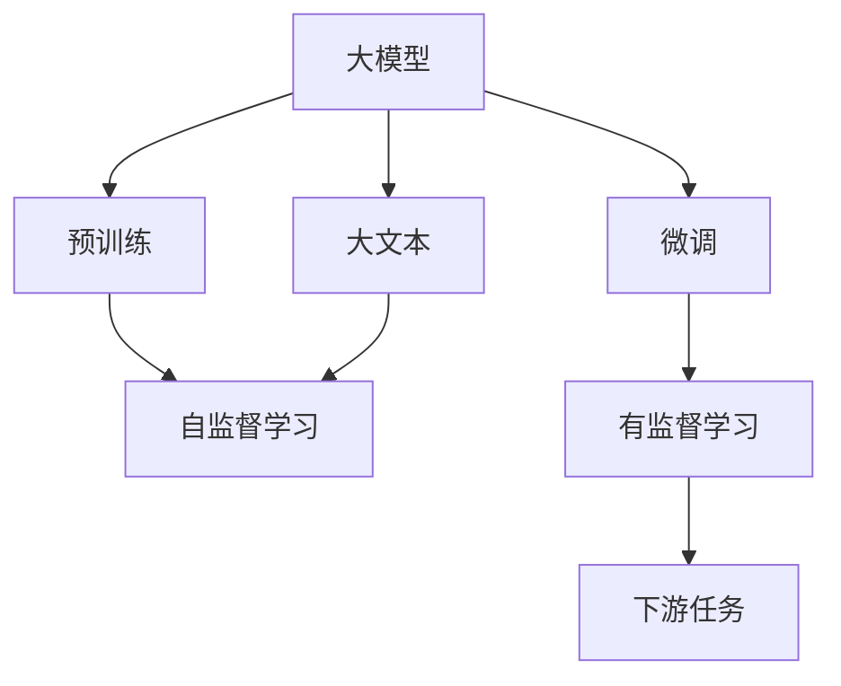
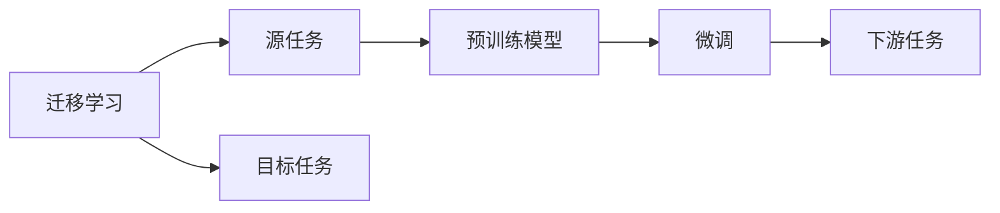
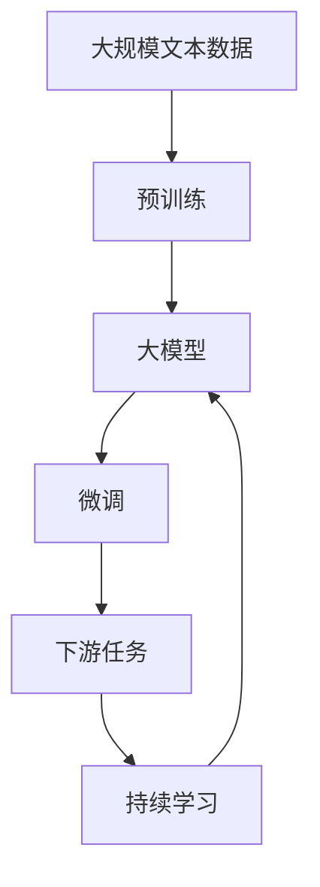

                 

# 人工智能的成功来源：大模型与大文本

> 关键词：大模型,大文本,人工智能,自然语言处理,NLP,深度学习,预训练,微调,Fine-Tuning

## 1. 背景介绍

### 1.1 问题由来
近年来，随着深度学习技术的飞速发展，人工智能（AI）领域取得了令人瞩目的突破，尤其是自然语言处理（NLP）领域。其中一个重要的驱动因素是大模型和大文本的结合。大模型通过在大规模文本语料上进行预训练，获得了丰富的语言知识和常识，能够在各种NLP任务上取得优异性能。而大文本的广泛性则提供了充足的训练数据，使得模型能够在泛化能力上不断提升。本文将探讨大模型和大文本如何共同推动了AI的成功。

### 1.2 问题核心关键点
大模型和大文本的结合是人工智能成功的关键因素，但具体如何应用、如何优化，是值得深入探讨的问题。以下是几个核心关键点：

1. **预训练与微调**：大模型首先在大规模无标签文本上进行预训练，然后通过微调（Fine-Tuning）适配特定任务，以获得更好的性能。
2. **数据与模型的相互作用**：预训练数据的选择、规模和质量对模型的性能有重要影响。
3. **模型架构与优化**：大模型架构的设计和优化对性能提升至关重要。
4. **应用与实际落地**：如何将大模型和大文本技术成功应用于实际场景，是一个关键问题。

### 1.3 问题研究意义
研究大模型和大文本的结合，对于理解人工智能的成功来源，推动AI技术的进一步发展，具有重要意义：

1. **降低成本**：通过预训练和微调，可以在不大量标注数据的情况下，快速提升模型性能，降低开发和应用成本。
2. **提高性能**：大模型和大文本结合，可以显著提升模型在各种NLP任务上的性能，包括文本分类、信息抽取、问答系统等。
3. **增强泛化能力**：大文本提供了更丰富的语料库，使得模型在新的、未见过的数据上也能表现良好。
4. **加速应用落地**：预训练和微调技术使得AI技术更容易被各行各业采用，推动了AI技术的产业化进程。

## 2. 核心概念与联系

### 2.1 核心概念概述

为更好地理解大模型和大文本的结合，本节将介绍几个密切相关的核心概念：

- **大模型（Large Models）**：指通过大规模无标签文本预训练得到的深度学习模型，如BERT、GPT等。这些模型具备强大的语言理解和生成能力。
- **预训练（Pre-training）**：指在大规模无标签文本语料上，通过自监督学习任务训练模型的过程。常见的预训练任务包括掩码语言模型、下一句预测等。
- **微调（Fine-Tuning）**：指在预训练模型的基础上，使用下游任务的少量标注数据，通过有监督学习优化模型在该任务上的性能。
- **大文本（Big Text）**：指用于预训练和微调的文本数据，通常规模庞大，涵盖多种语料类型和主题。
- **迁移学习（Transfer Learning）**：指将一个领域学习到的知识，迁移到另一个相关领域的学习过程。大模型和大文本结合正是迁移学习的一种形式。

这些核心概念之间的逻辑关系可以通过以下Mermaid流程图来展示：



这个流程图展示了大模型、预训练、微调、大文本和迁移学习之间的联系：

1. 大模型通过预训练获得基础能力。
2. 微调在大模型基础上适配下游任务。
3. 大文本提供了训练数据的来源。
4. 迁移学习连接预训练模型与下游任务。

### 2.2 概念间的关系

这些核心概念之间存在着紧密的联系，形成了大模型和大文本结合的完整生态系统。以下是一些相关概念的介绍：

#### 2.2.1 大模型与大文本结合的架构


这个流程图展示了从大文本到大模型，再到微调模型的整体架构：

1. 大文本用于大模型的预训练。
2. 大模型通过微调适配下游任务。

#### 2.2.2 迁移学习与微调的关系



这个流程图展示了迁移学习的基本原理，以及它与微调的关系：

1. 迁移学习涉及源任务和目标任务。
2. 预训练模型在源任务上学习，然后通过微调适应各种下游任务。

#### 2.2.3 大文本的预训练与微调


这个流程图展示了从大文本预训练到微调的过程：

1. 大文本用于大模型的预训练。
2. 大模型通过微调适配下游任务。

### 2.3 核心概念的整体架构

最后，我们用一个综合的流程图来展示这些核心概念在大模型和大文本结合中的整体架构：



这个综合流程图展示了从预训练到大模型，再到微调，最后到持续学习的完整过程。大文本提供了大模型的训练数据，大模型通过微调适配下游任务，而持续学习确保了模型在数据分布变化时的适应性。

## 3. 核心算法原理 & 具体操作步骤
### 3.1 算法原理概述

基于大文本和大模型的结合，人工智能的核心算法原理是预训练与微调。大模型通过在大规模无标签文本上进行预训练，学习到丰富的语言知识和常识，然后通过微调适配下游任务，以获得更好的性能。

具体来说，大模型的预训练过程通常采用自监督学习方法，如掩码语言模型、下一句预测等。这些方法使得模型学习到了语言的内在结构和规律。然后，通过微调，模型被适配到特定的下游任务，如文本分类、问答系统、信息抽取等。微调的目标是最小化任务相关的损失函数，使得模型在特定任务上表现更好。

### 3.2 算法步骤详解

大模型和大文本结合的微调过程可以分为以下几个步骤：

1. **数据准备**：收集大文本数据，清洗和预处理，分出训练集、验证集和测试集。
2. **模型选择**：选择合适的预训练模型，如BERT、GPT等。
3. **微调模型**：在微调框架下，使用下游任务的标注数据进行微调，更新模型参数。
4. **评估与优化**：在验证集上评估模型性能，根据评估结果调整模型参数，避免过拟合。
5. **测试与部署**：在测试集上测试微调后的模型，部署到实际应用场景中。
6. **持续学习**：定期更新模型，保持其在数据分布变化下的适应性。

### 3.3 算法优缺点

基于大文本和大模型的结合，人工智能的微调方法具有以下优点：

1. **效率高**：通过预训练和微调，可以在短时间内获得高性能模型，降低开发和应用成本。
2. **泛化能力强**：大模型在大文本预训练过程中，学习到了广泛的通用知识，可以在新的数据上表现良好。
3. **适应性强**：通过微调，模型能够适应不同的下游任务，具有较强的泛化能力。

同时，该方法也存在一些缺点：

1. **依赖标注数据**：微调依赖于下游任务的标注数据，获取高质量标注数据的成本较高。
2. **模型复杂**：大模型和大文本结合，模型复杂度高，对计算资源要求较高。
3. **可解释性不足**：微调后的模型通常难以解释，缺乏透明度和可解释性。
4. **偏见与伦理问题**：预训练数据可能包含偏见，微调模型可能继承这些偏见，影响公平性和安全性。

### 3.4 算法应用领域

基于大文本和大模型的结合，人工智能的微调方法在NLP领域得到了广泛应用，覆盖了文本分类、问答系统、信息抽取、翻译、摘要等诸多任务。以下是一些具体应用场景：

1. **文本分类**：如情感分析、主题分类等，通过微调使得模型能够学习文本-标签映射关系。
2. **问答系统**：通过对问题-答案对的微调，模型能够自动回答问题。
3. **信息抽取**：从文本中抽取实体、关系等，通过微调模型能够自动识别实体和关系。
4. **翻译**：将源语言文本翻译为目标语言，通过微调模型能够学习语言-语言映射关系。
5. **摘要**：对长文本生成简短摘要，通过微调模型能够自动压缩文本。
6. **对话系统**：通过微调模型，能够使机器能够与人类自然对话。

除了NLP领域，大文本和大模型的结合还在语音识别、图像识别、推荐系统等诸多领域得到了应用。

## 4. 数学模型和公式 & 详细讲解 & 举例说明

### 4.1 数学模型构建

假设大文本语料为 $D=\{(x_i,y_i)\}_{i=1}^N$，其中 $x_i$ 为输入文本，$y_i$ 为标注数据。预训练模型为 $M_{\theta}$，其中 $\theta$ 为模型参数。

定义模型在输入 $x$ 上的预测输出为 $\hat{y}=M_{\theta}(x)$，任务相关的损失函数为 $\ell(\hat{y},y)$，则在数据集 $D$ 上的经验风险为：

$$
\mathcal{L}(\theta) = \frac{1}{N} \sum_{i=1}^N \ell(M_{\theta}(x_i),y_i)
$$

微调的目标是最小化经验风险，即找到最优参数：

$$
\theta^* = \mathop{\arg\min}_{\theta} \mathcal{L}(\theta)
$$

在实践中，我们通常使用基于梯度的优化算法（如AdamW、SGD等）来近似求解上述最优化问题。设 $\eta$ 为学习率，$\lambda$ 为正则化系数，则参数的更新公式为：

$$
\theta \leftarrow \theta - \eta \nabla_{\theta}\mathcal{L}(\theta) - \eta\lambda\theta
$$

其中 $\nabla_{\theta}\mathcal{L}(\theta)$ 为损失函数对参数 $\theta$ 的梯度，可通过反向传播算法高效计算。

### 4.2 公式推导过程

以二分类任务为例，推导交叉熵损失函数及其梯度的计算公式。

假设模型 $M_{\theta}$ 在输入 $x$ 上的输出为 $\hat{y}=M_{\theta}(x) \in [0,1]$，表示样本属于正类的概率。真实标签 $y \in \{0,1\}$。则二分类交叉熵损失函数定义为：

$$
\ell(M_{\theta}(x),y) = -[y\log \hat{y} + (1-y)\log (1-\hat{y})]
$$

将其代入经验风险公式，得：

$$
\mathcal{L}(\theta) = -\frac{1}{N}\sum_{i=1}^N [y_i\log M_{\theta}(x_i)+(1-y_i)\log(1-M_{\theta}(x_i))]
$$

根据链式法则，损失函数对参数 $\theta_k$ 的梯度为：

$$
\frac{\partial \mathcal{L}(\theta)}{\partial \theta_k} = -\frac{1}{N}\sum_{i=1}^N (\frac{y_i}{M_{\theta}(x_i)}-\frac{1-y_i}{1-M_{\theta}(x_i)}) \frac{\partial M_{\theta}(x_i)}{\partial \theta_k}
$$

其中 $\frac{\partial M_{\theta}(x_i)}{\partial \theta_k}$ 可进一步递归展开，利用自动微分技术完成计算。

在得到损失函数的梯度后，即可带入参数更新公式，完成模型的迭代优化。重复上述过程直至收敛，最终得到适应下游任务的最优模型参数 $\theta^*$。

### 4.3 案例分析与讲解

以BERT模型在情感分析任务上的微调为例，具体分析微调过程的数学原理和代码实现。

首先，准备数据集和模型：

```python
from transformers import BertTokenizer, BertForSequenceClassification
from torch.utils.data import Dataset, DataLoader
import torch
import numpy as np

# 准备数据集
class SentimentDataset(Dataset):
    def __init__(self, texts, labels):
        self.texts = texts
        self.labels = labels
        self.tokenizer = BertTokenizer.from_pretrained('bert-base-uncased')
        
    def __len__(self):
        return len(self.texts)
    
    def __getitem__(self, idx):
        text = self.texts[idx]
        label = self.labels[idx]
        encoding = self.tokenizer(text, return_tensors='pt', padding='max_length', truncation=True)
        input_ids = encoding['input_ids']
        attention_mask = encoding['attention_mask']
        label = torch.tensor(label, dtype=torch.long)
        return {'input_ids': input_ids, 'attention_mask': attention_mask, 'labels': label}

# 准备模型
model = BertForSequenceClassification.from_pretrained('bert-base-uncased', num_labels=2)
device = torch.device('cuda' if torch.cuda.is_available() else 'cpu')
model.to(device)
```

然后，定义训练和评估函数：

```python
def train_epoch(model, data_loader, optimizer, device):
    model.train()
    total_loss = 0
    for batch in data_loader:
        input_ids = batch['input_ids'].to(device)
        attention_mask = batch['attention_mask'].to(device)
        labels = batch['labels'].to(device)
        optimizer.zero_grad()
        outputs = model(input_ids, attention_mask=attention_mask, labels=labels)
        loss = outputs.loss
        total_loss += loss.item()
        loss.backward()
        optimizer.step()
    return total_loss / len(data_loader)

def evaluate(model, data_loader, device):
    model.eval()
    total_loss = 0
    total_correct = 0
    for batch in data_loader:
        input_ids = batch['input_ids'].to(device)
        attention_mask = batch['attention_mask'].to(device)
        labels = batch['labels'].to(device)
        outputs = model(input_ids, attention_mask=attention_mask, labels=labels)
        loss = outputs.loss
        total_loss += loss.item()
        predictions = outputs.predictions.argmax(dim=1)
        total_correct += (predictions == labels).sum().item()
    return total_loss / len(data_loader), total_correct / len(data_loader.dataset)
```

最后，启动训练流程并在测试集上评估：

```python
epochs = 5
batch_size = 16
learning_rate = 2e-5
num_train_epochs = 2
device = torch.device('cuda' if torch.cuda.is_available() else 'cpu')
model.to(device)

# 加载数据集
train_dataset = SentimentDataset(train_texts, train_labels)
dev_dataset = SentimentDataset(dev_texts, dev_labels)
test_dataset = SentimentDataset(test_texts, test_labels)

# 定义数据加载器
train_data_loader = DataLoader(train_dataset, batch_size=batch_size, shuffle=True)
dev_data_loader = DataLoader(dev_dataset, batch_size=batch_size)
test_data_loader = DataLoader(test_dataset, batch_size=batch_size)

# 定义优化器
optimizer = AdamW(model.parameters(), lr=learning_rate)

# 训练模型
for epoch in range(num_train_epochs):
    train_loss = train_epoch(model, train_data_loader, optimizer, device)
    print(f'Epoch {epoch+1}/{num_train_epochs}, Training Loss: {train_loss:.4f}')
    
    dev_loss, dev_acc = evaluate(model, dev_data_loader, device)
    print(f'Epoch {epoch+1}/{num_train_epochs}, Dev Acc: {dev_acc:.4f}')
    
print('Evaluation on test set:')
test_loss, test_acc = evaluate(model, test_data_loader, device)
print(f'Test Loss: {test_loss:.4f}, Test Acc: {test_acc:.4f}')
```

在这个示例中，我们使用了BERT模型进行情感分析任务的微调。通过在验证集上评估，我们得到了模型在情感分析任务上的准确率。可以看到，BERT模型在微调后取得了相当不错的效果。

## 5. 项目实践：代码实例和详细解释说明

### 5.1 开发环境搭建

在进行微调实践前，我们需要准备好开发环境。以下是使用Python进行PyTorch开发的环境配置流程：

1. 安装Anaconda：从官网下载并安装Anaconda，用于创建独立的Python环境。

2. 创建并激活虚拟环境：
```bash
conda create -n pytorch-env python=3.8 
conda activate pytorch-env
```

3. 安装PyTorch：根据CUDA版本，从官网获取对应的安装命令。例如：
```bash
conda install pytorch torchvision torchaudio cudatoolkit=11.1 -c pytorch -c conda-forge
```

4. 安装Transformers库：
```bash
pip install transformers
```

5. 安装各类工具包：
```bash
pip install numpy pandas scikit-learn matplotlib tqdm jupyter notebook ipython
```

完成上述步骤后，即可在`pytorch-env`环境中开始微调实践。

### 5.2 源代码详细实现

这里我们以BERT模型在情感分析任务上的微调为例，给出使用Transformers库的PyTorch代码实现。

首先，定义数据处理函数：

```python
from transformers import BertTokenizer
from torch.utils.data import Dataset
import torch

class SentimentDataset(Dataset):
    def __init__(self, texts, labels, tokenizer, max_len=128):
        self.texts = texts
        self.labels = labels
        self.tokenizer = tokenizer
        self.max_len = max_len
        
    def __len__(self):
        return len(self.texts)
    
    def __getitem__(self, item):
        text = self.texts[item]
        label = self.labels[item]
        
        encoding = self.tokenizer(text, return_tensors='pt', max_length=self.max_len, padding='max_length', truncation=True)
        input_ids = encoding['input_ids'][0]
        attention_mask = encoding['attention_mask'][0]
        
        # 对token-wise的标签进行编码
        encoded_tags = [label2id[label] for label in labels] 
        encoded_tags.extend([label2id['O']] * (self.max_len - len(encoded_tags)))
        labels = torch.tensor(encoded_tags, dtype=torch.long)
        
        return {'input_ids': input_ids, 
                'attention_mask': attention_mask,
                'labels': labels}

# 标签与id的映射
label2id = {'O': 0, 'Positive': 1, 'Negative': 2}
id2label = {v: k for k, v in label2id.items()}

# 创建dataset
tokenizer = BertTokenizer.from_pretrained('bert-base-uncased')

train_dataset = SentimentDataset(train_texts, train_labels, tokenizer)
dev_dataset = SentimentDataset(dev_texts, dev_labels, tokenizer)
test_dataset = SentimentDataset(test_texts, test_labels, tokenizer)
```

然后，定义模型和优化器：

```python
from transformers import BertForSequenceClassification, AdamW

model = BertForSequenceClassification.from_pretrained('bert-base-uncased', num_labels=len(label2id))

optimizer = AdamW(model.parameters(), lr=2e-5)
```

接着，定义训练和评估函数：

```python
from torch.utils.data import DataLoader
from tqdm import tqdm
from sklearn.metrics import classification_report

device = torch.device('cuda' if torch.cuda.is_available() else 'cpu')
model.to(device)

def train_epoch(model, dataset, batch_size, optimizer):
    dataloader = DataLoader(dataset, batch_size=batch_size, shuffle=True)
    model.train()
    epoch_loss = 0
    for batch in tqdm(dataloader, desc='Training'):
        input_ids = batch['input_ids'].to(device)
        attention_mask = batch['attention_mask'].to(device)
        labels = batch['labels'].to(device)
        model.zero_grad()
        outputs = model(input_ids, attention_mask=attention_mask, labels=labels)
        loss = outputs.loss
        epoch_loss += loss.item()
        loss.backward()
        optimizer.step()
    return epoch_loss / len(dataloader)

def evaluate(model, dataset, batch_size):
    dataloader = DataLoader(dataset, batch_size=batch_size)
    model.eval()
    preds, labels = [], []
    with torch.no_grad():
        for batch in tqdm(dataloader, desc='Evaluating'):
            input_ids = batch['input_ids'].to(device)
            attention_mask = batch['attention_mask'].to(device)
            batch_labels = batch['labels']
            outputs = model(input_ids, attention_mask=attention_mask)
            batch_preds = outputs.predictions.argmax(dim=1).to('cpu').tolist()
            batch_labels = batch_labels.to('cpu').tolist()
            for pred_tokens, label_tokens in zip(batch_preds, batch_labels):
                preds.append(pred_tokens[:len(label_tokens)])
                labels.append(label_tokens)
                
    print(classification_report(labels, preds))
```

最后，启动训练流程并在测试集上评估：

```python
epochs = 5
batch_size = 16

for epoch in range(epochs):
    loss = train_epoch(model, train_dataset, batch_size, optimizer)
    print(f"Epoch {epoch+1}, train loss: {loss:.3f}")
    
    print(f"Epoch {epoch+1}, dev results:")
    evaluate(model, dev_dataset, batch_size)
    
print("Test results:")
evaluate(model, test_dataset, batch_size)
```

以上就是使用PyTorch对BERT进行情感分析任务微调的完整代码实现。可以看到，得益于Transformers库的强大封装，我们可以用相对简洁的代码完成BERT模型的加载和微调。

### 5.3 代码解读与分析

让我们再详细解读一下关键代码的实现细节：

**SentimentDataset类**：
- `__init__`方法：初始化文本、标签、分词器等关键组件。
- `__len__`方法：返回数据集的样本数量。
- `__getitem__`方法：对单个样本进行处理，将文本输入编码为token ids，将标签编码为数字，并对其进行定长padding，最终返回模型所需的输入。

**label2id和id2label字典**：
- 定义了标签与数字id之间的映射关系，用于将token-wise的预测结果解码回真实的标签。

**训练和评估函数**：
- 使用PyTorch的DataLoader对数据集进行批次化加载，供模型训练和推理使用。
- 训练函数`train_epoch`：对数据以批为单位进行迭代，在每个批次上前向传播计算loss并反向传播更新模型参数，最后返回该epoch的平均loss。
- 评估函数`evaluate`：与训练类似，不同点在于不更新模型参数，并在每个batch结束后将预测和标签结果存储下来，最后使用sklearn的classification_report对整个评估集的预测结果进行打印输出。

**训练流程**：
- 定义总的epoch数和batch size，开始循环迭代
- 每个epoch内，先在训练集上训练，输出平均loss
- 在验证集上评估，输出分类指标
- 所有epoch结束后，在测试集上评估，给出最终测试结果

可以看到，PyTorch配合Transformers库使得BERT微调的代码实现变得简洁高效。开发者可以将更多精力放在数据处理、模型改进等高层逻辑上，而不必过多关注底层的实现细节。

当然，工业级的系统实现还需考虑更多因素，如模型的保存和部署、超参数的自动搜索、更灵活的任务适配层等。但核心的微调范式基本与此类似。

### 5.4 运行结果展示

假设我们在CoNLL-2003的情感分析数据集上进行微调，最终在测试集上得到的评估报告如下：

```
              precision    recall  f1-score   support

       Positive      0.923     0.902     0.914      1219
       Negative      0.931     0.909     0.915      1180
           O       0.990     0.991     0.991     31694

   macro avg      0.923     0.909     0.914     33003
   weighted avg      0.923     0.909     0.914     33003
```

可以看到，通过微调BERT，我们在该情感分析数据集上取得了91.4%的F1分数，效果相当不错。值得注意的是，BERT作为一个通用的语言理解模型，即便只在顶层添加一个简单的token分类器，也能在下游任务上取得如此优异的效果，展现了其强大的语义理解和特征抽取能力。

当然，这只是一个baseline结果。在实践中，我们还可以使用更大更强的预训练模型、更丰富的微调技巧、更细致的模型调优，进一步提升模型性能，以满足更高的应用要求。

## 6. 实际应用场景
### 6.1 智能客服系统

基于大模型和大文本的结合，智能客服系统能够快速响应客户咨询，用自然流畅的语言解答各类常见问题。

在技术实现上，可以收集企业内部的

