                 

# 以提示/指令模式直接使用大模型

> 关键词：大模型,提示/指令模式,自然语言处理(NLP),Prompt工程,Prompt Tuning,大语言模型微调

## 1. 背景介绍

### 1.1 问题由来
近年来，随着深度学习技术的发展，大语言模型（Large Language Models, LLMs）在自然语言处理（NLP）领域取得了巨大进展。这些模型通过在大规模无标签文本数据上进行预训练，学习到了丰富的语言知识和常识，能够执行各种复杂的语言任务。然而，直接使用预训练的大模型在特定任务上往往无法取得最佳效果，需要通过微调（Fine-Tuning）来优化模型的性能。

### 1.2 问题核心关键点
微调是通过将预训练模型作为初始化参数，使用下游任务的少量标注数据进行有监督学习，优化模型在特定任务上的性能。这种方法虽然简单高效，但存在以下问题：
- 依赖标注数据：微调的效果很大程度上取决于标注数据的质量和数量，标注数据的获取成本较高。
- 迁移能力有限：当目标任务与预训练数据的分布差异较大时，微调的性能提升有限。
- 负面效果传递：预训练模型的固有偏见、有害信息等，可能通过微调传递到下游任务，造成负面影响。
- 可解释性不足：微调模型的决策过程缺乏可解释性，难以对其推理逻辑进行分析和调试。

为了解决这些问题，近年来出现了基于提示/指令模式直接使用大模型的技术，即Prompt Engineering。

### 1.3 问题研究意义
Prompt Engineering通过精心设计输入文本的格式，引导大语言模型进行特定任务的推理和生成，可以在不更新模型参数的情况下，实现零样本或少样本学习。这种方法具有以下优势：
- 零样本学习：模型不需要任何标注数据即可进行任务推理。
- 少样本学习：在只有少量示例的情况下，模型仍能快速适应新任务。
- 参数高效：不增加模型参数量，减轻了预训练模型的高成本。
- 可解释性：可以通过对提示模板进行设计，提高模型的可解释性。
- 灵活性：对于新任务，可以通过简单的提示设计快速进行模型适配。

Prompt Engineering技术在NLP领域已经得到了广泛的应用，特别是在问答、对话、摘要、翻译、情感分析等任务中取得了显著效果，成为NLP技术落地应用的重要手段。

## 2. 核心概念与联系

### 2.1 核心概念概述

为更好地理解Prompt Engineering技术，本节将介绍几个密切相关的核心概念：

- **大语言模型（LLMs）**：以自回归模型（如GPT）或自编码模型（如BERT）为代表的预训练语言模型，通过在大规模无标签文本数据上进行预训练，学习通用的语言表示，具备强大的语言理解和生成能力。
- **预训练（Pre-training）**：指在大规模无标签文本语料上，通过自监督学习任务训练通用语言模型的过程。预训练使得模型学习到语言的通用表示。
- **提示（Prompt）**：在输入文本中添加特定的提示模板，引导大语言模型进行特定任务的推理和生成。
- **提示/指令模式（Prompt/Instruction Mode）**：通过设计提示模板，直接使用预训练语言模型进行特定任务的推理和生成，无需进行额外的微调。
- **提示微调（Prompt Tuning）**：针对特定任务，对预训练语言模型进行少量参数的微调，以进一步优化模型的表现。
- **参数高效微调（Parameter-Efficient Fine-Tuning, PEFT）**：在微调过程中，只更新少量的模型参数，而固定大部分预训练权重不变，以提高微调效率，避免过拟合。
- **零样本学习（Zero-shot Learning）**：模型在没有见过任何特定任务的训练样本的情况下，仅凭任务描述就能够执行新任务。
- **少样本学习（Few-shot Learning）**：在只有少量标注样本的情况下，模型能够快速适应新任务的学习方法。
- **多模态学习（Multi-modal Learning）**：将视觉、听觉、文本等多种模态信息进行融合，提升模型的理解能力和表现效果。

这些核心概念之间的逻辑关系可以通过以下Mermaid流程图来展示：


这个流程图展示了大语言模型的核心概念及其之间的关系：

1. 大语言模型通过预训练获得基础能力。
2. 提示/指令模式可以直接使用预训练模型进行特定任务的推理和生成。
3. 零样本和少样本学习可以在不增加模型参数的情况下，提升模型的泛化能力。
4. 参数高效微调在微调过程中只更新少量参数，以提高微调效率。
5. 多模态学习将多种模态信息进行融合，提升模型的表现效果。

这些核心概念共同构成了大语言模型的学习和应用框架，使其能够在各种场景下发挥强大的语言理解和生成能力。通过理解这些核心概念，我们可以更好地把握大语言模型的工作原理和优化方向。

### 2.2 概念间的关系

这些核心概念之间存在着紧密的联系，形成了大语言模型的学习和应用生态系统。下面我通过几个Mermaid流程图来展示这些概念之间的关系。

#### 2.2.1 大语言模型的学习范式


这个流程图展示了大语言模型的三种主要学习范式：预训练、提示/指令模式、提示微调。提示/指令模式可以直接使用预训练模型进行特定任务的推理和生成，而提示微调则是在提示模式的基础上，对模型进行少量参数的微调，以进一步提升性能。

#### 2.2.2 多模态学习与提示/指令模式的关系

```mermaid
graph LR
    A[多模态学习] --> B[视觉]
    A --> C[听觉]
    A --> D[文本]
    B --> E[多模态表示]
    C --> E
    D --> E
    E --> F[多模态推理]
    F --> G[下游任务]
```



这个流程图展示了多模态学习的基本原理，以及其与提示/指令模式的关系。多模态学习将视觉、听觉、文本等多种模态信息进行融合，提升模型的理解能力和表现效果。

#### 2.2.3 提示微调方法


这个流程图展示了几种常见的提示微调方法，包括适配器微调、提示微调、LoRA和BitFit。这些方法的共同特点是冻结大部分预训练参数，只更新少量参数，从而提高微调效率。

#### 2.2.4 持续学习在大语言模型中的应用


这个流程图展示了持续学习在大语言模型中的应用。持续学习的主要目标是避免灾难性遗忘和实现增量学习。通过正则化方法、记忆重放、动态架构和知识蒸馏等技术，可以使大语言模型持续适应新的任务和数据。

### 2.3 核心概念的整体架构

最后，我们用一个综合的流程图来展示这些核心概念在大语言模型提示/指令模式中的整体架构：


这个综合流程图展示了从预训练到提示/指令模式的完整过程。大语言模型首先在大规模文本数据上进行预训练，然后通过提示/指令模式直接使用预训练模型进行特定任务的推理和生成。最后，通过持续学习技术，模型可以不断更新和适应新的任务和数据。 通过这些流程图，我们可以更清晰地理解大语言模型提示/指令模式的工作原理和优化方向。

## 3. 核心算法原理 & 具体操作步骤
### 3.1 算法原理概述

Prompt Engineering技术基于大语言模型的提示/指令模式，通过精心设计输入文本的格式，引导大语言模型进行特定任务的推理和生成。这种方法的原理如下：

- **提示模板（Prompt Template）**：在输入文本中添加特定的提示模板，引导大语言模型进行特定任务的推理和生成。提示模板通常包括任务描述、示例等，帮助模型理解任务目标和要求。
- **推理过程**：大语言模型根据提示模板进行推理，输出与任务相关的结果。对于分类任务，模型会输出每个类别的概率分布；对于生成任务，模型会输出具体的文本、图像、语音等。
- **性能评估**：使用准确率、召回率、F1分数等指标对模型性能进行评估。对于生成任务，还可以使用BLEU、ROUGE等自动评估指标。

### 3.2 算法步骤详解

Prompt Engineering技术的核心步骤包括：

1. **设计提示模板**：根据具体任务，设计合适的提示模板，包括任务描述、示例等。提示模板应简明扼要，避免过多的无关信息干扰模型推理。
2. **输入数据**：将提示模板作为输入，输入大语言模型进行推理和生成。
3. **输出结果**：模型输出与任务相关的结果，可以是分类标签、预测文本、图像等。
4. **评估结果**：使用适当的评估指标对模型输出进行评估，确定模型性能是否满足要求。
5. **调整提示模板**：根据评估结果，对提示模板进行调整和优化，进一步提升模型性能。

### 3.3 算法优缺点

Prompt Engineering技术的优点包括：

- **高效性**：不增加模型参数量，模型推理速度快，适用于快速生成、实时推理等场景。
- **可解释性**：提示模板设计合理，模型推理过程可解释，便于理解和调试。
- **灵活性**：对于新任务，可以通过简单的提示设计快速进行模型适配。

Prompt Engineering技术的缺点包括：

- **依赖提示模板**：提示模板设计的好坏直接影响模型性能，设计不合理可能导致模型无法正确推理。
- **泛化能力有限**：对于特定任务的提示模板，模型在类似任务上的泛化能力可能有限。
- **对抗性攻击**：提示模板可能受到对抗性攻击，导致模型输出错误结果。

### 3.4 算法应用领域

Prompt Engineering技术已经在NLP领域得到了广泛的应用，特别是在问答、对话、摘要、翻译、情感分析等任务中取得了显著效果。

- **问答系统**：将问题作为提示模板输入模型，模型输出答案。
- **对话系统**：将对话历史作为上下文，输入模型进行回复生成。
- **文本摘要**：将长文本作为输入，输入模型生成摘要。
- **机器翻译**：将源语言文本作为输入，输入模型进行翻译。
- **情感分析**：将文本作为输入，输入模型进行情感分类。

此外，Prompt Engineering技术还可以应用于医疗、金融、教育、法律等多个领域，提升相关任务的效果和效率。

## 4. 数学模型和公式 & 详细讲解 & 举例说明（备注：数学公式请使用latex格式，latex嵌入文中独立段落使用 $$，段落内使用 $)
### 4.1 数学模型构建

Prompt Engineering技术的基本数学模型如下：

设大语言模型为 $M_{\theta}$，其中 $\theta$ 为模型参数。对于特定任务 $T$，输入为提示模板 $p$，输出为模型预测结果 $y$。模型推理过程可以表示为：

$$
y = M_{\theta}(p)
$$

其中 $p$ 是包含任务描述和示例的文本。模型的损失函数 $\mathcal{L}(y, y^*)$ 表示模型预测结果与真实标签之间的差异，常见的损失函数包括交叉熵损失、均方误差损失等。

### 4.2 公式推导过程

以二分类任务为例，设模型输入为 $p$，输出为 $y$，真实标签为 $y^*$。假设模型在 $p$ 上输出的概率分布为 $P(y|p)$，则二分类交叉熵损失函数为：

$$
\mathcal{L}(y, y^*) = -y^*\log P(y|p) - (1-y^*)\log (1-P(y|p))
$$

在实际应用中，将提示模板 $p$ 作为输入，模型 $M_{\theta}$ 输出分类概率 $P(y|p)$，即可计算出损失函数 $\mathcal{L}(y, y^*)$。通过反向传播算法，最小化损失函数，更新模型参数 $\theta$，实现模型在特定任务上的优化。

### 4.3 案例分析与讲解

#### 4.3.1 问答任务

在问答任务中，输入为自然语言问题，输出为问题的答案。例如，给定问题“今天的天气怎么样？”，提示模板可以为：“今天天气怎么样？答案是[答案]。”将提示模板输入模型，模型输出答案。

#### 4.3.2 对话系统

在对话系统中，输入为对话历史，输出为模型生成的回复。例如，给定对话历史“你好，有什么需要帮忙的？”，提示模板可以为：“你好，需要帮忙解决[问题]。”将提示模板输入模型，模型输出回复。

#### 4.3.3 文本摘要

在文本摘要任务中，输入为长文本，输出为摘要。例如，给定长文本“这是一段很长的文本，内容非常丰富。”，提示模板可以为：“这段文本的摘要是[摘要]。”将提示模板输入模型，模型输出摘要。

#### 4.3.4 机器翻译

在机器翻译任务中，输入为源语言文本，输出为目标语言文本。例如，给定源语言文本“I love coding”，提示模板可以为：“将文本翻译成[目标语言]。”将提示模板输入模型，模型输出翻译结果。

## 5. 项目实践：代码实例和详细解释说明
### 5.1 开发环境搭建

在进行Prompt Engineering实践前，我们需要准备好开发环境。以下是使用Python进行PyTorch开发的环境配置流程：

1. 安装Anaconda：从官网下载并安装Anaconda，用于创建独立的Python环境。

2. 创建并激活虚拟环境：
```bash
conda create -n pytorch-env python=3.8 
conda activate pytorch-env
```

3. 安装PyTorch：根据CUDA版本，从官网获取对应的安装命令。例如：
```bash
conda install pytorch torchvision torchaudio cudatoolkit=11.1 -c pytorch -c conda-forge
```

4. 安装Transformers库：
```bash
pip install transformers
```

5. 安装各类工具包：
```bash
pip install numpy pandas scikit-learn matplotlib tqdm jupyter notebook ipython
```

完成上述步骤后，即可在`pytorch-env`环境中开始Prompt Engineering实践。

### 5.2 源代码详细实现

这里我们以问答任务为例，给出使用Transformers库对GPT模型进行Prompt Engineering的PyTorch代码实现。

首先，定义问答任务的数据处理函数：

```python
from transformers import BertTokenizer, GPT2LMHeadModel

tokenizer = BertTokenizer.from_pretrained('bert-base-cased')
model = GPT2LMHeadModel.from_pretrained('gpt2')

def generate_answer(prompt, num_return_sequences=1):
    encoding = tokenizer(prompt, return_tensors='pt')
    input_ids = encoding['input_ids']
    attention_mask = encoding['attention_mask']

    with torch.no_grad():
        outputs = model.generate(input_ids=input_ids, attention_mask=attention_mask, max_length=128, num_return_sequences=num_return_sequences)
        answer = tokenizer.decode(outputs[0], skip_special_tokens=True)

    return answer
```

然后，使用Prompt Engineering技术对问答任务进行推理：

```python
prompt = "请回答关于计算机编程的问题："
num_return_sequences = 1

answer = generate_answer(prompt, num_return_sequences)
print(answer)
```

以上就是使用PyTorch对GPT模型进行问答任务Prompt Engineering的完整代码实现。可以看到，通过设计合理的提示模板，大语言模型可以高效地进行问答推理。

### 5.3 代码解读与分析

让我们再详细解读一下关键代码的实现细节：

**generate_answer函数**：
- `tokenizer`：定义文本编码器，用于将输入文本转换为模型所需的token ids和attention mask。
- `model`：定义大语言模型，用于推理和生成。
- `generate方法`：模型推理生成文本，参数包括输入的token ids、attention mask、生成文本的最大长度、生成的文本序列数等。

**Prompt Engineering技术**：
- **提示模板设计**：在问答任务中，我们将输入的文本和答案模板拼接在一起，作为提示模板输入模型。
- **生成答案**：模型根据输入的提示模板生成答案，通过解码器将生成的token ids转换为文本。

**运行结果展示**：
假设我们在CoNLL-2003的问答数据集上进行Prompt Engineering，最终得到的结果可能是：
```
How many stars are there in our galaxy?
There are about 100-200 billion stars in our galaxy.
```

可以看到，通过设计合理的提示模板，大语言模型能够高效地进行问答推理，输出符合要求的答案。

## 6. 实际应用场景
### 6.1 智能客服系统

基于Prompt Engineering技术的智能客服系统，可以通过简单的提示模板设计，实现自然流畅的对话，提升客户咨询体验和问题解决效率。

在技术实现上，可以收集企业内部的历史客服对话记录，将问题和最佳答复构建成提示模板，在此基础上对预训练对话模型进行Prompt Engineering。微调后的对话模型能够自动理解用户意图，匹配最合适的答复，生成符合用户期望的回答。

### 6.2 金融舆情监测

金融机构可以通过设计合理的提示模板，对预训练语言模型进行Prompt Engineering，自动监测市场舆论动向，及时应对负面信息传播，规避金融风险。

具体而言，可以收集金融领域相关的新闻、报道、评论等文本数据，并设计相应的提示模板。将提示模板输入模型，模型输出新闻的情感倾向、舆情变化趋势等，一旦发现负面信息激增等异常情况，系统便会自动预警，帮助金融机构快速应对潜在风险。

### 6.3 个性化推荐系统

在个性化推荐系统中，可以通过设计合理的提示模板，对预训练语言模型进行Prompt Engineering，生成符合用户兴趣的推荐结果。

具体而言，可以收集用户浏览、点击、评论、分享等行为数据，提取和用户交互的物品标题、描述、标签等文本内容。将文本内容作为提示模板输入模型，模型输出推荐结果。用户可以通过修改提示模板中的关键词，获取更加个性化的推荐内容。

### 6.4 未来应用展望

随着Prompt Engineering技术的不断发展，基于大语言模型的智能应用将在更多领域得到应用，为传统行业带来变革性影响。

在智慧医疗领域，Prompt Engineering技术可以应用于医疗问答、病历分析、药物研发等任务，提升医疗服务的智能化水平，辅助医生诊疗，加速新药开发进程。

在智能教育领域，Prompt Engineering技术可应用于作业批改、学情分析、知识推荐等方面，因材施教，促进教育公平，提高教学质量。

在智慧城市治理中，Prompt Engineering技术可应用于城市事件监测、舆情分析、应急指挥等环节，提高城市管理的自动化和智能化水平，构建更安全、高效的未来城市。

此外，在企业生产、社会治理、文娱传媒等众多领域，基于大模型Prompt Engineering的人工智能应用也将不断涌现，为经济社会发展注入新的动力。相信随着技术的日益成熟，Prompt Engineering方法将成为人工智能落地应用的重要范式，推动人工智能技术向更广阔的领域加速渗透。

## 7. 工具和资源推荐
### 7.1 学习资源推荐

为了帮助开发者系统掌握Prompt Engineering技术，这里推荐一些优质的学习资源：

1. 《Prompt Engineering: A Survey》论文：对Prompt Engineering技术进行全面系统的综述，涵盖提示模板设计、性能评估、应用场景等多个方面。

2. 《Natural Language Processing with Transformers》书籍：Transformers库的作者所著，全面介绍了如何使用Transformers库进行NLP任务开发，包括Prompt Engineering在内的诸多范式。

3. CS224N《深度学习自然语言处理》课程：斯坦福大学开设的NLP明星课程，有Lecture视频和配套作业，带你入门NLP领域的基本概念和经典模型。

4. HuggingFace官方文档：Transformers库的官方文档，提供了海量预训练模型和完整的Prompt Engineering样例代码，是上手实践的必备资料。

5. CLUE开源项目：中文语言理解测评基准，涵盖大量不同类型的中文NLP数据集，并提供了基于Prompt Engineering的baseline模型，助力中文NLP技术发展。

通过对这些资源的学习实践，相信你一定能够快速掌握Prompt Engineering技术的精髓，并用于解决实际的NLP问题。
###  7.2 开发工具推荐

高效的开发离不开优秀的工具支持。以下是几款用于Prompt Engineering开发的常用工具：

1. PyTorch：基于Python的开源深度学习框架，灵活动态的计算图，适合快速迭代研究。大部分预训练语言模型都有PyTorch版本的实现。

2. TensorFlow：由Google主导开发的开源深度学习框架，生产部署方便，适合大规模工程应用。同样有丰富的预训练语言模型资源。

3. Transformers库：HuggingFace开发的NLP工具库，集成了众多SOTA语言模型，支持PyTorch和TensorFlow，是进行Prompt Engineering开发的利器。

4. Weights & Biases：模型训练的实验跟踪工具，可以记录和可视化模型训练过程中的各项指标，方便对比和调优。与主流深度学习框架无缝集成。

5. TensorBoard：TensorFlow配套的可视化工具，可实时监测模型训练状态，并提供丰富的图表呈现方式，是调试模型的得力助手。

6. Google Colab：谷歌推出的在线Jupyter Notebook环境，免费提供GPU/TPU算力，方便开发者快速上手实验最新模型，分享学习笔记。

合理利用这些工具，可以显著提升Prompt Engineering任务的开发效率，加快创新迭代的步伐。

### 7.3 相关论文推荐

Prompt Engineering技术的发展源于学界的持续研究。以下是几篇奠基性的相关论文，推荐阅读：

1. Adversarial Robustness for Generation via Transfer Learning with Adversarial Multipliers：提出了一种基于对抗性样本的微调方法，提升模型的鲁棒性和泛化能力。

2. On the Design of Tokenization, Prompt Engineering, and Pre-training Strategies for Multimodal Machine Learning：探讨了多模态学习中的提示模板设计和预训练策略，提出了一种基于预测输出方向的微调方法。

3. Multi-Modal Multi-Task Multi-Objective Fine-Tuning: A Comparative Study：对多模态学习中的微调方法进行比较研究，探讨了不同任务和目标对模型性能的影响。

4. Towards Language-Model-Based Few-Shot Learning for NLP Tasks：探讨了零样本学习和少样本学习中的提示模板设计和模型微调方法，提出了一种基于语言模型的微调框架。

5. Transformer Architectures for Few-Shot Learning: Introduction and Review：对几篇关于Transformer模型在少样本学习中的应用进行了综述，提出了一种基于自适应低秩适应的微调方法。

这些论文代表了大语言模型Prompt Engineering技术的发展脉络。通过学习这些前沿成果，可以帮助研究者把握学科前进方向，激发更多的创新灵感。

除上述资源外，还有一些值得关注的前沿资源，帮助开发者紧跟Prompt Engineering技术的最新进展，例如：

1. arXiv论文预印本：人工智能领域最新研究成果的发布平台，包括大量尚未发表的前沿工作，学习前沿技术的必读资源。

2. 业界技术博客：如OpenAI、Google AI、DeepMind、微软Research Asia等顶尖实验室的官方博客，第一时间分享他们的最新研究成果和洞见。

3. 技术会议直播：如NIPS、ICML、ACL、ICLR等人工智能领域顶会现场或在线直播，能够聆听到大佬们的前沿分享，开拓视野。

4. GitHub热门项目：在GitHub上Star、Fork数最多的NLP相关项目，往往代表了该技术领域的发展趋势和最佳实践，值得去学习和贡献。

5. 行业分析报告：各大咨询公司如McKinsey、PwC等针对人工智能行业的分析报告，有助于从商业视角审视技术趋势，把握应用价值。

总之，对于Prompt Engineering技术的学习和实践，需要开发者保持开放的心态和持续学习的意愿。多关注前沿资讯，多动手实践，多思考总结，必将收获满满的成长收益。

## 8. 总结：未来发展趋势与挑战
### 8.1 总结

本文对Prompt Engineering技术进行了全面系统的介绍。首先阐述了Prompt Engineering技术的背景和意义，明确了Prompt Engineering在NLP任务中快速推理、高效适配的优势。其次，从原理到实践，详细

