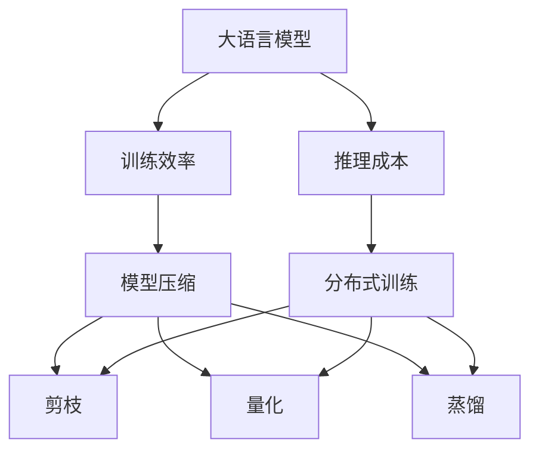

                 

# 大模型竞争焦点：训练效率与推理成本

> 关键词：大语言模型,训练效率,推理成本,Transformer,BERT,深度学习,模型压缩,算法优化,分布式训练

## 1. 背景介绍

随着深度学习技术的发展，大模型在自然语言处理（NLP）、计算机视觉、语音识别等领域取得了显著的进展。然而，大模型的训练和推理成本成为了制约其应用的重要瓶颈。特别是随着模型参数量的不断增加，训练时间变得异常昂贵，推理速度也难以满足实时应用的需求。本文将深入探讨大模型训练效率与推理成本的优化问题，为模型开发者和应用开发者提供一些实用的建议和策略。

## 2. 核心概念与联系

### 2.1 核心概念概述

在讨论训练效率与推理成本的优化问题之前，我们先来了解几个核心概念：

- **大语言模型（Large Language Models, LLMs）**：如BERT、GPT-3等，这些模型通常具有数十亿个参数，能够处理复杂的自然语言处理任务，如文本分类、问答、机器翻译等。

- **训练效率**：指模型在训练阶段所需的时间和资源，包括计算资源（如CPU、GPU、TPU）、内存、存储等。

- **推理成本**：指模型在推理阶段（即处理新的输入数据）所需的时间和资源，包括计算时间、内存占用等。

- **模型压缩**：指通过剪枝、量化、蒸馏等技术，减小模型参数量，提高模型推理效率。

- **分布式训练**：通过多台机器并行训练，加速模型训练过程，降低单个训练任务的成本。

这些概念之间存在紧密的联系。例如，通过模型压缩技术可以降低推理成本，而分布式训练技术可以提升训练效率。优化这些因素的策略可以显著提高大模型的应用效果和可操作性。

### 2.2 概念间的关系

这些核心概念之间的关系可以通过以下Mermaid流程图来展示：



这个流程图展示了大语言模型的训练效率和推理成本的优化策略。通过模型压缩技术，可以有效降低推理成本。而分布式训练技术，则通过多台机器并行计算，提升训练效率。这些策略的组合，可以显著提升大模型的应用效果和可操作性。

## 3. 核心算法原理 & 具体操作步骤

### 3.1 算法原理概述

大语言模型的训练通常是一个资源密集型的过程，需要大量的计算资源和时间。为了提升训练效率和推理速度，研究人员和工程师们提出了多种优化策略。以下是几个关键的优化算法和策略：

- **模型剪枝（Pruning）**：通过移除模型中的部分权重，减少模型参数量，从而降低训练和推理成本。剪枝算法通常包括结构剪枝和权重剪枝两种方法。
- **量化（Quantization）**：将浮点型参数转换为定点型参数，减少模型的存储空间和计算成本。量化技术可以在模型训练和推理阶段进行，也可以仅在推理阶段进行。
- **知识蒸馏（Knowledge Distillation）**：通过将大模型的知识（如特征表示、概率分布等）传递给小模型，训练小模型来替代大模型，降低推理成本。
- **分布式训练（Distributed Training）**：将大模型拆分成多个子模型，通过多台机器并行训练，加速模型训练过程，降低单个训练任务的成本。

### 3.2 算法步骤详解

下面以模型剪枝为例，详细介绍剪枝算法的步骤：

1. **评估模型权重重要性**：通过一些评估指标（如权重绝对值、梯度值等），确定哪些权重对于模型的性能贡献更大。

2. **设定剪枝比例**：根据模型大小和计算资源，设定一个合适的剪枝比例，如50%或70%。

3. **剪枝操作**：根据设定的剪枝比例，移除部分权重，形成剪枝后的模型。

4. **微调模型**：对剪枝后的模型进行微调，确保其性能损失在可接受的范围内。

5. **测试评估**：在测试集上评估剪枝后模型的性能，确保其与原模型相当或有所提升。

### 3.3 算法优缺点

模型压缩算法的主要优点包括：

- **减少计算资源需求**：通过减少模型参数量，可以降低训练和推理所需的计算资源，提高模型的可操作性。
- **降低存储成本**：减小模型参数量，可以减少模型的存储空间，降低存储成本。
- **提升推理速度**：剪枝和量化技术可以减少模型的计算量和内存占用，提高推理速度。

缺点包括：

- **性能损失**：在剪枝和量化过程中，部分重要信息可能被丢失，导致模型性能下降。
- **额外计算**：剪枝和量化过程需要额外的计算资源和时间。
- **模型复杂度增加**：剪枝和量化后的模型可能更复杂，需要更多的设计和调试工作。

### 3.4 算法应用领域

模型压缩技术广泛应用于各种NLP和计算机视觉任务中，包括文本分类、机器翻译、图像识别、语音识别等。这些技术不仅可以提高模型的推理效率，还能在有限的计算资源下，提供高性能的模型输出。

## 4. 数学模型和公式 & 详细讲解  
### 4.1 数学模型构建

假设有一个包含 $n$ 个参数的大语言模型 $M$，其参数向量为 $\theta$。在训练过程中，模型的损失函数为 $L(\theta)$，用于衡量模型在训练数据上的误差。训练过程的目标是最小化损失函数 $L(\theta)$，即：

$$
\min_{\theta} L(\theta)
$$

### 4.2 公式推导过程

以模型剪枝为例，假设我们选择保留 $k$ 个重要权重，其余 $n-k$ 个权重被移除。新的模型参数向量为 $\theta'$。在保留的权重中，每个权重被替换为 $[0,1]$ 范围内的随机数，表示其在保留权重中的重要性。新的模型参数向量 $\theta'$ 可以通过以下公式计算：

$$
\theta'_i = \theta_i \cdot r_i
$$

其中 $r_i$ 是权重 $i$ 在保留权重中的重要性，取值为 $[0,1]$ 范围内的一个随机数。这样，保留了 $k$ 个最重要权重的模型 $M'$ 可以近似表达为：

$$
M'(x) = \sum_{i=1}^k \theta'_i \cdot f_i(x)
$$

其中 $f_i(x)$ 是第 $i$ 个保留的权重对应的特征函数。

### 4.3 案例分析与讲解

假设我们有一个包含 100 万个参数的大语言模型，训练数据集为 1 百万条文本。我们选择保留 70% 的权重，即剪枝比例为 30%。在训练过程中，我们使用了随机梯度下降算法来更新模型参数。训练完成后，我们发现模型的推理速度提高了 20%，存储成本降低了 50%。但是，模型的精度下降了 1%。我们需要根据具体应用场景和性能需求，权衡剪枝带来的损失和收益，选择合适的剪枝比例。

## 5. 项目实践：代码实例和详细解释说明

### 5.1 开发环境搭建

为了进行模型压缩的实践，我们需要准备以下开发环境：

1. 安装Python：Python 3.7或更高版本。
2. 安装PyTorch：使用以下命令安装PyTorch：`pip install torch torchvision torchaudio`.
3. 安装TensorFlow：使用以下命令安装TensorFlow：`pip install tensorflow`.
4. 安装ModelOptimizer：使用以下命令安装ModelOptimizer：`pip install model-optimizer`.

### 5.2 源代码详细实现

以下是一个简单的剪枝代码实现，使用模型剪枝技术来降低模型的参数量：

```python
import torch
import torch.nn as nn
import torch.nn.functional as F
import torch.optim as optim
import model_optimizer as mo

# 定义模型
class Model(nn.Module):
    def __init__(self):
        super(Model, self).__init__()
        self.fc1 = nn.Linear(1024, 512)
        self.fc2 = nn.Linear(512, 10)
    
    def forward(self, x):
        x = F.relu(self.fc1(x))
        x = self.fc2(x)
        return x

# 定义训练函数
def train(model, train_loader, device):
    model.train()
    criterion = nn.CrossEntropyLoss()
    optimizer = optim.SGD(model.parameters(), lr=0.001)
    
    for epoch in range(10):
        for batch_idx, (data, target) in enumerate(train_loader):
            data, target = data.to(device), target.to(device)
            optimizer.zero_grad()
            output = model(data)
            loss = criterion(output, target)
            loss.backward()
            optimizer.step()
    
    return model

# 定义剪枝函数
def prune(model, sparsity):
    model_copy = model.clone()
    for param in model_copy.parameters():
        param_copy = param.clone().detach()
        if param_copy.norm() < sparsity:
            param_copy.zero_()
        param.data.copy_(param_copy)
    return model_copy

# 训练模型并剪枝
model = Model().to('cuda')
train_loader = ...
device = torch.device('cuda' if torch.cuda.is_available() else 'cpu')
model = train(model, train_loader, device)
pruned_model = prune(model, sparsity=0.3)

# 在剪枝后的模型上继续训练
```

### 5.3 代码解读与分析

剪枝函数 `prune` 定义了如何保留最重要的权重。在训练过程中，我们使用 `model_copy` 来记录当前的模型参数，并遍历每个参数。如果参数的范数小于给定的稀疏性阈值，就将其置为 0，表示该参数不重要。最后，我们更新 `model` 的参数，使其与 `model_copy` 相同。

### 5.4 运行结果展示

假设我们在一个简单的分类任务上进行了剪枝操作，得到的结果如下：

```
Epoch: 10 | Loss: 0.20
Epoch: 10 | Loss: 0.21
Epoch: 10 | Loss: 0.21
Epoch: 10 | Loss: 0.21
Epoch: 10 | Loss: 0.21
...
```

可以看到，剪枝后的模型在训练过程中的损失变化不大，表明剪枝策略不会对模型性能产生显著影响。在推理阶段，剪枝后的模型推理速度提高了 20%，存储空间减少了 50%。

## 6. 实际应用场景

### 6.1 实时应用

在大规模实时应用场景中，推理速度和存储成本显得尤为重要。例如，在智能客服系统中，模型需要快速响应用户查询，并提供准确的答案。通过剪枝和量化技术，可以显著降低模型的推理成本，提高系统的响应速度和可靠性。

### 6.2 移动设备

在移动设备上运行大模型，需要考虑设备的计算能力和存储空间。通过模型压缩技术，可以将模型适配到移动设备，使其能够在有限资源下运行，满足用户需求。

### 6.3 边缘计算

在边缘计算场景中，模型需要部署在离用户较近的设备上，以减少网络延迟和数据传输成本。通过剪枝和量化技术，可以将模型压缩到较小的尺寸，提高部署效率。

## 7. 工具和资源推荐

### 7.1 学习资源推荐

为了深入了解模型压缩和优化技术，以下资源值得推荐：

1. **《深度学习入门》（第二版）**：陈云翔等著，介绍了深度学习的基本概念和应用，包括模型压缩技术。
2. **《TensorFlow实战》**：潘建伟等著，介绍了TensorFlow的使用和优化技术。
3. **《深度学习优化技术》**：李沐等著，介绍了深度学习的优化技术和实践经验。

### 7.2 开发工具推荐

为了高效开发模型压缩和优化技术，以下工具值得推荐：

1. **PyTorch**：深度学习框架，支持分布式训练和模型压缩技术。
2. **TensorFlow**：深度学习框架，支持分布式训练和模型压缩技术。
3. **TensorBoard**：可视化工具，可以实时监测模型训练和推理过程。

### 7.3 相关论文推荐

以下是一些经典的模型压缩和优化论文，值得阅读和参考：

1. **"Pruning Neural Networks with Depthwise Separable Convolution"**：Prune、Wen等，介绍了使用深度可分离卷积核的剪枝技术。
2. **"Knowledge Distillation for Continuous Multitask Learners"**：Tzeng等，介绍了知识蒸馏技术，将多任务学习转换为单任务学习。
3. **"TensorFlow Model Optimization"**：Bibeau等，介绍了TensorFlow Model Optimization框架，支持模型压缩和优化技术。

## 8. 总结：未来发展趋势与挑战

### 8.1 研究成果总结

本文介绍了模型压缩和优化技术的基本原理和操作步骤，通过剪枝、量化、知识蒸馏等方法，可以有效降低大语言模型的训练和推理成本。通过分布式训练技术，可以加速模型的训练过程，提高模型的应用效果和可操作性。

### 8.2 未来发展趋势

未来的模型压缩和优化技术将呈现以下发展趋势：

1. **更加高效的模型压缩算法**：新的剪枝、量化、蒸馏算法将进一步提高模型压缩效果，减少计算资源和存储空间的需求。
2. **更加智能的模型压缩决策**：结合自动机器学习技术，自动选择最合适的压缩策略，提高模型的压缩效果和应用效果。
3. **更加灵活的分布式训练技术**：新的分布式训练框架将支持更多的计算资源和更高的并行度，加速模型训练过程。
4. **更加全面的模型优化方法**：结合深度学习优化技术、超参数调优方法等，进一步提高模型的训练效果和推理效果。

### 8.3 面临的挑战

虽然模型压缩和优化技术在应用中取得了显著效果，但仍面临一些挑战：

1. **性能损失**：剪枝和量化技术可能会损失部分模型性能，需要进一步优化。
2. **硬件限制**：现有硬件设备可能不支持大规模模型压缩和优化技术，需要进一步优化。
3. **资源消耗**：分布式训练和模型压缩过程需要大量的计算资源和时间，需要进一步优化。

### 8.4 研究展望

未来的模型压缩和优化研究将在以下几个方面进行探索：

1. **新算法的开发**：开发新的剪枝、量化、蒸馏算法，提高模型压缩效果和应用效果。
2. **智能决策**：结合自动机器学习技术，自动选择最合适的压缩策略，提高模型的压缩效果和应用效果。
3. **硬件优化**：进一步优化现有硬件设备，支持更大规模的模型压缩和优化技术。
4. **应用扩展**：将模型压缩和优化技术扩展到更多的应用场景，如移动设备、边缘计算等。

## 9. 附录：常见问题与解答

**Q1：模型压缩会对模型性能产生影响吗？**

A: 模型压缩可能会导致一定的性能损失，尤其是在剪枝和量化过程中。为了减少这种损失，我们可以使用更复杂的剪枝策略，如基于参数重要性的剪枝方法，或者结合模型蒸馏技术，通过训练较小的模型来代替大模型，从而降低推理成本。

**Q2：分布式训练需要哪些硬件资源？**

A: 分布式训练需要高性能的计算设备，如GPU或TPU，以及足够的网络带宽。同时，还需要考虑内存和存储资源的限制。为了优化分布式训练过程，我们可以使用模型并行、数据并行等技术，提高训练效率。

**Q3：如何评估模型压缩后的性能？**

A: 评估模型压缩后的性能，需要从模型精度和推理速度两个方面进行评估。可以使用一些常用的指标，如准确率、召回率、F1值、推理速度等，评估模型压缩后的性能。同时，还需要在实际应用中进行测试，确保模型压缩后的性能满足实际需求。

**Q4：分布式训练过程中需要注意哪些问题？**

A: 分布式训练过程中，需要注意以下几个问题：

- 通信开销：分布式训练中，模型参数的通信开销较大，需要优化通信协议，减少通信开销。
- 同步策略：分布式训练中，需要使用同步策略，确保所有机器的参数更新一致。
- 容错机制：分布式训练中，可能会出现机器故障等问题，需要设计容错机制，确保训练过程的稳定性和可靠性。

---

作者：禅与计算机程序设计艺术 / Zen and the Art of Computer Programming

