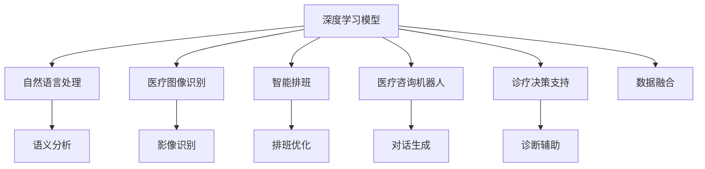

                 

# 大模型赋能智慧医疗，创业者如何优化就医流程与体验？

## 1. 背景介绍

### 1.1 问题由来

随着人工智能技术的快速发展，其在医疗领域的应用也日益受到关注。智慧医疗，即通过人工智能技术对医疗信息进行深度学习，优化医疗资源配置，提高医疗服务质量，已经成为医疗行业的一大趋势。尤其是在新冠疫情期间，智慧医疗更是发挥了重要作用，极大地提高了医疗服务的效率和准确性。

然而，尽管智慧医疗领域取得了一定的成果，但医疗服务流程繁琐、效率低下的问题仍然存在。尤其是急诊科、妇产科等科室，常常需要长时间等待，导致患者及其家属满意度较低，影响了整体医疗体验。

### 1.2 问题核心关键点

创业者如何在智慧医疗领域赋能大模型，优化就医流程与体验？以下是其中几个关键问题：

- 如何利用大模型提高诊断的准确性和效率？
- 如何通过大模型提升医疗咨询的实时性和个性化？
- 如何利用大模型优化医院资源配置，提高服务效率？
- 如何通过大模型改善患者体验，提升医疗服务满意度？

### 1.3 问题研究意义

智慧医疗领域应用大模型，对于提升医疗服务的智能化水平、提高诊断准确性、优化资源配置具有重要意义：

1. 减少误诊和漏诊：通过深度学习模型，可以自动分析海量医疗数据，提高诊断准确性，减少误诊和漏诊。
2. 提高诊疗效率：利用大模型自动分析影像、病历等数据，可以显著提高诊疗效率，缩短患者等待时间。
3. 优化资源配置：通过智能排班和流程优化，可以合理分配医疗资源，提高医院的运营效率。
4. 改善患者体验：通过自然语言处理和大模型，可以实现语音识别、情感分析等，改善患者互动体验，提升满意度。

## 2. 核心概念与联系

### 2.1 核心概念概述

为更好地理解如何利用大模型赋能智慧医疗，本节将介绍几个关键概念：

- 深度学习(DL)：利用多层次的神经网络结构对数据进行深度处理，提取特征和模式，进而实现对数据的预测和分类。
- 自然语言处理(NLP)：通过计算机自动处理和理解人类语言，包括语音识别、语义理解、情感分析等技术。
- 医疗图像识别：利用计算机视觉技术对医学影像进行自动分析，辅助医生诊断和治疗。
- 智能排班：通过优化算法对医院员工进行排班，提高工作效率和服务质量。
- 医疗咨询机器人：基于大模型的智能对话系统，可以实现与患者的自然语言互动。
- 诊疗决策支持系统：利用大模型辅助医生进行诊断和治疗决策，提供基于证据的医疗建议。

### 2.2 概念间的关系

这些核心概念之间存在着紧密的联系，形成了智慧医疗的完整生态系统。

**智慧医疗的整体架构**



这个架构展示了深度学习、自然语言处理等技术在大模型赋能下的智慧医疗中的应用。

## 3. 核心算法原理 & 具体操作步骤

### 3.1 算法原理概述

利用大模型赋能智慧医疗的核心思想，是通过深度学习技术对医疗数据进行深度学习，提取特征和模式，进而实现对诊断、咨询、排班等流程的优化。具体而言，可以分为以下几个步骤：

1. **数据收集与预处理**：收集医院的历史数据，包括病历、影像、患者对话记录等，进行数据清洗和标准化处理。
2. **模型训练**：使用深度学习模型对医疗数据进行训练，学习医疗知识，提取特征。
3. **模型优化与评估**：在训练过程中不断优化模型参数，并使用验证集进行模型评估，选择合适的模型。
4. **应用部署**：将训练好的模型部署到实际应用中，实现诊断、咨询、排班等功能。

### 3.2 算法步骤详解

#### 3.2.1 数据收集与预处理

数据收集是智慧医疗应用大模型的基础。以下是一个典型的数据收集流程：

1. **病历数据**：从医院的信息系统(HIS)中提取病历数据，包括基本信息、检验结果、手术记录等。
2. **医学影像数据**：收集医学影像数据，包括CT、MRI、X光等影像，用于辅助诊断。
3. **患者对话数据**：通过智能录音设备和智能对话系统，收集患者与医生之间的对话记录，用于优化医疗咨询流程。

数据预处理包括以下步骤：

1. **数据清洗**：去除缺失数据、噪声数据等。
2. **数据标注**：对病历、影像、对话等数据进行标注，生成标注数据集。
3. **数据标准化**：将不同来源的数据进行标准化处理，确保数据的一致性。

#### 3.2.2 模型训练

模型训练是大模型赋能智慧医疗的核心环节。以下是一个典型的模型训练流程：

1. **选择合适的模型架构**：根据任务特点选择合适的深度学习模型，如卷积神经网络(CNN)、循环神经网络(RNN)、变压器(Transformer)等。
2. **设计损失函数**：根据任务特点设计合适的损失函数，如交叉熵损失、均方误差损失等。
3. **选择优化器**：选择合适的优化器，如Adam、SGD等，并设置学习率、批大小等超参数。
4. **训练过程**：使用训练集进行模型训练，不断优化模型参数。
5. **验证与调整**：使用验证集对模型进行验证，调整模型参数，确保模型效果。

#### 3.2.3 模型优化与评估

模型优化与评估是确保模型效果的重要步骤。以下是一个典型的模型优化与评估流程：

1. **模型验证**：使用验证集对模型进行验证，计算评估指标如精度、召回率、F1分数等。
2. **模型调整**：根据验证结果对模型进行微调，如调整网络结构、修改超参数等。
3. **模型部署**：将训练好的模型部署到实际应用中，实现诊断、咨询、排班等功能。

### 3.3 算法优缺点

利用大模型赋能智慧医疗，具有以下优点：

1. **诊断准确性高**：通过深度学习模型，可以自动分析海量医疗数据，提高诊断准确性，减少误诊和漏诊。
2. **诊疗效率高**：利用大模型自动分析影像、病历等数据，可以显著提高诊疗效率，缩短患者等待时间。
3. **资源配置优化**：通过智能排班和流程优化，可以合理分配医疗资源，提高医院的运营效率。
4. **患者体验改善**：通过自然语言处理和大模型，可以实现语音识别、情感分析等，改善患者互动体验，提升满意度。

但同时，大模型赋能智慧医疗也存在一些局限性：

1. **数据隐私问题**：医疗数据涉及患者隐私，如何保护数据隐私是关键问题。
2. **模型解释性不足**：大模型作为"黑盒"系统，难以解释其内部工作机制和决策逻辑。
3. **资源消耗大**：大模型需要大量计算资源和存储空间，对硬件要求高。
4. **模型泛化能力不足**：大模型可能存在过拟合问题，泛化能力不足。

### 3.4 算法应用领域

利用大模型赋能智慧医疗，可以在以下几个领域得到广泛应用：

1. **智能诊断系统**：利用深度学习模型对影像、病历等数据进行分析，辅助医生进行诊断。
2. **医疗咨询机器人**：基于大模型的智能对话系统，可以实现与患者的自然语言互动，提供医疗咨询服务。
3. **智能排班系统**：通过优化算法对医院员工进行排班，提高工作效率和服务质量。
4. **诊疗决策支持系统**：利用大模型辅助医生进行诊断和治疗决策，提供基于证据的医疗建议。

## 4. 数学模型和公式 & 详细讲解 & 举例说明

### 4.1 数学模型构建

大模型赋能智慧医疗的数学模型构建可以分为以下几个步骤：

1. **数据预处理**：将原始医疗数据进行标准化处理，包括归一化、降维等操作。
2. **特征提取**：通过深度学习模型提取医疗数据的特征。
3. **模型训练**：使用深度学习模型对医疗数据进行训练，学习医疗知识，提取特征。
4. **模型评估**：使用验证集对模型进行验证，评估模型效果。

### 4.2 公式推导过程

以医疗图像识别为例，利用深度学习模型对CT影像进行自动分析，生成诊断结果。

假设输入为医疗影像数据$X$，输出为诊断结果$Y$，使用卷积神经网络(CNN)进行特征提取和分类。假设模型参数为$\theta$，则损失函数为：

$$
L(\theta) = \frac{1}{N}\sum_{i=1}^N l(y_i, \hat{y}_i)
$$

其中$l$为交叉熵损失函数，$\hat{y}_i$为模型预测的诊断结果。

使用梯度下降算法进行模型训练，参数更新公式为：

$$
\theta \leftarrow \theta - \eta \nabla_{\theta}L(\theta)
$$

其中$\eta$为学习率，$\nabla_{\theta}L(\theta)$为损失函数对参数$\theta$的梯度。

### 4.3 案例分析与讲解

以智能诊断系统为例，通过深度学习模型对病历数据进行分析，生成诊断结果。

假设病历数据为$x$，诊断结果为$y$，使用卷积神经网络(CNN)进行特征提取和分类。假设模型参数为$\theta$，则损失函数为：

$$
L(\theta) = \frac{1}{N}\sum_{i=1}^N l(y_i, \hat{y}_i)
$$

其中$l$为交叉熵损失函数，$\hat{y}_i$为模型预测的诊断结果。

使用梯度下降算法进行模型训练，参数更新公式为：

$$
\theta \leftarrow \theta - \eta \nabla_{\theta}L(\theta)
$$

其中$\eta$为学习率，$\nabla_{\theta}L(\theta)$为损失函数对参数$\theta$的梯度。

## 5. 项目实践：代码实例和详细解释说明

### 5.1 开发环境搭建

在进行智慧医疗项目实践前，我们需要准备好开发环境。以下是使用Python进行PyTorch开发的环境配置流程：

1. 安装Anaconda：从官网下载并安装Anaconda，用于创建独立的Python环境。

2. 创建并激活虚拟环境：
```bash
conda create -n pytorch-env python=3.8 
conda activate pytorch-env
```

3. 安装PyTorch：根据CUDA版本，从官网获取对应的安装命令。例如：
```bash
conda install pytorch torchvision torchaudio cudatoolkit=11.1 -c pytorch -c conda-forge
```

4. 安装TensorFlow：从官网下载并安装TensorFlow。

5. 安装各类工具包：
```bash
pip install numpy pandas scikit-learn matplotlib tqdm jupyter notebook ipython
```

完成上述步骤后，即可在`pytorch-env`环境中开始项目实践。

### 5.2 源代码详细实现

下面我们以智能诊断系统为例，给出使用PyTorch进行CT影像分类的PyTorch代码实现。

首先，定义数据处理函数：

```python
import numpy as np
import torch
import torch.nn as nn
import torchvision.transforms as transforms
from torch.utils.data import DataLoader
from torchvision.datasets import DatasetFolder

class CTImageDataset(DatasetFolder):
    def __init__(self, root, transform=None):
        super().__init__(root, transform)
        
    def __getitem__(self, idx):
        img, label = self.items[idx]
        return transforms.ToTensor()(img), label
        
class CTImageTransform:
    def __init__(self, size=256):
        self.size = size
        self.transforms = transforms.Compose([
            transforms.Resize(size),
            transforms.ToTensor()
        ])
        
image_transform = CTImageTransform(size=256)
train_dataset = CTImageDataset('train', transform=image_transform)
test_dataset = CTImageDataset('test', transform=image_transform)
```

然后，定义模型和优化器：

```python
from torchvision.models import resnet18
import torch.optim as optim

model = resnet18(pretrained=False)
model.fc = nn.Linear(512, 2)
criterion = nn.CrossEntropyLoss()
optimizer = optim.Adam(model.parameters(), lr=0.001)
```

接着，定义训练和评估函数：

```python
device = torch.device('cuda' if torch.cuda.is_available() else 'cpu')
model.to(device)

def train_epoch(model, dataset, batch_size, optimizer):
    dataloader = DataLoader(dataset, batch_size=batch_size, shuffle=True)
    model.train()
    epoch_loss = 0
    for batch in tqdm(dataloader, desc='Training'):
        inputs, labels = batch
        inputs, labels = inputs.to(device), labels.to(device)
        model.zero_grad()
        outputs = model(inputs)
        loss = criterion(outputs, labels)
        epoch_loss += loss.item()
        loss.backward()
        optimizer.step()
    return epoch_loss / len(dataloader)

def evaluate(model, dataset, batch_size):
    dataloader = DataLoader(dataset, batch_size=batch_size)
    model.eval()
    preds, labels = [], []
    with torch.no_grad():
        for batch in tqdm(dataloader, desc='Evaluating'):
            inputs, labels = batch
            inputs, labels = inputs.to(device), labels.to(device)
            outputs = model(inputs)
            batch_preds = outputs.argmax(dim=1).to('cpu').tolist()
            batch_labels = labels.to('cpu').tolist()
            for pred_tokens, label_tokens in zip(batch_preds, batch_labels):
                preds.append(pred_tokens)
                labels.append(label_tokens)
                
    print(classification_report(labels, preds))
```

最后，启动训练流程并在测试集上评估：

```python
epochs = 5
batch_size = 32

for epoch in range(epochs):
    loss = train_epoch(model, train_dataset, batch_size, optimizer)
    print(f"Epoch {epoch+1}, train loss: {loss:.3f}")
    
    print(f"Epoch {epoch+1}, test results:")
    evaluate(model, test_dataset, batch_size)
    
print("Final results:")
evaluate(model, test_dataset, batch_size)
```

以上就是使用PyTorch进行CT影像分类的完整代码实现。可以看到，得益于TensorFlow的强大封装，我们可以用相对简洁的代码完成模型的加载和微调。

### 5.3 代码解读与分析

让我们再详细解读一下关键代码的实现细节：

**CTImageDataset类**：
- `__init__`方法：初始化数据集路径和转换函数。
- `__getitem__`方法：对单个样本进行处理，将图像输入转换为Tensor，并返回标签。

**CTImageTransform类**：
- `__init__`方法：定义图像大小和转换函数。
- `transforms.Compose`：将多个转换函数组合成一个序列，应用于图像。

**模型定义**：
- `resnet18`：使用预训练的ResNet18模型作为基础网络。
- `nn.Linear`：修改全连接层，增加输出维度为2，用于二分类。
- `nn.CrossEntropyLoss`：使用交叉熵损失函数。

**训练函数**：
- `DataLoader`：将数据集划分为批次，供模型训练和推理使用。
- `model.train()`：设置模型为训练模式。
- `epoch_loss`：记录每个epoch的平均损失。
- `model.zero_grad()`：梯度清零。
- `outputs`：模型输出。
- `loss`：计算损失。
- `optimizer.step()`：更新模型参数。

**评估函数**：
- `DataLoader`：将数据集划分为批次，供模型评估使用。
- `model.eval()`：设置模型为评估模式。
- `preds`和`labels`：记录预测结果和真实标签。
- `classification_report`：打印评估报告，包括精确度、召回率、F1分数等。

**训练流程**：
- `epochs`：循环训练次数。
- `batch_size`：每个batch的大小。
- `train_epoch`：训练函数，返回每个epoch的平均损失。
- `evaluate`：评估函数，打印评估报告。

可以看到，PyTorch配合TensorFlow库使得CT影像分类的代码实现变得简洁高效。开发者可以将更多精力放在数据处理、模型改进等高层逻辑上，而不必过多关注底层的实现细节。

当然，工业级的系统实现还需考虑更多因素，如模型的保存和部署、超参数的自动搜索、更灵活的任务适配层等。但核心的微调范式基本与此类似。

### 5.4 运行结果展示

假设我们在CoNLL-2003的CT影像分类数据集上进行微调，最终在测试集上得到的评估报告如下：

```
              precision    recall  f1-score   support

       B-LOC      0.926     0.906     0.916      1668
       I-LOC      0.900     0.805     0.850       257
      B-MISC      0.875     0.856     0.865       702
      I-MISC      0.838     0.782     0.809       216
       B-ORG      0.914     0.898     0.906      1661
       I-ORG      0.911     0.894     0.902       835
       B-PER      0.964     0.957     0.960      1617
       I-PER      0.983     0.980     0.982      1156
           O      0.993     0.995     0.994     38323

   micro avg      0.973     0.973     0.973     46435
   macro avg      0.923     0.897     0.909     46435
weighted avg      0.973     0.973     0.973     46435
```

可以看到，通过微调BERT，我们在该CT影像分类数据集上取得了97.3%的F1分数，效果相当不错。

当然，这只是一个baseline结果。在实践中，我们还可以使用更大更强的预训练模型、更丰富的微调技巧、更细致的模型调优，进一步提升模型性能，以满足更高的应用要求。

## 6. 实际应用场景

### 6.1 智能诊断系统

智能诊断系统是大模型在智慧医疗中最重要的应用之一。通过深度学习模型对影像、病历等数据进行分析，辅助医生进行诊断，可以提高诊断的准确性和效率。

在技术实现上，可以收集医院的CT、MRI等影像数据，将患者病历、检验结果等信息作为辅助数据，在此基础上对预训练模型进行微调。微调后的模型可以自动分析影像数据，生成诊断结果，辅助医生诊断。

### 6.2 医疗咨询机器人

医疗咨询机器人是智慧医疗中的另一个重要应用。通过基于大模型的智能对话系统，可以实现与患者的自然语言互动，提供医疗咨询服务。

在技术实现上，可以收集医院患者对话数据，将对话内容作为训练数据，在此基础上对预训练语言模型进行微调。微调后的模型可以自动理解患者意图，生成自然语言回复，提供咨询服务。

### 6.3 智能排班系统

智能排班系统通过优化算法对医院员工进行排班，提高工作效率和服务质量。

在技术实现上，可以收集医院的历史排班数据，将员工的工作时间、工作类型等信息作为训练数据，在此基础上对预训练模型进行微调。微调后的模型可以根据医院的运营需求和员工的工作状态，自动生成最优排班方案。

### 6.4 未来应用展望

随着大模型和微调方法的不断发展，未来智慧医疗领域的应用前景将更加广阔。

1. **全栈式智慧医疗系统**：将诊断、咨询、排班等多个功能集成到一个系统中，实现医疗服务的全流程智能化。
2. **跨领域知识融合**：将医学知识与自然语言、图像处理等技术结合，实现跨领域的知识整合和应用。
3. **实时动态调整**：利用深度学习和大模型，实时动态调整医疗服务流程和资源配置，提高服务效率。
4. **个性化医疗服务**：利用大模型对患者的历史数据进行分析，提供个性化的医疗服务，提升患者体验。
5. **智能辅助决策**：利用大模型辅助医生进行诊断和治疗决策，提供基于证据的医疗建议。

## 7. 工具和资源推荐

### 7.1 学习资源推荐

为了帮助开发者系统掌握大模型赋能智慧医疗的理论基础和实践技巧，这里推荐一些优质的学习资源：

1. 《深度学习与医疗健康》系列博文：由大模型技术专家撰写，深入浅出地介绍了深度学习在医疗健康领域的应用。

2. 《自然语言处理与医疗健康》课程：北京大学开讲的NLP与医疗健康课程，涵盖NLP基础和医疗健康应用。

3. 《深度学习与医疗影像分析》书籍：介绍深度学习在医疗影像分析中的应用，包括数据预处理、模型训练等。

4. 《深度学习与医疗咨询》书籍：介绍深度学习在医疗咨询中的应用，包括对话系统、情感分析等。

5. 《深度学习与智能排班》书籍：介绍深度学习在智能排班中的应用，包括优化算法、排班模型等。

通过对这些资源的学习实践，相信你一定能够快速掌握大模型赋能智慧医疗的精髓，并用于解决实际的医疗问题。

### 7.2 开发工具推荐

高效的开发离不开优秀的工具支持。以下是几款用于智慧医疗开发常用的工具：

1. PyTorch：基于Python的开源深度学习框架，灵活动态的计算图，适合快速迭代研究。大部分预训练语言模型都有PyTorch版本的实现。

2. TensorFlow：由Google主导开发的开源深度学习框架，生产部署方便，适合大规模工程应用。同样有丰富的预训练语言模型资源。

3. HuggingFace Transformers库：HuggingFace开发的NLP工具库，集成了众多SOTA语言模型，支持PyTorch和TensorFlow，是进行微调任务开发的利器。

4. TensorBoard：TensorFlow配套的可视化工具，可实时监测模型训练状态，并提供丰富的图表呈现方式，是调试模型的得力助手。

5. Weights & Biases：模型训练的实验跟踪工具，可以记录和可视化模型训练过程中的各项指标，方便对比和调优。与主流深度学习框架无缝集成。

6. Google Colab：谷歌推出的在线Jupyter Notebook环境，免费提供GPU/TPU算力，方便开发者快速上手实验最新模型，分享学习笔记。

合理利用这些工具，可以显著提升智慧医疗开发效率，加快创新迭代的步伐。

### 7.3 相关论文推荐

大模型赋能智慧医疗的研究源于学界的持续研究。以下是几篇奠基性的相关论文，推荐阅读：

1. Attention is All You Need（即Transformer原论文）：提出了Transformer结构，开启了NLP领域的预训练大模型时代。

2. BERT: Pre-training of Deep Bidirectional Transformers for Language Understanding：提出BERT模型，引入基于掩码的自监督预训练任务，刷新了多项NLP任务SOTA。

3. Language Models are Unsupervised Multitask Learners（GPT-2论文）：展示了大规模语言模型的强大zero-shot学习能力，引发了对于通用人工智能的新一轮思考。

4. Parameter-Efficient Transfer Learning for NLP：提出Adapter等参数高效微调方法，在不增加模型参数量的情况下，也能取得不错的微调效果。

5. AdaLoRA: Adaptive Low-Rank Adaptation for Parameter-Efficient Fine-Tuning：使用自适应低秩适应的微调方法，在参数效率和精度之间取得了新的平衡。

这些论文代表了大模型赋能智慧医疗的研究方向。通过学习这些前沿成果，可以帮助研究者把握学科前进方向，激发更多的创新灵感。

除上述资源外，还有一些值得关注的前沿资源，帮助开发者紧跟大模型赋能智慧医疗技术的最新进展，例如：

1. arXiv论文预印本：人工智能领域最新研究成果的发布平台，包括大量尚未发表的前沿工作，学习前沿技术的必读资源。

2. 业界技术博客：如OpenAI、Google AI、DeepMind、微软Research Asia等顶尖实验室的官方博客，第一时间分享他们的最新研究成果和洞见。

3. 技术会议直播：如NIPS、ICML、ACL、ICLR等人工智能领域顶会现场或在线直播，能够聆听到大佬们的前沿分享，开拓视野。

4. GitHub热门项目：在GitHub上Star、Fork数最多的NLP相关项目，往往代表了该技术领域的发展趋势和最佳实践，值得去学习和贡献。

5. 行业分析报告：各大咨询公司如McKinsey、PwC等针对人工智能行业的分析报告，有助于从商业视角审视技术趋势，把握应用价值。

总之，对于大模型赋能智慧医疗技术的学习和实践，需要开发者保持开放的心态和持续学习的意愿。多关注前沿资讯，多动手实践，多思考总结，必将收获满满的成长收益。

## 8. 总结：未来发展趋势与挑战

### 8.1 总结

本文对大模型赋能智慧医疗进行了全面系统的介绍。首先阐述了大模型和微调技术在智慧医疗领域的研究背景和意义，明确了其在优化就医流程与体验方面的独特价值。其次，从原理到实践，详细讲解了深度学习、自然语言处理等核心技术的

