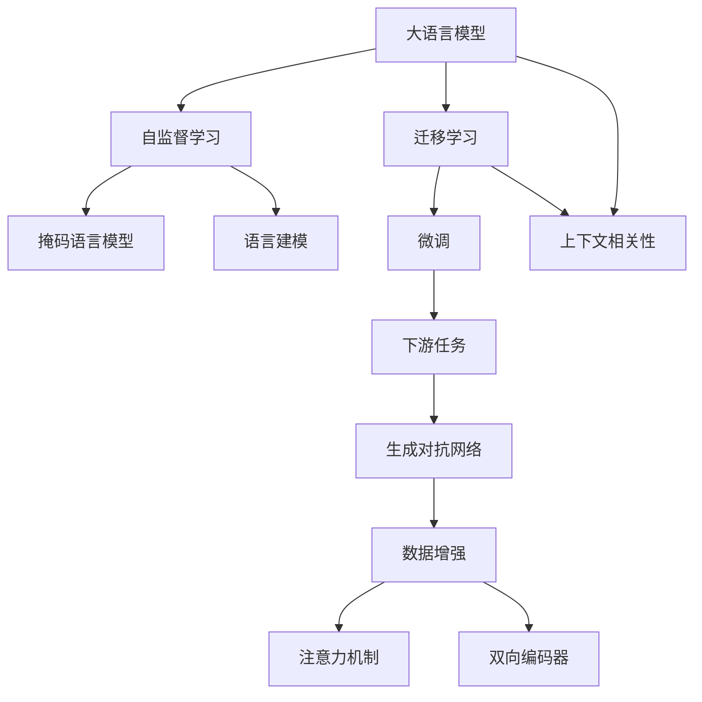
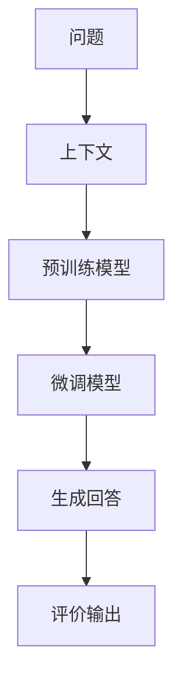
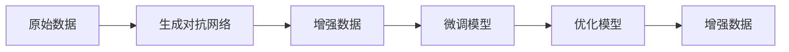
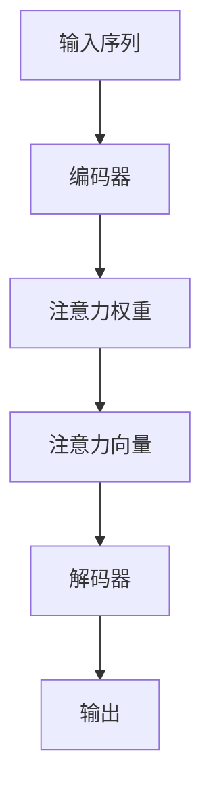
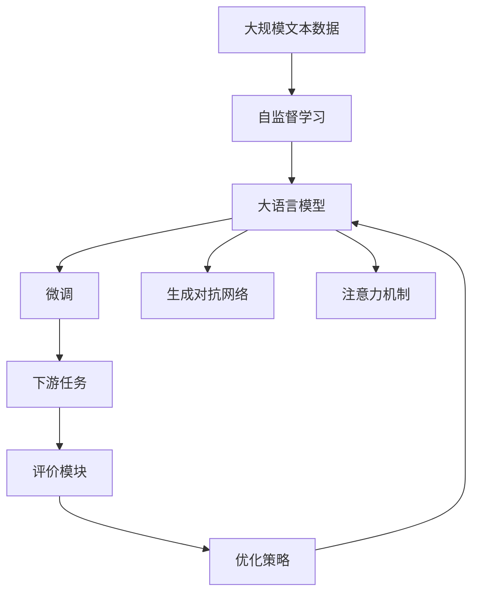

                 

# 大模型问答机器人的上下文相关性

## 1. 背景介绍

### 1.1 问题由来
随着自然语言处理(NLP)技术的不断发展，问答系统(QA)在智能客服、知识检索、在线教育等多个场景中得到了广泛应用。特别是近年来，大语言模型(Large Language Models, LLMs)的崛起，极大地提升了问答系统的性能和应用范围。大模型通常基于大规模无标签文本数据进行预训练，学习到丰富的语言知识和常识，能够自动理解问题并生成合理的回答。

然而，尽管大模型在生成质量上取得了显著进展，但其上下文相关性（Contextual Relevance）仍然是一个重要的瓶颈问题。所谓上下文相关性，指的是模型在处理问题时，能否准确理解问题的语义背景和上下文信息，生成与问题语境匹配的回答。上下文相关性不佳，会导致系统生成的回答偏离用户真实意图，影响用户体验和系统的可靠性。

因此，本文将聚焦于大模型问答系统的上下文相关性问题，探讨其核心原理、优化方法和应用场景，为构建更高效、可靠、智能的问答系统提供参考。

### 1.2 问题核心关键点
大模型问答系统通常通过预训练-微调(Fine-Tuning)的流程进行上下文相关性的训练。预训练步骤在大规模无标签数据上进行自监督学习，学习到通用的语言表示；微调步骤在少量标注数据上进行监督学习，优化模型在特定问答任务上的表现。然而，问答任务本质上是一种需要理解问题语境的复杂任务，模型的上下文相关性能力在预训练和微调中均有所体现。

上下文相关性的优劣主要受以下几个因素的影响：
- 数据质量：标注数据的丰富度和准确性，直接影响模型对上下文的理解能力。
- 模型结构：模型对上下文的编码和推理机制，决定了其能否捕捉到问题中的语义信息。
- 训练策略：模型在微调过程中使用的优化算法、正则化技术等，影响上下文相关性的效果。
- 应用场景：问答任务的复杂度和多变性，使得上下文相关性在不同的任务中表现有所差异。

本文将重点关注模型结构和训练策略，探讨如何通过改进模型设计，增强其上下文相关性能力，同时在实际应用场景中考虑上下文相关性的优化方法。

## 2. 核心概念与联系

### 2.1 核心概念概述

为更好地理解大模型问答系统的上下文相关性，本节将介绍几个关键概念：

- 大语言模型(Large Language Model, LLM)：以自回归(如GPT)或自编码(如BERT)模型为代表的大规模预训练语言模型。通过在大规模无标签文本数据上进行预训练，学习到丰富的语言知识和常识，具备强大的语言理解和生成能力。

- 自监督学习(Self-Supervised Learning)：利用无标签数据进行的自主学习过程，通过设计巧妙的预训练任务，学习到通用的语言表示，如语言建模、掩码语言模型等。

- 迁移学习(Transfer Learning)：将一个领域学习到的知识，迁移应用到另一个不同但相关的领域的学习范式。大模型的预训练-微调过程即是一种典型的迁移学习方式。

- 上下文相关性(Contextual Relevance)：模型在处理问题时，能否准确理解问题的语义背景和上下文信息，生成与问题语境匹配的回答。

- 生成对抗网络(GANs)：一种生成模型，通过对抗训练，生成逼真的数据样本，用于数据增强和模型优化。

- 注意力机制(Attention Mechanism)：一种通过计算输入序列中不同部分之间的注意力权重，来捕捉序列中关键信息的机制。

- 双向编码器(BiLSTM)：一种可以同时考虑输入序列的前后顺序，捕捉序列中双向信息的编码器。

这些核心概念之间存在着紧密的联系，形成了大模型问答系统的整体架构。下面通过一个Mermaid流程图来展示这些概念之间的关系：



这个流程图展示了从预训练到微调，再到应用生成对抗网络和注意力机制，增强模型上下文相关性的完整过程。大语言模型通过自监督学习任务进行预训练，学习通用的语言表示；然后通过迁移学习方式，在少量标注数据上微调，学习特定任务的上下文相关性。生成对抗网络和注意力机制等技术进一步提升了模型在上下文理解和推理方面的能力。

### 2.2 概念间的关系

这些核心概念之间存在着紧密的联系，形成了大模型问答系统的整体架构。下面通过几个Mermaid流程图来展示这些概念之间的关系。

#### 2.2.1 上下文相关性的生成过程



这个流程图展示了问题到回答的生成过程。预训练模型对问题进行编码，微调模型利用上下文信息进一步细化编码，最终生成回答，并由评价模块评估回答的质量。

#### 2.2.2 数据增强与模型优化



这个流程图展示了利用生成对抗网络进行数据增强，进而优化模型的方法。生成对抗网络生成逼真的数据样本，增加训练集的多样性；微调模型利用增强数据进行训练，优化上下文相关性。

#### 2.2.3 注意力机制的实现



这个流程图展示了注意力机制的基本工作流程。输入序列通过编码器进行编码，得到一系列的编码向量；注意力权重计算输入序列中不同部分之间的权重，生成注意力向量；解码器利用注意力向量进行上下文信息的选择和融合，输出最终的回答。

### 2.3 核心概念的整体架构

最后，我们用一个综合的流程图来展示这些核心概念在大模型问答系统中的整体架构：



这个综合流程图展示了从预训练到微调，再到生成对抗网络和注意力机制，增强模型上下文相关性的完整过程。大语言模型通过自监督学习任务进行预训练，学习通用的语言表示；然后通过迁移学习方式，在少量标注数据上微调，学习特定任务的上下文相关性。生成对抗网络和注意力机制等技术进一步提升了模型在上下文理解和推理方面的能力。

## 3. 核心算法原理 & 具体操作步骤
### 3.1 算法原理概述

大模型问答系统的上下文相关性，本质上是通过对输入问题进行编码和推理，生成与问题语境匹配的回答。其核心思想是：将问题编码为一个高维向量，然后利用上下文信息对向量进行细化，最终生成与问题相关的回答。

形式化地，假设预训练模型为 $M_{\theta}$，其中 $\theta$ 为预训练得到的模型参数。给定问题 $q$ 和对应的上下文 $c$，微调的目标是找到新的模型参数 $\hat{\theta}$，使得：

$$
\hat{\theta}=\mathop{\arg\min}_{\theta} \mathcal{L}(M_{\theta},q,c)
$$

其中 $\mathcal{L}$ 为针对问答任务设计的损失函数，用于衡量模型预测输出与真实回答之间的差异。常见的损失函数包括交叉熵损失、BLEU分数、ROUGE分数等。

通过梯度下降等优化算法，微调过程不断更新模型参数 $\theta$，最小化损失函数 $\mathcal{L}$，使得模型输出逼近真实回答。由于 $\theta$ 已经通过预训练获得了较好的初始化，因此即便在微调过程中，模型也能较快收敛到理想的模型参数 $\hat{\theta}$。

### 3.2 算法步骤详解

基于上下文相关性的大模型问答系统一般包括以下几个关键步骤：

**Step 1: 准备预训练模型和数据集**
- 选择合适的预训练语言模型 $M_{\theta}$ 作为初始化参数，如 BERT、GPT 等。
- 准备问答任务 $T$ 的标注数据集 $D=\{(q_i,c_i,a_i)\}_{i=1}^N$，其中 $q_i$ 为问题，$c_i$ 为上下文，$a_i$ 为真实回答。

**Step 2: 设计任务适配层**
- 根据问答任务的特性，在预训练模型顶层设计合适的编码器和解码器。
- 对于编码器，通常使用自注意力机制(BiLSTM)对问题进行编码。
- 对于解码器，通常使用自注意力机制(LSTM)对上下文进行编码，并生成回答。

**Step 3: 设置微调超参数**
- 选择合适的优化算法及其参数，如 AdamW、SGD 等，设置学习率、批大小、迭代轮数等。
- 设置正则化技术及强度，包括权重衰减、Dropout、Early Stopping 等。
- 确定冻结预训练参数的策略，如仅微调顶层，或全部参数都参与微调。

**Step 4: 执行梯度训练**
- 将训练集数据分批次输入模型，前向传播计算损失函数。
- 反向传播计算参数梯度，根据设定的优化算法和学习率更新模型参数。
- 周期性在验证集上评估模型性能，根据性能指标决定是否触发 Early Stopping。
- 重复上述步骤直到满足预设的迭代轮数或 Early Stopping 条件。

**Step 5: 测试和部署**
- 在测试集上评估微调后模型 $M_{\hat{\theta}}$ 的性能，对比微调前后的精度提升。
- 使用微调后的模型对新问题进行推理预测，集成到实际的应用系统中。
- 持续收集新的问题-上下文-回答三元组，定期重新微调模型，以适应数据分布的变化。

以上是基于上下文相关性的微调大模型问答系统的基本流程。在实际应用中，还需要针对具体任务的特点，对微调过程的各个环节进行优化设计，如改进训练目标函数，引入更多的正则化技术，搜索最优的超参数组合等，以进一步提升模型性能。

### 3.3 算法优缺点

基于上下文相关性的微调方法具有以下优点：
1. 简单高效。只需准备少量标注数据，即可对预训练模型进行快速适配，生成高质量的回答。
2. 通用适用。适用于各种问答任务，包括问答匹配、知识检索、对话系统等，设计简单的任务适配层即可实现微调。
3. 参数高效。利用参数高效微调技术，在固定大部分预训练参数的情况下，仍可取得不错的提升。
4. 效果显著。在学术界和工业界的诸多任务上，基于微调的方法已经刷新了多项问答任务的性能指标。

同时，该方法也存在一定的局限性：
1. 依赖标注数据。微调的效果很大程度上取决于标注数据的质量和数量，获取高质量标注数据的成本较高。
2. 迁移能力有限。当目标任务与预训练数据的分布差异较大时，微调的性能提升有限。
3. 负面效果传递。预训练模型的固有偏见、有害信息等，可能通过微调传递到下游任务，造成负面影响。
4. 可解释性不足。微调模型的决策过程通常缺乏可解释性，难以对其推理逻辑进行分析和调试。

尽管存在这些局限性，但就目前而言，基于上下文相关性的微调方法仍是大模型问答系统应用的最主流范式。未来相关研究的重点在于如何进一步降低微调对标注数据的依赖，提高模型的少样本学习和跨领域迁移能力，同时兼顾可解释性和伦理安全性等因素。

### 3.4 算法应用领域

基于大模型问答系统的上下文相关性微调方法，在NLP领域已经得到了广泛的应用，覆盖了几乎所有常见任务，例如：

- 问答匹配：如Clue任务，将问题和答案对作为微调数据，训练模型学习匹配答案。
- 知识检索：如阅读理解任务，将段落和问题作为输入，生成段落中的答案。
- 对话系统：如聊天机器人，将多轮对话历史作为上下文，微调模型进行回复生成。
- 问答生成：如阅读问答任务，将文章和问题作为输入，生成文章中的答案。
- 知识推荐：如推荐系统中的问答模块，将用户问题和物品信息作为上下文，微调模型进行推荐。

除了上述这些经典任务外，大模型问答系统也被创新性地应用到更多场景中，如可控文本生成、常识推理、代码生成、数据增强等，为NLP技术带来了全新的突破。随着预训练模型和微调方法的不断进步，相信NLP技术将在更广阔的应用领域大放异彩。

## 4. 数学模型和公式 & 详细讲解 & 举例说明
### 4.1 数学模型构建

本节将使用数学语言对基于上下文相关性的问答系统微调过程进行更加严格的刻画。

记预训练语言模型为 $M_{\theta}$，其中 $\theta$ 为预训练得到的模型参数。假设问答任务 $T$ 的训练集为 $D=\{(q_i,c_i,a_i)\}_{i=1}^N$，其中 $q_i$ 为问题，$c_i$ 为上下文，$a_i$ 为真实回答。

定义模型 $M_{\theta}$ 在问题 $q$ 和上下文 $c$ 上的损失函数为 $\ell(M_{\theta}(q,c),a)$，则在数据集 $D$ 上的经验风险为：

$$
\mathcal{L}(\theta) = \frac{1}{N} \sum_{i=1}^N \ell(M_{\theta}(q_i,c_i),a_i)
$$

微调的优化目标是最小化经验风险，即找到最优参数：

$$
\theta^* = \mathop{\arg\min}_{\theta} \mathcal{L}(\theta)
$$

在实践中，我们通常使用基于梯度的优化算法（如SGD、Adam等）来近似求解上述最优化问题。设 $\eta$ 为学习率，$\lambda$ 为正则化系数，则参数的更新公式为：

$$
\theta \leftarrow \theta - \eta \nabla_{\theta}\mathcal{L}(\theta) - \eta\lambda\theta
$$

其中 $\nabla_{\theta}\mathcal{L}(\theta)$ 为损失函数对参数 $\theta$ 的梯度，可通过反向传播算法高效计算。

### 4.2 公式推导过程

以下我们以问答匹配任务为例，推导交叉熵损失函数及其梯度的计算公式。

假设模型 $M_{\theta}$ 在问题 $q$ 和上下文 $c$ 上的输出为 $\hat{a}=M_{\theta}(q,c)$，表示模型预测的回答。真实标签 $a_i \in \{0,1\}$，表示答案是否在上下文中。则二分类交叉熵损失函数定义为：

$$
\ell(M_{\theta}(q,c),a) = -a\log \hat{a} - (1-a)\log(1-\hat{a})
$$

将其代入经验风险公式，得：

$$
\mathcal{L}(\theta) = -\frac{1}{N}\sum_{i=1}^N [a_i\log M_{\theta}(q_i,c_i)+(1-a_i)\log(1-M_{\theta}(q_i,c_i))]
$$

根据链式法则，损失函数对参数 $\theta_k$ 的梯度为：

$$
\frac{\partial \mathcal{L}(\theta)}{\partial \theta_k} = -\frac{1}{N}\sum_{i=1}^N \left( \frac{a_i}{M_{\theta}(q_i,c_i)} - \frac{1-a_i}{1-M_{\theta}(q_i,c_i)} \right) \frac{\partial M_{\theta}(q_i,c_i)}{\partial \theta_k}
$$

其中 $\frac{\partial M_{\theta}(q_i,c_i)}{\partial \theta_k}$ 可进一步递归展开，利用自动微分技术完成计算。

在得到损失函数的梯度后，即可带入参数更新公式，完成模型的迭代优化。重复上述过程直至收敛，最终得到适应问答任务的最优模型参数 $\theta^*$。

### 4.3 案例分析与讲解

以CoNLL-2003的问答匹配数据集为例，我们利用上述推导的交叉熵损失函数及其梯度计算公式，对预训练模型BERT进行微调。微调流程如下：

1. 准备数据集：将原始数据集中的问题、上下文和答案进行划分，构建训练集、验证集和测试集。
2. 构建模型：使用BERT作为预训练语言模型，在问答匹配任务上进行微调。
3. 设置超参数：设置学习率为2e-5，批大小为16，迭代轮数为5。
4. 训练模型：在训练集上进行梯度训练，每个epoch结束后在验证集上评估模型性能，防止过拟合。
5. 测试模型：在测试集上评估微调后的模型性能，计算BLEU分数。

### 具体代码实现

以下是利用PyTorch和HuggingFace Transformers库实现BERT微调的代码示例：

```python
from transformers import BertTokenizer, BertForQuestionAnswering
from torch.utils.data import Dataset
import torch

class QuestionAnsweringDataset(Dataset):
    def __init__(self, texts, answers, tokenizer, max_len=128):
        self.texts = texts
        self.answers = answers
        self.tokenizer = tokenizer
        self.max_len = max_len
        
    def __len__(self):
        return len(self.texts)
    
    def __getitem__(self, item):
        text = self.texts[item]
        answer = self.answers[item]
        
        encoding = self.tokenizer(text, return_tensors='pt', max_length=self.max_len, padding='max_length', truncation=True)
        input_ids = encoding['input_ids'][0]
        attention_mask = encoding['attention_mask'][0]
        
        # 对token-wise的标签进行编码
        encoded_answer = [tag2id[tag] for tag in answer] 
        encoded_answer.extend([tag2id['O']] * (self.max_len - len(encoded_answer)))
        labels = torch.tensor(encoded_answer, dtype=torch.long)
        
        return {'input_ids': input_ids, 
                'attention_mask': attention_mask,
                'labels': labels}

# 标签与id的映射
tag2id = {'O': 0, 'B': 1, 'I': 2}

# 创建dataset
tokenizer = BertTokenizer.from_pretrained('bert-base-cased')

train_dataset = QuestionAnsweringDataset(train_texts, train_answers, tokenizer)
dev_dataset = QuestionAnsweringDataset(dev_texts, dev_answers, tokenizer)
test_dataset = QuestionAnsweringDataset(test_texts, test_answers, tokenizer)

# 初始化模型和优化器
model = BertForQuestionAnswering.from_pretrained('bert-base-cased')
optimizer = AdamW(model.parameters(), lr=2e-5)

# 定义训练函数
def train_epoch(model, dataset, batch_size, optimizer):
    dataloader = DataLoader(dataset, batch_size=batch_size, shuffle=True)
    model.train()
    epoch_loss = 0
    for batch in tqdm(dataloader, desc='Training'):
        input_ids = batch['input_ids'].to(device)
        attention_mask = batch['attention_mask'].to(device)
        labels = batch['labels'].to(device)
        model.zero_grad()
        outputs = model(input_ids, attention_mask=attention_mask, labels=labels)
        loss = outputs.loss
        epoch_loss += loss.item()
        loss.backward()
        optimizer.step()
    return epoch_loss / len(dataloader)

# 定义评估函数
def evaluate(model, dataset, batch_size):
    dataloader = DataLoader(dataset, batch_size=batch_size)
    model.eval()
    preds, labels = [], []
    with torch.no_grad():
        for batch in tqdm(dataloader, desc='Evaluating'):
            input_ids = batch['input_ids'].to(device)
            attention_mask = batch['attention_mask'].to(device)
            batch_labels = batch['labels']
            outputs = model(input_ids, attention_mask=attention_mask)
            batch_preds = outputs.logits.argmax(dim=2).to('cpu').tolist()
            batch_labels = batch_labels.to('cpu').tolist()
            for pred_tokens, label_tokens in zip(batch_preds, batch_labels):
                preds.append(pred_tokens[:len(label_tokens)])
                labels.append(label_tokens)
                
    print(classification_report(labels, preds))
```

## 5. 项目实践：代码实例和详细解释说明
### 5.1 开发环境搭建

在进行问答系统微调实践前，我们需要准备好开发环境。以下是使用Python进行PyTorch开发的环境配置流程：

1. 安装Anaconda：从官网下载并安装Anaconda，用于创建独立的Python环境。

2. 创建并激活虚拟环境：
```bash
conda create -n pytorch-env python=3.8 
conda activate pytorch-env
```

3. 安装PyTorch：根据CUDA版本，从官网获取对应的安装命令。例如：
```bash
conda install pytorch torchvision torchaudio cudatoolkit=11.1 -c pytorch -c conda-forge
```

4. 安装Transformers库：
```bash
pip install transformers
```

5. 安装各类工具包：
```bash
pip install numpy pandas scikit-learn matplotlib tqdm jupyter notebook ipython
```

完成上述步骤后，即可在`pytorch-env`环境中开始微调实践。

### 5.2 源代码详细实现

这里我们以CoNLL-2003的问答匹配任务为例，给出使用Transformers库对BERT模型进行微调的PyTorch代码实现。

首先，定义问答匹配任务的数据处理函数：

```python
from transformers import BertTokenizer
from torch.utils.data import Dataset
import torch

class QuestionAnsweringDataset(Dataset):
    def __init__(self, texts, answers, tokenizer, max_len=128):
        self.texts = texts
        self.answers = answers
        self.tokenizer = tokenizer
        self.max_len = max_len
        
    def __len__(self):
        return len(self.texts)
    
    def __getitem__(self, item):
        text = self.texts[item]
        answer = self.answers[item]
        
        encoding = self.tokenizer(text, return_tensors='pt', max_length=self.max_len, padding='max_length', truncation=True)
        input_ids = encoding['input_ids'][0]
        attention_mask = encoding['attention_mask'][0]
        
        # 对token-wise的标签进行编码
        encoded_answer = [tag2id[tag] for tag in answer] 
        encoded_answer.extend([tag2id['O']] * (self.max_len - len(encoded_answer)))
        labels = torch.tensor(encoded_answer, dtype=torch.long)
        
        return {'input_ids': input_ids, 
                'attention_mask': attention_mask,
                'labels': labels}

# 标签与id的映射
tag2id = {'O': 0, 'B': 1, 'I': 2}

# 创建dataset
tokenizer = BertTokenizer.from_pretrained('bert-base-cased')

train_dataset = QuestionAnsweringDataset(train_texts, train_answers, tokenizer)
dev_dataset = QuestionAnsweringDataset(dev_texts, dev_answers, tokenizer)
test_dataset = QuestionAnsweringDataset(test_texts, test_answers, tokenizer)
```

然后，定义模型和优化器：

```python
from transformers import BertForQuestionAnswering, AdamW

model = BertForQuestionAnswering.from_pretrained('bert-base-cased', num_labels=3)

optimizer = AdamW(model.parameters(), lr=2e-5)
```

接着，定义训练和评估函数：

```python
from torch.utils.data import DataLoader
from tqdm import tqdm
from sklearn.metrics import classification_report

device = torch.device('cuda') if torch.cuda.is_available() else torch.device('cpu')
model.to(device)

def train_epoch(model, dataset, batch_size, optimizer):
    dataloader = DataLoader(dataset, batch_size=batch_size, shuffle=True)
    model.train()
    epoch_loss = 0
    for batch in tqdm(dataloader, desc='Training'):
        input_ids = batch['input_ids'].to(device)
        attention_mask = batch['attention_mask'].to(device)
        labels = batch['labels'].to(device)
        model.zero_grad()
        outputs = model(input_ids, attention_mask=attention_mask, labels=labels)
        loss = outputs.loss
        epoch_loss += loss.item()
        loss.backward()
        optimizer.step()
    return epoch_loss / len(dataloader)

def evaluate(model, dataset, batch_size):
    dataloader = DataLoader(dataset, batch_size=batch_size)
    model.eval()
    preds, labels = [], []
    with torch.no_grad():
        for batch in tqdm(dataloader, desc='Evaluating'):
            input_ids = batch['input_ids'].to(device)
            attention_mask = batch['attention_mask'].to(device)
            batch_labels = batch['labels']
            outputs = model(input_ids, attention_mask=attention_mask)


