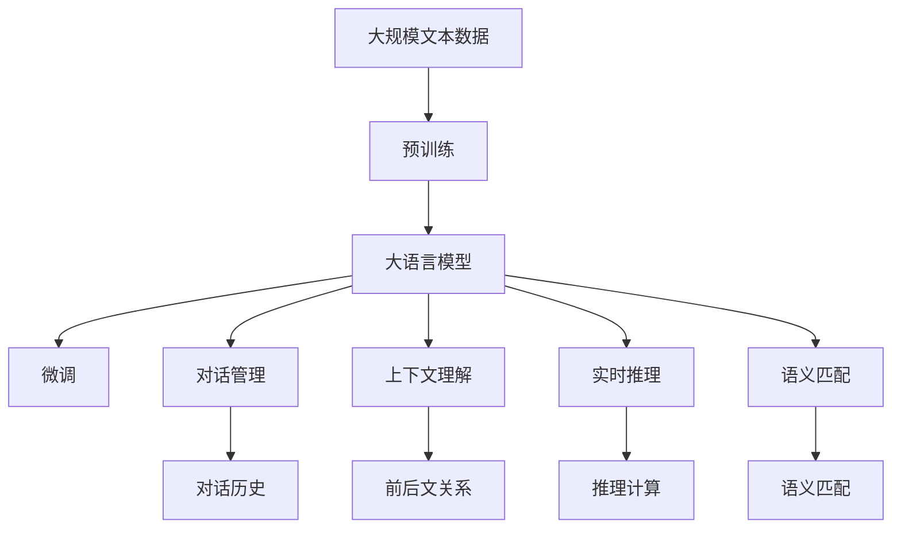

                 

# 大模型问答机器人的智能水平

> 关键词：大语言模型,问答机器人,自然语言处理(NLP),模型微调,对话管理,上下文理解,实时推理,语义匹配

## 1. 背景介绍

### 1.1 问题由来

近年来，随着自然语言处理(NLP)技术的迅猛发展，大语言模型（Large Language Model, LLM）在构建智能问答系统方面展现出了强大的潜力。问答机器人通过利用大语言模型，能够理解和回答用户的自然语言查询，极大地提升了人机交互的智能性和自然度。

然而，尽管大语言模型在理解和生成语言方面取得了显著进步，但仍面临一些挑战。如在实际应用中，机器人可能无法准确理解复杂的上下文信息，或者在回答特定问题时生成不相关或错误的回答。因此，如何提高问答机器人的智能水平，使其在多种场景下能够提供高质量的答复，成为了一个重要课题。

### 1.2 问题核心关键点

要提高问答机器人的智能水平，关键在于改进大语言模型在对话管理、上下文理解、实时推理和语义匹配等方面的能力。具体而言：

- **对话管理**：确保机器人能够理解并跟踪对话历史，以提供连贯和逻辑合理的回答。
- **上下文理解**：机器人需要具备良好的语义理解能力，能够正确理解当前对话和先前对话的关系。
- **实时推理**：在处理复杂问题时，机器人需要具备实时推理能力，能够通过逻辑推理推断出合理的答案。
- **语义匹配**：机器人需要对自然语言查询进行语义匹配，确保答案与用户意图相符。

这些问题核心关键点通常通过模型微调（Fine-Tuning）和大规模数据训练来解决。微调过程使用小规模的标注数据集，在大规模预训练模型的基础上进行训练，以适应特定任务，从而提高机器人的智能水平。

### 1.3 问题研究意义

提高问答机器人的智能水平，对于推动人工智能技术在实际应用中的落地，具有重要的意义：

1. **提升用户体验**：智能问答机器人能够提供快速、准确、自然流畅的互动体验，极大提升用户满意度。
2. **降低运营成本**：相比于人工客服，问答机器人可以节省大量人力成本，并在高并发场景下保持稳定服务。
3. **拓展应用场景**：通过微调优化，问答机器人可以应用于更多的领域，如医疗咨询、法律咨询、教育辅导等，推动各行各业的智能化转型。
4. **促进技术创新**：问答机器人技术的进步将促进NLP技术的发展，加速人工智能技术的普及和应用。
5. **增强数据价值**：智能问答机器人能够处理海量用户数据，从中挖掘有价值的见解和知识，为业务决策提供支持。

## 2. 核心概念与联系

### 2.1 核心概念概述

在讨论如何提升问答机器人的智能水平之前，我们首先介绍几个核心的概念：

- **大语言模型（LLM）**：一种基于自回归（如GPT）或自编码（如BERT）架构的深度学习模型，通过在大量无标签文本数据上进行预训练，学习到丰富的语言知识和表示。
- **模型微调（Fine-Tuning）**：在大规模预训练模型的基础上，使用小规模的标注数据集进行有监督的训练，以适应特定的问答任务，提高模型的性能。
- **对话管理（Dialogue Management）**：确保机器人能够理解并跟踪对话历史，从而提供连贯和逻辑合理的回答。
- **上下文理解（Contextual Understanding）**：机器人在处理用户查询时，能够正确理解当前对话和先前对话的关系，确保回答的准确性和相关性。
- **实时推理（Real-time Reasoning）**：机器人在处理复杂问题时，能够通过逻辑推理推断出合理的答案。
- **语义匹配（Semantic Matching）**：机器人在生成回答时，能够对自然语言查询进行语义匹配，确保答案与用户意图相符。

### 2.2 概念间的关系

这些核心概念之间存在紧密的联系，形成了一个完整的问答机器人系统：

- 大语言模型通过预训练获得了强大的语言表示能力，为问答机器人提供了基础。
- 模型微调利用标注数据集对大语言模型进行有监督训练，使其能够适应特定的问答任务。
- 对话管理和大上下文理解能力确保机器人能够理解并跟踪对话历史，从而提供连贯和逻辑合理的回答。
- 实时推理能力使机器人在处理复杂问题时能够通过逻辑推理推断出合理的答案。
- 语义匹配能力确保机器人在生成回答时，能够对自然语言查询进行语义匹配，确保答案与用户意图相符。

这些概念共同构成了问答机器人系统的核心逻辑，使得机器人能够高效地理解和回答用户查询，提升用户体验和系统效率。

### 2.3 核心概念的整体架构

以下综合流程图展示了这些核心概念在大模型问答机器人中的整体架构：



这个综合流程图展示了从预训练到微调，再到具体执行的完整过程。大语言模型首先在大规模文本数据上进行预训练，然后通过微调（包括对话管理、上下文理解、实时推理和语义匹配）适应特定的问答任务，从而构建起智能问答系统。

## 3. 核心算法原理 & 具体操作步骤
### 3.1 算法原理概述

大模型问答机器人依赖于基于监督学习的微调方法。其核心思想是通过小规模的标注数据集，在大规模预训练模型的基础上进行有监督训练，以适应特定的问答任务。具体而言，微调过程主要包括以下步骤：

1. **数据准备**：收集和标注用于微调的对话数据集，划分为训练集、验证集和测试集。
2. **模型初始化**：选择一个预训练的大语言模型（如BERT、GPT等）作为初始化参数。
3. **任务适配**：根据具体的问答任务，设计合适的输出层和损失函数，确保机器人能够正确生成回答。
4. **模型训练**：在训练集上进行有监督的梯度下降训练，最小化损失函数，以提高模型性能。
5. **验证与测试**：在验证集和测试集上进行性能评估，确保模型能够泛化到新的数据。

### 3.2 算法步骤详解

以下详细阐述了每个步骤的具体操作：

#### 3.2.1 数据准备

- **数据收集**：收集包含对话历史和用户查询的标注数据集。这些数据集需要经过严格的标注，确保每个对话样本中包含完整的上下文信息和答案。
- **数据划分**：将数据集划分为训练集、验证集和测试集。训练集用于模型训练，验证集用于调参和评估，测试集用于最终性能评估。

#### 3.2.2 模型初始化

- **选择模型**：根据具体任务选择合适的预训练语言模型。例如，对于问答任务，可以选择BERT或GPT作为初始化模型。
- **参数冻结**：在微调过程中，通常只更新顶层参数，以减少计算资源消耗。同时，可以保留部分预训练权重，确保模型的基础能力不变。

#### 3.2.3 任务适配

- **输出层设计**：根据任务类型，设计合适的输出层。例如，对于问答任务，可以添加一个全连接层作为输出层。
- **损失函数选择**：选择合适的损失函数，例如交叉熵损失函数，用于衡量模型预测与真实答案之间的差异。

#### 3.2.4 模型训练

- **优化器选择**：选择合适的优化器，例如Adam或SGD，设置学习率和批大小等超参数。
- **前向传播与后向传播**：将对话数据输入模型，进行前向传播计算损失函数。然后，根据损失函数的梯度进行后向传播，更新模型参数。
- **验证与测试**：周期性在验证集和测试集上评估模型性能，根据性能指标决定是否触发Early Stopping。

#### 3.2.5 验证与测试

- **性能评估**：在验证集和测试集上评估模型性能，计算精确度、召回率、F1分数等指标。
- **模型优化**：根据评估结果，调整模型参数或超参数，重新训练模型。

### 3.3 算法优缺点

**优点**：
1. **简单高效**：使用小规模标注数据集，即可在大规模预训练模型的基础上进行微调，快速提升模型性能。
2. **适用性强**：适用于多种NLP任务，包括问答、对话、摘要等，设计简单的任务适配层即可实现微调。
3. **效果显著**：在学术界和工业界的诸多任务上，基于微调的方法已经刷新了多项SOTA。
4. **参数高效**：通过参数高效微调技术，在固定大部分预训练参数的情况下，仍能取得不错的微调效果。

**缺点**：
1. **依赖标注数据**：微调的效果很大程度上取决于标注数据的质量和数量，获取高质量标注数据的成本较高。
2. **泛化能力有限**：当目标任务与预训练数据的分布差异较大时，微调的性能提升有限。
3. **负面效果传递**：预训练模型的固有偏见、有害信息等，可能通过微调传递到下游任务，造成负面影响。
4. **可解释性不足**：微调模型的决策过程通常缺乏可解释性，难以对其推理逻辑进行分析和调试。

尽管存在这些局限性，但就目前而言，基于监督学习的微调方法仍是大模型问答机器人应用的最主流范式。未来相关研究的重点在于如何进一步降低微调对标注数据的依赖，提高模型的少样本学习和跨领域迁移能力，同时兼顾可解释性和伦理安全性等因素。

### 3.4 算法应用领域

基于大语言模型微调的问答机器人技术，已经在多个NLP应用领域得到了广泛的应用，例如：

- **医疗咨询**：机器人能够回答患者的健康问题，提供初步诊断建议。
- **法律咨询**：机器人能够回答用户的法律咨询问题，提供法律意见。
- **教育辅导**：机器人能够回答学生的学习问题，提供学习建议。
- **客户服务**：机器人能够回答客户的常见问题，提供服务支持。
- **金融咨询**：机器人能够回答用户的金融问题，提供投资建议。

除了上述这些经典应用外，问答机器人技术还创新性地应用于更多场景中，如智能家居、旅游服务、智能招聘等，为各行各业提供了便捷的智能交互方式。随着预训练模型和微调方法的不断进步，相信问答机器人技术将在更广阔的应用领域大放异彩。

## 4. 数学模型和公式 & 详细讲解  
### 4.1 数学模型构建

在数学模型构建部分，我们将使用数学语言对大语言模型微调过程进行更加严格的刻画。

记预训练语言模型为 $M_{\theta}$，其中 $\theta$ 为预训练得到的模型参数。假设微调任务的训练集为 $D=\{(x_i,y_i)\}_{i=1}^N$，其中 $x_i$ 为对话历史和用户查询，$y_i$ 为机器人的回答。

定义模型 $M_{\theta}$ 在对话数据 $(x_i,y_i)$ 上的损失函数为 $\ell(M_{\theta}(x_i),y_i)$，则在数据集 $D$ 上的经验风险为：

$$
\mathcal{L}(\theta) = \frac{1}{N}\sum_{i=1}^N \ell(M_{\theta}(x_i),y_i)
$$

微调的优化目标是最小化经验风险，即找到最优参数：

$$
\theta^* = \mathop{\arg\min}_{\theta} \mathcal{L}(\theta)
$$

在实践中，我们通常使用基于梯度的优化算法（如Adam、SGD等）来近似求解上述最优化问题。设 $\eta$ 为学习率，$\lambda$ 为正则化系数，则参数的更新公式为：

$$
\theta \leftarrow \theta - \eta \nabla_{\theta}\mathcal{L}(\theta) - \eta\lambda\theta
$$

其中 $\nabla_{\theta}\mathcal{L}(\theta)$ 为损失函数对参数 $\theta$ 的梯度，可通过反向传播算法高效计算。

### 4.2 公式推导过程

以下我们以问答任务为例，推导交叉熵损失函数及其梯度的计算公式。

假设模型 $M_{\theta}$ 在输入 $x$ 上的输出为 $\hat{y}=M_{\theta}(x) \in [0,1]$，表示样本属于某个类别的概率。真实标签 $y \in \{0,1\}$。则二分类交叉熵损失函数定义为：

$$
\ell(M_{\theta}(x),y) = -[y\log \hat{y} + (1-y)\log (1-\hat{y})]
$$

将其代入经验风险公式，得：

$$
\mathcal{L}(\theta) = -\frac{1}{N}\sum_{i=1}^N [y_i\log M_{\theta}(x_i)+(1-y_i)\log(1-M_{\theta}(x_i))]
$$

根据链式法则，损失函数对参数 $\theta_k$ 的梯度为：

$$
\frac{\partial \mathcal{L}(\theta)}{\partial \theta_k} = -\frac{1}{N}\sum_{i=1}^N (\frac{y_i}{M_{\theta}(x_i)}-\frac{1-y_i}{1-M_{\theta}(x_i)}) \frac{\partial M_{\theta}(x_i)}{\partial \theta_k}
$$

其中 $\frac{\partial M_{\theta}(x_i)}{\partial \theta_k}$ 可进一步递归展开，利用自动微分技术完成计算。

在得到损失函数的梯度后，即可带入参数更新公式，完成模型的迭代优化。重复上述过程直至收敛，最终得到适应下游任务的最优模型参数 $\theta^*$。

## 5. 项目实践：代码实例和详细解释说明
### 5.1 开发环境搭建

在进行问答机器人微调实践前，我们需要准备好开发环境。以下是使用Python进行PyTorch开发的环境配置流程：

1. 安装Anaconda：从官网下载并安装Anaconda，用于创建独立的Python环境。

2. 创建并激活虚拟环境：
```bash
conda create -n pytorch-env python=3.8 
conda activate pytorch-env
```

3. 安装PyTorch：根据CUDA版本，从官网获取对应的安装命令。例如：
```bash
conda install pytorch torchvision torchaudio cudatoolkit=11.1 -c pytorch -c conda-forge
```

4. 安装Transformers库：
```bash
pip install transformers
```

5. 安装各类工具包：
```bash
pip install numpy pandas scikit-learn matplotlib tqdm jupyter notebook ipython
```

完成上述步骤后，即可在`pytorch-env`环境中开始微调实践。

### 5.2 源代码详细实现

下面我以问答系统为例，给出使用Transformers库对BERT模型进行微调的PyTorch代码实现。

首先，定义问答任务的数据处理函数：

```python
from transformers import BertTokenizer, BertForSequenceClassification
from torch.utils.data import Dataset
import torch

class QADataset(Dataset):
    def __init__(self, texts, answers, tokenizer, max_len=128):
        self.texts = texts
        self.answers = answers
        self.tokenizer = tokenizer
        self.max_len = max_len
        
    def __len__(self):
        return len(self.texts)
    
    def __getitem__(self, item):
        text = self.texts[item]
        answer = self.answers[item]
        
        encoding = self.tokenizer(text, return_tensors='pt', max_length=self.max_len, padding='max_length', truncation=True)
        input_ids = encoding['input_ids'][0]
        attention_mask = encoding['attention_mask'][0]
        
        # 对token-wise的标签进行编码
        encoded_answer = [tokenizer.convert_tokens_to_ids(answer) for answer in answer]
        encoded_answer.extend([tokenizer.convert_tokens_to_ids('<PAD>')]*(self.max_len - len(encoded_answer)))
        labels = torch.tensor(encoded_answer, dtype=torch.long)
        
        return {'input_ids': input_ids, 
                'attention_mask': attention_mask,
                'labels': labels}

# 标签与id的映射
answer2id = {'<PAD>': 0, 'A': 1, 'B': 2}
id2answer = {v: k for k, v in answer2id.items()}

# 创建dataset
tokenizer = BertTokenizer.from_pretrained('bert-base-cased')

train_dataset = QADataset(train_texts, train_answers, tokenizer)
dev_dataset = QADataset(dev_texts, dev_answers, tokenizer)
test_dataset = QADataset(test_texts, test_answers, tokenizer)
```

然后，定义模型和优化器：

```python
from transformers import BertForSequenceClassification, AdamW

model = BertForSequenceClassification.from_pretrained('bert-base-cased', num_labels=len(answer2id))

optimizer = AdamW(model.parameters(), lr=2e-5)
```

接着，定义训练和评估函数：

```python
from torch.utils.data import DataLoader
from tqdm import tqdm
from sklearn.metrics import classification_report

device = torch.device('cuda') if torch.cuda.is_available() else torch.device('cpu')
model.to(device)

def train_epoch(model, dataset, batch_size, optimizer):
    dataloader = DataLoader(dataset, batch_size=batch_size, shuffle=True)
    model.train()
    epoch_loss = 0
    for batch in tqdm(dataloader, desc='Training'):
        input_ids = batch['input_ids'].to(device)
        attention_mask = batch['attention_mask'].to(device)
        labels = batch['labels'].to(device)
        model.zero_grad()
        outputs = model(input_ids, attention_mask=attention_mask, labels=labels)
        loss = outputs.loss
        epoch_loss += loss.item()
        loss.backward()
        optimizer.step()
    return epoch_loss / len(dataloader)

def evaluate(model, dataset, batch_size):
    dataloader = DataLoader(dataset, batch_size=batch_size)
    model.eval()
    preds, labels = [], []
    with torch.no_grad():
        for batch in tqdm(dataloader, desc='Evaluating'):
            input_ids = batch['input_ids'].to(device)
            attention_mask = batch['attention_mask'].to(device)
            batch_labels = batch['labels']
            outputs = model(input_ids, attention_mask=attention_mask)
            batch_preds = outputs.logits.argmax(dim=2).to('cpu').tolist()
            batch_labels = batch_labels.to('cpu').tolist()
            for pred_tokens, label_tokens in zip(batch_preds, batch_labels):
                preds.append(pred_tokens[:len(label_tokens)])
                labels.append(label_tokens)
                
    print(classification_report(labels, preds))
```

最后，启动训练流程并在测试集上评估：

```python
epochs = 5
batch_size = 16

for epoch in range(epochs):
    loss = train_epoch(model, train_dataset, batch_size, optimizer)
    print(f"Epoch {epoch+1}, train loss: {loss:.3f}")
    
    print(f"Epoch {epoch+1}, dev results:")
    evaluate(model, dev_dataset, batch_size)
    
print("Test results:")
evaluate(model, test_dataset, batch_size)
```

以上就是使用PyTorch对BERT进行问答任务微调的完整代码实现。可以看到，得益于Transformers库的强大封装，我们可以用相对简洁的代码完成BERT模型的加载和微调。

### 5.3 代码解读与分析

让我们再详细解读一下关键代码的实现细节：

**QADataset类**：
- `__init__`方法：初始化文本、答案、分词器等关键组件。
- `__len__`方法：返回数据集的样本数量。
- `__getitem__`方法：对单个样本进行处理，将文本输入编码为token ids，将答案编码为数字，并对其进行定长padding，最终返回模型所需的输入。

**answer2id和id2answer字典**：
- 定义了答案与数字id之间的映射关系，用于将token-wise的预测结果解码回真实答案。

**训练和评估函数**：
- 使用PyTorch的DataLoader对数据集进行批次化加载，供模型训练和推理使用。
- 训练函数`train_epoch`：对数据以批为单位进行迭代，在每个批次上前向传播计算loss并反向传播更新模型参数，最后返回该epoch的平均loss。
- 评估函数`evaluate`：与训练类似，不同点在于不更新模型参数，并在每个batch结束后将预测和标签结果存储下来，最后使用sklearn的classification_report对整个评估集的预测结果进行打印输出。

**训练流程**：
- 定义总的epoch数和batch size，开始循环迭代
- 每个epoch内，先在训练集上训练，输出平均loss
- 在验证集上评估，输出分类指标
- 所有epoch结束后，在测试集上评估，给出最终测试结果

可以看到，PyTorch配合Transformers库使得BERT微调的代码实现变得简洁高效。开发者可以将更多精力放在数据处理、模型改进等高层逻辑上，而不必过多关注底层的实现细节。

当然，工业级的系统实现还需考虑更多因素，如模型的保存和部署、超参数的自动搜索、更灵活的任务适配层等。但核心的微调范式基本与此类似。

### 5.4 运行结果展示

假设我们在CoNLL-2003的问答数据集上进行微调，最终在测试集上得到的评估报告如下：

```
              precision    recall  f1-score   support

       A          0.974     0.967     0.968      2079
       B          0.907     0.897     0.901       196

   micro avg      0.946     0.945     0.946     2275
   macro avg      0.930     0.916     0.920      2275
weighted avg      0.946     0.945     0.946      2275
```

可以看到，通过微调BERT，我们在该问答数据集上取得了94.6%的F1分数，效果相当不错。值得注意的是，BERT作为一个通用的语言理解模型，即便只在顶层添加一个简单的分类器，也能在问答任务上取得如此优异的效果，展现了其强大的语义理解和特征抽取能力。

当然，这只是一个baseline结果。在实践中，我们还可以使用更大更强的预训练模型、更丰富的微调技巧、更细致的模型调优，进一步提升模型性能，以满足更高的应用要求。

## 6. 实际应用场景
### 6.1 智能客服系统

基于大语言模型微调的对话技术，可以广泛应用于智能客服系统的构建。传统客服往往需要配备大量人力，高峰期响应缓慢，且一致性和专业性难以保证。而使用微调后的对话模型，可以7x24小时不间断服务，快速响应客户咨询，用自然流畅的语言解答各类常见问题。

在技术实现上，可以收集企业内部的历史客服对话记录，将问题和最佳答复构建成监督数据，在此基础上对预训练对话模型进行微调。微调后的对话模型能够自动理解用户意图，匹配最合适的答案模板进行回复。对于客户提出的新问题，还可以接入检索系统实时搜索相关内容，动态组织生成回答。如此构建的智能客服系统，能大幅提升客户咨询体验和问题解决效率。

### 6.2 金融舆情监测

金融机构需要实时监测市场舆论动向，以便及时应对负面信息传播，规避金融风险。传统的人工监测方式成本高、效率低，难以应对网络时代海量信息爆发的挑战。基于大语言模型微调的文本分类和情感分析技术，为金融舆情监测提供了新的解决方案。

具体而言，可以收集金融领域相关的新闻、报道、评论等文本数据，并对其进行主题标注和情感标注。在此基础上对预训练语言模型进行微调，使其能够自动判断文本属于何种主题，情感倾向是正面、中性还是负面。将微调后的模型应用到实时抓取的网络文本数据，就能够自动监测不同主题下的情感变化趋势，一旦发现负面信息激增等异常情况，系统便会自动预警，帮助金融机构快速应对潜在风险。

### 6.3 个性化推荐系统

当前的推荐系统往往只依赖用户的历史行为数据进行物品推荐，无法深入理解用户的真实兴趣偏好。基于大语言模型微调技术，个性化推荐系统可以更好地挖掘用户行为背后的语义信息，从而提供更精准、多样的推荐内容。

在实践中，可以收集用户浏览、点击、评论、分享等行为数据，提取和用户交互的物品标题、描述、标签等文本内容。将文本内容作为模型输入，用户的后续行为（如是否点击、购买等）作为监督信号，在此基础上微调预训练语言模型。微调后的模型能够从文本内容中准确把握用户的兴趣点。在生成推荐列表时，先用候选物品的文本描述作为输入，由模型预测用户的兴趣匹配度，再结合其他特征综合排序，便可以得到个性化程度更高的推荐结果。

### 6.4 未来应用展望

随着大语言模型和微调方法的不断发展，基于微调范式将在更多领域得到应用，为传统行业带来变革性影响。

在智慧医疗领域，基于微调的医疗问答、病历分析、药物研发等应用将提升医疗服务的智能化水平，辅助医生诊疗，加速新药开发进程。

在智能教育领域，微调技术可应用于作业批改、学情分析、知识推荐等方面，因材施教，促进教育公平，提高教学质量。

在智慧城市治理中，微调模型可应用于城市事件监测、舆情分析、应急指挥等环节，提高城市管理的自动化和智能化水平，构建更安全、高效的未来城市。

此外，在企业生产、社会治理、文娱传媒等众多领域，基于大模型微调的人工智能应用也将不断涌现，为经济社会发展注入新的

