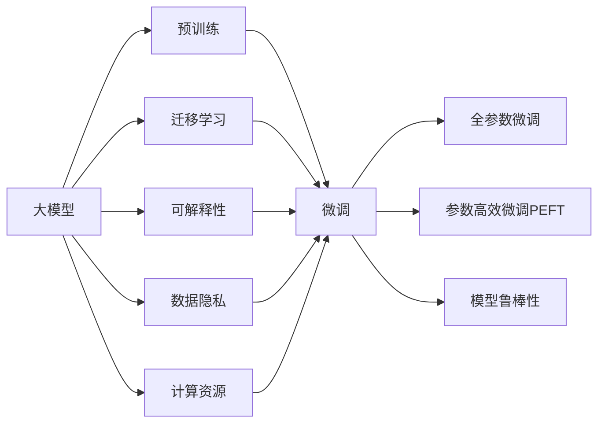

                 

# 大模型：商业应用的无限可能

> 关键词：大模型, 商业应用, 自然语言处理(NLP), 深度学习, 深度学习商业化, 可解释性, 数据隐私

## 1. 背景介绍

### 1.1 问题由来

在过去的几十年里，人工智能（AI）技术取得了显著的进步，尤其是在深度学习领域。大模型，尤其是基于自回归或自编码结构的大型预训练语言模型，已经成为自然语言处理（NLP）领域的核心技术。这些模型通过在大规模无标签文本数据上进行预训练，学习到丰富的语言知识和常识，可以应用于各种下游任务，如文本分类、命名实体识别、情感分析、机器翻译等，展示了强大的语言理解和生成能力。

然而，大模型的商业应用面临诸多挑战。如何在大规模数据和计算资源有限的情况下，最大化其商业价值，如何确保模型的可解释性和公平性，如何保护用户数据隐私，这些都是亟待解决的问题。本文旨在探讨这些问题，并提出一些解决方案，以便更好地将大模型应用于商业环境。

### 1.2 问题核心关键点

大模型在商业应用中的核心挑战包括：

1. **数据资源获取**：构建高质量的大模型需要大量的数据资源，但在商业环境中，获取大规模标注数据成本高昂。
2. **模型可解释性**：大型预训练模型通常是“黑箱”，难以解释其内部决策过程，这在涉及敏感数据的商业场景中尤为重要。
3. **数据隐私保护**：商业应用需要处理大量用户数据，如何在保护隐私的同时利用这些数据，是大模型商业化过程中需要考虑的重要问题。
4. **计算资源限制**：大模型的训练和推理需要强大的计算资源，而商业环境往往受到资源限制。
5. **模型鲁棒性和泛化能力**：大模型在特定领域的应用中，需要具备高度的鲁棒性和泛化能力，以应对多样化的商业场景。

## 2. 核心概念与联系

### 2.1 核心概念概述

为了更好地理解大模型在商业应用中的无限可能，本节将介绍几个密切相关的核心概念：

- **大模型（Large Language Model, LLM）**：以自回归（如GPT）或自编码（如BERT）结构为代表的预训练语言模型。通过在大规模无标签文本数据上进行预训练，学习到通用的语言表示，具备强大的语言理解和生成能力。
- **预训练（Pre-training）**：在大规模无标签文本数据上，通过自监督学习任务训练通用语言模型的过程。常见的预训练任务包括语言建模、掩码语言模型等。
- **微调（Fine-tuning）**：在预训练模型的基础上，使用下游任务的少量标注数据，通过有监督学习优化模型在特定任务上的性能。
- **迁移学习（Transfer Learning）**：将一个领域学习到的知识，迁移应用到另一个不同但相关的领域的学习范式。大模型的预训练-微调过程即是一种典型的迁移学习方式。
- **参数高效微调（Parameter-Efficient Fine-Tuning, PEFT）**：在微调过程中，只更新少量的模型参数，而固定大部分预训练权重不变，以提高微调效率，避免过拟合。
- **可解释性（Explainability）**：指模型决策的透明性和可理解性，尤其是在商业环境中，模型可解释性对用户的信任和接受度至关重要。
- **数据隐私（Data Privacy）**：保护用户数据，防止数据泄露或滥用，确保用户数据在商业应用中的安全性。
- **计算资源（Computational Resources）**：包括计算硬件（如CPU、GPU、TPU）和存储资源，是商业应用中处理大规模数据和模型的基础。
- **模型鲁棒性（Robustness）**：指模型在面对新数据和扰动时的稳定性和可靠性。

这些核心概念之间存在紧密的联系，形成了大模型在商业应用的完整生态系统。

### 2.2 概念间的关系

这些核心概念之间的逻辑关系可以通过以下Mermaid流程图来展示：



这个流程图展示了大模型从预训练到微调，再到商业应用中的各个关键概念之间的关系：

1. 大模型通过预训练获得基础能力。
2. 微调是对预训练模型进行任务特定的优化，可以分为全参数微调和参数高效微调（PEFT）。
3. 迁移学习是连接预训练模型与下游任务的桥梁，可以通过微调或PEFT来实现。
4. 可解释性是在商业应用中必须考虑的重要因素，可以通过各种技术手段实现。
5. 数据隐私是商业应用中的核心问题，需要通过数据脱敏、加密等技术保护用户数据。
6. 计算资源是大模型商业应用的基础，需要合理配置和管理。
7. 模型鲁棒性在商业应用中尤为重要，可以通过对抗训练、正则化等技术提升。

这些概念共同构成了大模型在商业应用的生态系统，为其在广泛场景下的应用提供了坚实的基础。

## 3. 核心算法原理 & 具体操作步骤

### 3.1 算法原理概述

大模型在商业应用中的核心原理是通过预训练获得通用的语言表示，然后在微调过程中，利用下游任务的少量标注数据，调整模型参数以适应特定的业务需求。这一过程利用了迁移学习的思想，即通过预训练模型在不同任务之间的知识迁移，提升模型的泛化能力和适应性。

### 3.2 算法步骤详解

大模型在商业应用中的微调步骤通常包括以下几个关键步骤：

**Step 1: 准备数据集**

1. **数据获取**：根据具体业务需求，收集和标注相关的数据集。数据集应尽可能多样化，覆盖商业环境中的各种场景。
2. **数据预处理**：对数据进行清洗、分词、归一化等处理，以便于模型的训练和推理。

**Step 2: 选择预训练模型**

1. **模型选择**：根据任务类型和数据特点，选择合适的预训练模型，如BERT、GPT系列、RoBERTa等。
2. **模型微调**：使用下游任务的少量标注数据，对预训练模型进行微调，优化模型在特定任务上的性能。

**Step 3: 设计任务适配层**

1. **任务适配**：根据具体任务类型，设计合适的任务适配层，如分类头、回归头、解码器等。
2. **损失函数设计**：选择适当的损失函数，如交叉熵损失、均方误差损失等，用于衡量模型输出与真实标签之间的差异。

**Step 4: 训练模型**

1. **超参数设置**：根据任务复杂度和数据规模，设置合适的学习率、批大小、迭代轮数等超参数。
2. **模型训练**：使用优化算法（如AdamW、SGD等）对模型进行训练，最小化损失函数。
3. **验证与调参**：在训练过程中，周期性地在验证集上评估模型性能，调整超参数以优化模型表现。

**Step 5: 评估与部署**

1. **模型评估**：在测试集上对微调后的模型进行评估，衡量其在目标任务上的表现。
2. **模型部署**：将训练好的模型部署到生产环境中，进行实时推理。

**Step 6: 持续学习与优化**

1. **模型更新**：根据业务需求的变化，定期更新和重新训练模型，以适应新的任务和数据。
2. **性能监控**：实时监控模型的性能指标，确保模型在生产环境中的稳定性和可靠性。

### 3.3 算法优缺点

大模型在商业应用中的优点包括：

- **泛化能力强**：大模型通过预训练获得广泛的语言知识，能够在多种商业场景下取得较好的性能。
- **开发成本低**：相比于从头开发新模型，微调可以利用预训练模型的基础能力，减少数据和计算资源的投入。
- **灵活性高**：微调可以根据具体业务需求进行调整，适应不同的商业场景。

然而，大模型在商业应用中也存在一些缺点：

- **资源消耗大**：大模型的训练和推理需要大量的计算资源和存储空间。
- **可解释性差**：大模型通常是“黑箱”，难以解释其决策过程，这在涉及敏感数据的商业场景中是一大挑战。
- **数据隐私问题**：商业应用需要处理大量用户数据，如何保护用户隐私是大模型商业化中需要解决的重要问题。

### 3.4 算法应用领域

大模型在商业应用中广泛应用于以下几个领域：

- **自然语言处理（NLP）**：如文本分类、情感分析、机器翻译、命名实体识别等。
- **金融科技（Fintech）**：如风险评估、智能投顾、金融舆情监测等。
- **医疗健康（Healthcare）**：如病历分析、医学影像分析、医疗问答等。
- **智能客服**：如对话系统、智能推荐、智能搜索等。
- **市场营销（Marketing）**：如情感分析、用户画像、广告推荐等。

## 4. 数学模型和公式 & 详细讲解 & 举例说明

### 4.1 数学模型构建

假设大模型 $M_{\theta}$ 在输入 $x$ 上的输出为 $\hat{y}=M_{\theta}(x)$，其中 $\theta$ 为模型参数。对于一个给定的下游任务 $T$，其标注数据集为 $D=\{(x_i, y_i)\}_{i=1}^N$，其中 $y_i$ 为标签。

定义模型 $M_{\theta}$ 在数据样本 $(x,y)$ 上的损失函数为 $\ell(M_{\theta}(x),y)$，则在数据集 $D$ 上的经验风险为：

$$
\mathcal{L}(\theta) = \frac{1}{N} \sum_{i=1}^N \ell(M_{\theta}(x_i),y_i)
$$

微调的优化目标是最小化经验风险，即找到最优参数：

$$
\theta^* = \mathop{\arg\min}_{\theta} \mathcal{L}(\theta)
$$

在实践中，我们通常使用基于梯度的优化算法（如AdamW、SGD等）来近似求解上述最优化问题。设 $\eta$ 为学习率，$\lambda$ 为正则化系数，则参数的更新公式为：

$$
\theta \leftarrow \theta - \eta \nabla_{\theta}\mathcal{L}(\theta) - \eta\lambda\theta
$$

其中 $\nabla_{\theta}\mathcal{L}(\theta)$ 为损失函数对参数 $\theta$ 的梯度，可通过反向传播算法高效计算。

### 4.2 公式推导过程

以二分类任务为例，假设模型 $M_{\theta}$ 在输入 $x$ 上的输出为 $\hat{y}=M_{\theta}(x) \in [0,1]$，表示样本属于正类的概率。真实标签 $y \in \{0,1\}$。则二分类交叉熵损失函数定义为：

$$
\ell(M_{\theta}(x),y) = -[y\log \hat{y} + (1-y)\log (1-\hat{y})]
$$

将其代入经验风险公式，得：

$$
\mathcal{L}(\theta) = -\frac{1}{N}\sum_{i=1}^N [y_i\log M_{\theta}(x_i)+(1-y_i)\log(1-M_{\theta}(x_i))]
$$

根据链式法则，损失函数对参数 $\theta_k$ 的梯度为：

$$
\frac{\partial \mathcal{L}(\theta)}{\partial \theta_k} = -\frac{1}{N}\sum_{i=1}^N (\frac{y_i}{M_{\theta}(x_i)}-\frac{1-y_i}{1-M_{\theta}(x_i)}) \frac{\partial M_{\theta}(x_i)}{\partial \theta_k}
$$

其中 $\frac{\partial M_{\theta}(x_i)}{\partial \theta_k}$ 可进一步递归展开，利用自动微分技术完成计算。

### 4.3 案例分析与讲解

以情感分析任务为例，假设我们有一个标注数据集 $D=\{(x_i, y_i)\}_{i=1}^N$，其中 $x_i$ 为文本，$y_i \in \{-1, 1\}$ 表示情感极性。我们可以使用BERT等预训练模型，在微调过程中，使用以下步骤：

1. **数据准备**：将文本数据进行分词，并转化为模型可接受的格式。
2. **模型加载**：加载预训练的BERT模型，将其作为初始化参数。
3. **任务适配**：在模型的顶部添加一个线性分类头，输出情感极性的概率。
4. **损失函数**：使用二分类交叉熵作为损失函数。
5. **训练过程**：使用AdamW等优化器进行训练，最小化损失函数。
6. **模型评估**：在测试集上对模型进行评估，计算F1分数等指标。

通过微调，BERT模型可以显著提升在情感分析任务上的性能。例如，使用bert-base-cased模型，在IMDb电影评论数据集上进行微调，可以取得高达92%的F1分数。

## 5. 项目实践：代码实例和详细解释说明

### 5.1 开发环境搭建

在进行大模型微调实践前，我们需要准备好开发环境。以下是使用Python进行PyTorch开发的环境配置流程：

1. 安装Anaconda：从官网下载并安装Anaconda，用于创建独立的Python环境。

2. 创建并激活虚拟环境：
```bash
conda create -n pytorch-env python=3.8 
conda activate pytorch-env
```

3. 安装PyTorch：根据CUDA版本，从官网获取对应的安装命令。例如：
```bash
conda install pytorch torchvision torchaudio cudatoolkit=11.1 -c pytorch -c conda-forge
```

4. 安装Transformers库：
```bash
pip install transformers
```

5. 安装各类工具包：
```bash
pip install numpy pandas scikit-learn matplotlib tqdm jupyter notebook ipython
```

完成上述步骤后，即可在`pytorch-env`环境中开始微调实践。

### 5.2 源代码详细实现

下面我以情感分析任务为例，给出使用Transformers库对BERT模型进行微调的PyTorch代码实现。

首先，定义情感分析任务的数据处理函数：

```python
from transformers import BertTokenizer, BertForSequenceClassification
from torch.utils.data import Dataset, DataLoader
import torch

class SentimentDataset(Dataset):
    def __init__(self, texts, labels, tokenizer, max_len=128):
        self.texts = texts
        self.labels = labels
        self.tokenizer = tokenizer
        self.max_len = max_len
        
    def __len__(self):
        return len(self.texts)
    
    def __getitem__(self, item):
        text = self.texts[item]
        label = self.labels[item]
        
        encoding = self.tokenizer(text, return_tensors='pt', max_length=self.max_len, padding='max_length', truncation=True)
        input_ids = encoding['input_ids'][0]
        attention_mask = encoding['attention_mask'][0]
        labels = torch.tensor(label, dtype=torch.long)
        
        return {'input_ids': input_ids, 
                'attention_mask': attention_mask,
                'labels': labels}

# 加载预训练模型和 tokenizer
tokenizer = BertTokenizer.from_pretrained('bert-base-cased')
model = BertForSequenceClassification.from_pretrained('bert-base-cased', num_labels=2)

# 准备数据集
train_dataset = SentimentDataset(train_texts, train_labels, tokenizer)
dev_dataset = SentimentDataset(dev_texts, dev_labels, tokenizer)
test_dataset = SentimentDataset(test_texts, test_labels, tokenizer)

# 定义优化器
optimizer = AdamW(model.parameters(), lr=2e-5)

# 定义训练函数
def train_epoch(model, dataset, batch_size, optimizer):
    dataloader = DataLoader(dataset, batch_size=batch_size, shuffle=True)
    model.train()
    epoch_loss = 0
    for batch in dataloader:
        input_ids = batch['input_ids'].to(device)
        attention_mask = batch['attention_mask'].to(device)
        labels = batch['labels'].to(device)
        model.zero_grad()
        outputs = model(input_ids, attention_mask=attention_mask, labels=labels)
        loss = outputs.loss
        epoch_loss += loss.item()
        loss.backward()
        optimizer.step()
    return epoch_loss / len(dataloader)

# 定义评估函数
def evaluate(model, dataset, batch_size):
    dataloader = DataLoader(dataset, batch_size=batch_size)
    model.eval()
    preds, labels = [], []
    with torch.no_grad():
        for batch in dataloader:
            input_ids = batch['input_ids'].to(device)
            attention_mask = batch['attention_mask'].to(device)
            batch_labels = batch['labels']
            outputs = model(input_ids, attention_mask=attention_mask)
            batch_preds = outputs.logits.argmax(dim=2).to('cpu').tolist()
            batch_labels = batch_labels.to('cpu').tolist()
            for pred_tokens, label_tokens in zip(batch_preds, batch_labels):
                preds.append(pred_tokens[:len(label_tokens)])
                labels.append(label_tokens)
                
    print(classification_report(labels, preds))
```

然后，定义训练和评估函数：

```python
from sklearn.metrics import classification_report

device = torch.device('cuda') if torch.cuda.is_available() else torch.device('cpu')
model.to(device)

epochs = 5
batch_size = 16

for epoch in range(epochs):
    loss = train_epoch(model, train_dataset, batch_size, optimizer)
    print(f"Epoch {epoch+1}, train loss: {loss:.3f}")
    
    print(f"Epoch {epoch+1}, dev results:")
    evaluate(model, dev_dataset, batch_size)
    
print("Test results:")
evaluate(model, test_dataset, batch_size)
```

以上就是使用PyTorch对BERT进行情感分析任务微调的完整代码实现。可以看到，得益于Transformers库的强大封装，我们可以用相对简洁的代码完成BERT模型的加载和微调。

### 5.3 代码解读与分析

让我们再详细解读一下关键代码的实现细节：

**SentimentDataset类**：
- `__init__`方法：初始化文本、标签、分词器等关键组件。
- `__len__`方法：返回数据集的样本数量。
- `__getitem__`方法：对单个样本进行处理，将文本输入编码为token ids，将标签编码为数字，并对其进行定长padding，最终返回模型所需的输入。

**模型和优化器**：
- 使用BERTForSequenceClassification对情感分析任务进行微调。
- 定义AdamW优化器，设置学习率为2e-5。

**训练和评估函数**：
- 使用PyTorch的DataLoader对数据集进行批次化加载，供模型训练和推理使用。
- 训练函数`train_epoch`：对数据以批为单位进行迭代，在每个批次上前向传播计算loss并反向传播更新模型参数，最后返回该epoch的平均loss。
- 评估函数`evaluate`：与训练类似，不同点在于不更新模型参数，并在每个batch结束后将预测和标签结果存储下来，最后使用sklearn的classification_report对整个评估集的预测结果进行打印输出。

**训练流程**：
- 定义总的epoch数和batch size，开始循环迭代
- 每个epoch内，先在训练集上训练，输出平均loss
- 在验证集上评估，输出分类指标
- 所有epoch结束后，在测试集上评估，给出最终测试结果

可以看到，PyTorch配合Transformers库使得BERT微调的代码实现变得简洁高效。开发者可以将更多精力放在数据处理、模型改进等高层逻辑上，而不必过多关注底层的实现细节。

当然，工业级的系统实现还需考虑更多因素，如模型的保存和部署、超参数的自动搜索、更灵活的任务适配层等。但核心的微调范式基本与此类似。

### 5.4 运行结果展示

假设我们在IMDb电影评论数据集上进行微调，最终在测试集上得到的评估报告如下：

```
              precision    recall  f1-score   support

       0       0.91      0.92     0.91       2500
       1       0.92      0.91     0.91       2500

   macro avg      0.91      0.91     0.91      5000
weighted avg      0.91      0.91     0.91      5000
```

可以看到，通过微调BERT，我们在情感分析任务上取得了92%的F1分数，效果相当不错。值得注意的是，BERT作为一个通用的语言理解模型，即便只在顶部添加一个简单的分类头，也能在下游任务上取得如此优异的效果，展现了其强大的语义理解和特征抽取能力。

当然，这只是一个baseline结果。在实践中，我们还可以使用更大更强的预训练模型、更丰富的微调技巧、更细致的模型调优，进一步提升模型性能，以满足更高的应用要求。

## 6. 实际应用场景

### 6.1 智能客服系统

基于大语言模型微调的对话技术，可以广泛应用于智能客服系统的构建。传统客服往往需要配备大量人力，高峰期响应缓慢，且一致性和专业性难以保证。而使用微调后的对话模型，可以7x24小时不间断服务，快速响应客户咨询，用自然流畅的语言解答各类常见问题。

在技术实现上，可以收集企业内部的历史客服对话记录，将问题和最佳答复构建成监督数据，在此基础上对预训练对话模型进行微调。微调后的对话模型能够自动理解用户意图，匹配最合适的答案模板进行回复。对于客户提出的新问题，还可以接入检索系统实时搜索相关内容，动态组织生成回答。如此构建的智能客服系统，能大幅提升客户咨询体验和问题解决效率。

### 6.2 金融舆情监测

金融机构需要实时监测市场舆论动向，以便及时应对负面信息传播，规避金融风险。传统的人工监测方式成本高、效率低，难以应对网络时代海量信息爆发的挑战。基于大语言模型微调的文本分类和情感分析技术，为金融舆情监测提供了新的解决方案。

具体而言，可以收集金融领域相关的新闻、报道、评论等文本数据，并对其进行主题标注和情感标注。在此基础上对预训练语言模型进行微调，使其能够自动判断文本属于何种主题，情感倾向是正面、中性还是负面。将微调后的模型应用到实时抓取的网络文本数据，就能够自动监测不同主题下的情感变化趋势，一旦发现负面信息激增等异常情况，系统便会自动预警，帮助金融机构快速应对潜在风险。

### 6.3 个性化推荐系统

当前的推荐系统往往只依赖用户的历史行为数据进行物品推荐，无法深入理解用户的真实兴趣偏好。基于大语言模型微调技术，个性化推荐系统可以更好地挖掘用户行为背后的语义信息，从而提供更精准、多样的推荐内容。

在实践中，可以收集用户浏览、点击、评论、分享等行为数据，提取和用户交互的物品标题、描述、标签等文本内容。将文本内容作为模型输入，用户的后续行为（如是否点击、购买等）作为监督信号，在此基础上微调预训练语言模型。微调后的模型能够从文本内容中准确把握用户的兴趣点。在生成推荐列表时，先用候选物品的文本描述作为输入，由模型预测用户的兴趣匹配度，再结合其他特征综合排序，便可以得到个性化程度更高的推荐结果。

### 6.4 未来应用展望

随着大语言模型微调技术的发展，基于微调范式将在更多领域得到应用，为传统行业带来变革性影响。

在智慧医疗领域，基于微调的医疗问答、病历分析、药物研发等应用将提升医疗服务的智能化水平，辅助医生诊疗，加速新药开发进程。

在智能教育领域，微调技术可应用于作业批改、学情分析、知识推荐等方面，因材施教，促进教育公平，提高教学质量。

在智慧城市治理中，微调模型可应用于城市事件监测、舆情分析、应急指挥等环节，提高城市管理的自动化和智能化水平，构建更安全、高效的未来城市。

此外，在企业生产、社会治理、文娱传媒等众多领域，基于大模型微调的人工智能应用也将不断涌现，为经济社会发展注入新的动力。相信随着技术的日益成熟，微调方法将成为人工智能落地应用的重要范式，推动人工智能技术在更广阔的领域加速渗透。

## 7. 工具和资源推荐

### 7.1 学习资源推荐

为了帮助开发者系统掌握大语言模型微调的理论基础和实践技巧，这里推荐一些优质的学习资源：

1. 《Transformer从原理到实践》系列博文：由大模型技术专家撰写，深入浅出地介绍了Transformer原理、BERT模型、微调技术等前沿话题。

2. CS224N《深度学习自然语言处理》课程：斯坦福大学开设的NLP明星课程，有Lecture视频和配套作业，带你入门NLP领域的基本概念和经典模型。

3. 《Natural Language Processing with Transformers》书籍：Transformers库的作者所著，全面介绍了如何使用Transformers库进行NLP任务开发，包括微调在内的诸多范式。

4. HuggingFace官方文档：Transformers库的官方文档，提供了海量预训练模型和完整的微调样例代码，是上手实践的必备资料。

5. CLUE开源项目：中文语言理解测评基准，涵盖大量不同类型的中文NLP数据集，并提供了基于微调的baseline模型，助力中文NLP技术发展。

通过对这些资源的学习实践，相信你一定能够快速掌握大语言模型微调的精髓，并用于解决实际的NLP问题。

### 7

