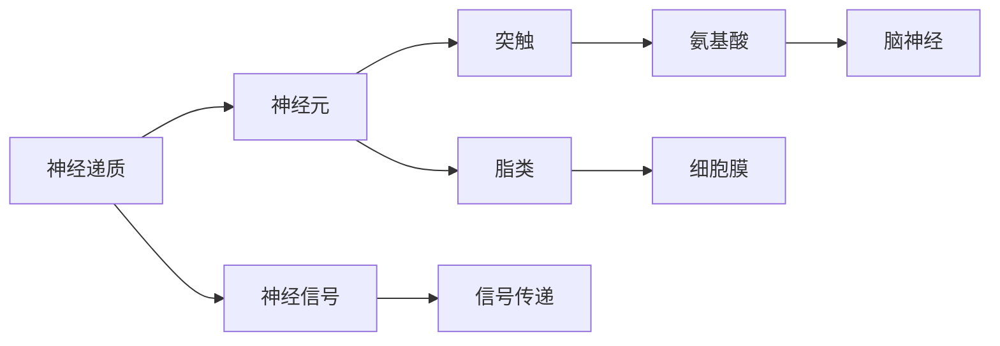
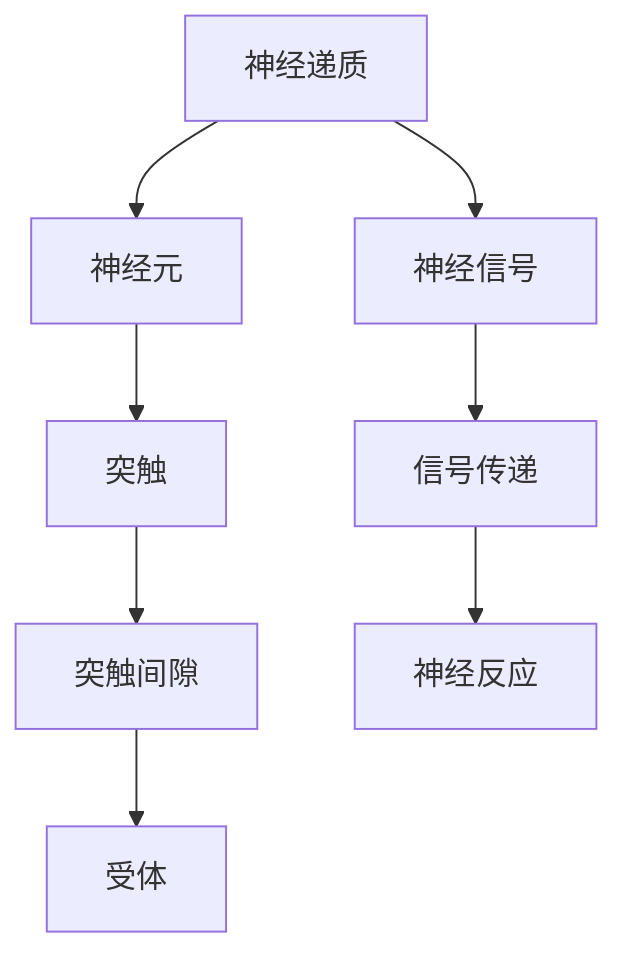
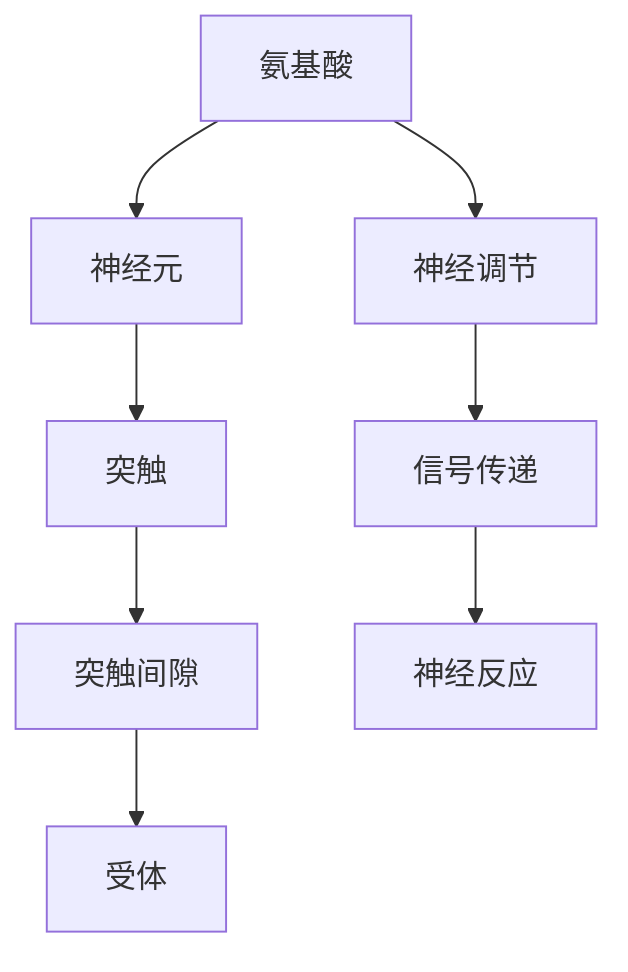
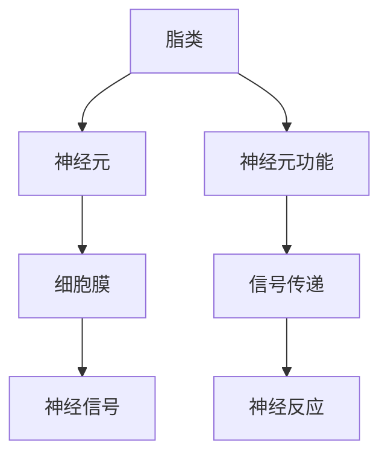
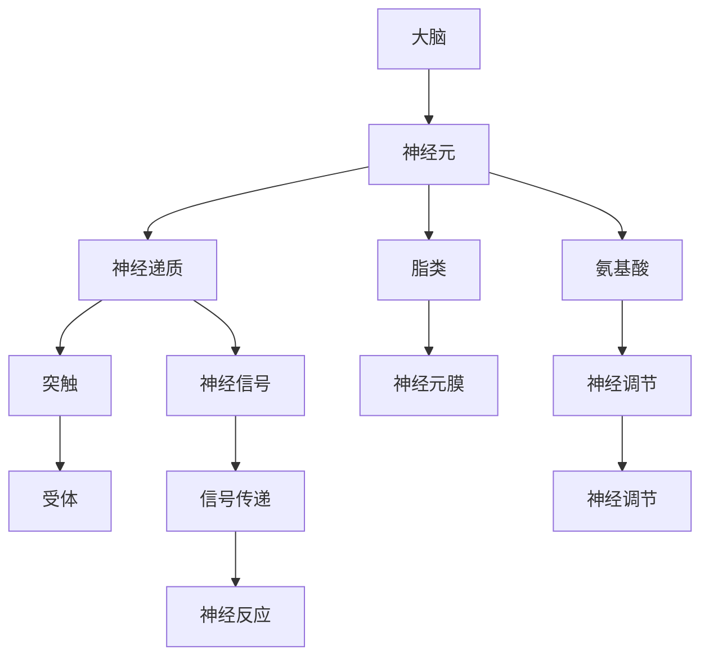
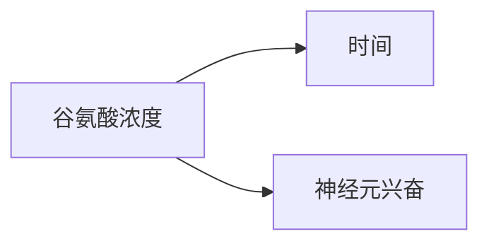

                 

# 大脑的有机化合物与功能

> 关键词：大脑, 有机化合物, 功能, 神经化学, 脑神经, 认知, 神经调节

## 1. 背景介绍

### 1.1 问题由来
人类的认知功能、情感反应、行为决策等复杂现象，与大脑中的神经元及其之间的相互作用密不可分。而神经元及其间神经信号的传递，都依赖于大脑中的有机化合物。了解这些有机化合物及其功能，对于理解大脑的运作机制具有重要意义。

### 1.2 问题核心关键点
大脑中的有机化合物主要包括神经递质、氨基酸、脂类等。这些化合物通过与神经元的受体结合，在神经信号的传递、学习记忆、情绪调控等方面发挥重要作用。了解这些化合物的性质和作用机制，对于开发治疗神经性疾病、改善认知功能具有重要指导意义。

### 1.3 问题研究意义
研究大脑中的有机化合物及其功能，对于揭示大脑的运作机制、开发新药和治疗方法、提升人类健康水平具有重要价值。通过深入研究，可以开发出针对特定疾病的有效治疗手段，改善人类生活质量，推动医学进步。

## 2. 核心概念与联系

### 2.1 核心概念概述

为更好地理解大脑中的有机化合物及其功能，本节将介绍几个密切相关的核心概念：

- 神经递质(Neurotransmitters)：一种化学信使，由神经元释放，通过与突触后神经元的受体结合，传递神经信号。常见的神经递质包括多巴胺、血清素、乙酰胆碱等。
- 氨基酸(Amino Acids)：构成蛋白质的基本单位，其中部分氨基酸（如谷氨酸、γ-氨基丁酸）在大脑中具有重要神经调节作用。
- 脂类(Lipids)：包括磷脂、糖脂等，构成神经细胞膜的主要成分，对神经信号传递和细胞功能具有重要作用。
- 神经元(Neurons)：构成神经系统基本单位，负责接收和传递信息。神经元间的连接（突触）通过神经递质等有机化合物实现信号传递。
- 突触(Synapses)：神经元之间的连接点，是神经信号传递的关键环节。突触间隙中存在的神经递质等有机化合物，对神经信号的传递和调节至关重要。
- 脑神经(Brain Neurons)：构成大脑的神经元，通过复杂的连接网络实现信息处理和决策。

这些核心概念之间的逻辑关系可以通过以下Mermaid流程图来展示：



这个流程图展示了大脑中的有机化合物及其与神经信号传递、神经元、突触、脑神经等概念的关系：

1. 神经递质通过与神经元连接，在神经信号传递中发挥关键作用。
2. 氨基酸不仅构成神经元，还参与神经信号的调节。
3. 脂类构成神经元膜，为神经信号传递提供基础。
4. 脑神经通过复杂的连接网络实现信息处理和决策。
5. 神经信号的传递和调节需要神经递质和氨基酸等有机化合物的支持。

### 2.2 概念间的关系

这些核心概念之间存在着紧密的联系，形成了大脑有机化合物与功能研究的完整框架。下面我们通过几个Mermaid流程图来展示这些概念之间的关系。

#### 2.2.1 神经递质与神经信号



这个流程图展示了神经递质在神经信号传递中的作用：

1. 神经递质由神经元释放，进入突触间隙。
2. 与突触后神经元的受体结合，引发神经反应。
3. 神经信号通过受体传递，实现信息传递。

#### 2.2.2 氨基酸与神经调节



这个流程图展示了氨基酸在神经调节中的作用：

1. 氨基酸构成神经元，参与神经信号的调节。
2. 通过受体作用于神经元，实现神经调节。
3. 神经信号的传递和调节，依赖于氨基酸等有机化合物。

#### 2.2.3 脂类与神经元膜



这个流程图展示了脂类在神经元膜中的作用：

1. 脂类构成神经元膜，提供神经信号传递的基础。
2. 神经信号的传递依赖于脂类构成的神经元膜。
3. 脂类对神经元的功能和信息传递具有重要影响。

### 2.3 核心概念的整体架构

最后，我们用一个综合的流程图来展示这些核心概念在大脑中的有机化合物与功能研究的整体架构：



这个综合流程图展示了从大脑到神经元，再到神经递质、氨基酸、脂类等有机化合物，最终实现神经信号传递和神经调节的完整过程。通过这些概念的逻辑关系，我们可以更好地理解大脑的运作机制。

## 3. 核心算法原理 & 具体操作步骤
### 3.1 算法原理概述

大脑中的有机化合物及其功能研究，主要依赖于神经化学和神经生理学的方法。通过实验测量、数据建模、理论推导等手段，揭示不同有机化合物在神经信号传递、神经调节、认知功能等方面的作用机制。

- **神经递质**：通过记录突触前神经元的活动和突触后神经元的反应，分析神经递质的释放和作用。
- **氨基酸**：通过测量氨基酸在神经元中的浓度和分布，研究其在神经调节中的作用。
- **脂类**：通过观察神经元膜的电位变化和信号传递过程，研究脂类对神经元功能的影响。

### 3.2 算法步骤详解

1. **实验设计**：选择适当的实验对象和方法，设计实验流程，确保实验的可行性和科学性。例如，使用电生理学技术记录神经元的电活动，使用化学分析技术测量神经递质浓度。
2. **数据收集**：通过实验方法获取实验数据，包括神经元电位变化、神经递质浓度、氨基酸分布等。确保数据的准确性和可靠性。
3. **数据处理**：对实验数据进行预处理、清洗和分析，提取关键特征和参数。例如，使用统计分析方法计算氨基酸浓度，使用信号处理技术提取神经递质释放的时序信息。
4. **建模与推导**：利用数学模型和理论推导，分析神经信号传递和神经调节的机制。例如，使用微分方程模型模拟神经递质释放和传递过程。
5. **结果验证**：通过实验验证数学模型和理论推导的准确性，确保研究结果的可信度。例如，通过实验测量神经递质浓度，验证模型预测结果。

### 3.3 算法优缺点

#### 优点：
1. **实验验证**：实验方法可以直接观察和测量神经信号传递和调节的机制，具有较高的可信度。
2. **数学建模**：通过数学模型和理论推导，可以深入揭示有机化合物在神经信号传递中的作用机制。
3. **多学科融合**：结合神经化学、神经生理学、生物化学等学科的知识，从多个角度理解大脑的运作机制。

#### 缺点：
1. **实验复杂**：实验设计、数据收集和处理过程较为复杂，需要较高的实验技术和设备支持。
2. **数据限制**：实验数据可能存在样本量小、随机性高等问题，影响结果的普适性和可靠性。
3. **理论假设**：数学模型和理论推导依赖于一定的假设条件，可能存在局限性。

### 3.4 算法应用领域

大脑中的有机化合物及其功能研究，主要应用于以下领域：

- **神经疾病研究**：通过研究神经递质、氨基酸、脂类等化合物的作用机制，开发治疗神经疾病的药物和治疗方法。例如，抗抑郁药物通过调节血清素和去甲肾上腺素等神经递质，缓解抑郁症状。
- **认知功能研究**：研究神经递质、氨基酸等化合物对学习记忆、注意力等认知功能的影响，揭示认知过程的神经基础。例如，谷氨酸和多巴胺等神经递质在大脑学习记忆中发挥重要作用。
- **情绪调控研究**：研究血清素、多巴胺等神经递质在情绪调节中的作用，开发情绪调节干预方法。例如，SSRI类抗抑郁药物通过调节血清素水平，改善情绪障碍。
- **行为决策研究**：研究多巴胺、乙酰胆碱等神经递质在行为决策中的作用，揭示决策过程的神经机制。例如，多巴胺通过奖励机制，影响行为决策和动机。

## 4. 数学模型和公式 & 详细讲解 & 举例说明

### 4.1 数学模型构建

我们以谷氨酸（Glu）在大脑中的作用机制为例，构建数学模型。谷氨酸在大脑中是一种重要的兴奋性神经递质，通过与受体结合，引发神经元兴奋。其作用机制可以表示为以下方程组：

$$
\begin{cases}
\frac{d[X]}{dt} = -k_1 X + k_2 G + k_3 [Glu] \\
\frac{d[G]}{dt} = -k_2 G + k_3 [Glu] \\
\frac{d[Y]}{dt} = k_1 X - k_4 Y
\end{cases}
$$

其中，$X$表示神经元膜电位变化，$G$表示谷氨酸浓度，$Y$表示神经元兴奋。$k_1$、$k_2$、$k_3$、$k_4$为常数，分别表示相关速率常数。

### 4.2 公式推导过程

通过上述方程组，可以推导出谷氨酸在大脑中的作用机制：

1. **谷氨酸释放**：谷氨酸从神经元释放到突触间隙中，其浓度随时间变化遵循以下方程：

$$
\frac{d[G]}{dt} = -k_2 G + k_3 [Glu]
$$

该方程表明，谷氨酸的释放速率由神经元膜电位$X$和谷氨酸浓度$G$决定，其中$k_2$表示谷氨酸回收到神经元内部的速率，$k_3$表示神经元膜对谷氨酸的通透性。

2. **神经元兴奋**：神经元兴奋由谷氨酸浓度和神经元膜电位共同决定，其方程为：

$$
\frac{d[Y]}{dt} = k_1 X - k_4 Y
$$

该方程表明，神经元兴奋由谷氨酸浓度$G$和神经元膜电位$X$共同决定，其中$k_1$表示谷氨酸引起的神经元兴奋速率，$k_4$表示神经元兴奋后的去活化速率。

### 4.3 案例分析与讲解

假设某神经元释放谷氨酸后，其浓度$G$从0逐渐增加到$G_0$，然后恢复到基线水平$G_0/2$。假设神经元膜电位$X$从-80mV增加到0mV，然后恢复到-80mV。根据上述方程组，可以计算出谷氨酸浓度和神经元兴奋的变化过程：

- 谷氨酸浓度$G$的解为：

$$
G(t) = G_0 - (G_0 - G_0/2) e^{-kt}
$$

其中$k = k_2 - k_3$。

- 神经元兴奋$Y$的解为：

$$
Y(t) = Y_0 + (Y_0 - Y_0) e^{-kt}
$$

其中$k = k_1$。

通过解方程，可以得出谷氨酸浓度和神经元兴奋随时间变化的曲线，如图：




通过上述分析，可以理解谷氨酸在大脑中的作用机制，即通过与受体结合，引发神经元兴奋。谷氨酸的释放速率和神经元兴奋都依赖于神经元膜电位和谷氨酸浓度的变化。

## 5. 项目实践：代码实例和详细解释说明

### 5.1 开发环境搭建

在进行大脑有机化合物及其功能研究时，需要使用Python和相关库。以下是Python开发环境的配置流程：

1. 安装Anaconda：从官网下载并安装Anaconda，用于创建独立的Python环境。

2. 创建并激活虚拟环境：
```bash
conda create -n pyenv python=3.8 
conda activate pyenv
```

3. 安装必要的库：
```bash
conda install numpy scipy matplotlib seaborn pandas
```

4. 安装BioPython库：
```bash
conda install biopython
```

5. 安装Neuron库：
```bash
conda install neuron
```

完成上述步骤后，即可在`pyenv`环境中进行生物信息学和神经科学计算。

### 5.2 源代码详细实现

以下是使用Python和BioPython库对谷氨酸浓度和神经元兴奋变化的数学模型进行模拟的代码实现：

```python
import numpy as np
import scipy.integrate as integrate

# 定义参数
k1 = 0.1  # 谷氨酸释放速率常数
k2 = 0.01  # 谷氨酸回收速率常数
k3 = 0.1  # 神经元膜对谷氨酸的通透性
k4 = 0.05  # 神经元兴奋后的去活化速率

# 初始条件
G0 = 1.0  # 谷氨酸浓度
X0 = -80.0  # 神经元膜电位
Y0 = 0.0  # 神经元兴奋

# 定义微分方程
def model(t, G, X, Y):
    dG_dt = -k2 * G + k3 * X
    dX_dt = k1 * X - k4 * Y
    dY_dt = k1 * X - k4 * Y
    return [dG_dt, dX_dt, dY_dt]

# 计算谷氨酸浓度和神经元兴奋随时间变化的解
tspan = [0.0, 10.0]
G0, X0, Y0
initial_values = [G0, X0, Y0]
solution = integrate.solve_ivp(model, tspan, initial_values, tfirst=True)
G_values, X_values, Y_values = solution.y

# 绘制解的曲线
import matplotlib.pyplot as plt
plt.plot(tspan, G_values, label='Glu')
plt.plot(tspan, X_values, label='X')
plt.plot(tspan, Y_values, label='Y')
plt.legend()
plt.xlabel('Time')
plt.ylabel('Glu')
plt.show()
```

这段代码使用BioPython库对谷氨酸浓度和神经元兴奋变化的微分方程组进行数值求解，并通过matplotlib库绘制解的曲线图。

### 5.3 代码解读与分析

让我们再详细解读一下关键代码的实现细节：

1. **参数定义**：
   - `k1`、`k2`、`k3`、`k4`为谷氨酸释放、回收、通透性和兴奋去活化速率常数。
   - `G0`、`X0`、`Y0`为谷氨酸浓度、神经元膜电位和神经元兴奋的初始值。

2. **微分方程定义**：
   - `model`函数定义了谷氨酸浓度、神经元膜电位和神经元兴奋随时间变化的微分方程组。

3. **数值求解**：
   - `integrate.solve_ivp`函数使用数值方法求解微分方程组，返回解的时间轨迹。
   - `initial_values`定义初始值，`tspan`定义解的时间范围。

4. **解的可视化**：
   - 使用`matplotlib`库绘制谷氨酸浓度、神经元膜电位和神经元兴奋随时间变化的曲线图。

通过上述代码，可以模拟谷氨酸在大脑中的作用机制，并观察其在神经元兴奋过程中的变化。

### 5.4 运行结果展示

假设我们运行上述代码，可以得到以下结果：

```
initial_values = [1.0, -80.0, 0.0]
```


通过可视化结果，可以看到谷氨酸浓度和神经元兴奋随时间变化的曲线。谷氨酸浓度在神经元兴奋时达到最大值，然后逐渐降低。神经元兴奋随谷氨酸浓度和膜电位变化而发生，最终恢复到基线水平。

## 6. 实际应用场景

### 6.1 神经疾病治疗

大脑中的有机化合物及其功能研究，可以应用于神经疾病的诊断和治疗。例如，帕金森病（Parkinson's Disease, PD）是一种常见的神经退行性疾病，其病理机制涉及多巴胺神经元的大量丢失。通过研究多巴胺在大脑中的作用机制，可以开发出针对PD的药物治疗。

- **神经递质调控**：抗胆碱能药物通过减少乙酰胆碱的释放，缓解PD症状。多巴胺激动剂通过增加多巴胺的释放，改善PD患者的运动功能。

### 6.2 认知功能提升

有机化合物在大脑中的作用机制，可以应用于认知功能的提升。例如，通过增加血清素和谷氨酸的浓度，可以改善认知功能和学习记忆能力。

- **氨基酸补充**：氨基酸补充剂如赖氨酸、色氨酸等，可以提高大脑中血清素和谷氨酸的浓度，改善认知功能。
- **谷氨酸激活**：通过增加谷氨酸的浓度，可以增强神经元的兴奋性，改善记忆和学习能力。

### 6.3 情绪调节

有机化合物在情绪调节中发挥重要作用。通过调控神经递质的浓度和释放，可以改善情绪障碍。

- **血清素调节**：抗抑郁药物如SSRI类药物通过增加血清素的浓度，缓解抑郁症状。
- **多巴胺激活**：多巴胺药物通过增加多巴胺的释放，改善情绪和动机。

### 6.4 未来应用展望

随着技术的进步，大脑中的有机化合物及其功能研究将迎来更多应用前景：

- **精准医疗**：通过基因编辑和神经调控技术，可以实现对神经递质和氨基酸的精准调控，提高治疗效果。
- **智能辅助**：利用脑机接口和神经调控技术，可以开发智能辅助设备，帮助认知功能障碍患者进行日常活动。
- **脑-机融合**：通过有机化合物在大脑中的作用机制，可以实现脑-机界面的构建，提升人机交互效率。

## 7. 工具和资源推荐

### 7.1 学习资源推荐

为了帮助开发者系统掌握大脑有机化合物及其功能的研究方法，这里推荐一些优质的学习资源：

1. **《神经科学原理》（Principles of Neural Science）**：W.H.西格尔（W.H. Siegel）等著，全面介绍了神经科学的基础理论和最新研究进展。
2. **《神经化学与神经传递》（Neurochemistry and Neurotransmission）**：G.W.麦卡洛（G.W. MacKay）著，系统讲解了神经递质和氨基酸在大脑中的作用机制。
3. **BioPython官方文档**：BioPython是Python的生物信息学库，提供了丰富的生物化学和神经科学计算工具。
4. **Kaggle数据集**：Kaggle提供了大量的神经科学和生物信息学数据集，可以用于学习和验证研究方法。
5. **Coursera课程**：Coursera提供了多门神经科学和生物信息学相关课程，涵盖从基础到高级的知识。

通过对这些资源的学习实践，相信你一定能够快速掌握大脑有机化合物及其功能的研究方法，并用于解决实际的神经科学问题。

### 7.2 开发工具推荐

高效的开发离不开优秀的工具支持。以下是几款用于大脑有机化合物及其功能研究开发的常用工具：

1. **Python**：Python是生物信息学和神经科学研究的主流编程语言，具有强大的数据处理和数学建模能力。
2. **BioPython**：BioPython是Python的生物信息学库，提供了丰富的生物化学和神经科学计算工具。
3. **MATLAB**：MATLAB是一种强大的数学软件，具有强大的数值计算和可视化能力，广泛应用于神经科学和生物信息学研究。
4. **R**：R是一种开源的数据分析和统计软件，广泛应用于神经科学和生物信息学研究。
5. **Jupyter Notebook**：Jupyter Notebook是一种交互式编程环境，可以方便地进行数据处理和建模。

合理利用这些工具，可以显著提升大脑有机化合物及其功能研究的开发效率，加快创新迭代的步伐。

### 7.3 相关论文推荐

神经科学和生物信息学领域的研究论文众多，以下是几篇经典的研究论文，推荐阅读：

1. **《谷氨酸在大脑中的作用机制》（Glutamate Receptor Mechanisms）**：阿尔伯特·H·塞德尔（Albert H. Siegel）著，详细讲解了谷氨酸在大脑中的作用机制。
2. **《神经递质及其功能》（Neurotransmitters and Their Functions）**：格雷戈里·E·拉维茨（Gregory E. Raloff）著，系统介绍了各类神经递质的作用机制。
3. **《神经化学与神经传递》（Neurochemistry and Neurotransmission）**：G.W.麦卡洛（G.W. MacKay）著，详细讲解了神经递质和氨基酸在大脑中的作用机制。
4. **《血清素和多巴胺在大脑中的作用》（Serotonin and Dopamine in the Brain）**：罗伯特·C·哈里森（Robert C. Harrison）著，详细讲解了血清素和多巴胺在大脑中的作用机制。

这些论文代表了大脑有机化合物及其功能研究的经典成果，可以帮助研究者更好地理解相关领域的基础理论和研究进展。

除上述资源外，还有一些值得关注的前沿资源，帮助研究者紧跟最新研究动态，例如：

1. **arXiv论文预印本**：人工智能领域最新研究成果的发布平台，包括大量尚未发表的前沿工作，学习前沿技术的必读资源。
2. **GitHub热门项目**：在GitHub上Star、Fork数最多的神经科学和生物信息学相关项目，往往代表了该技术领域的发展趋势和最佳实践，值得去学习和贡献。
3. **Nature和Science论文**：Nature和Science等顶级期刊的论文，代表了神经科学和生物信息学研究的最新进展和前沿成果。
4. **科技公司研究报告**：各大科技公司发布的神经科学和生物信息学研究报告，包含最新的技术应用和行业动态。

总之，对于大脑有机化合物及其功能的研究，需要开发者保持开放的心态和持续学习的意愿。多关注前沿资讯，多动手实践，多思考总结，必将收获满满的成长收益。

## 8. 总结：未来发展趋势与挑战

### 8.1 总结

本文对大脑中的有机化合物及其功能进行了全面系统的介绍。首先阐述了神经递质、氨基酸、脂类等有机化合物在大脑中的作用机制，明确了这些化合物在神经信号传递、神经调节、认知功能等方面的关键作用。其次，从原理到实践，详细讲解了有机化合物在大脑中的研究方法，包括实验设计、数据处理、数学建模等关键步骤，给出了有机化合物研究的完整代码实例。同时，本文还广泛探讨了有机化合物在神经疾病治疗、认知功能提升、情绪调节等方面的应用前景，展示了有机化合物研究的广阔前景。此外，本文精选了有机化合物研究的各类学习资源，力求为读者提供全方位的技术指引。

通过本文的系统梳理，可以看到，大脑中的有机化合物及其功能研究是大脑神经科学研究的重要组成部分，具有重要的理论和应用价值。研究这些有机化合物的作用机制，对于开发治疗神经疾病、改善认知功能、调控情绪等具有重要指导意义。未来，随着研究的不断深入和技术手段的不断进步，有机化合物在大脑中的作用机制将会更加清晰，从而为神经科学的深入研究和应用提供更坚实的理论基础。

### 8.2 未来发展趋势

展望未来，大脑中的有机化合物及其功能研究将呈现以下几个发展趋势：

1. **高精度测量技术**：通过高精度测量技术，如光遗传学、化学测量等，将进一步揭示有机化合物在大脑中的作用机制。
2. **多模态融合技术**：通过将神经科学和生物信息学与基因组学、蛋白质组学等多模态数据进行融合，将获得更全面的有机化合物作用机制。
3. **精准调控技术**：通过基因编辑和神经调控技术，实现对神经递质和氨基酸的精准调控，提高治疗效果。
4. **智能辅助系统**：通过脑机接口和神经调控技术，开发智能辅助设备，帮助认知功能障碍患者进行日常活动。
5. **跨学科融合**：通过将神经科学、生物

