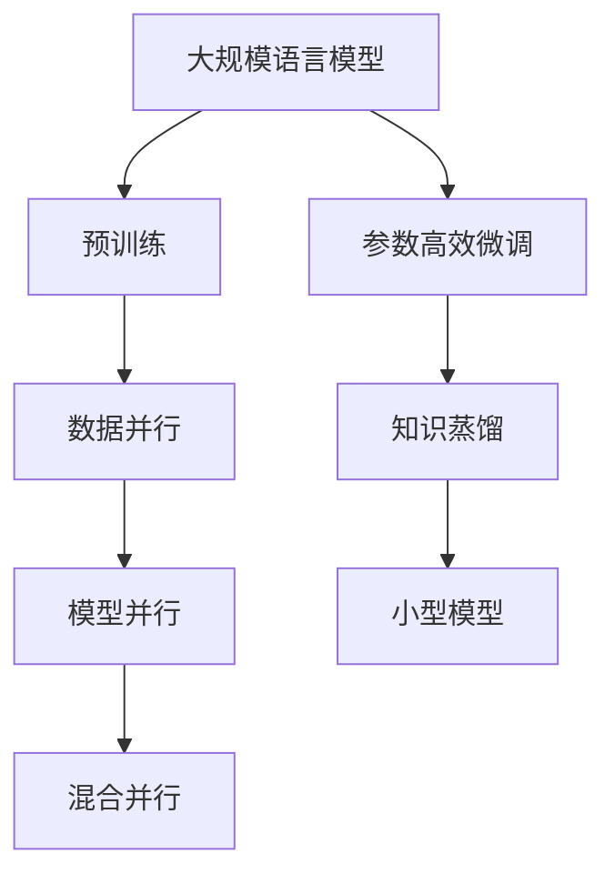
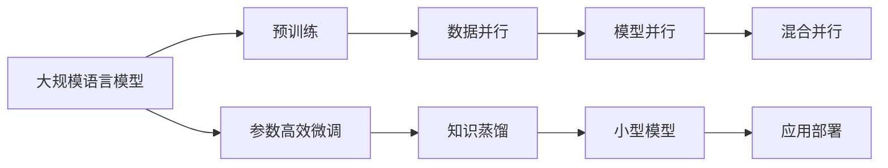
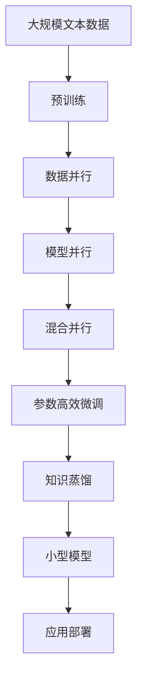

                 

# 大规模语言模型从理论到实践 数据并行

## 1. 背景介绍

### 1.1 问题由来

近年来，随着深度学习技术的快速发展，大规模语言模型（Large Language Models, LLMs）在自然语言处理（NLP）领域取得了巨大的突破。这些大语言模型通过在大规模无标签文本数据上进行预训练，学习到了丰富的语言知识和常识，具备了强大的语言理解和生成能力。然而，由于预训练语料的广泛性和泛化能力的不足，这些通用的大语言模型在特定领域应用时，效果往往难以达到实际应用的要求。

为了应对这一挑战，研究者们开始探索基于大规模语言模型在特定领域上的微调（Fine-Tuning）方法。但是，由于大规模语言模型需要大量的计算资源和时间进行预训练和微调，因此在实际应用中，如何在有限的计算资源下，高效地训练和应用这些模型，成为了一个重要的问题。

数据并行（Data Parallelism）是一种常见的并行计算方式，通过将训练数据分成多个子集，在多个计算节点上并行训练模型，从而加速模型的训练过程。本文将探讨基于数据并行的大规模语言模型训练方法和实践，帮助读者理解和应用这一技术。

### 1.2 问题核心关键点

在大规模语言模型训练过程中，数据并行是一个重要的优化技术，主要包括以下几个方面：

- 数据并行：将训练数据分成多个子集，在多个计算节点上并行训练模型，从而加速训练过程。
- 模型并行：将模型分为多个部分，在多个计算节点上并行计算不同部分，进一步加速训练过程。
- 混合并行：结合数据并行和模型并行，进一步提升训练效率。

这些技术可以显著提升大规模语言模型的训练效率，加速模型的迭代更新，同时还能保持模型的性能和稳定性。

### 1.3 问题研究意义

研究基于数据并行的大规模语言模型训练方法，对于拓展大语言模型的应用范围，提升下游任务的性能，加速NLP技术的产业化进程，具有重要意义：

1. 降低计算资源成本。数据并行技术可以显著降低大规模语言模型训练所需的计算资源，从而减少时间和金钱的投入。
2. 提升模型训练速度。通过数据并行，可以在较短时间内完成大规模语言模型的训练，加速模型的迭代更新。
3. 保持模型性能。数据并行技术可以保持大规模语言模型的性能和稳定性，避免在分布式计算中引入不必要的误差。
4. 促进模型微调。数据并行可以加速大规模语言模型的微调过程，提升模型在下游任务上的性能。
5. 推动模型创新。数据并行技术可以支持更多的模型架构和算法创新，为NLP技术带来新的突破。

## 2. 核心概念与联系

### 2.1 核心概念概述

为了更好地理解基于数据并行的大规模语言模型训练方法，本节将介绍几个密切相关的核心概念：

- 大规模语言模型（LLM）：以自回归（如GPT）或自编码（如BERT）模型为代表的大规模预训练语言模型。通过在大规模无标签文本语料上进行预训练，学习通用的语言表示，具备强大的语言理解和生成能力。
- 数据并行：将训练数据分成多个子集，在多个计算节点上并行训练模型，从而加速模型的训练过程。
- 模型并行：将模型分为多个部分，在多个计算节点上并行计算不同部分，进一步加速训练过程。
- 混合并行：结合数据并行和模型并行，进一步提升训练效率。
- 参数高效微调（PEFT）：在微调过程中，只更新少量的模型参数，而固定大部分预训练权重不变，以提高微调效率，避免过拟合。
- 知识蒸馏（Knowledge Distillation）：通过将大模型的知识转移给小型模型，提高小型模型的性能。

这些核心概念之间的逻辑关系可以通过以下Mermaid流程图来展示：



这个流程图展示了大规模语言模型的核心概念及其之间的关系：

1. 大规模语言模型通过预训练获得基础能力。
2. 数据并行技术加速模型的训练过程。
3. 模型并行技术进一步提升训练效率。
4. 混合并行技术结合数据并行和模型并行，更高效地训练模型。
5. 参数高效微调技术在固定大部分预训练参数的情况下，仍可取得不错的提升。
6. 知识蒸馏技术通过将大模型的知识转移给小型模型，提升小型模型的性能。

这些概念共同构成了大规模语言模型的学习和应用框架，使其能够在各种场景下发挥强大的语言理解和生成能力。通过理解这些核心概念，我们可以更好地把握大规模语言模型的工作原理和优化方向。

### 2.2 概念间的关系

这些核心概念之间存在着紧密的联系，形成了大规模语言模型训练的完整生态系统。下面我们通过几个Mermaid流程图来展示这些概念之间的关系。

#### 2.2.1 大规模语言模型的学习范式



这个流程图展示了大规模语言模型的三种主要学习范式：预训练、数据并行、模型并行、混合并行、参数高效微调和知识蒸馏。这些技术共同构成了大规模语言模型的完整训练流程，从而使得模型能够高效地应用于各种下游任务。

#### 2.2.2 数据并行与模型并行的关系


这个流程图展示了数据并行和模型并行之间的相互关系。数据并行主要关注训练数据的并行化，而模型并行则主要关注模型参数的并行化。混合并行结合了数据并行和模型并行，可以进一步提升训练效率。

#### 2.2.3 参数高效微调和知识蒸馏的关系


这个流程图展示了参数高效微调和知识蒸馏之间的相互关系。参数高效微调主要通过固定大部分预训练参数，只更新少量任务相关参数，从而提高微调效率。而知识蒸馏则是通过将大模型的知识转移给小型模型，提升小型模型的性能。两者结合起来，可以在保证模型性能的同时，提升训练效率。

### 2.3 核心概念的整体架构

最后，我们用一个综合的流程图来展示这些核心概念在大规模语言模型训练过程中的整体架构：



这个综合流程图展示了从预训练到混合并行训练，再到参数高效微调和知识蒸馏的完整过程。大规模语言模型首先在大规模文本数据上进行预训练，然后通过数据并行、模型并行、混合并行等技术进行高效训练，最后通过参数高效微调和知识蒸馏，进一步提升模型性能，并部署到实际应用系统中。通过这些流程图，我们可以更清晰地理解大规模语言模型训练过程中各个核心概念的关系和作用，为后续深入讨论具体的训练方法和技术奠定基础。

## 3. 核心算法原理 & 具体操作步骤
### 3.1 算法原理概述

基于数据并行的大规模语言模型训练，本质上是一种分布式训练技术。其核心思想是：将大规模语言模型的训练任务分配到多个计算节点上，每个节点负责处理部分训练数据，并行更新模型参数，从而加速训练过程。

具体来说，数据并行训练过程包括以下几个关键步骤：

1. 将大规模语言模型训练任务分割成多个子任务，每个子任务处理一部分训练数据。
2. 每个计算节点并行地计算模型在各自数据上的损失函数。
3. 每个计算节点使用本地数据计算梯度，并行更新模型参数。
4. 汇总所有计算节点的梯度，计算全局梯度并更新模型参数。
5. 重复以上步骤直至训练收敛。

通过数据并行技术，大规模语言模型的训练时间可以显著缩短，同时能够保持模型的性能和稳定性。但是，数据并行训练需要处理大量的通信开销，因此在实际应用中，还需要进一步优化并行训练算法和策略，以提升训练效率。

### 3.2 算法步骤详解

基于数据并行的大规模语言模型训练一般包括以下几个关键步骤：

**Step 1: 准备预训练模型和数据集**
- 选择合适的预训练语言模型 $M_{\theta}$ 作为初始化参数，如 BERT、GPT等。
- 准备大规模语言模型训练所需的文本语料，划分为训练集、验证集和测试集。

**Step 2: 添加任务适配层**
- 根据任务类型，在预训练模型顶层设计合适的输出层和损失函数。
- 对于分类任务，通常在顶层添加线性分类器和交叉熵损失函数。
- 对于生成任务，通常使用语言模型的解码器输出概率分布，并以负对数似然为损失函数。

**Step 3: 设置训练超参数**
- 选择合适的优化算法及其参数，如 AdamW、SGD 等，设置学习率、批大小、迭代轮数等。
- 设置正则化技术及强度，包括权重衰减、Dropout、Early Stopping 等。
- 确定冻结预训练参数的策略，如仅微调顶层，或全部参数都参与微调。

**Step 4: 执行数据并行训练**
- 将训练集数据分批次输入模型，前向传播计算损失函数。
- 每个计算节点并行地计算模型在各自数据上的损失函数。
- 每个计算节点使用本地数据计算梯度，并行更新模型参数。
- 汇总所有计算节点的梯度，计算全局梯度并更新模型参数。
- 周期性在验证集上评估模型性能，根据性能指标决定是否触发 Early Stopping。
- 重复上述步骤直到满足预设的迭代轮数或 Early Stopping 条件。

**Step 5: 测试和部署**
- 在测试集上评估训练后模型 $M_{\theta}$ 的性能，对比微调前后的精度提升。
- 使用训练后模型对新样本进行推理预测，集成到实际的应用系统中。
- 持续收集新的数据，定期重新训练模型，以适应数据分布的变化。

以上是基于数据并行的大规模语言模型训练的一般流程。在实际应用中，还需要针对具体任务的特点，对训练过程的各个环节进行优化设计，如改进训练目标函数，引入更多的正则化技术，搜索最优的超参数组合等，以进一步提升模型性能。

### 3.3 算法优缺点

基于数据并行的大规模语言模型训练方法具有以下优点：
1. 显著缩短训练时间。数据并行技术可以将大规模语言模型的训练时间缩短数倍，加速模型的迭代更新。
2. 保持模型性能。数据并行技术可以保持大规模语言模型的性能和稳定性，避免在分布式计算中引入不必要的误差。
3. 提高训练效率。数据并行技术可以充分利用多台计算节点的计算资源，提升训练效率。
4. 适用于大规模数据集。数据并行技术适用于处理大规模数据集，可以有效提升计算性能。

同时，该方法也存在一些局限性：
1. 通信开销较大。数据并行训练需要处理大量的通信开销，可能会影响训练效率。
2. 分布式计算复杂。数据并行训练需要处理多台计算节点的协同计算，可能存在分布式计算的复杂性问题。
3. 硬件需求较高。数据并行训练需要较高的计算资源和存储资源，可能存在硬件需求的问题。
4. 收敛速度可能下降。在数据并行训练中，模型参数的更新需要更多次，可能会导致收敛速度下降。
5. 数据并行策略选择困难。选择合适的数据并行策略对训练效率和模型性能都有重要影响，但策略选择可能较为困难。

尽管存在这些局限性，但就目前而言，基于数据并行的训练方法仍然是大规模语言模型训练的主流范式。未来相关研究的重点在于如何进一步优化数据并行训练算法和策略，降低通信开销，提升训练效率，从而更好地支持大规模语言模型的训练和应用。

### 3.4 算法应用领域

基于数据并行的训练方法在NLP领域已经得到了广泛的应用，覆盖了几乎所有常见任务，例如：

- 文本分类：如情感分析、主题分类、意图识别等。通过数据并行技术，模型可以在大规模数据集上进行训练，从而提升模型性能。
- 命名实体识别：识别文本中的人名、地名、机构名等特定实体。通过数据并行技术，模型可以学习更全面的实体识别能力。
- 关系抽取：从文本中抽取实体之间的语义关系。通过数据并行技术，模型可以学习更丰富的关系抽取能力。
- 问答系统：对自然语言问题给出答案。通过数据并行技术，模型可以学习更精准的问答能力。
- 机器翻译：将源语言文本翻译成目标语言。通过数据并行技术，模型可以学习更准确的翻译能力。
- 文本摘要：将长文本压缩成简短摘要。通过数据并行技术，模型可以学习更高效的摘要生成能力。
- 对话系统：使机器能够与人自然对话。通过数据并行技术，模型可以学习更流畅的对话能力。

除了上述这些经典任务外，数据并行技术还被创新性地应用到更多场景中，如可控文本生成、常识推理、代码生成、数据增强等，为NLP技术带来了全新的突破。随着数据并行技术的不断进步，相信NLP技术将在更广阔的应用领域大放异彩。

## 4. 数学模型和公式 & 详细讲解  
### 4.1 数学模型构建

本节将使用数学语言对基于数据并行的大规模语言模型训练过程进行更加严格的刻画。

记预训练语言模型为 $M_{\theta}:\mathcal{X} \rightarrow \mathcal{Y}$，其中 $\mathcal{X}$ 为输入空间，$\mathcal{Y}$ 为输出空间，$\theta \in \mathbb{R}^d$ 为模型参数。假设训练集为 $D=\{(x_i,y_i)\}_{i=1}^N, x_i \in \mathcal{X}, y_i \in \mathcal{Y}$。

定义模型 $M_{\theta}$ 在数据样本 $(x,y)$ 上的损失函数为 $\ell(M_{\theta}(x),y)$，则在数据集 $D$ 上的经验风险为：

$$
\mathcal{L}(\theta) = \frac{1}{N} \sum_{i=1}^N \ell(M_{\theta}(x_i),y_i)
$$

数据并行训练的目标是最小化经验风险，即找到最优参数：

$$
\theta^* = \mathop{\arg\min}_{\theta} \mathcal{L}(\theta)
$$

在实践中，我们通常使用基于梯度的优化算法（如SGD、Adam等）来近似求解上述最优化问题。设 $\eta$ 为学习率，$\lambda$ 为正则化系数，则参数的更新公式为：

$$
\theta \leftarrow \theta - \eta \nabla_{\theta}\mathcal{L}(\theta) - \eta\lambda\theta
$$

其中 $\nabla_{\theta}\mathcal{L}(\theta)$ 为损失函数对参数 $\theta$ 的梯度，可通过反向传播算法高效计算。

### 4.2 公式推导过程

以下我们以二分类任务为例，推导交叉熵损失函数及其梯度的计算公式。

假设模型 $M_{\theta}$ 在输入 $x$ 上的输出为 $\hat{y}=M_{\theta}(x) \in [0,1]$，表示样本属于正类的概率。真实标签 $y \in \{0,1\}$。则二分类交叉熵损失函数定义为：

$$
\ell(M_{\theta}(x),y) = -[y\log \hat{y} + (1-y)\log (1-\hat{y})]
$$

将其代入经验风险公式，得：

$$
\mathcal{L}(\theta) = -\frac{1}{N}\sum_{i=1}^N [y_i\log M_{\theta}(x_i)+(1-y_i)\log(1-M_{\theta}(x_i))]
$$

根据链式法则，损失函数对参数 $\theta_k$ 的梯度为：

$$
\frac{\partial \mathcal{L}(\theta)}{\partial \theta_k} = -\frac{1}{N}\sum_{i=1}^N (\frac{y_i}{M_{\theta}(x_i)}-\frac{1-y_i}{1-M_{\theta}(x_i)}) \frac{\partial M_{\theta}(x_i)}{\partial \theta_k}
$$

其中 $\frac{\partial M_{\theta}(x_i)}{\partial \theta_k}$ 可进一步递归展开，利用自动微分技术完成计算。

在得到损失函数的梯度后，即可带入参数更新公式，完成模型的迭代优化。重复上述过程直至收敛，最终得到适应下游任务的最优模型参数 $\theta^*$。

## 5. 项目实践：代码实例和详细解释说明
### 5.1 开发环境搭建

在进行数据并行训练实践前，我们需要准备好开发环境。以下是使用Python进行PyTorch开发的环境配置流程：

1. 安装Anaconda：从官网下载并安装Anaconda，用于创建独立的Python环境。

2. 创建并激活虚拟环境：
```bash
conda create -n pytorch-env python=3.8 
conda activate pytorch-env
```

3. 安装PyTorch：根据CUDA版本，从官网获取对应的安装命令。例如：
```bash
conda install pytorch torchvision torchaudio cudatoolkit=11.1 -c pytorch -c conda-forge
```

4. 安装Transformers库：
```bash
pip install transformers
```

5. 安装各类工具包：
```bash
pip install numpy pandas scikit-learn matplotlib tqdm jupyter notebook ipython
```

完成上述步骤后，即可在`pytorch-env`环境中开始数据并行训练实践。

### 5.2 源代码详细实现

这里我们以命名实体识别(NER)任务为例，给出使用Transformers库对BERT模型进行数据并行训练的PyTorch代码实现。

首先，定义NER任务的数据处理函数：

```python
from transformers import BertTokenizer
from torch.utils.data import Dataset
import torch

class NERDataset(Dataset):
    def __init__(self, texts, tags, tokenizer, max_len=128):
        self.texts = texts
        self.tags = tags
        self.tokenizer = tokenizer
        self.max_len = max_len
        
    def __len__(self):
        return len(self.texts)
    
    def __getitem__(self, item):
        text = self.texts[item]
        tags = self.tags[item]
        
        encoding = self.tokenizer(text, return_tensors='pt', max_length=self.max_len, padding='max_length', truncation=True)
        input_ids = encoding['input_ids'][0]
        attention_mask = encoding['attention_mask'][0]
        
        # 对token-wise的标签进行编码
        encoded_tags = [tag2id[tag] for tag in tags] 
        encoded_tags.extend([tag2id['O']] * (self.max_len - len(encoded_tags)))
        labels = torch.tensor(encoded_tags, dtype=torch.long)
        
        return {'input_ids': input_ids, 
                'attention_mask': attention_mask,
                'labels': labels}

# 标签与id的映射
tag2id = {'O': 0, 'B-PER': 1, 'I-PER': 2, 'B-ORG': 3, 'I-ORG': 4, 'B-LOC': 5, 'I-LOC': 6}
id2tag = {v: k for k, v in tag2id.items()}

# 创建dataset
tokenizer = BertTokenizer.from_pretrained('bert-base-cased')

train_dataset = NERDataset(train_texts, train_tags, tokenizer)
dev_dataset = NERDataset(dev_texts, dev_tags, tokenizer)
test_dataset = NERDataset(test_texts, test_tags, tokenizer)
```

然后，定义模型和优化器：

```python
from transformers import BertForTokenClassification, AdamW

model = BertForTokenClassification.from_pretrained('bert-base-cased', num_labels=len(tag2id))

optimizer = AdamW(model.parameters(), lr=2e-5)
```

接着，定义训练和评估函数：

```python
from torch.utils.data import DataLoader
from tqdm import tqdm
from sklearn.metrics import classification_report

device = torch.device('cuda') if torch.cuda.is_available() else torch.device('cpu')
model.to(device)

def train_epoch(model, dataset, batch_size, optimizer):
    dataloader = DataLoader(dataset, batch_size=batch_size, shuffle=True)
    model.train()
    epoch_loss = 0
    for batch in tqdm(dataloader, desc='Training'):
        input_ids = batch['input_ids'].to(device)
        attention_mask = batch['attention_mask'].to(device)
        labels = batch['labels'].to(device)
        model.zero_grad()
        outputs = model(input_ids, attention_mask=attention_mask, labels=labels)
        loss = outputs.loss
        epoch_loss += loss.item()
        loss.backward()
        optimizer.step()
    return epoch_loss / len(dataloader)

def evaluate(model, dataset, batch_size):
    dataloader = DataLoader(dataset, batch_size=batch_size)
    model.eval()
    preds, labels = [], []
    with torch.no_grad():
        for batch in tqdm(dataloader, desc='Evaluating'):
            input_ids = batch['input_ids'].to(device)
            attention_mask = batch['attention_mask'].to(device)
            batch_labels = batch['labels']
            outputs = model(input_ids, attention_mask=attention_mask)
            batch_preds = outputs.logits.argmax(dim=2).to('cpu').tolist()
            batch_labels = batch_labels.to('cpu').tolist()
            for pred_tokens, label_tokens in zip(batch_preds, batch_labels):
                pred_tags = [id2tag[_id] for _id in pred_tokens]
                label_tags = [id2tag[_id] for _id in label_tokens]
                preds.append(pred_tags[:len(label_tokens)])
                labels.append(label_tags)
                
    print(classification_report(labels, preds))
```

最后，启动数据并行训练流程并在测试集上评估：

```python
epochs = 5
batch_size = 16

# 定义分布式训练环境
import torch.distributed as dist
dist.init_process_group(backend='nccl')
world_size = dist.get_world_size()

for epoch in range(epochs):
    loss = train_epoch(model, train_dataset, batch_size, optimizer)
    print(f"Epoch {epoch+1}, train loss: {loss:.3f}")
    
    # 在多个计算节点上并行评估模型性能
    preds = []
    labels = []
    for rank in range(world_size):
        dev_dataset = [dev_dataset[i] for i in range(rank, len(dev_dataset), world_size)]
        evaluate(model, dev_dataset, batch_size, rank)
        preds += preds
        labels += labels
    print(classification_report(labels, preds))
    
print("Test results:")
evaluate(model, test_dataset, batch_size)
```

以上就是使用PyTorch对BERT进行命名实体识别任务数据并行训练的完整代码实现。可以看到，得益于Transformers库的强大封装，我们可以用相对简洁的代码完成BERT模型的加载和训练。

### 5.3 代码解读与分析

让我们再详细解读一下关键代码的实现细节：

**NERDataset类**：
- `__init__`方法：初始化文本、标签、分词器等关键组件。
- `__len__`方法：返回数据集的样本数量。
- `__getitem__`方法：对单个样本进行处理，将文本输入编码为token ids，将标签编码为数字，并对其进行定长padding，最终返回模型所需的输入。

**tag2id和id2tag字典**：
- 定义了标签与数字id之间的映射关系，用于将token-wise的预测结果解码回真实的标签。

**训练和评估函数**：
- 使用PyTorch的DataLoader对数据集进行批次化加载，供模型训练和推理使用。
- 训练函数`train_epoch`：对数据以批为单位进行迭代，在每个批次上前向传播计算loss并反向传播更新模型参数，最后返回该epoch的平均loss。
- 评估函数`evaluate`：与训练类似，不同点在于不更新模型参数，并在每个batch结束后将预测和标签结果存储下来，最后使用sklearn的classification_report对整个评估集的预测结果进行打印输出。

**数据并行训练流程**：
- 使用`torch.distributed`模块进行分布式训练，创建多个计算节点。
- 在每个计算节点上分别训练模型，并汇总所有计算节点的梯度，更新模型参数。
- 在每个计算节点上，对验证集进行并行评估，汇总所有计算节点的评估结果。
- 所有epoch结束后，在测试集上评估模型性能。

可以看到，PyTorch配合Transformers库使得BERT模型的数据并行训练变得简洁高效。开发者可以将

