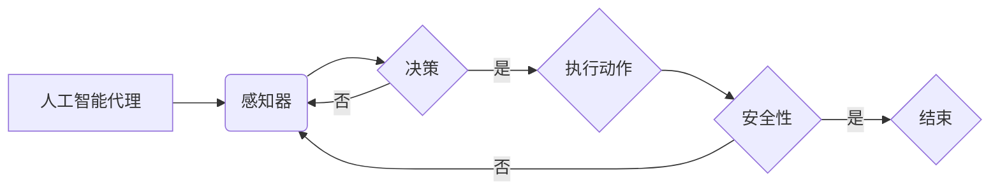

> 人工智能代理,伦理考量,自主决策,透明度,可解释性,责任归属,安全性,AI伦理

# AI人工智能 Agent：在人工智能伦理上的考量

随着人工智能技术的飞速发展，人工智能代理（AI Agents）已经成为研究和应用的热点。人工智能代理是指能够自主感知环境、做出决策并采取行动的智能实体。然而，随着人工智能代理的广泛应用，其伦理问题也日益凸显。本文将深入探讨人工智能代理在伦理上的考量，包括自主决策、透明度、可解释性、责任归属和安全性等方面。

## 1. 背景介绍

人工智能代理的出现和发展，为人类社会带来了前所未有的机遇和挑战。它们在自动驾驶、智能制造、智能家居、医疗健康等领域展现出巨大的潜力，能够提高效率、降低成本、改善生活质量。然而，人工智能代理的广泛应用也引发了一系列伦理问题，如自主决策的伦理边界、决策过程的透明度和可解释性、责任归属以及潜在的安全风险等。

## 2. 核心概念与联系

### 2.1 核心概念

#### 2.1.1 人工智能代理
人工智能代理是指具备一定智能水平，能够自主感知环境、做出决策并采取行动的智能实体。它们可以是软件程序、机器人或其他设备，通过感知器获取环境信息，并通过控制器执行相应动作。

#### 2.1.2 伦理考量
伦理考量是指从道德和伦理的角度对人工智能代理的行为和决策进行评估，确保其符合人类社会的基本价值观和道德规范。

#### 2.1.3 自主决策
自主决策是指人工智能代理在不受外部干预的情况下，根据自身目标和环境信息做出决策。

#### 2.1.4 透明度
透明度是指人工智能代理的决策过程和内部机制对外部观察者清晰可见。

#### 2.1.5 可解释性
可解释性是指人工智能代理的决策结果可以被人理解和解释。

#### 2.1.6 责任归属
责任归属是指确定人工智能代理行为后果的责任主体。

#### 2.1.7 安全性
安全性是指人工智能代理在执行任务时，不会对人类或其他实体造成伤害。

### 2.2 Mermaid 流程图



## 3. 核心算法原理 & 具体操作步骤

### 3.1 算法原理概述

人工智能代理的核心是决策算法，其基本原理如下：

1. 感知器从环境中获取信息。
2. 决策算法根据感知器提供的信息，结合预设目标和约束条件，生成动作指令。
3. 控制器执行动作指令，对环境产生影响。
4. 感知器再次从环境中获取信息，形成反馈循环。

### 3.2 算法步骤详解

1. **感知**：人工智能代理通过传感器、摄像头等设备感知环境信息，如温度、光线、声音等。
2. **决策**：根据感知到的信息，结合预设目标和约束条件，利用机器学习、强化学习等方法进行决策。
3. **执行**：控制器根据决策算法生成的动作指令，控制执行机构（如电机、舵机等）对环境产生影响。
4. **评估**：评估执行后的效果，根据反馈调整决策算法和预设目标。

### 3.3 算法优缺点

#### 3.3.1 优点

1. 提高效率：自动化执行任务，降低人力成本。
2. 提升精度：减少人为误差，提高任务完成质量。
3. 扩展性强：易于扩展到不同领域和场景。

#### 3.3.2 缺点

1. 难以理解：决策过程复杂，难以解释。
2. 安全风险：潜在的安全隐患，如误伤人类或其他实体。
3. 责任归属：责任主体难以确定。

### 3.4 算法应用领域

人工智能代理在以下领域得到广泛应用：

1. 自动驾驶：自动驾驶汽车、无人机等。
2. 智能家居：智能门锁、智能家电等。
3. 智能机器人：工业机器人、服务机器人等。
4. 医疗健康：远程医疗、辅助诊断等。
5. 金融：智能投顾、风险评估等。

## 4. 数学模型和公式 & 详细讲解 & 举例说明

### 4.1 数学模型构建

人工智能代理的决策过程可以通过以下数学模型进行描述：

$$
\text{决策} = f(\text{感知}, \text{目标}, \text{约束})
$$

其中，$f$ 表示决策函数，$\text{感知}$、$\text{目标}$、$\text{约束}$ 分别表示感知器获取的环境信息、预设目标和约束条件。

### 4.2 公式推导过程

以强化学习为例，假设智能体在时间步 $t$ 的动作 $a_t$ 是根据策略 $\pi(\theta)$ 和状态 $s_t$ 生成的，即 $a_t = \pi(\theta, s_t)$。那么，在时间步 $t+1$ 的下一个状态 $s_{t+1}$ 和奖励 $r_{t+1}$ 可以用以下公式表示：

$$
s_{t+1} = f(s_t, a_t)
$$
$$
r_{t+1} = g(s_{t+1})
$$

其中，$f$ 表示环境模型，$g$ 表示奖励函数。通过最大化累积奖励，智能体学习到最优策略 $\pi^*$，即：

$$
\pi^* = \mathop{\arg\max}_{\pi} \sum_{t=0}^{\infty} \gamma^t r_{t+1}
$$

其中，$\gamma$ 表示折扣因子。

### 4.3 案例分析与讲解

以自动驾驶为例，智能体需要根据周围环境（感知器）进行决策，选择合适的速度和方向。假设智能体在当前状态下的决策为：

$$
a_t = \pi(\theta, s_t) = \begin{cases}
\text{"加速"} & \text{if } s_t^\text{速度} < s_t^\text{目标速度} \\
\text{"减速"} & \text{if } s_t^\text{速度} > s_t^\text{目标速度} \\
\text{"保持"} & \text{else}
\end{cases}
$$

其中，$s_t^\text{速度}$ 表示当前速度，$s_t^\text{目标速度}$ 表示目标速度。

## 5. 项目实践：代码实例和详细解释说明

### 5.1 开发环境搭建

1. 安装 Python 3.6 或更高版本。
2. 安装 TensorFlow、Keras 或 PyTorch 等深度学习框架。

### 5.2 源代码详细实现

以下是一个简单的基于 PyTorch 的自动驾驶智能体示例代码：

```python
import torch
import torch.nn as nn
import torch.optim as optim

class AutoPilotAgent(nn.Module):
    def __init__(self):
        super(AutoPilotAgent, self).__init__()
        self.fc1 = nn.Linear(4, 64)
        self.fc2 = nn.Linear(64, 2)  # 2 actions: accelerate, decelerate

    def forward(self, x):
        x = torch.relu(self.fc1(x))
        x = torch.sigmoid(self.fc2(x))
        return x

agent = AutoPilotAgent()
optimizer = optim.Adam(agent.parameters(), lr=0.001)
```

### 5.3 代码解读与分析

1. **AutoPilotAgent 类**：定义了一个简单的神经网络模型，用于自动驾驶智能体。
2. **forward 方法**：接收输入向量 $x$，通过神经网络进行前向传播，输出加速或减速的决策结果。

### 5.4 运行结果展示

在实际应用中，需要将智能体集成到自动驾驶系统中，并通过仿真或真实环境进行测试，评估其性能和安全性。

## 6. 实际应用场景

### 6.1 自动驾驶

自动驾驶是人工智能代理最典型的应用场景。通过在自动驾驶系统中集成人工智能代理，可以实现车辆的自主驾驶，提高行车安全，降低交通拥堵。

### 6.2 智能家居

智能家居系统中的智能设备，如智能门锁、智能家电等，可以集成人工智能代理，实现自动化控制，提高居住舒适度和便利性。

### 6.3 智能机器人

智能机器人可以集成人工智能代理，实现自主导航、人机交互、任务执行等功能，应用于工业制造、服务、医疗等领域。

### 6.4 未来应用展望

随着人工智能代理技术的不断发展，未来将在更多领域得到应用，如：

1. 智能金融：智能投顾、风险评估等。
2. 智能医疗：辅助诊断、健康管理等。
3. 智能教育：个性化学习、智能辅导等。
4. 智能娱乐：虚拟现实、增强现实等。

## 7. 工具和资源推荐

### 7.1 学习资源推荐

1. 《深度学习》系列书籍：介绍深度学习基础知识和常用算法。
2. 《强化学习：原理与实战》：深入讲解强化学习原理和应用。
3. 《人工智能：一种现代的方法》：全面介绍人工智能领域的知识。

### 7.2 开发工具推荐

1. TensorFlow：由 Google 开发的开源深度学习框架。
2. PyTorch：由 Facebook 开发的开源深度学习框架。
3. Keras：基于 TensorFlow 的高级神经网络 API。

### 7.3 相关论文推荐

1. "Deep Reinforcement Learning: An Overview"：介绍深度强化学习的基本原理和应用。
2. "A Deep Reinforcement Learning Framework for Autonomous Navigation"：介绍用于自主导航的深度强化学习框架。
3. "Reinforcement Learning with Heterogeneous Agents"：介绍用于多智能体系统的强化学习算法。

## 8. 总结：未来发展趋势与挑战

### 8.1 研究成果总结

本文对人工智能代理在伦理上的考量进行了深入探讨，分析了其核心概念、算法原理、应用场景等，并提出了未来发展趋势和挑战。

### 8.2 未来发展趋势

1. 智能化、自动化程度不断提高。
2. 伦理考量更加完善，确保人工智能代理符合道德规范。
3. 应用领域不断拓展，渗透到更多行业和领域。

### 8.3 面临的挑战

1. 伦理规范和法律法规不完善。
2. 技术发展滞后，难以满足实际应用需求。
3. 安全性、可靠性、可控性等问题亟待解决。

### 8.4 研究展望

未来，人工智能代理技术将在伦理考量、算法优化、安全可靠性等方面取得更多突破，为人类社会带来更多福祉。

## 9. 附录：常见问题与解答

### 9.1 人工智能代理与人类的关系

A：人工智能代理是人类智慧的产物，旨在辅助人类完成特定任务。它们不具备自我意识，无法取代人类，但可以在某些领域提高人类的生产效率和生活质量。

### 9.2 人工智能代理的伦理责任

A：人工智能代理的伦理责任应由其开发者、制造商和用户共同承担。开发者应确保其设计和开发过程符合伦理规范，制造商应保证产品质量，用户应合理使用人工智能代理。

### 9.3 人工智能代理的安全性

A：人工智能代理的安全性是确保其可靠性和可控性的关键。开发者应采取多种措施，如安全协议、故障检测等，以降低安全风险。

### 9.4 人工智能代理的透明度和可解释性

A：提高人工智能代理的透明度和可解释性是确保其伦理性和可信度的关键。开发者应采用可解释性方法，如注意力机制、可视化技术等，使人工智能代理的决策过程更加清晰易懂。

作者：禅与计算机程序设计艺术 / Zen and the Art of Computer Programming