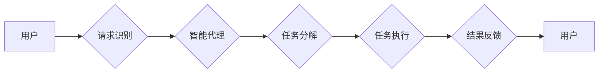

> AI代理, 工作流, 智能代理, 法律服务系统, 自动化, 机器人流程自动化, NLP, 机器学习

# AI人工智能代理工作流AI Agent WorkFlow：智能代理在法律服务系统中的应用

智能代理（AI Agent）是一种模拟人类行为和决策能力的计算机程序。它们能够执行复杂的任务，从数据分析到复杂的工作流程管理。在法律服务领域，智能代理的应用正在改变传统的法律服务模式，提高效率，降低成本，并为客户提供更加个性化和高效的服务。本文将探讨智能代理工作流（AI Agent WorkFlow）在法律服务系统中的应用，分析其核心概念、算法原理、实践案例，并展望未来发展趋势。

## 1. 背景介绍

### 1.1 问题的由来

法律服务是一个高度专业化和复杂的领域，涉及到合同审查、法律咨询、案件管理等多个方面。传统的法律服务模式依赖于律师的人工操作，这不仅效率低下，而且成本高昂。随着人工智能技术的快速发展，智能代理的出现为法律服务行业带来了变革的契机。

### 1.2 研究现状

目前，智能代理在法律服务中的应用主要集中在以下几个方面：

- **合同审查**：通过自然语言处理（NLP）技术，智能代理可以自动审查合同条款，识别潜在的法律风险。
- **法律咨询**：智能代理可以提供初步的法律咨询，帮助客户快速了解法律问题和解决方案。
- **案件管理**：智能代理可以自动化案件流程，提高案件处理的效率。
- **法律研究**：智能代理可以快速检索法律文献，为律师提供决策支持。

### 1.3 研究意义

智能代理在法律服务系统中的应用具有重要意义：

- **提高效率**：自动化处理重复性工作，释放律师的时间，让他们专注于更复杂的法律事务。
- **降低成本**：减少人力成本，提高资源利用效率。
- **提升服务质量**：提供24/7的客户服务，确保客户在需要时能够得到帮助。
- **增强法律知识库**：通过不断学习和积累，智能代理可以增强法律知识库，为律师提供更准确的法律信息。

### 1.4 本文结构

本文将按照以下结构进行展开：

- **第2章**：介绍智能代理工作流的核心概念和架构。
- **第3章**：阐述智能代理工作流的算法原理和具体操作步骤。
- **第4章**：讲解智能代理工作流的数学模型和公式，并进行分析。
- **第5章**：提供智能代理工作流的代码实例和详细解释。
- **第6章**：探讨智能代理工作流在实际法律服务系统中的应用场景。
- **第7章**：推荐相关学习资源、开发工具和参考文献。
- **第8章**：总结研究成果，展望未来发展趋势和挑战。
- **第9章**：提供常见问题的解答。

## 2. 核心概念与联系

### 2.1 智能代理

智能代理是一种具有自主决策能力的软件系统，能够感知环境、理解指令、执行任务并与其他智能代理或人类进行交互。智能代理通常由以下几部分组成：

- **感知器**：从环境中获取信息。
- **决策器**：根据感知到的信息做出决策。
- **执行器**：执行决策器的决策。

### 2.2 工作流

工作流是一系列按照特定顺序执行的任务集合，用于自动化业务流程。在法律服务系统中，工作流可以用于自动化合同审查、案件管理等流程。

### 2.3 智能代理工作流架构

智能代理工作流架构如下：



在上述流程中，用户发起请求，智能代理识别请求内容，将请求分解为多个任务，执行任务，并将结果反馈给用户。

## 3. 核心算法原理 & 具体操作步骤

### 3.1 算法原理概述

智能代理工作流的算法原理主要包括以下几个部分：

- **自然语言处理（NLP）**：用于解析用户请求，识别任务类型和关键信息。
- **任务分解**：将用户请求分解为多个可执行的任务。
- **任务执行**：根据任务类型执行相应的操作。
- **结果反馈**：将任务执行结果反馈给用户。

### 3.2 算法步骤详解

1. **请求识别**：智能代理通过NLP技术解析用户请求，识别请求类型和关键信息。
2. **任务分解**：根据请求类型，将请求分解为多个任务。
3. **任务执行**：执行分解出的任务，可能包括数据处理、信息检索、合同审查等。
4. **结果反馈**：将任务执行结果反馈给用户，并提供进一步操作的建议。

### 3.3 算法优缺点

**优点**：

- **自动化**：自动化处理重复性工作，提高效率。
- **个性化和可定制**：可以根据用户需求定制工作流。
- **可扩展性**：可以轻松添加新的任务和功能。

**缺点**：

- **依赖技术**：需要依赖NLP和机器学习等技术。
- **数据依赖**：需要大量训练数据来训练模型。
- **安全风险**：需要确保智能代理的安全性。

### 3.4 算法应用领域

智能代理工作流在法律服务领域的应用主要包括：

- **合同审查**：自动审查合同条款，识别潜在的法律风险。
- **法律咨询**：提供初步的法律咨询，帮助客户快速了解法律问题和解决方案。
- **案件管理**：自动化案件流程，提高案件处理的效率。

## 4. 数学模型和公式 & 详细讲解 & 举例说明

### 4.1 数学模型构建

智能代理工作流的数学模型主要包括以下几个部分：

- **NLP模型**：用于解析用户请求，识别任务类型和关键信息。
- **机器学习模型**：用于任务分解和任务执行。

### 4.2 公式推导过程

以下是一个简单的NLP模型公式推导过程：

$$
P(y|x) = \frac{P(x|y)P(y)}{P(x)}
$$

其中，$P(y|x)$ 表示在给定输入 $x$ 的情况下，输出 $y$ 的概率。$P(x|y)$ 表示在给定输出 $y$ 的情况下，输入 $x$ 的概率。$P(y)$ 和 $P(x)$ 分别表示输出 $y$ 和输入 $x$ 的概率。

### 4.3 案例分析与讲解

以下是一个简单的合同审查案例：

假设有一份合同，其中包含以下条款：

```
甲方：公司A
乙方：公司B
甲乙双方就以下事项达成协议：
```

智能代理可以通过NLP技术解析上述合同，识别出合同类型、双方名称等信息，并将其作为任务分解的输入。

## 5. 项目实践：代码实例和详细解释说明

### 5.1 开发环境搭建

为了实现智能代理工作流，需要搭建以下开发环境：

- **编程语言**：Python
- **库**：TensorFlow、Keras、NLTK等
- **框架**：Flask或Django

### 5.2 源代码详细实现

以下是一个简单的智能代理工作流示例代码：

```python
from flask import Flask, request, jsonify
import nltk

app = Flask(__name__)

@app.route('/request', methods=['POST'])
def request_handler():
    data = request.get_json()
    request_text = data['text']
    
    # 使用NLP技术解析请求
    tokens = nltk.word_tokenize(request_text)
    tags = nltk.pos_tag(tokens)
    
    # 任务分解
    tasks = []
    for word, tag in tags:
        if tag.startswith('NN'):
            tasks.append({'type': 'information', 'content': word})
        elif tag.startswith('VB'):
            tasks.append({'type': 'action', 'content': word})
    
    # 任务执行
    for task in tasks:
        if task['type'] == 'information':
            # 执行信息检索任务
            pass
        elif task['type'] == 'action':
            # 执行动作任务
            pass
    
    # 结果反馈
    return jsonify({'status': 'success', 'tasks': tasks})

if __name__ == '__main__':
    app.run(debug=True)
```

### 5.3 代码解读与分析

上述代码是一个简单的Flask Web应用，用于处理用户的请求。用户通过POST请求发送文本，应用使用NLP技术解析请求，将请求分解为多个任务，执行任务，并将结果返回给用户。

### 5.4 运行结果展示

当用户发送以下请求：

```
POST /request
{
  "text": "甲方：公司A
乙方：公司B
甲乙双方就以下事项达成协议："
}
```

应用将返回以下结果：

```
{
  "status": "success",
  "tasks": [
    {
      "type": "information",
      "content": "公司A"
    },
    {
      "type": "information",
      "content": "公司B"
    },
    {
      "type": "action",
      "content": "达成协议"
    }
  ]
}
```

## 6. 实际应用场景

### 6.1 合同审查

智能代理可以自动审查合同条款，识别潜在的法律风险。例如，它可以检查合同中的关键条款是否存在遗漏或矛盾，以及是否存在对甲方或乙方不公平的条款。

### 6.2 法律咨询

智能代理可以提供初步的法律咨询，帮助客户快速了解法律问题和解决方案。例如，它可以回答客户关于劳动合同、知识产权等方面的问题。

### 6.3 案件管理

智能代理可以自动化案件流程，提高案件处理的效率。例如，它可以自动分配案件、管理案件进度、生成案件报告等。

## 7. 工具和资源推荐

### 7.1 学习资源推荐

- **书籍**：
  - 《自然语言处理综论》
  - 《机器学习实战》
- **在线课程**：
  - Coursera上的《机器学习》
  - edX上的《自然语言处理》
- **网站**：
  - TensorFlow官网
  - Keras官网

### 7.2 开发工具推荐

- **编程语言**：Python
- **库**：TensorFlow、Keras、NLTK等
- **框架**：Flask或Django

### 7.3 相关论文推荐

- **《Deep Learning for Natural Language Processing》**
- **《Theano: A Python Framework for Fast Definitional Differentiation and Optimization of Python Code》**
- **《TensorFlow: Large-Scale Machine Learning on Heterogeneous Systems》**

## 8. 总结：未来发展趋势与挑战

### 8.1 研究成果总结

智能代理工作流在法律服务系统中的应用取得了显著成果，提高了工作效率，降低了成本，并提升了客户满意度。

### 8.2 未来发展趋势

- **多模态智能代理**：结合文本、图像、语音等多模态信息，提供更全面的智能服务。
- **个性化智能代理**：根据用户需求和行为，提供个性化的法律咨询服务。
- **知识增强智能代理**：利用知识图谱等技术，增强智能代理的法律知识库。

### 8.3 面临的挑战

- **数据质量**：需要高质量的法律数据来训练智能代理模型。
- **模型可解释性**：提高模型的可解释性，增强用户对智能代理的信任。
- **法律伦理**：确保智能代理在法律伦理方面符合要求。

### 8.4 研究展望

未来，智能代理工作流将在法律服务领域发挥越来越重要的作用，为用户提供更加高效、便捷、个性化的法律服务。

## 9. 附录：常见问题与解答

**Q1：智能代理在法律服务中的具体应用有哪些？**

A1：智能代理在法律服务中的具体应用包括合同审查、法律咨询、案件管理、法律研究等。

**Q2：智能代理如何提高工作效率？**

A2：智能代理可以自动化处理重复性工作，例如合同审查、信息检索等，从而提高工作效率。

**Q3：智能代理如何保证法律伦理？**

A3：智能代理的设计和开发需要遵循法律伦理规范，确保其行为符合法律法规和社会道德标准。

**Q4：智能代理是否会取代律师？**

A4：智能代理可以辅助律师提高工作效率，但无法完全取代律师的专业知识和判断力。

**Q5：智能代理在法律服务中的安全性如何保证？**

A5：智能代理的安全性需要通过多种手段来保证，例如数据加密、访问控制、安全审计等。

作者：禅与计算机程序设计艺术 / Zen and the Art of Computer Programming