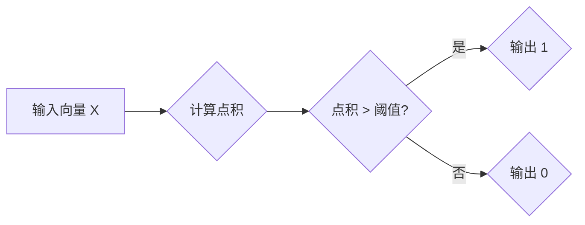
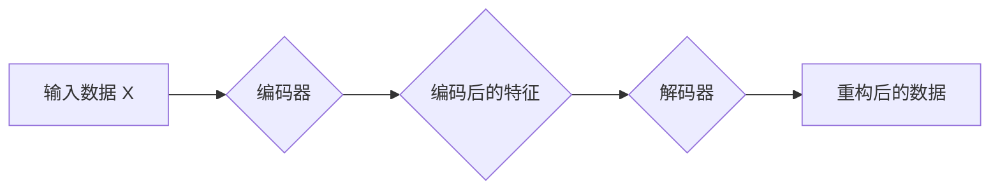
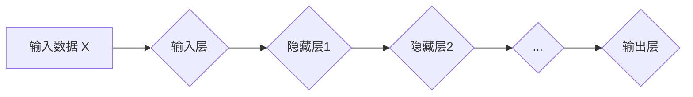
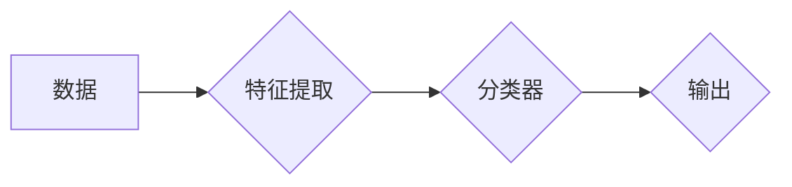

> 人工智能, 认知建模, 深度学习, 神经网络, 感知机, 自编码器, 模式识别, 感知计算

# AI人工智能核心算法原理与代码实例讲解：认知建模

人工智能（Artificial Intelligence, AI）作为计算机科学的一个分支，旨在创建能够模拟、延伸和扩展人类智能的理论、方法、技术和应用系统。认知建模是人工智能领域中一个重要的研究方向，它试图通过模拟人类认知过程的机制，来构建能够理解和处理复杂信息系统的智能系统。本文将深入探讨认知建模的核心算法原理，并通过代码实例进行详细讲解。

## 1. 背景介绍

认知建模起源于对人类认知过程的研究，旨在理解人类如何感知、思考、学习和决策。随着深度学习技术的发展，认知建模的研究方法和应用领域得到了极大的扩展。本文将重点关注以下几个核心算法：

- 感知机（Perceptron）
- 自编码器（Autoencoder）
- 深度神经网络（Deep Neural Network）
- 模式识别（Pattern Recognition）

这些算法不仅在认知建模领域有着重要的应用，也是现代人工智能技术的基础。

## 2. 核心概念与联系

### 2.1 感知机

感知机是一种简单的神经网络模型，由单个神经元组成，用于分类二分类问题。它的基本原理是计算输入向量与权重向量的点积，如果点积大于某个阈值，则输出1，否则输出0。



### 2.2 自编码器

自编码器是一种无监督学习算法，它通过学习输入数据的压缩和重构来提取特征。自编码器通常由编码器和解码器两部分组成。



### 2.3 深度神经网络

深度神经网络是由多层感知机组成的复杂神经网络，它能够学习复杂的数据表示。深度神经网络的架构可以从单层感知机扩展到多层感知机，再到卷积神经网络（CNN）和循环神经网络（RNN）。



### 2.4 模式识别

模式识别是人工智能的一个基本任务，它涉及到从数据中提取有用的信息，并用于分类或回归。模式识别算法通常需要大量的训练数据。



## 3. 核心算法原理 & 具体操作步骤

### 3.1 算法原理概述

#### 3.1.1 感知机

感知机的原理是计算输入向量与权重向量的点积，并根据点积与阈值的比较结果来决定输出。

#### 3.1.2 自编码器

自编码器的原理是学习一个编码器和解码器，使得编码器能够将输入数据压缩成一个低维表示，而解码器能够将这个低维表示重构回原始数据。

#### 3.1.3 深度神经网络

深度神经网络的原理是多层神经网络通过前向传播和反向传播来学习数据表示。

#### 3.1.4 模式识别

模式识别的原理是通过学习数据特征来构建分类器或回归模型。

### 3.2 算法步骤详解

#### 3.2.1 感知机

1. 初始化权重向量。
2. 计算输入向量与权重向量的点积。
3. 根据点积与阈值的比较结果输出1或0。

#### 3.2.2 自编码器

1. 初始化编码器和解码器的权重。
2. 使用输入数据训练编码器和解码器。
3. 使用训练好的编码器和解码器进行数据的压缩和重构。

#### 3.2.3 深度神经网络

1. 初始化网络权重。
2. 使用训练数据训练网络。
3. 使用训练好的网络进行预测。

#### 3.2.4 模式识别

1. 提取数据特征。
2. 使用特征训练分类器或回归模型。
3. 使用训练好的模型进行预测。

### 3.3 算法优缺点

#### 3.3.1 感知机

优点：简单、易于实现。
缺点：只能处理线性可分问题。

#### 3.3.2 自编码器

优点：能够学习数据的特征。
缺点：训练过程可能需要大量的数据。

#### 3.3.3 深度神经网络

优点：能够学习复杂的数据表示。
缺点：需要大量的数据和计算资源。

#### 3.3.4 模式识别

优点：能够处理各种分类和回归问题。
缺点：需要大量的训练数据。

### 3.4 算法应用领域

#### 3.4.1 感知机

应用领域：简单的二分类问题。

#### 3.4.2 自编码器

应用领域：特征提取、数据压缩。

#### 3.4.3 深度神经网络

应用领域：图像识别、语音识别、自然语言处理。

#### 3.4.4 模式识别

应用领域：分类、回归、聚类。

## 4. 数学模型和公式 & 详细讲解 & 举例说明

### 4.1 数学模型构建

#### 4.1.1 感知机

感知机的数学模型可以表示为：

$$
f(x) = \text{sign}(w \cdot x + b)
$$

其中，$w$ 是权重向量，$x$ 是输入向量，$b$ 是偏置，$\text{sign}$ 是符号函数。

#### 4.1.2 自编码器

自编码器的数学模型可以表示为：

$$
z = \sigma(W_h h)
$$

$$
x' = \sigma(W_g g(z))
$$

其中，$W_h$ 和 $W_g$ 分别是编码器和解码器的权重矩阵，$h$ 是编码后的特征，$g$ 和 $\sigma$ 分别是激活函数和解码器函数。

#### 4.1.3 深度神经网络

深度神经网络的数学模型可以表示为：

$$
h_l = \sigma(W_{l-1} h_{l-1} + b_l)
$$

其中，$W_{l-1}$ 是第 $l-1$ 层的权重矩阵，$h_{l-1}$ 是第 $l-1$ 层的输出，$b_l$ 是第 $l$ 层的偏置，$\sigma$ 是激活函数。

#### 4.1.4 模式识别

模式识别的数学模型可以表示为：

$$
y = \text{softmax}(W_x h)
$$

其中，$W_x$ 是权重矩阵，$h$ 是特征向量，$\text{softmax}$ 是softmax函数。

### 4.2 公式推导过程

#### 4.2.1 感知机

感知机的推导过程涉及到符号函数的定义和梯度下降算法。

#### 4.2.2 自编码器

自编码器的推导过程涉及到编码器和解码器的训练目标函数，以及反向传播算法。

#### 4.2.3 深度神经网络

深度神经网络的推导过程涉及到梯度下降算法和多层神经网络的结构。

#### 4.2.4 模式识别

模式识别的推导过程涉及到softmax函数的定义和交叉熵损失函数。

### 4.3 案例分析与讲解

#### 4.3.1 感知机

以下是一个感知机的简单例子：

```python
import numpy as np

def perceptron(x, w, b):
    return np.sign(np.dot(x, w) + b)

# 初始化权重和偏置
w = np.random.randn(2, 1)
b = np.random.randn(1)

# 训练数据
x_train = np.array([[1, 0], [0, 1], [1, 1]])
y_train = np.array([1, 1, -1])

# 训练过程
for epoch in range(100):
    for x, y in zip(x_train, y_train):
        output = perceptron(x, w, b)
        if output != y:
            w += (y - output) * x
            b += (y - output)

# 测试数据
x_test = np.array([[1, 1]])
output = perceptron(x_test, w, b)
print("Predicted output:", output)
```

#### 4.3.2 自编码器

以下是一个自编码器的简单例子：

```python
import numpy as np

def sigmoid(x):
    return 1 / (1 + np.exp(-x))

def autoencoder(x, W_enc, b_enc, W_dec, b_dec):
    h = sigmoid(np.dot(x, W_enc) + b_enc)
    x_hat = sigmoid(np.dot(h, W_dec) + b_dec)
    return x_hat

# 初始化权重和偏置
W_enc = np.random.randn(3, 2)
b_enc = np.random.randn(2)
W_dec = np.random.randn(2, 3)
b_dec = np.random.randn(3)

# 训练数据
x_train = np.array([[1, 0, 0], [0, 1, 0], [0, 0, 1]])
y_train = x_train

# 训练过程
for epoch in range(100):
    for x in x_train:
        x_hat = autoencoder(x, W_enc, b_enc, W_dec, b_dec)
        error = np.linalg.norm(x - x_hat)
        W_enc += np.dot(x - x_hat, x.T)
        b_enc += (x - x_hat)
        W_dec += np.dot(x_hat - x, h.T)
        b_dec += (x_hat - x)

# 测试数据
x_test = np.array([[0, 1, 0]])
x_hat = autoencoder(x_test, W_enc, b_enc, W_dec, b_dec)
print("Reconstructed output:", x_hat)
```

#### 4.3.3 深度神经网络

以下是一个深度神经网络的简单例子：

```python
import numpy as np

def sigmoid(x):
    return 1 / (1 + np.exp(-x))

def relu(x):
    return np.maximum(0, x)

def deep_neural_network(x, W1, b1, W2, b2):
    h1 = sigmoid(np.dot(x, W1) + b1)
    h2 = relu(np.dot(h1, W2) + b2)
    return h2

# 初始化权重和偏置
W1 = np.random.randn(2, 3)
b1 = np.random.randn(3)
W2 = np.random.randn(3, 1)
b2 = np.random.randn(1)

# 训练数据
x_train = np.array([[1, 0], [0, 1], [1, 1]])
y_train = np.array([1, -1, 1])

# 训练过程
for epoch in range(100):
    for x, y in zip(x_train, y_train):
        h1 = sigmoid(np.dot(x, W1) + b1)
        h2 = relu(np.dot(h1, W2) + b2)
        error = np.linalg.norm(h2 - y)
        d_h2 = h2 - y
        d_h1 = np.dot(d_h2, W2.T) * (h1 > 0)
        W2 += np.dot(d_h1, h1.T)
        b2 += d_h2
        d_W1 = np.dot(d_h1, x.T)
        b1 += d_h1

# 测试数据
x_test = np.array([[1, 1]])
h1 = sigmoid(np.dot(x_test, W1) + b1)
h2 = relu(np.dot(h1, W2) + b2)
print("Predicted output:", h2)
```

#### 4.3.4 模式识别

以下是一个模式识别的简单例子：

```python
import numpy as np

def softmax(x):
    exp_x = np.exp(x - np.max(x))
    return exp_x / np.sum(exp_x)

def cross_entropy_loss(y_true, y_pred):
    return -np.sum(y_true * np.log(y_pred))

# 初始化权重和偏置
W = np.random.randn(2, 3)
b = np.random.randn(3)

# 训练数据
x_train = np.array([[1, 0], [0, 1], [1, 1]])
y_train = np.array([[1], [0], [1]])

# 训练过程
for epoch in range(100):
    h = softmax(np.dot(x_train, W) + b)
    error = cross_entropy_loss(y_train, h)
    d_W = np.dot(y_train - h, x_train.T)
    d_b = y_train - h
    W += d_W
    b += d_b

# 测试数据
x_test = np.array([[1, 1]])
h = softmax(np.dot(x_test, W) + b)
print("Predicted output:", h)
```

## 5. 项目实践：代码实例和详细解释说明

### 5.1 开发环境搭建

为了进行认知建模的实践，你需要安装以下开发环境：

1. Python 3.6或更高版本
2. NumPy
3. Matplotlib
4. scikit-learn

你可以通过以下命令来安装这些依赖项：

```bash
pip install numpy matplotlib scikit-learn
```

### 5.2 源代码详细实现

以下是一个简单的认知建模项目的代码实现：

```python
import numpy as np
import matplotlib.pyplot as plt
from sklearn.datasets import make_classification

# 创建一个简单的二分类数据集
X, y = make_classification(n_samples=100, n_features=2, n_informative=2, n_redundant=0, n_clusters_per_class=1, random_state=4)

# 使用感知机进行分类
def perceptron(x, w, b):
    return np.sign(np.dot(x, w) + b)

# 初始化权重和偏置
w = np.random.randn(2, 1)
b = np.random.randn(1)

# 训练过程
for epoch in range(100):
    for x, y in zip(X, y):
        output = perceptron(x, w, b)
        if output != y:
            w += (y - output) * x
            b += (y - output)

# 绘制决策边界
plt.scatter(X[:, 0], X[:, 1], c=y)
plt.xlabel('Feature 1')
plt.ylabel('Feature 2')
plt.axvline(x=-b/w[0], color='k', linestyle='--', lw=2)
plt.show()
```

### 5.3 代码解读与分析

上述代码创建了一个简单的二分类数据集，并使用感知机进行分类。首先，它定义了一个感知机函数，该函数计算输入向量与权重向量的点积，并根据点积与阈值的比较结果来决定输出。然后，它初始化权重和偏置，并使用梯度下降算法进行训练。最后，它绘制了感知机的决策边界。

### 5.4 运行结果展示

运行上述代码将生成一个散点图，其中显示了数据集的分布和感知机的决策边界。

## 6. 实际应用场景

认知建模的应用非常广泛，以下是一些常见的应用场景：

- 机器学习中的特征提取
- 人工智能中的模式识别
- 自然语言处理中的文本分类
- 计算机视觉中的图像识别
- 语音识别中的说话人识别

## 7. 工具和资源推荐

### 7.1 学习资源推荐

- 《深度学习》（Ian Goodfellow等著）
- 《模式识别与机器学习》（Christopher Bishop著）
- 《神经网络与深度学习》（邱锡鹏著）

### 7.2 开发工具推荐

- Python
- NumPy
- Matplotlib
- scikit-learn
- TensorFlow
- PyTorch

### 7.3 相关论文推荐

- "Learning Representations by Back-Propagating Errors"（Rumelhart等著）
- "Back-Propagation"（Rumelhart等著）
- "Deep Learning"（Ian Goodfellow等著）

## 8. 总结：未来发展趋势与挑战

### 8.1 研究成果总结

本文深入探讨了认知建模的核心算法原理，并通过代码实例进行了详细讲解。我们介绍了感知机、自编码器、深度神经网络和模式识别等算法的基本原理和操作步骤，并分析了它们的优缺点和应用领域。

### 8.2 未来发展趋势

未来认知建模的发展趋势包括：

- 深度学习技术的进一步发展
- 人工智能与认知科学的结合
- 认知建模在更多领域的应用

### 8.3 面临的挑战

认知建模面临的挑战包括：

- 计算资源的限制
- 数据的可用性和质量
- 算法的可解释性和可靠性

### 8.4 研究展望

认知建模的研究展望包括：

- 开发更加高效和可解释的算法
- 在更多领域应用认知建模技术
- 推动人工智能与认知科学的融合

## 9. 附录：常见问题与解答

### 9.1 常见问题

**Q1：什么是认知建模？**

A1：认知建模是人工智能领域的一个研究方向，它试图通过模拟人类认知过程的机制，来构建能够理解和处理复杂信息系统的智能系统。

**Q2：什么是感知机？**

A2：感知机是一种简单的神经网络模型，由单个神经元组成，用于分类二分类问题。

**Q3：什么是自编码器？**

A3：自编码器是一种无监督学习算法，它通过学习输入数据的压缩和重构来提取特征。

**Q4：什么是深度神经网络？**

A4：深度神经网络是由多层感知机组成的复杂神经网络，它能够学习复杂的数据表示。

**Q5：什么是模式识别？**

A5：模式识别是人工智能的一个基本任务，它涉及到从数据中提取有用的信息，并用于分类或回归。

### 9.2 解答

**A1：认知建模是人工智能领域的一个研究方向，它试图通过模拟人类认知过程的机制，来构建能够理解和处理复杂信息系统的智能系统。**

**A2：感知机是一种简单的神经网络模型，由单个神经元组成，用于分类二分类问题。它的基本原理是计算输入向量与权重向量的点积，并根据点积与阈值的比较结果来决定输出。**

**A3：自编码器是一种无监督学习算法，它通过学习输入数据的压缩和重构来提取特征。自编码器通常由编码器和解码器两部分组成。**

**A4：深度神经网络是由多层感知机组成的复杂神经网络，它能够学习复杂的数据表示。深度神经网络的架构可以从单层感知机扩展到多层感知机，再到卷积神经网络（CNN）和循环神经网络（RNN）。**

**A5：模式识别是人工智能的一个基本任务，它涉及到从数据中提取有用的信息，并用于分类或回归。模式识别算法通常需要大量的训练数据。**

作者：禅与计算机程序设计艺术 / Zen and the Art of Computer Programming